<!--
CO_OP_TRANSLATOR_METADATA:
{
  "original_hash": "71f7d7dafa1c7194d79ddac87f669ff9",
  "translation_date": "2026-01-07T03:29:03+00:00",
  "source_file": "2-js-basics/2-functions-methods/README.md",
  "language_code": "cs"
}
-->
# Základy JavaScriptu: Metody a funkce


> Sketchnote od [Tomomi Imura](https://twitter.com/girlie_mac)

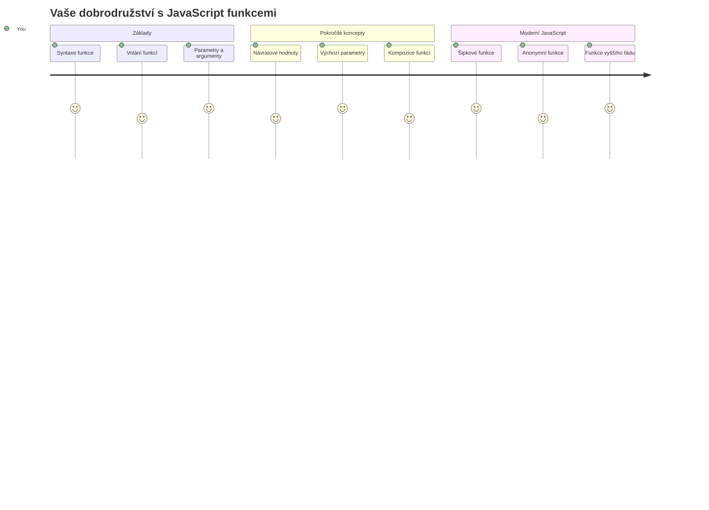
## Přednáškový kvíz
[Přednáškový kvíz](https://ff-quizzes.netlify.app)

Opakované psaní stejného kódu je jednou z nejčastějších frustrací při programování. Funkce tento problém řeší tím, že vám umožní zabalit kód do znovupoužitelných bloků. Fungují jako standardizované součástky, které udělaly výrobní linku Henryho Forda revoluční – jakmile vytvoříte spolehlivou komponentu, můžete ji použít kdekoliv, aniž byste ji museli znovu stavět od nuly.

Funkce vám umožní seskupit části kódu, abyste je mohli znovu využívat v celém programu. Místo kopírování a vkládání stejné logiky všude můžete funkci vytvořit jednou a volat ji kdykoli potřeba. Tento přístup udržuje váš kód organizovaný a usnadňuje aktualizace.

V této lekci se naučíte, jak si vytvořit vlastní funkce, předávat jim informace a získat užitečné výsledky zpět. Objevíte rozdíl mezi funkcemi a metodami, naučíte se moderní syntaxi a uvidíte, jak funkce mohou spolupracovat s jinými funkcemi. Tyto koncepty budeme budovat krok za krokem.

[](https://youtube.com/watch?v=XgKsD6Zwvlc "Metody a funkce")

> 🎥 Klikněte na obrázek výše pro video o metodách a funkcích.

> Tuto lekci si můžete projít na [Microsoft Learn](https://docs.microsoft.com/learn/modules/web-development-101-functions/?WT.mc_id=academic-77807-sagibbon)!

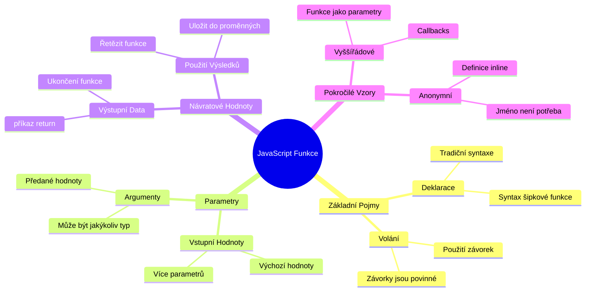
## Funkce

Funkce je samostatný blok kódu, který provádí konkrétní úkol. Zapouzdřuje logiku, kterou můžete spustit, kdykoli je potřeba.

Místo psaní stejného kódu několikrát v celém programu ho můžete zabalit do funkce a volat ji vždy, když to potřebujete. Tento přístup udržuje kód přehledný a usnadňuje aktualizace. Představte si jen, jak náročná by byla údržba, pokud byste potřebovali změnit logiku roztroušenou na 20 různých místech v kódu.

Důležité je funkce pojmenovávat výstižně. Dobře pojmenovaná funkce jasně říká, co dělá – když vidíte `cancelTimer()`, hned víte, co ta funkce provede, stejně jako jasně označené tlačítko vám přesně řekne, co se stane po kliknutí.

## Vytvoření a volání funkce

Podívejme se, jak si funkci vytvořit. Syntax má konzistentní vzor:

```javascript
function nameOfFunction() { // definice funkce
 // definice/tělo funkce
}
```

Rozložme si to:
- Klíčové slovo `function` říká JavaScriptu "Hej, tvořím funkci!"
- `nameOfFunction` je místo, kde dáte funkci popisný název
- Kulaté závorky `()` jsou místo, kde mohou být parametry (k tomu se brzy dostaneme)
- Složené závorky `{}` obsahují skutečný kód, který se spustí, když funkci zavoláte

Vytvořme jednoduchou funkci pozdravu, abychom to viděli v praxi:

```javascript
function displayGreeting() {
  console.log('Hello, world!');
}
```

Tato funkce vypíše "Hello, world!" do konzole. Jakmile ji definujete, můžete ji použít tolikrát, kolikrát chcete.

Pro spuštění (neboli "volání") funkce napište její jméno následované závorkami. JavaScript vám dovolí definovat funkci před nebo po jejím zavolání – JavaScript engine se postará o pořadí spuštění.

```javascript
// volání naší funkce
displayGreeting();
```

Když tento řádek spustíte, vykoná se veškerý kód uvnitř funkce `displayGreeting`, zobrazí se "Hello, world!" v konzoli vašeho prohlížeče. Můžete tuto funkci volat opakovaně.

### 🧠 **Základní kontrola funkcí: Vytvoření vašich prvních funkcí**

**Podívejme se, jak vám jdou základní funkce:**
- Dokážete vysvětlit, proč používáme složené závorky `{}` při definici funkcí?
- Co se stane, když napíšete `displayGreeting` bez závorek?
- Proč byste chtěli jednu funkci volat vícekrát?

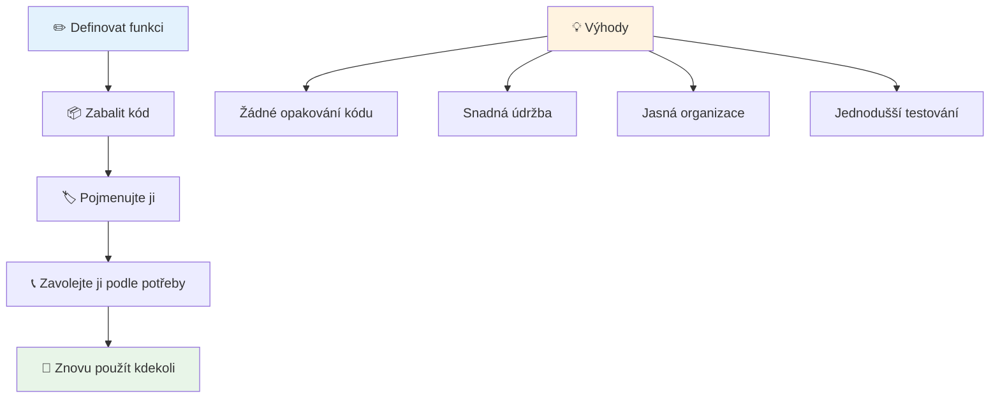
> **Poznámka:** V těchto lekcích jste používali **metody**. `console.log()` je metoda – v podstatě funkce, která patří objektu `console`. Klíčový rozdíl je ten, že metody jsou připojené k objektům, zatímco funkce stojí samostatně. Mnoho vývojářů tyto termíny v běžné řeči zaměňuje.

### Nejlepší postupy při psaní funkcí

Zde je pár rad, jak psát skvělé funkce:

- Dávejte funkcím jasné, výstižné názvy – vaše budoucí já vám poděkuje!
- Používejte **camelCase** u víceslovných názvů (například `calculateTotal` místo `calculate_total`)
- Každá funkce by měla dělat jednu věc dobře

## Předávání informací do funkce

Naše funkce `displayGreeting` je omezená – umí zobrazit jen „Hello, world!“ pro každého. Parametry nám umožňují dělat funkce flexibilnější a užitečnější.

**Parametry** fungují jako zástupná místa, kam můžete při každém volání vložit jiné hodnoty. Takže stejná funkce může s různými informacemi fungovat pokaždé jinak.

Parametry vypisujete do závorek při definici funkce, více parametrů oddělíte čárkou:

```javascript
function name(param, param2, param3) {

}
```

Každý parametr je jako zástupné místo – když někdo funkci zavolá, dodá skutečné hodnoty, které se do těchto míst dosadí.

Aktualizujme pozdrav, aby přijímal jméno:

```javascript
function displayGreeting(name) {
  const message = `Hello, ${name}!`;
  console.log(message);
}
```

Všimněte si, že používáme zpětné apostrofy (`` ` ``) a `${}`, abychom jméno vložili přímo do zprávy – tomu se říká šablonový literál a je to opravdu užitečný způsob vytváření textu s proměnnými.

Teď, když funkci zavoláme, můžeme předat libovolné jméno:

```javascript
displayGreeting('Christopher');
// zobrazí "Ahoj, Christopher!" po spuštění
```

JavaScript vezme řetězec `'Christopher'`, přiřadí ho parametru `name` a vytvoří personalizovanou zprávu "Hello, Christopher!"

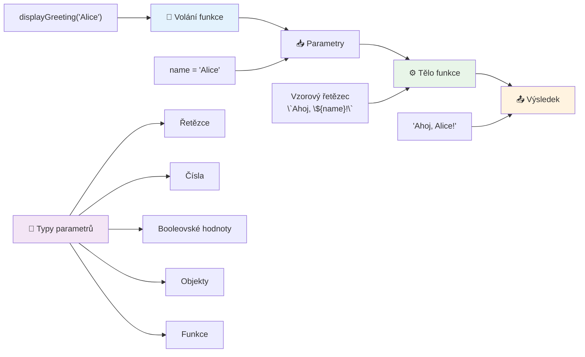
## Výchozí hodnoty

Co když chceme, aby některé parametry byly nepovinné? Tady přicházejí na řadu výchozí hodnoty!

Řekněme, že chceme umožnit uživatelům přizpůsobit oslovení, ale pokud ho neuvedou, použijeme "Hello" jako výchozí. Výchozí hodnoty nastavíte pomocí rovná se, podobně jako při přiřazování proměnné:

```javascript
function displayGreeting(name, salutation='Hello') {
  console.log(`${salutation}, ${name}`);
}
```

Tady je `name` stále povinné, ale `salutation` má záložní hodnotu `'Hello'`, pokud nikdo nezadá oslovení.

Funkci tak můžeme volat dvěma způsoby:

```javascript
displayGreeting('Christopher');
// zobrazuje "Ahoj, Christopher"

displayGreeting('Christopher', 'Hi');
// zobrazuje "Čau, Christopher"
```

V prvním volání JavaScript použije výchozí „Hello“, protože jsme neurčili oslovení. Ve druhém volání naopak použije naše vlastní „Hi“. Tato flexibilita dělá funkce přizpůsobivé různým situacím.

### 🎛️ **Kontrola osvojení parametrů: Udělejte funkce flexibilními**

**Otestujte své znalosti parametrů:**
- Jaký je rozdíl mezi parametrem a argumentem?
- Proč jsou výchozí hodnoty užitečné v reálném programování?
- Dokážete předpovědět, co se stane, když předáte více argumentů než parametrů?

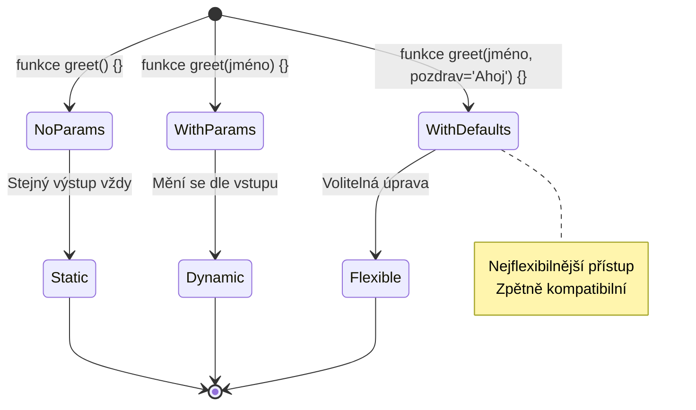
> **Profesionální tip**: Výchozí parametry činí vaše funkce uživatelsky přívětivější. Uživatelé mohou rychle začít s rozumnými hodnotami, ale přitom mají možnost přizpůsobit si je podle potřeby!

## Návratové hodnoty

Dosud naše funkce pouze vypisovaly zprávy do konzole, ale co když chcete, aby funkce něco spočítala a vrátila výsledek?

Tady přicházejí na řadu **návratové hodnoty**. Místo pouhého zobrazení hodnoty může funkce zaslat hodnotu zpět, aby ji bylo možné uložit do proměnné nebo použít v jiných částech kódu.

Pro vrácení hodnoty použijte klíčové slovo `return` následované tím, co chcete vrátit:

```javascript
return myVariable;
```

Důležité: Když funkce narazí na `return`, okamžitě přestane běžet a pošle hodnotu zpět tomu, kdo ji volal.

Upravme naši pozdravovou funkci tak, aby zprávu vracela místo toho, aby ji tiskla:

```javascript
function createGreetingMessage(name) {
  const message = `Hello, ${name}`;
  return message;
}
```

Místo tisku pozdrav vytvoří a vrátí nám zprávu.

Vrácenou hodnotu můžeme uložit do proměnné stejně jako jinou hodnotu:

```javascript
const greetingMessage = createGreetingMessage('Christopher');
```

Nyní `greetingMessage` obsahuje "Hello, Christopher" a můžeme ji použít kdekoli v kódu – zobrazit na webu, vložit do emailu, nebo předat další funkci.

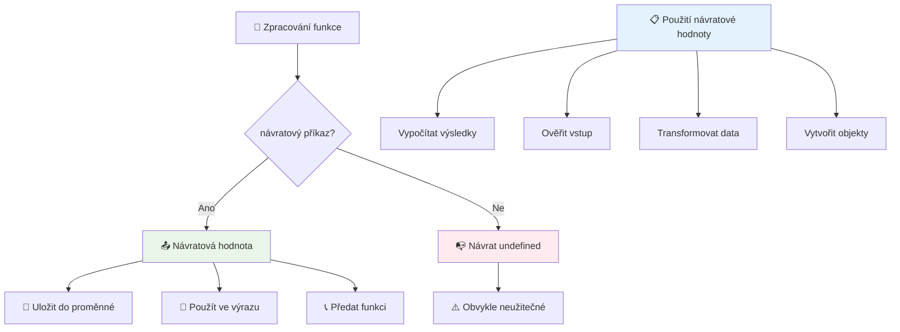
### 🔄 **Kontrola návratových hodnot: Získávání výsledků**

**Zhodnoťte porozumění návratovým hodnotám:**
- Co se stane s kódem po příkazu `return` ve funkci?
- Proč je často lepší vracet hodnoty než jen vypisovat do konzole?
- Může funkce vracet různé typy hodnot (řetězec, číslo, boolean)?

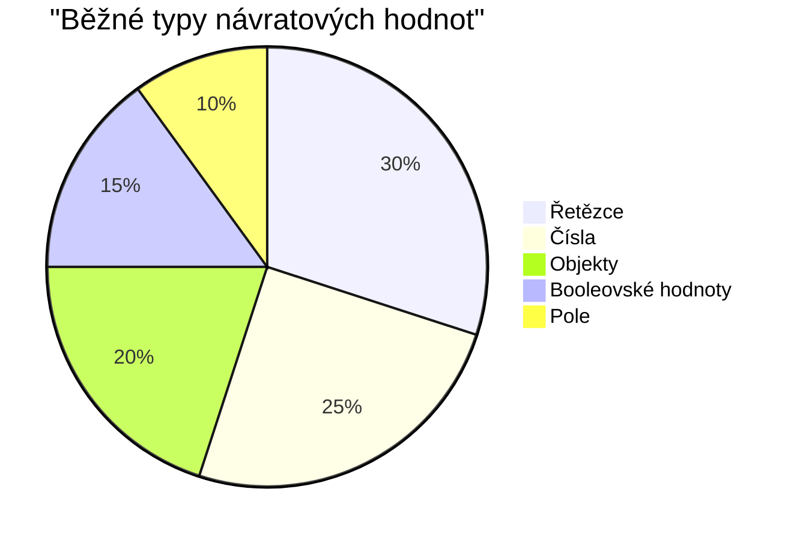
> **Klíčová poznámka**: Funkce, které vracejí hodnoty, jsou všestrannější, protože volající rozhoduje, co s výsledkem udělá. To dělá váš kód modulární a snadno znovupoužitelný!

## Funkce jako parametry funkcí

Funkce můžete předávat jako parametry do jiných funkcí. Tato koncepce může na začátku působit složitě, ale je to mocná vlastnost umožňující flexibilní programovací vzory.

Tento vzor je velmi běžný, když chcete říct: „když se něco stane, udělej toto“. Například „když timer skončí, spusť tento kód“ nebo „když uživatel klikne na tlačítko, zavolej tuto funkci“.

Podívejme se na `setTimeout`, což je vestavěná funkce, která počká stanovenou dobu a pak spustí nějaký kód. Musíme jí říct, který kód spustit – perfektní případ pro předání funkce!

Zkuste tento kód – po 3 sekundách uvidíte zprávu:

```javascript
function displayDone() {
  console.log('3 seconds has elapsed');
}
// hodnota časovače je v milisekundách
setTimeout(displayDone, 3000);
```

Všimněte si, že předáváme `displayDone` (bez závorek) do `setTimeout`. Funkci sami nevoláme – jdeme ji předat `setTimeout` a říct „zavolej to za 3 sekundy“.

### Anonymní funkce

Někdy potřebujete funkci jen pro jednu věc a nechcete jí dávat jméno. Zvažte to – pokud funkci použijete jen jednou, proč zahlcovat kód dalším názvem?

JavaScript umožňuje vytvářet **anonymní funkce** – funkce bez jména, které definujete tam, kde je potřebujete.

Tady je, jak můžeme přepsat náš timerový příklad s anonymní funkcí:

```javascript
setTimeout(function() {
  console.log('3 seconds has elapsed');
}, 3000);
```

Dosáhli jsme stejného výsledku, ale funkce je definována přímo uvnitř volání `setTimeout`, není tedy potřeba samostatná deklarace funkce.

### Šipkové funkce

Moderní JavaScript nabízí ještě kratší zápis funkcí, nazývaný **šipkové funkce**. Používají `=>` (vypadá jako šipka – chápete?) a jsou velmi populární mezi vývojáři.

Šipkové funkce umožňují vynechat klíčové slovo `function` a napsat kód stručněji.

Tady je náš timerový příklad s šipkovou funkcí:

```javascript
setTimeout(() => {
  console.log('3 seconds has elapsed');
}, 3000);
```

`()` jsou místo pro parametry (v tomto případě prázdné), následuje šipka `=>` a tělo funkce ve složených závorkách. To poskytuje stejnou funkcionalitu s kratší syntaxí.

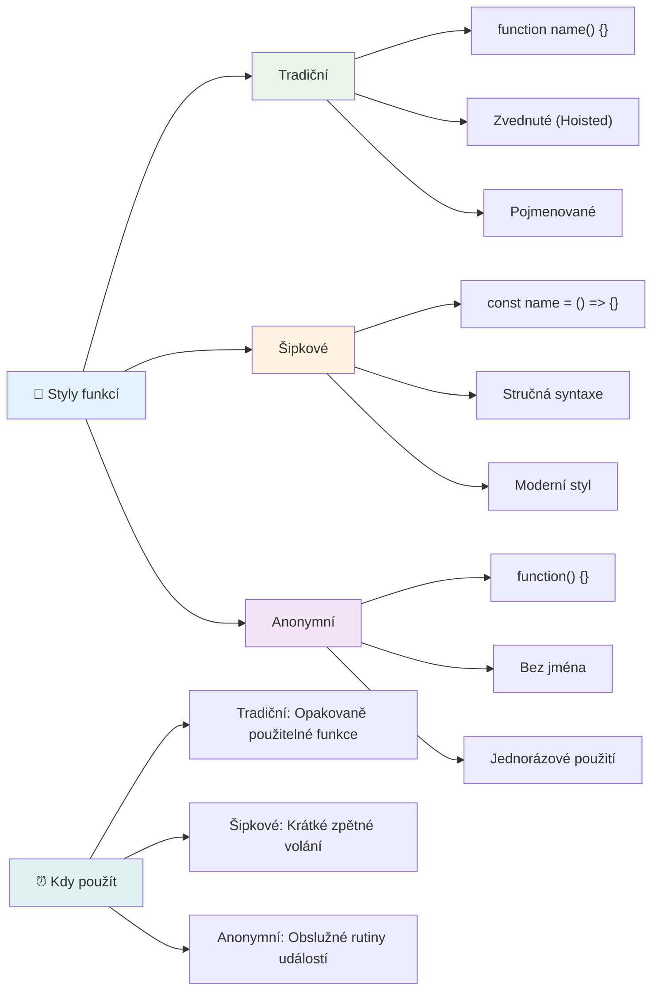
### Kdy použít kterou strategii

Kdy která metoda? Praktická rada: pokud funkci budete používat vícekrát, pojmenujte ji a definujte zvlášť. Pokud je jen pro jednorázové použití, uvažujte o anonymní funkci. Obě varianty – šipkové i tradiční – jsou platné, ale šipkové funkce jsou dominantní v moderních kódech.

### 🎨 **Ovládání stylů funkcí: Výběr správné syntaxe**

**Otestujte své porozumění syntaxi:**
- Kdy byste dali přednost šipkovým funkcím před tradiční syntaxí?
- Jaká je hlavní výhoda anonymních funkcí?
- Dokážete uvést situaci, kdy je lepší pojmenovaná funkce než anonymní?

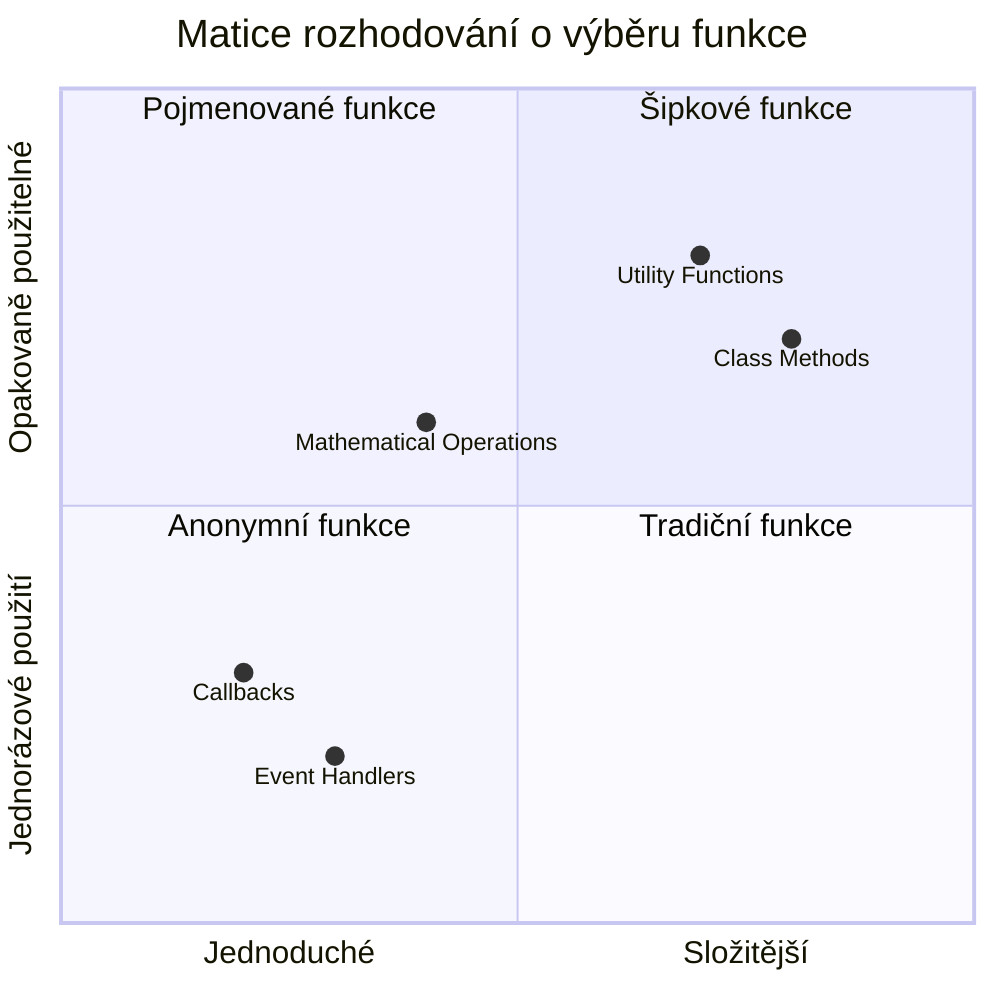
> **Moderní trend**: Šipkové funkce jsou čím dál častější volbou mnoha vývojářů díky stručné syntaxi, ale tradiční funkce mají stále své místo!

---


## 🚀 Výzva

Dokážete jednou větou vysvětlit rozdíl mezi funkcemi a metodami? Zkuste to!

## GitHub Copilot Agent Výzva 🚀

Použijte režim Agent k vyřešení následující výzvy:

**Popis:** Vytvořte užitečnou knihovnu matematických funkcí, která demonstruje různé koncepty funkcí probrané v této lekci, včetně parametrů, výchozích hodnot, návratových hodnot a šipkových funkcí.

**Zadání:** Vytvořte JavaScript soubor `mathUtils.js`, který bude obsahovat následující funkce:
1. Funkci `add`, která přijímá dva parametry a vrací jejich součet
2. Funkci `multiply` s výchozími hodnotami parametrů (druhý parametr má výchozí hodnotu 1)
3. Šipkovou funkci `square`, která přijímá číslo a vrací jeho druhou mocninu
4. Funkci `calculate`, která přijímá jinou funkci jako parametr a dvě čísla a aplikuje danou funkci na tato čísla
5. Ukázky volání všech funkcí s vhodnými testovacími případy

Více se o [agent režimu](https://code.visualstudio.com/blogs/2025/02/24/introducing-copilot-agent-mode) dozvíte zde.

## Po-přednáškový kvíz
[Po-přednáškový kvíz](https://ff-quizzes.netlify.app)

## Přehled a samostudium

Stojí za to [si přečíst trochu víc o šipkových funkcích](https://developer.mozilla.org/docs/Web/JavaScript/Reference/Functions/Arrow_functions), protože se čím dál více používají v kódech. Procvičte si psaní funkce a pak ji přepište s touto syntaxí.

## Úkol

[Zábava s funkcemi](assignment.md)

---

## 🧰 **Souhrn vašeho JavaScriptového nástroje funkcí**

```mermaid
graph TD
    A["🎯 JavaScript Funkce"] --> B["📋 Deklarace funkce"]
    A --> C["📥 Parametry"]
    A --> D["📤 Návratové hodnoty"]
    A --> E["🎨 Moderní syntaxe"]
    
    B --> B1["funkce jméno() {}"]
    B --> B2["Popisné pojmenování"]
    B --> B3["Znovupoužitelné bloky kódu"]
    
    C --> C1["Vstupní data"]
    C --> C2["Výchozí hodnoty"]
    C --> C3["Vícenásobné parametry"]
    
    D --> D1["return příkaz"]
    D --> D2["Ukončení funkce"]
    D --> D3["Předání dat zpět"]
    
    E --> E1["Šipkové funkce: () =>"]
    E --> E2["Anonymní funkce"]
    E --> E3["Funkce vyššího řádu"]
    
    F["⚡ Klíčové výhody"] --> F1["Znovupoužitelnost kódu"]
    F --> F2["Lepší organizace"]
    F --> F3["Snadnější testování"]
    F --> F4["Modulární design"]
    
    style A fill:#e3f2fd
    style B fill:#e8f5e8
    style C fill:#fff3e0
    style D fill:#f3e5f5
    style E fill:#e0f2f1
    style F fill:#fce4ec
```
---

## 🚀 Váš časový plán osvojení JavaScriptových funkcí

### ⚡ **Co zvládnete za následujících 5 minut**
- [ ] Napsat jednoduchou funkci, která vrací vaše oblíbené číslo
- [ ] Vytvořit funkci se dvěma parametry, která je sečte together
- [ ] Zkuste převést tradiční funkci na zápis pomocí arrow funkce
- [ ] Procvičte si úkol: vysvětlete rozdíl mezi funkcemi a metodami

### 🎯 **Co můžete v této hodině dokázat**
- [ ] Dokončit kvíz po lekci a zkontrolovat si nejasné koncepty
- [ ] Vytvořit knihovnu matematických utilit z výzvy GitHub Copilot
- [ ] Vytvořit funkci, která používá jinou funkci jako parametr
- [ ] Procvičit psaní funkcí s výchozími parametry
- [ ] Experimentovat s template literály ve vracených hodnotách funkcí

### 📅 **Váš týdenní mistr funkcí**
- [ ] Dokončit úkol "Zábava s funkcemi" s nápaditostí
- [ ] Refaktorovat trochu opakujícího se kódu, který jste napsali, do znovupoužitelných funkcí
- [ ] Vytvořit malou kalkulačku využívající pouze funkce (bez globálních proměnných)
- [ ] Procvičovat arrow funkce se způsoby pole jako `map()` a `filter()`
- [ ] Vytvořit kolekci utilitních funkcí pro běžné úkoly
- [ ] Studovat funkce vyššího řádu a koncepty funkcionálního programování

### 🌟 **Vaše měsíční transformace**
- [ ] Ovládnout pokročilé koncepty funkcí jako closure a rozsah (scope)
- [ ] Vytvořit projekt, který intenzivně používá kompozici funkcí
- [ ] Přispět do open source vylepšením dokumentace funkcí
- [ ] Naučit někoho dalšího o funkcích a různých stylech zápisu
- [ ] Prozkoumat funkcionální programovací paradigma v JavaScriptu
- [ ] Vytvořit osobní knihovnu znovupoužitelných funkcí pro budoucí projekty

### 🏆 **Závěrečná kontrola šampiona funkcí**

**Oslavte své mistrovství ve funkcích:**
- Jaká je nejužitečnější funkce, kterou jste zatím vytvořili?
- Jak vás učení o funkcích změnilo v pohledu na organizaci kódu?
- Který zápis funkcí preferujete a proč?
- Jaký reálný problém byste vyřešili napsáním funkce?

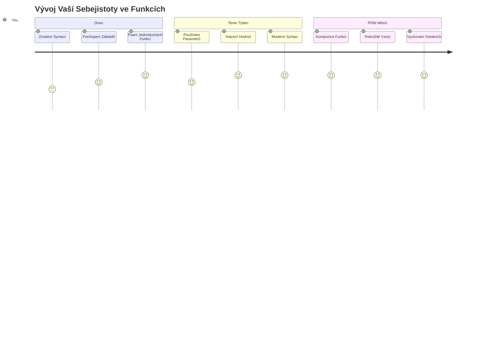
> 🎉 **Ovládli jste jeden z nejsilnějších konceptů programování!** Funkce jsou stavebními kameny větších programů. Každá aplikace, kterou kdy vytvoříte, bude používat funkce k organizaci, znovupoužití a struktuře kódu. Nyní rozumíte, jak zabalit logiku do znovupoužitelných komponent, což z vás dělá efektivnějšího a účinnějšího programátora. Vítejte ve světě modulárního programování! 🚀

---

<!-- CO-OP TRANSLATOR DISCLAIMER START -->
**Prohlášení o vyloučení odpovědnosti**:
Tento dokument byl přeložen pomocí AI překladatelské služby [Co-op Translator](https://github.com/Azure/co-op-translator). Přestože usilujeme o přesnost, mějte prosím na paměti, že automatizované překlady mohou obsahovat chyby nebo nepřesnosti. Originální dokument v jeho rodném jazyce by měl být považován za autoritativní zdroj. Pro důležité informace se doporučuje profesionální lidský překlad. Nejsme odpovědní za jakékoli nedorozumění nebo nesprávné výklady vyplývající z použití tohoto překladu.
<!-- CO-OP TRANSLATOR DISCLAIMER END -->