# Základy JavaScriptu: Rozhodování

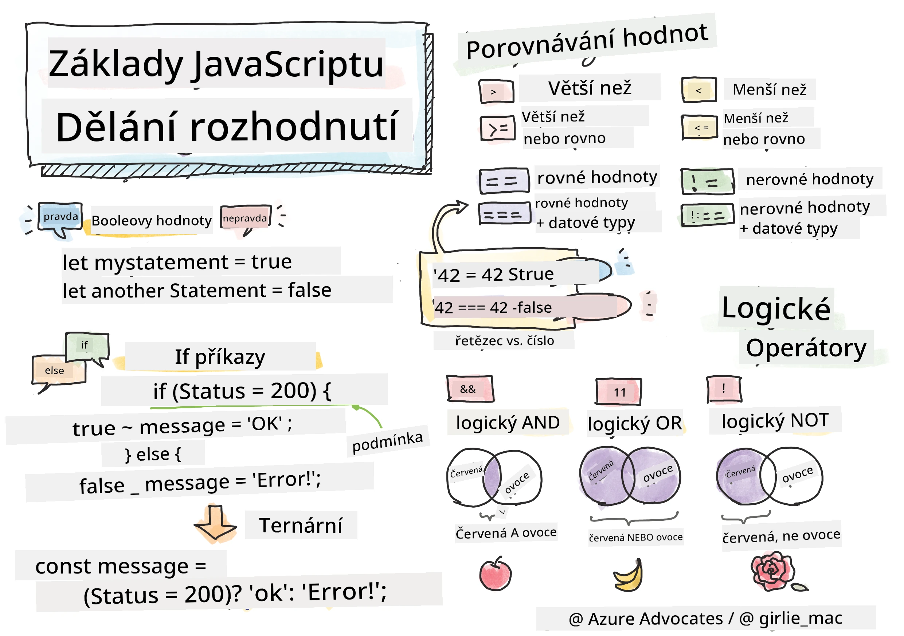

> Sketchnote od [Tomomi Imura](https://twitter.com/girlie_mac)

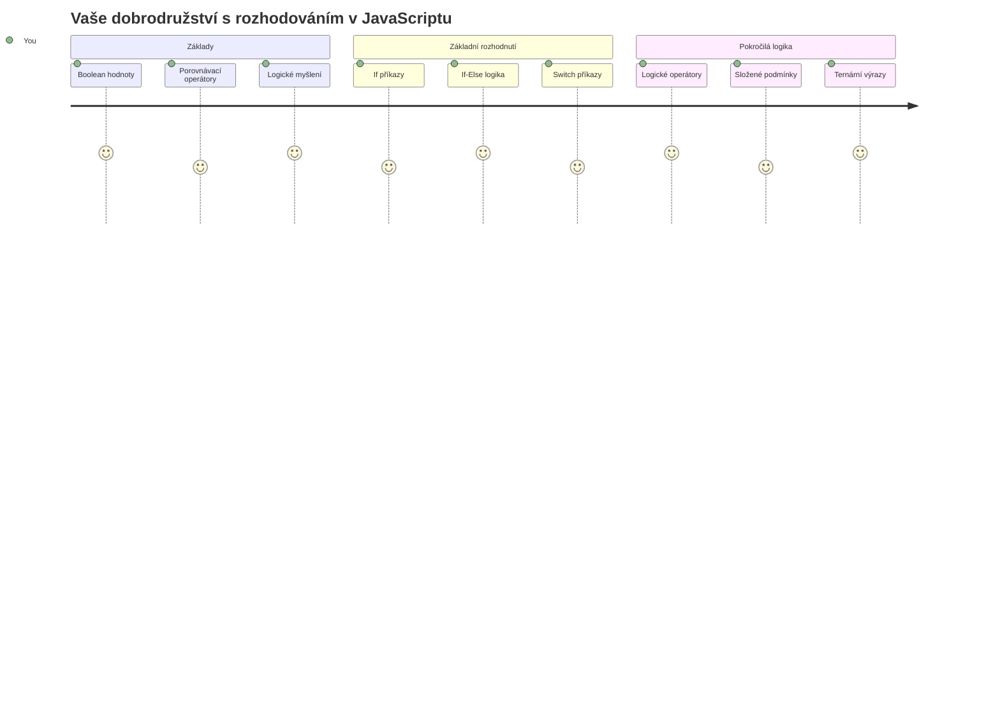
Už jste někdy přemýšleli, jak aplikace dělají chytrá rozhodnutí? Třeba jak navigační systém vybírá nejrychlejší trasu, nebo jak termostat rozhoduje, kdy zapnout topení? To je základní koncept rozhodování v programování.

Stejně jako byl analytický stroj Charlese Babbage navržen tak, aby prováděl různé sekvence operací na základě podmínek, moderní JavaScriptové programy potřebují dělat volby na základě proměnlivých okolností. Tato schopnost větvení a rozhodování proměňuje statický kód na reaktivní, inteligentní aplikace.

V této lekci se naučíte, jak implementovat podmíněnou logiku ve svých programech. Prozkoumáme podmíněné příkazy, porovnávací operátory a logické výrazy, které umožňují vašemu kódu vyhodnocovat situace a adekvátně reagovat.

## Kvíz před lekcí

[Pre-lecture quiz](https://ff-quizzes.netlify.app/web/quiz/11)

Schopnost dělat rozhodnutí a řídit tok programu je základním aspektem programování. Tato sekce pokrývá, jak kontrolovat průběh spuštění vašich JavaScriptových programů pomocí Booleovských hodnot a podmíněné logiky.

[](https://youtube.com/watch?v=SxTp8j-fMMY "Making Decisions")

> 🎥 Klikněte na obrázek výše pro video o rozhodování.

> Tuto lekci můžete absolvovat i na [Microsoft Learn](https://docs.microsoft.com/learn/modules/web-development-101-if-else/?WT.mc_id=academic-77807-sagibbon)!

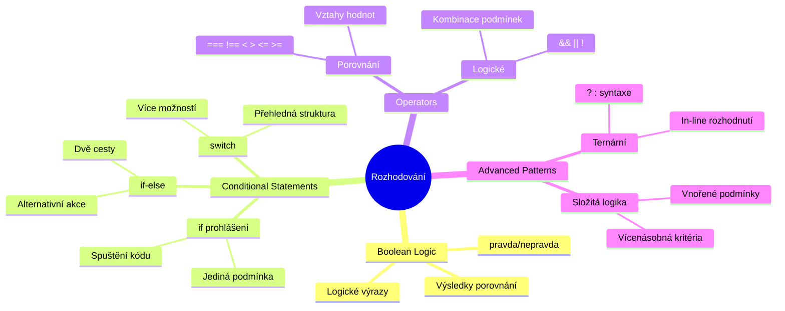
## Stručné shrnutí Booleovských hodnot

Než se pustíme do rozhodování, připomeňme si Booleovské hodnoty z naší předchozí lekce. Jsou pojmenované po matematikovi Georgi Boolovi a představují binární stavy – buď `true` nebo `false`. Žádná nejednoznačnost, žádná střední cesta.

Tyto binární hodnoty tvoří základ veškeré výpočetní logiky. Každé rozhodnutí, které váš program učiní, se nakonec redukuje na Booleovské vyhodnocení.

Vytváření Booleovských proměnných je jednoduché:

```javascript
let myTrueBool = true;
let myFalseBool = false;
```

Tím se vytvoří dvě proměnné s explicitními Booleovskými hodnotami.

✅ Booleovské hodnoty jsou pojmenovány po anglickém matematikovi, filozofovi a logikovi Georgi Boolovi (1815–1864).

## Porovnávací operátory a Booleovské hodnoty

V praxi zřídka nastavujete Booleovské hodnoty ručně. Místo toho je vytváříte vyhodnocením podmínek: „Je toto číslo větší než tamto?“ nebo „Jsou tyto hodnoty rovné?“

Porovnávací operátory umožňují tyto vyhodnocení. Porovnávají hodnoty a vrací Booleovský výsledek na základě vztahu mezi operandy.

| Symbol | Popis                                                                                                                                                      | Příklad            |
| ------ | ---------------------------------------------------------------------------------------------------------------------------------------------------------- | ------------------ |
| `<`    | **Menší než**: Porovnává dvě hodnoty a vrací Booleovskou hodnotu `true` pokud je hodnota vlevo menší než vpravo                                           | `5 < 6 // true`    |
| `<=`   | **Menší nebo rovno**: Porovnává dvě hodnoty a vrací `true` pokud je hodnota vlevo menší nebo rovna pravé hodnotě                                          | `5 <= 6 // true`   |
| `>`    | **Větší než**: Porovnává dvě hodnoty a vrací `true` pokud je hodnota vlevo větší než hodnota vpravo                                                       | `5 > 6 // false`   |
| `>=`   | **Větší nebo rovno**: Porovnává dvě hodnoty a vrací `true` pokud je hodnota vlevo větší nebo rovna pravé hodnotě                                          | `5 >= 6 // false`  |
| `===`  | **Přísná shoda**: Porovnává dvě hodnoty a vrací `true` pokud jsou hodnoty vlevo i vpravo stejného typu a stejné hodnoty                                 | `5 === 6 // false` |
| `!==`  | **Nerovnost**: Porovnává dvě hodnoty a vrací opačnou Booleovskou hodnotu než jakou by vrátila přísná shoda                                                | `5 !== 6 // true`  |

✅ Ověřte si své znalosti napsáním několika porovnání v konzoli vašeho prohlížeče. Překvapí vás nějaký vrácený výsledek?

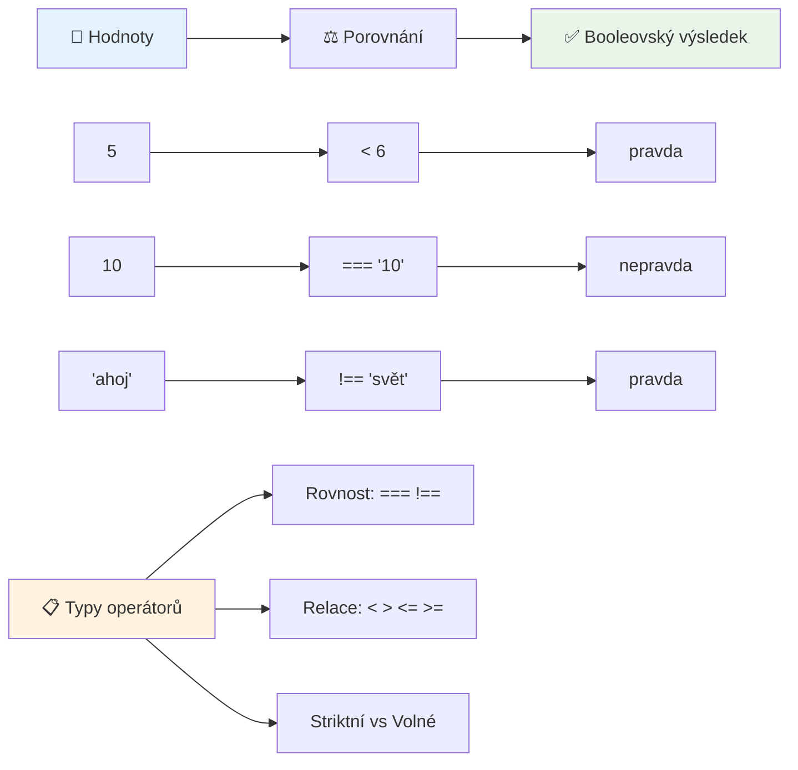
### 🧠 **Kontrola zvládnutí porovnání: Pochopení Booleovské logiky**

**Otestujte své porozumění porovnání:**
- Proč si myslíte, že `===` (přísná shoda) je obecně preferováno před `==` (volná shoda)?
- Dokážete předpovědět, co vrátí `5 === '5'`? A co `5 == '5'`?
- Jaký je rozdíl mezi `!==` a `!=`?

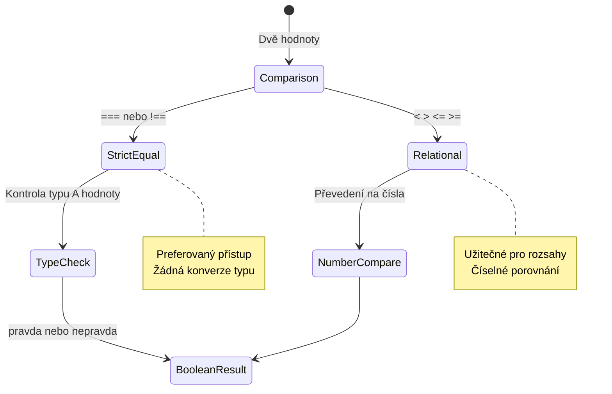
> **Profesionální tip**: Vždy používejte `===` a `!==` pro kontrolu rovnosti, pokud nepotřebujete specificky převod typů. Tím se vyhnete neočekávanému chování!

## Příkaz if

Příkaz `if` je jako pokládat otázku ve vašem kódu. „Pokud je tato podmínka pravdivá, pak udělej toto.“ Je to pravděpodobně nejdůležitější nástroj, který při rozhodování v JavaScriptu použijete.

Takto funguje:

```javascript
if (condition) {
  // Podmínka je pravdivá. Kód v tomto bloku se spustí.
}
```

Podmínka jde do závorek a pokud je `true`, JavaScript spustí kód uvnitř složených závorek. Pokud je `false`, JavaScript celý blok přeskočí.

Často použijete porovnávací operátory k vytvoření těchto podmínek. Podívejme se na praktický příklad:

```javascript
let currentMoney = 1000;
let laptopPrice = 800;

if (currentMoney >= laptopPrice) {
  // Podmínka je pravdivá. Kód v této části bude spuštěn.
  console.log("Getting a new laptop!");
}
```

Protože `1000 >= 800` se vyhodnotí jako `true`, kód uvnitř bloku se vykoná a v konzoli se objeví „Getting a new laptop!“.

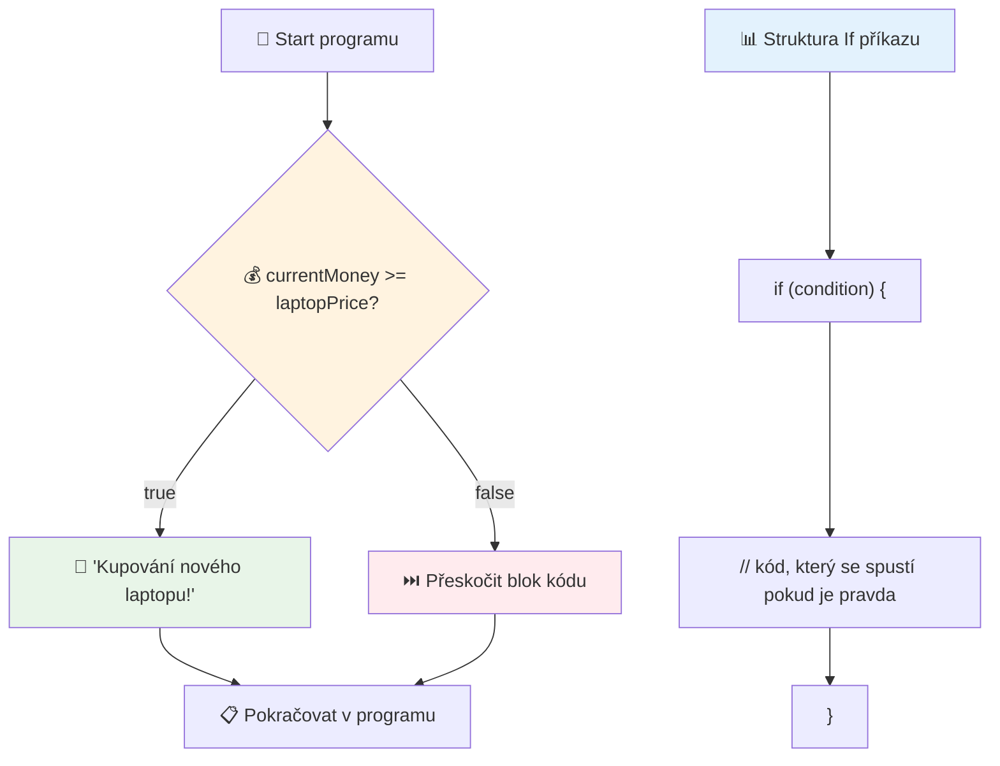
## Příkaz if..else

Co když chcete, aby váš program udělal něco jiného, když podmínka není splněna? Tady přichází na řadu `else` – je to jako mít záložní plán.

Příkaz `else` vám umožní říct: „pokud tato podmínka není pravdivá, udělej místo toho toto.“

```javascript
let currentMoney = 500;
let laptopPrice = 800;

if (currentMoney >= laptopPrice) {
  // Podmínka je pravdivá. Kód v tomto bloku se spustí.
  console.log("Getting a new laptop!");
} else {
  // Podmínka je nepravdivá. Kód v tomto bloku se spustí.
  console.log("Can't afford a new laptop, yet!");
}
```

Protože `500 >= 800` je `false`, JavaScript první blok přeskočí a vykoná blok v `else`. V konzoli uvidíte „Can't afford a new laptop, yet!“.

✅ Otestujte si porozumění tomuto kódu i následujícímu spuštěním v konzoli prohlížeče. Změňte hodnoty proměnných currentMoney a laptopPrice a sledujte, jak se mění výstup `console.log()`.

### 🎯 **Kontrola logiky if-else: Rozvětvené cesty**

**Zhodnoťte své porozumění podmíněné logice:**
- Co se stane, když `currentMoney` přesně odpovídá `laptopPrice`?
- Můžete vymyslet reálný scénář, kde by logika if-else byla užitečná?
- Jak byste to rozšířili tak, aby zpracovalo více cenových rozmezí?

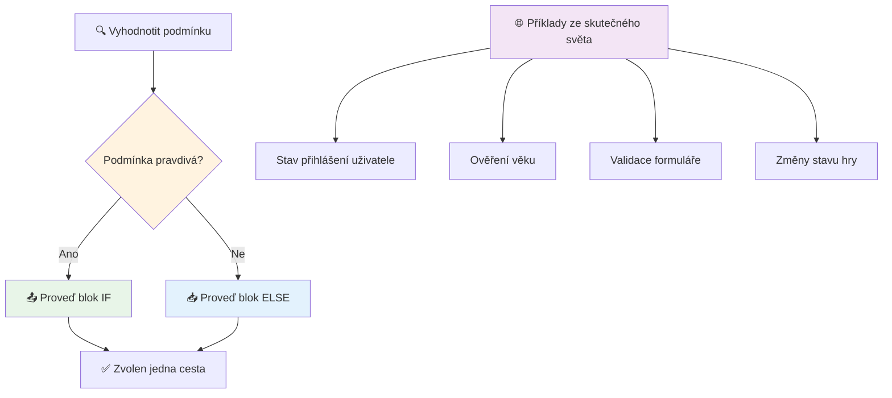
> **Klíčový vhled**: If-else zajistí, že se vykoná právě jedna větev. To garantuje, že váš program vždy odpoví na jakoukoliv podmínku!

## Příkaz switch

Někdy potřebujete porovnat jednu hodnotu vůči více možnostem. Můžete sice spojit několik příkazů if..else, ale to se může stát nepřehledným. Příkaz `switch` poskytuje čistší strukturu pro práci s více specifickými hodnotami.

Koncept je podobný mechanickým přepínacím systémům používaným v raných telefonních ústřednách – jedna vstupní hodnota určí, kterou konkrétní cestou se vykonávání vydá.

```javascript
switch (expression) {
  case x:
    // blok kódu
    break;
  case y:
    // blok kódu
    break;
  default:
    // blok kódu
}
```

Takto je to strukturováno:
- JavaScript vyhodnotí výraz jednou
- Prohledá každý `case` pro nalezení shody
- Po nalezení shody vykoná kód v daném bloku
- `break` říká JavaScriptu, aby přestal a ukončil switch
- Pokud žádný případ neodpovídá, vykoná `default` blok (pokud ho máte)

```javascript
// Program používající příkaz switch pro den v týdnu
let dayNumber = 2;
let dayName;

switch (dayNumber) {
  case 1:
    dayName = "Monday";
    break;
  case 2:
    dayName = "Tuesday";
    break;
  case 3:
    dayName = "Wednesday";
    break;
  default:
    dayName = "Unknown day";
    break;
}
console.log(`Today is ${dayName}`);
```

V tomto příkladu JavaScript vidí, že `dayNumber` je `2`, najde odpovídající `case 2`, nastaví `dayName` na „Tuesday“ a pak přeruší switch. Výsledek? V konzoli se vypíše „Today is Tuesday“.

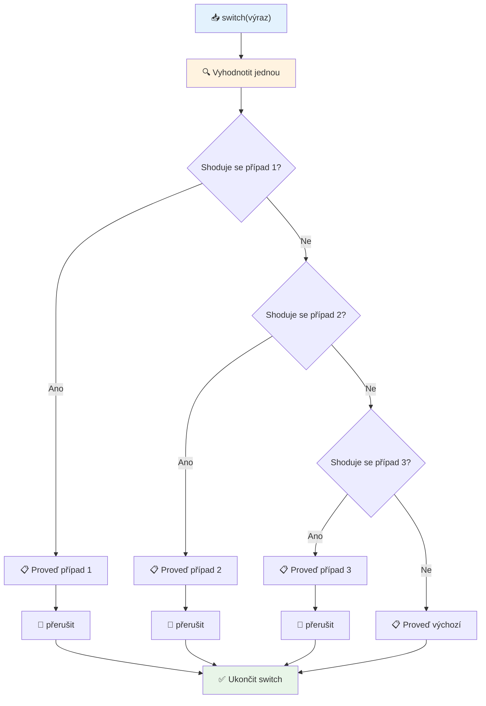
✅ Otestujte si porozumění tomuto kódu i následujícímu spuštěním v konzoli. Změňte hodnotu proměnné a a sledujte, jak se mění `console.log()`.

### 🔄 **Mistrovství příkazu switch: Více možností**

**Otestujte své znalosti switch:**
- Co se stane, když zapomenete na příkaz `break`?
- Kdy byste použili `switch` místo více `if-else` větví?
- Proč je užitečný `default` případ, i když si myslíte, že máte všechny možnosti pokryté?

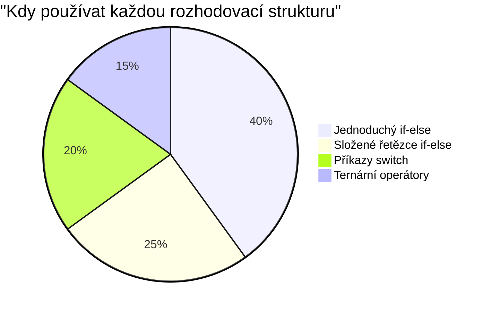
> **Nejlepší praxe**: Používejte `switch` při porovnávání jedné proměnné vůči konkrétním hodnotám. Používejte `if-else` pro rozsahy nebo složité podmínky!

## Logické operátory a Booleovské hodnoty

Komplexní rozhodnutí často vyžadují vyhodnocení více podmínek zároveň. Stejně jako Booleova algebra umožňuje matematikům kombinovat logické výrazy, programování poskytuje logické operátory k propojení několika Booleovských podmínek.

Tyto operátory umožňují sofistikovanou podmíněnou logiku spojením jednoduchých vyhodnocení pravda/nepravda.

| Symbol | Popis                                                                                     | Příklad                                                                 |
| ------ | ----------------------------------------------------------------------------------------- | ----------------------------------------------------------------------- |
| `&&`   | **Logické A**: Porovnává dva Booleovské výrazy. Vrací `true` **pouze**, pokud jsou obě strany pravdivé | `(5 > 3) && (5 < 10) // Obě strany jsou pravdivé. Vrací true` |
| `\|\|` | **Logické NEBO**: Porovnává dva Booleovské výrazy. Vrací `true`, pokud je alespoň jedna strana pravdivá | `(5 > 10) \|\| (5 < 10) // Jedna strana je nepravdivá, druhá pravdivá. Vrací true` |
| `!`    | **Logické NEGACE**: Vrací opačnou hodnotu Booleovského výrazu                             | `!(5 > 10) // 5 není větší než 10, takže "!" změní na true`         |

Tyto operátory vám umožní kombinovat podmínky užitečnými způsoby:
- A (`&&`) znamená, že obě podmínky musí být pravdivé
- NEBO (`||`) znamená, že musí být pravdivá alespoň jedna podmínka  
- NEGACE (`!`) převrací pravdu na nepravdu (a naopak)

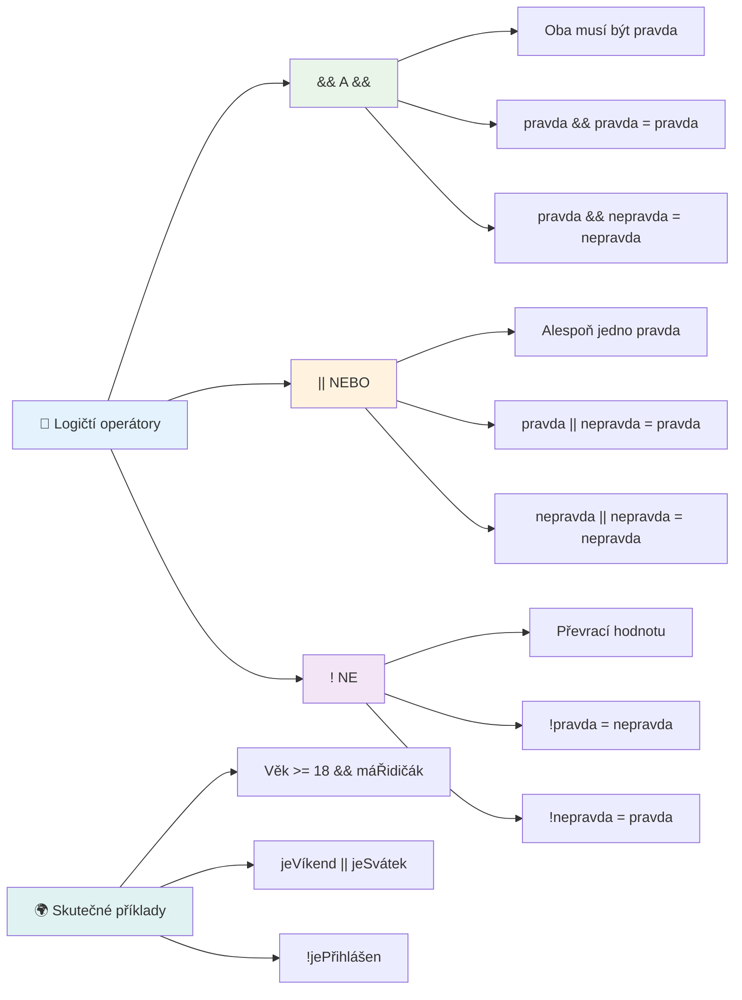
## Podmínky a rozhodování s logickými operátory

Podívejme se na tyto logické operátory v akci s realističtějším příkladem:

```javascript
let currentMoney = 600;
let laptopPrice = 800;
let laptopDiscountPrice = laptopPrice - (laptopPrice * 0.2); // Cena notebooku se slevou 20 procent

if (currentMoney >= laptopPrice || currentMoney >= laptopDiscountPrice) {
  // Podmínka je pravdivá. Kód v tomto bloku se vykoná.
  console.log("Getting a new laptop!");
} else {
  // Podmínka je nepravdivá. Kód v tomto bloku se vykoná.
  console.log("Can't afford a new laptop, yet!");
}
```

V tomto příkladu: vypočítáme cenu s 20% slevou (640), pak vyhodnotíme, zda naše dostupné prostředky pokryjí buď plnou cenu NEBO cenu po slevě. Protože 600 je méně než zvýhodněná cena 640, podmínka vyhodnocuje na false.

### 🧮 **Kontrola logických operátorů: Kombinování podmínek**

**Otestujte své znalosti logických operátorů:**
- Ve výrazu `A && B`, co se stane, když je A false? Vyhodnocuje se vůbec B?
- Umíte si představit situaci, kdy byste potřebovali všechny tři operátory (`&&`, `||`, `!`) dohromady?
- Jaký je rozdíl mezi `!user.isActive` a `user.isActive !== true`?

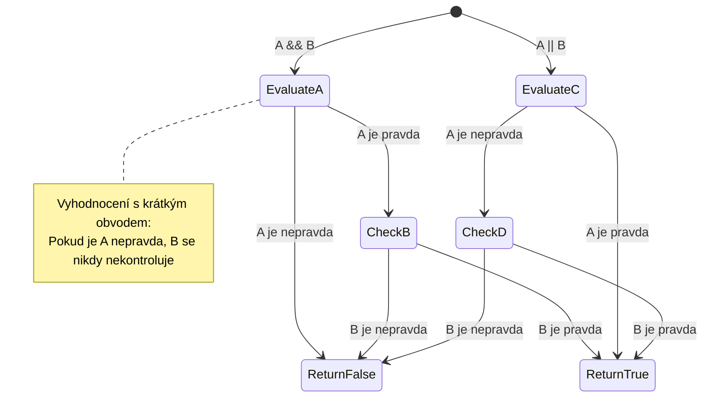
> **Tip pro výkon**: JavaScript používá tzv. „short-circuit evaluation“ – v `A && B`, pokud je A false, B se vůbec nevyhodnocuje. Využijte toho!

### Operátor negace

Někdy je snazší přemýšlet o tom, kdy něco NENÍ pravda. Místo otázky „Je uživatel přihlášen?“, můžete chtít vědět „Není uživatel přihlášen?“. Operátor vykřičníku (`!`) pro vás převrací logiku.

```javascript
if (!condition) {
  // spustí se, pokud je podmínka nepravdivá
} else {
  // spustí se, pokud je podmínka pravdivá
}
```

Operátor `!` je jako byste říkali „opposite of...“ – pokud je něco `true`, `!` změní na `false`, a naopak.

### Ternární výraz

Pro jednoduchá podmíněná přiřazení JavaScript poskytuje **ternární operátor**. Tato krátká syntaxe vám umožní zapsat podmíněný výraz na jednom řádku, což je užitečné, když chcete na základě podmínky přiřadit jednu ze dvou hodnot.

```javascript
let variable = condition ? returnThisIfTrue : returnThisIfFalse;
```

Čte se to jako otázka: „Je tato podmínka pravdivá? Pokud ano, použij tuto hodnotu. Pokud ne, použij tu druhou hodnotu.“

Níže je konkrétnější příklad:

```javascript
let firstNumber = 20;
let secondNumber = 10;
let biggestNumber = firstNumber > secondNumber ? firstNumber : secondNumber;
```

✅ Věnujte minutu tomu, abyste si tento kód několikrát přečetli. Rozumíte, jak tyto operátory fungují?

Tato řádka říká: „Je `firstNumber` větší než `secondNumber`? Pokud ano, dej `firstNumber` do `biggestNumber`. Pokud ne, dej tam `secondNumber`.“

Ternární operátor je jen kratší způsob, jak napsat tradiční příkaz `if..else`:

```javascript
let biggestNumber;
if (firstNumber > secondNumber) {
  biggestNumber = firstNumber;
} else {
  biggestNumber = secondNumber;
}
```

Obě varianty dávají stejné výsledky. Ternární operátor nabízí stručnost, zatímco tradiční if-else je možná čitelnější při složitějších podmínkách.

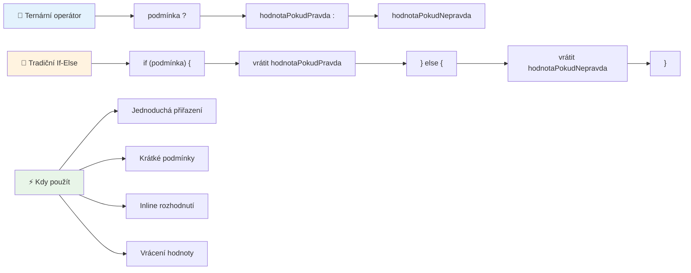
---


## 🚀 Výzva

Vytvořte program, který nejprve napíšete pomocí logických operátorů a pak přepište pomocí ternárního výrazu. Kterou syntaxi preferujete?

---

## Výzva GitHub Copilot Agent 🚀

Použijte režim Agent, abyste dokončili následující výzvu:

**Popis:** Vytvořte komplexní kalkulačku známek, která demonstruje různé koncepty rozhodování z této lekce, včetně příkazů if-else, switch příkazů, logických operátorů a ternárních výrazů.

**Zadání:** Napište JavaScriptový program, který vezme číselné skóre studenta (0-100) a určí jeho hodnocení podle následujících kritérií:
- A: 90–100
- B: 80–89  
- C: 70–79
- D: 60–69
- F: Pod 60

Požadavky:
1. Použijte příkaz if-else pro určení hodnocení
2. Použijte logické operátory pro kontrolu, jestli student splnil (známka >= 60) A má vyznamenání (známka >= 90)  
3. Použijte příkaz switch pro poskytnutí specifické zpětné vazby pro každou písmenovou známku  
4. Použijte ternární operátor k určení, zda je student způsobilý pro další kurz (známka >= 70)  
5. Zahrňte ověření vstupu, aby bylo zajištěno, že skóre je mezi 0 a 100  

Otestujte svůj program s různými skóre včetně hraničních případů jako 59, 60, 89, 90 a neplatných vstupů.

Více informací o [agent módu](https://code.visualstudio.com/blogs/2025/02/24/introducing-copilot-agent-mode) najdete zde.


## Post-Lecture Quiz

[Post-lecture quiz](https://ff-quizzes.netlify.app/web/quiz/12)

## Review & Self Study

Přečtěte si více o mnoha operátorech dostupných uživatelům [na MDN](https://developer.mozilla.org/docs/Web/JavaScript/Reference/Operators).

Projďěte si skvělý [operator lookup](https://joshwcomeau.com/operator-lookup/) od Joshe Comeaua!

## Assignment

[Operators](assignment.md)

---

## 🧠 **Souhrn vašeho nástroje pro rozhodování**

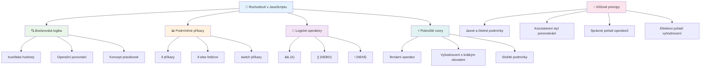
---

## 🚀 Časová osa vašeho mistrovství v rozhodování v JavaScriptu

### ⚡ **Co můžete zvládnout během příštích 5 minut**
- [ ] Procvičujte operátory porovnání ve vaší konzoli prohlížeče
- [ ] Napište jednoduchý příkaz if-else, který kontroluje váš věk
- [ ] Vyzkoušejte výzvu: přepište if-else pomocí ternárního operátoru
- [ ] Otestujte, co se stane s různými hodnotami „truthy“ a „falsy“

### 🎯 **Co můžete zvládnout během této hodiny**
- [ ] Dokončete kvíz po lekci a zopakujte si nejasné pojmy
- [ ] Vytvořte komplexní kalkulačku známek z GitHub Copilot výzvy
- [ ] Vytvořte jednoduchý rozhodovací strom pro reálný scénář (např. výběr oblečení)
- [ ] Procvičujte kombinování více podmínek s logickými operátory
- [ ] Experimentujte s příkazy switch pro různé případy použití

### 📅 **Vaše týdenní mistrovství logiky**
- [ ] Dokončete úkol s operátory s kreativními příklady
- [ ] Vytvořte mini kvízovou aplikaci s různými podmíněnými strukturami
- [ ] Vytvořte validátor formuláře, který kontroluje více vstupních podmínek
- [ ] Procvičujte úkoly z Josh Comeau [operator lookup](https://joshwcomeau.com/operator-lookup/)
- [ ] Refaktorujte existující kód, aby používal vhodnější podmíněné struktury
- [ ] Studujte vyhodnocování zkrácených výrazů a jejich dopad na výkon

### 🌟 **Vaše měsíční proměna**
- [ ] Ovládněte složité vnořené podmínky a udržujte čitelnost kódu
- [ ] Vytvořte aplikaci s pokročilou logikou rozhodování
- [ ] Přispějte do open source projektů zlepšením podmíněné logiky
- [ ] Naučte někoho jiného o různých podmíněných strukturách a kdy je použít
- [ ] Prozkoumejte funkcionální programovací přístupy k podmíněné logice
- [ ] Vytvořte si osobní referenční příručku pro nejlepší praxe podmíněného kódu

### 🏆 **Kontrola mistrovství rozhodování**

**Oslavte své mistrovství v logickém myšlení:**
- Jakou nejkomplexnější rozhodovací logiku jste úspěšně implementovali?
- Která podmíněná struktura vám přijde nejpřirozenější a proč?
- Jak vám znalost logických operátorů změnila přístup k řešení problémů?
- Která reálná aplikace by těžila z pokročilé rozhodovací logiky?

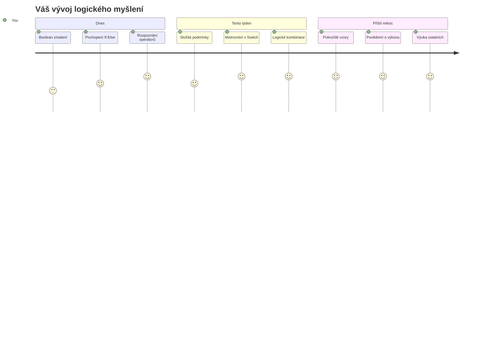
> 🧠 **Ovládli jste umění digitálního rozhodování!** Každá interaktivní aplikace spoléhá na podmíněnou logiku, aby inteligentně reagovala na uživatelské akce a měnící se podmínky. Nyní rozumíte, jak nechat své programy myslet, hodnotit a volit vhodné reakce. Tento logický základ podpoří každou dynamickou aplikaci, kterou vytvoříte! 🎉

---

<!-- CO-OP TRANSLATOR DISCLAIMER START -->
**Prohlášení o vyloučení odpovědnosti**:
Tento dokument byl přeložen pomocí AI překladatelské služby [Co-op Translator](https://github.com/Azure/co-op-translator). Přestože usilujeme o přesnost, mějte prosím na paměti, že automatizované překlady mohou obsahovat chyby nebo nepřesnosti. Originální dokument v jeho původním jazyce by měl být považován za závazný zdroj. Pro kritické informace se doporučuje profesionální lidský překlad. Nejsme odpovědni za jakékoli nedorozumění nebo nesprávné interpretace vyplývající z použití tohoto překladu.
<!-- CO-OP TRANSLATOR DISCLAIMER END -->