<!--
CO_OP_TRANSLATOR_METADATA:
{
  "original_hash": "1710a50a519a6e4a1b40a5638783018d",
  "translation_date": "2026-01-07T03:34:12+00:00",
  "source_file": "2-js-basics/4-arrays-loops/README.md",
  "language_code": "cs"
}
-->
# Základy JavaScriptu: Pole a smyčky


> Sketchnote od [Tomomi Imura](https://twitter.com/girlie_mac)

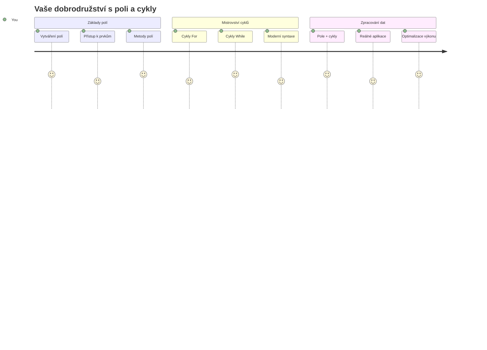
## Přednáškový kvíz
[Přednáškový kvíz](https://ff-quizzes.netlify.app/web/quiz/13)

Zajímalo vás někdy, jak webové stránky sledují položky v nákupním košíku nebo zobrazují seznam přátel? Právě zde přicházejí na řadu pole a smyčky. Pole jsou jako digitální kontejnery, které drží více informací najednou, zatímco smyčky vám umožní efektivně pracovat se všemi těmito daty bez nutnosti opakovat kód.

Tyto dva koncepty dohromady tvoří základ pro práci s informacemi ve vašich programech. Naučíte se, jak přejít od ručního psaní každého kroku k vytváření chytrého a efektivního kódu, který dokáže rychle zpracovat stovky nebo dokonce tisíce položek.

Na konci této lekce pochopíte, jak dosáhnout složitých datových úkolů jen s několika řádky kódu. Pojďme prozkoumat tyto nezbytné programovací koncepty.

[](https://youtube.com/watch?v=1U4qTyq02Xw "Arrays")

[](https://www.youtube.com/watch?v=Eeh7pxtTZ3k "Loops")

> 🎥 Klikněte na obrázky výše pro videa o polích a smyčkách.

> Tuto lekci můžete absolvovat na [Microsoft Learn](https://docs.microsoft.com/learn/modules/web-development-101-arrays/?WT.mc_id=academic-77807-sagibbon)!

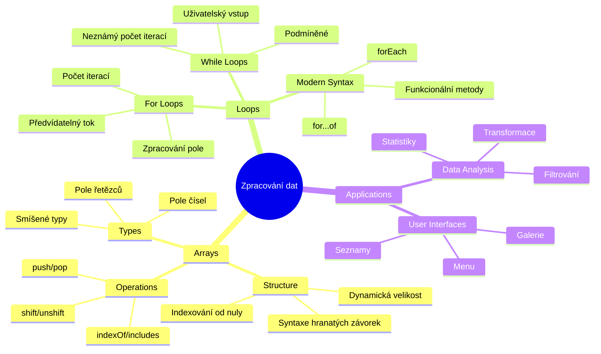
## Pole

Přemýšlejte o polích jako o digitálním archivu – místo ukládání jednoho dokumentu do jedné zásuvky můžete uspořádat více souvisejících položek do jednoho strukturovaného kontejneru. V programování pole umožňují uložit více kousků informací do jednoho uspořádaného balíčku.

Ať už tvoříte fotogalerii, spravujete seznam úkolů nebo sledujete nejlepší skóre ve hře, pole poskytují základ pro organizaci dat. Podívejme se, jak fungují.

✅ Pole jsou všude kolem nás! Můžete si vzpomenout na nějaký příklad pole z reálného života, například pole solárních panelů?

### Vytváření polí

Vytvoření pole je super jednoduché – stačí použít hranaté závorky!

```javascript
// Prázdné pole - jako prázdný nákupní košík čekající na položky
const myArray = [];
```

**Co se zde děje?**
Právě jste vytvořili prázdný kontejner pomocí těchto hranatých závorek `[]`. Představte si to jako prázdnou knihovní polici – je připravená držet jakékoliv knihy, které tam chcete uspořádat.

Pole můžete také hned na začátku naplnit počátečními hodnotami:

```javascript
// Nabídka příchutí vaší zmrzlinárny
const iceCreamFlavors = ["Chocolate", "Strawberry", "Vanilla", "Pistachio", "Rocky Road"];

// Profilové informace uživatele (kombinace různých typů dat)
const userData = ["John", 25, true, "developer"];

// Testovací skóre pro váš oblíbený předmět
const scores = [95, 87, 92, 78, 85];
```

**Zajímavosti k poznání:**
- Můžete v poli uchovávat text, čísla nebo i pravdivostní hodnoty (true/false)
- Stačí jen oddělit každou položku čárkou – jednoduché!
- Pole jsou ideální pro uchování propojených informací pohromadě

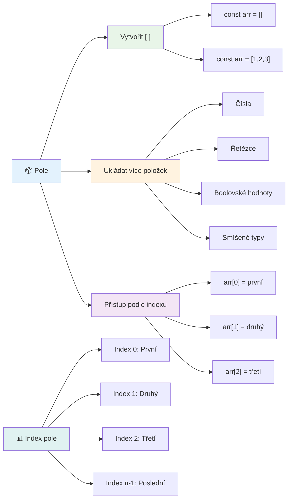
### Indexování polí

Tady je něco, co může zpočátku přijít divné: pole číslují své položky začínajíce od 0, ne 1. Toto indexování od nuly má kořeny ve způsobu, jakým funguje počítačová paměť – jde o programátorský zvyk od dob jazyků jako C. Každé místo v poli dostane své vlastní adresní číslo nazývané **index**.

| Index | Hodnota | Popis |
|-------|---------|-------|
| 0 | "Čokoláda" | První prvek |
| 1 | "Jahoda" | Druhý prvek |
| 2 | "Vanilka" | Třetí prvek |
| 3 | "Pistácie" | Čtvrtý prvek |
| 4 | "Rocky Road" | Pátý prvek |

✅ Překvapuje vás, že pole začínají s indexem nula? V některých programovacích jazycích indexy začínají na jedničce. Zajímavou historii k tomu naleznete na [Wikipedia](https://en.wikipedia.org/wiki/Zero-based_numbering).

**Přístup k prvkům pole:**

```javascript
const iceCreamFlavors = ["Chocolate", "Strawberry", "Vanilla", "Pistachio", "Rocky Road"];

// Přístup k jednotlivým prvkům pomocí hranatých závorek
console.log(iceCreamFlavors[0]); // "Čokoláda" - první prvek
console.log(iceCreamFlavors[2]); // "Vanilka" - třetí prvek
console.log(iceCreamFlavors[4]); // "Rocky Road" - poslední prvek
```

**Co se zde děje:**
- **Používá** notaci s hranatými závorkami a číslem indexu pro přístup k prvkům
- **Vrací** hodnotu uloženou na dané pozici v poli
- **Čítá** od 0, takže první prvek má index 0

**Úprava prvků pole:**

```javascript
// Změnit existující hodnotu
iceCreamFlavors[4] = "Butter Pecan";
console.log(iceCreamFlavors[4]); // "Máslový pekan"

// Přidat nový prvek na konec
iceCreamFlavors[5] = "Cookie Dough";
console.log(iceCreamFlavors[5]); // "Těsto na sušenky"
```

**V předchozím příkladu jsme:**
- **Změnili** prvek na indexu 4 z "Rocky Road" na "Butter Pecan"
- **Přidali** nový prvek "Cookie Dough" na index 5
- **Automaticky zvětšili** délku pole při přidání mimo aktuální rozsah

### Délka pole a běžné metody

Pole mají zabudované vlastnosti a metody, které práci s daty výrazně usnadňují.

**Zjistit délku pole:**

```javascript
const iceCreamFlavors = ["Chocolate", "Strawberry", "Vanilla", "Pistachio", "Rocky Road"];
console.log(iceCreamFlavors.length); // 5

// Délka se automaticky aktualizuje, jak se mění pole
iceCreamFlavors.push("Mint Chip");
console.log(iceCreamFlavors.length); // 6
```

**Klíčové body:**
- **Vrací** celkový počet prvků v poli
- **Aktualizuje** se automaticky při přidání nebo odebrání prvků
- **Poskytuje** dynamický počet užitečný pro smyčky a validace

**Základní metody polí:**

```javascript
const fruits = ["apple", "banana", "orange"];

// Přidat prvky
fruits.push("grape");           // Přidá na konec: ["apple", "banana", "orange", "grape"]
fruits.unshift("strawberry");   // Přidá na začátek: ["strawberry", "apple", "banana", "orange", "grape"]

// Odstranit prvky
const lastFruit = fruits.pop();        // Odebere a vrátí "grape"
const firstFruit = fruits.shift();     // Odebere a vrátí "strawberry"

// Najít prvky
const index = fruits.indexOf("banana"); // Vrátí 1 (pozice "banana")
const hasApple = fruits.includes("apple"); // Vrátí true
```

**Co tyto metody dělají:**
- **Přidávají** prvky pomocí `push()` (na konec) a `unshift()` (na začátek)
- **Odebírají** prvky metodami `pop()` (z konce) a `shift()` (ze začátku)
- **Vyhledávají** prvky pomocí `indexOf()` a kontrolují existenci s `includes()`
- **Vrací** užitečné hodnoty jako odebrané prvky nebo indexy

✅ Vyzkoušejte sami! Použijte konzoli ve vašem prohlížeči a vytvořte své vlastní pole, které budete upravovat a manipulovat.

### 🧠 **Ověření znalostí polí: Organizace vašich dat**

**Otestujte své porozumění polím:**
- Proč myslíte, že pole začínají počítat od 0 místo od 1?
- Co se stane, když se pokusíte přistoupit k indexu, který neexistuje (např. `arr[100]` v poli se 5 prvky)?
- Dokážete uvést tři reálné situace, kde by bylo pole užitečné?

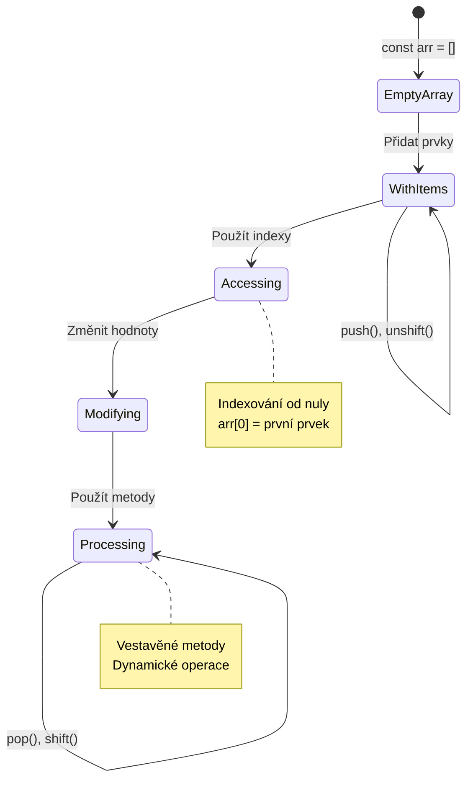
> **Poznatky z praxe**: Pole jsou všude v programování! Sociální média, nákupní košíky, fotogalerie, seznamy skladeb – všechno jsou to za scénou pole!

## Smyčky

Představte si známý trest z románů Charlese Dickense, kdy studenti museli opakovaně psát věty na tabulku. Představte si, že můžete někdo jen říct „napiš tuto větu 100x“ a ono se to udělá automaticky. Přesně to dělají smyčky ve vašem kódu.

Smyčky jsou jako vytrvalý pomocník, který opakuje úkoly bez chyby. Ať už potřebujete projít každou položku v nákupním košíku nebo zobrazit všechny fotografie v albu, smyčky zvládnou opakování efektivně.

JavaScript nabízí několik typů smyček. Pojďme si je postupně prohlédnout a pochopit, kdy je použít.

```mermaid
flowchart TD
    A["🔄 Typy smyček"] --> B["For Smyčka"]
    A --> C["While Smyčka"]
    A --> D["For...of Smyčka"]
    A --> E["Metoda forEach"]
    
    B --> B1["Známé iterace"]
    B --> B2["Na základě čítače"]
    B --> B3["for(init; condition; increment)"]
    
    C --> C1["Neznámé iterace"]
    C --> C2["Na základě podmínky"]
    C --> C3["while(condition)"]
    
    D --> D1["Moderní ES6+"]
    D --> D2["Iterace pole"]
    D --> D3["for(item of array)"]
    
    E --> E1["Funkcionální styl"]
    E --> E2["Metoda pole"]
    E --> E3["array.forEach(callback)"]
    
    F["⏰ Kdy použít"] --> F1["For: Počítání, indexy"]
    F --> F2["While: Uživatelský vstup, hledání"]
    F --> F3["For...of: Jednoduchá iterace"]
    F --> F4["forEach: Funkcionální programování"]
    
    style A fill:#e3f2fd
    style B fill:#e8f5e8
    style C fill:#fff3e0
    style D fill:#f3e5f5
    style E fill:#e0f2f1
    style F fill:#fce4ec
```
### Smyčka for

Smyčka `for` je jako nastavení časovače – přesně víte, kolikrát se má něco stát. Je velmi organizovaná a předvídatelná, což ji činí ideální, když pracujete s poli nebo potřebujete něco počítat.

**Struktura smyčky for:**

| Komponenta | Účel | Příklad |
|------------|-------|---------|
| **Inicializace** | Nastavuje počáteční hodnotu | `let i = 0` |
| **Podmínka** | Kdy pokračovat | `i < 10` |
| **Inkrementace** | Jak aktualizovat | `i++` |

```javascript
// Počítání od 0 do 9
for (let i = 0; i < 10; i++) {
  console.log(`Count: ${i}`);
}

// Praktický příklad: zpracování skóre
const testScores = [85, 92, 78, 96, 88];
for (let i = 0; i < testScores.length; i++) {
  console.log(`Student ${i + 1}: ${testScores[i]}%`);
}
```

**Krok za krokem, co se děje:**
- **Inicializuje** čítačovou proměnnou `i` na 0 na začátku
- **Kontroluje** podmínku `i < 10` před každou iterací
- **Provádí** kód pokud je podmínka pravdivá
- **Zvyšuje** hodnotu `i` o 1 po každé iteraci pomocí `i++`
- **Zastaví** když podmínka přestane platit (když `i` dosáhne 10)

✅ Spusťte tento kód v konzoli prohlížeče. Co se stane, když malinko změníte čítač, podmínku nebo výraz pro inkrementaci? Dokážete ho pustit zpětně a vytvořit odpočet?

### 🗓️ **Ověření zvládnutí smyčky for: Řízené opakování**

**Zhodnoťte své znalosti smyčky for:**
- Jaké jsou tři části smyčky for a k čemu každá slouží?
- Jak byste procházeli pole pozpátku?
- Co se stane, když zapomenete inkrementaci (`i++`)?

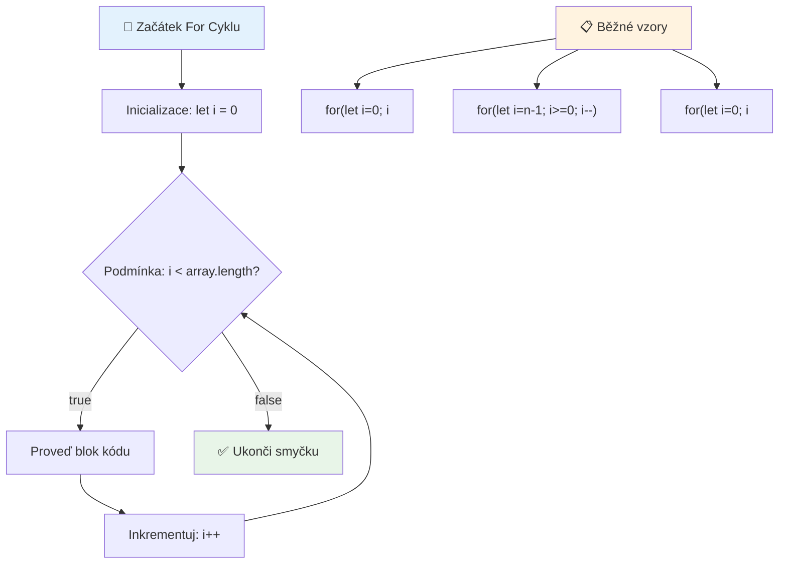
> **Moudrost o smyčkách**: Smyčky for jsou ideální, když přesně víte, kolikrát chcete něco opakovat. Jsou nejběžnější volbou pro zpracování polí!

### Smyčka while

Smyčka `while` je jako říct „pokračuj, dokud...“ – nemusíte přesně vědět, kolikrát se vykoná, ale víte, kdy má skončit. Je ideální pro věci jako dotazování uživatele, dokud nedostanete požadovaný vstup, nebo prohledávání dat, dokud nenajdete, co hledáte.

**Charakteristiky smyčky while:**
- **Pokračuje** dokud je podmínka pravdivá
- **Vyžaduje** ruční správu čítačových proměnných
- **Kontroluje** podmínku před každou iterací
- **Hrozí** nekonečná smyčka, pokud podmínka nikdy nezhyne (nepřestane platit)

```javascript
// Základní příklad počítání
let i = 0;
while (i < 10) {
  console.log(`While count: ${i}`);
  i++; // Nezapomeňte inkrementovat!
}

// Praktický příklad: zpracování uživatelského vstupu
let userInput = "";
let attempts = 0;
const maxAttempts = 3;

while (userInput !== "quit" && attempts < maxAttempts) {
  userInput = prompt(`Enter 'quit' to exit (attempt ${attempts + 1}):`);
  attempts++;
}

if (attempts >= maxAttempts) {
  console.log("Maximum attempts reached!");
}
```

**Co vidíme v těchto příkladech:**
- **Řídí** čítačovou proměnnou `i` manuálně uvnitř těla smyčky
- **Zvětšují** čítač k zabránění nekonečné smyčky
- **Ukazují** praktický případ s uživatelským vstupem a limitem pokusů
- **Obsahují** bezpečnostní mechanismy k předejití nekonečného běhu

### ♾️ **Ověření moudrosti while smyčky: Opakování založené na podmínce**

**Otestujte své porozumění while smyčce:**
- Jaké je hlavní nebezpečí při používání while smyček?
- Kdy byste zvolili while smyčku místo for smyčky?
- Jak můžete zabránit nekonečným smyčkám?

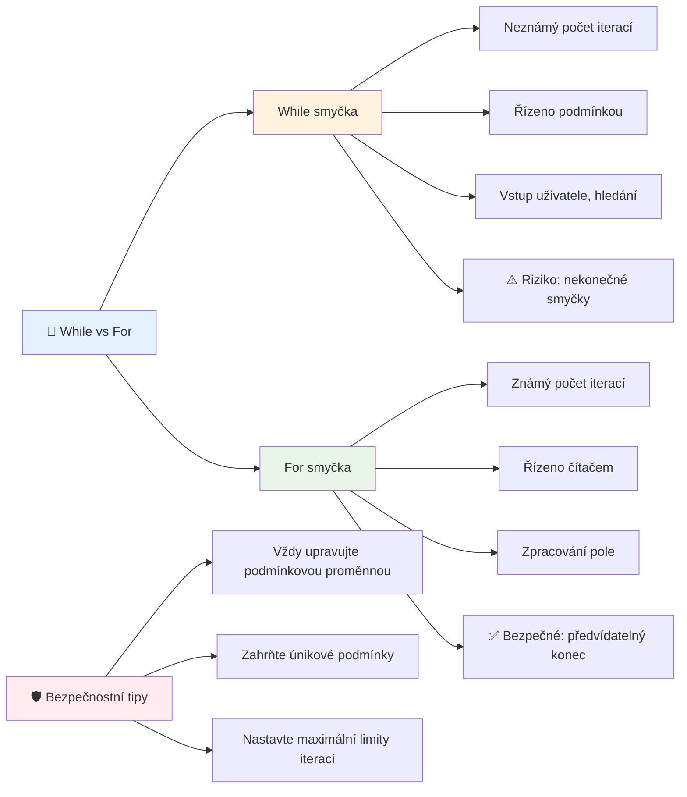
> **Bezpečnost na prvním místě**: While smyčky jsou mocné, ale vyžadují pečlivé řízení podmínek. Vždy se ujistěte, že podmínka nakonec přestane platit!

### Moderní alternativy smyček

JavaScript nabízí moderní syntaxe smyček, které váš kód činí čitelnějším a méně náchylným k chybám.

**Smyčka For...of (ES6+):**

```javascript
const colors = ["red", "green", "blue", "yellow"];

// Moderní přístup - čistší a bezpečnější
for (const color of colors) {
  console.log(`Color: ${color}`);
}

// Porovnat s tradičním for cyklem
for (let i = 0; i < colors.length; i++) {
  console.log(`Color: ${colors[i]}`);
}
```

**Hlavní výhody for...of:**
- **Odstraňuje** potřebu spravovat indexy a chyby s off-by-one
- **Umožňuje** přímý přístup k prvkům pole
- **Zvyšuje** čitelnost kódu a snižuje syntaktickou složitost

**Metoda forEach:**

```javascript
const prices = [9.99, 15.50, 22.75, 8.25];

// Použití forEach pro funkcionální programovací styl
prices.forEach((price, index) => {
  console.log(`Item ${index + 1}: $${price.toFixed(2)}`);
});

// forEach s šipkovými funkcemi pro jednoduché operace
prices.forEach(price => console.log(`Price: $${price}`));
```

**Co potřebujete vědět o forEach:**
- **Spustí** funkci pro každý prvek v poli
- **Poskytuje** hodnotu prvku i jeho index jako parametry
- **Nelze** ji předčasně ukončit (na rozdíl od tradičních smyček)
- **Vrací** undefined (nevytváří nové pole)

✅ Proč byste zvolili for smyčku oproti while smyčce? 17 tisíc diváků na StackOverflow mělo stejnou otázku a některé názory [by vás mohly zajímat](https://stackoverflow.com/questions/39969145/while-loops-vs-for-loops-in-javascript).

### 🎨 **Ověření moderní syntaxe smyček: Přijetí ES6+**

**Zhodnoťte své znalosti moderního JavaScriptu:**
- Jaké jsou výhody `for...of` oproti tradičním for smyčkám?
- Kdy byste stále preferovali tradiční for smyčky?
- V čem se liší `forEach` a `map`?

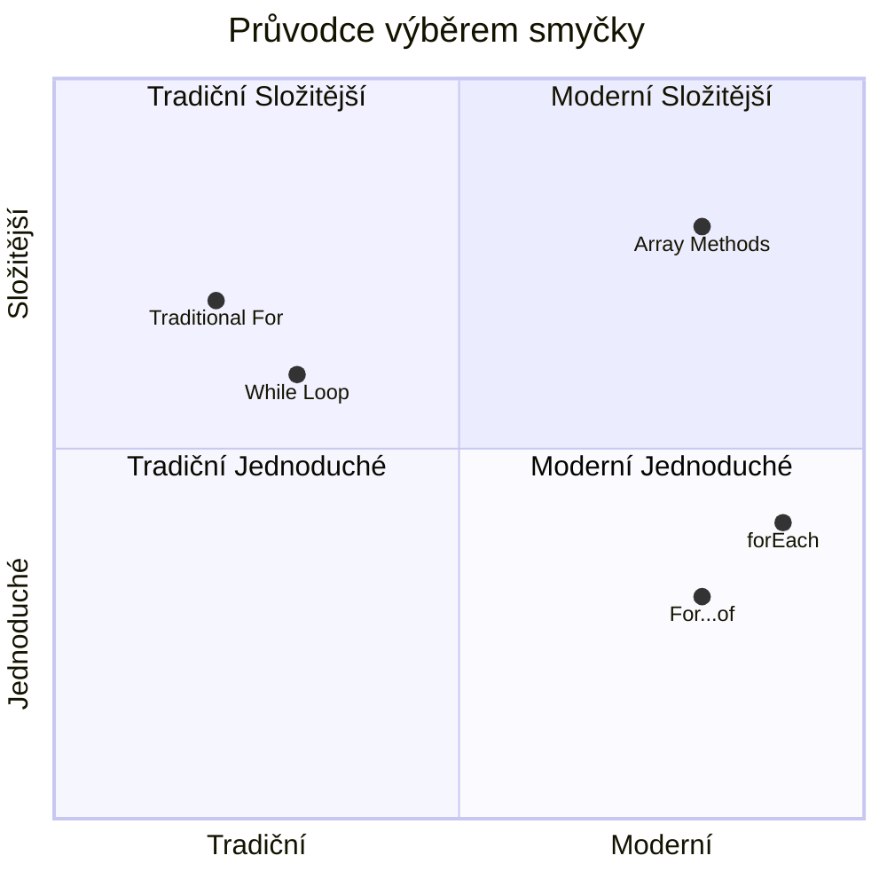
> **Moderní trend**: Syntaxe ES6+ jako `for...of` a `forEach` se stává preferovaným přístupem k iteraci polí, protože je čistší a méně náchylná k chybám!

## Smyčky a pole

Kombinace polí a smyček vytváří silné možnosti pro zpracování dat. Toto spojení je základem mnoha programátorských úkolů, od zobrazování seznamů po výpočty statistik.

**Tradiční zpracování polí:**

```javascript
const iceCreamFlavors = ["Chocolate", "Strawberry", "Vanilla", "Pistachio", "Rocky Road"];

// Klasický způsob s for smyčkou
for (let i = 0; i < iceCreamFlavors.length; i++) {
  console.log(`Flavor ${i + 1}: ${iceCreamFlavors[i]}`);
}

// Moderní způsob s for...of smyčkou
for (const flavor of iceCreamFlavors) {
  console.log(`Available flavor: ${flavor}`);
}
```

**Pochopení každého přístupu:**
- **Používá** délku pole pro určení hranice smyčky
- **Přistupuje** k prvkům podle indexu v tradičních for smyčkách
- **Umožňuje** přímý přístup k prvkům v for...of smyčkách
- **Zpracovává** každý prvek pole přesně jednou

**Praktický příklad zpracování dat:**

```javascript
const studentGrades = [85, 92, 78, 96, 88, 73, 89];
let total = 0;
let highestGrade = studentGrades[0];
let lowestGrade = studentGrades[0];

// Zpracujte všechny známky jedním cyklem
for (let i = 0; i < studentGrades.length; i++) {
  const grade = studentGrades[i];
  total += grade;
  
  if (grade > highestGrade) {
    highestGrade = grade;
  }
  
  if (grade < lowestGrade) {
    lowestGrade = grade;
  }
}

const average = total / studentGrades.length;
console.log(`Average: ${average.toFixed(1)}`);
console.log(`Highest: ${highestGrade}`);
console.log(`Lowest: ${lowestGrade}`);
```

**Jak tento kód funguje:**
- **Iniciuje** proměnné pro sledování součtu a extrémů
- **Zpracovává** každou známku pomocí jedné efektivní smyčky
- **Kumuluje** celkový součet pro výpočet průměru
- **Sleduje** nejvyšší a nejnižší hodnoty během průchodu
- **Vypočítává** konečné statistiky po dokončení smyčky

✅ Vyzkoušejte si smyčku nad polem vlastního vytvoření v konzoli vašeho prohlížeče.

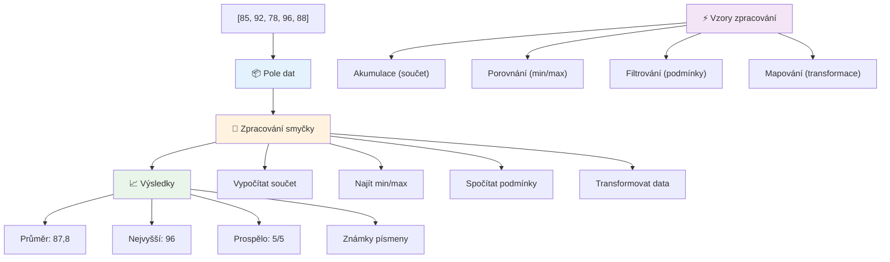
---

## Výzva GitHub Copilot Agent 🚀

Použijte agentní režim k dokončení následující výzvy:

**Popis:** Vytvořte komplexní funkci pro zpracování dat, která kombinuje pole a smyčky k analýze datové sady a generování smysluplných přehledů.

**Úkol:** Vytvořte funkci s názvem `analyzeGrades`, která přijme pole objektů s hodnocením studentů (každý obsahuje vlastnosti jméno a skóre) a vrátí objekt se statistikami včetně nejvyššího skóre, nejnižšího skóre, průměrného skóre, počtu studentů, kteří prošli (skóre >= 70), a pole jmen studentů, kteří dosáhli nadprůměrného skóre. Ve svém řešení použijte alespoň dva různé typy smyček.

Více o [agentním režimu](https://code.visualstudio.com/blogs/2025/02/24/introducing-copilot-agent-mode) se dozvíte zde.

## 🚀 Výzva
JavaScript nabízí několik moderních metod pro pole, které mohou nahradit tradiční smyčky pro konkrétní úkoly. Prozkoumejte [forEach](https://developer.mozilla.org/docs/Web/JavaScript/Reference/Global_Objects/Array/forEach), [for-of](https://developer.mozilla.org/docs/Web/JavaScript/Reference/Statements/for...of), [map](https://developer.mozilla.org/docs/Web/JavaScript/Reference/Global_Objects/Array/map), [filter](https://developer.mozilla.org/docs/Web/JavaScript/Reference/Global_Objects/Array/filter) a [reduce](https://developer.mozilla.org/docs/Web/JavaScript/Reference/Global_Objects/Array/reduce). 

**Vaše výzva:** Refaktorujte příklad s hodnocením studentů pomocí alespoň tří různých metod polí. Všimněte si, jak mnohem čistější a čitelnější kód se stane s moderní syntaxí JavaScriptu.

## Kvíz po přednášce
[Kvíz po přednášce](https://ff-quizzes.netlify.app/web/quiz/14)


## Přehled a samostudium

Pole v JavaScriptu mají mnoho metod, které jsou mimořádně užitečné pro manipulaci s daty. [Přečtěte si o těchto metodách](https://developer.mozilla.org/docs/Web/JavaScript/Reference/Global_Objects/Array) a vyzkoušejte si některé z nich (například push, pop, slice a splice) na poli, které si vytvoříte.

## Zadání

[Procházení pole](assignment.md)

---

## 📊 **Shrnutí vašeho nástroje pro pole a smyčky**

```mermaid
graph TD
    A["🎯 Ovládnutí polí a cyklů"] --> B["📦 Základy polí"]
    A --> C["🔄 Typy cyklů"]
    A --> D["🔗 Zpracování dat"]
    A --> E["🎨 Moderní techniky"]
    
    B --> B1["Vytvoření: [ ]"]
    B --> B2["Indexování: arr[0]"]
    B --> B3["Metody: push, pop"]
    B --> B4["Vlastnosti: délka"]
    
    C --> C1["For: známý počet iterací"]
    C --> C2["While: podmíněné"]
    C --> C3["For...of: přímý přístup"]
    C --> C4["forEach: funkcionální"]
    
    D --> D1["Výpočet statistik"]
    D --> D2["Transformace dat"]
    D --> D3["Filtrování a hledání"]
    D --> D4["Zpracování v reálném čase"]
    
    E --> E1["Arrow funkce"]
    E --> E2["Řetězení metod"]
    E --> E3["Destrukturalizace"]
    E --> E4["Šablonové řetězce"]
    
    F["💡 Hlavní výhody"] --> F1["Efektivní zpracování dat"]
    F --> F2["Snížení opakování kódu"]
    F --> F3["Škálovatelná řešení"]
    F --> F4["Čistší syntax"]
    
    style A fill:#e3f2fd
    style B fill:#e8f5e8
    style C fill:#fff3e0
    style D fill:#f3e5f5
    style E fill:#e0f2f1
    style F fill:#fce4ec
```
---

## 🚀 Časová osa vašeho mistrovství v polích a smyčkách

### ⚡ **Co zvládnete za dalších 5 minut**
- [ ] Vytvořit pole vašich oblíbených filmů a přistupovat k vybraným prvkům
- [ ] Napsat for smyčku, která počítá od 1 do 10
- [ ] Vyzkoušet výzvu s moderními metodami polí z lekce
- [ ] Procvičit indexování polí ve vaší konzoli prohlížeče

### 🎯 **Co zvládnete během této hodiny**
- [ ] Dokončit kvíz po lekci a zopakovat si náročnější koncepty
- [ ] Vytvořit komplexní analyzátor známek podle výzvy GitHub Copilot
- [ ] Vytvořit jednoduchý nákupní košík, který přidává a odebírá položky
- [ ] Procvičit převody mezi různými typy smyček
- [ ] Experimentovat s metodami polí jako `push`, `pop`, `slice` a `splice`

### 📅 **Vaše týdenní cesta zpracováním dat**
- [ ] Dokončit zadání "Procházení pole" s kreativními vylepšeními
- [ ] Vytvořit aplikaci seznam úkolů pomocí polí a smyček
- [ ] Vytvořit jednoduchý kalkulátor statistik pro číselná data
- [ ] Procvičovat metody polí z [MDN](https://developer.mozilla.org/docs/Web/JavaScript/Reference/Global_Objects/Array)
- [ ] Vytvořit rozhraní pro foto galerii nebo playlist hudby
- [ ] Prozkoumat funkcionální programování pomocí `map`, `filter` a `reduce`

### 🌟 **Vaše měsíční proměna**
- [ ] Ovládnout pokročilé operace s poli a optimalizaci výkonu
- [ ] Vytvořit kompletní dashboard pro vizualizaci dat
- [ ] Přispívat do open-source projektů zaměřených na zpracování dat
- [ ] Naučit někoho jiného o polích a smyčkách s praktickými příklady
- [ ] Vytvořit osobní knihovnu znovupoužitelných funkcí pro zpracování dat
- [ ] Prozkoumat algoritmy a datové struktury založené na polích

### 🏆 **Závěrečný check-in šampiona zpracování dat**

**Oslavte své mistrovství v polích a smyčkách:**
- Jaká operace s poli je podle vás nejvíce užitečná pro reálné aplikace?
- Který typ smyčky vám přijde nejpřirozenější a proč?
- Jak vám porozumění polím a smyčkám změnilo přístup k organizaci dat?
- Jaký složitý úkol zpracování dat byste rádi vyřešili příště?

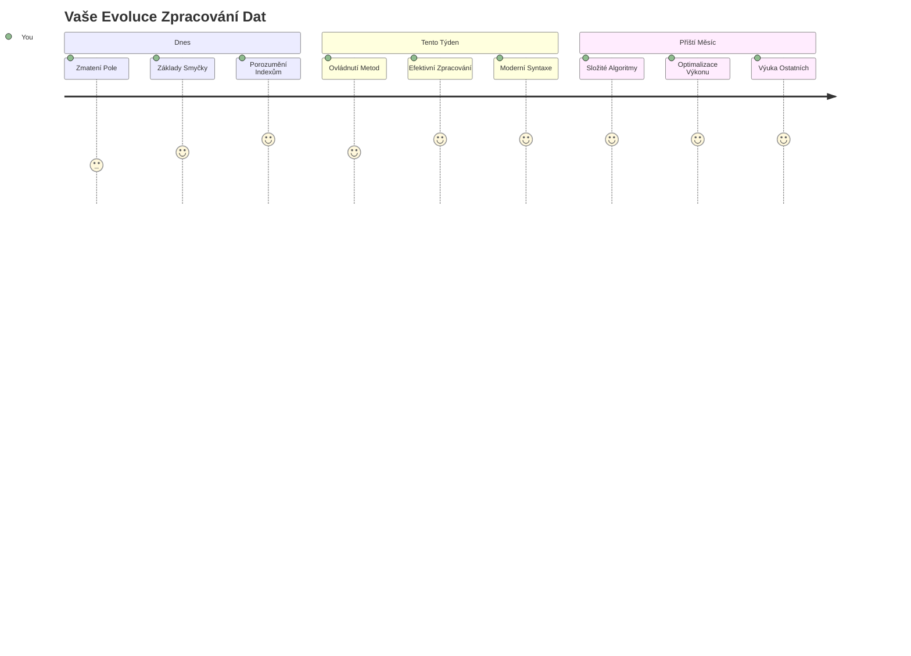
> 📦 **Odemkli jste sílu organizace a zpracování dat!** Pole a smyčky jsou základem téměř každé aplikace, kterou kdy vytvoříte. Od jednoduchých seznamů až po složité analýzy dat, nyní máte nástroje k efektivní a elegantní práci s informacemi. Každý dynamický web, mobilní aplikace a aplikace založená na datech spoléhají na tyto základní koncepty. Vítejte ve světě škálovatelného zpracování dat! 🎉

---

<!-- CO-OP TRANSLATOR DISCLAIMER START -->
**Prohlášení o vyloučení odpovědnosti**:  
Tento dokument byl přeložen za použití AI překladatelské služby [Co-op Translator](https://github.com/Azure/co-op-translator). I když usilujeme o přesnost, mějte prosím na paměti, že automatické překlady mohou obsahovat chyby nebo nepřesnosti. Originální dokument v jeho mateřském jazyce by měl být považován za autoritativní zdroj. Pro kritické informace je doporučen profesionální lidský překlad. Nejsme odpovědni za jakékoliv nedorozumění nebo špatné výklady vyplývající z použití tohoto překladu.
<!-- CO-OP TRANSLATOR DISCLAIMER END -->