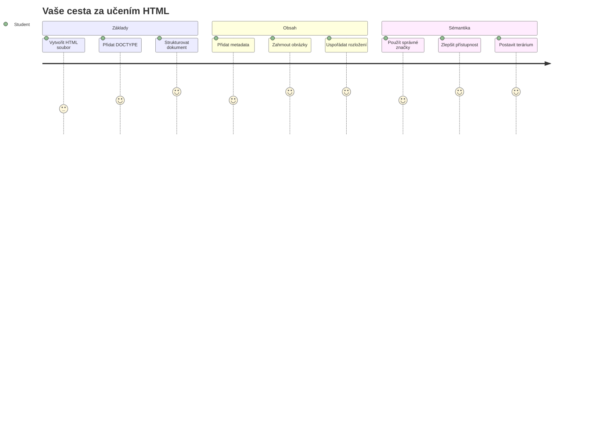
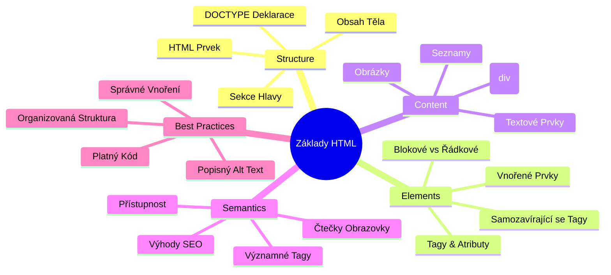
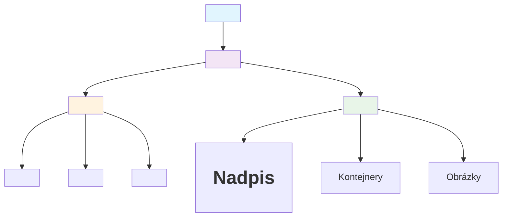
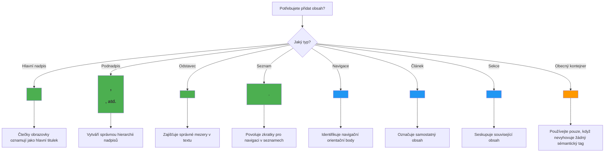
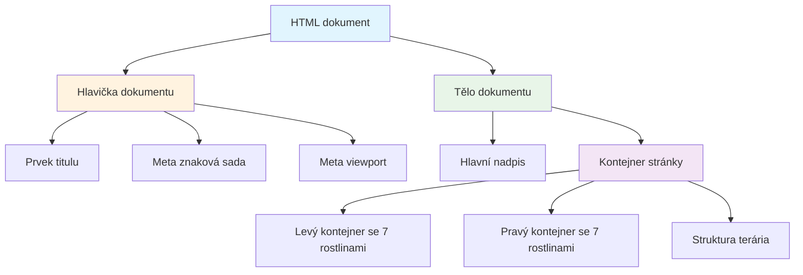
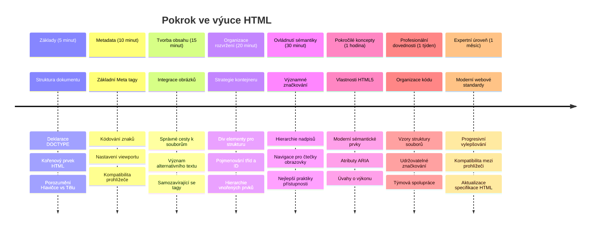

<!--
CO_OP_TRANSLATOR_METADATA:
{
  "original_hash": "3fcfa99c4897e051b558b5eaf1e8cc74",
  "translation_date": "2026-01-07T04:03:11+00:00",
  "source_file": "3-terrarium/1-intro-to-html/README.md",
  "language_code": "cs"
}
-->
# Terrarium Project Část 1: Úvod do HTML



> Sketchnote od [Tomomi Imura](https://twitter.com/girlie_mac)

HTML, neboli HyperText Markup Language, je základem každé webové stránky, kterou jste kdy navštívili. Představte si HTML jako kostru, která dodává webovým stránkám strukturu – definuje, kam obsah patří, jak je uspořádán a co který prvek představuje. Zatímco CSS později „oblékne“ váš HTML do barev a rozvržení a JavaScript ho oživí interaktivitou, HTML poskytuje základní strukturu, díky níž je vše ostatní možné.

V této lekci vytvoříte HTML strukturu pro rozhraní virtuálního terária. Tento praktický projekt vás naučí základní koncepty HTML při tvorbě něčeho vizuálně zajímavého. Naučíte se organizovat obsah pomocí sémantických prvků, pracovat s obrázky a vytvořit základ pro interaktivní webovou aplikaci.

Na konci této lekce budete mít funkční HTML stránku zobrazující obrázky rostlin ve sloupcích, připravenou pro stylování v další lekci. Nebojte se, pokud to na začátku vypadá základně – právě tak by měl HTML vypadat před tím, než k němu CSS přidá vizuální úpravy.


## Přednáškový kvíz

[Přednáškový kvíz](https://ff-quizzes.netlify.app/web/quiz/15)

> 📺 **Sledujte a učte se**: Podívejte se na tento užitečný video přehled
> 
> [](https://www.youtube.com/watch?v=1TvxJKBzhyQ)

## Nastavení vašeho projektu

Než se pustíme do HTML kódu, nastavme si správné pracovní prostředí pro váš projekt terária. Vytvoření uspořádané struktury souborů hned od začátku je klíčový návyk, který vám bude po celou dobu vývoje webu velmi užitečný.

### Úkol: Vytvořte strukturu projektu

Vytvoříte dedikovanou složku pro váš teráriový projekt a přidáte první HTML soubor. Zde jsou dva přístupy, které můžete použít:

**Možnost 1: Použití Visual Studio Code**
1. Otevřete Visual Studio Code
2. Klikněte na "Soubor" → "Otevřít složku" nebo použijte `Ctrl+K, Ctrl+O` (Windows/Linux) nebo `Cmd+K, Cmd+O` (Mac)
3. Vytvořte novou složku s názvem `terrarium` a vyberte ji
4. V panelu Průzkumník klikněte na ikonu „Nový soubor“
5. Pojmenujte svůj soubor `index.html`


**Možnost 2: Použití příkazového řádku**
```bash
mkdir terrarium
cd terrarium
touch index.html
code index.html
```

**Toto tyto příkazy provedou:**
- **Vytvoří** novou složku s názvem `terrarium` pro váš projekt
- **Přejde** do složky terrarium
- **Vytvoří** prázdný soubor `index.html`
- **Otevře** soubor ve Visual Studio Code k úpravám

> 💡 **Profesionální tip**: Název souboru `index.html` je ve webovém vývoji speciální. Když někdo navštíví web, prohlížeče automaticky hledají `index.html` jako výchozí stránku k zobrazení. To znamená, že URL jako `https://mysite.com/projects/` automaticky zobrazí soubor `index.html` ze složky `projects`, aniž by bylo třeba specifikovat název souboru v URL.

## Pochopení struktury HTML dokumentu

Každý HTML dokument má specifickou strukturu, kterou prohlížeče potřebují porozumět a správně zobrazit. Strukturu si představte jako formální dopis – má povinné prvky v určitém pořadí, které pomáhají příjemci (v tomto případě prohlížeči) zpracovat obsah správně.


Začneme přidáním základních prvků, které každý HTML dokument potřebuje.

### Deklarace DOCTYPE a kořenový prvek

První dva řádky jakéhokoli HTML souboru slouží jako „úvod“ dokumentu pro prohlížeč:

```html
<!DOCTYPE html>
<html></html>
```

**Co tento kód znamená:**
- **Deklaruje** typ dokumentu jako HTML5 pomocí `<!DOCTYPE html>`
- **Vytváří** kořenový element `<html>`, který bude obsahovat celý obsah stránky
- **Nastavuje** moderní webové standardy pro správné vykreslení v prohlížečích
- **Zajišťuje** konzistentní zobrazení napříč různými prohlížeči a zařízeními

> 💡 **Tip pro VS Code**: Přejeďte myší nad jakýmkoliv HTML tagem ve VS Code, abyste viděli užitečné informace z MDN Web Docs, včetně příkladů použití a kompatibility s prohlížeči.

> 📚 **Více informací**: Deklarace DOCTYPE zabraňuje prohlížečům vstoupit do „quirks módu“, který se používal pro podporu velmi starých webů. Moderní webový vývoj používá jednoduchou deklaraci `<!DOCTYPE html>`, aby zajistil [standardy vyhovující vykreslení](https://developer.mozilla.org/docs/Web/HTML/Quirks_Mode_and_Standards_Mode).

### 🔄 **Pedagogická kontrola**
**Zastavte se a zamyslete se**: Než budete pokračovat, ujistěte se, že rozumíte:
- ✅ Proč každý HTML dokument potřebuje deklaraci DOCTYPE
- ✅ Co obsahuje kořenový element `<html>`
- ✅ Jak tato struktura pomáhá prohlížečům správně vykreslit stránky

**Rychlý test**: Dokážete vlastními slovy vysvětlit, co znamená „standardy vyhovující vykreslení“?

## Přidání základních metadat dokumentu

Sekce `<head>` HTML dokumentu obsahuje důležité informace, které prohlížeče a vyhledávače potřebují, ale návštěvníci je přímo nevidí na stránce. Dá se to přirovnat k „zákulisním“ informacím, které pomáhají vaší webové stránce správně fungovat a zobrazovat se správně na různých zařízeních a platformách.

Tato metadata říkají prohlížečům, jak stránku zobrazit, jaké znakovou sadu použít a jak se vypořádat s různými velikostmi obrazovky – vše nezbytné pro vytváření profesionálních, přístupných webových stránek.

### Úkol: Přidejte hlavičku dokumentu

Vložte tuto sekci `<head>` mezi otevírací a zavírací tag `<html>`:

```html
<head>
	<title>Welcome to my Virtual Terrarium</title>
	<meta charset="utf-8" />
	<meta http-equiv="X-UA-Compatible" content="IE=edge" />
	<meta name="viewport" content="width=device-width, initial-scale=1" />
</head>
```

**Co každý prvek zajišťuje:**
- **Nastavuje** název stránky, který se zobrazuje v záložkách prohlížeče a ve výsledcích vyhledávání
- **Specifikuje** kódování UTF-8 pro správné zobrazení textu po celém světě
- **Zajišťuje** kompatibilitu s moderními verzemi Internet Exploreru
- **Nakonfiguruje** responzivní design nastavením viewportu na šířku zařízení
- **Řídí** počáteční úroveň přiblížení pro zobrazení obsahu v přirozené velikosti

> 🤔 **Zamyslete se**: Co by se stalo, kdybyste nastavili viewport meta tag takto: `<meta name="viewport" content="width=600">`? Stránka by byla vždy široká 600 pixelů, čímž by se rozbitý responzivní design! Více o [správném nastavení viewportu](https://developer.mozilla.org/docs/Web/HTML/Viewport_meta_tag).

## Vytvoření těla dokumentu

Element `<body>` obsahuje veškerý viditelný obsah vaší webové stránky – vše, co uživatelé uvidí a s čím budou interagovat. Zatímco sekce `<head>` poskytuje prohlížeči instrukce, sekce `<body>` obsahuje skutečný obsah: text, obrázky, tlačítka a další prvky, které tvoří uživatelské rozhraní.

Přidejme strukturu těla a pochopme, jak HTML tagy spolupracují při tvorbě smysluplného obsahu.

### Porozumění struktuře HTML tagů

HTML používá párové tagy pro definici prvků. Většina tagů má otevírací tag jako `<p>` a uzavírací tag jako `</p>`, mezi nimiž je obsah: `<p>Ahoj, světe!</p>`. Tím vznikne odstavec obsahující text „Ahoj, světe!“.

### Úkol: Přidejte prvek body

Aktualizujte svůj HTML soubor tak, aby zahrnoval element `<body>`:

```html
<!DOCTYPE html>
<html>
	<head>
		<title>Welcome to my Virtual Terrarium</title>
		<meta charset="utf-8" />
		<meta http-equiv="X-UA-Compatible" content="IE=edge" />
		<meta name="viewport" content="width=device-width, initial-scale=1" />
	</head>
	<body></body>
</html>
```

**Co tato kompletní struktura zajišťuje:**
- **Zajišťuje** základní rámec HTML5 dokumentu
- **Obsahuje** důležitá metadata pro správné vykreslení v prohlížečích
- **Vytváří** prázdné tělo připravené na váš viditelný obsah
- **Následuje** nejlepší moderní postupy webového vývoje

Nyní jste připraveni přidat viditelné prvky vašeho terária. Použijeme prvky `<div>` jako kontejnery k organizaci různých částí obsahu a prvky `` k zobrazení obrázků rostlin.

### Práce s obrázky a kontejnery rozvržení

Obrázky jsou v HTML speciální tím, že používají „samo-uzavírací“ tagy. Na rozdíl od prvků jako `<p></p>`, které obklopují obsah, tag `` obsahuje veškeré potřebné informace přímo v tagu pomocí atributů jako `src` pro cestu k obrázku a `alt` pro přístupnost.

Než přidáte obrázky do vašeho HTML, musíte správně zorganizovat své projektové soubory vytvořením složky images a přidáním rastrových obrázků rostlin.

**Nejprve připravte obrázky:**
1. Vytvořte složku `images` ve vaší složce projektu terrarium
2. Stáhněte obrázky rostlin z [adresáře řešení](../../../../3-terrarium/solution/images) (celkem 14 obrázků)
3. Zkopírujte všechny obrázky rostlin do nové složky `images`

### Úkol: Vytvořte rozvržení pro zobrazení rostlin

Nyní přidejte obrázky rostlin uspořádané ve dvou sloupcích mezi vaše značky `<body></body>`:

```html
<div id="page">
	<div id="left-container" class="container">
		<div class="plant-holder">
			
		</div>
		<div class="plant-holder">
			
		</div>
		<div class="plant-holder">
			
		</div>
		<div class="plant-holder">
			
		</div>
		<div class="plant-holder">
			
		</div>
		<div class="plant-holder">
			
		</div>
		<div class="plant-holder">
			
		</div>
	</div>
	<div id="right-container" class="container">
		<div class="plant-holder">
			
		</div>
		<div class="plant-holder">
			
		</div>
		<div class="plant-holder">
			
		</div>
		<div class="plant-holder">
			
		</div>
		<div class="plant-holder">
			
		</div>
		<div class="plant-holder">
			
		</div>
		<div class="plant-holder">
			
		</div>
	</div>
</div>
```

**Krok za krokem, co se v tomto kódu děje:**
- **Vytváří** hlavní kontejner stránky s `id="page"` pro uchovávání veškerého obsahu
- **Vytváří** dva sloupcové kontejnery: `left-container` a `right-container`
- **Uspořádává** 7 rostlin v levém a 7 rostlin v pravém sloupci
- **Obaluje** každý obrázek rostliny do divu s třídou `plant-holder` pro individuální umístění
- **Používá** konzistentní názvy tříd pro stylování v CSS v další lekci
- **Přiřazuje** jedinečná ID ke každému obrázku rostliny pro pozdější interakci pomocí JavaScriptu
- **Obsahuje** správné cesty k souborům ukazující do složky images

> 🤔 **Zvažte toto**: Všimněte si, že všechny obrázky aktuálně mají stejný alternativní text „plant“. To není ideální pro přístupnost. Uživatelé se čtečkami obrazovky slyší „plant“ opakovaně 14krát, aniž by věděli, o kterou konkrétní rostlinu jde. Dokážete vymyslet lepší, výstižnější alt text pro každý obrázek?

> 📝 **Typy HTML prvků**: `<div>` jsou blokové prvky a zabírají celou šířku, zatímco `<span>` jsou řádkové a zabírají jen nezbytnou šířku. Co myslíte, co by se stalo, kdybyste všechny tyto tagy `<div>` nahradili tagy `<span>`?

### 🔄 **Pedagogická kontrola**
**Porozumění struktuře**: Věnujte chvíli kontrole vaší HTML struktury:
- ✅ Dokážete identifikovat hlavní kontejnery vašeho rozvržení?
- ✅ Rozumíte, proč má každý obrázek jedinečné ID?
- ✅ Jak byste popsali účel divů s třídou `plant-holder`?

**Vizuální kontrola**: Otevřete svůj HTML soubor v prohlížeči. Měli byste vidět:
- Základní seznam obrázků rostlin
- Obrázky uspořádané ve dvou sloupcích
- Jednoduché, nestylované rozvržení

**Pamatujte**: Tento jednoduchý vzhled je přesně to, jak by měl HTML vypadat před stylováním CSS!

S tímto markupem se rostliny zobrazí na obrazovce, i když zatím nebudou působit upraveně – to je úkol CSS v další lekci! Prozatím máte pevný HTML základ, který správně organizuje váš obsah a dodržuje nejlepší praktiky přístupnosti.

## Použití sémantického HTML pro přístupnost

Sémantické HTML znamená vybírat HTML prvky na základě jejich významu a účelu, nejen vzhledu. Když používáte sémantické značkování, komunikujete strukturu a význam obsahu prohlížečům, vyhledávačům a asistenčním technologiím, jako jsou čtečky obrazovky.


Tento přístup činí vaše weby přístupnější pro uživatele se zdravotním postižením a pomáhá vyhledávačům lépe pochopit váš obsah. Je to základní princip moderního webového vývoje, který vytváří lepší zkušenosti pro všechny.

### Přidání sémantického nadpisu stránky

Přidejme řádný nadpis na vaši stránku terária. Vložte tento řádek hned za otevírací tag `<body>`:

```html
<h1>My Terrarium</h1>
```

**Proč je sémantické značkování důležité:**
- **Pomáhá** čtečkám obrazovky navigovat a chápat strukturu stránky
- **Zlepšuje** optimalizaci pro vyhledávače (SEO) tím, že vyjasňuje hierarchii obsahu
- **Zvyšuje** přístupnost pro uživatele se zrakovým postižením či kognitivními odlišnostmi
- **Vytváří** lepší uživatelské zážitky na všech zařízeních a platformách
- **Dodržuje** webové standardy a nejlepší praktiky profesionálního vývoje

**Příklady sémantických vs. nesémantických voleb:**

| Účel | ✅ Sémantický výběr | ❌ Nesémantický výběr |
|---------|-------------------|------------------------|
| Hlavní nadpis | `<h1>Titul</h1>` | `<div class="big-text">Titul</div>` |
| Navigace | `<nav><ul><li></li></ul></nav>` | `<div class="menu"><div></div></div>` |
| Tlačítko | `<button>Klikni na mě</button>` | `<span onclick="...">Klikni na mě</span>` |
| Obsah článku | `<article><p></p></article>` | `<div class="content"><div></div></div>` |

> 🎥 **Podívejte se, jak to funguje**: Sledujte [jak čtečky obrazovky pracují s webovými stránkami](https://www.youtube.com/watch?v=OUDV1gqs9GA) a pochopte, proč je sémantické značkování zásadní pro přístupnost. Všimněte si, jak správná HTML struktura pomáhá uživatelům efektivně navigovat.

## Vytvoření kontejneru pro terárium

Nyní přidejme HTML strukturu samotného terária – skleněného kontejneru, kam budou rostliny později umístěny. Tato část ukazuje důležitý koncept: HTML poskytuje strukturu, ale bez CSS stylování tyto prvky zatím nebudou viditelné.

Markup terária používá popisné názvy tříd, které usnadní intuitivní a udržovatelný CSS styl v další lekci.

### Úkol: Přidejte strukturu terária

Vložte tento markup nad poslední značku `</div>` (před zavíracím tagem kontejneru stránky):

```html
<div id="terrarium">
	<div class="jar-top"></div>
	<div class="jar-walls">
		<div class="jar-glossy-long"></div>
		<div class="jar-glossy-short"></div>
	</div>
	<div class="dirt"></div>
	<div class="jar-bottom"></div>
</div>
```

**Co tato struktura terária znamená:**
- **Vytváří** hlavní kontejner terária s jedinečným ID pro stylování
- **Definuje** samostatné prvky pro každou vizuální součást (horní část, stěny, zemina, spodní část)
- **Zahrnuje** vnořené prvky pro efekty odrazu skla (lesklé prvky)
- **Používá** popisné názvy tříd, které jasně označují účel každého prvku
- **Připravuje** strukturu pro CSS stylování, které vytvoří vzhled skleněného terária

> 🤔 **Všimli jste si něčeho?**: I když jste přidali tuto značku, na stránce nevidíte nic nového! To perfektně ukazuje, jak HTML poskytuje strukturu, zatímco CSS poskytuje vzhled. Tyto prvky `<div>` existují, ale zatím nemají žádné vizuální stylování – to přijde v další lekci!


### 🔄 **Pedagogická kontrola**
**Mistrovství HTML struktury**: Než půjdete dál, ujistěte se, že umíte:
- ✅ Vysvětlit rozdíl mezi strukturou HTML a vizuálním vzhledem
- ✅ Rozpoznat sémantické a nesémantické HTML prvky
- ✅ Popsat, jak správné značkování pomáhá přístupnosti
- ✅ Rozpoznat úplnou strukturu stromu dokumentu

**Otestujte své porozumění**: Zkuste otevřít svůj HTML soubor v prohlížeči s vypnutým JavaScriptem a odstraněným CSS. Ukáže vám to čistou sémantickou strukturu, kterou jste vytvořili!

---

## Výzva GitHub Copilot Agenta

Použijte režim Agenta k dokončení následující výzvy:

**Popis:** Vytvořte sémantickou HTML strukturu pro sekci průvodce péčí o rostliny, která by mohla být přidána do projektu terária.

**Výzva:** Vytvořte sémantickou HTML sekci, která obsahuje hlavní nadpis „Průvodce péčí o rostliny“, tři podsekce s nadpisy „Zalévání“, „Požadavky na světlo“ a „Péče o půdu“, přičemž každá obsahuje odstavec s informacemi o péči o rostliny. Použijte správné sémantické HTML značky jako `<section>`, `<h2>`, `<h3>`, a `<p>` k vhodné struktuře obsahu.

Více o [režimu agenta](https://code.visualstudio.com/blogs/2025/02/24/introducing-copilot-agent-mode) se dozvíte zde.

## Výzva Prozkoumat Historii HTML

**Poznávání vývoje webu**

HTML se od svého vzniku značně vyvinulo od doby, kdy Tim Berners-Lee vytvořil první webový prohlížeč v CERN v roce 1990. Některé starší značky jako `<marquee>` jsou nyní zastaralé, protože nevyhovují moderním standardům přístupnosti a principům responzivního designu.

**Vyzkoušejte tento experiment:**
1. Dočasně zabalte svůj titul `<h1>` do značky `<marquee>`: `<marquee><h1>Moje terárium</h1></marquee>`
2. Otevřete stránku v prohlížeči a sledujte efekt posouvání
3. Zamyslete se, proč byla tato značka zastaralá (tip: zaměřte se na uživatelský zážitek a přístupnost)
4. Odstraňte značku `<marquee>` a vraťte se k sémantickému značkování

**Reflexní otázky:**
- Jak by mohl titul s posouváním ovlivnit uživatele se zrakovým postižením nebo citlivostí na pohyb?
- Jaké moderní CSS techniky by mohly podobné vizuální efekty dosáhnout přístupnějším způsobem?
- Proč je důležité používat aktuální webové standardy místo zastaralých prvků?

Prozkoumejte více o [zastaralých a zastavených HTML prvcích](https://developer.mozilla.org/docs/Web/HTML/Element#Obsolete_and_deprecated_elements) a pochopte, jak se webové standardy vyvíjejí ke zlepšení uživatelského zážitku.


## Kvíz po lekci

[Kvíz po lekci](https://ff-quizzes.netlify.app/web/quiz/16)

## Recenze a Samostudium

**Prohloubení znalostí HTML**

HTML je základem webu již více než 30 let, vyvíjelo se z jednoduchého značkovacího jazyka dokumentů do sofistikované platformy pro tvorbu interaktivních aplikací. Porozumění tomuto vývoji vám pomůže ocenit současné webové standardy a dělat lepší rozhodnutí při vývoji.

**Doporučené učební cesty:**

1. **Historie a vývoj HTML**
   - Prozkoumejte časovou osu od HTML 1.0 po HTML5
   - Zjistěte, proč byly některé značky zastaralé (přístupnost, mobilní přívětivost, udržovatelnost)
   - Zkoumejte nové funkce HTML a návrhy

2. **Hlubší ponor do sémantického HTML**
   - Studujte úplný seznam [sémantických prvků HTML5](https://developer.mozilla.org/docs/Web/HTML/Element)
   - Procvičujte rozpoznávání, kdy použít `<article>`, `<section>`, `<aside>` a `<main>`
   - Naučte se o atributech ARIA pro lepší přístupnost

3. **Moderní webový vývoj**
   - Prozkoumejte [tvorbu responzivních webů](https://docs.microsoft.com/learn/modules/build-simple-website/?WT.mc_id=academic-77807-sagibbon) na Microsoft Learn
   - Pochopte, jak HTML se integruje s CSS a JavaScriptem
   - Naučte se o výkonu webu a optimalizaci pro vyhledávače (SEO)

**Reflexní otázky:**
- Které zastaralé HTML značky jste objevili a proč byly odstraněny?
- Jaké nové HTML funkce se navrhují pro budoucí verze?
- Jak sémantické HTML přispívá k přístupnosti webu a SEO?

### ⚡ **Co můžete udělat během následujících 5 minut**
- [ ] Otevřete DevTools (F12) a prozkoumejte HTML strukturu své oblíbené webové stránky
- [ ] Vytvořte jednoduchý HTML soubor se základními značkami: `<h1>`, `<p>`, a ``
- [ ] Ověřte svůj HTML pomocí online validátoru W3C HTML Validator
- [ ] Zkuste přidat komentář do HTML pomocí `<!-- komentář -->`

### 🎯 **Co můžete zvládnout během této hodiny**
- [ ] Dokončete kvíz po lekci a zopakujte si koncepty sémantického HTML
- [ ] Vytvořte jednoduchou webovou stránku o sobě s použitím správné HTML struktury
- [ ] Experimentujte s různými úrovněmi nadpisů a značkami formátování textu
- [ ] Přidejte obrázky a odkazy pro procvičení integrace multimédií
- [ ] Prozkoumejte funkce HTML5, které jste ještě nevyzkoušeli

### 📅 **Vaše týdenní cesta HTML**
- [ ] Dokončete zadání projektu terária se sémantickým značkováním
- [ ] Vytvořte přístupnou webovou stránku s označením a rolemi ARIA
- [ ] Procvičte tvorbu formulářů s různými typy vstupů
- [ ] Prozkoumejte HTML5 API jako localStorage nebo geolokaci
- [ ] Studujte vzory responzivního HTML a mobil-first design
- [ ] Prohlédněte si kód HTML jiných vývojářů kvůli nejlepším praktikám

### 🌟 **Vaše měsíční základy webu**
- [ ] Vytvořte portfolio web ukazující vaše HTML dovednosti
- [ ] Naučte se šablonování HTML pomocí frameworku jako Handlebars
- [ ] Přispívejte do open source projektů zlepšením HTML dokumentace
- [ ] Ovládněte pokročilé koncepty HTML jako vlastní prvky
- [ ] Integrujte HTML s CSS frameworky a JavaScript knihovnami
- [ ] Vzdělávejte ostatní, kteří se učí základy HTML

## 🎯 Váš časový plán mistrovství HTML


### 🛠️ Shrnutí vašeho HTML nástroje

Po dokončení této lekce nyní máte:
- **Struktura dokumentu**: Kompletní HTML5 základ s správným DOCTYPE
- **Sémantické značkování**: Významné značky, které zlepšují přístupnost a SEO
- **Integrace obrázků**: Správná organizace souborů a praxe použití alt textů
- **Kontejnery pro layout**: Strategické použití divů s popisnými názvy tříd
- **Povědomí o přístupnosti**: Pochopení navigace čteček obrazovky
- **Moderní standardy**: Aktuální praktiky HTML5 a znalost zastaralých značek
- **Základy projektu**: Pevný základ pro CSS stylování a interaktivitu v JavaScriptu

**Další kroky**: Vaše HTML struktura je připravena pro CSS stylování! Sémantický základ, který jste vytvořili, udělá další lekci mnohem snadnější k pochopení.


## Zadání

[Procvičte si HTML: Vytvořte mockup blogu](assignment.md)

---

<!-- CO-OP TRANSLATOR DISCLAIMER START -->
**Prohlášení o vyloučení odpovědnosti**:
Tento dokument byl přeložen pomocí AI překladatelské služby [Co-op Translator](https://github.com/Azure/co-op-translator). Přestože usilujeme o přesnost, mějte prosím na paměti, že automatizované překlady mohou obsahovat chyby nebo nepřesnosti. Originální dokument v jeho původním jazyce by měl být považován za závazný zdroj. Pro důležité informace se doporučuje profesionální lidský překlad. Nejsme odpovědní za jakékoli nedorozumění nebo mylné výklady vyplývající z použití tohoto překladu.
<!-- CO-OP TRANSLATOR DISCLAIMER END -->