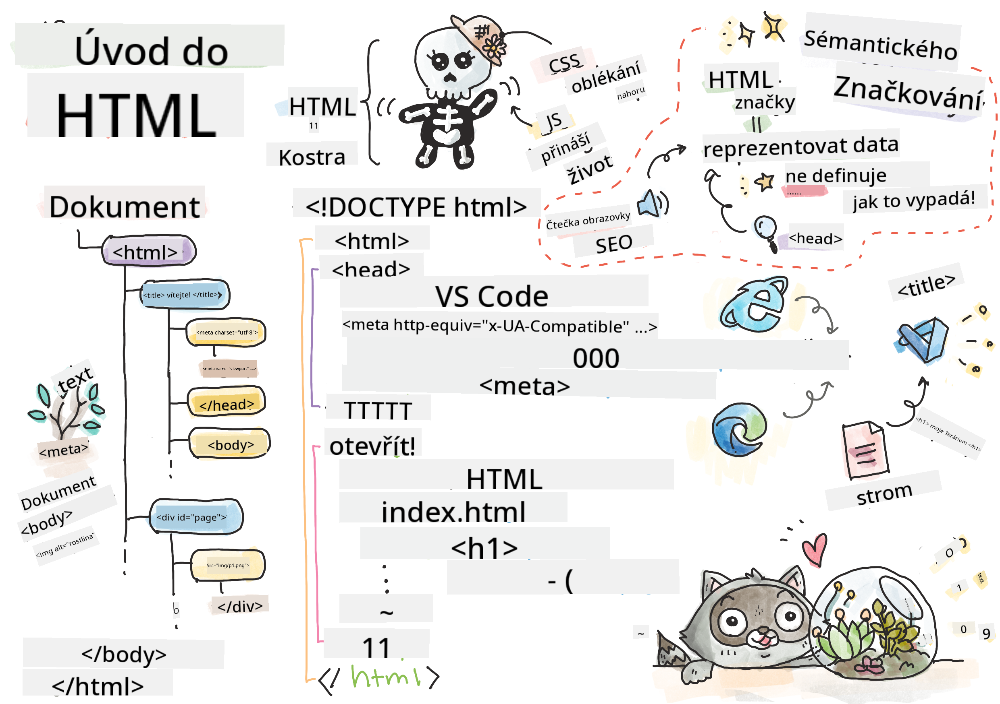
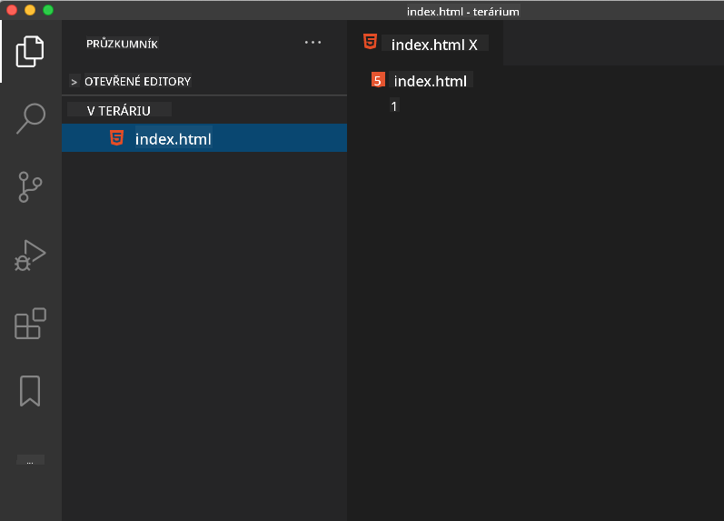

<!--
CO_OP_TRANSLATOR_METADATA:
{
  "original_hash": "20c72cf2e5b0050d38ca3cb14a75a9df",
  "translation_date": "2025-10-24T21:00:24+00:00",
  "source_file": "3-terrarium/1-intro-to-html/README.md",
  "language_code": "cs"
}
-->
# Projekt Terrárium, část 1: Úvod do HTML


> Ilustrace od [Tomomi Imura](https://twitter.com/girlie_mac)

HTML, neboli HyperText Markup Language, je základem každé webové stránky, kterou jste kdy navštívili. Představte si HTML jako kostru, která dává webovým stránkám strukturu – definuje, kam patří obsah, jak je organizován a co každý prvek představuje. Zatímco CSS později "oblékne" vaše HTML barvami a rozvržením a JavaScript mu dodá interaktivitu, HTML poskytuje základní strukturu, která umožňuje vše ostatní.

V této lekci vytvoříte HTML strukturu pro rozhraní virtuálního terária. Tento praktický projekt vás naučí základní koncepty HTML a zároveň vytvoříte něco vizuálně zajímavého. Naučíte se, jak organizovat obsah pomocí sémantických prvků, pracovat s obrázky a vytvořit základ pro interaktivní webovou aplikaci.

Na konci této lekce budete mít funkční HTML stránku zobrazující obrázky rostlin v organizovaných sloupcích, připravenou k úpravě stylu v další lekci. Nebojte se, pokud to zpočátku vypadá jednoduše – přesně tak by mělo HTML vypadat, než mu CSS dodá vizuální úpravy.

## Kvíz před lekcí

[Kvíz před lekcí](https://ff-quizzes.netlify.app/web/quiz/15)

> 📺 **Podívejte se na video**: Prohlédněte si tento užitečný přehled
> 
> [](https://www.youtube.com/watch?v=1TvxJKBzhyQ)

## Nastavení projektu

Než se pustíme do HTML kódu, nastavíme si správné pracovní prostředí pro váš projekt terária. Vytvoření organizované struktury souborů od začátku je důležitý návyk, který vám bude užitečný během celé vaší cesty webového vývoje.

### Úkol: Vytvořte strukturu projektu

Vytvoříte vyhrazenou složku pro váš projekt terária a přidáte svůj první HTML soubor. Zde jsou dvě možnosti, jak to udělat:

**Možnost 1: Použití Visual Studio Code**
1. Otevřete Visual Studio Code
2. Klikněte na "File" → "Open Folder" nebo použijte `Ctrl+K, Ctrl+O` (Windows/Linux) nebo `Cmd+K, Cmd+O` (Mac)
3. Vytvořte novou složku s názvem `terrarium` a vyberte ji
4. V panelu Explorer klikněte na ikonu "New File"
5. Pojmenujte svůj soubor `index.html`



**Možnost 2: Použití příkazového řádku**
```bash
mkdir terrarium
cd terrarium
touch index.html
code index.html
```

**Co tyto příkazy dělají:**
- **Vytvoří** nový adresář s názvem `terrarium` pro váš projekt
- **Přejde** do adresáře terrarium
- **Vytvoří** prázdný soubor `index.html`
- **Otevře** soubor ve Visual Studio Code pro úpravy

> 💡 **Tip**: Název souboru `index.html` je ve webovém vývoji speciální. Když někdo navštíví webovou stránku, prohlížeče automaticky hledají `index.html` jako výchozí stránku k zobrazení. To znamená, že URL jako `https://mysite.com/projects/` automaticky zobrazí soubor `index.html` ze složky `projects`, aniž by bylo nutné specifikovat název souboru v URL.

## Porozumění struktuře HTML dokumentu

Každý HTML dokument má specifickou strukturu, kterou prohlížeče potřebují k tomu, aby jej správně pochopily a zobrazily. Tuto strukturu si můžete představit jako formální dopis – má povinné prvky v určitém pořadí, které pomáhají příjemci (v tomto případě prohlížeči) správně zpracovat obsah.

Začněme přidáním základů, které každý HTML dokument potřebuje.

### Deklarace DOCTYPE a kořenový prvek

První dva řádky jakéhokoli HTML souboru slouží jako "úvod" dokumentu pro prohlížeč:

```html
<!DOCTYPE html>
<html></html>
```

**Co tento kód dělá:**
- **Deklaruje** typ dokumentu jako HTML5 pomocí `<!DOCTYPE html>`
- **Vytváří** kořenový prvek `<html>`, který bude obsahovat veškerý obsah stránky
- **Zavádí** moderní webové standardy pro správné vykreslování prohlížečem
- **Zajišťuje** konzistentní zobrazení napříč různými prohlížeči a zařízeními

> 💡 **Tip pro VS Code**: Přejeďte kurzorem nad jakýmkoli HTML tagem ve VS Code a zobrazí se užitečné informace z MDN Web Docs, včetně příkladů použití a podrobností o kompatibilitě prohlížečů.

> 📚 **Další informace**: Deklarace DOCTYPE zabraňuje prohlížečům vstoupit do "quirks mode", který byl používán k podpoře velmi starých webových stránek. Moderní webový vývoj používá jednoduchou deklaraci `<!DOCTYPE html>` k zajištění [vykreslování v souladu se standardy](https://developer.mozilla.org/docs/Web/HTML/Quirks_Mode_and_Standards_Mode).

## Přidání základních metadat dokumentu

Sekce `<head>` HTML dokumentu obsahuje důležité informace, které prohlížeče a vyhledávače potřebují, ale které návštěvníci přímo na stránce nevidí. Můžete si ji představit jako "zákulisní" informace, které pomáhají vaší webové stránce správně fungovat a zobrazovat se na různých zařízeních a platformách.

Tato metadata říkají prohlížečům, jak zobrazit vaši stránku, jaké kódování znaků použít a jak se vypořádat s různými velikostmi obrazovek – vše nezbytné pro vytvoření profesionálních, přístupných webových stránek.

### Úkol: Přidejte hlavičku dokumentu

Vložte tuto sekci `<head>` mezi otevírací a zavírací tagy `<html>`:

```html
<head>
	<title>Welcome to my Virtual Terrarium</title>
	<meta charset="utf-8" />
	<meta http-equiv="X-UA-Compatible" content="IE=edge" />
	<meta name="viewport" content="width=device-width, initial-scale=1" />
</head>
```

**Rozbor toho, co každý prvek dělá:**
- **Nastavuje** název stránky, který se zobrazí na záložkách prohlížeče a ve výsledcích vyhledávání
- **Specifikuje** kódování znaků UTF-8 pro správné zobrazení textu po celém světě
- **Zajišťuje** kompatibilitu s moderními verzemi Internet Exploreru
- **Konfiguruje** responzivní design nastavením viewportu podle šířky zařízení
- **Řídí** počáteční úroveň přiblížení pro zobrazení obsahu v přirozené velikosti

> 🤔 **Zamyslete se**: Co by se stalo, kdybyste nastavili meta tag viewport například takto: `<meta name="viewport" content="width=600">`? Tím byste stránku vždy nastavili na šířku 600 pixelů, což by narušilo responzivní design! Další informace o [správné konfiguraci viewportu](https://developer.mozilla.org/docs/Web/HTML/Viewport_meta_tag).

## Vytvoření těla dokumentu

Prvek `<body>` obsahuje veškerý viditelný obsah vaší webové stránky – vše, co uživatelé uvidí a s čím budou interagovat. Zatímco sekce `<head>` poskytla instrukce prohlížeči, sekce `<body>` obsahuje skutečný obsah: text, obrázky, tlačítka a další prvky, které tvoří uživatelské rozhraní.

Pojďme přidat strukturu těla a pochopit, jak HTML tagy spolupracují na vytvoření smysluplného obsahu.

### Porozumění struktuře HTML tagů

HTML používá párové tagy k definování prvků. Většina tagů má otevírací tag jako `<p>` a zavírací tag jako `</p>`, s obsahem mezi nimi: `<p>Ahoj, světe!</p>`. Tím se vytvoří prvek odstavce obsahující text "Ahoj, světe!".

### Úkol: Přidejte prvek těla

Aktualizujte svůj HTML soubor tak, aby obsahoval prvek `<body>`:

```html
<!DOCTYPE html>
<html>
	<head>
		<title>Welcome to my Virtual Terrarium</title>
		<meta charset="utf-8" />
		<meta http-equiv="X-UA-Compatible" content="IE=edge" />
		<meta name="viewport" content="width=device-width, initial-scale=1" />
	</head>
	<body></body>
</html>
```

**Co tato kompletní struktura poskytuje:**
- **Zavádí** základní rámec HTML5 dokumentu
- **Obsahuje** základní metadata pro správné vykreslování prohlížečem
- **Vytváří** prázdné tělo připravené pro váš viditelný obsah
- **Dodržuje** moderní nejlepší praktiky webového vývoje

Nyní jste připraveni přidat viditelné prvky vašeho terária. Použijeme prvky `<div>` jako kontejnery pro organizaci různých sekcí obsahu a prvky `` pro zobrazení obrázků rostlin.

### Práce s obrázky a kontejnery rozvržení

Obrázky jsou v HTML speciální, protože používají "samouzavírací" tagy. Na rozdíl od prvků jako `<p></p>`, které obklopují obsah, tag `` obsahuje všechny potřebné informace uvnitř samotného tagu pomocí atributů jako `src` pro cestu k souboru obrázku a `alt` pro přístupnost.

Než přidáte obrázky do svého HTML, budete muset správně uspořádat soubory projektu vytvořením složky obrázků a přidáním grafiky rostlin.

**Nejprve nastavte své obrázky:**
1. Vytvořte složku s názvem `images` uvnitř složky projektu terrária
2. Stáhněte obrázky rostlin ze [řešení složky](../../../../3-terrarium/solution/images) (celkem 14 obrázků rostlin)
3. Zkopírujte všechny obrázky rostlin do své nové složky `images`

### Úkol: Vytvořte rozvržení zobrazení rostlin

Nyní přidejte obrázky rostlin organizované ve dvou sloupcích mezi vaše tagy `<body></body>`:

```html
<div id="page">
	<div id="left-container" class="container">
		<div class="plant-holder">
			
		</div>
		<div class="plant-holder">
			
		</div>
		<div class="plant-holder">
			
		</div>
		<div class="plant-holder">
			
		</div>
		<div class="plant-holder">
			
		</div>
		<div class="plant-holder">
			
		</div>
		<div class="plant-holder">
			
		</div>
	</div>
	<div id="right-container" class="container">
		<div class="plant-holder">
			
		</div>
		<div class="plant-holder">
			
		</div>
		<div class="plant-holder">
			
		</div>
		<div class="plant-holder">
			
		</div>
		<div class="plant-holder">
			
		</div>
		<div class="plant-holder">
			
		</div>
		<div class="plant-holder">
			
		</div>
	</div>
</div>
```

**Krok za krokem, co se děje v tomto kódu:**
- **Vytváří** hlavní kontejner stránky s `id="page"` pro držení veškerého obsahu
- **Zavádí** dva kontejnery sloupců: `left-container` a `right-container`
- **Organizuje** 7 rostlin v levém sloupci a 7 rostlin v pravém sloupci
- **Obklopuje** každý obrázek rostliny v divu `plant-holder` pro individuální umístění
- **Používá** konzistentní názvy tříd pro stylování pomocí CSS v další lekci
- **Přiřazuje** unikátní ID každému obrázku rostliny pro interakci pomocí JavaScriptu později
- **Zahrnuje** správné cesty k souborům směřující do složky obrázků

> 🤔 **Zamyslete se**: Všimněte si, že všechny obrázky mají aktuálně stejný alt text "rostlina". To není ideální pro přístupnost. Uživatelé čteček obrazovky by slyšeli "rostlina" opakovaně 14krát, aniž by věděli, kterou konkrétní rostlinu každý obrázek zobrazuje. Dokážete si představit lepší, popisnější alt text pro každý obrázek?

> 📝 **Typy HTML prvků**: Prvky `<div>` jsou "blokové" a zabírají celou šířku, zatímco prvky `<span>` jsou "řádkové" a zabírají pouze potřebnou šířku. Co si myslíte, že by se stalo, kdybyste všechny tyto tagy `<div>` změnili na tagy `<span>`?

S tímto přidaným označením se rostliny objeví na obrazovce, i když zatím nebudou vypadat upraveně – to je úkol pro CSS v další lekci! Prozatím máte pevný HTML základ, který správně organizuje váš obsah a dodržuje nejlepší praktiky přístupnosti.

## Použití sémantického HTML pro přístupnost

Sémantické HTML znamená volbu HTML prvků na základě jejich významu a účelu, nikoli pouze jejich vzhledu. Když používáte sémantické označení, komunikujete strukturu a význam svého obsahu prohlížečům, vyhledávačům a asistenčním technologiím, jako jsou čtečky obrazovky.

Tento přístup činí vaše webové stránky přístupnějšími pro uživatele s postižením a pomáhá vyhledávačům lépe porozumět vašemu obsahu. Je to základní princip moderního webového vývoje, který vytváří lepší zážitky pro všechny.

### Přidání sémantického názvu stránky

Přidejme správný nadpis na stránku vašeho terária. Vložte tento řádek hned za otevírací tag `<body>`:

```html
<h1>My Terrarium</h1>
```

**Proč na sémantickém označení záleží:**
- **Pomáhá** čtečkám obrazovky navigovat a rozumět struktuře stránky
- **Zlepšuje** optimalizaci pro vyhledávače (SEO) tím, že objasňuje hierarchii obsahu
- **Zvyšuje** přístupnost pro uživatele se zrakovým postižením nebo kognitivními rozdíly
- **Vytváří** lepší uživatelské zážitky napříč všemi zařízeními a platformami
- **Dodržuje** webové standardy a nejlepší praktiky pro profesionální vývoj

**Příklady sémantických vs. nesémantických voleb:**

| Účel | ✅ Sémantická volba | ❌ Nesémantická volba |
|------|--------------------|----------------------|
| Hlavní nadpis | `<h1>Titulek</h1>` | `<div class="big-text">Titulek</div>` |
| Navigace | `<nav><ul><li></li></ul></nav>` | `<div class="menu"><div></div></div>` |
| Tlačítko | `<button>Klikni na mě</button>` | `<span onclick="...">Klikni na mě</span>` |
| Obsah článku | `<article><p></p></article>` | `<div class="content"><div></div></div>` |

> 🎥 **Podívejte se na to v praxi**: Podívejte se na [jak čtečky obrazovky interagují s webovými stránkami](https://www.youtube.com/watch?v=OUDV1gqs9GA), abyste pochopili, proč je sémantické označení klíčové pro přístupnost. Všimněte si, jak správná struktura HTML pomáhá uživatelům efektivně navigovat.

## Vytvoření kontejneru terária

Nyní přidáme HTML strukturu samotného terária – skleněného kontejneru, kde budou nakonec umístěny rostliny. Tato sekce demonstruje důležitý koncept: HTML poskytuje strukturu, ale bez stylování pomocí CSS tyto prvky zatím nebudou viditelné.

Označení terária používá popisné názvy tříd, které učiní stylování pomocí CSS intuitivním a udržitelným v další lekci.

### Úkol: Přidejte strukturu terária

Vložte toto označení nad poslední tag `</div>` (před zavíracím tagem hlavního kontejneru stránky):

```html
<div id="terrarium">
	<div class="jar-top"></div>
	<div class="jar-walls">
		<div class="jar-glossy-long"></div>
		<div class="jar-glossy-short"></div>
	</div>
	<div class="dirt"></div>
	<div class="jar-bottom"></div>
</div>
```

**Porozumění této struktuře terária:**
- **Vytváří** hlavní kontejner terária s unikátním ID pro stylování
- **Definuje** samostatné prvky pro každou vizuální komponentu (vršek, stěny, hlínu, dno)
- **Zahrnuje** vnořené prvky pro efekty odrazu skla (lesklé prvky)
- **Používá** popisné názvy tříd, které jasně označují účel každého prvku
- **Připravuje** strukturu pro stylování pomocí CSS, které vytvoří vzhled skleněného terária

> 🤔 **Všimli jste si něčeho?**: I když jste přidali toto označení, na stránce se neobjevilo nic nového! To dokonale ilustruje, jak HTML poskytuje strukturu, zatímco CSS poskytuje vzhled. Tyto tagy `<div>` existují, ale zatím nemají žádné vizuální stylování – to přijde v další lek
**Výzva:** Vytvořte semantickou HTML sekci, která obsahuje hlavní nadpis "Průvodce péčí o rostliny", tři podsekce s nadpisy "Zalévání", "Požadavky na světlo" a "Péče o půdu", přičemž každá obsahuje odstavec informací o péči o rostliny. Použijte správné semantické HTML značky jako `<section>`, `<h2>`, `<h3>` a `<p>` pro vhodnou strukturu obsahu.

Zjistěte více o [agent mode](https://code.visualstudio.com/blogs/2025/02/24/introducing-copilot-agent-mode) zde.

## Prozkoumejte výzvu historie HTML

**Učení o vývoji webu**

HTML se výrazně vyvinulo od doby, kdy Tim Berners-Lee vytvořil první webový prohlížeč v CERNu v roce 1990. Některé starší značky, jako například `<marquee>`, jsou nyní zastaralé, protože nefungují dobře s moderními standardy přístupnosti a principy responzivního designu.

**Vyzkoušejte tento experiment:**
1. Dočasně obalte svůj `<h1>` nadpis značkou `<marquee>`: `<marquee><h1>Moje terárium</h1></marquee>`
2. Otevřete svou stránku v prohlížeči a pozorujte efekt posouvání
3. Zamyslete se, proč byla tato značka zastaralá (nápověda: přemýšlejte o uživatelské zkušenosti a přístupnosti)
4. Odstraňte značku `<marquee>` a vraťte se k semantickému označení

**Otázky k zamyšlení:**
- Jak by posouvající se nadpis mohl ovlivnit uživatele se zrakovým postižením nebo citlivostí na pohyb?
- Jaké moderní CSS techniky by mohly dosáhnout podobných vizuálních efektů přístupněji?
- Proč je důležité používat aktuální webové standardy místo zastaralých prvků?

Prozkoumejte více o [zastaralých a vyřazených HTML prvcích](https://developer.mozilla.org/docs/Web/HTML/Element#Obsolete_and_deprecated_elements), abyste pochopili, jak se webové standardy vyvíjejí za účelem zlepšení uživatelské zkušenosti.


## Kvíz po přednášce

[Kvíz po přednášce](https://ff-quizzes.netlify.app/web/quiz/16)

## Přehled a samostudium

**Prohlubte své znalosti HTML**

HTML je základem webu již více než 30 let, vyvíjející se z jednoduchého jazyka pro označování dokumentů na sofistikovanou platformu pro vytváření interaktivních aplikací. Porozumění tomuto vývoji vám pomůže ocenit moderní webové standardy a dělat lepší rozhodnutí při vývoji.

**Doporučené studijní cesty:**

1. **Historie a vývoj HTML**
   - Prozkoumejte časovou osu od HTML 1.0 po HTML5
   - Zjistěte, proč byly některé značky zastaralé (přístupnost, přívětivost pro mobilní zařízení, udržovatelnost)
   - Zkoumejte nové funkce HTML a návrhy

2. **Hlubší pohled na semantické HTML**
   - Prostudujte kompletní seznam [semantických prvků HTML5](https://developer.mozilla.org/docs/Web/HTML/Element)
   - Procvičte si rozpoznávání, kdy použít `<article>`, `<section>`, `<aside>` a `<main>`
   - Naučte se o ARIA atributech pro zlepšenou přístupnost

3. **Moderní vývoj webu**
   - Prozkoumejte [vytváření responzivních webů](https://docs.microsoft.com/learn/modules/build-simple-website/?WT.mc_id=academic-77807-sagibbon) na Microsoft Learn
   - Pochopte, jak HTML integruje CSS a JavaScript
   - Naučte se o nejlepších postupech pro výkon webu a SEO

**Otázky k zamyšlení:**
- Které zastaralé HTML značky jste objevili a proč byly odstraněny?
- Jaké nové funkce HTML jsou navrhovány pro budoucí verze?
- Jak přispívá semantické HTML k přístupnosti webu a SEO?


## Zadání

[Procvičte si HTML: Vytvořte maketu blogu](assignment.md)

---

**Prohlášení**:  
Tento dokument byl přeložen pomocí služby AI pro překlady [Co-op Translator](https://github.com/Azure/co-op-translator). I když se snažíme o přesnost, mějte prosím na paměti, že automatické překlady mohou obsahovat chyby nebo nepřesnosti. Původní dokument v jeho původním jazyce by měl být považován za autoritativní zdroj. Pro důležité informace se doporučuje profesionální lidský překlad. Neodpovídáme za žádná nedorozumění nebo nesprávné interpretace vyplývající z použití tohoto překladu.