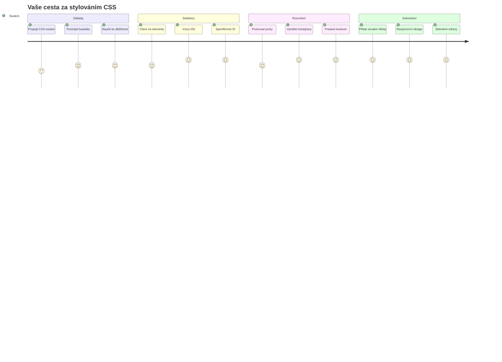
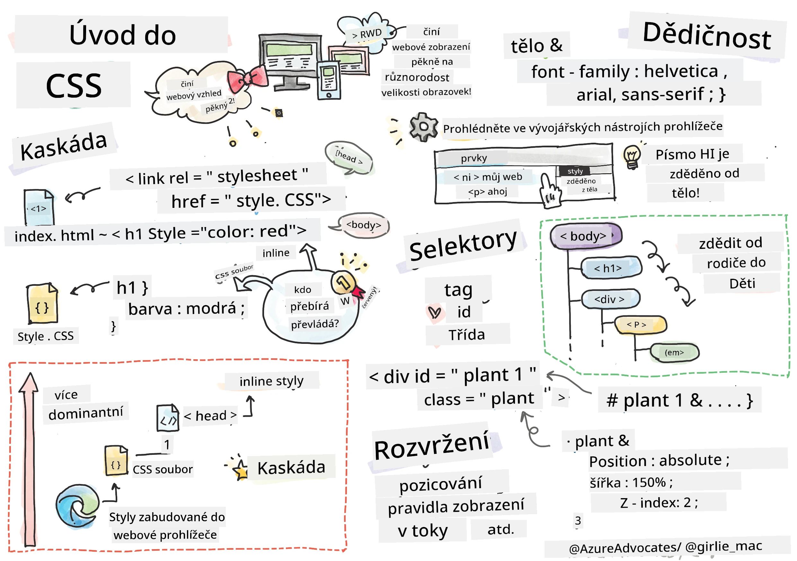
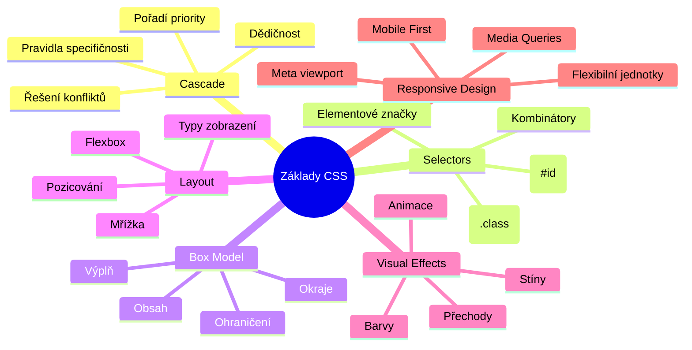
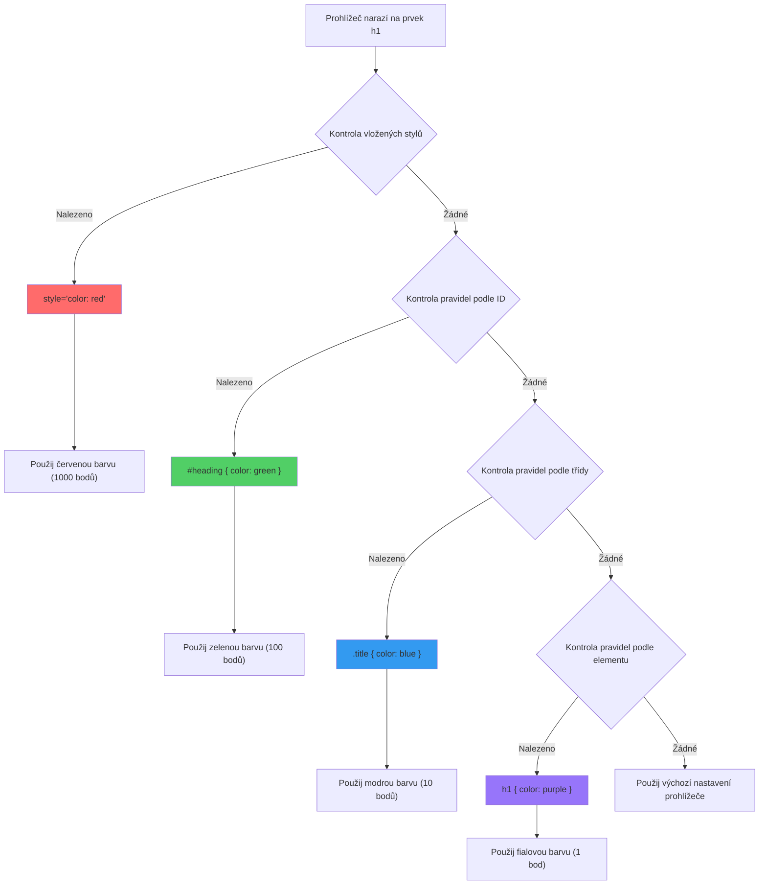
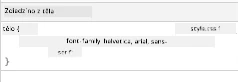
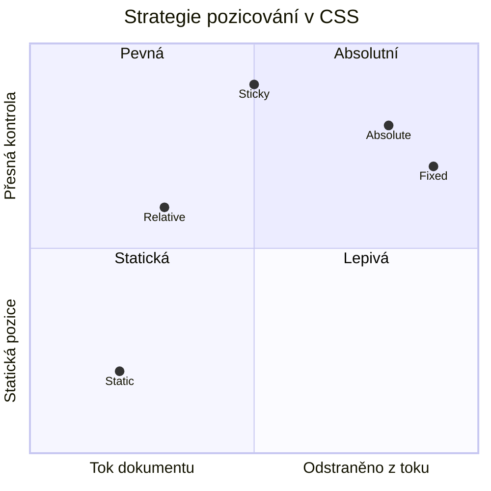
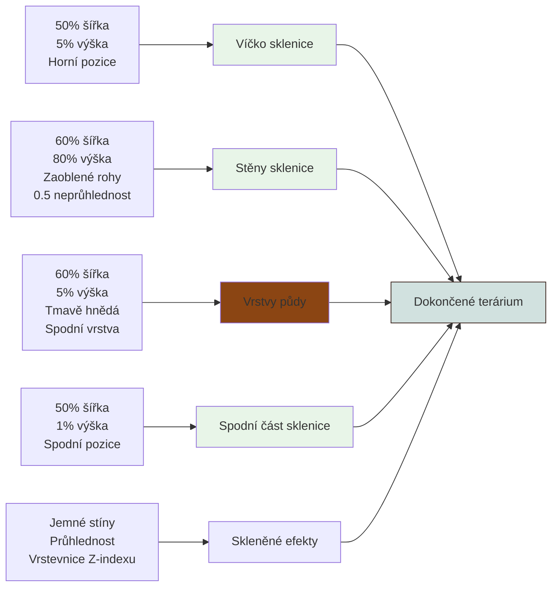
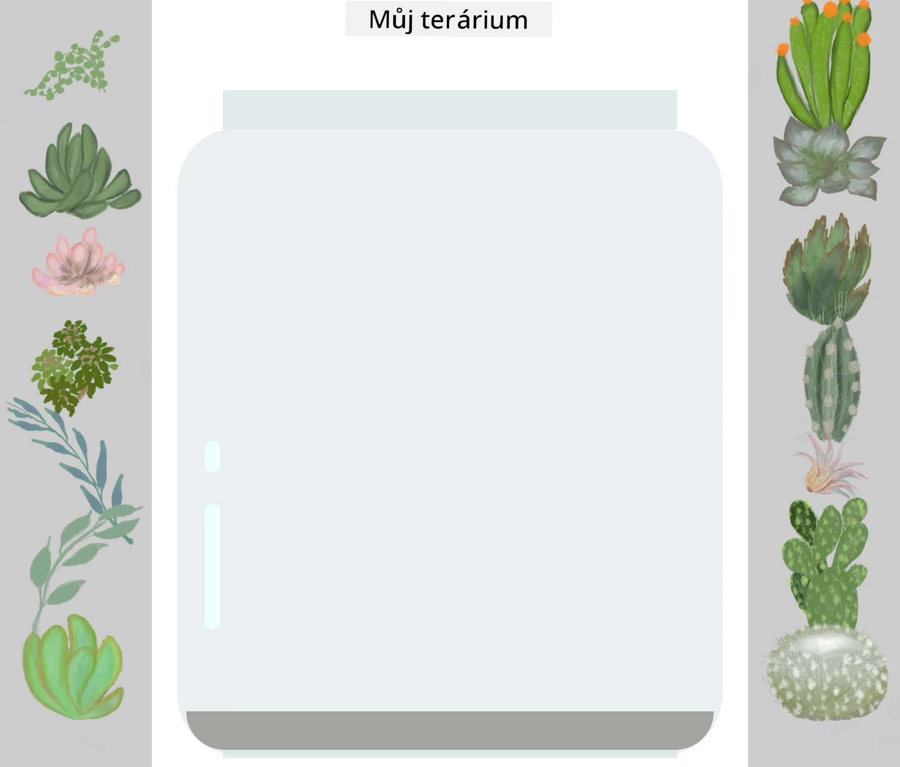
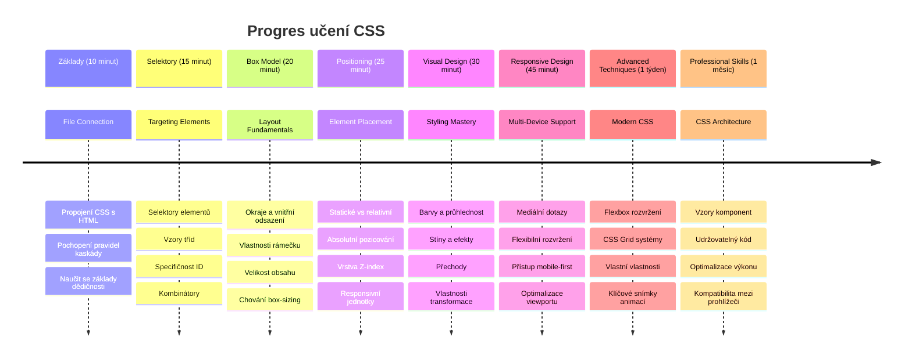

<!--
CO_OP_TRANSLATOR_METADATA:
{
  "original_hash": "e39f3a4e3bcccf94639e3af1248f8a4d",
  "translation_date": "2026-01-07T04:07:04+00:00",
  "source_file": "3-terrarium/2-intro-to-css/README.md",
  "language_code": "cs"
}
-->
# Terrárium Projekt Část 2: Úvod do CSS



> Sketchnote od [Tomomi Imura](https://twitter.com/girlie_mac)

Vzpomínáte si, jak vaše HTML terrárium vypadalo docela základně? CSS je místo, kde přeměníme tu obyčejnou strukturu v něco vizuálně přitažlivého.

Pokud je HTML jako stavba rámu domu, pak CSS je vše, co z něj dělá domov – barvy na stěnách, rozmístění nábytku, osvětlení a jak místnosti spolu plynule navazují. Zamyslete se, jak se Palác ve Versailles začal jako jednoduchý lovecký zámeček, ale pečlivá pozornost k dekoraci a uspořádání ho proměnila v jednu z nejvýznamnějších budov světa.

Dnes proměníme vaše terrárium z funkčního na uhlazené. Naučíte se, jak přesně umisťovat prvky, jak vytvořit rozvržení reagující na různé velikosti obrazovky a vytvořit vizuální přitažlivost, která weby činí poutavými.

Na konci této lekce uvidíte, jak strategický CSS styling může dramaticky zlepšit váš projekt. Přidejme vašemu terráriu trochu stylu.


## Přednáškový kvíz

[Přednáškový kvíz](https://ff-quizzes.netlify.app/web/quiz/17)

## Začínáme s CSS

CSS je často považováno jen za „dělání věcí hezčími“, ale slouží mnohem širšímu účelu. CSS je jako být režisérem filmu – kontrolujete nejen, jak vše vypadá, ale i jak se pohybuje, reaguje na interakce a přizpůsobuje se různým situacím.

Moderní CSS je neuvěřitelně schopné. Můžete psát kód, který automaticky upravuje rozvržení pro telefony, tablety i desktopové počítače. Můžete vytvářet plynulé animace, které vedou pozornost uživatelů tam, kde je potřeba. Výsledky mohou být opravdu působivé, když vše funguje spolu.

> 💡 **Profesionální tip**: CSS se neustále vyvíjí s novými funkcemi a možnostmi. Vždy si ověřte na [CanIUse.com](https://caniuse.com) podporu prohlížečů nových CSS funkcí před jejich použitím v produkčních projektech.

**Toto si v lekci osvojíte:**
- **Vytvoříme** kompletní vizuální design vašeho terrária pomocí moderních CSS technik
- **Prozkoumáme** základní koncepty jako kaskáda, dědičnost a CSS selektory
- **Implementujeme** responzivní umístění a strategie rozvržení
- **Postavíme** kontejner terrária pomocí CSS tvarů a stylování

### Požadavky

Měli byste mít dokončenou HTML strukturu vašeho terrária z předchozí lekce a připravenou k stylování.

> 📺 **Video zdroj**: Podívejte se na tento užitečný video průvodce
>
> [](https://www.youtube.com/watch?v=6yIdOIV9p1I)

### Nastavení souboru CSS

Než začneme se stylováním, musíme propojit CSS s naším HTML. Toto propojení říká prohlížeči, kde najde instrukce pro stylování našeho terrária.

Ve složce vašeho terrária vytvořte nový soubor s názvem `style.css` a propojte ho v `<head>` sekci vašeho HTML dokumentu:

```html
<link rel="stylesheet" href="./style.css" />
```

**Co tento kód dělá:**
- **Vytváří** propojení mezi vaším HTML a CSS soubory
- **Říká** prohlížeči, aby načetl a aplikoval styly ze souboru `style.css`
- **Používá** atribut `rel="stylesheet"` pro specifikaci, že se jedná o CSS soubor
- **Odkazuje** na cestu souboru s `href="./style.css"`

## Pochopení CSS kaskády

Už jste se někdy ptali, proč se CSS říká „Cascading“ Style Sheets (kaskádové styly)? Styly kaskádovitě přecházejí dolů jako vodopád a někdy si navzájem odporují.

Přemýšlejte, jak fungují vojenské velení – generální rozkaz může říkat „všichni vojáci noste zelenou“, ale specifický rozkaz vaší jednotce říká „na ceremonii noste slavnostní uniformu“. Specifičtější instrukce má přednost. CSS se řídí podobnou logikou a pochopení této hierarchie pomáhá při odstraňování chyb.

### Experiment s prioritou kaskády

Pojďme vidět kaskádu v akci vytvořením konfliktu stylů. Nejprve přidejte inline styl do vašeho `<h1>` tagu:

```html
<h1 style="color: red">My Terrarium</h1>
```

**Co tento kód dělá:**
- **Aplikuje** červenou barvu přímo na `<h1>` prvek pomocí inline stylu
- **Používá** atribut `style` pro vložení CSS přímo do HTML
- **Vytváří** styl s nejvyšší prioritou pro tento konkrétní prvek

Dále přidejte toto pravidlo do vašeho souboru `style.css`:

```css
h1 {
  color: blue;
}
```

**V uvedeném jsme:**
- **Definovali** CSS pravidlo, které cílí na všechny `<h1>` prvky
- **Nastavili** barvu textu na modrou pomocí externího stylopisu
- **Vytvořili** pravidlo s nižší prioritou oproti inline stylům

✅ **Ověření znalostí**: Jaká barva se zobrazí ve vaší webové aplikaci? Proč tato barva vyhraje? Můžete vymyslet situace, kdy byste chtěli styly přepsat?


> 💡 **Pořadí priority CSS (od nejvyšší po nejnižší):**
> 1. **Inline styly** (atribut style)
> 2. **ID selektory** (#myId)
> 3. **Třídy** (.myClass) a atributy
> 4. **Element selektory** (h1, div, p)
> 5. **Výchozí styly prohlížeče**

## CSS dědičnost v praxi

CSS dědičnost funguje jako genetika – prvky dědí určité vlastnosti od svých rodičovských prvků. Pokud nastavíte font family na element `<body>`, veškerý text uvnitř automaticky používá stejný font. Je to podobné, jako charakteristická čelist habsburské rodiny, která se objevila v několika generacích, aniž by byla definována pro každého jednotlivce.

Není však všechno dědičné. Textové styly jako fonty a barvy ano, ale rozvržení jako okraje a rámečky se nedědí. Stejně jako děti mohou zdědit fyzické rysy, ale ne oblečení svých rodičů.

### Pozorování dědičnosti fontu

Podívejme se na dědičnost v akci nastavením font family na element `<body>`:

```css
body {
  font-family: 'Segoe UI', Tahoma, Geneva, Verdana, sans-serif;
}
```

**Co se zde děje:**
- **Nastavuje** font family pro celou stránku cílením na element `<body>`
- **Používá** font stack s náhradními možnostmi pro lepší kompatibilitu
- **Aplikuje** moderní systémové fonty, které vypadají skvěle na různých operačních systémech
- **Zajišťuje**, že všechny podřízené prvky dědí tento font, pokud není specificky přepsán

Otevřete nástroje pro vývojáře prohlížeče (F12), přejděte na záložku Elements a prohlédněte si váš `<h1>` element. Uvidíte, že dědí font family od těla:



✅ **Zkouška**: Vyzkoušejte nastavit další děditelné vlastnosti na element `<body>`, např. `color`, `line-height` nebo `text-align`. Co se stane s vaším nadpisem a dalšími prvky?

> 📝 **Mezi děditelné vlastnosti patří**: `color`, `font-family`, `font-size`, `line-height`, `text-align`, `visibility`
>
> **Mezi neděditelné vlastnosti patří**: `margin`, `padding`, `border`, `width`, `height`, `position`

### 🔄 **Pedagogická kontrola**
**Pochopení základů CSS**: Než přejdeme k selektorům, ujistěte se, že umíte:
- ✅ Vysvětlit rozdíl mezi kaskádou a dědičností
- ✅ Předpovědět, který styl vyhraje při konfliktu specifičnosti
- ✅ Identifikovat vlastnosti děditelné z rodičovských prvků
- ✅ Správně propojit CSS soubory s HTML

**Rychlý test**: Pokud máte tyto styly, jakou barvu bude mít `<h1>` uvnitř `<div class="special">`?
```css
div { color: blue; }
.special { color: green; }
h1 { color: red; }
```
*Odpověď: Červená (element selektor přímo cílí na h1)*

## Ovládání CSS selektorů

CSS selektory jsou způsob, jak cílit na konkrétní prvky pro stylování. Fungují jako přesné instrukce – místo „dům“ řeknete „modrý dům s červenými dveřmi v ulici Maple“.

CSS nabízí různé způsoby, jak být specifický, a správný výběr selektoru je jako výběr správného nástroje pro práci. Někdy potřebujete stylovat všechny dveře v okolí, jindy jen jedny konkrétní.

### Element selektory (tagy)

Element selektory cílí na HTML prvky podle jejich značky. Jsou ideální pro nastavení základních stylů, které se mají aplikovat široce na stránce:

```css
body {
  font-family: 'Segoe UI', Tahoma, Geneva, Verdana, sans-serif;
  margin: 0;
  padding: 0;
}

h1 {
  color: #3a241d;
  text-align: center;
  font-size: 2.5rem;
  margin-bottom: 1rem;
}
```

**Rozbor těchto stylů:**
- **Nastavuje** konzistentní typografii pro celou stránku pomocí selektoru `body`
- **Odstraňuje** výchozí okraje a padding prohlížeče pro lepší kontrolu
- **Styluje** všechny nadpisové elementy barvou, zarovnáním a odsazením
- **Používá** jednotky `rem` pro škálovatelné, přístupné velikosti písma

Zatímco element selektory fungují dobře pro obecné stylování, budete potřebovat specifičtější selektory pro stylování jednotlivých komponent jako jsou rostliny ve vašem terráriu.

### ID selektory pro unikátní prvky

ID selektory používají symbol `#` a cílí na prvky se specifickým atributem `id`. Protože ID musí být na stránce unikátní, jsou ideální pro stylování izolovaných, speciálních prvků jako naše levé a pravé kontejnery rostlin.

Vytvořme stylování pro postranní kontejnery našeho terrária, kde rostliny budou:

```css
#left-container {
  background-color: #f5f5f5;
  width: 15%;
  left: 0;
  top: 0;
  position: absolute;
  height: 100vh;
  padding: 1rem;
  box-sizing: border-box;
}

#right-container {
  background-color: #f5f5f5;
  width: 15%;
  right: 0;
  top: 0;
  position: absolute;
  height: 100vh;
  padding: 1rem;
  box-sizing: border-box;
}
```

**Co tento kód umí:**
- **Umísťuje** kontejnery k levému a pravému okraji pomocí `absolute` pozicování
- **Používá** jednotky `vh` (výška viewportu) pro responzivní výšku přizpůsobující se velikosti obrazovky
- **Aplikuje** `box-sizing: border-box` tak, aby padding byl zahrnut v celkové šířce
- **Odstraňuje** zbytečné `px` jednotky u nulových hodnot kvůli čistšímu kódu
- **Nastavuje** jemné pozadí, které je příjemnější pro oči než ostrá šedá

✅ **Výzva k optimalizaci kódu**: Všimněte si, že tento CSS porušuje zásadu DRY (Don’t Repeat Yourself). Dokážete jej refaktorovat pomocí kombinace ID a třídy?

**Lepší přístup:**
```html
<div id="left-container" class="container"></div>
<div id="right-container" class="container"></div>
```

```css
.container {
  background-color: #f5f5f5;
  width: 15%;
  top: 0;
  position: absolute;
  height: 100vh;
  padding: 1rem;
  box-sizing: border-box;
}

#left-container {
  left: 0;
}

#right-container {
  right: 0;
}
```

### Třídní selektory pro opakované styly

Třídní selektory používají symbol `.` a jsou perfektní, když chcete aplikovat stejné styly na více prvků. Na rozdíl od ID lze třídy používat opakovaně v celém HTML, což je ideální pro konzistentní stylování vzorů.

V našem terráriu každá rostlina potřebuje podobné stylování, ale také individuální umístění. Použijeme kombinaci tříd pro společné styly a ID pro jedinečné pozice.

**Toto je HTML struktura každé rostliny:**
```html
<div class="plant-holder">
  
</div>
```

**Vysvětlení klíčových prvků:**
- **Používá** `class="plant-holder"` pro konzistentní stylování kontejneru u všech rostlin
- **Aplikuje** `class="plant"` pro společné styly obrázku a chování
- **Obsahuje** unikátní `id="plant1"` pro individuální pozici a JavaScriptovou interakci
- **Poskytuje** popisný alt text pro přístupnost čteček obrazovky

Nyní přidejte tyto styly do vašeho souboru `style.css`:

```css
.plant-holder {
  position: relative;
  height: 13%;
  left: -0.6rem;
}

.plant {
  position: absolute;
  max-width: 150%;
  max-height: 150%;
  z-index: 2;
  transition: transform 0.3s ease;
}

.plant:hover {
  transform: scale(1.05);
}
```

**Co tyto styly dělají:**
- **Vytváří** relativní pozicování pro držitele rostliny, aby byl kontext pozicování
- **Nastavuje** výšku každého držitele rostliny na 13 %, aby všechny rostliny vešly vertikálně bez posouvání
- **Posouvá** držitele mírně doleva pro lepší vystředění rostlin v kontejnerech
- **Umožňuje** rostlinám škálovat se responzivně pomocí `max-width` a `max-height`
- **Používá** `z-index` pro vrstvení rostlin nad ostatní prvky v terráriu
- **Přidává** jemný hover efekt s CSS přechody pro lepší interakci uživatele

✅ **Kritické myšlení**: Proč potřebujeme oba selektory `.plant-holder` a `.plant`? Co by se stalo, kdybychom použili jen jeden?

> 💡 **Designový vzor**: Kontejner (`.plant-holder`) kontroluje rozvržení a pozicování, zatímco obsah (`.plant`) kontroluje vzhled a škálování. Toto rozdělení dělá kód udržitelnějším a flexibilnějším.

## Pochopení CSS pozicování

CSS pozicování je jako být režisérem divadelní hry – určujete, kde každý herec stojí a jak se pohybuje po jevišti. Někteří herci následují základní formaci, zatímco jiní potřebují specifické umístění pro dramatický efekt.

Jakmile pochopíte pozicování, mnohé výzvy rozvržení se stanou zvládnutelnými. Potřebujete navigační lištu, která zůstane nahoře, když uživatelé scrollují? O to se postará pozicování. Chcete tooltip, který se objeví na konkrétním místě? To je taky pozicování.

### Pět hodnot pozice


| Hodnota pozice | Chování | Použití |
|----------------|----------|----------|
| `static` | Výchozí tok, ignoruje top/left/right/bottom | Normální uspořádání dokumentu |
| `relative` | Pozicováno relativně k vlastní normální pozici | Malé úpravy, vytváření kontextu pozicování |
| `absolute` | Pozicováno relativně k nejbližšímu pozicovanému předkovi | Přesné umístění, překryvy |
| `fixed` | Pozicováno relativně k viewportu | Navigační lišty, plovoucí prvky |
| `sticky` | Přepíná mezi relativním a fixním na základě scrollování | Hlavičky, které zůstávají při scrollování přilepené |

### Pozicování v našem terráriu

Naše terrárium používá strategickou kombinaci typů pozicování k vytvoření požadovaného rozvržení:

```css
/* Container positioning */
.container {
  position: absolute; /* Removes from normal flow */
  /* ... other styles ... */
}

/* Plant holder positioning */
.plant-holder {
  position: relative; /* Creates positioning context */
  /* ... other styles ... */
}

/* Plant positioning */
.plant {
  position: absolute; /* Allows precise placement within holder */
  /* ... other styles ... */
}
```

**Vysvětlení strategie pozicování:**
- **Absolutní kontejnery** jsou odstraněny z normálního toku dokumentu a přilepeny k okrajům obrazovky
- **Relativní držitelé rostlin** vytváří kontext pozicování, ale zůstávají v toku dokumentu
- **Absolutní rostliny** lze přesně umístit v rámci relativních kontejnerů
- **Tato kombinace** umožňuje skládání rostlin vertikálně a zároveň jejich individuální pozicování

> 🎯 **Proč je to důležité**: Prvky „plant“ potřebují absolutní pozicování, aby mohly být tažitelné v další lekci. Absolutní pozicování je odstraní z normálního layoutu a umožní drag-and-drop interakce.

✅ **Experiment**: Vyzkoušejte změnit hodnoty pozicování a pozorujte výsledky:
- Co se stane, pokud změníte `.container` z `absolute` na `relative`?
- Jak se změní rozvržení, pokud `.plant-holder` používá `absolute` místo `relative`?
- Co se stane, když přepnete `.plant` na `relative` pozicování?

### 🔄 **Pedagogická kontrola**
**Mistrovství v CSS pozicování**: Zastavte se a ověřte si své porozumění:
- ✅ Dokážete vysvětlit, proč rostliny potřebují absolutní pozicování pro drag-and-drop?
- ✅ Rozumíte, jak relativní kontejnery vytvářejí kontext pozicování?
- ✅ Proč boční kontejnery používají absolutní pozicování?
- ✅ Co by se stalo, kdybyste úplně odstranili deklarace pozicování?

**Spojení s reálným světem**: Zamyslete se, jak CSS pozicování odráží reálné rozvržení:
- **Static**: Knihy na polici (přirozené pořadí)
- **Relative**: Posunutí knihy trochu, ale zachování jejího místa
- **Absolute**: Umístění záložky na přesné číslo stránky
- **Fixed**: Lepicí lístek, který zůstává viditelný při převracení stránek

## Tvorba terária pomocí CSS

Nyní vytvoříme skleněnou nádobu pouze pomocí CSS – bez obrázků nebo grafického softwaru.

Vytváření realisticky vypadajícího skla, stínů a hloubkových efektů pomocí pozicování a průhlednosti demonstruje vizuální schopnosti CSS. Tato technika odráží způsob, jakým architekti z Bauhausu používali jednoduché geometrické tvary k vytvoření složitých a krásných struktur. Jakmile tato pravidla pochopíte, rozpoznáte CSS techniky za mnoha webovými designy.


### Tvorba komponent skleněné nádoby

Pojďme sestavit terárium kousek po kousku. Každá část využívá absolutní pozicování a procentuální rozměry pro responzivní design:

```css
.jar-walls {
  height: 80%;
  width: 60%;
  background: #d1e1df;
  border-radius: 1rem;
  position: absolute;
  bottom: 0.5%;
  left: 20%;
  opacity: 0.5;
  z-index: 1;
  box-shadow: inset 0 0 2rem rgba(0, 0, 0, 0.1);
}

.jar-top {
  width: 50%;
  height: 5%;
  background: #d1e1df;
  position: absolute;
  bottom: 80.5%;
  left: 25%;
  opacity: 0.7;
  z-index: 1;
  border-radius: 0.5rem 0.5rem 0 0;
}

.jar-bottom {
  width: 50%;
  height: 1%;
  background: #d1e1df;
  position: absolute;
  bottom: 0;
  left: 25%;
  opacity: 0.7;
  border-radius: 0 0 0.5rem 0.5rem;
}

.dirt {
  width: 60%;
  height: 5%;
  background: #3a241d;
  position: absolute;
  border-radius: 0 0 1rem 1rem;
  bottom: 1%;
  left: 20%;
  opacity: 0.7;
  z-index: -1;
}
```

**Pochopení konstrukce terária:**
- **Používá** rozměry v procentech pro responzivní škálování na všech obrazovkách
- **Pozicuje** prvky absolutně, aby se přesně stohovaly a zarovnávaly
- **Aplikuje** různé hodnoty průhlednosti k vytvoření efektu skla
- **Implementuje** vrstvení pomocí `z-index`, aby rostliny byly uvnitř nádoby
- **Přidává** jemné stíny a upravené zaoblení rohů pro realistický vzhled

### Responzivní design s procenty

Všimněte si, že všechny rozměry jsou v procentech místo pevných pixelů:

**Proč je to důležité:**
- **Zajišťuje**, že terárium se proporčně škáluje na jakékoliv obrazovce
- **Udržuje** vizuální vztahy mezi komponenty nádoby
- **Poskytuje** konzistentní zážitek od mobilů po velké monitory
- **Umožňuje** designu adaptovat se bez rozbití vizuálního rozvržení

### Použití CSS jednotek v praxi

Používáme jednotky `rem` pro border-radius, které se škálují relativně ke kořenové velikosti písma. To vytváří přístupnější designy respektující uživatelské preference fontů. Více o [relativních jednotkách CSS](https://www.w3.org/TR/css-values-3/#font-relative-lengths) v oficiální specifikaci.

✅ **Vizualní experimenty**: Zkuste upravit tyto hodnoty a pozorujte efekty:
- Změňte průhlednost nádoby z 0.5 na 0.8 – jak to ovlivní vzhled skla?
- Upravte barvu hlíny z `#3a241d` na `#8B4513` – jaký to má vizuální dopad?
- Změňte `z-index` hlíny na 2 – co se stane s vrstvením?

### 🔄 **Pedagogická kontrola**
**Porozumění vizuálnímu designu v CSS**: Potvrďte své znalosti vizuálního CSS:
- ✅ Jak procentuální rozměry vytvářejí responzivní design?
- ✅ Proč průhlednost vytváří efekt skleněné průhlednosti?
- ✅ Jakou roli hraje z-index při vrstvení prvků?
- ✅ Jak zaoblení rohů (border-radius) vytváří tvar nádoby?

**Princip designu**: Všimněte si, jak stavíme složité vizuály z jednoduchých tvarů:
1. **Obdélníky** → **Zaoblené obdélníky** → **Komponenty nádoby**
2. **Plné barvy** → **Průhlednost** → **Efekt skla**
3. **Jednotlivé prvky** → **Vrstvená kompozice** → **3D vzhled**

---

## Výzva GitHub Copilot Agenta 🚀

Použijte režim Agenta k dokončení následující výzvy:

**Popis:** Vytvořte CSS animaci, která jemně houpá rostliny v teráriu ze strany na stranu, simulujíc přirozený vánek. Pomůže vám procvičit CSS animace, transformace a klíčové snímky a zároveň zlepší vizuální atraktivitu terária.

**Pokyn:** Přidejte CSS animace klíčových snímků, které jemně houpají rostliny v teráriu ze strany na stranu. Vytvořte houpavou animaci, která mírně (2-3 stupně) otáčí každou rostlinu doleva a doprava v délce 3-4 sekund, a aplikujte ji na třídu `.plant`. Zajistěte, aby animace běžela nekonečně a měla easing pro přirozený pohyb.

Více o [režimu agenta](https://code.visualstudio.com/blogs/2025/02/24/introducing-copilot-agent-mode) se dozvíte zde.

## 🚀 Výzva: Přidání skleněných odlesků

Připraveni vylepšit vaše terárium o realistické skleněné odlesky? Tato technika přidá designu hloubku a realističnost.

Vytvoříte jemné odlesky, které simulují, jak se světlo odráží od skleněných povrchů. Tento přístup je podobný tomu, jak renesanční malíři jako Jan van Eyck používali světlo a odraz k vytvoření trojrozměrného dojmu malovaného skla. Takto to chcete dosáhnout:



**Vaše výzva:**
- **Vytvořit** jemné bílé nebo světlé oválné tvary pro skleněné odlesky
- **Umístit** je strategicky na levé straně nádoby
- **Aplikovat** vhodné průhlednosti a rozostření pro realistický odraz světla
- **Použít** `border-radius` k vytvoření organických, bublinových tvarů
- **Experimentovat** s přechody nebo stíny pro lepší realističnost

## Kvíz po přednášce

[Kvíz po přednášce](https://ff-quizzes.netlify.app/web/quiz/18)

## Rozšiřte své znalosti CSS

CSS může být zpočátku složité, ale pochopení těchto základních pojmů poskytuje pevné základy pro pokročilé techniky.

**Vaše další oblasti učení CSS:**
- **Flexbox** - zjednodušuje zarovnání a distribuci prvků
- **CSS Grid** - nabízí výkonné nástroje pro tvorbu složitých rozvržení
- **CSS Proměnné** - snižují opakování a zlepšují udržovatelnost
- **Responzivní design** - zajišťuje dobrou funkčnost na různých zařízeních

### Interaktivní vzdělávací zdroje

Procvičujte tyto koncepty pomocí těchto zábavných a praktických her:
- 🐸 [Flexbox Froggy](https://flexboxfroggy.com/) - Ovládněte Flexbox pomocí zábavných úkolů
- 🌱 [Grid Garden](https://codepip.com/games/grid-garden/) - Naučte se CSS Grid pěstováním virtuálních mrkví
- 🎯 [CSS Battle](https://cssbattle.dev/) - Otestujte své CSS dovednosti v kódovacích výzvách

### Další učení

Pro komplexní základy CSS dokončete modul Microsoft Learn: [Stylujte svou HTML aplikaci pomocí CSS](https://docs.microsoft.com/learn/modules/build-simple-website/4-css-basics/?WT.mc_id=academic-77807-sagibbon)

### ⚡ **Co můžete udělat během následujících 5 minut**
- [ ] Otevřít DevTools a prozkoumat CSS styly na jakékoliv stránce pomocí panelu Elements
- [ ] Vytvořit jednoduchý CSS soubor a propojit ho s HTML stránkou
- [ ] Zkusit měnit barvy pomocí různých metod: hex, RGB, a pojmenovaných barev
- [ ] Procvičit box model přidáním paddingu a marginu k divu

### 🎯 **Co můžete zvládnout během této hodiny**
- [ ] Dokončit kvíz po lekci a zopakovat základy CSS
- [ ] Stylovat HTML stránku pomocí fontů, barev a odsazení
- [ ] Vytvořit jednoduché rozvržení pomocí flexboxu nebo gridu
- [ ] Experimentovat s CSS přechody pro plynulé efekty
- [ ] Procvičit responzivní design s media queries

### 📅 **Vaše týdenní CSS dobrodružství**
- [ ] Dokončit zadání pro stylování terária s kreativním přístupem
- [ ] Ovládnout CSS Grid tvorbou galerie fotografií
- [ ] Naučit se CSS animace pro oživení svých designů
- [ ] Prozkoumat CSS preprocesory jako Sass nebo Less
- [ ] Studovat principy designu a aplikovat je v CSS
- [ ] Analyzovat a znovu vytvořit zajímavé designy online

### 🌟 **Vaše měsíční mistrovství v designu**
- [ ] Vytvořit kompletní systém responsivního webdesignu
- [ ] Naučit se CSS-in-JS nebo utility-first frameworky jako Tailwind
- [ ] Přispívat do open source projektů se zlepšeními CSS
- [ ] Ovládnout pokročilé koncepty CSS jako vlastní vlastnosti a containment
- [ ] Vytvořit znovupoužitelné knihovny komponent s modulárním CSS
- [ ] Mentorovat další, kdo se učí CSS, a sdílet designové znalosti

## 🎯 Váš časový plán zvládnutí CSS


### 🛠️ Shrnutí vašeho CSS nástroje

Po dokončení této lekce máte nyní:
- **Porozumění kaskádě**: Jak se styly dědí a přepisují
- **Mistrovství selektorů**: Precizní cílení na elementy, třídy a ID
- **Dovednosti pozicování**: Strategické umisťování a vrstvení prvků
- **Vizuální design**: Vytváření skleněných efektů, stínů a průhlednosti
- **Responzivní techniky**: Rozvržení založená na procentech, která se přizpůsobí obrazovce
- **Organizace kódu**: Čistá, udržitelná struktura CSS
- **Moderní přístupy**: Používání relativních jednotek a přístupných designových vzorů

**Další kroky**: Vaše terárium má nyní strukturu (HTML) i styl (CSS). Závěrečná lekce přidá interaktivitu pomocí JavaScriptu!

## Zadání

[CSS Refactoring](assignment.md)

---

<!-- CO-OP TRANSLATOR DISCLAIMER START -->
**Prohlášení o vyloučení odpovědnosti**:
Tento dokument byl přeložen pomocí služby automatického překladu AI [Co-op Translator](https://github.com/Azure/co-op-translator). I když usilujeme o přesnost, mějte prosím na paměti, že automatické překlady mohou obsahovat chyby nebo nepřesnosti. Originální dokument v jeho rodném jazyce by měl být považován za autoritativní zdroj. Pro důležité informace se doporučuje profesionální lidský překlad. Nejsme odpovědni za jakékoli nedorozumění nebo chybné výklady vyplývající z použití tohoto překladu.
<!-- CO-OP TRANSLATOR DISCLAIMER END -->