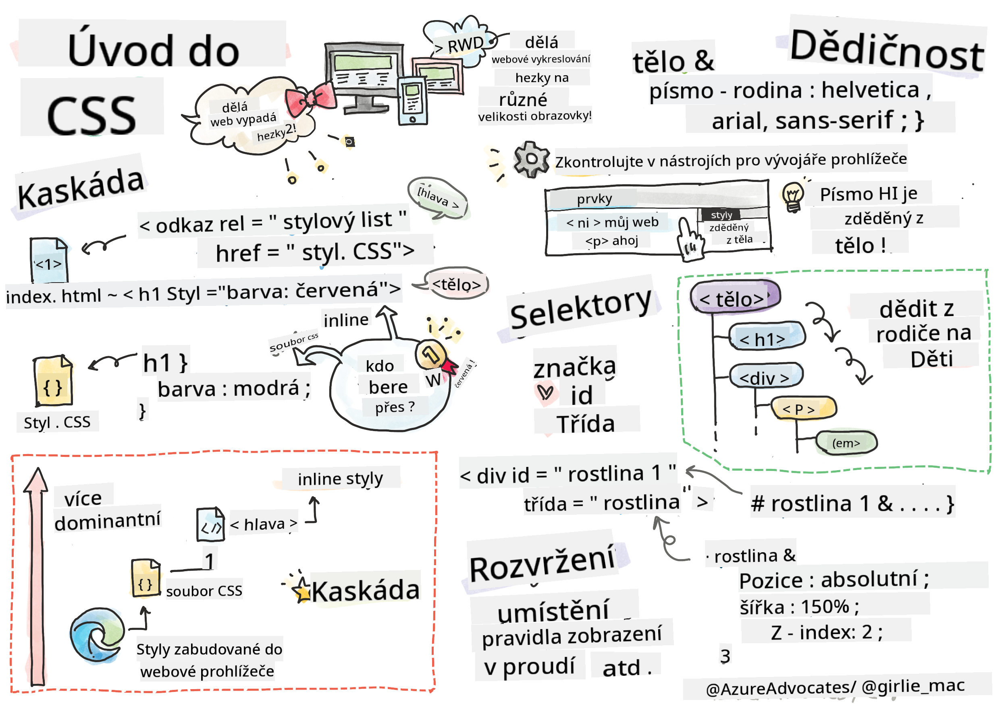

<!--
CO_OP_TRANSLATOR_METADATA:
{
  "original_hash": "acb5ae00cde004304296bb97da8ff4c3",
  "translation_date": "2025-08-29T10:55:38+00:00",
  "source_file": "3-terrarium/2-intro-to-css/README.md",
  "language_code": "cs"
}
-->
# Projekt Terrárium, část 2: Úvod do CSS


> Sketchnote od [Tomomi Imura](https://twitter.com/girlie_mac)

## Kvíz před lekcí

[Kvíz před lekcí](https://ff-quizzes.netlify.app/web/quiz/17)

### Úvod

CSS, neboli Cascading Style Sheets, řeší důležitý problém webového vývoje: jak udělat, aby váš web vypadal hezky. Stylování vašich aplikací je činí uživatelsky přívětivějšími a vizuálně atraktivnějšími; pomocí CSS můžete také vytvořit responzivní webový design (RWD) – díky tomu budou vaše aplikace vypadat dobře bez ohledu na velikost obrazovky, na které jsou zobrazeny. CSS není jen o tom, aby vaše aplikace vypadala hezky; jeho specifikace zahrnuje animace a transformace, které umožňují sofistikované interakce ve vašich aplikacích. CSS Working Group pomáhá udržovat aktuální specifikace CSS; jejich práci můžete sledovat na [stránkách World Wide Web Consortium](https://www.w3.org/Style/CSS/members).

> Poznámka: CSS je jazyk, který se vyvíjí, stejně jako vše na webu, a ne všechny prohlížeče podporují novější části specifikace. Vždy ověřte své implementace konzultací na [CanIUse.com](https://caniuse.com).

V této lekci přidáme styly do našeho online terrária a naučíme se více o několika konceptech CSS: kaskádě, dědičnosti, použití selektorů, pozicování a využití CSS pro tvorbu rozvržení. Během procesu vytvoříme rozvržení terrária a samotné terrárium.

### Předpoklady

Měli byste mít připravený HTML pro vaše terrárium, aby bylo možné jej stylovat.

> Podívejte se na video

> 
> [](https://www.youtube.com/watch?v=6yIdOIV9p1I)

### Úkol

Ve složce s vaším terráriem vytvořte nový soubor s názvem `style.css`. Importujte tento soubor do sekce `<head>`:

```html
<link rel="stylesheet" href="./style.css" />
```

---

## Kaskáda

Cascading Style Sheets zahrnují myšlenku, že styly „kaskádují“, což znamená, že aplikace stylu je řízena jeho prioritou. Styly nastavené autorem webu mají přednost před těmi, které nastaví prohlížeč. Styly nastavené „inline“ mají přednost před těmi, které jsou nastaveny v externím stylovém souboru.

### Úkol

Přidejte inline styl „color: red“ do vašeho tagu `<h1>`:

```HTML
<h1 style="color: red">My Terrarium</h1>
```

Poté přidejte následující kód do vašeho souboru `style.css`:

```CSS
h1 {
 color: blue;
}
```

✅ Jaká barva se zobrazí ve vaší webové aplikaci? Proč? Dokážete najít způsob, jak přepsat styly? Kdy byste to chtěli udělat, nebo proč ne?

---

## Dědičnost

Styly se dědí od nadřazeného stylu k podřízenému, takže vnořené prvky dědí styly svých rodičů.

### Úkol

Nastavte font těla na daný font a zkontrolujte, zda vnořený prvek zdědí tento font:

```CSS
body {
	font-family: helvetica, arial, sans-serif;
}
```

Otevřete konzoli vašeho prohlížeče na záložce „Elements“ a sledujte font H1. Dědí svůj font z těla, jak je uvedeno v prohlížeči:


✅ Dokážete udělat, aby vnořený styl zdědil jinou vlastnost?

---

## Selektory CSS

### Tagy

Doposud váš soubor `style.css` obsahuje pouze několik stylovaných tagů a aplikace vypadá dost zvláštně:

```CSS
body {
	font-family: helvetica, arial, sans-serif;
}

h1 {
	color: #3a241d;
	text-align: center;
}
```

Tento způsob stylování tagu vám dává kontrolu nad unikátními prvky, ale potřebujete kontrolovat styly mnoha rostlin ve vašem terráriu. K tomu musíte využít selektory CSS.

### Id

Přidejte nějaký styl pro rozvržení levého a pravého kontejneru. Protože existuje pouze jeden levý kontejner a jeden pravý kontejner, jsou v označení HTML označeny id. Pro jejich stylování použijte `#`:

```CSS
#left-container {
	background-color: #eee;
	width: 15%;
	left: 0px;
	top: 0px;
	position: absolute;
	height: 100%;
	padding: 10px;
}

#right-container {
	background-color: #eee;
	width: 15%;
	right: 0px;
	top: 0px;
	position: absolute;
	height: 100%;
	padding: 10px;
}
```

Zde jste umístili tyto kontejnery s absolutním pozicováním na krajní levý a pravý okraj obrazovky a použili procenta pro jejich šířku, aby se mohly přizpůsobit malým mobilním obrazovkám.

✅ Tento kód je poměrně opakující se, a tedy ne „DRY“ (Don't Repeat Yourself); dokážete najít lepší způsob, jak stylovat tato id, třeba pomocí id a třídy? Museli byste změnit označení a refaktorovat CSS:

```html
<div id="left-container" class="container"></div>
```

### Třídy

V předchozím příkladu jste stylovali dva unikátní prvky na obrazovce. Pokud chcete, aby se styly aplikovaly na mnoho prvků na obrazovce, můžete použít třídy CSS. Udělejte to pro rozvržení rostlin v levém a pravém kontejneru.

Všimněte si, že každá rostlina v označení HTML má kombinaci id a tříd. Id jsou zde používána JavaScriptem, který přidáte později, pro manipulaci s umístěním rostlin v terráriu. Třídy však dávají všem rostlinám daný styl.

```html
<div class="plant-holder">
	
</div>
```

Přidejte následující do vašeho souboru `style.css`:

```CSS
.plant-holder {
	position: relative;
	height: 13%;
	left: -10px;
}

.plant {
	position: absolute;
	max-width: 150%;
	max-height: 150%;
	z-index: 2;
}
```

Pozoruhodné v tomto úryvku je míchání relativního a absolutního pozicování, které si podrobněji vysvětlíme v další části. Podívejte se na způsob, jakým jsou výšky řešeny pomocí procent:

Nastavili jste výšku držáku rostlin na 13 %, což je dobré číslo, aby byly všechny rostliny zobrazeny v každém vertikálním kontejneru bez nutnosti posouvání.

Držák rostlin je posunut doleva, aby byly rostliny více vycentrovány v jejich kontejneru. Obrázky mají velké množství průhledného pozadí, aby byly lépe přetahovatelné, takže je třeba je posunout doleva, aby lépe zapadly na obrazovku.

Rostlina samotná má maximální šířku 150 %. To jí umožňuje zmenšovat se, jak se zmenšuje prohlížeč. Zkuste změnit velikost prohlížeče; rostliny zůstávají ve svých kontejnerech, ale zmenšují se, aby se přizpůsobily.

Pozoruhodné je také použití z-indexu, který ovládá relativní výšku prvku (takže rostliny sedí na kontejneru a vypadají, že jsou uvnitř terrária).

✅ Proč potřebujete jak selektor `plant-holder`, tak selektor `plant`?

## Pozicování CSS

Míchání vlastností pozicování (existují statické, relativní, pevné, absolutní a lepivé pozice) může být trochu složité, ale pokud je provedeno správně, poskytuje vám dobrou kontrolu nad prvky na vašich stránkách.

Absolutně pozicované prvky jsou umístěny relativně k jejich nejbližšímu pozicovanému předkovi, a pokud žádný není, jsou umístěny podle těla dokumentu.

Relativně pozicované prvky jsou umístěny na základě pokynů CSS, aby se posunuly od své původní pozice.

V našem příkladu je `plant-holder` relativně pozicovaný prvek, který je umístěn v absolutně pozicovaném kontejneru. Výsledné chování je, že postranní kontejnery jsou připnuty vlevo a vpravo, a `plant-holder` je vnořený, přizpůsobující se v rámci postranních kontejnerů, čímž vytváří prostor pro rostliny, aby byly umístěny ve vertikálním sloupci.

> Samotná `plant` má také absolutní pozicování, což je nezbytné pro to, aby byla přetahovatelná, jak zjistíte v další lekci.

✅ Experimentujte s přepínáním typů pozicování postranních kontejnerů a `plant-holder`. Co se stane?

## Rozvržení CSS

Nyní použijete to, co jste se naučili, k vytvoření samotného terrária, a to vše pomocí CSS!

Nejprve stylujte děti divu `.terrarium` jako zaoblený obdélník pomocí CSS:

```CSS
.jar-walls {
	height: 80%;
	width: 60%;
	background: #d1e1df;
	border-radius: 1rem;
	position: absolute;
	bottom: 0.5%;
	left: 20%;
	opacity: 0.5;
	z-index: 1;
}

.jar-top {
	width: 50%;
	height: 5%;
	background: #d1e1df;
	position: absolute;
	bottom: 80.5%;
	left: 25%;
	opacity: 0.7;
	z-index: 1;
}

.jar-bottom {
	width: 50%;
	height: 1%;
	background: #d1e1df;
	position: absolute;
	bottom: 0%;
	left: 25%;
	opacity: 0.7;
}

.dirt {
	width: 60%;
	height: 5%;
	background: #3a241d;
	position: absolute;
	border-radius: 0 0 1rem 1rem;
	bottom: 1%;
	left: 20%;
	opacity: 0.7;
	z-index: -1;
}
```

Všimněte si použití procent zde. Pokud zmenšíte svůj prohlížeč, můžete vidět, jak se sklenice také zmenšuje. Všimněte si také šířek a výšek v procentech pro prvky sklenice a jak je každý prvek absolutně umístěn ve středu, připnutý ke spodní části zobrazení.

Používáme také `rem` pro border-radius, což je délka relativní k fontu. Přečtěte si více o tomto typu relativního měření ve [specifikaci CSS](https://www.w3.org/TR/css-values-3/#font-relative-lengths).

✅ Zkuste změnit barvy a průhlednost sklenice oproti těm u hlíny. Co se stane? Proč?

---

## 🚀Výzva

Přidejte „bublinkový“ lesk do levé spodní části sklenice, aby vypadala více jako sklo. Budete stylovat `.jar-glossy-long` a `.jar-glossy-short`, aby vypadaly jako odražený lesk. Takto by to mělo vypadat:


Pro dokončení kvízu po lekci projděte tento modul Learn: [Stylování HTML aplikace pomocí CSS](https://docs.microsoft.com/learn/modules/build-simple-website/4-css-basics/?WT.mc_id=academic-77807-sagibbon)

## Kvíz po lekci

[Kvíz po lekci](https://ff-quizzes.netlify.app/web/quiz/18)

## Recenze a samostudium

CSS se může zdát klamně jednoduché, ale při pokusu o dokonalé stylování aplikace pro všechny prohlížeče a všechny velikosti obrazovek se objevuje mnoho výzev. CSS-Grid a Flexbox jsou nástroje, které byly vyvinuty, aby tuto práci učinily strukturovanější a spolehlivější. Naučte se o těchto nástrojích hraním [Flexbox Froggy](https://flexboxfroggy.com/) a [Grid Garden](https://codepip.com/games/grid-garden/).

## Zadání

[Refaktoring CSS](assignment.md)

---

**Upozornění**:  
Tento dokument byl přeložen pomocí služby pro automatický překlad [Co-op Translator](https://github.com/Azure/co-op-translator). I když se snažíme o co největší přesnost, mějte prosím na paměti, že automatické překlady mohou obsahovat chyby nebo nepřesnosti. Za závazný zdroj by měl být považován původní dokument v jeho původním jazyce. Pro důležité informace doporučujeme profesionální lidský překlad. Neodpovídáme za žádná nedorozumění nebo nesprávné výklady vyplývající z použití tohoto překladu.