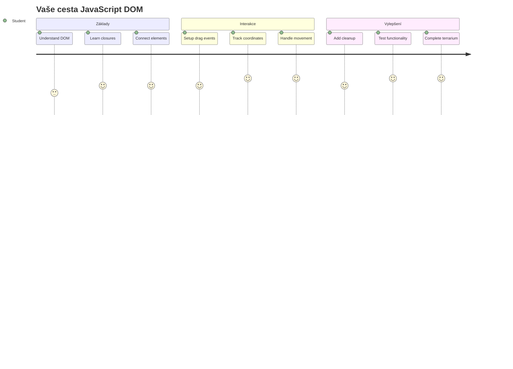
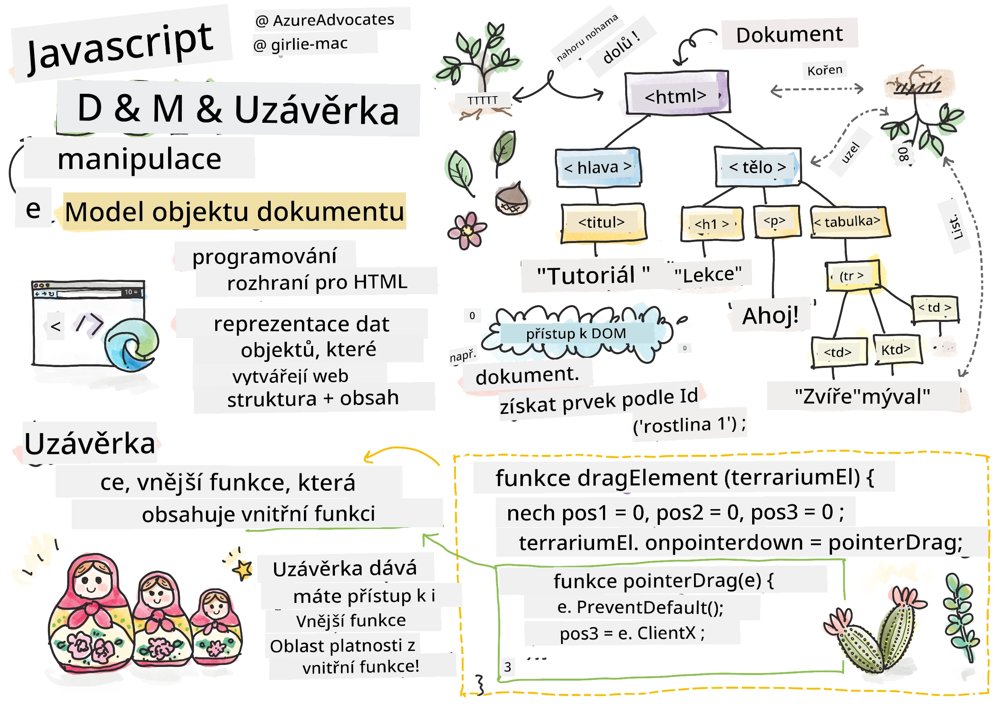
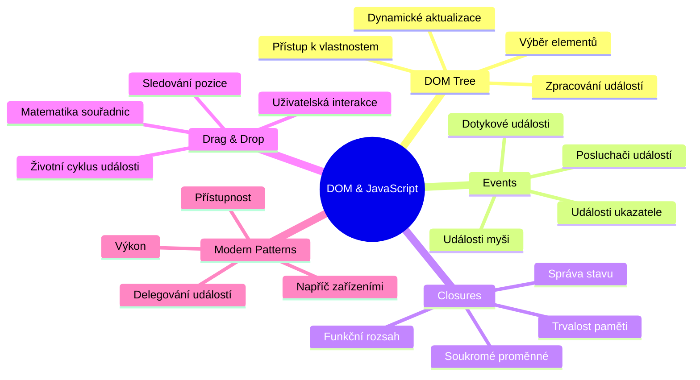
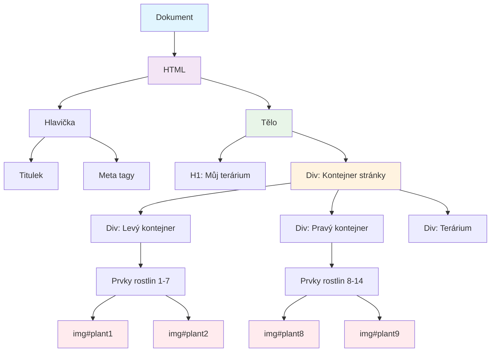
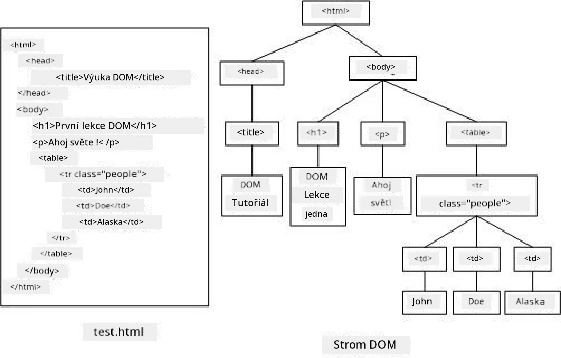
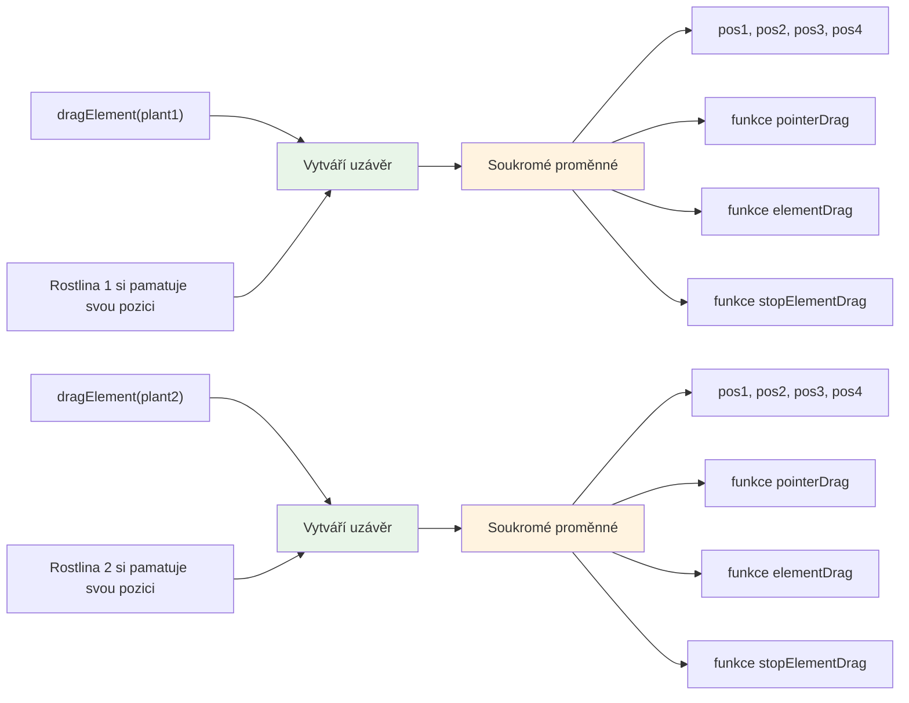
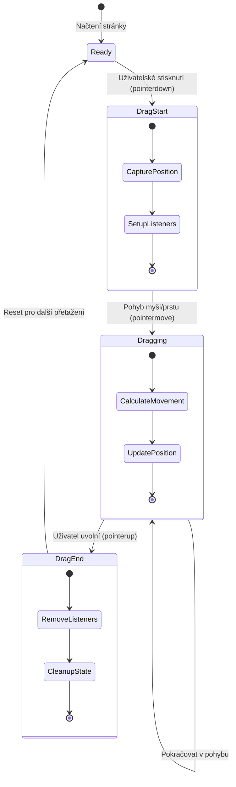
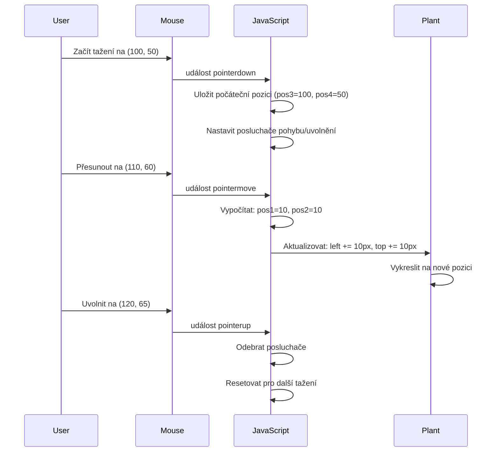
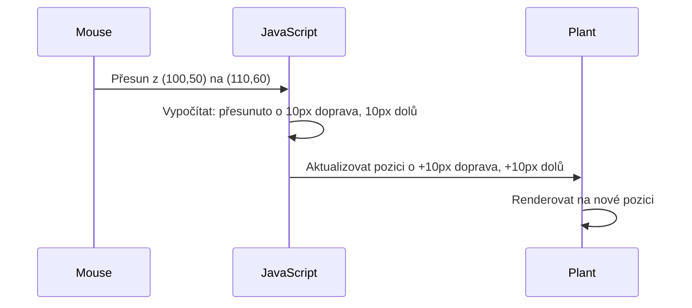
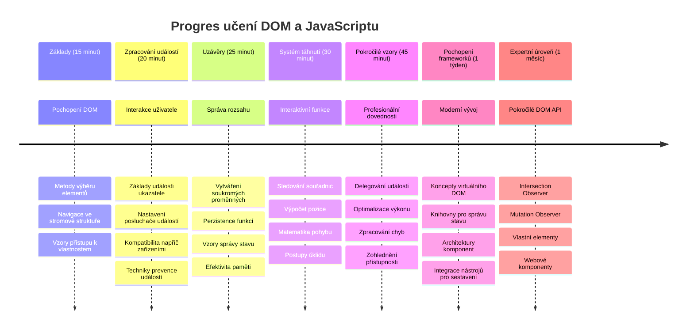

# Projekt Terrárium Část 3: Manipulace s DOM a JavaScript Closures



> Sketchnote od [Tomomi Imura](https://twitter.com/girlie_mac)

Vítejte u jednoho z nejpoutavějších aspektů vývoje webu – vytváření interaktivity! Document Object Model (DOM) je jako most mezi vaším HTML a JavaScriptem a dnes jej použijeme, aby vaše terrárium ožilo. Když Tim Berners-Lee vytvořil první webový prohlížeč, představoval si web, kde dokumenty mohou být dynamické a interaktivní – DOM toto vize umožňuje.

Prozkoumáme také JavaScript closures, což může ze začátku znít obtížně. Think of closures as creating "memory pockets" kde si vaše funkce mohou pamatovat důležité informace. Je to jako kdyby každá rostlina ve vašem terráriu měla vlastní záznam pro sledování své pozice. Na konci této lekce pochopíte, jak jsou přirozené a užitečné.

Tady je, co stavíme: terrárium, kde uživatelé mohou rostliny táhnout a pustit kamkoli chtějí. Naučíte se techniky manipulace s DOM, které pohánějí vše od nahrávání souborů přes drag-and-drop až po interaktivní hry. Pojďme oživit vaše terrárium.


## Kvíz před přednáškou

[Kvíz před přednáškou](https://ff-quizzes.netlify.app/web/quiz/19)

## Pochopení DOM: Váš vstup do interaktivních webových stránek

Document Object Model (DOM) je způsob, jak JavaScript komunikuje s vašimi HTML prvky. Když váš prohlížeč načte HTML stránku, vytvoří v paměti strukturovanou reprezentaci té stránky – to je DOM. Představte si to jako rodokmen, kde každý HTML prvek je člen rodiny, ke kterému může JavaScript přistupovat, upravovat jej nebo přeuspořádat.

Manipulace s DOM proměňuje statické stránky na interaktivní weby. Kdykoliv vidíte, že tlačítko mění barvu při najetí myší, obsah se aktualizuje bez obnovy stránky nebo prvky, které můžete táhnout, je to manipulace s DOM v akci.




> Reprezentace DOM a HTML značkování, které na něj odkazuje. Od [Olfa Nasraoui](https://www.researchgate.net/publication/221417012_Profile-Based_Focused_Crawler_for_Social_Media-Sharing_Websites)

**Zde je, co dělá DOM silným:**
- **Poskytuje** strukturovaný způsob, jak přistupovat k jakémukoli prvku na vaší stránce
- **Umožňuje** dynamické aktualizace obsahu bez obnovování stránky
- **Dovoluje** okamžitou reakci na uživatelské interakce jako kliknutí a tažení
- **Vytváří** základ moderních interaktivních webových aplikací

## JavaScript Closures: Vytváření organizovaného a výkonného kódu

[JavaScript closure](https://developer.mozilla.org/docs/Web/JavaScript/Closures) je jako dát funkci její vlastní soukromý pracovní prostor s trvalou pamětí. Představte si, jak Darwinovy pěnkavy na Galapágách vyvinuly specializované zobáky podle svého specifického prostředí – closure fungují podobně, vytváří specializované funkce, které si „pamatují“ svůj konkrétní kontext, i když nadřazená funkce skončila.

V našem terráriu closure pomáhají každé rostlině pamatovat si její vlastní pozici nezávisle. Tento vzor se objevuje v profesionálním vývoji JavaScriptu, což z něj dělá hodnotný koncept k pochopení.


> 💡 **Pochopení closures**: Closures jsou významné téma v JavaScriptu a mnoho vývojářů je používá roky, než úplně pochopí všechny teoretické aspekty. Dnes se zaměříme na praktické použití – closure uvidíte přirozeně vznikat, jak budeme stavět naše interaktivní funkce. Pochopení se vyvine, jakmile uvidíte, jak řeší skutečné problémy.


> Reprezentace DOM a HTML značkování, které na něj odkazuje. Od [Olfa Nasraoui](https://www.researchgate.net/publication/221417012_Profile-Based_Focused_Crawler_for_Social_Media-Sharing_Websites)

V této lekci dokončíme náš interaktivní projekt terrária vytvořením JavaScriptu, který uživateli umožní manipulovat s rostlinami na stránce.

## Než začneme: Příprava na úspěch

Budete potřebovat vaše HTML a CSS soubory z předchozích lekcí terrária – chystáme se učinit statický design interaktivním. Pokud se připojujete poprvé, dokončení těchto lekcí nejdříve poskytne důležitý kontext.

Co budeme stavět:
- **Plynulé drag-and-drop** pro všechny rostliny v terráriu
- **Sledování souřadnic**, aby si rostliny pamatovaly své pozice
- **Kompletní interaktivní rozhraní** pomocí obyčejného JavaScriptu
- **Čistý, organizovaný kód** za použití closure vzorů

## Nastavení vašeho JavaScript souboru

Vytvořme JavaScript soubor, který učiní vaše terrárium interaktivním.

**Krok 1: Vytvořte váš skriptový soubor**

Ve složce terrária vytvořte nový soubor s názvem `script.js`.

**Krok 2: Propojte JavaScript se svým HTML**

Přidejte tento skriptový tag do sekce `<head>` vašeho souboru `index.html`:

```html
<script src="./script.js" defer></script>
```

**Proč je atribut `defer` důležitý:**
- **Zajišťuje**, že váš JavaScript počká, dokud nebude načten celý HTML
- **Zabraňuje** chybám, kdy JavaScript hledá prvky, které ještě nejsou připravené
- **Garantuje**, že všechny rostlinné prvky jsou k dispozici pro interakci
- **Poskytuje** lepší výkon než umístění skriptů na konec stránky

> ⚠️ **Důležitá poznámka**: Atribut `defer` zabraňuje běžným časovým problémům. Bez něj může JavaScript zkusit přistupovat k HTML prvkům dříve, než jsou načteny, což způsobí chyby.

---

## Propojení JavaScriptu s vaší HTML strukturou

Než budeme moci udělat prvky přetahovatelnými, musí JavaScript tyto prvky najít v DOM. Představte si to jako knihovní katalogizační systém – jakmile máte katalogové číslo, můžete přesně nalézt požadovanou knihu a přistoupat ke všemu jejímu obsahu.

Použijeme metodu `document.getElementById()` k vytvoření těchto spojení. Je to jako mít přesný archiv – zadáte ID a najde přesně ten prvek v HTML, který potřebujete.

### Povolení funkce táhnutí pro všechny rostliny

Přidejte tento kód do svého souboru `script.js`:

```javascript
// Povolit funkci přetahování pro všech 14 rostlin
dragElement(document.getElementById('plant1'));
dragElement(document.getElementById('plant2'));
dragElement(document.getElementById('plant3'));
dragElement(document.getElementById('plant4'));
dragElement(document.getElementById('plant5'));
dragElement(document.getElementById('plant6'));
dragElement(document.getElementById('plant7'));
dragElement(document.getElementById('plant8'));
dragElement(document.getElementById('plant9'));
dragElement(document.getElementById('plant10'));
dragElement(document.getElementById('plant11'));
dragElement(document.getElementById('plant12'));
dragElement(document.getElementById('plant13'));
dragElement(document.getElementById('plant14'));
```

**Co tento kód umožňuje:**
- **Najde** každý rostlinný prvek v DOM pomocí unikátního ID
- **Získá** JavaScriptovou referenci na každý HTML prvek
- **Předá** každý prvek funkci `dragElement` (kterou vytvoříme dále)
- **Připraví** každou rostlinu k interakci drag-and-drop
- **Spojí** vaši HTML strukturu s JavaScriptovou funkcionalitou

> 🎯 **Proč používat ID místo tříd?** ID poskytují unikátní identifikátory pro konkrétní prvky, zatímco CSS třídy slouží k stylování skupin prvků. Když JavaScript potřebuje manipulovat s jednotlivými prvky, ID nabízejí přesnost a výkon, který potřebujeme.

> 💡 **Tip pro profesionály**: Všimněte si, jak pro každou rostlinu voláme `dragElement()` individuálně. Tento přístup zajistí, že každá rostlina získá své vlastní nezávislé chování táhnutí, což je klíčové pro plynulost uživatelského zážitku.

### 🔄 **Pedagogická kontrola**
**Pochopení propojení s DOM**: Než přejdete k funkcionalitě táhnutí, ověřte, že:
- ✅ Dokážete vysvětlit, jak `document.getElementById()` vyhledává HTML prvky
- ✅ Chápete, proč používáme unikátní ID pro každou rostlinu
- ✅ Dokážete popsat účel atributu `defer` ve skriptových tagách
- ✅ Rozumíte, jak se JavaScript a HTML propojují přes DOM

**Rychlý test:** Co se stane, když mají dva prvky stejné ID? Proč `getElementById()` vrací jen jeden prvek?
*Odpověď: ID by měla být unikátní; pokud jsou duplikována, vrací se pouze první nalezený prvek*

---

## Vytvoření closure funkce pro táhnutí prvku

Nyní vytvoříme srdce našeho táhnutí: closure, která bude řídit chování táhnutí pro každou rostlinu. Tato closure bude obsahovat několik vnitřních funkcí, které spolupracují při sledování pohybu myši a aktualizaci pozic prvků.

Closures jsou pro tento úkol ideální, protože nám umožňují vytvořit „soukromé“ proměnné, které přetrvávají mezi voláními funkcí, což každé rostlině poskytuje vlastní nezávislý systém sledování souřadnic.

### Pochopení closures na jednoduchém příkladu

Dovolte mi ukázat closures na jednoduchém příkladu, který koncept ilustruje:

```javascript
function createCounter() {
    let count = 0; // Toto je jako privátní proměnná
    
    function increment() {
        count++; // Vnitřní funkce si pamatuje vnější proměnnou
        return count;
    }
    
    return increment; // Vracíme zpět vnitřní funkci
}

const myCounter = createCounter();
console.log(myCounter()); // 1
console.log(myCounter()); // 2
```

**Co se v tomto vzoru closure děje:**
- **Vytváří** soukromou proměnnou `count`, která existuje pouze v této closure
- **Vnitřní funkce** může přistupovat a měnit tu vnější proměnnou (mechanismus closure)
- **Když vrátíme** vnitřní funkci, ta si uchovává spojení k těmto soukromým datům
- **I poté, co** `createCounter()` skončí, `count` přetrvává a pamatuje si hodnotu

### Proč jsou closures ideální pro táhnutí prvků

V našem terráriu každá rostlina potřebuje pamatovat své aktuální pozice souřadnic. Closures poskytují perfektní řešení:

**Klíčové výhody pro náš projekt:**
- **Udržují** soukromé proměnné pozice pro každou rostlinu nezávisle
- **Zachovávají** data souřadnic mezi událostmi táhnutí
- **Zabraňují** konfliktům proměnných mezi různými přetahovatelnými prvky
- **Vytváří** čistou a organizovanou strukturu kódu

> 🎯 **Cíl učení**: Nemusíte teď perfektně ovládat všechny aspekty closures. Zaměřte se na to, jak nám pomáhají organizovat kód a udržovat stav naší funkce táhnutí.


### Vytvoření funkce dragElement

Teď si vytvoříme hlavní funkci, která bude řídit veškerou logiku táhnutí. Přidejte tuto funkci pod deklarace rostlinných prvků:

```javascript
function dragElement(terrariumElement) {
    // Inicializujte proměnné pro sledování pozice
    let pos1 = 0,  // Předchozí pozice myši na ose X
        pos2 = 0,  // Předchozí pozice myši na ose Y
        pos3 = 0,  // Aktuální pozice myši na ose X
        pos4 = 0;  // Aktuální pozice myši na ose Y
    
    // Nastavte počáteční posluchač událostí přetažení
    terrariumElement.onpointerdown = pointerDrag;
}
```

**Pochopení systému sledování pozice:**
- **`pos1` a `pos2`**: Uchovávají rozdíl mezi starou a novou pozicí myši
- **`pos3` a `pos4`**: Sledují aktuální souřadnice myši
- **`terrariumElement`**: Konkrétní rostlinný prvek, který děláme přetahovatelným
- **`onpointerdown`**: Událost, která spouští začátek táhnutí

**Jak vzor closure funguje:**
- **Vytváří** soukromé proměnné pozice pro každý rostlinný prvek
- **Udržuje** tyto proměnné po celou dobu životního cyklu táhnutí
- **Zajišťuje**, že každá rostlina sleduje své souřadnice nezávisle
- **Poskytuje** čisté rozhraní skrze funkci `dragElement`

### Proč používat Pointer Events?

Možná se ptáte, proč používáme `onpointerdown` místo známějšího `onclick`. Tady je důvod:

| Typ události | Vhodné pro | Omezení |
|--------------|------------|---------|
| `onclick` | Jednoduchá kliknutí na tlačítka | Neumí ovládat táhnutí (jen kliknutí a uvolnění) |
| `onpointerdown` | Myš i dotyk | Novější, ale dnes dobře podporované |
| `onmousedown` | Jen myš na desktopu | Nezahrnuje uživatele na mobilu |

**Proč jsou pointer events ideální pro náš projekt:**
- **Fungují skvěle** bez ohledu na to, zda uživatel používá myš, prst nebo stylus
- **Působí stejně** na notebooku, tabletu či telefonu
- **Zvládají** skutečný pohyb táhnutí (nejen kliknutí)
- **Vytvářejí** plynulý zážitek, jaký uživatelé očekávají od moderních webových aplikací

> 💡 **Budoucí připravenost**: Pointer events jsou moderní způsob, jak zvládat uživatelské interakce. Místo psaní samostatného kódu pro myš a dotyk získáte obojí zdarma. Docela šikovné, že?

### 🔄 **Pedagogická kontrola**
**Pochopení práce s událostmi**: Zastavte se a ověřte si, že chápete:
- ✅ Proč používáme pointer events místo myšových událostí?
- ✅ Jak proměnné v closure přetrvávají mezi voláními funkcí?
- ✅ Jakou roli hraje `preventDefault()` pro plynulé táhnutí?
- ✅ Proč připojujeme posluchače k dokumentu místo jednotlivým prvkům?

**Připojení k reálnému světu**: Zkuste si vybavit drag-and-drop rozhraní, která používáte denně:
- **Nahrávání souborů**: Táhnete soubory do okna prohlížeče
- **Kanban tabule**: Přesouvání úkolů mezi sloupci
- **Obrázkové galerie**: Přeuspořádání fotek
- **Mobilní rozhraní**: Přejetí a táhnutí na dotykových obrazovkách

---

## Funkce pointerDrag: Zachycení začátku táhnutí

Když uživatel podrží rostlinu (myší nebo prstem), funkce `pointerDrag` okamžitě reaguje. Tato funkce zachytí počáteční souřadnice a nastaví systém pro táhnutí.

Přidejte tuto funkci dovnitř closure `dragElement`, hned za řádku `terrariumElement.onpointerdown = pointerDrag;`:

```javascript
function pointerDrag(e) {
    // Zabraňte výchozímu chování prohlížeče (například výběru textu)
    e.preventDefault();
    
    // Zachyťte počáteční pozici myši/ťuknutí
    pos3 = e.clientX;  // Souřadnice X, kde začalo tažení
    pos4 = e.clientY;  // Souřadnice Y, kde začalo tažení
    
    // Nastavte posluchače událostí pro proces tažení
    document.onpointermove = elementDrag;
    document.onpointerup = stopElementDrag;
}
```

**Krok za krokem, co se děje:**
- **Zabraňuje** výchozím prohlížečovým chováním, která by mohla táhnutí narušit
- **Zaznamenává** přesné souřadnice, kde uživatel začal gesto táhnutí
- **Nastavuje** posluchače událostí pro probíhající pohyb táhnutí
- **Připravuje** systém sledovat pohyb myši/prstu přes celý dokument

### Pochopení zabránění výchozím akcím

Řádek `e.preventDefault()` je klíčový pro plynulost táhnutí:

**Bez tohoto zabránění by prohlížeče mohly:**
- **Označit** text při táhnutí přes stránku
- **Spustit** kontextová menu při táhnutí pravým tlačítkem
- **Ruší** naše vlastní chování táhnutí
- **Vytvořit** vizuální artefakty během táhnutí

> 🔍 **Experiment**: Po dokončení lekce zkuste odebrat `e.preventDefault()` a sledujte, jak se změní zkušenost s táhnutím. Rychle pochopíte, proč je tento řádek nepostradatelný!

### Systém sledování souřadnic

Vlastnosti `e.clientX` a `e.clientY` nám dávají přesné souřadnice myši/dotyku:

| Vlastnost | Co měří | Použití |
|-----------|----------|---------|
| `clientX` | Horizontální pozice vůči viewportu | Sledování pohybu vlevo-vpravo |
| `clientY` | Vertikální pozice vůči viewportu | Sledování pohybu nahoru-dolů |
**Porozumění těmto souřadnicím:**
- **Poskytuje** přesné informace o pozici v pixelech
- **Aktualizuje** se v reálném čase, jak uživatel pohybuje ukazatelem
- **Zůstává** konzistentní napříč různými velikostmi obrazovek a úrovněmi přiblížení
- **Umožňuje** plynulé a responzivní interakce přetažení

### Nastavení posluchačů událostí na úrovni dokumentu

Všimněte si, jak připojujeme události pohybu a zastavení na celý `document`, nejen na prvek rostliny:

```javascript
document.onpointermove = elementDrag;
document.onpointerup = stopElementDrag;
```

**Proč připojovat na dokument:**
- **Pokračuje** ve sledování i když myš opustí prvek rostliny
- **Zabraňuje** přerušení přetažení, pokud uživatel rychle pohne
- **Poskytuje** plynulé přetahování přes celou obrazovku
- **Řeší** hraniční případy, kdy kurzor opustí okno prohlížeče

> ⚡ **Poznámka o výkonu**: Tyto posluchače na úrovni dokumentu odpojíme, když přetahování skončí, abychom zabránili únikům paměti a problémům s výkonem.

## Dokončení systému přetažení: Pohyb a úklid

Nyní přidáme dvě zbývající funkce, které zpracovávají skutečný pohyb při přetahování a úklid při jeho zastavení. Tyto funkce spolupracují pro vytvoření plynulého a responzivního pohybu rostlin ve vašem teráriu.

### Funkce elementDrag: Sledování pohybu

Přidejte funkci `elementDrag` hned za zavírací složenou závorku `pointerDrag`:

```javascript
function elementDrag(e) {
    // Vypočítejte vzdálenost, kterou jste se pohybovali od poslední události
    pos1 = pos3 - e.clientX;  // Vzdálenost pohybu vodorovně
    pos2 = pos4 - e.clientY;  // Vzdálenost pohybu svisle
    
    // Aktualizujte sledování aktuální pozice
    pos3 = e.clientX;  // Nová aktuální pozice X
    pos4 = e.clientY;  // Nová aktuální pozice Y
    
    // Aplikujte pohyb na pozici prvku
    terrariumElement.style.top = (terrariumElement.offsetTop - pos2) + 'px';
    terrariumElement.style.left = (terrariumElement.offsetLeft - pos1) + 'px';
}
```

**Porozumění matematice souřadnic:**
- **`pos1` a `pos2`**: Vypočítávají, o kolik se myš posunula od poslední aktualizace
- **`pos3` a `pos4`**: Uchovávají aktuální pozici myši pro následující výpočet
- **`offsetTop` a `offsetLeft`**: Zjišťují aktuální pozici prvku na stránce
- **Logika odečítání**: Posouvá prvek stejným množstvím, o které se myš posunula


**Rozpis výpočtu pohybu:**
1. **Měří** rozdíl mezi starou a novou pozicí myši
2. **Vypočítává** o kolik se má prvek posunout na základě pohybu myši
3. **Aktualizuje** CSS pozici prvku v reálném čase
4. **Ukládá** novou pozici jako základ pro další výpočet pohybu

### Vizualizace matematiky


### Funkce stopElementDrag: Úklid

Přidejte úklidovou funkci za zavírací složenou závorku `elementDrag`:

```javascript
function stopElementDrag() {
    // Odeberte posluchače událostí na úrovni dokumentu
    document.onpointerup = null;
    document.onpointermove = null;
}
```

**Proč je úklid důležitý:**
- **Zabraňuje** únikům paměti kvůli přetrvávajícím posluchačům událostí
- **Zastavuje** chování přetahování, když uživatel pustí rostlinu
- **Umožňuje** ostatním prvkům být přetaženými nezávisle
- **Resetuje** systém pro další operaci přetahování

**Co se stane bez úklidu:**
- Posluchači událostí běží i po ukončení přetahování
- Výkon se zhoršuje kvůli hromadění nepoužívaných posluchačů
- Neočekávané chování při interakci s jinými prvky
- Prohlížeč zbytečně využívá zdroje na zpracování událostí

### Porozumění vlastnostem pozice CSS

Náš systém přetahování manipuluje se dvěma klíčovými CSS vlastnostmi:

| Vlastnost | Co řídí | Jak ji používáme |
|----------|------------------|---------------|
| `top` | Vzdálenost od horního okraje | Vertikální umístění během přetažení |
| `left` | Vzdálenost od levého okraje | Horizontální umístění během přetažení |

**Klíčové poznatky o offset vlastnostech:**
- **`offsetTop`**: Aktuální vzdálenost od horního okraje nadřazeného prvku s pozicováním
- **`offsetLeft`**: Aktuální vzdálenost od levého okraje nadřazeného prvku s pozicováním
- **Kontext pozicování**: Tyto hodnoty jsou relativní k nejbližšímu pozicovanému předkovi
- **Aktualizace v reálném čase**: Mění se ihned, jakmile změníme CSS vlastnosti

> 🎯 **Filosofie návrhu**: Tento systém přetahování je úmyslně flexibilní – nejsou zde žádné „zónové oblastí“ či omezení. Uživatelé mohou rostliny umisťovat kamkoli, což jim dává úplnou kreativní kontrolu nad designem terária.

## Vše dohromady: Kompletní systém přetahování

Gratulujeme! Právě jste vytvořili sofistikovaný systém drag-and-drop pomocí čistého JavaScriptu. Vaše kompletní funkce `dragElement` nyní obsahuje silné closures, které spravují:

**Co vaše closure zajišťuje:**
- **Udržuje** soukromé proměnné pozice pro každou rostlinu nezávisle
- **Řídí** celý životní cyklus přetažení od začátku do konce
- **Poskytuje** plynulý a responzivní pohyb přes celou obrazovku
- **Správně čistí** zdroje, aby nedocházelo k únikům paměti
- **Vytváří** intuitivní a kreativní rozhraní pro design terária

### Testování vašeho interaktivního terária

Nyní otestujte své interaktivní terárium! Otevřete soubor `index.html` v prohlížeči a vyzkoušejte funkčnost:

1. **Klikněte a držte** kteroukoliv rostlinu pro zahájení přetažení
2. **Pohybujte myší nebo prstem** a sledujte, jak rostlina hladce následuje kursorem
3. **Uvolněte** pro umístění rostliny na nové místo
4. **Experimentujte** s různými uspořádáními a prozkoumejte rozhraní

🥇 **Úspěch**: Vytvořili jste plně interaktivní webovou aplikaci využívající základní principy, které profesionální vývojáři denně používají. Funkce drag-and-drop používá stejné principy jako nahrávání souborů, kanban tabule a mnoho dalších interaktivních rozhraní.

### 🔄 **Pedagogická kontrola**
**Kompletní pochopení systému**: Ověřte si své zvládnutí celého systému přetahování:
- ✅ Jak closure udržují nezávislý stav pro každou rostlinu?
- ✅ Proč je matematika výpočtu souřadnic nezbytná pro plynulý pohyb?
- ✅ Co se stane, pokud zapomeneme vyčistit posluchače událostí?
- ✅ Jak tento vzor škáluje na složitější interakce?

**Reflexe kvality kódu**: Prohlédněte si své kompletní řešení:
- **Modulární design**: Každá rostlina má vlastní instanci closure
- **Efektivita událostí**: Správné nastavení a úklid posluchačů
- **Podpora více zařízení**: Funguje na desktopu i mobilech
- **Vědomí výkonu**: Žádné úniky paměti nebo zbytečné výpočty


---

## GitHub Copilot Agent Challenge 🚀

Použijte režim Agent k dokončení následujícího úkolu:

**Popis:** Vylepšete projekt terária přidáním funkce reset, která vrátí všechny rostliny do jejich původních pozic na postranním panelu s plynulými animacemi.

**Zadání:** Vytvořte tlačítko reset, které po kliknutí pomocí CSS přechodů animuje všechny rostliny zpět do jejich původních pozic na postranním panelu. Funkce by měla při načtení stránky uložit původní pozice a po zmáčknutí tlačítka je plynule během 1 sekundy vrátit zpět.

Více o [režimu agent](https://code.visualstudio.com/blogs/2025/02/24/introducing-copilot-agent-mode) zde.

## 🚀 Další výzva: Rozšiřte své dovednosti

Připraveni pozvednout své terárium na vyšší úroveň? Zkuste implementovat tyto vylepšení:

**Kreativní rozšíření:**
- **Dvojklik** na rostlinu pro přinést ji do popředí (manipulace se z-indexem)
- **Přidejte vizuální zpětnou vazbu** jako jemné záření při najetí myší na rostliny
- **Implementujte hranice**, aby rostliny nebylo možné přetáhnout mimo terárium
- **Vytvořte funkci ukládání**, která si pamatuje pozice rostlin pomocí localStorage
- **Přidejte zvukové efekty** při zvedání a pokládání rostlin

> 💡 **Příležitost k učení**: Každý z těchto úkolů vás naučí nové aspekty manipulace s DOM, práce s událostmi a návrhu uživatelského prostředí.

## Kvíz po přednášce

[Post-lecture quiz](https://ff-quizzes.netlify.app/web/quiz/20)

## Přehled a samostudium: Prohloubení znalostí

Ovládáte základy manipulace s DOM a closures, ale vždy je co dál objevovat! Zde jsou některé cesty pro rozšíření vašich znalostí a dovedností.

### Alternativní přístupy k drag and drop

Použili jsme pointer events pro maximální flexibilitu, ale webový vývoj nabízí více přístupů:

| Přístup | Nejvhodnější pro | Výuková hodnota |
|----------|----------|----------------|
| [HTML Drag and Drop API](https://developer.mozilla.org/docs/Web/API/HTML_Drag_and_Drop_API) | Nahrávání souborů, formální drag zóny | Pochopení nativních možností prohlížeče |
| [Touch Events](https://developer.mozilla.org/docs/Web/API/Touch_events) | Interakce specifické pro mobily | Principy vývoje orientovaného na mobily |
| CSS vlastnosti `transform` | Plynulé animace | Techniky optimalizace výkonu |

### Pokročilé téma manipulace s DOM

**Další kroky v učení:**
- **Delegace událostí**: Efektivní zpracování událostí u více prvků
- **Intersection Observer**: Detekce vstupu a opuštění prvků z viewportu
- **Mutation Observer**: Sledování změn v DOM struktuře
- **Web Components**: Tvorba znovupoužitelných, zapouzdřených UI prvků
- **Koncepty virtuálního DOM**: Pochopení, jak frameworky optimalizují aktualizace DOM

### Zásadní zdroje pro další učení

**Technická dokumentace:**
- [MDN průvodce pointer events](https://developer.mozilla.org/docs/Web/API/Pointer_events) – komplexní reference
- [W3C specifikace pointer events](https://www.w3.org/TR/pointerevents1/) – oficiální standardy
- [JavaScript Closures – hloubkový pohled](https://developer.mozilla.org/docs/Web/JavaScript/Closures) – pokročilé vzory closures

**Kompatibilita prohlížečů:**
- [CanIUse.com](https://caniuse.com/) – kontrola podpory funkcí napříč prohlížeči
- [MDN Browser Compatibility Data](https://github.com/mdn/browser-compat-data) – detailní kompatibilita

**Možnosti praxe:**
- **Sestavte** puzzle hru s podobnou mechanikou přetahování
- **Vytvořte** kanban tabuli pro správu úkolů drag-and-drop
- **Navrhněte** galerii fotografií s přetahovatelným uspořádáním
- **Experimentujte** s dotykovými gesty na mobilních zařízeních

> 🎯 **Strategie učení**: Nejlepší způsob, jak si tyto koncepty upevnit, je praxe. Stavte různé variace přetahovatelných rozhraní – každý projekt vás naučí něco nového o uživatelské interakci a manipulaci s DOM.

### ⚡ **Co můžete udělat během 5 minut**
- [ ] Otevřete DevTools prohlížeče a napište `document.querySelector('body')` do konzole
- [ ] Zkuste změnit text na webu pomocí `innerHTML` nebo `textContent`
- [ ] Přidejte posluchač kliknutí na libovolné tlačítko nebo odkaz na stránce
- [ ] Prohlédněte si strukturu DOM pomocí panelu Elementy

### 🎯 **Co můžete zvládnout dnes za hodinu**
- [ ] Dokončit kvíz po lekci a zopakovat si manipulaci s DOM
- [ ] Vytvořit interaktivní stránku, která reaguje na kliknutí uživatele
- [ ] Procvičit zpracování událostí s různými typy (klik, najetí, stisk klávesy)
- [ ] Postavit jednoduchý seznam úkolů nebo čítač pomocí manipulace s DOM
- [ ] Prozkoumat vztah mezi HTML prvky a objekty JavaScriptu

### 📅 **Váš týden s JavaScriptem**
- [ ] Dokončit projekt interaktivního terária s funkcí drag-and-drop
- [ ] Ovládnout delegaci událostí pro efektivní zpracování
- [ ] Naučit se o event loop a asynchronním JavaScriptu
- [ ] Procvičit closures tvorbou modulů s privátním stavem
- [ ] Prozkoumat moderní DOM API jako Intersection Observer
- [ ] Vytvořit interaktivní komponenty bez použití frameworků

### 🌟 **Měsíční mistrovství v JavaScriptu**
- [ ] Vytvořit komplexní single-page aplikaci s vanilla JavaScriptem
- [ ] Naučit se moderní framework (React, Vue nebo Angular) a porovnat jej s vanilla DOM
- [ ] Přispívat do open source JavaScript projektů
- [ ] Ovládnout pokročilé koncepty jako web komponenty a vlastních elementů
- [ ] Stavět výkonné webové aplikace s optimálními vzory DOM
- [ ] Učit ostatní manipulaci s DOM a základy JavaScriptu

## 🎯 Váš časový plán osvojení JavaScript DOM


### 🛠️ Shrnutí vašeho JavaScript nástroje

Po dokončení této lekce nyní ovládáte:
- **Mistři DOM**: Výběr prvků, manipulace vlastností a navigace stromem
- **Experti na události**: Zpracování interakcí napříč zařízeními pomocí pointer events
- **Porozumění closures**: Správa privátního stavu a přetrvávání funkcí
- **Interaktivní systémy**: Kompletní implementace drag-and-drop od základů
- **Vědomí výkonu**: Správný úklid událostí a správa paměti
- **Moderní vzory**: Techniky organizace kódu používané v profesionálním vývoji
- **Uživatelská zkušenost**: Tvorba intuitivních a responzivních rozhraní

**Získané profesionální dovednosti**: Vytvořili jste funkce pomocí stejných technik, jaké využívají:
- **Trello/Kanban tabule**: Přetahování karet mezi sloupci
- **Systémy nahrávání souborů**: Drag-and-drop nahrávání
- **Galerie obrázků**: Uspořádání fotografií
- **Mobilní aplikace**: Vzory interakcí založené na dotyku

**Další úroveň**: Jste připraveni prozkoumat moderní frameworky jako React, Vue nebo Angular, které staví na těchto základních konceptech manipulace s DOM!

## Úkol

[Pracujte dál s DOM](assignment.md)

---

<!-- CO-OP TRANSLATOR DISCLAIMER START -->
**Prohlášení o vyloučení odpovědnosti**:  
Tento dokument byl přeložen pomocí AI překladatelské služby [Co-op Translator](https://github.com/Azure/co-op-translator). Přestože usilujeme o přesnost, mějte prosím na paměti, že automatizované překlady mohou obsahovat chyby nebo nepřesnosti. Původní dokument v jeho mateřském jazyce by měl být považován za závazný zdroj. Pro kritické informace doporučujeme využít profesionální lidský překlad. Nezodpovídáme za jakékoli nedorozumění či nesprávné interpretace vyplývající z použití tohoto překladu.
<!-- CO-OP TRANSLATOR DISCLAIMER END -->