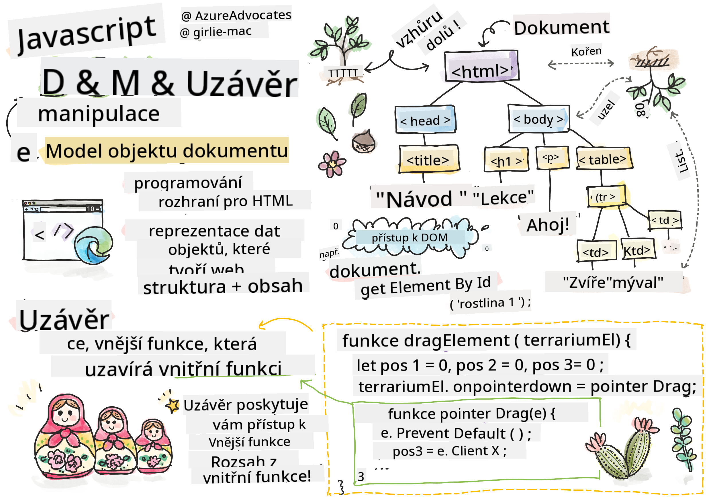
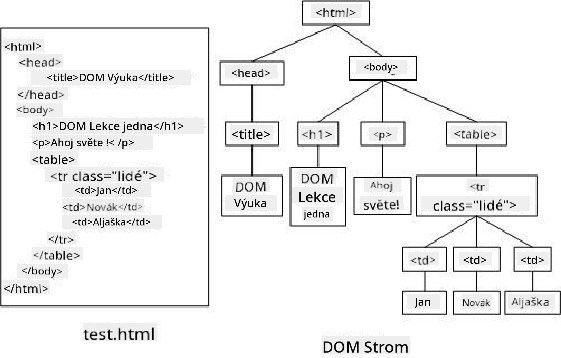

<!--
CO_OP_TRANSLATOR_METADATA:
{
  "original_hash": "30f8903a1f290e3d438dc2c70fe60259",
  "translation_date": "2025-08-28T04:20:09+00:00",
  "source_file": "3-terrarium/3-intro-to-DOM-and-closures/README.md",
  "language_code": "cs"
}
-->
# Projekt Terrárium, část 3: Manipulace s DOM a uzávěr


> Sketchnote od [Tomomi Imura](https://twitter.com/girlie_mac)

## Kvíz před lekcí

[Kvíz před lekcí](https://ff-quizzes.netlify.app/web/quiz/19)

### Úvod

Manipulace s DOM, neboli "Document Object Model", je klíčovým aspektem vývoje webu. Podle [MDN](https://developer.mozilla.org/docs/Web/API/Document_Object_Model/Introduction) je "Document Object Model (DOM) datovou reprezentací objektů, které tvoří strukturu a obsah dokumentu na webu." Výzvy spojené s manipulací s DOM na webu často vedly k používání JavaScriptových frameworků namísto čistého JavaScriptu pro správu DOM, ale my si vystačíme sami!

Kromě toho tato lekce představí koncept [JavaScriptového uzávěru](https://developer.mozilla.org/docs/Web/JavaScript/Closures), který si můžete představit jako funkci uzavřenou jinou funkcí, takže vnitřní funkce má přístup k rozsahu vnější funkce.

> JavaScriptové uzávěry jsou rozsáhlé a složité téma. Tato lekce se dotýká pouze základní myšlenky, že v kódu tohoto terrária najdete uzávěr: vnitřní funkci a vnější funkci, které jsou konstruovány tak, aby vnitřní funkce měla přístup k rozsahu vnější funkce. Pro mnohem více informací o tom, jak to funguje, navštivte [rozsáhlou dokumentaci](https://developer.mozilla.org/docs/Web/JavaScript/Closures).

Uzávěr použijeme k manipulaci s DOM.

Představte si DOM jako strom, který reprezentuje všechny způsoby, jak lze manipulovat s dokumentem webové stránky. Byla vytvořena různá API (Application Program Interfaces), aby programátoři mohli pomocí svého preferovaného programovacího jazyka přistupovat k DOM a upravovat, měnit, přeskupovat a jinak jej spravovat.



> Reprezentace DOM a HTML značek, které na něj odkazují. Zdroj: [Olfa Nasraoui](https://www.researchgate.net/publication/221417012_Profile-Based_Focused_Crawler_for_Social_Media-Sharing_Websites)

V této lekci dokončíme náš interaktivní projekt terrária vytvořením JavaScriptu, který umožní uživateli manipulovat s rostlinami na stránce.

### Předpoklady

Měli byste mít vytvořený HTML a CSS pro vaše terrárium. Na konci této lekce budete schopni přesouvat rostliny do terrária a ven z něj pomocí přetahování.

### Úkol

Ve složce terrária vytvořte nový soubor s názvem `script.js`. Tento soubor importujte do sekce `<head>`:

```html
	<script src="./script.js" defer></script>
```

> Poznámka: při importu externího JavaScriptového souboru do HTML souboru použijte atribut `defer`, aby se JavaScript spustil až po úplném načtení HTML souboru. Můžete také použít atribut `async`, který umožňuje spuštění skriptu během parsování HTML souboru, ale v našem případě je důležité, aby byly HTML prvky plně dostupné pro přetahování před spuštěním skriptu pro přetahování.
---

## Prvky DOM

První věc, kterou musíte udělat, je vytvořit reference na prvky, které chcete v DOM manipulovat. V našem případě to je 14 rostlin aktuálně čekajících v postranních panelech.

### Úkol

```html
dragElement(document.getElementById('plant1'));
dragElement(document.getElementById('plant2'));
dragElement(document.getElementById('plant3'));
dragElement(document.getElementById('plant4'));
dragElement(document.getElementById('plant5'));
dragElement(document.getElementById('plant6'));
dragElement(document.getElementById('plant7'));
dragElement(document.getElementById('plant8'));
dragElement(document.getElementById('plant9'));
dragElement(document.getElementById('plant10'));
dragElement(document.getElementById('plant11'));
dragElement(document.getElementById('plant12'));
dragElement(document.getElementById('plant13'));
dragElement(document.getElementById('plant14'));
```

Co se zde děje? Odkazujete na dokument a procházíte jeho DOM, abyste našli prvek s konkrétním Id. Pamatujete si, že jste v první lekci o HTML přiřadili jednotlivá Id ke každému obrázku rostliny (`id="plant1"`)? Nyní tuto práci využijete. Po identifikaci každého prvku předáte tento prvek funkci `dragElement`, kterou za chvíli vytvoříte. Tím se prvek v HTML stane přetahovatelným, nebo brzy bude.

✅ Proč odkazujeme na prvky podle Id? Proč ne podle jejich CSS třídy? Můžete se vrátit k předchozí lekci o CSS, abyste na tuto otázku odpověděli.

---

## Uzávěr

Nyní jste připraveni vytvořit uzávěr `dragElement`, což je vnější funkce, která uzavírá vnitřní funkci nebo funkce (v našem případě budou tři).

Uzávěry jsou užitečné, když jedna nebo více funkcí potřebuje přístup k rozsahu vnější funkce. Zde je příklad:

```javascript
function displayCandy(){
	let candy = ['jellybeans'];
	function addCandy(candyType) {
		candy.push(candyType)
	}
	addCandy('gumdrops');
}
displayCandy();
console.log(candy)
```

V tomto příkladu funkce `displayCandy` obklopuje funkci, která přidává nový typ cukrovinky do pole, které již existuje ve funkci. Pokud byste tento kód spustili, pole `candy` by bylo nedefinované, protože je to lokální proměnná (lokální pro uzávěr).

✅ Jak můžete zajistit, aby bylo pole `candy` přístupné? Zkuste jej přesunout mimo uzávěr. Tím se pole stane globálním, místo aby zůstalo dostupné pouze v lokálním rozsahu uzávěru.

### Úkol

Pod deklaracemi prvků v `script.js` vytvořte funkci:

```javascript
function dragElement(terrariumElement) {
	//set 4 positions for positioning on the screen
	let pos1 = 0,
		pos2 = 0,
		pos3 = 0,
		pos4 = 0;
	terrariumElement.onpointerdown = pointerDrag;
}
```

`dragElement` získá svůj objekt `terrariumElement` z deklarací na začátku skriptu. Poté nastavíte některé lokální pozice na `0` pro objekt předaný do funkce. Tyto lokální proměnné budou manipulovány pro každý prvek, jakmile přidáte funkčnost přetahování a upouštění v rámci uzávěru pro každý prvek. Terrárium bude naplněno těmito přetaženými prvky, takže aplikace musí sledovat, kam jsou umístěny.

Kromě toho je prvku `terrariumElement`, který je předán této funkci, přiřazena událost `pointerdown`, která je součástí [webových API](https://developer.mozilla.org/docs/Web/API) navržených pro správu DOM. `onpointerdown` se spustí, když je stisknuto tlačítko nebo v našem případě je dotčen přetahovatelný prvek. Tento obslužný program událostí funguje jak na [webových, tak mobilních prohlížečích](https://caniuse.com/?search=onpointerdown), s několika výjimkami.

✅ [Obslužný program událostí `onclick`](https://developer.mozilla.org/docs/Web/API/GlobalEventHandlers/onclick) má mnohem větší podporu napříč prohlížeči; proč byste jej zde nepoužili? Zamyslete se nad konkrétním typem interakce, kterou se snažíte vytvořit.

---

## Funkce Pointerdrag

Prvek `terrariumElement` je připraven k přetahování; když je událost `onpointerdown` spuštěna, je vyvolána funkce `pointerDrag`. Přidejte tuto funkci hned pod tento řádek: `terrariumElement.onpointerdown = pointerDrag;`:

### Úkol 

```javascript
function pointerDrag(e) {
	e.preventDefault();
	console.log(e);
	pos3 = e.clientX;
	pos4 = e.clientY;
}
```

Děje se několik věcí. Nejprve zabráníte výchozím událostem, které by normálně nastaly při pointerdown, pomocí `e.preventDefault();`. Tím získáte větší kontrolu nad chováním rozhraní.

> Vraťte se k tomuto řádku, až budete mít skript kompletně vytvořen, a zkuste to bez `e.preventDefault()` - co se stane?

Za druhé, otevřete `index.html` v okně prohlížeče a zkontrolujte rozhraní. Když kliknete na rostlinu, můžete vidět, jak je událost 'e' zachycena. Prozkoumejte událost a podívejte se, kolik informací je shromážděno jednou událostí pointerdown!  

Dále si všimněte, jak jsou lokální proměnné `pos3` a `pos4` nastaveny na e.clientX. Tyto hodnoty můžete najít v inspekčním panelu. Tyto hodnoty zachycují souřadnice x a y rostliny v okamžiku, kdy na ni kliknete nebo se jí dotknete. Budete potřebovat jemnou kontrolu nad chováním rostlin při jejich klikání a přetahování, takže sledujete jejich souřadnice.

✅ Je stále jasnější, proč je celá tato aplikace postavena na jednom velkém uzávěru? Pokud by tomu tak nebylo, jak byste udrželi rozsah pro každou ze 14 přetahovatelných rostlin?

Dokončete počáteční funkci přidáním dalších dvou manipulací událostí pointer pod `pos4 = e.clientY`:

```html
document.onpointermove = elementDrag;
document.onpointerup = stopElementDrag;
```
Nyní naznačujete, že chcete, aby se rostlina pohybovala spolu s ukazatelem, jakmile ji přetáhnete, a aby se gesto přetahování zastavilo, když rostlinu odznačíte. `onpointermove` a `onpointerup` jsou všechny součástí stejného API jako `onpointerdown`. Rozhraní nyní bude házet chyby, protože jste dosud nedefinovali funkce `elementDrag` a `stopElementDrag`, takže je vytvořte jako další.

## Funkce elementDrag a stopElementDrag

Uzávěr dokončíte přidáním dalších dvou vnitřních funkcí, které budou řešit, co se stane, když přetahujete rostlinu a přestanete ji přetahovat. Chování, které chcete, je, že můžete kdykoli přetáhnout jakoukoli rostlinu a umístit ji kamkoli na obrazovku. Toto rozhraní je poměrně neomezené (například zde není žádná zóna pro upuštění), aby vám umožnilo navrhnout vaše terrárium přesně podle vašich představ přidáváním, odebíráním a přemisťováním rostlin.

### Úkol

Přidejte funkci `elementDrag` hned za zavírací složenou závorku `pointerDrag`:

```javascript
function elementDrag(e) {
	pos1 = pos3 - e.clientX;
	pos2 = pos4 - e.clientY;
	pos3 = e.clientX;
	pos4 = e.clientY;
	console.log(pos1, pos2, pos3, pos4);
	terrariumElement.style.top = terrariumElement.offsetTop - pos2 + 'px';
	terrariumElement.style.left = terrariumElement.offsetLeft - pos1 + 'px';
}
```
V této funkci provádíte mnoho úprav počátečních pozic 1-4, které jste nastavili jako lokální proměnné ve vnější funkci. Co se zde děje?

Při přetahování znovu přiřazujete `pos1` tak, že jej nastavíte na hodnotu `pos3` (kterou jste dříve nastavili jako `e.clientX`) minus aktuální hodnotu `e.clientX`. Podobnou operaci provádíte s `pos2`. Poté resetujete `pos3` a `pos4` na nové souřadnice X a Y prvku. Tyto změny můžete sledovat v konzoli při přetahování. Poté manipulujete s CSS stylem rostliny, abyste nastavili její novou pozici na základě nových pozic `pos1` a `pos2`, přičemž vypočítáváte souřadnice X a Y rostliny na základě porovnání jejího offsetu s těmito novými pozicemi.

> `offsetTop` a `offsetLeft` jsou vlastnosti CSS, které nastavují pozici prvku na základě jeho rodiče; jeho rodičem může být jakýkoli prvek, který není pozicován jako `static`. 

Všechny tyto přepočty pozic vám umožňují jemně doladit chování terrária a jeho rostlin.

### Úkol 

Posledním úkolem pro dokončení rozhraní je přidání funkce `stopElementDrag` za zavírací složenou závorku `elementDrag`:

```javascript
function stopElementDrag() {
	document.onpointerup = null;
	document.onpointermove = null;
}
```

Tato malá funkce resetuje události `onpointerup` a `onpointermove`, takže můžete buď restartovat pohyb rostliny tím, že ji začnete znovu přetahovat, nebo začít přetahovat novou rostlinu.

✅ Co se stane, pokud tyto události nenastavíte na null?

Nyní jste dokončili svůj projekt!

🥇Gratulujeme! Dokončili jste své krásné terrárium. 

---

## 🚀Výzva

Přidejte nový obslužný program událostí do svého uzávěru, aby rostliny dělaly něco navíc; například dvojitým kliknutím na rostlinu ji přesuňte do popředí. Buďte kreativní!

## Kvíz po lekci

[Kvíz po lekci](https://ff-quizzes.netlify.app/web/quiz/20)

## Přehled a samostudium

I když se přetahování prvků po obrazovce může zdát triviální, existuje mnoho způsobů, jak to udělat, a mnoho úskalí, v závislosti na efektu, kterého chcete dosáhnout. Ve skutečnosti existuje celé [API pro přetahování a upouštění](https://developer.mozilla.org/docs/Web/API/HTML_Drag_and_Drop_API), které můžete vyzkoušet. V tomto modulu jsme jej nepoužili, protože efekt, který jsme chtěli, byl poněkud odlišný, ale zkuste toto API na svém vlastním projektu a uvidíte, čeho můžete dosáhnout.

Najděte více informací o událostech pointer na [W3C dokumentaci](https://www.w3.org/TR/pointerevents1/) a na [MDN webové dokumentaci](https://developer.mozilla.org/docs/Web/API/Pointer_events).

Vždy kontrolujte schopnosti prohlížečů pomocí [CanIUse.com](https://caniuse.com/).

## Zadání

[Pracujte trochu více s DOM](assignment.md)

---

**Prohlášení**:  
Tento dokument byl přeložen pomocí služby pro automatický překlad [Co-op Translator](https://github.com/Azure/co-op-translator). I když se snažíme o přesnost, mějte na paměti, že automatické překlady mohou obsahovat chyby nebo nepřesnosti. Původní dokument v jeho původním jazyce by měl být považován za autoritativní zdroj. Pro důležité informace doporučujeme profesionální lidský překlad. Neodpovídáme za žádná nedorozumění nebo nesprávné interpretace vyplývající z použití tohoto překladu.