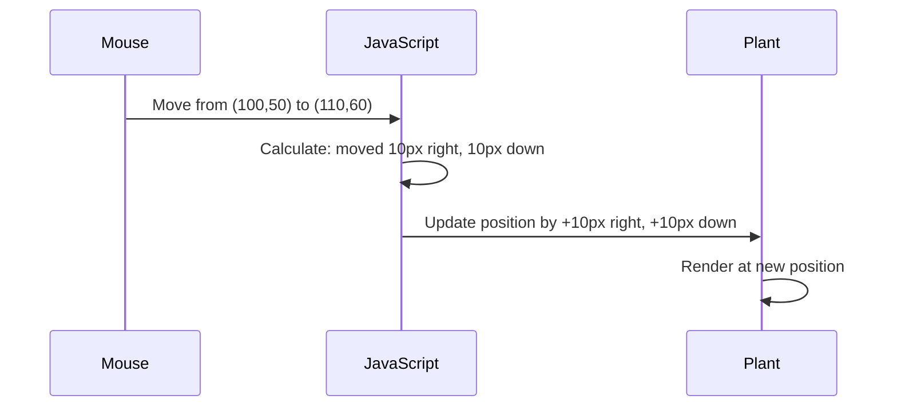

<!--
CO_OP_TRANSLATOR_METADATA:
{
  "original_hash": "bc93f6285423033ebf5b8abeb5282888",
  "translation_date": "2025-10-24T20:58:25+00:00",
  "source_file": "3-terrarium/3-intro-to-DOM-and-closures/README.md",
  "language_code": "cs"
}
-->
# Projekt terárium část 3: Manipulace s DOM a uzávěry v JavaScriptu


> Sketchnote od [Tomomi Imura](https://twitter.com/girlie_mac)

Vítejte u jedné z nejzajímavějších částí vývoje webu - interaktivní prvky! Document Object Model (DOM) je jako most mezi vaším HTML a JavaScriptem, a dnes ho využijeme k tomu, abychom vaše terárium oživili. Když Tim Berners-Lee vytvořil první webový prohlížeč, představoval si web, kde by dokumenty mohly být dynamické a interaktivní - a právě DOM tuto vizi umožňuje.

Prozkoumáme také uzávěry v JavaScriptu, které mohou na první pohled působit složitě. Představte si uzávěry jako "paměťové kapsy", kde si vaše funkce mohou pamatovat důležité informace. Je to jako kdyby každá rostlina ve vašem teráriu měla svůj vlastní záznam dat, aby sledovala svou polohu. Na konci této lekce pochopíte, jak přirozené a užitečné mohou být.

Tady je to, co budeme vytvářet: terárium, kde uživatelé mohou přetahovat rostliny kamkoliv chtějí. Naučíte se techniky manipulace s DOM, které pohánějí vše od přetahování souborů až po interaktivní hry. Pojďme oživit vaše terárium.

## Kvíz před lekcí

[Kvíz před lekcí](https://ff-quizzes.netlify.app/web/quiz/19)

## Porozumění DOM: Vaše brána k interaktivním webovým stránkám

Document Object Model (DOM) je způsob, jak JavaScript komunikuje s vašimi HTML prvky. Když váš prohlížeč načte HTML stránku, vytvoří strukturovanou reprezentaci této stránky v paměti - to je DOM. Představte si to jako rodokmen, kde každý HTML prvek je členem rodiny, ke kterému má JavaScript přístup, může ho upravit nebo přemístit.

Manipulace s DOM proměňuje statické stránky na interaktivní webové stránky. Kdykoliv vidíte tlačítko, které změní barvu při najetí myší, obsah se aktualizuje bez obnovení stránky nebo prvky, které můžete přetahovat, je to práce manipulace s DOM.


> Reprezentace DOM a HTML značek, které na něj odkazují. Od [Olfa Nasraoui](https://www.researchgate.net/publication/221417012_Profile-Based_Focused_Crawler_for_Social_Media-Sharing_Websites)

**Co dělá DOM tak mocným:**
- **Poskytuje** strukturovaný způsob přístupu k jakémukoliv prvku na vaší stránce
- **Umožňuje** dynamické aktualizace obsahu bez obnovení stránky
- **Reaguje** v reálném čase na interakce uživatele, jako jsou kliknutí a přetahování
- **Vytváří** základ pro moderní interaktivní webové aplikace

## Uzávěry v JavaScriptu: Vytváření organizovaného a mocného kódu

[Uzávěra v JavaScriptu](https://developer.mozilla.org/docs/Web/JavaScript/Closures) je jako dát funkci její vlastní soukromý pracovní prostor s trvalou pamětí. Představte si, jak Darwinovy pěnkavy na Galapágách vyvinuly specializované zobáky podle svého specifického prostředí - uzávěry fungují podobně, vytvářejí specializované funkce, které si "pamatují" svůj specifický kontext i po dokončení své nadřazené funkce.

V našem teráriu uzávěry pomáhají každé rostlině pamatovat si svou vlastní polohu nezávisle. Tento vzor se objevuje v celém profesionálním vývoji JavaScriptu, což z něj činí cenný koncept k pochopení.

> 💡 **Porozumění uzávěrům**: Uzávěry jsou významným tématem v JavaScriptu a mnoho vývojářů je používá roky, než plně pochopí všechny teoretické aspekty. Dnes se zaměříme na praktické použití - uvidíte, jak se uzávěry přirozeně objevují při budování našich interaktivních funkcí. Porozumění se bude rozvíjet, jak uvidíte, jak řeší skutečné problémy.


> Reprezentace DOM a HTML značek, které na něj odkazují. Od [Olfa Nasraoui](https://www.researchgate.net/publication/221417012_Profile-Based_Focused_Crawler_for_Social_Media-Sharing_Websites)

V této lekci dokončíme náš interaktivní projekt terária vytvořením JavaScriptu, který umožní uživateli manipulovat s rostlinami na stránce.

## Než začneme: Příprava na úspěch

Budete potřebovat své HTML a CSS soubory z předchozích lekcí o teráriu - chystáme se udělat tento statický design interaktivním. Pokud se připojujete poprvé, dokončení těchto lekcí vám poskytne důležitý kontext.

Tady je to, co budeme vytvářet:
- **Plynulé přetahování** všech rostlin v teráriu
- **Sledování souřadnic**, aby si rostliny pamatovaly své polohy
- **Kompletní interaktivní rozhraní** pomocí čistého JavaScriptu
- **Čistý, organizovaný kód** pomocí vzorů uzávěrů

## Nastavení vašeho JavaScriptového souboru

Vytvořme JavaScriptový soubor, který vaše terárium učiní interaktivním.

**Krok 1: Vytvořte svůj skriptovací soubor**

Ve složce terária vytvořte nový soubor s názvem `script.js`.

**Krok 2: Propojte JavaScript s vaším HTML**

Přidejte tento tag `<script>` do sekce `<head>` vašeho souboru `index.html`:

```html
<script src="./script.js" defer></script>
```

**Proč je atribut `defer` důležitý:**
- **Zajišťuje**, že váš JavaScript počká, dokud se načte celé HTML
- **Zabraňuje** chybám, kdy JavaScript hledá prvky, které ještě nejsou připravené
- **Zaručuje**, že všechny vaše rostlinné prvky jsou připravené k interakci
- **Poskytuje** lepší výkon než umístění skriptů na konec stránky

> ⚠️ **Důležitá poznámka**: Atribut `defer` zabraňuje běžným problémům s načasováním. Bez něj by JavaScript mohl zkusit přistupovat k HTML prvkům před jejich načtením, což by způsobilo chyby.

---

## Propojení JavaScriptu s vašimi HTML prvky

Než můžeme udělat prvky přetahovatelné, JavaScript je musí najít v DOM. Představte si to jako katalogizační systém knihovny - jakmile máte katalogové číslo, můžete najít přesně tu knihu, kterou potřebujete, a přistupovat ke všem jejím obsahům.

Použijeme metodu `document.getElementById()` k vytvoření těchto spojení. Je to jako mít přesný systém třídění - zadáte ID a najdete přesně ten prvek, který potřebujete ve vašem HTML.

### Aktivace funkce přetahování pro všechny rostliny

Přidejte tento kód do vašeho souboru `script.js`:

```javascript
// Enable drag functionality for all 14 plants
dragElement(document.getElementById('plant1'));
dragElement(document.getElementById('plant2'));
dragElement(document.getElementById('plant3'));
dragElement(document.getElementById('plant4'));
dragElement(document.getElementById('plant5'));
dragElement(document.getElementById('plant6'));
dragElement(document.getElementById('plant7'));
dragElement(document.getElementById('plant8'));
dragElement(document.getElementById('plant9'));
dragElement(document.getElementById('plant10'));
dragElement(document.getElementById('plant11'));
dragElement(document.getElementById('plant12'));
dragElement(document.getElementById('plant13'));
dragElement(document.getElementById('plant14'));
```

**Co tento kód dělá:**
- **Najde** každý rostlinný prvek v DOM pomocí jeho unikátního ID
- **Získá** JavaScriptovou referenci na každý HTML prvek
- **Předá** každý prvek funkci `dragElement` (kterou vytvoříme později)
- **Připraví** každou rostlinu na interakci přetahování
- **Spojí** vaši HTML strukturu s JavaScriptovou funkcionalitou

> 🎯 **Proč používat ID místo tříd?** ID poskytují unikátní identifikátory pro konkrétní prvky, zatímco CSS třídy jsou navrženy pro stylování skupin prvků. Když JavaScript potřebuje manipulovat s jednotlivými prvky, ID nabízejí přesnost a výkon, který potřebujeme.

> 💡 **Tip**: Všimněte si, jak voláme `dragElement()` pro každou rostlinu zvlášť. Tento přístup zajišťuje, že každá rostlina získá své vlastní nezávislé chování při přetahování, což je nezbytné pro plynulou interakci uživatele.

---

## Vytvoření uzávěry funkce dragElement

Nyní vytvoříme jádro naší funkce přetahování: uzávěru, která spravuje chování přetahování pro každou rostlinu. Tato uzávěra bude obsahovat několik vnitřních funkcí, které spolupracují na sledování pohybů myši a aktualizaci poloh prvků.

Uzávěry jsou pro tento úkol ideální, protože nám umožňují vytvořit "soukromé" proměnné, které přetrvávají mezi voláními funkcí, což každé rostlině poskytuje její vlastní nezávislý systém sledování souřadnic.

### Porozumění uzávěrům na jednoduchém příkladu

Ukážu vám uzávěry na jednoduchém příkladu, který ilustruje tento koncept:

```javascript
function createCounter() {
    let count = 0; // This is like a private variable
    
    function increment() {
        count++; // The inner function remembers the outer variable
        return count;
    }
    
    return increment; // We're giving back the inner function
}

const myCounter = createCounter();
console.log(myCounter()); // 1
console.log(myCounter()); // 2
```

**Co se děje v tomto vzoru uzávěry:**
- **Vytváří** soukromou proměnnou `count`, která existuje pouze v této uzávěře
- **Vnitřní funkce** může přistupovat k této vnější proměnné a upravovat ji (mechanismus uzávěry)
- **Když vrátíme** vnitřní funkci, udržuje si spojení s těmito soukromými daty
- **I po dokončení** `createCounter()` proměnná `count` přetrvává a pamatuje si svou hodnotu

### Proč jsou uzávěry ideální pro funkci přetahování

Pro naše terárium potřebuje každá rostlina pamatovat si své aktuální souřadnice. Uzávěry poskytují perfektní řešení:

**Klíčové výhody pro náš projekt:**
- **Udržují** soukromé proměnné polohy pro každou rostlinu nezávisle
- **Zachovávají** data o souřadnicích mezi událostmi přetahování
- **Zabraňují** konfliktům proměnných mezi různými přetahovatelnými prvky
- **Vytvářejí** čistou, organizovanou strukturu kódu

> 🎯 **Cíl učení**: Nemusíte hned ovládat všechny aspekty uzávěrů. Zaměřte se na to, jak nám pomáhají organizovat kód a udržovat stav pro naši funkci přetahování.

### Vytvoření funkce dragElement

Nyní vytvoříme hlavní funkci, která bude zpracovávat veškerou logiku přetahování. Přidejte tuto funkci pod deklarace vašich rostlinných prvků:

```javascript
function dragElement(terrariumElement) {
    // Initialize position tracking variables
    let pos1 = 0,  // Previous mouse X position
        pos2 = 0,  // Previous mouse Y position  
        pos3 = 0,  // Current mouse X position
        pos4 = 0;  // Current mouse Y position
    
    // Set up the initial drag event listener
    terrariumElement.onpointerdown = pointerDrag;
}
```

**Porozumění systému sledování polohy:**
- **`pos1` a `pos2`**: Uchovávají rozdíl mezi starými a novými polohami myši
- **`pos3` a `pos4`**: Sledují aktuální souřadnice myši
- **`terrariumElement`**: Konkrétní rostlinný prvek, který děláme přetahovatelným
- **`onpointerdown`**: Událost, která se spustí, když uživatel začne přetahovat

**Jak funguje vzor uzávěry:**
- **Vytváří** soukromé proměnné polohy pro každý rostlinný prvek
- **Udržuje** tyto proměnné během celého životního cyklu přetahování
- **Zajišťuje**, že každá rostlina sleduje své vlastní souřadnice nezávisle
- **Poskytuje** čisté rozhraní prostřednictvím funkce `dragElement`

### Proč používat události pointer?

Možná vás zajímá, proč používáme `onpointerdown` místo známějšího `onclick`. Tady je vysvětlení:

| Typ události | Nejlepší pro | Nevýhoda |
|--------------|-------------|----------|
| `onclick` | Jednoduché kliknutí na tlačítko | Neumí zpracovat přetahování (jen kliknutí a uvolnění) |
| `onpointerdown` | Myš i dotyk | Novější, ale dnes dobře podporovaný |
| `onmousedown` | Pouze myš na desktopu | Vynechává mobilní uživatele |

**Proč jsou události pointer ideální pro to, co budujeme:**
- **Skvěle fungují**, ať už někdo používá myš, prst nebo dokonce stylus
- **Působí stejně** na notebooku, tabletu nebo telefonu
- **Zpracovávají** skutečný pohyb přetahování (ne jen kliknutí a hotovo)
- **Vytvářejí** plynulý zážitek, který uživatelé očekávají od moderních webových aplikací

> 💡 **Připravenost na budoucnost**: Události pointer jsou moderním způsobem, jak zpracovávat interakce uživatelů. Místo psaní samostatného kódu pro myš a dotyk získáte obojí zdarma. Docela šikovné, že?

---

## Funkce pointerDrag: Zachycení začátku přetahování

Když uživatel stiskne rostlinu (ať už kliknutím myší nebo dotykem prstu), funkce `pointerDrag` se aktivuje. Tato funkce zachytí počáteční souřadnice a nastaví systém přetahování.

Přidejte tuto funkci do vaší uzávěry `dragElement`, hned za řádek `terrariumElement.onpointerdown = pointerDrag;`:

```javascript
function pointerDrag(e) {
    // Prevent default browser behavior (like text selection)
    e.preventDefault();
    
    // Capture the initial mouse/touch position
    pos3 = e.clientX;  // X coordinate where drag started
    pos4 = e.clientY;  // Y coordinate where drag started
    
    // Set up event listeners for the dragging process
    document.onpointermove = elementDrag;
    document.onpointerup = stopElementDrag;
}
```

**Krok za krokem, co se děje:**
- **Zabraňuje** výchozím chováním prohlížeče, které by mohlo narušit přetahování
- **Zaznamenává** přesné souřadnice, kde uživatel začal gesto přetahování
- **Nastavuje** posluchače událostí pro probíhající pohyb přetahování
- **Připravuje** systém na sledování pohybu myši/prstu po celém dokumentu

### Porozumění prevenci událostí

Řádek `e.preventDefault()` je klíčový pro plynulé přetahování:

**Bez prevence by prohlížeče mohly:**
- **Vybrat** text při přetahování po stránce
- **Spustit** kontextové menu při přetahování pravým tlačítkem
- **Narušit** naše vlastní chování přetahování
- **Vytvořit** vizuální artefakty během operace přetahování

> 🔍 **Experiment**: Po dokončení této lekce zkuste odstranit `e.preventDefault()` a podívejte se, jak to ovlivní zážitek z přetahování. Rychle pochopíte, proč je tento řádek nezbytný!

### Systém sledování souřadnic

Vlastnosti `e.clientX` a `e.clientY` nám poskytují přesné souřadnice myši/dotyků:

| Vlastnost | Co měří | Použití |
|-----------|---------|---------|
| `clientX` | Horizontální pozice vzhledem k viewportu | Sledování pohybu vlevo-vpravo |
| `clientY` | Vertikální pozice vzhledem k viewportu | Sledování pohybu nahoru-dolů |

**Porozumění těmto souřadnicím:**
- **Poskytují** přesné informace o poloze na pixel
- **Aktualizují se** v reálném čase, jak uživatel pohybuje ukazatelem
- **Zůstávají** konzistentní napříč různými velikostmi obrazovky a úrovněmi přiblížení
- **Umožňují** plynulé, citlivé interakce při přetahování

### Nastavení posluchačů událostí na úrovni dokumentu

Všimněte si, jak připojujeme události pohybu a zastavení k celému `document`, ne jen k rostlinnému prvku:

```javascript
document.onpointermove = elementDrag;
document.onpointerup = stopElementDrag;
```

**Proč připojit k dokumentu:**
- **Pokračuje** ve sledování, i když myš opustí rostlinný prvek
- **Zabraňuje** přerušení přetahování, pokud se uživatel pohybuje
- **`pos3` a `pos4`**: Ukládají aktuální pozici myši pro další výpočet
- **`offsetTop` a `offsetLeft`**: Získávají aktuální pozici prvku na stránce
- **Logika odečítání**: Posouvá prvek o stejnou vzdálenost, jakou se posunula myš

**Rozpis výpočtu pohybu:**
1. **Měří** rozdíl mezi starou a novou pozicí myši
2. **Vypočítává**, o kolik se má prvek posunout na základě pohybu myši
3. **Aktualizuje** vlastnosti CSS pozice prvku v reálném čase
4. **Ukládá** novou pozici jako výchozí bod pro další výpočet pohybu

### Vizuální znázornění výpočtu



### Funkce stopElementDrag: Úklid

Přidejte funkci pro úklid za zavírací složenou závorku `elementDrag`:

```javascript
function stopElementDrag() {
    // Remove the document-level event listeners
    document.onpointerup = null;
    document.onpointermove = null;
}
```

**Proč je úklid důležitý:**
- **Zabraňuje** únikům paměti způsobeným přetrvávajícími posluchači událostí
- **Zastavuje** chování při přetahování, když uživatel uvolní rostlinu
- **Umožňuje** nezávislé přetahování jiných prvků
- **Resetuje** systém pro další operaci přetahování

**Co se stane bez úklidu:**
- Posluchači událostí pokračují v běhu i po zastavení přetahování
- Výkon se zhoršuje, protože se hromadí nevyužití posluchači
- Neočekávané chování při interakci s jinými prvky
- Prohlížeč plýtvá zdroji na zbytečné zpracování událostí

### Porozumění vlastnostem CSS pozice

Náš systém přetahování manipuluje dvěma klíčovými vlastnostmi CSS:

| Vlastnost | Co ovládá | Jak ji používáme |
|-----------|-----------|------------------|
| `top` | Vzdálenost od horního okraje | Vertikální pozice během přetahování |
| `left` | Vzdálenost od levého okraje | Horizontální pozice během přetahování |

**Klíčové poznatky o vlastnostech offsetu:**
- **`offsetTop`**: Aktuální vzdálenost od horního okraje rodičovského prvku s pozicí
- **`offsetLeft`**: Aktuální vzdálenost od levého okraje rodičovského prvku s pozicí
- **Kontext pozice**: Tyto hodnoty jsou relativní k nejbližšímu předkovi s nastavenou pozicí
- **Aktualizace v reálném čase**: Okamžitě se mění, když upravíme vlastnosti CSS

> 🎯 **Filozofie designu**: Tento systém přetahování je záměrně flexibilní – neexistují žádné "zónové oblasti" ani omezení. Uživatelé mohou umístit rostliny kamkoli, což jim dává úplnou kreativní kontrolu nad designem terária.

## Spojení všeho dohromady: Kompletní systém přetahování

Gratulujeme! Právě jste vytvořili sofistikovaný systém přetahování pomocí čistého JavaScriptu. Vaše kompletní funkce `dragElement` nyní obsahuje výkonný uzávěr, který spravuje:

**Co váš uzávěr dokáže:**
- **Udržuje** soukromé proměnné pozice pro každou rostlinu nezávisle
- **Řídí** kompletní životní cyklus přetahování od začátku do konce
- **Zajišťuje** plynulý a citlivý pohyb po celé obrazovce
- **Správně** uvolňuje zdroje, aby zabránil únikům paměti
- **Vytváří** intuitivní a kreativní rozhraní pro design terária

### Testování vašeho interaktivního terária

Nyní otestujte své interaktivní terárium! Otevřete svůj soubor `index.html` v webovém prohlížeči a vyzkoušejte funkčnost:

1. **Klikněte a podržte** libovolnou rostlinu, abyste začali přetahovat
2. **Pohybujte myší nebo prstem** a sledujte, jak rostlina plynule následuje
3. **Uvolněte**, abyste rostlinu umístili na nové místo
4. **Experimentujte** s různými uspořádáními a prozkoumejte rozhraní

🥇 **Úspěch**: Vytvořili jste plně interaktivní webovou aplikaci pomocí základních konceptů, které profesionální vývojáři používají denně. Tato funkce přetahování využívá stejné principy jako nahrávání souborů, kanbanové tabule a mnoho dalších interaktivních rozhraní.


---

## Výzva GitHub Copilot Agent 🚀

Použijte režim Agent k dokončení následující výzvy:

**Popis:** Vylepšete projekt terária přidáním funkce resetování, která vrátí všechny rostliny na jejich původní pozice s plynulými animacemi.

**Zadání:** Vytvořte tlačítko resetování, které po kliknutí animuje všechny rostliny zpět na jejich původní pozice v postranním panelu pomocí přechodů CSS. Funkce by měla při načítání stránky uložit původní pozice a plynule přesunout rostliny zpět na tyto pozice během 1 sekundy po stisknutí tlačítka resetování.

Více informací o [režimu agent](https://code.visualstudio.com/blogs/2025/02/24/introducing-copilot-agent-mode) najdete zde.

## 🚀 Další výzva: Rozšiřte své dovednosti

Připraveni posunout své terárium na další úroveň? Zkuste implementovat tato vylepšení:

**Kreativní rozšíření:**
- **Dvojklik** na rostlinu ji přenese do popředí (manipulace s z-indexem)
- **Přidejte vizuální zpětnou vazbu**, jako jemné záření při najetí na rostliny
- **Implementujte hranice**, aby rostliny nemohly být přetaženy mimo terárium
- **Vytvořte funkci uložení**, která si zapamatuje pozice rostlin pomocí localStorage
- **Přidejte zvukové efekty** při zvedání a umisťování rostlin

> 💡 **Příležitost k učení**: Každá z těchto výzev vás naučí nové aspekty manipulace s DOM, zpracování událostí a návrhu uživatelského rozhraní.

## Kvíz po přednášce

[Kvíz po přednášce](https://ff-quizzes.netlify.app/web/quiz/20)

## Přehled a samostudium: Prohloubení vašich znalostí

Ovládli jste základy manipulace s DOM a uzávěrů, ale vždy je co objevovat! Zde je několik cest, jak rozšířit své znalosti a dovednosti.

### Alternativní přístupy k přetahování

Použili jsme události ukazatele pro maximální flexibilitu, ale webový vývoj nabízí několik přístupů:

| Přístup | Nejlepší pro | Hodnota učení |
|---------|--------------|---------------|
| [HTML Drag and Drop API](https://developer.mozilla.org/docs/Web/API/HTML_Drag_and_Drop_API) | Nahrávání souborů, formální zóny přetahování | Porozumění nativním schopnostem prohlížeče |
| [Události dotyku](https://developer.mozilla.org/docs/Web/API/Touch_events) | Interakce specifické pro mobilní zařízení | Vzory vývoje zaměřené na mobilní zařízení |
| Vlastnosti CSS `transform` | Plynulé animace | Techniky optimalizace výkonu |

### Pokročilá témata manipulace s DOM

**Další kroky ve vašem vzdělávání:**
- **Delegace událostí**: Efektivní zpracování událostí pro více prvků
- **Intersection Observer**: Detekce, kdy prvky vstupují/vystupují z pohledu
- **Mutation Observer**: Sledování změn ve struktuře DOM
- **Web Components**: Vytváření znovupoužitelných, zapouzdřených prvků UI
- **Koncepty virtuálního DOM**: Porozumění tomu, jak frameworky optimalizují aktualizace DOM

### Základní zdroje pro další vzdělávání

**Technická dokumentace:**
- [MDN Pointer Events Guide](https://developer.mozilla.org/docs/Web/API/Pointer_events) - Komplexní referenční příručka k událostem ukazatele
- [W3C Pointer Events Specification](https://www.w3.org/TR/pointerevents1/) - Oficiální dokumentace standardů
- [JavaScript Closures Deep Dive](https://developer.mozilla.org/docs/Web/JavaScript/Closures) - Pokročilé vzory uzávěrů

**Kompatibilita prohlížečů:**
- [CanIUse.com](https://caniuse.com/) - Zkontrolujte podporu funkcí napříč prohlížeči
- [MDN Browser Compatibility Data](https://github.com/mdn/browser-compat-data) - Podrobné informace o kompatibilitě

**Příležitosti k procvičování:**
- **Vytvořte** puzzle hru pomocí podobné mechaniky přetahování
- **Navrhněte** kanbanovou tabuli s přetahováním úkolů
- **Navrhněte** galerii obrázků s přetahovatelným uspořádáním fotografií
- **Experimentujte** s dotykovými gesty pro mobilní rozhraní

> 🎯 **Strategie učení**: Nejlepší způsob, jak si tyto koncepty osvojit, je praxe. Zkuste vytvořit různé varianty přetahovatelných rozhraní – každý projekt vás naučí něco nového o interakci uživatele a manipulaci s DOM.

## Zadání

[Pracujte trochu více s DOM](assignment.md)

---

**Prohlášení**:  
Tento dokument byl přeložen pomocí služby AI pro překlad [Co-op Translator](https://github.com/Azure/co-op-translator). Ačkoli se snažíme o přesnost, mějte prosím na paměti, že automatizované překlady mohou obsahovat chyby nebo nepřesnosti. Původní dokument v jeho rodném jazyce by měl být považován za autoritativní zdroj. Pro důležité informace se doporučuje profesionální lidský překlad. Neodpovídáme za žádná nedorozumění nebo nesprávné interpretace vyplývající z použití tohoto překladu.