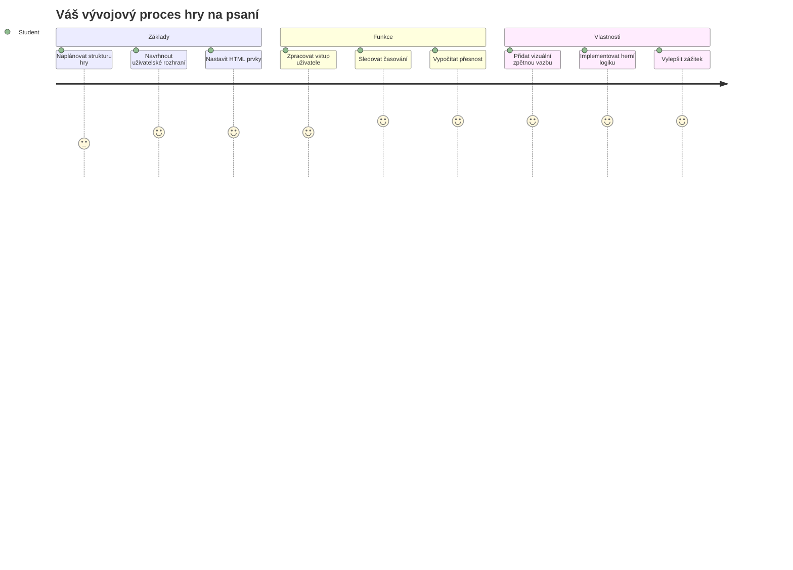
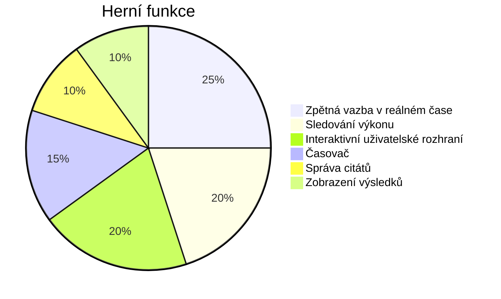
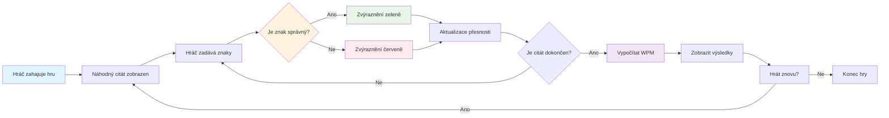
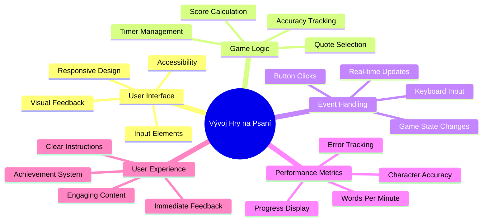
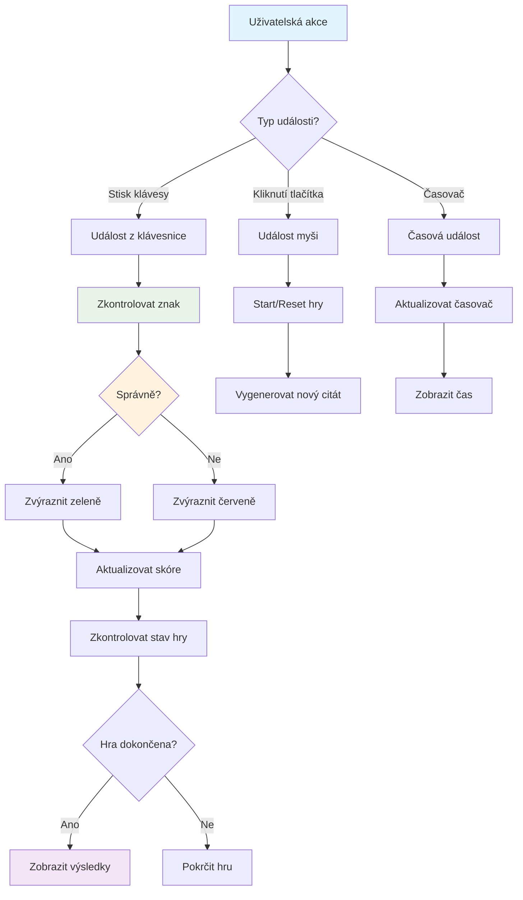
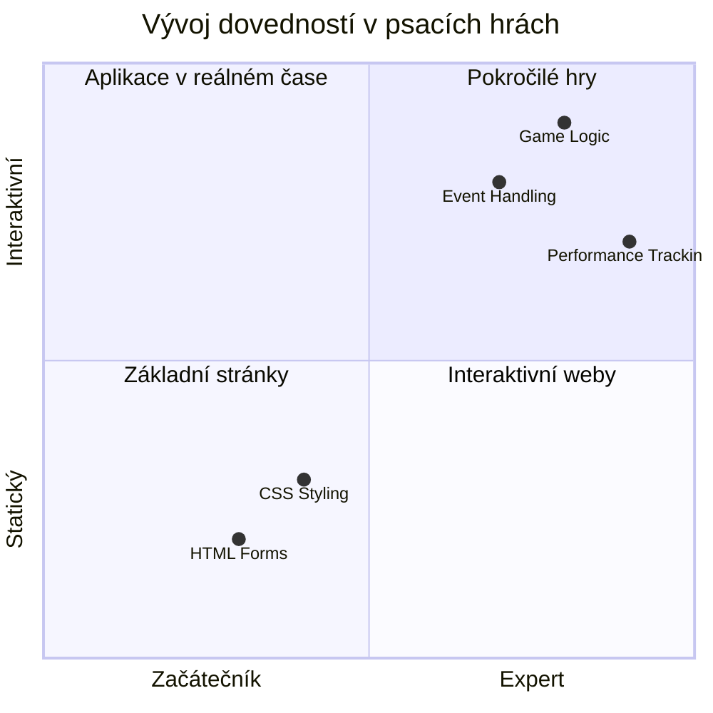
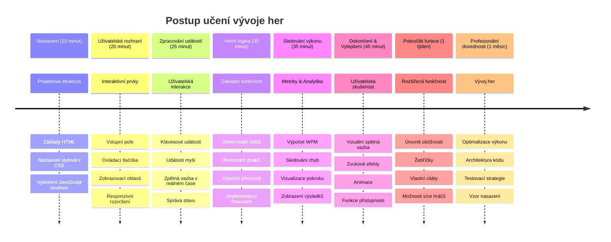

<!--
CO_OP_TRANSLATOR_METADATA:
{
  "original_hash": "efa2ab875b8bb5a7883816506da6b6d2",
  "translation_date": "2026-01-07T03:23:00+00:00",
  "source_file": "4-typing-game/README.md",
  "language_code": "cs"
}
-->
# Programování řízené událostmi - Vytvořte si hru na psaní

## Úvod

Toto je něco, co každý vývojář zná, ale zřídka o tom mluví: rychlé psaní je superpřemožitel! 🚀 Přemýšlejte o tom – čím rychleji dostanete své myšlenky z mozku do kódovacího editoru, tím volněji může proudit vaše tvořivost. Je to jako mít přímý kanál mezi svými myšlenkami a obrazovkou.

Chcete vědět jeden z nejlepších způsobů, jak tuto dovednost vylepšit? Uhádli jste – postavíme hru!

> Vytvořme spolu úžasnou hru na psaní!

Jste připraveni využít všechny ty dovednosti z JavaScriptu, HTML a CSS, které jste se naučili? Postavíme hru na psaní, která vás bude vybízet k psaní náhodných citátů od legendárního detektiva [Sherlocka Holmese](https://en.wikipedia.org/wiki/Sherlock_Holmes). Hra bude sledovat, jak rychle a přesně dokážete psát – a věřte mi, je to návykovější, než si myslíte!

## Co byste měli znát

Než začneme, ujistěte se, že se dobře orientujete v těchto pojmech (neobávejte se, pokud potřebujete rychlé osvěžení - všichni jsme tím prošli!):

- Vytváření textových vstupů a tlačítek
- CSS a nastavení stylů pomocí tříd  
- Základy JavaScriptu
  - Vytvoření pole (array)
  - Vytvoření náhodného čísla
  - Získání aktuálního času

Pokud je něco z toho trochu zapomenuté, to vůbec nevadí! Někdy je nejlepší upevnit si znalosti tak, že se pustíte do projektu a postupně to zjistíte.

### 🔄 **Pedagogická kontrola**
**Základní hodnocení**: Před zahájením vývoje si ověřte, že rozumíte:
- ✅ Jak fungují HTML formuláře a vstupní prvky
- ✅ CSS třídy a dynamické styly
- ✅ JavaScript posluchače událostí a jejich zpracování
- ✅ Práce s poli a náhodným výběrem
- ✅ Měření času a výpočty

**Rychlý test pro sebe**: Dokážete vysvětlit, jak tyto koncepty fungují společně v interaktivní hře?
- **Události** se spouštějí, když uživatelé interagují s prvky
- **Zpracovatelé** pracují s událostmi a aktualizují stav hry
- **CSS** poskytuje vizuální odezvu na uživatelské akce
- **Časování** umožňuje měřit výkon a postup hry

## Postavme to!

[Vytvoření hry na psaní pomocí programování řízeného událostmi](./typing-game/README.md)

### ⚡ **Co můžete zvládnout za následujících 5 minut**
- [ ] Otevřete konzoli prohlížeče a zkoušejte poslouchat klávesové události pomocí `addEventListener`
- [ ] Vytvořte jednoduchou HTML stránku s textovým polem a otestujte detekci psaní
- [ ] Procvičte manipulaci s řetězci porovnáváním psaného textu s cílovým textem
- [ ] Experimentujte s `setTimeout` a pochopte časovací funkce

### 🎯 **Co můžete zvládnout za tuto hodinu**
- [ ] Dokončit kvíz po lekci a pochopit programování řízené událostmi
- [ ] Vytvořit základní verzi hry na psaní s ověřováním slov
- [ ] Přidat vizuální odezvu pro správné a chybné psaní
- [ ] Implementovat jednoduchý bodovací systém na základě rychlosti a přesnosti
- [ ] Na styl hry použít CSS, aby byla vizuálně přitažlivá

### 📅 **Týdenní vývoj hry**
- [ ] Dokončit kompletní hru se všemi funkcemi a vylepšeními
- [ ] Přidat úrovně obtížnosti s různou složitostí slov
- [ ] Implementovat sledování statistik uživatele (WPM, přesnost v čase)
- [ ] Vytvořit zvukové efekty a animace pro lepší uživatelský zážitek
- [ ] Umožnit mobilní responzivitu hry pro dotyková zařízení
- [ ] Sdílet hru online a sbírat zpětnou vazbu od uživatelů

### 🌟 **Měsíční interaktivní vývoj**
- [ ] Vyvinout více her zkoumajících různé vzory interakce
- [ ] Naučit se o herních cyklech, správě stavu a optimalizaci výkonu
- [ ] Přispívat do open source projektů na vývoj her
- [ ] Ovládnout pokročilé časové koncepty a plynulé animace
- [ ] Vytvořit portfolio s různými interaktivními aplikacemi
- [ ] Mentorovat ostatní zájemce o vývoj her a uživatelskou interakci

## 🎯 Časový plán zvládnutí hry na psaní

### 🛠️ Souhrn vašich nástrojů pro vývoj hry

Po dokončení tohoto projektu ovládnete:
- **Programování řízené událostmi**: Reagující uživatelská rozhraní reagující na vstup
- **Okamžitá zpětná vazba**: Okamžité vizuální a výkonnostní aktualizace
- **Měření výkonu**: Přesné systémy měření času a bodování
- **Správa stavu hry**: Kontrola toku aplikace a uživatelského zážitku
- **Interaktivní design**: Vytváření poutavých a návykových zážitků
- **Moderní webová API**: Využití schopností prohlížeče pro bohaté interakce
- **Přístupnost**: Inkluzivní design pro všechny uživatele

**Praktické využití**: Tyto dovednosti se přímo používají v:
- **Webových aplikacích**: Jakékoli interaktivní rozhraní nebo dashboard
- **Vzdělávacím softwaru**: Výukové platformy a nástroje pro hodnocení dovedností
- **Produktivních nástrojích**: Textové editory, IDE a software pro spolupráci
- **Herním průmyslu**: Prohlížečové hry a interaktivní zábava
- **Mobilním vývoji**: Rozhraní na dotyková zařízení a zpracování gest

**Další úroveň**: Jste připraveni prozkoumat pokročilé herní frameworky, realtime multiplayer systémy nebo složité interaktivní aplikace!

## Poděkování

Napsal s ♥️ [Christopher Harrison](http://www.twitter.com/geektrainer)

---

<!-- CO-OP TRANSLATOR DISCLAIMER START -->
**Prohlášení o vyloučení odpovědnosti**:  
Tento dokument byl přeložen pomocí AI překladatelské služby [Co-op Translator](https://github.com/Azure/co-op-translator). Přestože usilujeme o přesnost, mějte prosím na paměti, že automatické překlady mohou obsahovat chyby nebo nepřesnosti. Původní dokument v jeho mateřském jazyce by měl být považován za autoritativní zdroj. Pro zásadní informace se doporučuje profesionální lidský překlad. Nezodpovídáme za jakékoli nedorozumění nebo mylné výklady vyplývající z použití tohoto překladu.
<!-- CO-OP TRANSLATOR DISCLAIMER END -->