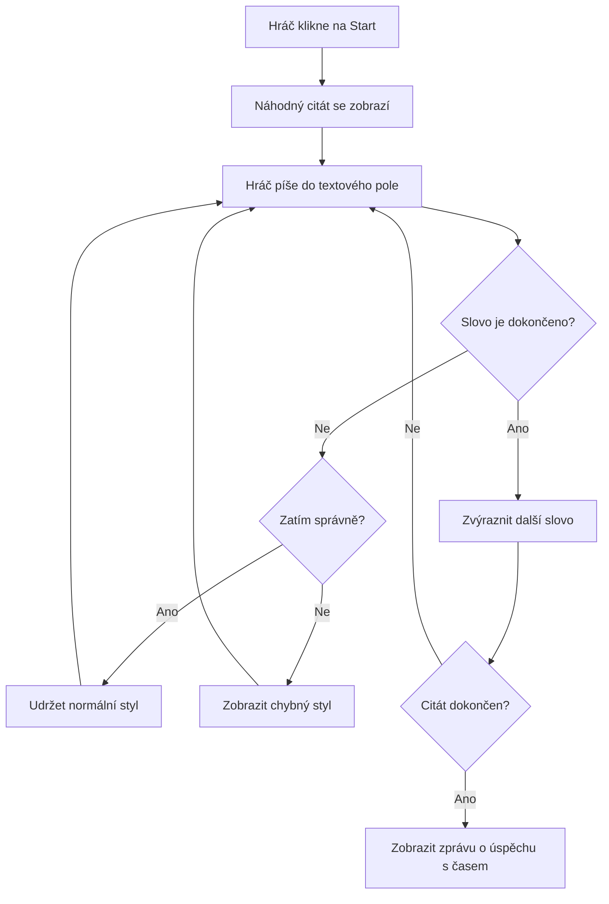
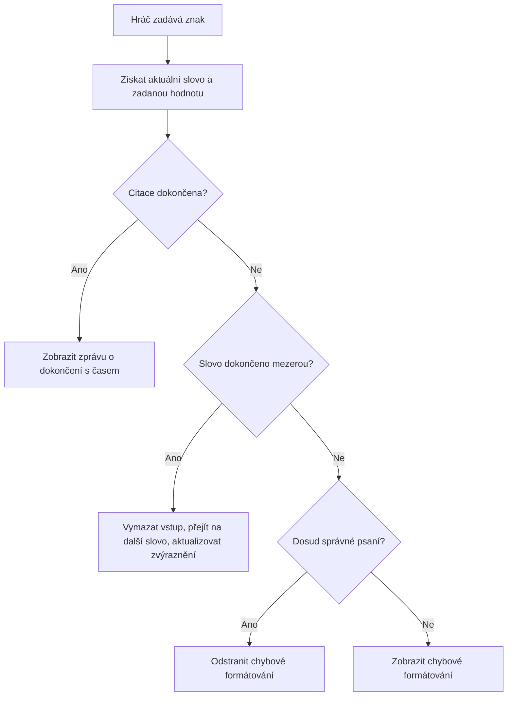
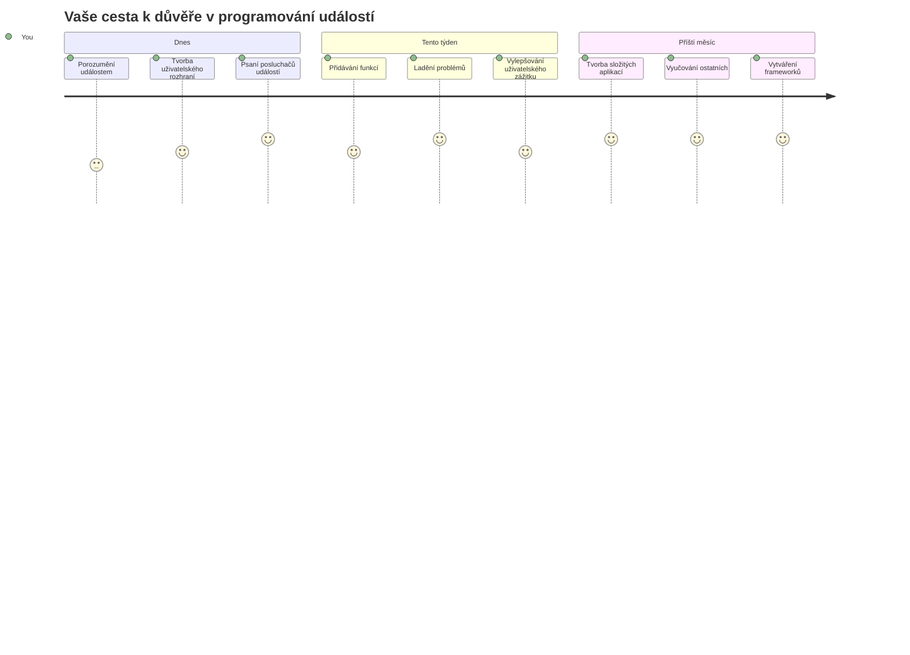

<!--
CO_OP_TRANSLATOR_METADATA:
{
  "original_hash": "da8bc72041a2bb3826a54654ee1a8844",
  "translation_date": "2026-01-07T04:01:19+00:00",
  "source_file": "4-typing-game/typing-game/README.md",
  "language_code": "cs"
}
-->
# Vytváření hry pomocí událostí

Už jste se někdy divili, jak webové stránky poznají, kdy kliknete na tlačítko nebo píšete do textového pole? To je kouzlo programování řízeného událostmi! Co je lepšího způsobu, jak se naučit tuto základní dovednost, než vytvořit něco užitečného – hru na rychlost psaní, která reaguje na každý váš stisk klávesy.

Uvidíte na vlastní oči, jak webové prohlížeče „komunikují“ s vaším kódem JavaScriptu. Když kliknete, napíšete nebo pohněte myší, prohlížeč posílá malá „zprávy“ (říkáme jim události) vašemu kódu a vy rozhodnete, jak na ně reagovat!

Až tady skončíme, vytvoříte skutečnou hru na psaní, která sleduje vaši rychlost a přesnost. Ještě důležitější je, že pochopíte základní pojmy, které pohánějí každou interaktivní webovou stránku, kterou jste kdy použili. Pojďme na to!

## Kvíz před přednáškou

[Pre-lecture quiz](https://ff-quizzes.netlify.app/web/quiz/21)

## Programování řízené událostmi

Zamyslete se nad svou oblíbenou aplikací nebo webovou stránkou – co ji dělá živou a citlivou? Je to celé o tom, jak reaguje na to, co děláte! Každé klepnutí, kliknutí, přejetí nebo stisk klávesy vytváří to, čemu říkáme „událost“, a právě zde se odehrává opravdové kouzlo webového vývoje.

Co dělá programování pro web tak zajímavým: nikdy nevíme, kdy někdo klikne na tlačítko nebo začne psát do textového pole. Může kliknout hned, počkat pět minut nebo třeba vůbec! Tato nepředvídatelnost znamená, že musíme o psaní kódu přemýšlet jinak.

Místo psaní kódu, který se vykonává shora dolů jako recept, píšeme kód, který trpělivě čeká na to, až se něco stane. Je to podobné jako telegrafisté v 19. století, kteří seděli u svých strojů a byli připraveni zareagovat ve chvíli, kdy přišla zpráva přes drát.

Tak co přesně je „událost“? Jednoduše řečeno, je to něco, co se stane! Když kliknete na tlačítko – to je událost. Když napíšete písmeno – to je událost. Když pohněte myší – to je další událost.

Programování řízené událostmi nám umožňuje nastavit náš kód tak, aby poslouchal a reagoval. Vytváříme speciální funkce nazývané **event listenery** (posluchače událostí), které trpělivě čekají na konkrétní situace a pak okamžitě reagují, když nastanou.

Představte si posluchače událostí jako zvonek u dveří pro váš kód. Nastavíte zvonek (`addEventListener()`), řeknete mu, jaký zvuk má poslouchat (například „kliknutí“ nebo „stisk klávesy“) a pak určíme, co se má stát, když někdo zazvoní (vaše vlastní funkce).

**Takto posluchače událostí fungují:**
- **Poslouchají** specifické uživatelské akce jako kliknutí, stisky kláves či pohyby myši
- **Spustí** váš vlastní kód, když nastane daná událost
- **Okamžitě reagují** na uživatelské interakce a vytvářejí plynulý zážitek
- **Řeší** více událostí na stejném prvku pomocí různých posluchačů

> **POZNÁMKA:** Stojí za to zdůraznit, že existuje mnoho způsobů, jak vytvořit posluchače událostí. Můžete použít anonymní funkce nebo pojmenované funkce. Můžete využít různé zkratky, například nastavit vlastnost `click` nebo použít `addEventListener()`. V našem cvičení se zaměříme na `addEventListener()` a anonymní funkce, protože je to pravděpodobně nejběžnější technika používaná webovými vývojáři. Je také nejflexibilnější, protože `addEventListener()` funguje pro všechny události a název události lze předat jako parametr.

### Běžné události

I když webové prohlížeče nabízejí desítky různých událostí, na které můžete poslouchat, většina interaktivních aplikací spoléhá jen na hrstku základních událostí. Pochopení těchto základních událostí vám dá základy pro vytváření sofistikovaných uživatelských interakcí.

Existuje [desítky událostí](https://developer.mozilla.org/docs/Web/Events), na které můžete při vytváření aplikace reagovat. Prakticky cokoli, co uživatel na stránce udělá, vyvolá událost, což vám dává spoustu možností, abyste zajistili požadovaný uživatelský zážitek. Naštěstí budete obvykle potřebovat jen pár událostí. Zde je několik běžných (včetně dvou, které použijeme při tvorbě naší hry):

| Událost | Popis | Běžné použití |
|---------|-------|---------------|
| `click` | Uživatel kliknul na něco | Tlačítka, odkazy, interaktivní prvky |
| `contextmenu` | Uživatel kliknul pravým tlačítkem myši | Vlastní kontextové menu na pravý klik |
| `select` | Uživatel označil text | Úprava textu, kopírování |
| `input` | Uživatel zadal text | Ověření formuláře, vyhledávání v reálném čase |

**Pochopení těchto typů událostí:**
- **Spouští se** při interakci uživatelů s konkrétními prvky na stránce
- **Poskytují** podrobné informace o uživatelské akci prostřednictvím objektů událostí
- **Umožňují** vytvářet citlivé a interaktivní webové aplikace
- **Fungují** konzistentně napříč různými prohlížeči a zařízeními

## Vytvoření hry

Nyní, když rozumíte tomu, jak události fungují, pojďme tuto znalost využít v praxi vytvářením něčeho užitečného. Vytvoříme hru na rychlost psaní, která demonstruje práci s událostmi a zároveň vám pomůže rozvinout důležitou dovednost programátora.

Budeme vytvářet hru, abychom prozkoumali, jak události fungují v JavaScriptu. Naše hra otestuje hráčovu schopnost psaní, což je jedna z nejvíce podceňovaných dovedností, kterou by měl každý vývojář mít. Zajímavost: klávesnice QWERTY, kterou dnes používáme, byla ve skutečnosti navržena v 70. letech 19. století pro psací stroje – a dobré psací dovednosti jsou pro programátory stále stejně cenné! Obecný průběh hry bude vypadat takto:


**Takto bude naše hra fungovat:**
- **Začne** po kliknutí hráče na tlačítko start a zobrazí náhodný citát
- **Sleduje** postup psaní hráče slovo po slovu v reálném čase
- **Zvýrazňuje** aktuální slovo pro lepší soustředění hráče
- **Poskytuje** okamžitou vizuální zpětnou vazbu při chybách v psaní
- **Vypočítá** a zobrazí celkový čas po dokončení citátu

Pojďme postavit naši hru a naučit se o událostech!

### Struktura souborů

Než začneme kódovat, zorganizujme si vše! Mít od začátku čistou strukturu souborů ušetří později spoustu starostí a udělá z vašeho projektu profesionálnější práci. 😊

Budeme to mít jednoduché – tři soubory: `index.html` pro strukturu stránky, `script.js` pro veškerou logiku hry a `style.css`, abychom vše krásně naformátovali. To je klasické trio, které pohání většinu webu!

**Vytvořte novou složku pro svou práci otevřením konzole nebo terminálu a zadejte následující příkaz:**

```bash
# Linux nebo macOS
mkdir typing-game && cd typing-game

# Windows
md typing-game && cd typing-game
```

**Co tyto příkazy dělají:**
- **Vytvoří** novou složku s názvem `typing-game` pro vaše projekty
- **Automaticky** přejde do nové složky
- **Založí** čisté pracovní prostředí pro vývoj hry

**Otevřete Visual Studio Code:**

```bash
code .
```

**Tento příkaz:**
- **Spustí** Visual Studio Code v aktuálním adresáři
- **Otevře** vaši projektovou složku v editoru
- **Umožní** přístup ke všem vývojovým nástrojům, které budete potřebovat

**Přidejte do složky ve Visual Studio Code tři soubory s těmito názvy:**
- `index.html` – obsahuje strukturu a obsah vaší hry
- `script.js` – řeší veškerou logiku hry a posluchače událostí
- `style.css` – definuje vizuální podobu a stylování

## Vytvoření uživatelského rozhraní

Teď postavme jeviště, kde se odehraje veškerá akce naší hry! Představte si to jako navrhování ovládacího panelu vesmírné lodi – musíme zajistit, aby vše, co hráči potřebují, bylo přesně tam, kde to čekají.

Pojďme zjistit, co naše hra skutečně potřebuje. Kdybyste hráli hru na psaní, co byste chtěli vidět na obrazovce? Tady je to, co budeme potřebovat:

| Prvek UI | Účel | HTML prvek |
|----------|-------|------------|
| Zobrazení citátu | Ukazuje text k opsání | `<p>` s `id="quote"` |
| Oblast zpráv | Zobrazuje stavové a úspěšné zprávy | `<p>` s `id="message"` |
| Textové pole | Místo, kde hráči píší citát | `<input>` s `id="typed-value"` |
| Tlačítko start | Spustí hru | `<button>` s `id="start"` |

**Pochopení struktury UI:**
- **Uspořádává** obsah logicky shora dolů
- **Přiřazuje** unikátní ID prvkům pro cílení v JavaScriptu
- **Poskytuje** jasnou vizuální hierarchii pro lepší uživatelský zážitek
- **Zahrnuje** sémantické HTML prvky pro přístupnost

Každý z těchto prvků bude potřebovat ID, abychom s nimi mohli v JavaScriptu pracovat. Přidáme také reference na CSS a JavaScriptové soubory, které vytvoříme.

Vytvořte nový soubor s názvem `index.html`. Přidejte následující HTML:

```html
<!-- inside index.html -->
<html>
<head>
  <title>Typing game</title>
  <link rel="stylesheet" href="style.css">
</head>
<body>
  <h1>Typing game!</h1>
  <p>Practice your typing skills with a quote from Sherlock Holmes. Click **start** to begin!</p>
  <p id="quote"></p> <!-- This will display our quote -->
  <p id="message"></p> <!-- This will display any status messages -->
  <div>
    <input type="text" aria-label="current word" id="typed-value" /> <!-- The textbox for typing -->
    <button type="button" id="start">Start</button> <!-- To start the game -->
  </div>
  <script src="script.js"></script>
</body>
</html>
```

**Rozbor, co tato HTML struktura dělá:**
- **Propojuje** CSS soubor ve `<head>` pro stylování
- **Vytváří** jasný nadpis a instrukce pro uživatele
- **Zřizuje** odstavce s konkrétními ID pro dynamický obsah
- **Zahrnuje** vstupní pole s atributy pro přístupnost
- **Poskytuje** tlačítko start pro spuštění hry
- **Načítá** JavaScript na konci pro optimální výkon

### Spuštění aplikace

Pravidelné testování aplikace během vývoje vám pomůže odhalit chyby včas a vidět svůj pokrok v reálném čase. Live Server je neocenitelný nástroj, který automaticky obnovuje prohlížeč při každém uložení změn, což značně zrychluje vývoj.

Nejlepší je vyvíjet postupně, abyste viděli, jak to vypadá. Spusťme naši aplikaci. Ve Visual Studio Code existuje skvělá rozšíření s názvem [Live Server](https://marketplace.visualstudio.com/items?itemName=ritwickdey.LiveServer&WT.mc_id=academic-77807-sagibbon), které vaši aplikaci hostuje lokálně a zároveň obnovuje prohlížeč při každém uložení.

**Nainstalujte [Live Server](https://marketplace.visualstudio.com/items?itemName=ritwickdey.LiveServer&WT.mc_id=academic-77807-sagibbon) kliknutím na odkaz a tlačítko Instalovat:**

**Co se děje během instalace:**
- **Vyvolá** váš prohlížeč k otevření Visual Studio Code
- **Provede** vás postupem instalace rozšíření
- **Může vyžadovat** restart Visual Studio Code pro dokončení instalace

**Po instalaci ve Visual Studio Code stiskněte Ctrl-Shift-P (nebo Cmd-Shift-P) pro otevření palety příkazů:**

**Co paleta příkazů dělá:**
- **Umožňuje** rychlý přístup ke všem příkazům VS Code
- **Vyhledává** příkazy při psaní
- **Nabízí** klávesové zkratky pro rychlejší vývoj

**Napište „Live Server: Open with Live Server“:**

**Co Live Server dělá:**
- **Spustí** lokální vývojový server pro váš projekt
- **Automaticky** obnovuje prohlížeč po uložení souborů
- **Servíruje** vaše soubory přes lokální URL (obvykle `localhost:5500`)

**Otevřete prohlížeč a přejděte na `https://localhost:5500`:**

Nyní byste měli vidět stránku, kterou jste vytvořili! Přidáme nějakou funkčnost.

## Přidání CSS

Teď to uděláme hezky vizuálně! Vizuální zpětná vazba je pro uživatelská rozhraní klíčová od počátků počítačové techniky. V 80. letech výzkumy ukázaly, že okamžitá vizuální odezva výrazně zlepšuje uživatelský výkon a snižuje chyby. To je přesně to, co vytvoříme.

Naše hra musí být krystalicky jasná o tom, co se děje. Hráči by měli okamžitě vědět, které slovo mají psát, a pokud udělají chybu, měli by to ihned vidět. Vytvoříme jednoduché, ale účinné stylování:

Vytvořte nový soubor s názvem `style.css` a přidejte následující syntaxi.

```css
/* inside style.css */
.highlight {
  background-color: yellow;
}

.error {
  background-color: lightcoral;
  border: red;
}
```

**Co tyto CSS třídy znamenají:**
- **Zvýrazňuje** aktuální slovo žlutým pozadím pro jasné vedení zraku
- **Signalizuje** chyby v psaní světle korálovým pozadím
- **Poskytuje** okamžitou odezvu, aniž by narušovalo plynulost psaní uživatele
- **Používá** kontrastní barvy pro přístupnost a jasnou vizuální komunikaci

✅ Pokud jde o CSS, můžete stránku rozvrhnout, jak chcete. Věnujte chvíli času a udělejte stránku atraktivnější:

- Změňte písmo
- Obarvěte nadpisy
- Přizpůsobte velikosti prvků

## JavaScript

Teď to začne být zajímavé! 🎉 Máme HTML strukturu a CSS stylování, ale naše hra je zatím jako krásné auto bez motoru. JavaScript bude ten motor – to, co skutečně primárně funguje a reaguje na to, co hráč dělá.

Zde uvidíte svůj výtvor ožívat. Pustíme se do toho krok za krokem, aby to nebylo zahlcující:

| Krok | Cíl | Co se naučíte |
|------|-----|---------------|
| [Vytvoření konstant](../../../../4-typing-game/typing-game) | Nastavení citátů a referencí na DOM | Správa proměnných a výběr DOM prvků |
| [Posluchač události pro start hry](../../../../4-typing-game/typing-game) | Zpracování inicializace hry | Práce s událostmi a aktualizace UI |
| [Posluchač události pro psaní](../../../../4-typing-game/typing-game) | Zpracování vstupu uživatele v reálném čase | Validace vstupu a dynamická zpětná vazba |

**Takto strukturovaný přístup vám pomůže:**
- **Organizovat** kód do logických, zvládnutelných částí
- **Postupně** budovat funkčnost pro snadnější ladění
- **Porozumět**, jak spolu části aplikace fungují
- **Vytvořit** znovupoužitelné vzory pro budoucí projekty

Nejprve ale vytvořte nový soubor s názvem `script.js`.

### Přidání konstant

Než se pustíme do akce, shromáždíme všechny naše zdroje! Stejně jako NASA nastavuje všechny monitorovací systémy před startem, je mnohem snazší mít vše připravené, než později něco hledat a riskovat překlepy.

Nejprve nastavíme toto:

| Typ dat | Účel | Příklad |
| Pole citátů | Uložte všechny možné citáty pro hru | `['Quote 1', 'Quote 2', ...]` |
| Pole slov | Rozdělte aktuální citát na jednotlivá slova | `['When', 'you', 'have', ...]` |
| Index slova | Sleduje, které slovo hráč píše | `0, 1, 2, 3...` |
| Čas začátku | Vypočítá uplynulý čas pro skórování | `Date.now()` |

**Budeme také potřebovat reference na naše prvky uživatelského rozhraní:**
| Prvek | ID | Účel |
|---------|----|---------|
| Textový vstup | `typed-value` | Kde hráči píší |
| Zobrazení citátu | `quote` | Zobrazuje citát k napsání |
| Oblast zpráv | `message` | Zobrazuje aktualizace stavu |

```javascript
// uvnitř script.js
// všechny naše citáty
const quotes = [
    'When you have eliminated the impossible, whatever remains, however improbable, must be the truth.',
    'There is nothing more deceptive than an obvious fact.',
    'I ought to know by this time that when a fact appears to be opposed to a long train of deductions it invariably proves to be capable of bearing some other interpretation.',
    'I never make exceptions. An exception disproves the rule.',
    'What one man can invent another can discover.',
    'Nothing clears up a case so much as stating it to another person.',
    'Education never ends, Watson. It is a series of lessons, with the greatest for the last.',
];
// uložit seznam slov a index slova, které hráč právě píše
let words = [];
let wordIndex = 0;
// počáteční čas
let startTime = Date.now();
// prvky stránky
const quoteElement = document.getElementById('quote');
const messageElement = document.getElementById('message');
const typedValueElement = document.getElementById('typed-value');
```

**Rozbor toho, co tento nastavitelný kód dělá:**
- **Ukládá** pole citátů Sherlocka Holmese pomocí `const`, protože citáty se nebudou měnit
- **Inicializuje** sledovací proměnné pomocí `let`, protože se jejich hodnoty během hry budou měnit
- **Získává** reference na DOM prvky pomocí `document.getElementById()` pro efektivní přístup
- **Nastavuje** základy veškeré herní funkčnosti s jasnými, popisnými názvy proměnných
- **Organizuje** související data a prvky logicky pro snazší údržbu kódu

✅ Pokračujte a přidejte do své hry více citátů

> 💡 **Tip:** Prvky můžeme získat kdykoli v kódu pomocí `document.getElementById()`. Protože na tyto prvky budeme odkazovat pravidelně, vyhneme se překlepům ve stringových literálech použitím konstant. Frameworky jako [Vue.js](https://vuejs.org/) nebo [React](https://reactjs.org/) mohou pomoci lepší centralizaci kódu.
>
**Proč tento přístup funguje tak dobře:**
- **Zabraňuje** pravopisným chybám při opakovaném odkazování na prvky
- **Zlepšuje** čitelnost kódu pomocí popisných názvů konstant
- **Umožňuje** lepší podporu v IDE s automatickým doplňováním a kontrolou chyb
- **Usnadňuje** refaktorování, pokud se ID prvků později změní

Věnujte minutu sledování videa o použití `const`, `let` a `var`

[](https://youtube.com/watch?v=JNIXfGiDWM8 "Druhy proměnných")

> 🎥 Klikněte na obrázek výše pro video o proměnných.

### Přidejte startovní logiku

Tady všechno začne dávat smysl! 🚀 Chystáte se napsat svůj první skutečný posluchač událostí a je to velmi uspokojující vidět kód reagovat na kliknutí tlačítka.

Zamyslete se: někde tam venku hráč klikne na tlačítko "Start" a váš kód musí být připraven. Nevíme kdy přesně klikne – může to být okamžitě, nebo po kávě – ale jakmile klikne, hra ožije.

Když uživatel klikne na `start`, musíme vybrat citát, připravit uživatelské rozhraní a nastavit sledování aktuálního slova a času. Níže je JavaScript, který je potřeba přidat; popisujeme ho těsně za blokem skriptu.

```javascript
// na konci script.js
document.getElementById('start').addEventListener('click', () => {
  // získat citát
  const quoteIndex = Math.floor(Math.random() * quotes.length);
  const quote = quotes[quoteIndex];
  // Vložit citát do pole slov
  words = quote.split(' ');
  // resetovat index slova pro sledování
  wordIndex = 0;

  // aktualizace uživatelského rozhraní
  // Vytvořit pole span elementů, abychom mohli nastavit třídu
  const spanWords = words.map(function(word) { return `<span>${word} </span>`});
  // Převést na řetězec a nastavit jako innerHTML v zobrazení citátu
  quoteElement.innerHTML = spanWords.join('');
  // Zvýraznit první slovo
  quoteElement.childNodes[0].className = 'highlight';
  // Vymazat jakékoliv předchozí zprávy
  messageElement.innerText = '';

  // Nastavit textové pole
  // Vymazat textové pole
  typedValueElement.value = '';
  // nastavit fokus
  typedValueElement.focus();
  // nastavit obsluhu události

  // Spustit časovač
  startTime = new Date().getTime();
});
```

**Rozdělme kód na logické části:**

**📊 Nastavení sledování slov:**
- **Vybere** náhodný citát pomocí `Math.floor()` a `Math.random()` pro rozmanitost
- **Převede** citát na pole jednotlivých slov pomocí `split(' ')`
- **Resetuje** `wordIndex` na 0, protože hráči začínají prvním slovem
- **Připraví** herní stav pro novou hru

**🎨 Nastavení UI a zobrazení:**
- **Vytvoří** pole elementů `<span>`, které obalí každé slovo pro individuální stylování
- **Spojí** span elementy do jednoho řetězce pro efektivní aktualizaci DOM
- **Zvýrazní** první slovo přidáním CSS třídy `highlight`
- **Vyčistí** předchozí herní zprávy, aby byl začátek čistý

**⌨️ Příprava textového pole:**
- **Vyčistí** existující text ve vstupním poli
- **Nastaví fokus** na textové pole, aby hráči mohli začít psát okamžitě
- **Připraví** oblast vstupu pro novou hru

**⏱️ Inicializace časovače:**
- **Zachytí** aktuální čas pomocí `new Date().getTime()`
- **Umožní** přesné měření rychlosti psaní a času dokončení
- **Spustí** sledování výkonu během hry

### Přidejte logiku psaní

Tady se pustíme do jádra naší hry! Nebojte se, jestli se to na první pohled zdá hodně – projdeme každý krok a na konci uvidíte, jak logické to vše je.

Co stavíme, je docela sofistikované: pokaždé, když někdo napíše písmeno, náš kód zkontroluje, co bylo napsáno, poskytne zpětnou vazbu a rozhodne, co se má stát dál. Je to podobné jako rané textové editory typu WordStar v 70. letech, které poskytovaly okamžitou odezvu psavcům.

```javascript
// na konci script.js
typedValueElement.addEventListener('input', () => {
  // Získat aktuální slovo
  const currentWord = words[wordIndex];
  // získat aktuální hodnotu
  const typedValue = typedValueElement.value;

  if (typedValue === currentWord && wordIndex === words.length - 1) {
    // konec věty
    // Zobrazit úspěch
    const elapsedTime = new Date().getTime() - startTime;
    const message = `CONGRATULATIONS! You finished in ${elapsedTime / 1000} seconds.`;
    messageElement.innerText = message;
  } else if (typedValue.endsWith(' ') && typedValue.trim() === currentWord) {
    // konec slova
    // vyčistit typedValueElement pro nové slovo
    typedValueElement.value = '';
    // přejít na další slovo
    wordIndex++;
    // resetovat název třídy u všech prvků v citátu
    for (const wordElement of quoteElement.childNodes) {
      wordElement.className = '';
    }
    // zvýraznit nové slovo
    quoteElement.childNodes[wordIndex].className = 'highlight';
  } else if (currentWord.startsWith(typedValue)) {
    // aktuálně správně
    // zvýraznit další slovo
    typedValueElement.className = '';
  } else {
    // stav chyby
    typedValueElement.className = 'error';
  }
});
```

**Porozumění průběhu logiky psaní:**

Tato funkce používá vodopádový přístup, kdy kontroluje podmínky od nejpřesnějších k obecnějším. Rozložme si každou situaci:


**🏁 Dokončení citátu (Scénář 1):**
- **Kontroluje**, zda napsaná hodnota odpovídá aktuálnímu slovu A jsme na posledním slově
- **Vypočítá** uplynulý čas odečtením startovního času od aktuálního
- **Převede** milisekundy na sekundy dělením 1 000
- **Zobrazí** gratulační zprávu s časem dokončení

**✅ Dokončení slova (Scénář 2):**
- **Detekuje** dokončení slova, když vstup končí mezerou
- **Ověřuje**, že oříznutý vstup přesně odpovídá aktuálnímu slovu
- **Vyčistí** vstupní pole pro další slovo
- **Posune** se na další slovo inkrementací `wordIndex`
- **Aktualizuje** vizuální zvýraznění odstraněním všech tříd a zvýrazněním nového slova

**📝 Psaní probíhá (Scénář 3):**
- **Ověřuje**, že aktuální slovo začíná tím, co bylo zatím napsáno
- **Odstraní** jakékoli chybové stylování, ukáže správný vstup
- **Povolí** pokračovat v psaní bez přerušení

**❌ Stav chyby (Scénář 4):**
- **Spustí** se, když napsaný text neodpovídá očekávanému začátku slova
- **Přidá** CSS třídu `error` pro okamžitou vizuální zpětnou vazbu
- **Pomáhá** hráčům rychle identifikovat a opravit chyby

## Otestujte svou aplikaci

Podívejte, čeho jste dosáhli! 🎉 Právě jste vytvořili skutečnou, funkční psací hru od základů pomocí programování řízeného událostmi. Věnujte si chvilku ocenění – není to maličkost!

Teď přichází fáze testování! Bude to fungovat, jak očekáváme? Něco nám chybí? Pokud něco nebude zpočátku fungovat dokonale, je to zcela normální. I zkušeným vývojářům se v kódu občas podaří chyby. To je součást vývojového procesu!

Klikněte na `start` a začněte psát! Mělo by to vypadat trochu jako animace, kterou jsme viděli dříve.


**Co otestovat ve vaší aplikaci:**
- **Ověří**, že kliknutí na Start zobrazí náhodný citát
- **Potvrdí**, že psaní správně zvýrazňuje aktuální slovo
- **Zkontroluje**, že se při chybě objeví chybové stylování
- **Zajistí**, že dokončení slov správně posune zvýraznění
- **Otestuje**, že dokončení citátu zobrazí zprávu o dokončení s časem

**Běžné tipy pro ladění:**
- **Zkontrolujte** konzoli prohlížeče (F12) na chyby JavaScriptu
- **Ověřte**, že všechny názvy souborů odpovídají přesně (case-sensitive)
- **Ujistěte se**, že Live Server běží a stránky se správně obnovují
- **Vyzkoušejte** různé citáty, abyste ověřili náhodný výběr

---

## Výzva GitHub Copilot Agenta 🎮

Použijte režim Agenta ke splnění následující výzvy:

**Popis:** Rozšiřte hru psaní implementací systému obtížnosti, který se přizpůsobuje výkonu hráče. Tato výzva vám pomůže procvičit pokročilé zpracování událostí, analýzu dat a dynamické aktualizace UI.

**Zadání:** Vytvořte systém úpravy obtížnosti pro hru psaní, který:
1. Sleduje rychlost psaní hráče (slova za minutu) a procento přesnosti
2. Automaticky přepíná mezi třemi úrovněmi obtížnosti: Snadná (jednoduché citáty), Střední (aktuální citáty) a Těžká (složitější citáty s interpunkcí)
3. Zobrazuje aktuální úroveň obtížnosti a statistiky hráče v UI
4. Implementuje počítadlo sérií, které po 3 po sobě jdoucích dobrých výkonech zvýší obtížnost
5. Přidává vizuální zpětnou vazbu (barvy, animace) indikující změny obtížnosti

Přidejte potřebné HTML prvky, CSS styly a JavaScript funkce pro implementaci této funkce. Zahrňte správné zacházení s chybami a zajistěte, aby hra zůstala přístupná s odpovídajícími ARIA popisy.

Více o [režimu agenta](https://code.visualstudio.com/blogs/2025/02/24/introducing-copilot-agent-mode) se dozvíte zde.

## 🚀 Výzva

Chcete posunout svou hru psaní na vyšší úroveň? Zkuste implementovat tyto pokročilé funkce a prohloubit tak své znalosti práce s událostmi a manipulace s DOM:

**Přidejte další funkce:**

| Funkce | Popis | Dovednosti, které si procvičíte |
|---------|-------------|------------------------|
| **Ovládání vstupu** | Zakážte posluchač události `input` po dokončení a znovu jej povolte po kliknutí na tlačítko | Správa událostí a řízení stavu |
| **Správa stavu UI** | Zakážte textové pole po dokončení citátu | Manipulace s vlastnostmi DOM |
| **Modální dialog** | Zobrazte modální dialogové okno s úspěšnou zprávou | Pokročilé UI vzory a přístupnost |
| **Systém nejvyšších skóre** | Uložte nejvyšší skóre pomocí `localStorage` | API pro ukládání prohlížeče a udržení dat |

**Tipy pro implementaci:**
- **Prozkoumejte** `localStorage.setItem()` a `localStorage.getItem()` pro trvalé uložení dat
- **Procvičte** přidávání a odebírání event listenerů dynamicky
- **Prozkoumejte** HTML dialogové prvky nebo CSS modální vzory
- **Zvažte** přístupnost při zakazování a povolování ovládacích prvků formuláře

## Test po přednášce

[Test po přednášce](https://ff-quizzes.netlify.app/web/quiz/22)

---

## 🚀 Váš časový plán mistrovství v psaní

### ⚡ **Co můžete udělat během 5 minut**
- [ ] Otestovat hru s různými citáty, aby vše běželo plynule
- [ ] Experimentovat s CSS - zkoušet měnit barvy zvýraznění a chyby
- [ ] Otevřít nástroje pro vývojáře (F12) a sledovat konzoli při hraní
- [ ] Vyzkoušet dokončit citát co nejrychleji

### ⏰ **Co můžete stihnout během hodiny**
- [ ] Přidat více citátů do pole (například z oblíbených knih nebo filmů)
- [ ] Implementovat systém nejvyšších skóre pomocí localStorage dle výzvy
- [ ] Vytvořit kalkulačku slov za minutu, která se zobrazí po každé hře
- [ ] Přidat zvukové efekty pro správné psaní, chyby a dokončení

### 📅 **Vaše týdenní dobrodružství**
- [ ] Postavit multiplayer verzi, kde si mohou přátelé soutěžit vedle sebe
- [ ] Vytvořit různé úrovně obtížnosti s různou složitostí citátů
- [ ] Přidat průběhový ukazatel, kolik citátu je dokončeno
- [ ] Implementovat uživatelské účty se sledováním osobních statistik
- [ ] Navrhnout vlastní témata a umožnit uživatelům volit preferovaný vzhled

### 🗓️ **Měsíční transformace**
- [ ] Vytvořit kurz psaní s lekcemi, které postupně učí správné umístění prstů
- [ ] Postavit analytiku zobrazující, která písmena nebo slova způsobují nejvíce chyb
- [ ] Přidat podporu pro různé jazyky a rozložení klávesnice
- [ ] Integrovat se s edukativními API pro stahování citátů z literární databáze
- [ ] Publikovat vylepšenou hru psaní pro ostatní ke hraní a užívání

### 🎯 **Závěrečné zamyšlení**

**Než půjdete dál, věnujte chvíli oslavě:**
- Jaký byl nejnabitější moment při vytváření této hry?
- Jak se nyní cítíte ohledně programování řízeného událostmi vs. na začátku?
- Jaká je jedna funkce, na kterou se těšíte, že ji přidáte a tím hru uchopíte jedinečným stylem?
- Jak můžete koncepty práce s událostmi použít v dalších projektech?


> 🌟 **Pamatujte:** Právě jste zvládli jeden ze základních konceptů, který pohání každou interaktivní webovou stránku a aplikaci. Programování řízené událostmi je to, co dělá web živým a citlivým. Pokaždé, když vidíte rozbalovací menu, formulář kontrolující údaje při psaní nebo hru reagující na kliknutí, už rozumíte magii, která za tím stojí. Nejde jen o učení kódu – učíte se vytvářet zážitky, které jsou intuitivní a poutavé! 🎉

---

## Přehled & Samostudium

Prostudujte si [všechny dostupné události](https://developer.mozilla.org/docs/Web/Events) webového prohlížeče a zvažte situace, kdy byste každou z nich použili.

## Zadání

[Vytvořte novou hru na klávesnici](assignment.md)

---

<!-- CO-OP TRANSLATOR DISCLAIMER START -->
**Prohlášení o omezení odpovědnosti**:
Tento dokument byl přeložen pomocí AI překladatelské služby [Co-op Translator](https://github.com/Azure/co-op-translator). Snažíme se o přesnost, avšak mějte na paměti, že automatické překlady mohou obsahovat chyby nebo nepřesnosti. Originální dokument v jeho mateřském jazyce by měl být považován za závazný zdroj. Pro důležité informace se doporučuje využít profesionální lidský překlad. Nejsme odpovědní za jakékoliv nepochopení nebo mylné interpretace vyplývající z použití tohoto překladu.
<!-- CO-OP TRANSLATOR DISCLAIMER END -->