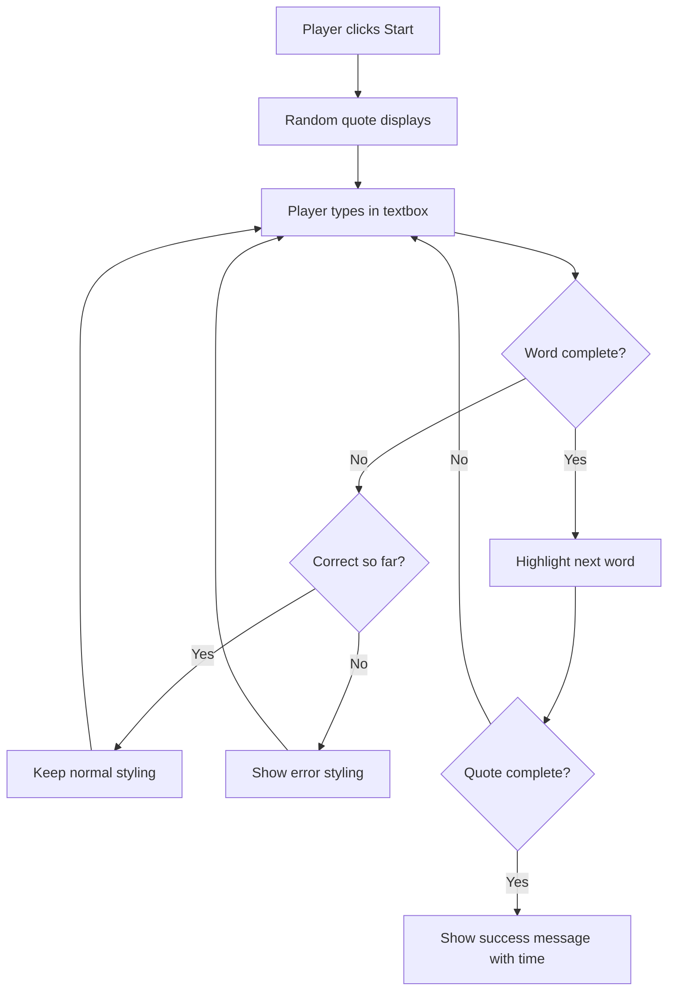
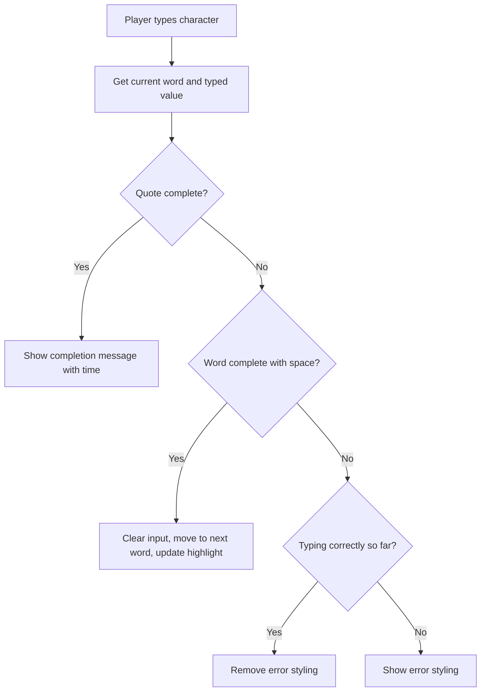

<!--
CO_OP_TRANSLATOR_METADATA:
{
  "original_hash": "e6b75e5b8caae906473a8a09d77b7121",
  "translation_date": "2025-10-24T21:07:56+00:00",
  "source_file": "4-typing-game/typing-game/README.md",
  "language_code": "cs"
}
-->
# Vytvoření hry pomocí událostí

Přemýšleli jste někdy, jak webové stránky poznají, že klikáte na tlačítko nebo píšete do textového pole? To je kouzlo programování řízeného událostmi! A co je lepší způsob, jak se naučit tuto základní dovednost, než vytvořit něco užitečného – hru na rychlost psaní, která reaguje na každý váš stisk klávesy.

Na vlastní oči uvidíte, jak webové prohlížeče „komunikují“ s vaším JavaScriptovým kódem. Pokaždé, když kliknete, píšete nebo pohybujete myší, prohlížeč posílá malé zprávy (říkáme jim události) vašemu kódu, a vy rozhodujete, jak na ně reagovat!

Až skončíme, budete mít vytvořenou skutečnou hru na psaní, která sleduje vaši rychlost a přesnost. Co je však důležitější, pochopíte základní koncepty, které pohánějí každou interaktivní webovou stránku, kterou jste kdy použili. Pojďme na to!

## Kvíz před lekcí

[Kvíz před lekcí](https://ff-quizzes.netlify.app/web/quiz/21)

## Programování řízené událostmi

Přemýšlejte o své oblíbené aplikaci nebo webové stránce – co ji dělá živou a pohotovou? Je to všechno o tom, jak reaguje na to, co děláte! Každé klepnutí, kliknutí, přejetí nebo stisk klávesy vytváří to, čemu říkáme „událost“, a právě tam se odehrává skutečná magie webového vývoje.

Tady je to, co dělá programování pro web tak zajímavým: nikdy nevíme, kdy někdo klikne na to tlačítko nebo začne psát do textového pole. Může kliknout okamžitě, počkat pět minut, nebo možná nikdy neklikne! Tato nepředvídatelnost znamená, že musíme přemýšlet jinak o tom, jak píšeme náš kód.

Místo psaní kódu, který běží odshora dolů jako recept, píšeme kód, který trpělivě čeká, až se něco stane. Je to podobné jako telegrafní operátoři v 19. století, kteří seděli u svých strojů, připraveni reagovat, jakmile přijde zpráva po drátě.

Takže co přesně je „událost“? Jednoduše řečeno, je to něco, co se stane! Když kliknete na tlačítko – to je událost. Když napíšete písmeno – to je událost. Když pohnete myší – to je další událost.

Programování řízené událostmi nám umožňuje nastavit náš kód tak, aby naslouchal a reagoval. Vytváříme speciální funkce nazývané **posluchače událostí**, které trpělivě čekají na konkrétní věci, které se stanou, a pak se aktivují, když k tomu dojde.

Představte si posluchače událostí jako zvonek u dveří pro váš kód. Nastavíte zvonek (`addEventListener()`), řeknete mu, na jaký zvuk má čekat (například 'click' nebo 'keypress'), a pak určíte, co by se mělo stát, když někdo zazvoní (vaše vlastní funkce).

**Jak fungují posluchače událostí:**
- **Naslouchají** konkrétním akcím uživatele, jako jsou kliknutí, stisky kláves nebo pohyby myší
- **Provádějí** váš vlastní kód, když nastane specifikovaná událost
- **Reagují** okamžitě na interakce uživatele, čímž vytvářejí plynulý zážitek
- **Zpracovávají** více událostí na stejném prvku pomocí různých posluchačů

> **NOTE:** Stojí za zmínku, že existuje mnoho způsobů, jak vytvořit posluchače událostí. Můžete použít anonymní funkce nebo vytvořit pojmenované. Můžete použít různé zkratky, jako nastavení vlastnosti `click`, nebo použít `addEventListener()`. V našem cvičení se zaměříme na `addEventListener()` a anonymní funkce, protože je to pravděpodobně nejběžnější technika, kterou weboví vývojáři používají. Je také nejflexibilnější, protože `addEventListener()` funguje pro všechny události a název události může být poskytnut jako parametr.

### Běžné události

Zatímco webové prohlížeče nabízejí desítky různých událostí, které můžete poslouchat, většina interaktivních aplikací se spoléhá jen na několik základních událostí. Porozumění těmto klíčovým událostem vám poskytne základ pro vytváření sofistikovaných uživatelských interakcí.

Existuje [desítky událostí](https://developer.mozilla.org/docs/Web/Events), které můžete poslouchat při vytváření aplikace. Prakticky vše, co uživatel na stránce udělá, vyvolá událost, což vám dává velkou moc zajistit, že dostane požadovaný zážitek. Naštěstí obvykle budete potřebovat jen malou hrstku událostí. Tady je několik běžných (včetně dvou, které použijeme při vytváření naší hry):

| Událost | Popis | Běžné použití |
|---------|-------|---------------|
| `click` | Uživatel na něco kliknul | Tlačítka, odkazy, interaktivní prvky |
| `contextmenu` | Uživatel kliknul pravým tlačítkem myši | Vlastní nabídky po kliknutí pravým tlačítkem |
| `select` | Uživatel označil nějaký text | Úprava textu, operace kopírování |
| `input` | Uživatel zadal nějaký text | Validace formulářů, vyhledávání v reálném čase |

**Porozumění těmto typům událostí:**
- **Spouští** se, když uživatelé interagují s konkrétními prvky na vaší stránce
- **Poskytují** podrobné informace o akci uživatele prostřednictvím objektů událostí
- **Umožňují** vám vytvářet pohotové, interaktivní webové aplikace
- **Fungují** konzistentně napříč různými prohlížeči a zařízeními

## Vytvoření hry

Teď, když rozumíte tomu, jak události fungují, pojďme tyto znalosti využít v praxi a vytvořit něco užitečného. Vytvoříme hru na rychlost psaní, která demonstruje zpracování událostí a zároveň vám pomůže rozvíjet důležitou dovednost vývojáře.

Vytvoříme hru, abychom prozkoumali, jak události fungují v JavaScriptu. Naše hra otestuje schopnost hráče psát, což je jedna z nejvíce podceňovaných dovedností, kterou by měl mít každý vývojář. Zajímavost: rozložení klávesnice QWERTY, které dnes používáme, bylo ve skutečnosti navrženo v 70. letech 19. století pro psací stroje – a dobré dovednosti v psaní jsou stále stejně cenné pro programátory i dnes! Obecný průběh hry bude vypadat takto:



**Jak bude naše hra fungovat:**
- **Začne**, když hráč klikne na tlačítko start a zobrazí náhodný citát
- **Sleduje** pokrok hráče při psaní slovo po slovu v reálném čase
- **Zvýrazní** aktuální slovo, aby vedlo pozornost hráče
- **Poskytne** okamžitou vizuální zpětnou vazbu při chybách v psaní
- **Vypočítá** a zobrazí celkový čas po dokončení citátu

Pojďme vytvořit naši hru a naučit se o událostech!

### Struktura souborů

Než začneme kódovat, pojďme se zorganizovat! Mít čistou strukturu souborů od začátku vám ušetří pozdější problémy a učiní váš projekt profesionálnějším. 😊

Budeme to držet jednoduché s pouhými třemi soubory: `index.html` pro strukturu naší stránky, `script.js` pro veškerou logiku hry a `style.css`, aby vše vypadalo skvěle. To je klasická trojice, která pohání většinu webu!

**Vytvořte novou složku pro svou práci otevřením konzole nebo terminálového okna a zadáním následujícího příkazu:**

```bash
# Linux or macOS
mkdir typing-game && cd typing-game

# Windows
md typing-game && cd typing-game
```

**Co tyto příkazy dělají:**
- **Vytvoří** nový adresář nazvaný `typing-game` pro vaše projektové soubory
- **Přejde** automaticky do nově vytvořeného adresáře
- **Nastaví** čisté pracovní prostředí pro vývoj vaší hry

**Otevřete Visual Studio Code:**

```bash
code .
```

**Tento příkaz:**
- **Spustí** Visual Studio Code v aktuálním adresáři
- **Otevře** vaši projektovou složku v editoru
- **Poskytne** přístup ke všem nástrojům pro vývoj, které budete potřebovat

**Přidejte do složky ve Visual Studio Code tři soubory s následujícími názvy:**
- `index.html` – Obsahuje strukturu a obsah vaší hry
- `script.js` – Zpracovává veškerou logiku hry a posluchače událostí
- `style.css` – Definuje vizuální vzhled a stylizaci

## Vytvoření uživatelského rozhraní

Teď vytvoříme scénu, kde se bude odehrávat veškerá akce naší hry! Představte si to jako navrhování ovládacího panelu pro vesmírnou loď – musíme zajistit, aby vše, co naši hráči potřebují, bylo přesně tam, kde to očekávají.

Pojďme zjistit, co naše hra skutečně potřebuje. Kdybyste hráli hru na psaní, co byste chtěli vidět na obrazovce? Tady je to, co budeme potřebovat:

| Prvek UI | Účel | HTML prvek |
|----------|------|-----------|
| Zobrazení citátu | Zobrazuje text k napsání | `<p>` s `id="quote"` |
| Oblast zpráv | Zobrazuje stavové a úspěšné zprávy | `<p>` s `id="message"` |
| Textové pole | Místo, kde hráči píší citát | `<input>` s `id="typed-value"` |
| Tlačítko Start | Spustí hru | `<button>` s `id="start"` |

**Porozumění struktuře UI:**
- **Organizuje** obsah logicky odshora dolů
- **Přiřazuje** unikátní ID prvkům pro cílení v JavaScriptu
- **Poskytuje** jasnou vizuální hierarchii pro lepší uživatelský zážitek
- **Zahrnuje** sémantické HTML prvky pro přístupnost

Každý z těchto prvků bude potřebovat ID, abychom s nimi mohli pracovat v našem JavaScriptu. Také přidáme odkazy na soubory CSS a JavaScript, které vytvoříme.

Vytvořte nový soubor s názvem `index.html`. Přidejte následující HTML:

```html
<!-- inside index.html -->
<html>
<head>
  <title>Typing game</title>
  <link rel="stylesheet" href="style.css">
</head>
<body>
  <h1>Typing game!</h1>
  <p>Practice your typing skills with a quote from Sherlock Holmes. Click **start** to begin!</p>
  <p id="quote"></p> <!-- This will display our quote -->
  <p id="message"></p> <!-- This will display any status messages -->
  <div>
    <input type="text" aria-label="current word" id="typed-value" /> <!-- The textbox for typing -->
    <button type="button" id="start">Start</button> <!-- To start the game -->
  </div>
  <script src="script.js"></script>
</body>
</html>
```

**Rozbor toho, co tato struktura HTML zajišťuje:**
- **Propojuje** CSS stylopis v `<head>` pro stylizaci
- **Vytváří** jasný nadpis a instrukce pro uživatele
- **Zavádí** zástupné odstavce s konkrétními ID pro dynamický obsah
- **Zahrnuje** textové pole s atributy pro přístupnost
- **Poskytuje** tlačítko start pro spuštění hry
- **Načítá** soubor JavaScript na konci pro optimální výkon

### Spuštění aplikace

Časté testování vaší aplikace během vývoje vám pomůže zachytit problémy včas a vidět váš pokrok v reálném čase. Live Server je neocenitelný nástroj, který automaticky aktualizuje váš prohlížeč pokaždé, když uložíte změny, což činí vývoj mnohem efektivnějším.

Vždy je nejlepší vyvíjet iterativně, abyste viděli, jak věci vypadají. Pojďme spustit naši aplikaci. Existuje skvělý doplněk pro Visual Studio Code nazvaný [Live Server](https://marketplace.visualstudio.com/items?itemName=ritwickdey.LiveServer&WT.mc_id=academic-77807-sagibbon), který bude hostovat vaši aplikaci lokálně a aktualizovat prohlížeč pokaždé, když uložíte.

**Nainstalujte [Live Server](https://marketplace.visualstudio.com/items?itemName=ritwickdey.LiveServer&WT.mc_id=academic-77807-sagibbon) podle odkazu a klikněte na Instalovat:**

**Co se děje během instalace:**
- **Vyvolá** váš prohlížeč, aby otevřel Visual Studio Code
- **Provede** vás procesem instalace doplňku
- **Může vyžadovat** restartování Visual Studio Code k dokončení nastavení

**Jakmile je nainstalován, ve Visual Studio Code klikněte na Ctrl-Shift-P (nebo Cmd-Shift-P) pro otevření palety příkazů:**

**Porozumění paletě příkazů:**
- **Poskytuje** rychlý přístup ke všem příkazům VS Code
- **Vyhledává** příkazy při psaní
- **Nabízí** klávesové zkratky pro rychlejší vývoj

**Zadejte "Live Server: Open with Live Server":**

**Co Live Server dělá:**
- **Spustí** lokální vývojový server pro váš projekt
- **Automaticky** aktualizuje prohlížeč při ukládání souborů
- **Servíruje** vaše soubory z lokální URL (obvykle `localhost:5500`)

**Otevřete prohlížeč a přejděte na `https://localhost:5500`:**

Nyní byste měli vidět stránku, kterou jste vytvořili! Pojďme přidat nějakou funkčnost.

## Přidání CSS

Teď to uděláme hezké! Vizuální zpětná vazba byla klíčová pro uživatelská rozhraní od počátků výpočetní techniky. V 80. letech výzkumníci zjistili, že okamžitá vizuální zpětná vazba dramaticky zlepšuje výkon uživatelů a snižuje chyby. Přesně to vytvoříme.

Naše hra musí být naprosto jasná ohledně toho, co se děje. Hráči by měli okamžitě vědět, které slovo mají napsat, a pokud udělají chybu, měli by to vidět hned. Vytvoříme jednoduché, ale efektivní stylování:

Vytvořte nový soubor s názvem `style.css` a přidejte následující syntax.

```css
/* inside style.css */
.highlight {
  background-color: yellow;
}

.error {
  background-color: lightcoral;
  border: red;
}
```

**Porozumění těmto CSS třídám:**
- **Zvýrazní** aktuální slovo žlutým pozadím pro jasné vizuální vedení
- **Signalizuje** chyby v psaní světle korálovou barvou pozadí
- **Poskytuje** okamžitou zpětnou vazbu bez narušení toku psaní uživatele
- **Používá** kontrastní barvy pro přístupnost a jasnou vizuální komunikaci

✅ Pokud jde o CSS, můžete rozvrhnout svou stránku, jak se vám líbí. Věnujte trochu času a udělejte stránku atraktivnější:

- Vyberte jiný font
- Obarvěte nadpisy
- Změňte velikost prvků

## JavaScript

Tady to začne být zajímavé! 🎉 Máme strukturu HTML a stylování CSS, ale právě teď je naše hra jako krásné auto bez motoru. JavaScript bude tím motorem – je to to, co vše skutečně rozběhne a umožní reagovat na to, co hráči dělají.

Tady uvidíte, jak vaše dílo ožívá. Budeme postupovat krok za krokem, aby nic nebylo příliš složité:

| Krok | Účel | Co se naučíte |
|------|------|--------------|
| [Vytvoření konstant](../../../../4-typing-game/typing-game) | Nastavení citátů a odkazů na DOM | Správa proměnných a výběr z
| Pole citátů | Uložte všechny možné citáty pro hru | `['Citát 1', 'Citát 2', ...]` |
| Pole slov | Rozdělte aktuální citát na jednotlivá slova | `['Když', 'máte', '...', ...]` |
| Index slova | Sledujte, které slovo hráč právě píše | `0, 1, 2, 3...` |
| Čas začátku | Vypočítejte uplynulý čas pro skórování | `Date.now()` |

**Budeme také potřebovat odkazy na naše prvky uživatelského rozhraní:**
| Prvek | ID | Účel |
|-------|----|------|
| Textové pole | `typed-value` | Místo, kde hráči píší |
| Zobrazení citátu | `quote` | Zobrazuje citát k napsání |
| Oblast zpráv | `message` | Zobrazuje stavové zprávy |

```javascript
// inside script.js
// all of our quotes
const quotes = [
    'When you have eliminated the impossible, whatever remains, however improbable, must be the truth.',
    'There is nothing more deceptive than an obvious fact.',
    'I ought to know by this time that when a fact appears to be opposed to a long train of deductions it invariably proves to be capable of bearing some other interpretation.',
    'I never make exceptions. An exception disproves the rule.',
    'What one man can invent another can discover.',
    'Nothing clears up a case so much as stating it to another person.',
    'Education never ends, Watson. It is a series of lessons, with the greatest for the last.',
];
// store the list of words and the index of the word the player is currently typing
let words = [];
let wordIndex = 0;
// the starting time
let startTime = Date.now();
// page elements
const quoteElement = document.getElementById('quote');
const messageElement = document.getElementById('message');
const typedValueElement = document.getElementById('typed-value');
```

**Rozbor toho, co tento kód nastavení provádí:**
- **Ukládá** pole citátů Sherlocka Holmese pomocí `const`, protože citáty se nebudou měnit
- **Inicializuje** sledovací proměnné pomocí `let`, protože tyto hodnoty se budou během hry měnit
- **Zachycuje** odkazy na prvky DOM pomocí `document.getElementById()` pro efektivní přístup
- **Vytváří** základ pro veškerou herní funkcionalitu s jasnými a popisnými názvy proměnných
- **Organizuje** související data a prvky logicky pro snazší údržbu kódu

✅ Přidejte do své hry další citáty

> 💡 **Tip**: Prvky můžeme kdykoli v kódu získat pomocí `document.getElementById()`. Protože tyto prvky budeme často odkazovat, vyhneme se překlepům v textových řetězcích tím, že použijeme konstanty. Frameworky jako [Vue.js](https://vuejs.org/) nebo [React](https://reactjs.org/) vám mohou pomoci lépe spravovat centralizaci vašeho kódu.
>
**Proč tento přístup funguje tak dobře:**
- **Zabraňuje** překlepům při opakovaném odkazování na prvky
- **Zlepšuje** čitelnost kódu díky popisným názvům konstant
- **Umožňuje** lepší podporu IDE s automatickým doplňováním a kontrolou chyb
- **Usnadňuje** refaktoring, pokud se ID prvků později změní

Podívejte se na video o používání `const`, `let` a `var`

[](https://youtube.com/watch?v=JNIXfGiDWM8 "Typy proměnných")

> 🎥 Klikněte na obrázek výše pro video o proměnných.

### Přidání logiky spuštění

Tady se vše spojí dohromady! 🚀 Chystáte se napsat svůj první skutečný posluchač událostí, a je něco velmi uspokojivého na tom, když váš kód reaguje na kliknutí na tlačítko.

Přemýšlejte o tom: někde tam venku hráč klikne na tlačítko "Start" a váš kód musí být připraven. Nemáme tušení, kdy na něj klikne - může to být okamžitě, nebo až si dá kávu - ale až to udělá, vaše hra ožije.

Když uživatel klikne na `start`, musíme vybrat citát, nastavit uživatelské rozhraní a připravit sledování aktuálního slova a času. Níže je JavaScript, který budete muset přidat; pod skriptem si ho rozebereme.

```javascript
// at the end of script.js
document.getElementById('start').addEventListener('click', () => {
  // get a quote
  const quoteIndex = Math.floor(Math.random() * quotes.length);
  const quote = quotes[quoteIndex];
  // Put the quote into an array of words
  words = quote.split(' ');
  // reset the word index for tracking
  wordIndex = 0;

  // UI updates
  // Create an array of span elements so we can set a class
  const spanWords = words.map(function(word) { return `<span>${word} </span>`});
  // Convert into string and set as innerHTML on quote display
  quoteElement.innerHTML = spanWords.join('');
  // Highlight the first word
  quoteElement.childNodes[0].className = 'highlight';
  // Clear any prior messages
  messageElement.innerText = '';

  // Setup the textbox
  // Clear the textbox
  typedValueElement.value = '';
  // set focus
  typedValueElement.focus();
  // set the event handler

  // Start the timer
  startTime = new Date().getTime();
});
```

**Rozbor kódu na logické části:**

**📊 Nastavení sledování slov:**
- **Vybere** náhodný citát pomocí `Math.floor()` a `Math.random()` pro rozmanitost
- **Převede** citát na pole jednotlivých slov pomocí `split(' ')`
- **Resetuje** `wordIndex` na 0, protože hráči začínají prvním slovem
- **Připraví** stav hry na nový začátek

**🎨 Nastavení a zobrazení UI:**
- **Vytvoří** pole prvků `<span>`, obalí každé slovo pro individuální stylování
- **Spojí** prvky span do jednoho řetězce pro efektivní aktualizaci DOM
- **Zvýrazní** první slovo přidáním CSS třídy `highlight`
- **Vyčistí** předchozí herní zprávy pro čistý začátek

**⌨️ Příprava textového pole:**
- **Vyčistí** jakýkoli existující text v poli
- **Nastaví fokus** na textové pole, aby hráči mohli okamžitě začít psát
- **Připraví** vstupní oblast pro novou herní relaci

**⏱️ Inicializace časovače:**
- **Zachytí** aktuální časovou značku pomocí `new Date().getTime()`
- **Umožní** přesný výpočet rychlosti psaní a času dokončení
- **Spustí** sledování výkonu pro herní relaci

### Přidání logiky psaní

Tady se pustíme do srdce naší hry! Nebojte se, pokud se to na první pohled zdá složité - projdeme si každý kousek a na konci uvidíte, jak je to logické.

To, co zde budujeme, je docela sofistikované: pokaždé, když někdo napíše písmeno, náš kód zkontroluje, co napsal, poskytne zpětnou vazbu a rozhodne, co by mělo následovat. Je to podobné tomu, jak první textové procesory jako WordStar v 70. letech poskytovaly typistům zpětnou vazbu v reálném čase.

```javascript
// at the end of script.js
typedValueElement.addEventListener('input', () => {
  // Get the current word
  const currentWord = words[wordIndex];
  // get the current value
  const typedValue = typedValueElement.value;

  if (typedValue === currentWord && wordIndex === words.length - 1) {
    // end of sentence
    // Display success
    const elapsedTime = new Date().getTime() - startTime;
    const message = `CONGRATULATIONS! You finished in ${elapsedTime / 1000} seconds.`;
    messageElement.innerText = message;
  } else if (typedValue.endsWith(' ') && typedValue.trim() === currentWord) {
    // end of word
    // clear the typedValueElement for the new word
    typedValueElement.value = '';
    // move to the next word
    wordIndex++;
    // reset the class name for all elements in quote
    for (const wordElement of quoteElement.childNodes) {
      wordElement.className = '';
    }
    // highlight the new word
    quoteElement.childNodes[wordIndex].className = 'highlight';
  } else if (currentWord.startsWith(typedValue)) {
    // currently correct
    // highlight the next word
    typedValueElement.className = '';
  } else {
    // error state
    typedValueElement.className = 'error';
  }
});
```

**Porozumění toku logiky psaní:**

Tato funkce používá přístup "vodopádu", kontroluje podmínky od nejkonkrétnějších po nejobecnější. Rozeberme si každý scénář:



**🏁 Dokončení citátu (Scénář 1):**
- **Kontroluje**, zda zadaná hodnota odpovídá aktuálnímu slovu A zda jsme na posledním slově
- **Vypočítá** uplynulý čas odečtením času začátku od aktuálního času
- **Převede** milisekundy na sekundy dělením 1 000
- **Zobrazí** gratulační zprávu s časem dokončení

**✅ Dokončení slova (Scénář 2):**
- **Detekuje** dokončení slova, když vstup končí mezerou
- **Ověřuje**, že oříznutý vstup přesně odpovídá aktuálnímu slovu
- **Vyčistí** vstupní pole pro další slovo
- **Posune** na další slovo zvýšením `wordIndex`
- **Aktualizuje** vizuální zvýraznění odstraněním všech tříd a zvýrazněním nového slova

**📝 Probíhající psaní (Scénář 3):**
- **Ověřuje**, že aktuální slovo začíná tím, co bylo dosud napsáno
- **Odstraní** jakékoli chybové stylování, aby ukázalo, že vstup je správný
- **Umožňuje** pokračovat v psaní bez přerušení

**❌ Chybový stav (Scénář 4):**
- **Spustí**, když zadaný text neodpovídá očekávanému začátku slova
- **Aplikuje** CSS třídu chyby pro okamžitou vizuální zpětnou vazbu
- **Pomáhá** hráčům rychle identifikovat a opravit chyby

## Otestujte svou aplikaci

Podívejte se, co jste dokázali! 🎉 Právě jste vytvořili skutečnou funkční hru na psaní od nuly pomocí programování řízeného událostmi. Udělejte si chvíli na to, abyste si to uvědomili - není to žádný malý úspěch!

Teď přichází fáze testování! Bude to fungovat podle očekávání? Něco jsme přehlédli? Tady je věc: pokud něco nefunguje dokonale hned, je to úplně normální. I zkušení vývojáři pravidelně nacházejí chyby ve svém kódu. Je to součást vývojového procesu!

Klikněte na `start` a začněte psát! Mělo by to vypadat trochu jako animace, kterou jsme viděli předtím.


**Co otestovat ve vaší aplikaci:**
- **Ověřte**, že kliknutí na Start zobrazí náhodný citát
- **Potvrďte**, že psaní správně zvýrazní aktuální slovo
- **Zkontrolujte**, že se při nesprávném psaní objeví chybové stylování
- **Ujistěte se**, že dokončení slov správně posune zvýraznění
- **Otestujte**, že dokončení citátu zobrazí zprávu o dokončení s časem

**Běžné tipy pro ladění:**
- **Zkontrolujte** konzoli prohlížeče (F12) pro chyby JavaScriptu
- **Ověřte**, že všechny názvy souborů přesně odpovídají (rozlišování velkých a malých písmen)
- **Ujistěte se**, že Live Server běží a správně se aktualizuje
- **Otestujte** různé citáty, abyste ověřili, že náhodný výběr funguje

---

## Výzva GitHub Copilot Agent 🎮

Použijte režim Agent k dokončení následující výzvy:

**Popis:** Rozšiřte hru na psaní implementací systému obtížnosti, který se přizpůsobí výkonu hráče. Tato výzva vám pomůže procvičit pokročilé zpracování událostí, analýzu dat a dynamické aktualizace UI.

**Zadání:** Vytvořte systém úpravy obtížnosti pro hru na psaní, který:
1. Sleduje rychlost psaní hráče (slova za minutu) a procento přesnosti
2. Automaticky se přizpůsobuje třem úrovním obtížnosti: Snadná (jednoduché citáty), Střední (aktuální citáty), Těžká (složité citáty s interpunkcí)
3. Zobrazuje aktuální úroveň obtížnosti a statistiky hráče na UI
4. Implementuje počítadlo úspěchů, které zvyšuje obtížnost po 3 po sobě jdoucích dobrých výkonech
5. Přidává vizuální zpětnou vazbu (barvy, animace) k indikaci změn obtížnosti

Přidejte potřebné HTML prvky, CSS styly a funkce JavaScriptu k implementaci této funkce. Zajistěte správné zpracování chyb a ujistěte se, že hra zůstane přístupná s vhodnými ARIA štítky.

Více o [režimu agent](https://code.visualstudio.com/blogs/2025/02/24/introducing-copilot-agent-mode) se dozvíte zde.

## 🚀 Výzva

Připraveni posunout svou hru na psaní na další úroveň? Zkuste implementovat tyto pokročilé funkce, abyste si prohloubili znalosti o zpracování událostí a manipulaci s DOM:

**Přidejte více funkcí:**

| Funkce | Popis | Dovednosti, které procvičíte |
|--------|-------|-----------------------------|
| **Ovládání vstupu** | Deaktivujte posluchač události `input` po dokončení a znovu ho aktivujte po kliknutí na tlačítko | Správa událostí a řízení stavu |
| **Správa stavu UI** | Deaktivujte textové pole, když hráč dokončí citát | Manipulace s vlastnostmi DOM |
| **Modální dialog** | Zobrazte modální dialogové okno se zprávou o úspěchu | Pokročilé vzory UI a přístupnost |
| **Systém nejlepších skóre** | Uložte nejlepší skóre pomocí `localStorage` | API pro ukládání v prohlížeči a trvalé ukládání dat |

**Tipy pro implementaci:**
- **Prozkoumejte** `localStorage.setItem()` a `localStorage.getItem()` pro trvalé ukládání
- **Procvičte si** dynamické přidávání a odstraňování posluchačů událostí
- **Prozkoumejte** HTML dialogové prvky nebo CSS vzory modálních oken
- **Zvažte** přístupnost při deaktivaci a aktivaci ovládacích prvků formuláře

## Kvíz po přednášce

[Kvíz po přednášce](https://ff-quizzes.netlify.app/web/quiz/22)

## Recenze & Samostudium

Přečtěte si o [všech událostech dostupných](https://developer.mozilla.org/docs/Web/Events) vývojáři prostřednictvím webového prohlížeče a zvažte scénáře, ve kterých byste každou z nich použili.

## Zadání

[Vytvořte novou hru na klávesnici](assignment.md)

---

**Prohlášení**:  
Tento dokument byl přeložen pomocí služby AI pro překlady [Co-op Translator](https://github.com/Azure/co-op-translator). Ačkoli se snažíme o přesnost, mějte prosím na paměti, že automatizované překlady mohou obsahovat chyby nebo nepřesnosti. Původní dokument v jeho původním jazyce by měl být považován za autoritativní zdroj. Pro důležité informace se doporučuje profesionální lidský překlad. Neodpovídáme za žádná nedorozumění nebo nesprávné interpretace vyplývající z použití tohoto překladu.