# Browser Extension Project Part 1: Vše o prohlížečích

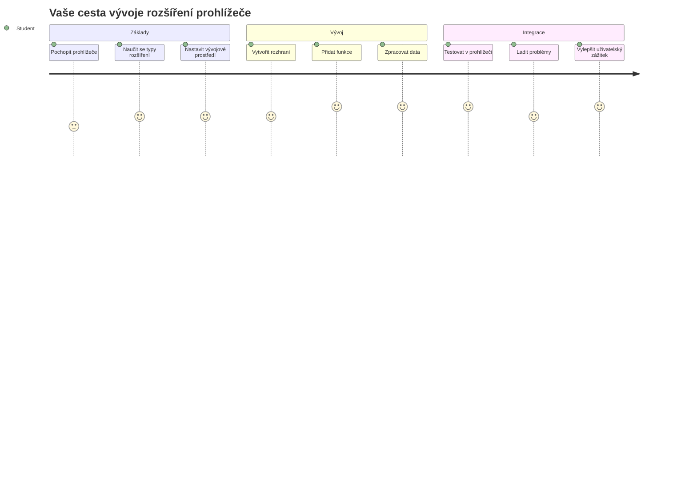
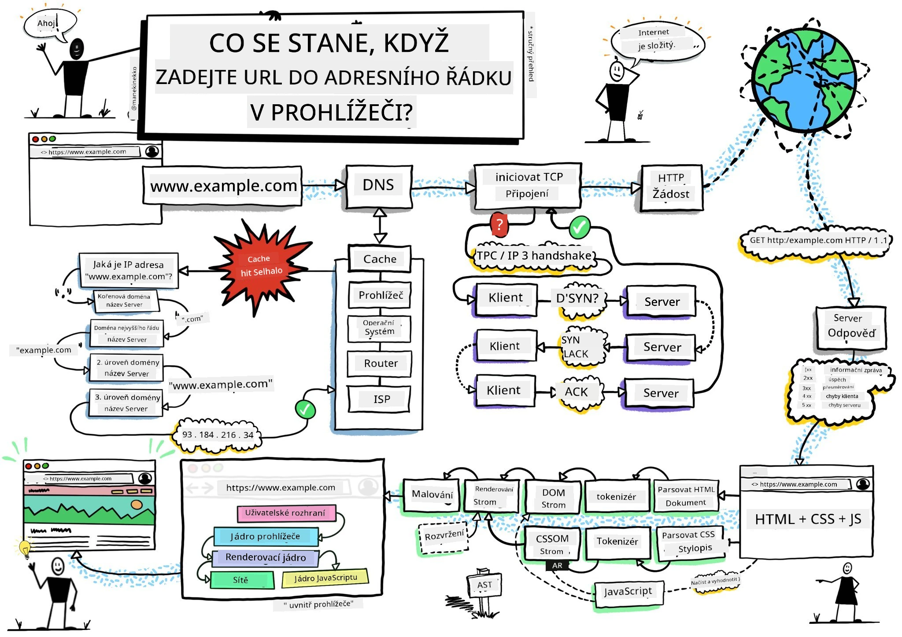
> Sketchnote od [Wassim Chegham](https://dev.to/wassimchegham/ever-wondered-what-happens-when-you-type-in-a-url-in-an-address-bar-in-a-browser-3dob)

## Přednáškový kvíz

[Přednáškový kvíz](https://ff-quizzes.netlify.app/web/quiz/23)

### Úvod

Prohlížečové rozšíření jsou miniaplikace, které vylepšují váš zážitek z prohlížení webu. Podobně jako původní vize Tima Berners-Lee pro interaktivní web, rozšíření rozšiřují schopnosti prohlížeče mimo pouhé zobrazování dokumentů. Od správců hesel, kteří udržují vaše účty v bezpečí, až po výběr barev, který pomáhá designérům získat dokonalé odstíny, rozšíření řeší každodenní výzvy při prohlížení.

Než začneme stavět vaše první rozšíření, pojďme pochopit, jak prohlížeče fungují. Stejně jako Alexander Graham Bell potřeboval porozumět přenosu zvuku, než vynalezl telefon, znalost základů prohlížečů vám pomůže vytvářet rozšíření, která se hladce integrují do existujících systémů prohlížeče.

Na konci této lekce porozumíte architektuře prohlížeče a začnete stavět své první rozšíření.

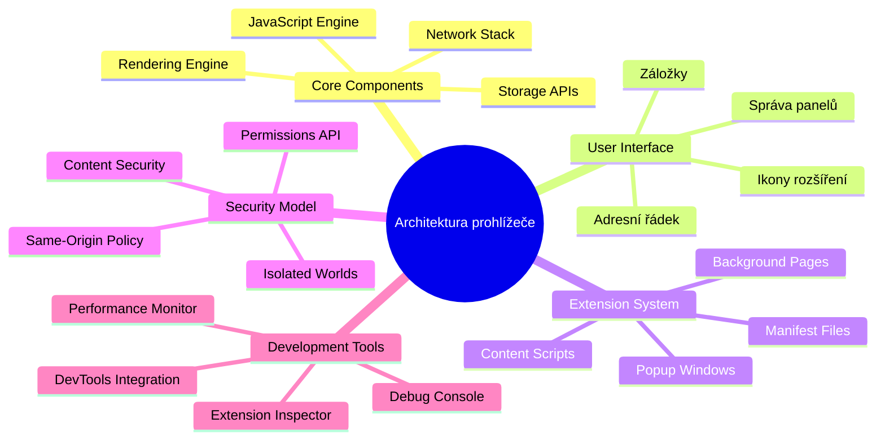
## Porozumění webovým prohlížečům

Webový prohlížeč je v podstatě sofistikovaný interpret dokumentů. Když zadáte „google.com“ do adresního řádku, prohlížeč provede složitou řadu operací – požádá o obsah ze serverů po celém světě, poté tento kód zanalyzuje a vykreslí do interaktivních webových stránek, které vidíte.

Tento proces odráží, jak byl první webový prohlížeč, WorldWideWeb, navržen Timem Berners-Leem v roce 1990, aby zpřístupnil hypertextové dokumenty všem.

✅ **Trocha historie**: První prohlížeč se jmenoval 'WorldWideWeb' a vytvořil ho Sir Timothy Berners-Lee v roce 1990.

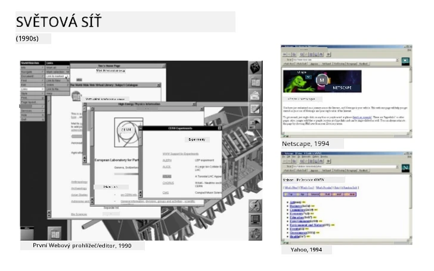
> Některé rané prohlížeče, podle [Karen McGrane](https://www.slideshare.net/KMcGrane/week-4-ixd-history-personal-computing)

### Jak prohlížeče zpracovávají webový obsah

Proces mezi zadáním URL a zobrazením webové stránky zahrnuje několik koordinovaných kroků, které probíhají během sekund:

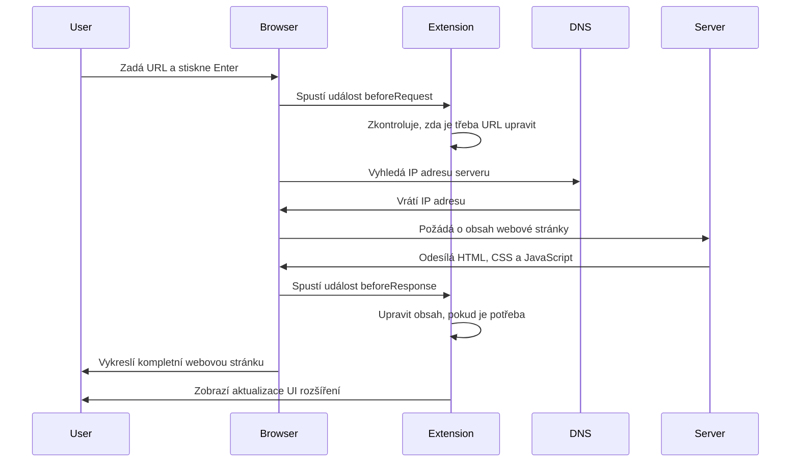
**Tento proces provádí:**
- **Překládá** lidsky čitelnou URL na IP adresu serveru pomocí DNS dotazu
- **Navazuje** zabezpečené spojení s webovým serverem pomocí protokolů HTTP nebo HTTPS
- **Požaduje** specifický obsah webové stránky ze serveru
- **Přijímá** HTML značky, CSS styly a JavaScriptový kód ze serveru
- **Vykresluje** veškerý obsah do interaktivní webové stránky, kterou vidíte

### Hlavní funkce prohlížeče

Moderní prohlížeče poskytují řadu funkcí, které mohou vývojáři rozšíření využít:

| Funkce | Účel | Příležitosti pro rozšíření |
|---------|---------|------------------------|
| **Rendering Engine** | Zobrazuje HTML, CSS a JavaScript | Úpravy obsahu, injektování stylů |
| **JavaScript Engine** | Spouští JavaScriptový kód | Vlastní skripty, API interakce |
| **Lokální úložiště** | Ukládá data lokálně | Uživatelská nastavení, cache |
| **Síťová vrstva** | Řídí webové požadavky | Monitorování požadavků, analýza dat |
| **Bezpečnostní model** | Chrání uživatele před škodlivým obsahem | Filtrování obsahu, bezpečnostní vylepšení |

**Porozumění těmto funkcím vám pomůže:**
- **Identifikovat** kde může vaše rozšíření přinést největší užitek
- **Vybrat** správné API prohlížeče pro funkčnost vašeho rozšíření
- **Navrhnout** rozšíření, která efektivně spolupracují se systémem prohlížeče
- **Zajistit**, že vaše rozšíření dodržuje nejlepší bezpečnostní praktiky

### Úvahy o vývoji napříč prohlížeči

Různé prohlížeče implementují standardy s drobnými odchylkami, podobně jako různé programovací jazyky mohou odlišně zpracovávat stejný algoritmus. Chrome, Firefox a Safari mají jedinečné charakteristiky, které musí vývojáři brát v úvahu během vývoje rozšíření.

> 💡 **Užitečný tip**: Použijte [caniuse.com](https://www.caniuse.com) k ověření, které webové technologie jsou podporovány v různých prohlížečích. To je neocenitelné při plánování funkcí vašeho rozšíření!

**Klíčové úvahy pro vývoj rozšíření:**
- **Testujte** své rozšíření v prohlížečích Chrome, Firefox a Edge
- **Přizpůsobte** se rozdílům v API rozšíření a formátech manifestu
- **Zvládejte** různou výkonnost a omezení
- **Poskytněte** náhradní řešení pro specifické funkce prohlížeče, které nemusí být dostupné

✅ **Insight z analýzy**: Můžete zjistit, které prohlížeče vaši uživatelé preferují, instalací analytických balíčků ve svých webových projektech. Tato data vám pomohou určit, které prohlížeče podporovat prioritně.

## Porozumění prohlížečovým rozšířením

Rozšíření prohlížeče řeší běžné problémy při prohlížení webu přidáním funkcí přímo do rozhraní prohlížeče. Místo potřeby samostatných aplikací nebo složitých pracovních postupů poskytují rozšíření okamžitý přístup k nástrojům a funkcím.

Tento koncept odráží, jak raní průkopníci počítačů jako Douglas Engelbart představovali rozšíření lidských schopností technologií – rozšíření zdokonalují základní funkčnost vašeho prohlížeče.

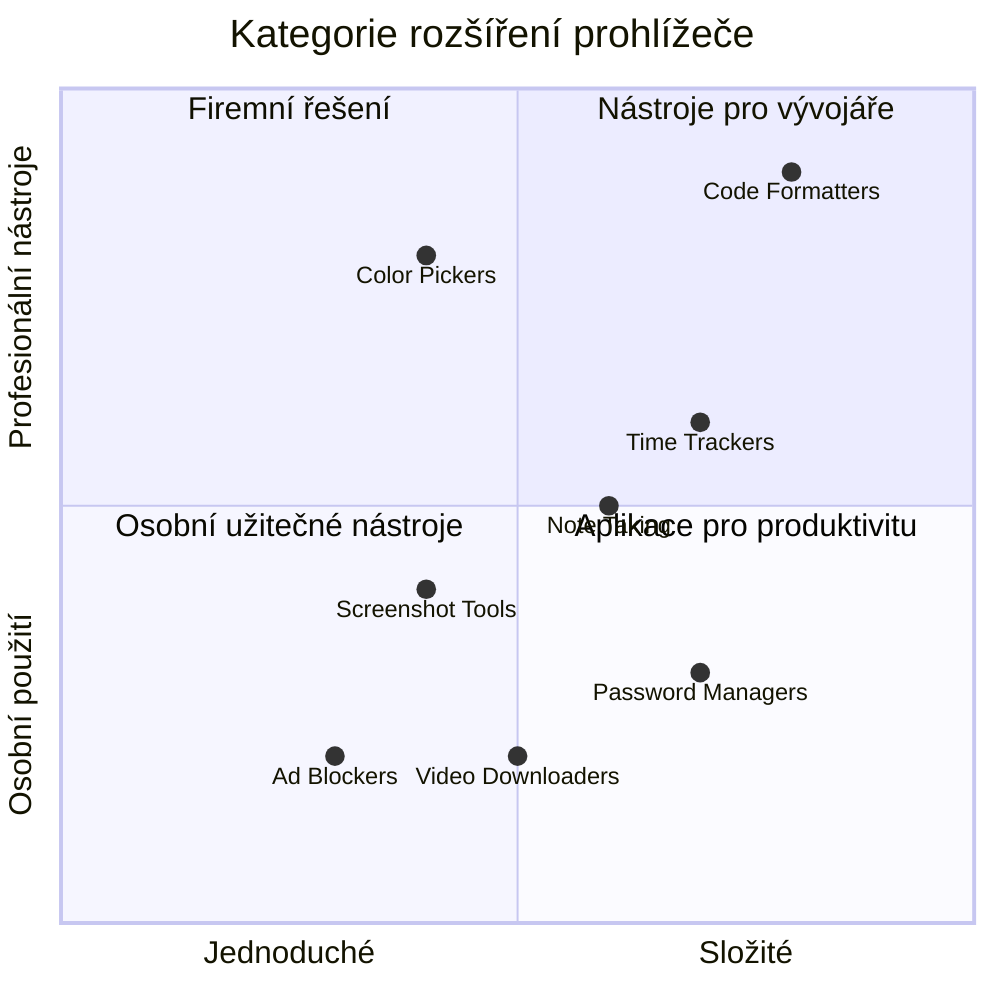
**Populární kategorie rozšíření a jejich přínosy:**
- **Nástroje produktivity**: Správci úkolů, aplikace pro poznámky a časovače, které pomáhají udržet pořádek
- **Bezpečnostní vylepšení**: Správci hesel, blokátory reklam a nástroje na ochranu soukromí, které chrání vaše data
- **Nástroje pro vývojáře**: Formátovače kódu, výběry barev a ladicí pomůcky, které zjednodušují vývoj
- **Vylepšení obsahu**: Režimy čtení, stahovače videí a nástroje pro snímky obrazovky, které zlepšují váš zážitek z webu

✅ **Reflexní otázka**: Jaká jsou vaše oblíbená rozšíření? Jaké konkrétní úkoly vykonávají a jak zlepšují váš zážitek z prohlížení?

### 🔄 **Pedagogická kontrola**
**Porozumění architektuře prohlížeče**: Než přistoupíte k vývoji rozšíření, ujistěte se, že umíte:
- ✅ Vysvětlit, jak prohlížeče zpracovávají webové požadavky a vykreslují obsah
- ✅ Identifikovat hlavní komponenty architektury prohlížeče
- ✅ Rozumět, jak se rozšíření integrují s funkcionalitou prohlížeče
- ✅ Rozpoznat bezpečnostní model, který uživatele chrání

**Rychlý autotest**: Dokážete sledovat cestu od zadání URL až po zobrazení webové stránky?
1. **DNS dotaz** převádí URL na IP adresu
2. **HTTP požadavek** získává obsah ze serveru
3. **Zpracování** analyzuje HTML, CSS a JavaScript
4. **Vykreslení** zobrazuje finální webovou stránku
5. **Rozšíření** mohou obsah upravit na několika krocích

## Instalace a správa rozšíření

Porozumění procesu instalace rozšíření vám pomůže předvídat uživatelský zážitek při instalaci vašeho rozšíření. Proces instalace je standardizovaný v moderních prohlížečích s drobnými rozdíly v designu rozhraní.

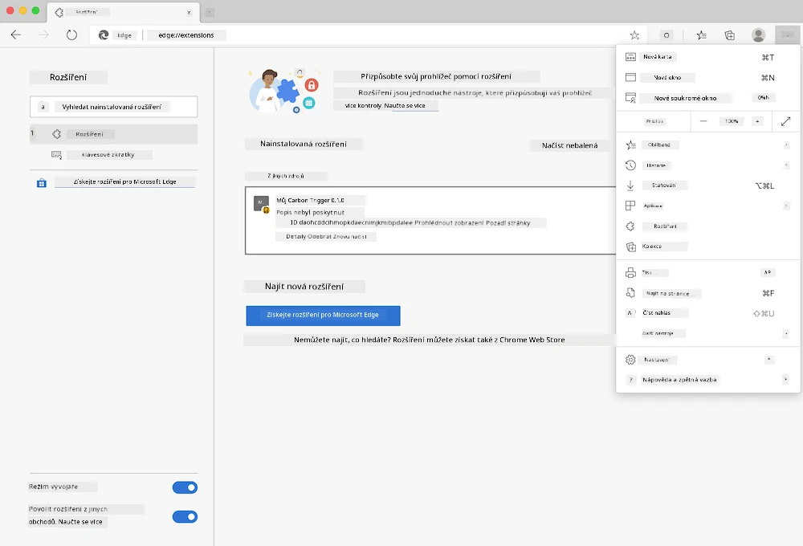

> **Důležité**: Při testování vlastních rozšíření nezapomeňte zapnout režim vývojáře a povolit rozšíření z jiných obchodů.

### Vývojový proces instalace rozšíření

Když vyvíjíte a testujete vlastní rozšíření, postupujte podle tohoto pracovního toku:

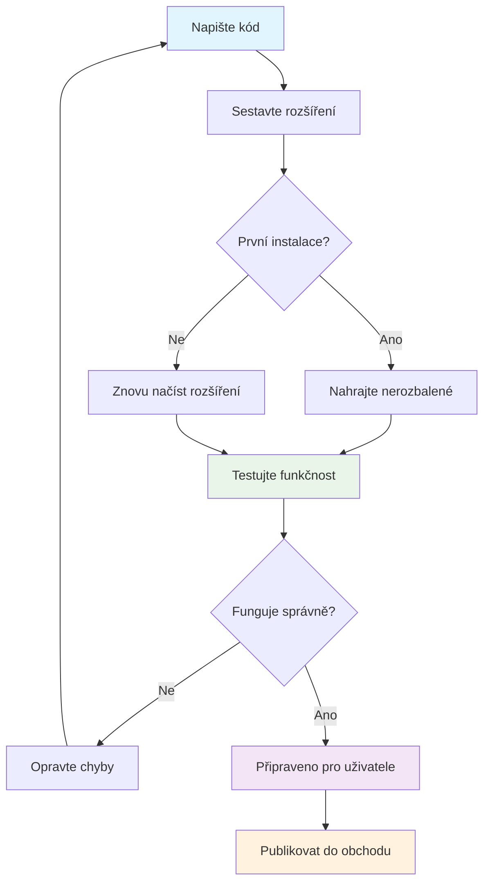
```bash
# Krok 1: Vytvořte své rozšíření
npm run build
```

**Co tento příkaz provádí:**
- **Komplikuje** váš zdrojový kód do souborů připravených pro prohlížeč
- **Kombinuje** JavaScriptové moduly do optimalizovaných balíčků
- **Vytváří** finální soubory rozšíření ve složce `/dist`
- **Připravuje** vaše rozšíření k instalaci a testování

**Krok 2: Přejděte do správy rozšíření v prohlížeči**
1. **Otevřete** stránku správy rozšíření ve svém prohlížeči
2. **Klikněte** na tlačítko "Nastavení a další" (ikona `...`) vpravo nahoře
3. **Vyberte** "Rozšíření" v rozbalovací nabídce

**Krok 3: Načtěte své rozšíření**
- **Pro nové instalace**: Vyberte `load unpacked` a vyberte složku `/dist`
- **Pro aktualizace**: Klikněte na `reload` vedle již nainstalovaného rozšíření
- **Pro testování**: Zapněte "Režim vývojáře" pro přístup k dalším ladicím možnostem

### Instalace rozšíření pro produkci

> ✅ **Poznámka**: Tyto vývojové instrukce jsou určeny pro rozšíření, která vytváříte sami. Pro instalaci publikovaných rozšíření navštivte oficiální obchody s rozšířeními jako [Microsoft Edge Add-ons store](https://microsoftedge.microsoft.com/addons/Microsoft-Edge-Extensions-Home).

**Rozdíl mezi nimi:**
- **Vývojové instalace** umožňují testovat nevydaná rozšíření během vývoje
- **Instalace z obchodu** poskytují ověřená, publikovaná rozšíření s automatickými aktualizacemi
- **Sideloading** umožňuje instalaci rozšíření mimo oficiální obchody (vyžaduje režim vývojáře)

## Stavíme rozšíření pro uhlíkovou stopu

Vytvoříme rozšíření prohlížeče, které zobrazuje uhlíkovou stopu využití energie ve vaší oblasti. Tento projekt demonstruje základní principy vývoje rozšíření a zároveň představuje praktický nástroj pro environmentální povědomí.

Tento přístup následuje princip „učení praxí“, který se osvědčil již od John Deweyho vzdělávacích teorií – kombinace technických dovedností s významnými reálnými aplikacemi.

### Požadavky projektu

Než začnete vývoj, shromážděme potřebné zdroje a závislosti:

**Požadovaný přístup k API:**
- **[CO2 Signal API klíč](https://www.co2signal.com/)**: Zadejte svou e-mailovou adresu pro bezplatný API klíč
- **[Kód regionu](http://api.electricitymap.org/v3/zones)**: Najděte kód vašeho regionu pomocí [Electricity Map](https://www.electricitymap.org/map) (například Boston používá „US-NEISO“)

**Vývojové nástroje:**
- **[Node.js a NPM](https://www.npmjs.com)**: Nástroj pro správu balíčků pro instalaci závislostí projektu
- **[Výchozí kód](../../../../5-browser-extension/start)**: Stáhněte si složku `start` pro zahájení vývoje

✅ **Více se naučíte**: Zlepšete své schopnosti správy balíčků pomocí tohoto [komplexního Learn modulu](https://docs.microsoft.com/learn/modules/create-nodejs-project-dependencies/?WT.mc_id=academic-77807-sagibbon)

### Porozumění struktuře projektu

Shrnutí struktury projektu pomáhá efektivně organizovat práci na vývoji. Podobně jako Alexandrijská knihovna byla organizována pro snadný přístup k vědomostem, dobře strukturovaná kódová báze zefektivňuje vývoj:

```
project-root/
├── dist/                    # Built extension files
│   ├── manifest.json        # Extension configuration
│   ├── index.html           # User interface markup
│   ├── background.js        # Background script functionality
│   └── main.js              # Compiled JavaScript bundle
├── src/                     # Source development files
│   └── index.js             # Your main JavaScript code
├── package.json             # Project dependencies and scripts
└── webpack.config.js        # Build configuration
```

**Co každý soubor dělá:**
- **`manifest.json`**: **Definuje** metadata rozšíření, oprávnění a vstupní body
- **`index.html`**: **Vytváří** uživatelské rozhraní, které se zobrazí po kliknutí na rozšíření
- **`background.js`**: **Řídí** úlohy na pozadí a posluchače událostí prohlížeče
- **`main.js`**: **Obsahuje** finální sloučený JavaScript po sestavení
- **`src/index.js`**: **Obsahuje** hlavní vývojový kód, který se zkompiluje do `main.js`

> 💡 **Tip pro organizaci**: Uložte si svůj API klíč a kód regionu v zabezpečené poznámce pro snadnou referenci během vývoje. Budete je potřebovat k testování funkčnosti rozšíření.

✅ **Bezpečnostní poznámka**: Nikdy nesdílejte API klíče nebo citlivé přihlašovací údaje ve vašem repozitáři kódu. Ukážeme vám, jak s nimi bezpečně pracovat v dalších krocích.

## Vytváření rozhraní rozšíření

Nyní sestavíme komponenty uživatelského rozhraní. Rozšíření používá dvouscreenový přístup: konfigurační obrazovku pro počáteční nastavení a výsledkovou obrazovku pro zobrazení dat.

Toto následuje princip postupného odhalování v designu rozhraní používaný od raných dob počítačů – odhalování informací a možností v logickém pořadí, aby uživatelé nebyli přetíženi.

### Přehled zobrazení rozšíření

**Nastavení** - konfigurace prvního použití:
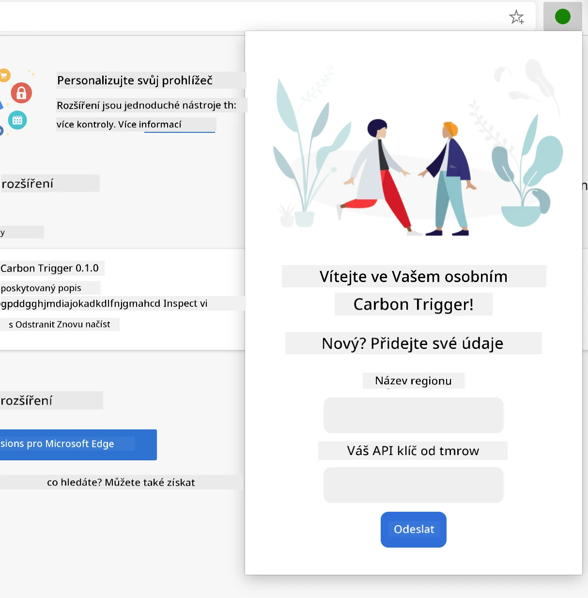

**Výsledky** - zobrazení dat uhlíkové stopy:
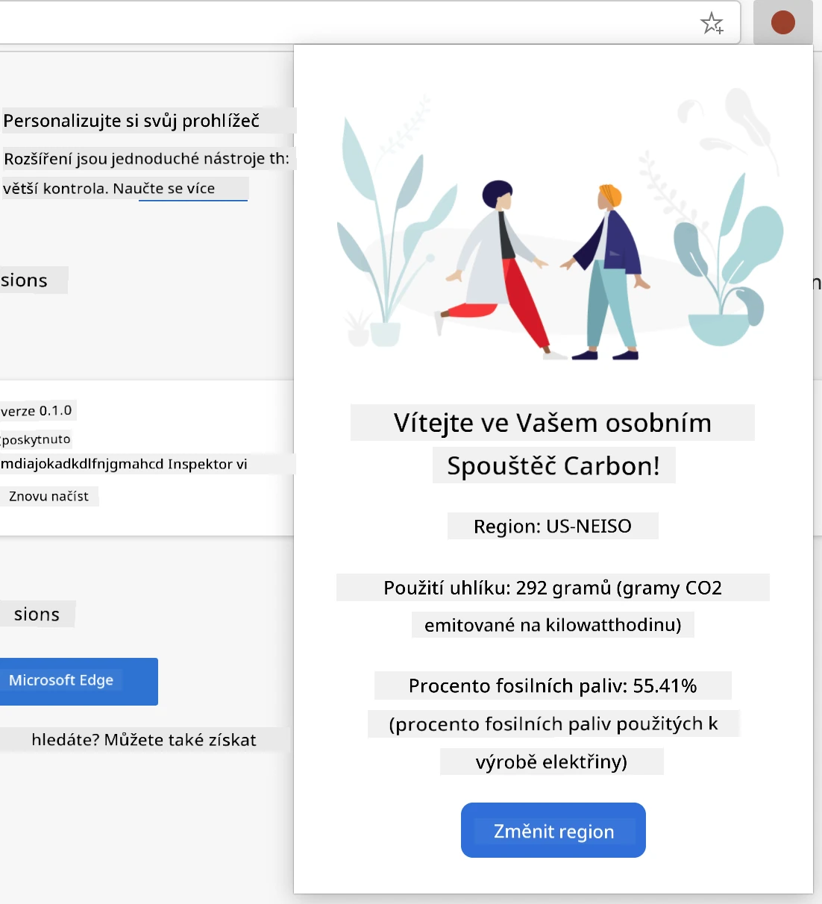

### Vytvoření konfiguračního formuláře

Formulář pro nastavení sbírá konfigurační údaje uživatele během prvního použití. Po nastavení jsou tyto informace uloženy do úložiště prohlížeče pro další session.

V souboru `/dist/index.html` přidejte tuto strukturu formuláře:

```html
<form class="form-data" autocomplete="on">
    <div>
        <h2>New? Add your Information</h2>
    </div>
    <div>
        <label for="region">Region Name</label>
        <input type="text" id="region" required class="region-name" />
    </div>
    <div>
        <label for="api">Your API Key from tmrow</label>
        <input type="text" id="api" required class="api-key" />
    </div>
    <button class="search-btn">Submit</button>
</form>
```

**Co tento formulář dělá:**
- **Vytváří** sémantickou strukturu formuláře s odpovídajícími štítky a asociacemi vstupů
- **Povoluje** automatické doplňování prohlížečem pro lepší uživatelský zážitek
- **Požaduje** vyplnění obou polí před odesláním pomocí atributu `required`
- **Organizuje** vstupy pomocí popisných názvů tříd pro snadné styly a cílení JavaScriptu
- **Poskytuje** jasné instrukce uživatelům, kteří nastavují rozšíření poprvé

### Vytváření zobrazení výsledků

Dále vytvořte oblast pro výsledky, která bude zobrazovat data o uhlíkové stopě. Přidejte tento HTML pod formulář:

```html
<div class="result">
    <div class="loading">loading...</div>
    <div class="errors"></div>
    <div class="data"></div>
    <div class="result-container">
        <p><strong>Region: </strong><span class="my-region"></span></p>
        <p><strong>Carbon Usage: </strong><span class="carbon-usage"></span></p>
        <p><strong>Fossil Fuel Percentage: </strong><span class="fossil-fuel"></span></p>
    </div>
    <button class="clear-btn">Change region</button>
</div>
```

**Co tato struktura obsahuje:**
- **`loading`**: **Zobrazuje** zprávu o načítání během vyhledávání dat z API
- **`errors`**: **Ukazuje** chybové zprávy, pokud volání API selže nebo data nejsou platná
- **`data`**: **Drží** surová data pro ladění během vývoje
- **`result-container`**: **Prezentuje** formátované informace o uhlíkové stopě uživatelům
- **`clear-btn`**: **Umožňuje** uživatelům změnit region a znovu konfigurovat rozšíření

### Nastavení procesu sestavení

Nyní nainstalujeme závislosti projektu a otestujeme proces sestavení:

```bash
npm install
```

**Co tento instalační proces provádí:**
- **Stahuje** Webpack a další vývojové závislosti uvedené v `package.json`
- **Konfiguruje** nástroje pro sestavení pro překládání moderního JavaScriptu
- **Připravuje** vývojové prostředí pro sestavení a testování rozšíření
- **Umožňuje** balení, optimalizaci a napříč-prohlížečovou kompatibilitu

> 💡 **Pohled do procesu sestavení**: Webpack sbalí váš zdrojový kód z `/src/index.js` do `/dist/main.js`. Tento proces optimalizuje kód pro produkci a zajišťuje kompatibilitu s prohlížeči.

### Testování vašeho pokroku

V této fázi můžete otestovat své rozšíření:
1. **Spusťte** příkaz pro sestavení kódu
2. **Načtěte** rozšíření do svého prohlížeče v režimu pro vývojáře
3. **Ověřte**, že se formulář zobrazuje správně a profesionálně
4. **Zkontrolujte**, zda jsou všechny prvky formuláře správně zarovnané a funkční

**Co jste dosáhli:**
- **Vytvořili** jste základní HTML strukturu pro vaše rozšíření
- **Navrhli** jste rozhraní pro konfiguraci a výsledky s použitím správného sémantického značení
- **Nastavili** jste moderní vývojový workflow za použití průmyslově standardních nástrojů
- **Připravili** jste základy pro přidání interaktivní JavaScriptové funkčnosti

### 🔄 **Pedagogická kontrola**
**Pokrok ve vývoji rozšíření**: Ověřte své porozumění před pokračováním:
- ✅ Dokážete vysvětlit účel jednotlivých souborů ve struktuře projektu?
- ✅ Rozumíte, jak proces sestavení transformuje váš zdrojový kód?
- ✅ Proč oddělujeme konfiguraci a výsledky do různých sekcí uživatelského rozhraní?
- ✅ Jak struktura formuláře podporuje použitelnost i přístupnost?

**Porozumění vývojovému workflow**: Měli byste nyní být schopni:
1. **Upravit** HTML a CSS pro uživatelské rozhraní rozšíření
2. **Spustit** příkaz pro sestavení a překlad změn
3. **Znovu načíst** rozšíření v prohlížeči k otestování aktualizací
4. **Ladit** problémy pomocí nástrojů pro vývojáře v prohlížeči

Dokončili jste první fázi vývoje prohlížečových rozšíření. Stejně jako bratři Wrightové nejprve museli porozumět aerodynamice před letem, tak pochopení těchto základních konceptů vás připravuje na vývoj složitějších interaktivních funkcí v další lekci.

## Výzva GitHub Copilot Agenta 🚀

Použijte režim Agenta k dokončení následující výzvy:

**Popis:** Vylepšete rozšíření do prohlížeče přidáním validace formuláře a zpětné vazby uživateli, aby se zlepšila uživatelská zkušenost při zadávání API klíčů a regionálních kódů.

**Zadání:** Vytvořte JavaScriptové validační funkce, které ověří, zda pole s API klíčem obsahuje alespoň 20 znaků a zda regionální kód odpovídá správnému formátu (například 'US-NEISO'). Přidejte vizuální zpětnou vazbu změnou barvy okraje inputu na zelenou pro platné hodnoty a červenou pro neplatné. Dále přidejte možnost přepínání zobrazení/skrytí API klíče pro bezpečnost.

Více o [režimu agenta](https://code.visualstudio.com/blogs/2025/02/24/introducing-copilot-agent-mode) se dozvíte zde.

## 🚀 Výzva

Prohlédněte si obchod s rozšířeními prohlížeče a nainstalujte si jedno do svého prohlížeče. Můžete zkoumat jeho soubory zajímavými způsoby. Co zjistíte?

## Kvíz po lekci

[Kvíz po lekci](https://ff-quizzes.netlify.app/web/quiz/24)

## Přehled a samostudium

V této lekci jste se dozvěděli něco o historii webových prohlížečů; využijte této příležitosti a přečtěte si více o tom, jak si tvůrci World Wide Web představovali jeho použití. Některé užitečné stránky jsou:

[Historie webových prohlížečů](https://www.mozilla.org/firefox/browsers/browser-history/)

[Historie webu](https://webfoundation.org/about/vision/history-of-the-web/)

[Rozhovor s Timem Berners-Leem](https://www.theguardian.com/technology/2019/mar/12/tim-berners-lee-on-30-years-of-the-web-if-we-dream-a-little-we-can-get-the-web-we-want)

### ⚡ **Co můžete udělat během příštích 5 minut**
- [ ] Otevřete stránku rozšíření Chrome/Edge (chrome://extensions) a prozkoumejte, co máte nainstalováno
- [ ] Podívejte se na záložku Síť (Network) v DevTools vašeho prohlížeče při načítání webové stránky
- [ ] Zkuste zobrazit zdroj stránky (Ctrl+U), abyste viděli strukturu HTML
- [ ] Prozkoumejte libovolný prvek na stránce a upravte jeho CSS v DevTools

### 🎯 **Co můžete během této hodiny zvládnout**
- [ ] Dokončit post-lesson kvíz a pochopit základy prohlížeče
- [ ] Vytvořit základní manifest.json pro rozšíření prohlížeče
- [ ] Sestavit jednoduché rozšíření "Hello World" s vyskakovacím oknem
- [ ] Otestovat načtení rozšíření v režimu vývojáře
- [ ] Prozkoumat dokumentaci pro vývoj rozšíření v cílovém prohlížeči

### 📅 **Váš týdenní plán vývoje rozšíření**
- [ ] Dokončit funkční rozšíření prohlížeče s reálným užitkem
- [ ] Naučit se o content skriptech, background skriptech a popup interakcích
- [ ] Ovládnout browser API jako úložiště, záložky a zasílání zpráv
- [ ] Navrhnout uživatelsky přívětivá rozhraní pro vaše rozšíření
- [ ] Testovat rozšíření na různých webech a scénářích
- [ ] Publikovat rozšíření v obchodě s rozšířeními prohlížeče

### 🌟 **Váš měsíční plán vývoje prohlížeče**
- [ ] Vytvořit více rozšíření řešících různé uživatelské problémy
- [ ] Naučit se pokročilá browser API a bezpečnostní postupy
- [ ] Přispívat do open source projektů pro rozšíření do prohlížeče
- [ ] Ovládnout kompatibilitu napříč prohlížeči a progresivní vylepšení
- [ ] Vytvářet nástroje a šablony pro vývoj rozšíření pro ostatní
- [ ] Stát se expertem na rozšíření do prohlížeče, který pomáhá dalším vývojářům

## 🎯 Váš časový plán zvládnutí rozšíření prohlížeče

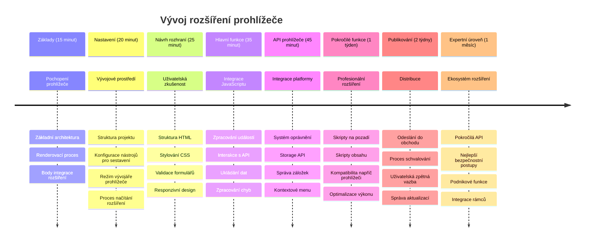
### 🛠️ Shrnutí vašeho nástroje pro vývoj rozšíření

Po dokončení této lekce nyní máte:
- **Znalosti architektury prohlížeče**: Pochopení renderovacích motorů, bezpečnostních modelů a integrace rozšíření
- **Vývojové prostředí**: Moderní nástroje jako Webpack, NPM a možnosti ladění
- **Základy UI/UX**: Sémantická HTML struktura s postupným odkrýváním obsahu
- **Povědomí o bezpečnosti**: Pochopení oprávnění prohlížeče a bezpečných vývojových postupů
- **Pojmy napříč prohlížeči**: Znalost kompatibility a testování
- **Integrace API**: Základ práce s externími zdroji dat
- **Profesionální workflow**: Průmyslové standardy vývoje a testování

**Aplikace v reálném světě**: Tyto dovednosti se přímo uplatní v:
- **Webovém vývoji**: Single-page aplikace a progresivní webové aplikace
- **Desktopových aplikacích**: Electron a webová desktopová řešení
- **Mobilním vývoji**: Hybridní aplikace a webové mobilní produkty
- **Podnikových nástrojích**: Interní produktivní aplikace a automatizace workflow
- **Open Source**: Přispívání do projektů rozšíření a webových standardů

**Další úroveň**: Jste připraveni přidávat interaktivní funkce, pracovat s browser API a vytvářet rozšíření řešící skutečné uživatelské problémy!

## Zadání

[Restylujte své rozšíření](assignment.md)

---

<!-- CO-OP TRANSLATOR DISCLAIMER START -->
**Prohlášení o omezení odpovědnosti**:  
Tento dokument byl přeložen pomocí služby automatického překladu AI [Co-op Translator](https://github.com/Azure/co-op-translator). Přestože usilujeme o přesnost, mějte prosím na paměti, že automatizované překlady mohou obsahovat chyby nebo nepřesnosti. Původní dokument v jeho rodném jazyce by měl být považován za autoritativní zdroj. Pro důležité informace se doporučuje profesionální lidský překlad. Nejsme odpovědní za jakékoli nedorozumění či chybné výklady vyplývající z použití tohoto překladu.
<!-- CO-OP TRANSLATOR DISCLAIMER END -->