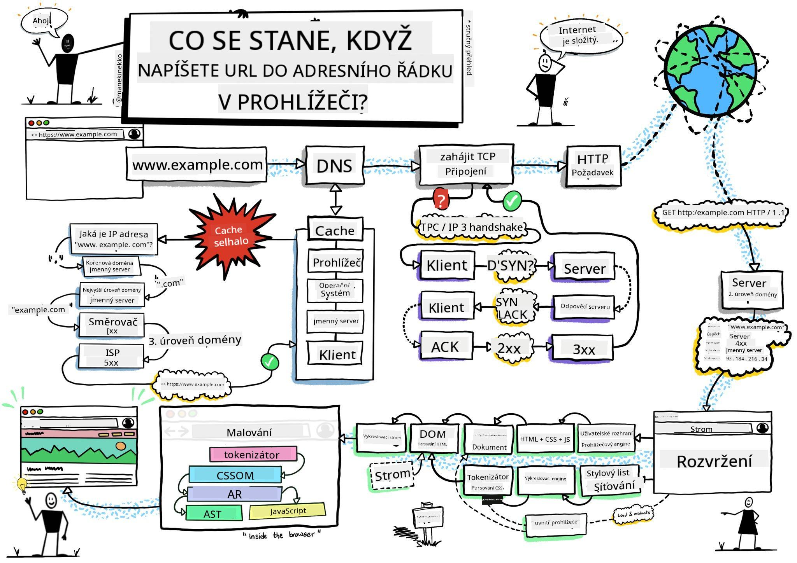
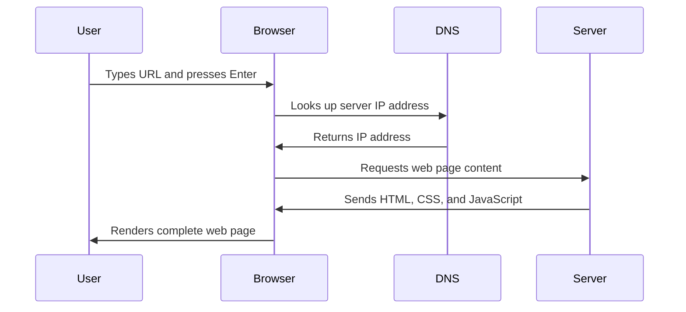
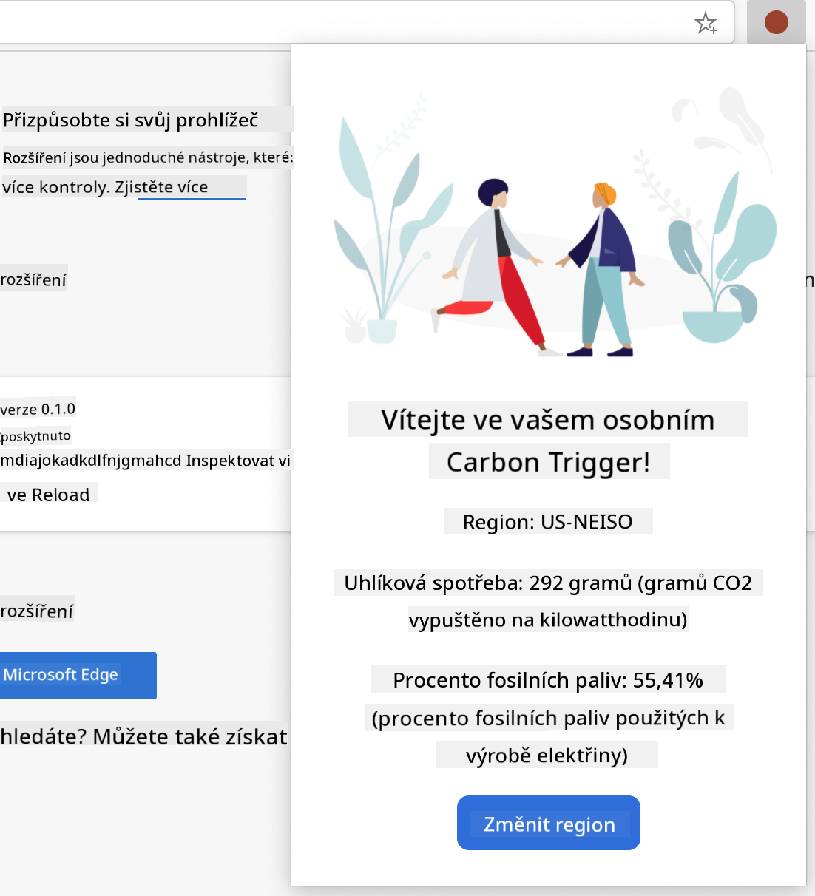

<!--
CO_OP_TRANSLATOR_METADATA:
{
  "original_hash": "33a875c522f237a2026e4653240dfc07",
  "translation_date": "2025-10-24T21:14:43+00:00",
  "source_file": "5-browser-extension/1-about-browsers/README.md",
  "language_code": "cs"
}
-->
# Projekt rozšíření pro prohlížeče, část 1: Vše o prohlížečích


> Sketchnote od [Wassim Chegham](https://dev.to/wassimchegham/ever-wondered-what-happens-when-you-type-in-a-url-in-an-address-bar-in-a-browser-3dob)

## Kvíz před přednáškou

[Kvíz před přednáškou](https://ff-quizzes.netlify.app/web/quiz/23)

### Úvod

Rozšíření pro prohlížeče jsou mini-aplikace, které zlepšují váš zážitek z prohlížení webu. Stejně jako původní vize Tima Berners-Lee o interaktivním webu, rozšíření rozšiřují schopnosti prohlížeče nad rámec jednoduchého prohlížení dokumentů. Od správců hesel, kteří chrání vaše účty, až po nástroje pro výběr barev, které pomáhají designérům najít dokonalé odstíny, rozšíření řeší každodenní výzvy při prohlížení.

Než vytvoříme vaše první rozšíření, pojďme pochopit, jak prohlížeče fungují. Stejně jako Alexander Graham Bell potřeboval pochopit přenos zvuku před vynálezem telefonu, znalost základů prohlížečů vám pomůže vytvořit rozšíření, která se bezproblémově integrují s existujícími systémy prohlížečů.

Na konci této lekce pochopíte architekturu prohlížečů a začnete budovat své první rozšíření.

## Porozumění webovým prohlížečům

Webový prohlížeč je v podstatě sofistikovaný interpret dokumentů. Když do adresního řádku zadáte "google.com", prohlížeč provede složitou sérii operací - požádá o obsah ze serverů po celém světě, poté analyzuje a vykreslí tento kód do interaktivních webových stránek, které vidíte.

Tento proces odráží, jak byl navržen první webový prohlížeč WorldWideWeb Timem Berners-Leem v roce 1990, aby zpřístupnil hypertextové dokumenty všem.

✅ **Trocha historie**: První prohlížeč se jmenoval 'WorldWideWeb' a byl vytvořen Sir Timothym Berners-Leem v roce 1990.


> Některé z prvních prohlížečů, via [Karen McGrane](https://www.slideshare.net/KMcGrane/week-4-ixd-history-personal-computing)

### Jak prohlížeče zpracovávají webový obsah

Proces mezi zadáním URL a zobrazením webové stránky zahrnuje několik koordinovaných kroků, které probíhají během několika sekund:



**Co tento proces zahrnuje:**
- **Překládá** URL čitelnou pro člověka na IP adresu serveru pomocí DNS vyhledávání
- **Navazuje** bezpečné spojení s webovým serverem pomocí protokolů HTTP nebo HTTPS
- **Požaduje** konkrétní obsah webové stránky ze serveru
- **Přijímá** HTML značkování, CSS stylování a JavaScriptový kód ze serveru
- **Vykresluje** veškerý obsah do interaktivní webové stránky, kterou vidíte

### Základní funkce prohlížeče

Moderní prohlížeče poskytují řadu funkcí, které mohou vývojáři rozšíření využít:

| Funkce | Účel | Příležitosti pro rozšíření |
|--------|------|---------------------------|
| **Vykreslovací engine** | Zobrazuje HTML, CSS a JavaScript | Úprava obsahu, injekce stylů |
| **JavaScriptový engine** | Spouští JavaScriptový kód | Vlastní skripty, interakce s API |
| **Lokální úložiště** | Ukládá data lokálně | Uživatelské preference, cache |
| **Síťový stack** | Zpracovává webové požadavky | Monitorování požadavků, analýza dat |
| **Bezpečnostní model** | Chrání uživatele před škodlivým obsahem | Filtrování obsahu, zlepšení bezpečnosti |

**Porozumění těmto funkcím vám pomůže:**
- **Identifikovat**, kde může vaše rozšíření přinést největší hodnotu
- **Vybrat** správné API prohlížeče pro funkčnost vašeho rozšíření
- **Navrhnout** rozšíření, která efektivně spolupracují se systémy prohlížeče
- **Zajistit**, že vaše rozšíření dodržuje nejlepší bezpečnostní postupy prohlížeče

### Úvahy o vývoji napříč prohlížeči

Různé prohlížeče implementují standardy s drobnými odchylkami, podobně jako různé programovací jazyky mohou zpracovávat stejný algoritmus odlišně. Chrome, Firefox a Safari mají každý své jedinečné vlastnosti, které musí vývojáři při vývoji rozšíření zohlednit.

> 💡 **Tip**: Použijte [caniuse.com](https://www.caniuse.com) k ověření, které webové technologie jsou podporovány napříč různými prohlížeči. To je neocenitelné při plánování funkcí vašeho rozšíření!

**Klíčové úvahy pro vývoj rozšíření:**
- **Testujte** své rozšíření napříč prohlížeči Chrome, Firefox a Edge
- **Přizpůsobte** se různým API pro rozšíření a formátům manifestů
- **Řešte** různé charakteristiky výkonu a omezení
- **Poskytněte** alternativy pro funkce specifické pro prohlížeče, které nemusí být dostupné

✅ **Analytický pohled**: Můžete zjistit, které prohlížeče vaši uživatelé preferují, instalací analytických balíčků do vašich webových projektů. Tyto údaje vám pomohou určit, které prohlížeče podporovat jako první.

## Porozumění rozšířením pro prohlížeče

Rozšíření pro prohlížeče řeší běžné výzvy při prohlížení webu tím, že přidávají funkce přímo do rozhraní prohlížeče. Místo vyžadování samostatných aplikací nebo složitých pracovních postupů poskytují rozšíření okamžitý přístup k nástrojům a funkcím.

Tento koncept odráží, jak si raní počítačoví průkopníci jako Douglas Engelbart představovali rozšíření lidských schopností pomocí technologie - rozšíření rozšiřují základní funkčnost vašeho prohlížeče.

**Oblíbené kategorie rozšíření a jejich výhody:**
- **Nástroje produktivity**: Správci úkolů, aplikace pro psaní poznámek a sledování času, které vám pomáhají zůstat organizovaní
- **Zlepšení bezpečnosti**: Správci hesel, blokátory reklam a nástroje pro ochranu soukromí, které chrání vaše data
- **Nástroje pro vývojáře**: Formátovače kódu, nástroje pro výběr barev a ladicí nástroje, které zjednodušují vývoj
- **Zlepšení obsahu**: Režimy čtení, stahovače videí a nástroje pro snímání obrazovky, které zlepšují váš zážitek z webu

✅ **Reflexní otázka**: Jaká jsou vaše oblíbená rozšíření pro prohlížeče? Jaké konkrétní úkoly vykonávají a jak zlepšují váš zážitek z prohlížení?

## Instalace a správa rozšíření

Porozumění procesu instalace rozšíření vám pomůže předvídat uživatelskou zkušenost, když lidé instalují vaše rozšíření. Proces instalace je standardizován napříč moderními prohlížeči, s drobnými odchylkami v designu rozhraní.


> **Důležité**: Při testování vlastních rozšíření nezapomeňte zapnout režim vývojáře a povolit rozšíření z jiných obchodů.

### Proces instalace rozšíření pro vývoj

Při vývoji a testování vlastních rozšíření postupujte podle tohoto pracovního postupu:

```bash
# Step 1: Build your extension
npm run build
```

**Co tento příkaz provádí:**
- **Kompiluje** váš zdrojový kód do souborů připravených pro prohlížeč
- **Balí** JavaScriptové moduly do optimalizovaných balíčků
- **Generuje** finální soubory rozšíření ve složce `/dist`
- **Připravuje** vaše rozšíření pro instalaci a testování

**Krok 2: Přejděte na rozšíření prohlížeče**
1. **Otevřete** stránku správy rozšíření vašeho prohlížeče
2. **Klikněte** na tlačítko "Nastavení a další" (ikona `...`) v pravém horním rohu
3. **Vyberte** "Rozšíření" z rozbalovací nabídky

**Krok 3: Načtěte své rozšíření**
- **Pro nové instalace**: Vyberte `load unpacked` a zvolte svou složku `/dist`
- **Pro aktualizace**: Klikněte na `reload` vedle již nainstalovaného rozšíření
- **Pro testování**: Aktivujte "Režim vývojáře" pro přístup k dalším funkcím ladění

### Instalace produkčního rozšíření

> ✅ **Poznámka**: Tyto pokyny pro vývoj jsou specifické pro rozšíření, která sami vytvoříte. Pro instalaci publikovaných rozšíření navštivte oficiální obchody s rozšířeními pro prohlížeče, jako je [Microsoft Edge Add-ons store](https://microsoftedge.microsoft.com/addons/Microsoft-Edge-Extensions-Home).

**Porozumění rozdílu:**
- **Instalace pro vývoj** vám umožní testovat nepublikovaná rozšíření během vývoje
- **Instalace z obchodu** poskytují ověřená, publikovaná rozšíření s automatickými aktualizacemi
- **Sideloading** umožňuje instalaci rozšíření mimo oficiální obchody (vyžaduje režim vývojáře)

## Vytvoření rozšíření pro uhlíkovou stopu

Vytvoříme rozšíření prohlížeče, které zobrazuje uhlíkovou stopu energetického využití vašeho regionu. Tento projekt demonstruje základní koncepty vývoje rozšíření a zároveň vytváří praktický nástroj pro zvýšení povědomí o životním prostředí.

Tento přístup vychází z principu "učení se praxí", který se ukázal jako efektivní od dob vzdělávacích teorií Johna Deweyho - kombinace technických dovedností s smysluplnými aplikacemi v reálném světě.

### Požadavky na projekt

Než začneme s vývojem, shromáždíme potřebné zdroje a závislosti:

**Požadovaný přístup k API:**
- **[CO2 Signal API klíč](https://www.co2signal.com/)**: Zadejte svou e-mailovou adresu, abyste obdrželi svůj bezplatný API klíč
- **[Kód regionu](http://api.electricitymap.org/v3/zones)**: Najděte kód svého regionu pomocí [Electricity Map](https://www.electricitymap.org/map) (například Boston používá 'US-NEISO')

**Nástroje pro vývoj:**
- **[Node.js a NPM](https://www.npmjs.com)**: Nástroj pro správu balíčků pro instalaci závislostí projektu
- **[Startovací kód](../../../../5-browser-extension/start)**: Stáhněte složku `start` pro zahájení vývoje

✅ **Další informace**: Zlepšete své dovednosti v oblasti správy balíčků pomocí tohoto [komplexního modulu Learn](https://docs.microsoft.com/learn/modules/create-nodejs-project-dependencies/?WT.mc_id=academic-77807-sagibbon)

### Porozumění struktuře projektu

Porozumění struktuře projektu pomáhá efektivně organizovat práci na vývoji. Stejně jako byla Alexandrijská knihovna organizována pro snadné vyhledávání znalostí, dobře strukturovaná základna kódu zefektivňuje vývoj:

```
project-root/
├── dist/                    # Built extension files
│   ├── manifest.json        # Extension configuration
│   ├── index.html           # User interface markup
│   ├── background.js        # Background script functionality
│   └── main.js              # Compiled JavaScript bundle
└── src/                     # Source development files
    └── index.js             # Your main JavaScript code
```

**Rozdělení toho, co každý soubor provádí:**
- **`manifest.json`**: **Definuje** metadata rozšíření, oprávnění a vstupní body
- **`index.html`**: **Vytváří** uživatelské rozhraní, které se zobrazí, když uživatelé kliknou na vaše rozšíření
- **`background.js`**: **Zpracovává** úkoly na pozadí a posluchače událostí prohlížeče
- **`main.js`**: **Obsahuje** finální JavaScriptový kód po procesu sestavení
- **`src/index.js`**: **Obsahuje** váš hlavní vývojový kód, který je kompilován do `main.js`

> 💡 **Tip pro organizaci**: Uložte svůj API klíč a kód regionu do bezpečné poznámky pro snadný přístup během vývoje. Tyto hodnoty budete potřebovat k testování funkčnosti vašeho rozšíření.

✅ **Bezpečnostní poznámka**: Nikdy nezveřejňujte API klíče nebo citlivé údaje ve svém repozitáři kódu. Ukážeme vám, jak s nimi bezpečně pracovat v dalších krocích.

## Vytvoření rozhraní rozšíření

Nyní vytvoříme komponenty uživatelského rozhraní. Rozšíření používá dvouobrazovkový přístup: konfigurační obrazovku pro počáteční nastavení a obrazovku výsledků pro zobrazení dat.

Toto vychází z principu postupného odhalování, který se v návrhu rozhraní používá od počátků výpočetní techniky - odhalování informací a možností v logickém pořadí, aby se uživatelé necítili zahlceni.

### Přehled zobrazení rozšíření

**Zobrazení nastavení** - Konfigurace pro první použití:


**Zobrazení výsledků** - Zobrazení dat o uhlíkové stopě:


### Vytvoření konfiguračního formuláře

Formulář nastavení shromažďuje konfigurační data uživatele při prvním použití. Po konfiguraci tyto informace přetrvávají v úložišti prohlížeče pro budoucí relace.

Do souboru `/dist/index.html` přidejte tuto strukturu formuláře:

```html
<form class="form-data" autocomplete="on">
    <div>
        <h2>New? Add your Information</h2>
    </div>
    <div>
        <label for="region">Region Name</label>
        <input type="text" id="region" required class="region-name" />
    </div>
    <div>
        <label for="api">Your API Key from tmrow</label>
        <input type="text" id="api" required class="api-key" />
    </div>
    <button class="search-btn">Submit</button>
</form>
```

**Co tento formulář provádí:**
- **Vytváří** sémantickou strukturu formuláře s odpovídajícími štítky a asociacemi vstupů
- **Umožňuje** funkci automatického doplňování prohlížeče pro zlepšení uživatelského zážitku
- **Vyžaduje**, aby byla obě pole vyplněna před odesláním pomocí atributu `required`
- **Organizuje** vstupy s popisnými názvy tříd pro snadné stylování a cílení JavaScriptu
- **Poskytuje** jasné pokyny pro uživatele, kteří nastavují rozšíření poprvé

### Vytvoření zobrazení výsledků

Dále vytvořte oblast výsledků, která bude zobrazovat data o uhlíkové stopě. Přidejte tento HTML pod formulář:

```html
<div class="result">
    <div class="loading">loading...</div>
    <div class="errors"></div>
    <div class="data"></div>
    <div class="result-container">
        <p><strong>Region: </strong><span class="my-region"></span></p>
        <p><strong>Carbon Usage: </strong><span class="carbon-usage"></span></p>
        <p><strong>Fossil Fuel Percentage: </strong><span class="fossil-fuel"></span></p>
    </div>
    <button class="clear-btn">Change region</button>
</div>
```

**Rozdělení toho, co tato struktura poskytuje:**
- **`loading`**: **Zobrazuje** zprávu o načítání během získávání dat z API
- **`errors`**: **Ukazuje** chybové zprávy, pokud volání API selže nebo jsou data neplatná
- **`data`**: **Ukládá** surová data pro ladění během vývoje
- **`result-container`**: **Prezentuje** formátované informace o uhlíkové stopě uživatelům
- **`clear-btn`**: **Umožňuje
**Popis:** Vylepšete rozšíření prohlížeče přidáním funkcí validace formulářů a zpětné vazby uživatelům, aby se zlepšila uživatelská zkušenost při zadávání API klíčů a kódů regionů.

**Úkol:** Vytvořte validační funkce v JavaScriptu, které ověří, zda pole pro API klíč obsahuje alespoň 20 znaků a zda kód regionu odpovídá správnému formátu (například 'US-NEISO'). Přidejte vizuální zpětnou vazbu změnou barvy okrajů vstupních polí na zelenou pro platné vstupy a červenou pro neplatné. Dále přidejte funkci přepínání viditelnosti API klíče pro zvýšení bezpečnosti.

Více o [agent mode](https://code.visualstudio.com/blogs/2025/02/24/introducing-copilot-agent-mode) se dozvíte zde.

## 🚀 Výzva

Podívejte se na obchod s rozšířeními pro prohlížeče a nainstalujte si jedno do svého prohlížeče. Můžete zkoumat jeho soubory zajímavými způsoby. Co objevíte?

## Kvíz po přednášce

[Kvíz po přednášce](https://ff-quizzes.netlify.app/web/quiz/24)

## Přehled & Samostudium

V této lekci jste se dozvěděli něco o historii webových prohlížečů; využijte této příležitosti k tomu, abyste se dozvěděli více o tom, jak si vynálezci World Wide Webu představovali jeho využití, a přečtěte si více o jeho historii. Některé užitečné stránky zahrnují:

[Historie webových prohlížečů](https://www.mozilla.org/firefox/browsers/browser-history/)

[Historie webu](https://webfoundation.org/about/vision/history-of-the-web/)

[Rozhovor s Timem Berners-Leem](https://www.theguardian.com/technology/2019/mar/12/tim-berners-lee-on-30-years-of-the-web-if-we-dream-a-little-we-can-get-the-web-we-want)

## Zadání

[Upravte styl svého rozšíření](assignment.md)

---

**Prohlášení**:  
Tento dokument byl přeložen pomocí služby AI pro překlady [Co-op Translator](https://github.com/Azure/co-op-translator). Ačkoli se snažíme o přesnost, mějte prosím na paměti, že automatizované překlady mohou obsahovat chyby nebo nepřesnosti. Původní dokument v jeho rodném jazyce by měl být považován za autoritativní zdroj. Pro důležité informace se doporučuje profesionální lidský překlad. Neodpovídáme za žádná nedorozumění nebo nesprávné interpretace vyplývající z použití tohoto překladu.