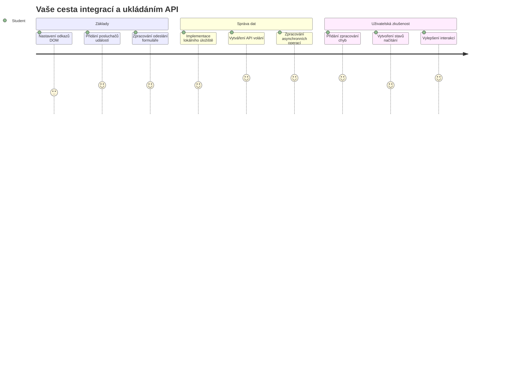
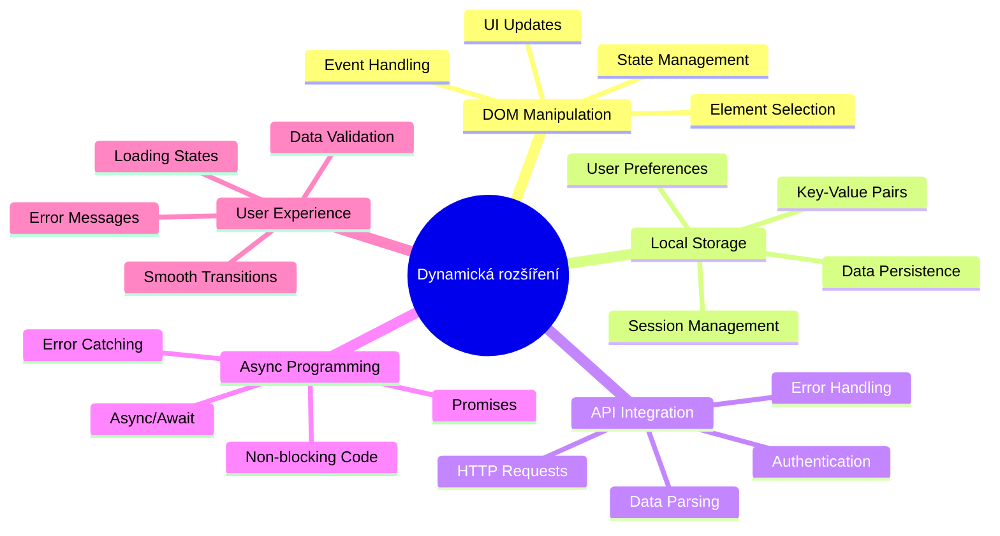
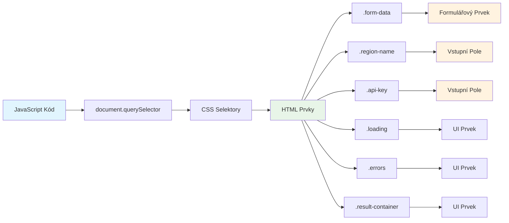
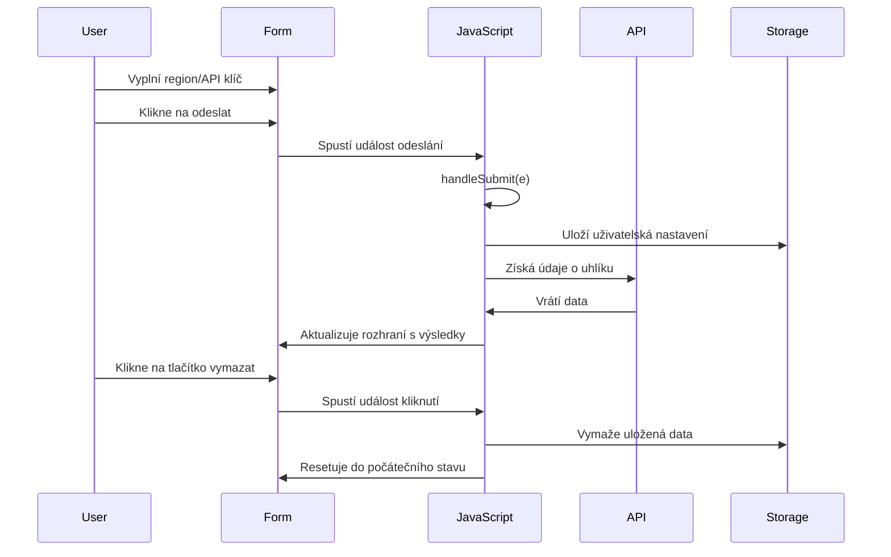
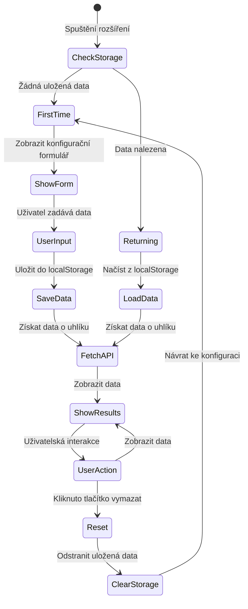
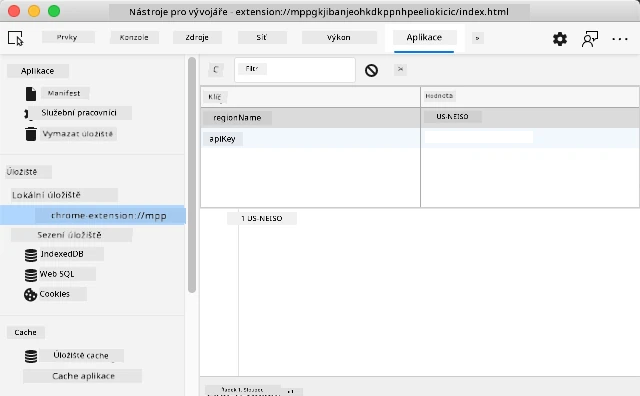
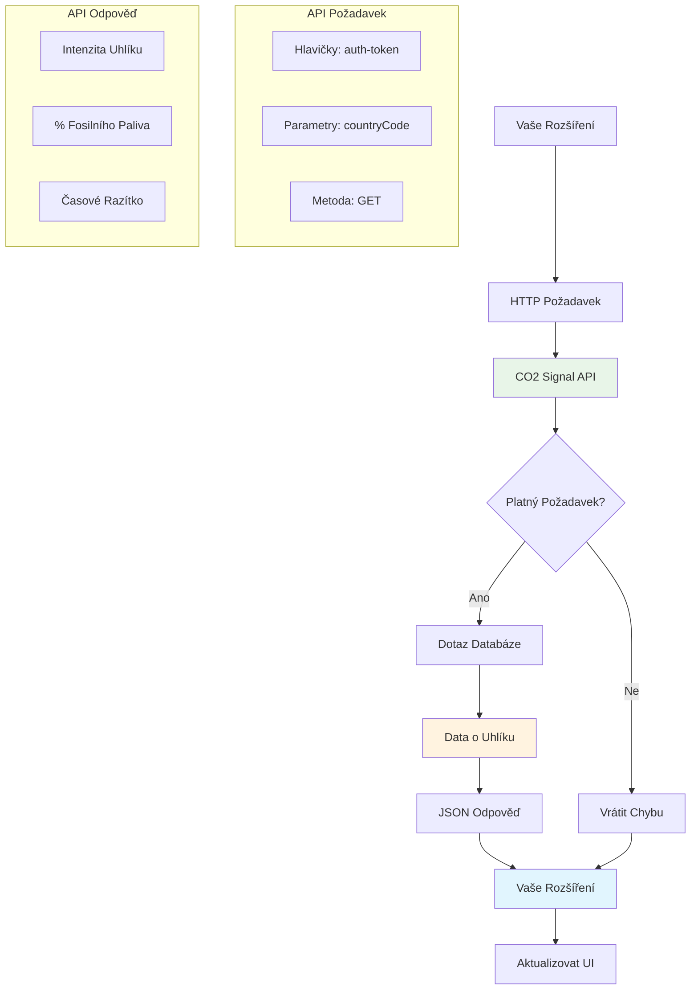
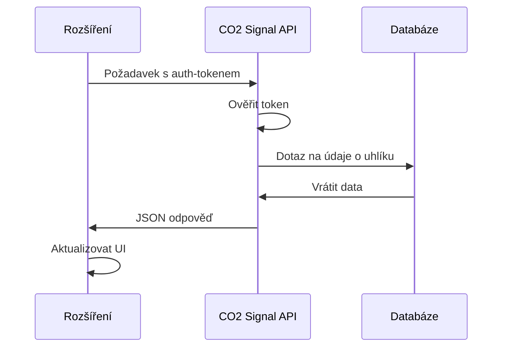
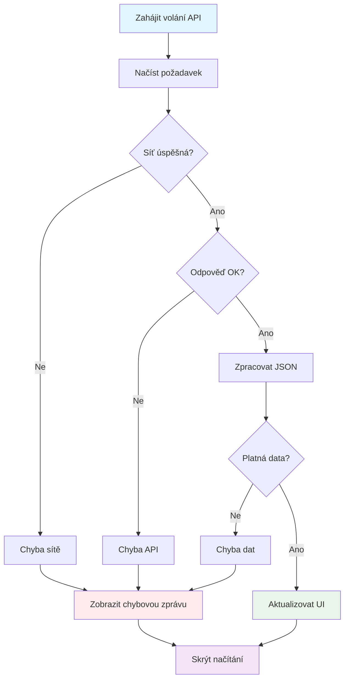
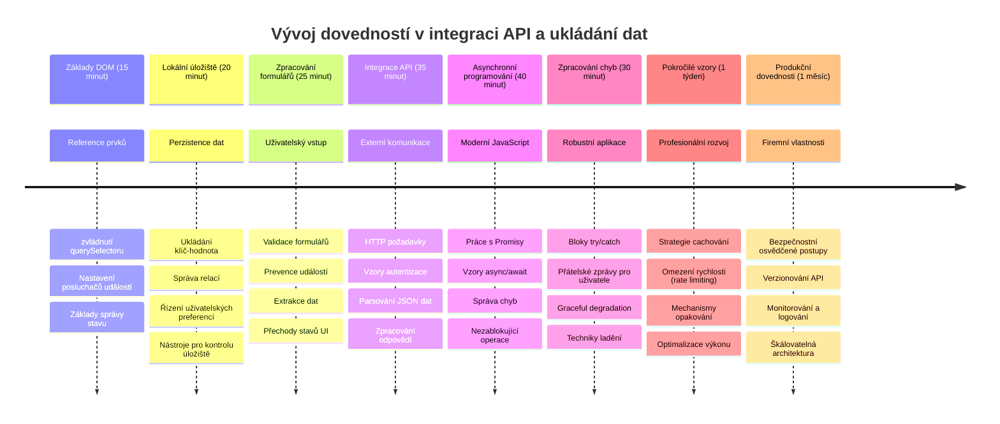

<!--
CO_OP_TRANSLATOR_METADATA:
{
  "original_hash": "2b6203a48c48d8234e0948353b47d84e",
  "translation_date": "2026-01-07T03:47:03+00:00",
  "source_file": "5-browser-extension/2-forms-browsers-local-storage/README.md",
  "language_code": "cs"
}
-->
# Projekt rozšíření prohlížeče část 2: Zavolat API, použít místní úložiště


## Kvíz před přednáškou

[Kvíz před přednáškou](https://ff-quizzes.netlify.app/web/quiz/25)

## Úvod

Pamatujete na to rozšíření prohlížeče, které jste začali vytvářet? Momentálně máte hezky vypadající formulář, ale je v podstatě statický. Dnes ho oživíme tím, že ho připojíme k reálným datům a dáme mu paměť.

Přemýšlejte o počítačích řízení mise Apollo - neukazovaly jen fixní informace. Neustále komunikovaly s kosmickou lodí, aktualizovaly telemetrická data a pamatovaly si kritické parametry mise. To je ten druh dynamického chování, který dnes budujeme. Vaše rozšíření se připojí na internet, získá skutečná data o prostředí a zapamatuje si vaše nastavení pro příště.

Integrace API může znít složitě, ale ve skutečnosti jde jen o naučení vašeho kódu komunikovat s jinými službami. Ať už získáváte data o počasí, příspěvky ze sociálních médií nebo informace o uhlíkové stopě, jako budeme dělat dnes, jde především o navázání těchto digitálních spojení. Prozkoumáme také, jak prohlížeče mohou uchovávat informace - podobně jako knihovny používaly katalogy kartiček, aby si pamatovaly, kde která kniha patří.

Na konci této lekce budete mít rozšíření prohlížeče, které stahuje skutečná data, ukládá uživatelská nastavení a poskytuje plynulý zážitek. Pojďme začít!


✅ Řiďte se číslovanými segmenty v příslušných souborech, abyste věděli, kde umístit svůj kód

## Nastavení prvků k manipulaci v rozšíření

Než bude váš JavaScript moci manipulovat s rozhraním, potřebuje reference na konkrétní HTML prvky. Představte si to jako dalekohled, který musí být namířený na určité hvězdy - než Galileo mohl studovat Jupiterovy měsíce, musel nejdříve najít a zaostřit samotný Jupiter.

V souboru `index.js` vytvoříme proměnné `const`, které zachytí reference na každý důležitý prvek formuláře. Je to podobné, jako když vědci označují své přístroje - místo hledání v celé laboratoři mohou přímo přistupovat k tomu, co potřebují.


```javascript
// formulářová pole
const form = document.querySelector('.form-data');
const region = document.querySelector('.region-name');
const apiKey = document.querySelector('.api-key');

// výsledky
const errors = document.querySelector('.errors');
const loading = document.querySelector('.loading');
const results = document.querySelector('.result-container');
const usage = document.querySelector('.carbon-usage');
const fossilfuel = document.querySelector('.fossil-fuel');
const myregion = document.querySelector('.my-region');
const clearBtn = document.querySelector('.clear-btn');
```

**Co tento kód dělá:**
- **Zachycuje** prvky formuláře pomocí `document.querySelector()` s CSS selektory tříd
- **Vytváří** reference na vstupní pole pro název regionu a API klíč
- **Ustavuje** spojení na prvky zobrazující výsledky dat o spotřebě uhlíku
- **Nastavuje** přístup k prvkům uživatelského rozhraní, jako jsou indikátory načítání a chybové zprávy
- **Ukládá** každou referenci do proměnné `const` pro snadné opakované použití v kódu

## Přidání posluchačů událostí

Nyní zajistíme, aby vaše rozšíření reagovalo na uživatelské akce. Posluchači událostí jsou způsob, jakým váš kód sleduje interakce uživatele. Představte si je jako operátory ve starých telefonních ústřednách - naslouchali příchozím hovorům a spojovali správné obvody, když někdo chtěl navázat spojení.


```javascript
form.addEventListener('submit', (e) => handleSubmit(e));
clearBtn.addEventListener('click', (e) => reset(e));
init();
```

**Co tato koncepce znamená:**
- **Připojuje** posluchač odeslání formuláře, který se spustí, když uživatelé stisknou Enter nebo kliknou na odeslat
- **Spojuje** posluchač kliknutí k tlačítku vymazání pro resetování formuláře
- **Předává** objekt události `(e)` obslužným funkcím pro další kontrolu
- **Volá** funkci `init()` ihned, aby nastavila počáteční stav rozšíření

✅ Všimněte si zjednodušené syntaxe šipkové funkce použité zde. Tento moderní přístup v JavaScriptu je čistší než tradiční funkční výrazy, ale obě fungují stejně dobře!

### 🔄 **Pedagogická kontrola**
**Porozumění zpracování událostí**: Než přejdete k inicializaci, ujistěte se, že:
- ✅ Dokážete vysvětlit, jak `addEventListener` spojuje uživatelské akce s JavaScriptovými funkcemi
- ✅ Chápete, proč předáváme objekt události `(e)` do obslužných funkcí
- ✅ Rozumíte rozdílu mezi událostmi `submit` a `click`
- ✅ Umíte popsat, kdy a proč se volá funkce `init()`

**Rychlý test**: Co by se stalo, kdybyste zapomněli `e.preventDefault()` u odeslání formuláře?
*Odpověď: Stránka by se znovu načetla, což by ztratilo veškerý stav JavaScriptu a přerušilo uživatelský zážitek*

## Vytvoření funkcí pro inicializaci a reset

Vytvoříme logiku inicializace pro vaše rozšíření. Funkce `init()` je jako navigační systém lodi kontrolující své přístroje - zjistí aktuální stav a podle toho upraví rozhraní. Kontroluje, zda už někdo vaše rozšíření používal, a načte jeho předchozí nastavení.

Funkce `reset()` poskytuje uživatelům nový začátek - podobně jako vědci mezi experimenty resetují přístroje, aby zajistili čistá data.

```javascript
function init() {
	// Zkontrolujte, zda uživatel má předchozí uložené API přihlašovací údaje
	const storedApiKey = localStorage.getItem('apiKey');
	const storedRegion = localStorage.getItem('regionName');

	// Nastavte ikonu rozšíření na obecnou zelenou (zástupný symbol pro budoucí lekci)
	// TODO: Implementujte aktualizaci ikony v příští lekci

	if (storedApiKey === null || storedRegion === null) {
		// První uživatel: zobrazte formulář nastavení
		form.style.display = 'block';
		results.style.display = 'none';
		loading.style.display = 'none';
		clearBtn.style.display = 'none';
		errors.textContent = '';
	} else {
		// Vracející se uživatel: automaticky načtěte jejich uložená data
		displayCarbonUsage(storedApiKey, storedRegion);
		results.style.display = 'none';
		form.style.display = 'none';
		clearBtn.style.display = 'block';
	}
}

function reset(e) {
	e.preventDefault();
	// Vymažte uložený region, aby uživatel mohl zvolit nové umístění
	localStorage.removeItem('regionName');
	// Restartujte inicializační proces
	init();
}
```

**Co se zde děje:**
- **Načítá** uložený API klíč a region z místního úložiště prohlížeče
- **Kontroluje**, zda jde o nového uživatele (žádné uložené údaje) nebo uživatele vracejícího se
- **Zobrazuje** formulář nastavení pro nové uživatele a skrývá ostatní prvky rozhraní
- **Načítá** uložená data automaticky pro vracející se uživatele a zobrazuje možnost resetu
- **Řídí** stav uživatelského rozhraní na základě dostupných dat

**Klíčové koncepty lokálního úložiště:**
- **Udržuje** data mezi relacemi prohlížeče (na rozdíl od session storage)
- **Ukládá** data jako páry klíč-hodnota pomocí `getItem()` a `setItem()`
- **Vrací** `null`, pokud pro daný klíč neexistují žádná data
- **Poskytuje** jednoduchý způsob, jak zapamatovat uživatelská nastavení

> 💡 **Porozumění úložišti v prohlížeči**: [LocalStorage](https://developer.mozilla.org/docs/Web/API/Window/localStorage) dává vašemu rozšíření trvalou paměť. Přemýšlejte, jak starověká Alexandrijská knihovna uchovávala svitky - informace zůstaly dostupné i potom, co učenci odešli a vrátili se.
>
> **Hlavní vlastnosti:**
> - **Přetrvává** i po zavření prohlížeče
> - **Přežívá** restart počítače a havárie prohlížeče
> - **Poskytuje** dostatečný prostor pro uživatelská nastavení
> - **Nabízí** okamžitý přístup bez síťového zpoždění

> **Důležitá poznámka**: Vaše rozšíření má vlastní izolované místní úložiště, které je oddělené od běžných webových stránek. To zajišťuje bezpečnost a zabraňuje konfliktům s jinými weby.

Své uložené údaje si můžete prohlédnout otevřením nástrojů pro vývojáře prohlížeče (F12), přechodem na záložku **Application** a rozbalením sekce **Local Storage**.




> ⚠️ **Bezpečnostní upozornění**: Ve výrobních aplikacích ukládání API klíčů do LocalStorage představuje bezpečnostní rizika, protože k těmto datům může přistupovat JavaScript. Pro výukové účely tento přístup stačí, ale reálné aplikace by měly používat bezpečné serverové úložiště pro citlivé údaje.

## Zpracování odeslání formuláře

Nyní zpracujeme, co se stane, když někdo odešle váš formulář. Prohlížeče běžně po odeslání formuláře stránku znovu načtou, ale my toto chování zachytíme, abychom vytvořili plynulejší zážitek.

Tento přístup je analogický tomu, jak řídící středisko mise zpracovává komunikaci s kosmickou lodí - místo resetování celého systému při každém přenosu udržují nepřetržitý provoz a zároveň zpracovávají nové informace.

Vytvořte funkci, která zachytí událost odeslání formuláře a získá vstup uživatele:

```javascript
function handleSubmit(e) {
	e.preventDefault();
	setUpUser(apiKey.value, region.value);
}
```

**V předchozím kódu jsme:**
- **Zabránili** výchozímu chování odeslání formuláře, které by obnovilo stránku
- **Získali** hodnoty uživatelských vstupů z polí API klíč a region
- **Předali** data formuláře funkci `setUpUser()` pro další zpracování
- **Udrželi** chování jedné stránky bez znovunačítání

✅ Pamatujte, že vaše HTML pole formuláře mají atribut `required`, takže prohlížeč automaticky ověří, že uživatel zadal jak API klíč, tak region před spuštěním této funkce.

## Nastavení uživatelských preferencí

Funkce `setUpUser` je odpovědná za uložení uživatelských přihlašovacích údajů a zahájení prvního volání API. Toto poskytuje hladký přechod od nastavení k zobrazení výsledků.

```javascript
function setUpUser(apiKey, regionName) {
	// Uložit uživatelské přihlašovací údaje pro budoucí relace
	localStorage.setItem('apiKey', apiKey);
	localStorage.setItem('regionName', regionName);
	
	// Aktualizovat uživatelské rozhraní pro zobrazení stavu načítání
	loading.style.display = 'block';
	errors.textContent = '';
	clearBtn.style.display = 'block';
	
	// Načíst data o spotřebě uhlíku pomocí uživatelských přihlašovacích údajů
	displayCarbonUsage(apiKey, regionName);
}
```

**Krok za krokem, co se děje:**
- **Ukládá** API klíč a název regionu do místního úložiště pro budoucí použití
- **Zobrazuje** indikátor načítání, aby uživatelé viděli, že data se získávají
- **Maže** předchozí chybové zprávy z displeje
- **Ukazuje** tlačítko pro vymazání, aby uživatelé mohli později nastavení resetovat
- **Spouští** API volání pro získání aktuálních dat o spotřebě uhlíku

Tato funkce vytváří plynulý uživatelský zážitek tím, že spravuje jak trvalost dat, tak aktualizace uživatelského rozhraní v jednom koordinovaném kroku.

## Zobrazení dat o spotřebě uhlíku

Nyní připojíme vaše rozšíření k externím zdrojům dat prostřednictvím API. To promění vaše rozšíření ze samostatného nástroje na něco, co umí přistupovat k aktuálním informacím z celého internetu.

**Porozumění API**

[API](https://www.webopedia.com/TERM/A/API.html) jsou způsoby, jak různé aplikace spolu komunikují. Představte si je jako telegrafní systém, který spojoval vzdálená města v 19. století - operátoři posílali požadavky na vzdálené stanice a přijímali odpovědi s požadovanými informacemi. Když kontrolujete sociální sítě, položíte hlasovému asistentovi otázku nebo používáte aplikaci na doručování, API umožňují tyto výměny dat.


**Klíčové koncepty REST API:**
- **REST** znamená 'Representational State Transfer' (přeneseně reprezentativní stav)
- **Používá** standardní HTTP metody (GET, POST, PUT, DELETE) pro práci s daty
- **Vrací** data v předvídatelných formátech, typicky JSON
- **Poskytuje** konzistentní URL koncové body pro různé typy požadavků

✅ API [CO2 Signal](https://www.co2signal.com/), které použijeme, poskytuje v reálném čase data o uhlíkové intenzitě elektrických sítí po celém světě. Pomáhá uživatelům pochopit environmentální dopad jejich spotřeby elektřiny!

> 💡 **Porozumění asynchronnímu JavaScriptu**: Klíčové slovo [`async`](https://developer.mozilla.org/docs/Web/JavaScript/Reference/Statements/async_function) umožňuje vašemu kódu současně zpracovávat více operací. Když požádáte server o data, nechcete, aby se celé rozšíření zaseklo - to by bylo jako když řízení letového provozu přestane fungovat, dokud nereaguje jeden letadlo.
>
> **Hlavní výhody:**
> - **Udržuje** rozšíření responzivní během načítání dat
> - **Dovoluje** pokračovat v běhu jiného kódu během síťových požadavků
> - **Zlepšuje** čitelnost kódu oproti tradičním callbackům
> - **Umožňuje** elegantní zpracování chyb síťového provozu

Tady je krátké video o `async`:

[](https://youtube.com/watch?v=YwmlRkrxvkk "Async and Await for managing promises")

> 🎥 Klikněte na obrázek výše pro video o async/await.

### 🔄 **Pedagogická kontrola**
**Porozumění asynchronnímu programování**: Před ponořením do funkce API si ověřte, že rozumíte:
- ✅ Proč používáme `async/await` místo blokování celého rozšíření
- ✅ Jak bloky `try/catch` elegantně zpracovávají chyby sítě
- ✅ Rozdíl mezi synchronními a asynchronními operacemi
- ✅ Proč mohou volání API selhat a jak tyto chyby řešit

**Reálné příklady asynchronního chování:**
- **Objednávání jídla**: Nečekáte v kuchyni - dostanete účtenku a můžete dělat jiné věci
- **Odesílání e-mailů**: Vaše aplikace nezamrzne během odesílání - můžete napsat další e-maily
- **Načítání webových stránek**: Obrázky se načítají postupně, zatímco už čtete text

**Průběh autentizace API:**

Vytvořte funkci, která načte a zobrazí data o spotřebě uhlíku:

```javascript
// Moderní přístup pomocí fetch API (není potřeba žádných externích závislostí)
async function displayCarbonUsage(apiKey, region) {
	try {
		// Získat data o intenzitě uhlíku z API CO2 Signal
		const response = await fetch('https://api.co2signal.com/v1/latest', {
			method: 'GET',
			headers: {
				'auth-token': apiKey,
				'Content-Type': 'application/json'
			},
			// Přidat parametry dotazu pro konkrétní region
			...new URLSearchParams({ countryCode: region }) && {
				url: `https://api.co2signal.com/v1/latest?countryCode=${region}`
			}
		});

		// Zkontrolovat, zda byl požadavek na API úspěšný
		if (!response.ok) {
			throw new Error(`API request failed: ${response.status}`);
		}

		const data = await response.json();
		const carbonData = data.data;

		// Vypočítat zaokrouhlenou hodnotu intenzity uhlíku
		const carbonIntensity = Math.round(carbonData.carbonIntensity);

		// Aktualizovat uživatelské rozhraní načtenými daty
		loading.style.display = 'none';
		form.style.display = 'none';
		myregion.textContent = region.toUpperCase();
		usage.textContent = `${carbonIntensity} grams (grams CO₂ emitted per kilowatt hour)`;
		fossilfuel.textContent = `${carbonData.fossilFuelPercentage.toFixed(2)}% (percentage of fossil fuels used to generate electricity)`;
		results.style.display = 'block';

		// TODO: calculateColor(carbonIntensity) - implementovat v další lekci

	} catch (error) {
		console.error('Error fetching carbon data:', error);
		
		// Zobrazit uživatelsky přívětivou chybovou zprávu
		loading.style.display = 'none';
		results.style.display = 'none';
		errors.textContent = 'Sorry, we couldn\'t fetch data for that region. Please check your API key and region code.';
	}
}
```

**Co se zde děje:**
- **Používá** moderní API `fetch()` místo externích knihoven jako Axios pro čistý, nezávislý kód
- **Provádí** správnou kontrolu chyb pomocí `response.ok` pro včasné zachycení selhání API
- **Zpracovává** asynchronní operace pomocí `async/await` pro čitelnější tok kódu
- **Autentizuje** se pomocí `auth-token` hlavičky v CO2 Signal API
- **Parsuje** JSON odpověď a získává data o uhlíkové intenzitě
- **Aktualizuje** více prvků uživatelského rozhraní s naformátovanými environmentálními daty
- **Zobrazuje** uživatelsky přívětivé chybové zprávy při selhání API volání

**Demonstrování klíčových moderních konceptů JavaScriptu:**
- **Šablonové literály** s `${}` syntaxí pro čisté formátování řetězců
- **Zpracování chyb** pomocí bloků try/catch pro robustní aplikace
- **Async/await** vzor pro elegantní síťová volání
- **Destrukturalizace objektů** pro extrakci specifických dat z odpovědí API
- **Řetězení metod** pro více manipulací s DOM

✅ Tato funkce ukazuje několik důležitých konceptů webového vývoje - komunikaci s externími servery, autentizaci, zpracování dat, aktualizaci rozhraní a elegantní správu chyb. To jsou základní dovednosti, které profesionální vývojáři běžně používají.


### 🔄 **Pedagogická kontrola**
**Kompletní porozumění systému**: Ověřte svou znalost celého toku:
- ✅ Jak reference na DOM umožňují JavaScriptu ovládat rozhraní
- ✅ Proč místní úložiště zajišťuje trvalost mezi relacemi prohlížeče
- ✅ Jak async/await dělají volání API bez zamrznutí rozšíření
- ✅ Co se stane při selhání volání API a jak jsou chyby řešeny
- ✅ Proč uživatelský zážitek obsahuje indikátory načítání a chybové zprávy

🎉 **Co jste dokázali:** Vytvořili jste rozšíření prohlížeče, které:
- **Připojuje** se k internetu a získává skutečná environmentální data
- **Ukládá** uživatelská nastavení mezi relacemi
- **Elegantně** zpracovává chyby místo pádu
- **Poskytuje** plynulý, profesionální uživatelský zážitek

Otestujte svou práci spuštěním `npm run build` a obnovením rozšíření v prohlížeči. Nyní máte funkční sledovač uhlíkové stopy. Další lekce přidá dynamickou funkčnost ikony k dokončení rozšíření.

---

## Výzva GitHub Copilot Agenta 🚀

Použijte režim Agenta k dokončení následující výzvy:
**Popis:** Vylepšete rozšíření prohlížeče přidáním zlepšení pro zpracování chyb a funkcí pro uživatelský zážitek. Tento úkol vám pomůže procvičit práci s API, lokálním uložištěm a manipulací s DOM pomocí moderních JavaScriptových vzorů.

**Výzva:** Vytvořte rozšířenou verzi funkce displayCarbonUsage, která zahrnuje: 1) Mechanismus opakování při neúspěšných voláních API s exponenciálním zpětným odkladem, 2) Validaci vstupu pro kód regionu před voláním API, 3) Animaci načítání s indikátory průběhu, 4) Cachování odpovědí API v localStorage s časovými razítky vypršení platnosti (cache po dobu 30 minut) a 5) Funkci pro zobrazení historických dat z předchozích volání API. Také přidejte správné komentáře ve stylu TypeScript JSDoc dokumentující všechny parametry funkcí a návratové typy.

Více o [režimu agenta](https://code.visualstudio.com/blogs/2025/02/24/introducing-copilot-agent-mode) se dozvíte zde.

## 🚀 Výzva

Rozšiřte své znalosti o API zkoumáním množství API založených na prohlížeči, která jsou k dispozici pro webový vývoj. Vyberte si jedno z těchto API prohlížeče a vytvořte malou ukázku:

- [Geolocation API](https://developer.mozilla.org/docs/Web/API/Geolocation_API) – Získání aktuální polohy uživatele
- [Notification API](https://developer.mozilla.org/docs/Web/API/Notifications_API) – Odesílání desktopových notifikací
- [HTML Drag and Drop API](https://developer.mozilla.org/docs/Web/API/HTML_Drag_and_Drop_API) – Vytváření interaktivních táhni-a-pusť rozhraní
- [Web Storage API](https://developer.mozilla.org/docs/Web/API/Web_Storage_API) – Pokročilé techniky lokálního úložiště
- [Fetch API](https://developer.mozilla.org/docs/Web/API/Fetch_API) – Moderní alternativa k XMLHttpRequest

**Výzkumné otázky k úvaze:**
- Jaké reálné problémy toto API řeší?
- Jak API zvládá chyby a hraniční případy?
- Jaká bezpečnostní opatření jsou nutná při používání tohoto API?
- Jak je toto API podporováno v různých prohlížečích?

Po výzkumu určete, jaké vlastnosti činí API přátelské pro vývojáře a spolehlivé.

## Test po přednášce

[Test po přednášce](https://ff-quizzes.netlify.app/web/quiz/26)

## Přehled a samostudium

V této lekci jste se naučili o LocalStorage a API, oba jsou velmi užitečné pro profesionální webového vývojáře. Můžete si promyslet, jak tyto dvě věci spolupracují? Přemýšlejte, jak byste navrhli webovou stránku, která by ukládala položky pro použití API.

### ⚡ **Co můžete udělat během příštích 5 minut**
- [ ] Otevřete záložku Application v DevTools a prozkoumejte localStorage na jakémkoliv webu
- [ ] Vytvořte jednoduchý HTML formulář a otestujte validaci ve webovém prohlížeči
- [ ] Vyzkoušejte ukládání a získávání dat pomocí localStorage v konzoli prohlížeče
- [ ] Prohlédněte si data formuláře odesílaná v záložce Síť (Network)

### 🎯 **Co můžete zvládnout během hodiny**
- [ ] Úspěšně splnit test po lekci a pochopit koncepty zpracování formulářů
- [ ] Vytvořit formulář v rozšíření prohlížeče, který ukládá uživatelská nastavení
- [ ] Implementovat validaci formulářů na straně klienta s užitečnými chybovými zprávami
- [ ] Procvičit používání API chrome.storage pro ukládání dat rozšíření
- [ ] Vytvořit uživatelské rozhraní reagující na uložená uživatelská nastavení

### 📅 **Váš týdenní vývoj rozšíření**
- [ ] Dokončit plně vybavené rozšíření prohlížeče s funkcionalitou formuláře
- [ ] Ovládnout různé možnosti úložišť: lokální, synchronizované a session storage
- [ ] Implementovat pokročilé funkce formulářů jako automatické dokončování a validaci
- [ ] Přidat export/import uživatelských dat
- [ ] Testovat své rozšíření důkladně v různých prohlížečích
- [ ] Vylepšit uživatelský zážitek a zpracování chyb ve svém rozšíření

### 🌟 **Měsíční zvládnutí webových API**
- [ ] Vytvářet složité aplikace využívající různá úložiště prohlížeče
- [ ] Naučit se vzory vývoje offline-first
- [ ] Přispívat do open source projektů s uchováváním dat
- [ ] Ovládnout vývoj se zaměřením na soukromí a dodržování GDPR
- [ ] Vytvářet znovupoužitelné knihovny pro zpracování formulářů a správu dat
- [ ] Sdílet znalosti o webových API a vývoji rozšíření

## 🎯 Časový plán vašeho mistrovství vývoje rozšíření


### 🛠️ Shrnutí vašeho nástroje pro Full-Stack vývoj

Po dokončení této lekce nyní máte:
- **Zvládnutí DOM**: Precizní cílení a manipulace s elementy
- **Odbornost ve Storage**: Trvalé řízení dat pomocí localStorage
- **Integrace API**: Stahování dat v reálném čase a autentizace
- **Asynchronní programování**: Neblokující operace s moderním JavaScriptem
- **Zpracování chyb**: Odolné aplikace, které elegantně zvládají selhání
- **Uživatelská zkušenost**: Stavy načítání, validace a plynulé interakce
- **Moderní vzory**: fetch API, async/await a funkce ES6+

**Profesní dovednosti získané:** Implementovali jste vzory používané v:
- **Webových aplikacích**: Jednostránkové aplikace s externími zdroji dat
- **Mobilním vývoji**: Aplikace řízené API s offline možnostmi
- **Desktopovém softwaru**: Electron aplikace s trvalým uložištěm
- **Podnikových systémech**: Autentizace, cachování a zpracování chyb
- **Moderních frameworcích**: Vzory správy dat React/Vue/Angular

**Další úroveň:** Jste připraveni prozkoumat pokročilá témata jako caching strategie, WebSocket spojení v reálném čase nebo složité řízení stavů!

## Zadání

[Adoptujte API](assignment.md)

---

<!-- CO-OP TRANSLATOR DISCLAIMER START -->
**Upozornění**:  
Tento dokument byl přeložen pomocí AI překladatelské služby [Co-op Translator](https://github.com/Azure/co-op-translator). Přestože usilujeme o přesnost, mějte prosím na paměti, že automatické překlady mohou obsahovat chyby nebo nepřesnosti. Originální dokument v jeho rodném jazyce by měl být považován za autoritativní zdroj. Pro důležité informace se doporučuje profesionální lidský překlad. Neručíme za jakékoli nedorozumění nebo nesprávné interpretace vzniklé použitím tohoto překladu.
<!-- CO-OP TRANSLATOR DISCLAIMER END -->