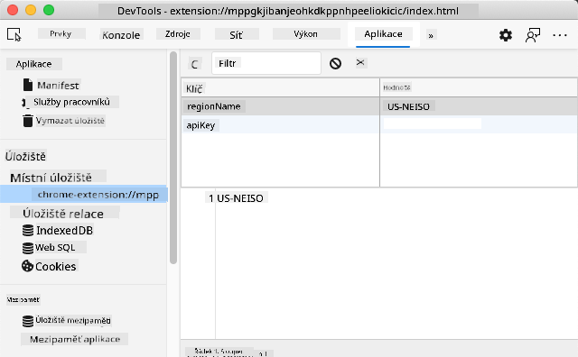

<!--
CO_OP_TRANSLATOR_METADATA:
{
  "original_hash": "8c8cd4af6086cc1d47e1d43aa4983d20",
  "translation_date": "2025-10-24T21:13:28+00:00",
  "source_file": "5-browser-extension/2-forms-browsers-local-storage/README.md",
  "language_code": "cs"
}
-->
# Projekt rozšíření prohlížeče, část 2: Volání API, použití místního úložiště

## Kvíz před přednáškou

[Kvíz před přednáškou](https://ff-quizzes.netlify.app/web/quiz/25)

## Úvod

Pamatujete si na rozšíření prohlížeče, které jste začali vytvářet? Momentálně máte pěkně vypadající formulář, ale je v podstatě statický. Dnes ho oživíme tím, že ho propojíme se skutečnými daty a přidáme mu paměť.

Přemýšlejte o počítačích řídícího střediska mise Apollo - nezobrazovaly jen pevné informace. Neustále komunikovaly s kosmickou lodí, aktualizovaly telemetrická data a pamatovaly si kritické parametry mise. Přesně takové dynamické chování dnes budeme vytvářet. Vaše rozšíření se připojí k internetu, získá skutečná data o životním prostředí a zapamatuje si vaše nastavení pro příště.

Integrace API může znít složitě, ale ve skutečnosti jde jen o to naučit váš kód komunikovat s jinými službami. Ať už získáváte data o počasí, příspěvky ze sociálních sítí nebo informace o uhlíkové stopě, jako to dnes uděláme, jde o navázání těchto digitálních spojení. Také prozkoumáme, jak mohou prohlížeče uchovávat informace - podobně jako knihovny používaly katalogy k zapamatování, kde se nacházejí knihy.

Na konci této lekce budete mít rozšíření prohlížeče, které získává skutečná data, ukládá uživatelské preference a poskytuje plynulý uživatelský zážitek. Pojďme na to!

✅ Postupujte podle očíslovaných segmentů v příslušných souborech, abyste věděli, kam umístit svůj kód.

## Nastavení prvků pro manipulaci v rozšíření

Než váš JavaScript může manipulovat s rozhraním, potřebuje odkazy na konkrétní HTML prvky. Je to jako dalekohled, který musí být zaměřen na konkrétní hvězdy - než mohl Galileo studovat měsíce Jupitera, musel najít a zaměřit Jupiter samotný.

Ve vašem souboru `index.js` vytvoříme proměnné `const`, které zachytí odkazy na každý důležitý prvek formuláře. Je to podobné tomu, jak vědci označují své vybavení - místo toho, aby pokaždé hledali v celé laboratoři, mohou přímo přistupovat k tomu, co potřebují.

```javascript
// form fields
const form = document.querySelector('.form-data');
const region = document.querySelector('.region-name');
const apiKey = document.querySelector('.api-key');

// results
const errors = document.querySelector('.errors');
const loading = document.querySelector('.loading');
const results = document.querySelector('.result-container');
const usage = document.querySelector('.carbon-usage');
const fossilfuel = document.querySelector('.fossil-fuel');
const myregion = document.querySelector('.my-region');
const clearBtn = document.querySelector('.clear-btn');
```

**Co tento kód dělá:**
- **Zachycuje** prvky formuláře pomocí `document.querySelector()` s CSS selektory
- **Vytváří** odkazy na vstupní pole pro název regionu a API klíč
- **Navazuje** spojení s prvky pro zobrazení výsledků dat o uhlíkové spotřebě
- **Nastavuje** přístup k prvkům uživatelského rozhraní, jako jsou indikátory načítání a chybové zprávy
- **Ukládá** každý odkaz na prvek do proměnné `const` pro snadné opakované použití v kódu

## Přidání posluchačů událostí

Nyní zajistíme, aby vaše rozšíření reagovalo na akce uživatele. Posluchači událostí jsou způsobem, jak váš kód monitoruje interakce uživatele. Představte si je jako operátory v raných telefonních ústřednách - poslouchali příchozí hovory a spojovali správné obvody, když někdo chtěl uskutečnit spojení.

```javascript
form.addEventListener('submit', (e) => handleSubmit(e));
clearBtn.addEventListener('click', (e) => reset(e));
init();
```

**Pochopení těchto konceptů:**
- **Připojuje** posluchač odeslání k formuláři, který se aktivuje, když uživatelé stisknou Enter nebo kliknou na odeslání
- **Spojuje** posluchač kliknutí s tlačítkem pro vymazání formuláře
- **Předává** objekt události `(e)` do funkcí obsluhy pro další kontrolu
- **Volá** funkci `init()` okamžitě, aby nastavila počáteční stav vašeho rozšíření

✅ Všimněte si zkrácené syntaxe šipkové funkce použité zde. Tento moderní přístup v JavaScriptu je čistší než tradiční výrazy funkcí, ale oba fungují stejně dobře!

## Vytvoření inicializační a resetovací funkce

Vytvoříme logiku inicializace vašeho rozšíření. Funkce `init()` je jako navigační systém lodi, který kontroluje své přístroje - určuje aktuální stav a podle toho upravuje rozhraní. Zjišťuje, zda někdo vaše rozšíření již použil, a načítá jeho předchozí nastavení.

Funkce `reset()` poskytuje uživatelům čistý začátek - podobně jako vědci resetují své přístroje mezi experimenty, aby zajistili čistá data.

```javascript
function init() {
	// Check if user has previously saved API credentials
	const storedApiKey = localStorage.getItem('apiKey');
	const storedRegion = localStorage.getItem('regionName');

	// Set extension icon to generic green (placeholder for future lesson)
	// TODO: Implement icon update in next lesson

	if (storedApiKey === null || storedRegion === null) {
		// First-time user: show the setup form
		form.style.display = 'block';
		results.style.display = 'none';
		loading.style.display = 'none';
		clearBtn.style.display = 'none';
		errors.textContent = '';
	} else {
		// Returning user: load their saved data automatically
		displayCarbonUsage(storedApiKey, storedRegion);
		results.style.display = 'none';
		form.style.display = 'none';
		clearBtn.style.display = 'block';
	}
}

function reset(e) {
	e.preventDefault();
	// Clear stored region to allow user to choose a new location
	localStorage.removeItem('regionName');
	// Restart the initialization process
	init();
}
```

**Rozbor toho, co se zde děje:**
- **Načítá** uložený API klíč a region z místního úložiště prohlížeče
- **Kontroluje**, zda se jedná o nového uživatele (bez uložených údajů) nebo o vracejícího se uživatele
- **Zobrazuje** formulář nastavení pro nové uživatele a skrývá ostatní prvky rozhraní
- **Automaticky načítá** uložená data pro vracející se uživatele a zobrazuje možnost resetování
- **Spravuje** stav uživatelského rozhraní na základě dostupných dat

**Klíčové koncepty o místním úložišti:**
- **Ukládá** data mezi relacemi prohlížeče (na rozdíl od session storage)
- **Ukládá** data jako páry klíč-hodnota pomocí `getItem()` a `setItem()`
- **Vrací** `null`, když pro daný klíč neexistují žádná data
- **Poskytuje** jednoduchý způsob, jak si zapamatovat uživatelské preference a nastavení

> 💡 **Pochopení úložiště prohlížeče**: [LocalStorage](https://developer.mozilla.org/docs/Web/API/Window/localStorage) je jako dát vašemu rozšíření trvalou paměť. Zvažte, jak starověká Alexandrijská knihovna uchovávala svitky - informace zůstaly dostupné, i když učenci odešli a vrátili se.
>
> **Klíčové vlastnosti:**
> - **Ukládá** data i po zavření prohlížeče
> - **Přežívá** restartování počítače a havárie prohlížeče
> - **Poskytuje** značný úložný prostor pro uživatelské preference
> - **Nabízí** okamžitý přístup bez zpoždění sítě

> **Důležité upozornění**: Vaše rozšíření prohlížeče má své vlastní izolované místní úložiště, které je oddělené od běžných webových stránek. To poskytuje bezpečnost a zabraňuje konfliktům s jinými weby.

Uložená data můžete zobrazit otevřením nástrojů pro vývojáře prohlížeče (F12), přechodem na záložku **Application** a rozbalením sekce **Local Storage**.



> ⚠️ **Bezpečnostní upozornění**: V produkčních aplikacích ukládání API klíčů do LocalStorage představuje bezpečnostní rizika, protože JavaScript může k těmto datům přistupovat. Pro účely učení tento přístup funguje dobře, ale skutečné aplikace by měly používat bezpečné serverové úložiště pro citlivé údaje.

## Zpracování odeslání formuláře

Nyní se podíváme na to, co se stane, když někdo odešle váš formulář. Ve výchozím nastavení prohlížeče při odeslání formuláře znovu načtou stránku, ale my tento proces přerušíme, abychom vytvořili plynulejší zážitek.

Tento přístup odráží způsob, jakým řídící středisko zpracovává komunikaci s kosmickou lodí - místo resetování celého systému pro každou přenosovou zprávu udržují nepřetržitý provoz při zpracování nových informací.

Vytvořte funkci, která zachytí událost odeslání formuláře a extrahuje uživatelský vstup:

```javascript
function handleSubmit(e) {
	e.preventDefault();
	setUpUser(apiKey.value, region.value);
}
```

**V uvedeném kódu jsme:**
- **Zabránili** výchozímu chování odeslání formuláře, které by obnovilo stránku
- **Extrahovali** hodnoty uživatelského vstupu z polí API klíče a regionu
- **Předali** data formuláře funkci `setUpUser()` pro zpracování
- **Udrželi** chování aplikace na jedné stránce tím, že jsme se vyhnuli obnovování stránky

✅ Pamatujte, že vaše HTML pole formuláře obsahují atribut `required`, takže prohlížeč automaticky ověřuje, že uživatelé poskytli jak API klíč, tak region, než tato funkce začne běžet.

## Nastavení uživatelských preferencí

Funkce `setUpUser` je zodpovědná za uložení uživatelských údajů a zahájení prvního volání API. Tím se vytvoří plynulý přechod od nastavení k zobrazení výsledků.

```javascript
function setUpUser(apiKey, regionName) {
	// Save user credentials for future sessions
	localStorage.setItem('apiKey', apiKey);
	localStorage.setItem('regionName', regionName);
	
	// Update UI to show loading state
	loading.style.display = 'block';
	errors.textContent = '';
	clearBtn.style.display = 'block';
	
	// Fetch carbon usage data with user's credentials
	displayCarbonUsage(apiKey, regionName);
}
```

**Krok za krokem, co se zde děje:**
- **Ukládá** API klíč a název regionu do místního úložiště pro budoucí použití
- **Zobrazuje** indikátor načítání, aby informoval uživatele, že se načítají data
- **Vymaže** všechny předchozí chybové zprávy z rozhraní
- **Zviditelňuje** tlačítko pro vymazání, aby uživatelé mohli později resetovat své nastavení
- **Zahajuje** volání API pro získání skutečných dat o uhlíkové spotřebě

Tato funkce vytváří plynulý uživatelský zážitek tím, že koordinovaně spravuje jak uchování dat, tak aktualizace uživatelského rozhraní.

## Zobrazení dat o uhlíkové spotřebě

Nyní připojíme vaše rozšíření k externím zdrojům dat prostřednictvím API. Tím se vaše rozšíření změní z nezávislého nástroje na něco, co může přistupovat k informacím v reálném čase z celého internetu.

**Pochopení API**

[API](https://www.webopedia.com/TERM/A/API.html) jsou způsobem, jakým spolu komunikují různé aplikace. Představte si je jako telegrafní systém, který v 19. století spojoval vzdálená města - operátoři posílali požadavky na vzdálené stanice a dostávali odpovědi s požadovanými informacemi. Pokaždé, když kontrolujete sociální média, ptáte se hlasového asistenta na otázku nebo používáte aplikaci pro doručování, API usnadňují tyto výměny dat.

**Klíčové koncepty o REST API:**
- **REST** znamená 'Representational State Transfer'
- **Používá** standardní HTTP metody (GET, POST, PUT, DELETE) pro interakci s daty
- **Vrací** data v předvídatelných formátech, obvykle JSON
- **Poskytuje** konzistentní URL-based koncové body pro různé typy požadavků

✅ [CO2 Signal API](https://www.co2signal.com/), které použijeme, poskytuje data o intenzitě uhlíku v elektrických sítích po celém světě v reálném čase. To pomáhá uživatelům pochopit dopad jejich spotřeby elektřiny na životní prostředí!

> 💡 **Pochopení asynchronního JavaScriptu**: Klíčové slovo [`async`](https://developer.mozilla.org/docs/Web/JavaScript/Reference/Statements/async_function) umožňuje vašemu kódu zpracovávat více operací současně. Když požadujete data ze serveru, nechcete, aby celé vaše rozšíření zamrzlo - to by bylo jako kdyby řízení letového provozu zastavilo všechny operace, zatímco čeká na odpověď jednoho letadla.
>
> **Klíčové výhody:**
> - **Udržuje** odezvu rozšíření během načítání dat
> - **Umožňuje** pokračování v provádění jiného kódu během síťových požadavků
> - **Zlepšuje** čitelnost kódu ve srovnání s tradičními způsoby zpětného volání
> - **Umožňuje** elegantní zpracování chyb při problémech se sítí

Zde je krátké video o `async`:

[](https://youtube.com/watch?v=YwmlRkrxvkk "Async a Await pro správu slibů")

> 🎥 Klikněte na obrázek výše pro video o async/await.

Vytvořte funkci pro získání a zobrazení dat o uhlíkové spotřebě:

```javascript
// Modern fetch API approach (no external dependencies needed)
async function displayCarbonUsage(apiKey, region) {
	try {
		// Fetch carbon intensity data from CO2 Signal API
		const response = await fetch('https://api.co2signal.com/v1/latest', {
			method: 'GET',
			headers: {
				'auth-token': apiKey,
				'Content-Type': 'application/json'
			},
			// Add query parameters for the specific region
			...new URLSearchParams({ countryCode: region }) && {
				url: `https://api.co2signal.com/v1/latest?countryCode=${region}`
			}
		});

		// Check if the API request was successful
		if (!response.ok) {
			throw new Error(`API request failed: ${response.status}`);
		}

		const data = await response.json();
		const carbonData = data.data;

		// Calculate rounded carbon intensity value
		const carbonIntensity = Math.round(carbonData.carbonIntensity);

		// Update the user interface with fetched data
		loading.style.display = 'none';
		form.style.display = 'none';
		myregion.textContent = region.toUpperCase();
		usage.textContent = `${carbonIntensity} grams (grams CO₂ emitted per kilowatt hour)`;
		fossilfuel.textContent = `${carbonData.fossilFuelPercentage.toFixed(2)}% (percentage of fossil fuels used to generate electricity)`;
		results.style.display = 'block';

		// TODO: calculateColor(carbonIntensity) - implement in next lesson

	} catch (error) {
		console.error('Error fetching carbon data:', error);
		
		// Show user-friendly error message
		loading.style.display = 'none';
		results.style.display = 'none';
		errors.textContent = 'Sorry, we couldn\'t fetch data for that region. Please check your API key and region code.';
	}
}
```

**Rozbor toho, co se zde děje:**
- **Používá** moderní API `fetch()` místo externích knihoven jako Axios pro čistší kód bez závislostí
- **Implementuje** správné ověřování chyb pomocí `response.ok`, aby se chyby API zachytily včas
- **Zpracovává** asynchronní operace pomocí `async/await` pro čitelnější tok kódu
- **Autentizuje** pomocí CO2 Signal API pomocí hlavičky `auth-token`
- **Analyzuje** data JSON z odpovědi a extrahuje informace o intenzitě uhlíku
- **Aktualizuje** více prvků uživatelského rozhraní formátovanými daty o životním prostředí
- **Poskytuje** uživatelsky přívětivé chybové zprávy, když volání API selže

**Klíčové moderní koncepty JavaScriptu:**
- **Šablonové literály** se syntaxí `${}` pro čisté formátování řetězců
- **Zpracování chyb** pomocí bloků try/catch pro robustní aplikace
- **Async/await** vzor pro elegantní zpracování síťových požadavků
- **Destrukturalizace objektů** pro extrakci konkrétních dat z odpovědí API
- **Řetězení metod** pro více manipulací s DOM

✅ Tato funkce demonstruje několik důležitých konceptů webového vývoje - komunikaci s externími servery, zpracování autentizace, zpracování dat, aktualizaci rozhraní a elegantní zpracování chyb. To jsou základní dovednosti, které profesionální vývojáři pravidelně používají.

🎉 **Co jste dosáhli:** Vytvořili jste rozšíření prohlížeče, které:
- **Připojuje se** k internetu a získává skutečná data o životním prostředí
- **Ukládá** uživatelská nastavení mezi relacemi
- **Zpracovává** chyby elegantně místo havárie
- **Poskytuje** plynulý, profesionální uživatelský zážitek

Otestujte svou práci spuštěním `npm run build` a obnovením vašeho rozšíření v prohlížeči. Nyní máte funkční sledovač uhlíkové stopy. V další lekci přidáme funkci dynamických ikon, abychom rozšíření dokončili.

---

## Výzva GitHub Copilot Agent 🚀

Použijte režim Agent k dokončení následující výzvy:

**Popis:** Vylepšete rozšíření prohlížeče přidáním zlepšení zpracování chyb a funkcí uživatelského zážitku. Tato výzva vám pomůže procvičit práci s API, místním úložištěm a manipulací s DOM pomocí moderních vzorů JavaScriptu.

**Zadání:** Vytvořte vylepšenou verzi funkce displayCarbonUsage, která zahrnuje: 1) Mechanismus opakování pro neúspěšná volání API s exponenciálním zpožděním, 2) Validaci vstupu pro kód regionu před provedením volání API, 3) Animaci načítání s indikátory průběhu, 4) Ukládání odpovědí API do localStorage s časovými razítky vypršení platnosti (cache na 30 minut), a 5) Funkci pro zobra
V této lekci jste se naučili o LocalStorage a API, obojí je velmi užitečné pro profesionálního webového vývojáře. Dokážete si představit, jak tyto dvě věci spolupracují? Přemýšlejte o tom, jak byste navrhli webovou stránku, která by ukládala položky, které by byly použity API.

## Úkol

[Přijměte API](assignment.md)

---

**Prohlášení**:  
Tento dokument byl přeložen pomocí služby AI pro překlady [Co-op Translator](https://github.com/Azure/co-op-translator). Ačkoli se snažíme o přesnost, mějte prosím na paměti, že automatizované překlady mohou obsahovat chyby nebo nepřesnosti. Původní dokument v jeho rodném jazyce by měl být považován za autoritativní zdroj. Pro důležité informace se doporučuje profesionální lidský překlad. Neodpovídáme za žádná nedorozumění nebo nesprávné interpretace vyplývající z použití tohoto překladu.