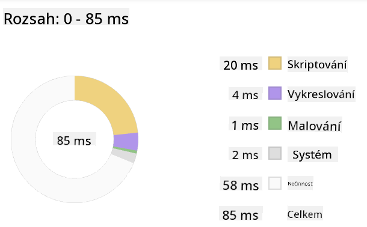

<!--
CO_OP_TRANSLATOR_METADATA:
{
  "original_hash": "eb358f3f4c2c082f9f3a4f98efa1d337",
  "translation_date": "2025-10-24T21:12:42+00:00",
  "source_file": "5-browser-extension/3-background-tasks-and-performance/README.md",
  "language_code": "cs"
}
-->
# Projekt rozšíření pro prohlížeč, část 3: Naučte se o úlohách na pozadí a výkonu

Přemýšleli jste někdy, proč některá rozšíření pro prohlížeče působí svižně a pohotově, zatímco jiná jsou pomalá? Tajemství spočívá v tom, co se děje v zákulisí. Zatímco uživatelé klikají na rozhraní vašeho rozšíření, na pozadí probíhá celá řada procesů, které tiše spravují načítání dat, aktualizace ikon a systémové zdroje.

Toto je naše poslední lekce v sérii o rozšířeních pro prohlížeče a naučíme vás, jak zajistit hladký chod vašeho sledovače uhlíkové stopy. Přidáte dynamické aktualizace ikon a naučíte se, jak odhalit problémy s výkonem dříve, než se stanou skutečným problémem. Je to jako ladění závodního auta – malé optimalizace mohou mít obrovský vliv na to, jak vše funguje.

Až skončíme, budete mít vyleštěné rozšíření a pochopíte principy výkonu, které odlišují dobré webové aplikace od těch skvělých. Pojďme se ponořit do světa optimalizace prohlížečů.

## Kvíz před lekcí

[Kvíz před lekcí](https://ff-quizzes.netlify.app/web/quiz/27)

### Úvod

V našich předchozích lekcích jste vytvořili formulář, připojili ho k API a zvládli asynchronní načítání dat. Vaše rozšíření se pěkně formuje.

Teď je čas přidat poslední úpravy – například změnu barvy ikony rozšíření na základě uhlíkových dat. Připomíná mi to, jak NASA musela optimalizovat každý systém na kosmické lodi Apollo. Nemohli si dovolit žádné zbytečné cykly nebo paměť, protože na výkonu závisely životy. I když naše rozšíření pro prohlížeč není tak kritické, platí stejné principy – efektivní kód vytváří lepší uživatelské zážitky.

## Základy výkonu webu

Když váš kód běží efektivně, lidé to mohou skutečně *cítit*. Znáte ten okamžik, kdy se stránka načte okamžitě nebo animace plynule probíhá? To je práce dobrého výkonu.

Výkon není jen o rychlosti – jde o vytváření webových zážitků, které působí přirozeně, místo aby byly těžkopádné a frustrující. V raných dobách výpočetní techniky si Grace Hopper slavně nechávala na stole nanosekundu (kus drátu asi 30 cm dlouhý), aby ukázala, jak daleko světlo urazí za jednu miliardtinu sekundy. Byla to její způsob, jak vysvětlit, proč na každé mikrosekundě v počítačích záleží. Pojďme prozkoumat nástroje, které vám pomohou zjistit, co zpomaluje věci.

> "Výkon webových stránek je o dvou věcech: jak rychle se stránka načte a jak rychle na ní běží kód." -- [Zack Grossbart](https://www.smashingmagazine.com/2012/06/javascript-profiling-chrome-developer-tools/)

Téma, jak udělat vaše webové stránky bleskově rychlé na všech typech zařízení, pro všechny typy uživatelů, v různých situacích, je pochopitelně rozsáhlé. Zde je několik bodů, které je třeba mít na paměti při vytváření standardního webového projektu nebo rozšíření pro prohlížeč.

Prvním krokem k optimalizaci vašeho webu je pochopení toho, co se skutečně děje pod povrchem. Naštěstí váš prohlížeč má výkonné nástroje pro detekci problémů přímo zabudované.

Chcete-li otevřít Nástroje pro vývojáře v Edge, klikněte na tři tečky v pravém horním rohu, poté přejděte na Další nástroje > Nástroje pro vývojáře. Nebo použijte klávesovou zkratku: `Ctrl` + `Shift` + `I` na Windows nebo `Option` + `Command` + `I` na Macu. Jakmile jste tam, klikněte na kartu Výkon – zde budete provádět své vyšetřování.

**Vaše detektivní sada pro výkon:**
- **Otevřete** Nástroje pro vývojáře (budete je jako vývojář používat neustále!)
- **Přejděte** na kartu Výkon – přemýšlejte o ní jako o fitness trackeru vašeho webového projektu
- **Stiskněte** tlačítko Záznam a sledujte svou stránku v akci
- **Studujte** výsledky, abyste zjistili, co věci zpomaluje

Vyzkoušejte to. Otevřete webovou stránku (Microsoft.com funguje dobře) a klikněte na tlačítko 'Záznam'. Nyní stránku obnovte a sledujte, jak profiler zachycuje vše, co se děje. Když zastavíte záznam, uvidíte podrobný rozpis toho, jak prohlížeč 'skriptuje', 'vykresluje' a 'maluje' stránku. Připomíná mi to, jak řídící středisko monitoruje každý systém během startu rakety – získáte data v reálném čase o tom, co se děje a kdy.

✅ [Microsoft Dokumentace](https://docs.microsoft.com/microsoft-edge/devtools-guide/performance/?WT.mc_id=academic-77807-sagibbon) má spoustu dalších podrobností, pokud se chcete ponořit hlouběji.

> Tip: Před testováním vymažte mezipaměť prohlížeče, abyste viděli, jak vaše stránka funguje pro návštěvníky poprvé – obvykle je to dost odlišné od opakovaných návštěv!

Vyberte prvky časové osy profilu, abyste přiblížili události, které se dějí během načítání stránky.

Získejte snímek výkonu vaší stránky výběrem části časové osy profilu a pohledem na souhrnný panel:



Zkontrolujte panel protokolu událostí, zda některá událost trvala déle než 15 ms:


✅ Seznamte se s profilerem! Otevřete nástroje pro vývojáře na této stránce a zjistěte, zda existují nějaké úzká místa. Jaký je nejpomaleji načítající se prvek? Nejrychlejší?

## Na co se zaměřit při profilování

Spuštění profileru je jen začátek – skutečná dovednost spočívá v tom, vědět, co vám ty barevné grafy vlastně říkají. Nebojte se, naučíte se je číst. Zkušení vývojáři se naučili rozpoznat varovné signály dříve, než se z nich stanou plnohodnotné problémy.

Pojďme si povědět o obvyklých podezřelých – problémech s výkonem, které se často vkrádají do webových projektů. Stejně jako Marie Curie musela pečlivě sledovat úroveň radiace ve své laboratoři, musíme sledovat určité vzory, které naznačují, že se blíží problémy. Jejich včasné odhalení vám (a vašim uživatelům) ušetří spoustu frustrace.

**Velikosti souborů**: Webové stránky se v průběhu let staly "těžšími" a velká část této přidané váhy pochází z obrázků. Je to, jako bychom do našich digitálních kufrů cpali stále více a více.

✅ Podívejte se na [Internet Archive](https://httparchive.org/reports/page-weight), abyste viděli, jak se velikosti stránek v průběhu času zvětšily – je to docela poučné.

**Jak udržet vaše soubory optimalizované:**
- **Komprimujte** obrázky! Moderní formáty jako WebP mohou dramaticky snížit velikost souborů
- **Posílejte** správnou velikost obrázku pro každé zařízení – není třeba posílat obrovské obrázky pro desktop na telefony
- **Minimalizujte** váš CSS a JavaScript – každý bajt se počítá
- **Používejte** lazy loading, aby se obrázky stahovaly pouze tehdy, když uživatelé skutečně k nim posunou stránku

**Procházení DOM**: Prohlížeč musí vytvořit svůj Document Object Model na základě kódu, který napíšete, takže je v zájmu dobrého výkonu stránky udržovat značky na minimu a používat a stylovat pouze to, co stránka potřebuje. Například nadbytečné CSS spojené se stránkou by mohlo být optimalizováno; styly, které je třeba použít pouze na jedné stránce, nemusí být zahrnuty v hlavním stylovém souboru.

**Klíčové strategie pro optimalizaci DOM:**
- **Minimalizujte** počet HTML prvků a úrovní zanoření
- **Odstraňte** nepoužívané CSS pravidla a efektivně konsolidujte stylové soubory
- **Organizujte** CSS tak, aby se načítalo pouze to, co je potřeba pro každou stránku
- **Strukturovat** HTML semanticky pro lepší zpracování prohlížečem

**JavaScript**: Každý vývojář JavaScriptu by měl sledovat 'render-blocking' skripty, které musí být načteny před tím, než může být zbytek DOM procházen a vykreslen do prohlížeče. Zvažte použití `defer` u vašich inline skriptů (jak je to provedeno v modulu Terrarium).

**Moderní techniky optimalizace JavaScriptu:**
- **Používá** atribut `defer` pro načítání skriptů po zpracování DOM
- **Implementuje** rozdělení kódu pro načítání pouze potřebného JavaScriptu
- **Aplikuje** lazy loading pro neklíčové funkce
- **Minimalizuje** použití těžkých knihoven a frameworků, pokud je to možné

✅ Vyzkoušejte některé stránky na [webu pro testování rychlosti stránek](https://www.webpagetest.org/), abyste se dozvěděli více o běžných kontrolách, které se provádějí pro určení výkonu stránky.

Nyní, když máte představu o tom, jak prohlížeč vykresluje soubory, které mu posíláte, podívejme se na posledních pár věcí, které musíte udělat, abyste dokončili své rozšíření:

### Vytvořte funkci pro výpočet barvy

Nyní vytvoříme funkci, která převede číselná data na smysluplné barvy. Přemýšlejte o tom jako o systému semaforu – zelená pro čistou energii, červená pro vysokou uhlíkovou intenzitu.

Tato funkce vezme data o CO2 z našeho API a určí, která barva nejlépe reprezentuje dopad na životní prostředí. Je to podobné tomu, jak vědci používají barevné kódování v tepelných mapách k vizualizaci složitých datových vzorců – od teplot oceánů po formování hvězd. Přidejme to do `/src/index.js`, hned za ty `const` proměnné, které jsme nastavili dříve:

```javascript
function calculateColor(value) {
	// Define CO2 intensity scale (grams per kWh)
	const co2Scale = [0, 150, 600, 750, 800];
	// Corresponding colors from green (clean) to dark brown (high carbon)
	const colors = ['#2AA364', '#F5EB4D', '#9E4229', '#381D02', '#381D02'];

	// Find the closest scale value to our input
	const closestNum = co2Scale.sort((a, b) => {
		return Math.abs(a - value) - Math.abs(b - value);
	})[0];
	
	console.log(`${value} is closest to ${closestNum}`);
	
	// Find the index for color mapping
	const num = (element) => element > closestNum;
	const scaleIndex = co2Scale.findIndex(num);

	const closestColor = colors[scaleIndex];
	console.log(scaleIndex, closestColor);

	// Send color update message to background script
	chrome.runtime.sendMessage({ action: 'updateIcon', value: { color: closestColor } });
}
```

**Rozbor této chytré malé funkce:**
- **Nastaví** dvě pole – jedno pro úrovně CO2, druhé pro barvy (zelená = čistá, hnědá = špinavá!)
- **Najde** nejbližší shodu s naší skutečnou hodnotou CO2 pomocí chytrého třídění pole
- **Získá** odpovídající barvu pomocí metody findIndex()
- **Odešle** zprávu na pozadí skriptu Chrome s vybranou barvou
- **Používá** šablonové literály (ty zpětné uvozovky) pro čistší formátování řetězců
- **Udržuje** vše organizované pomocí deklarací const

`chrome.runtime` [API](https://developer.chrome.com/extensions/runtime) je jako nervový systém vašeho rozšíření – zpracovává veškerou komunikaci a úkoly na pozadí:

> "Použijte API chrome.runtime k získání stránky na pozadí, vrácení podrobností o manifestu a naslouchání a reagování na události v životním cyklu aplikace nebo rozšíření. Toto API můžete také použít k převodu relativní cesty URL na plně kvalifikované URL."

**Proč je Chrome Runtime API tak užitečné:**
- **Umožňuje** různým částem vašeho rozšíření komunikovat mezi sebou
- **Zpracovává** práci na pozadí bez zamrznutí uživatelského rozhraní
- **Spravuje** události životního cyklu vašeho rozšíření
- **Usnadňuje** předávání zpráv mezi skripty

✅ Pokud vyvíjíte toto rozšíření pro Edge, možná vás překvapí, že používáte API Chrome. Novější verze prohlížeče Edge běží na enginu Chromium, takže můžete využívat tyto nástroje.

> **Tip**: Pokud chcete profilovat rozšíření pro prohlížeč, spusťte nástroje pro vývojáře přímo v rozšíření, protože to je samostatná instance prohlížeče. Tím získáte přístup k metrikám výkonu specifickým pro rozšíření.

### Nastavte výchozí barvu ikony

Než začneme načítat skutečná data, dáme našemu rozšíření výchozí bod. Nikdo nemá rád pohled na prázdnou nebo rozbitou ikonu. Začneme zelenou barvou, aby uživatelé věděli, že rozšíření funguje od okamžiku, kdy ho nainstalují.

Ve vaší funkci `init()` nastavíme výchozí zelenou ikonu:

```javascript
chrome.runtime.sendMessage({
	action: 'updateIcon',
	value: {
		color: 'green',
	},
});
```

**Co tato inicializace dosahuje:**
- **Nastaví** neutrální zelenou barvu jako výchozí stav
- **Poskytne** okamžitou vizuální zpětnou vazbu při načítání rozšíření
- **Zavede** komunikační vzor se skriptem na pozadí
- **Zajistí**, že uživatelé uvidí funkční rozšíření před načtením dat

### Zavolejte funkci, proveďte volání

Nyní vše propojujme tak, aby se při příchodu nových dat o CO2 vaše ikona automaticky aktualizovala na správnou barvu. Je to jako spojení posledního obvodu v elektronickém zařízení – najednou všechny jednotlivé komponenty fungují jako jeden systém.

Přidejte tento řádek hned poté, co získáte data o CO2 z API:

```javascript
// After retrieving CO2 data from the API
// let CO2 = data.data[0].intensity.actual;
calculateColor(CO2);
```

**Co tato integrace dosahuje:**
- **Spojuje** tok dat z API se systémem vizuálních indikátorů
- **Automaticky spouští** aktualizace ikon, když přijdou nová data
- **Zajišťuje** vizuální zpětnou vazbu v reálném čase na základě aktuální uhlíkové intenzity
- **Udržuje** oddělení odpovědností mezi načítáním dat a logikou zobrazení

A nakonec, v `/dist/background.js`, přidejte posluchač pro tyto volání akcí na pozadí:

```javascript
// Listen for messages from the content script
chrome.runtime.onMessage.addListener(function (msg, sender, sendResponse) {
	if (msg.action === 'updateIcon') {
		chrome.action.setIcon({ imageData: drawIcon(msg.value) });
	}
});

// Draw dynamic icon using Canvas API
// Borrowed from energy lollipop extension - nice feature!
function drawIcon(value) {
	// Create an offscreen canvas for better performance
	const canvas = new OffscreenCanvas(200, 200);
	const context = canvas.getContext('2d');

	// Draw a colored circle representing carbon intensity
	context.beginPath();
	context.fillStyle = value.color;
	context.arc(100, 100, 50, 0, 2 * Math.PI);
	context.fill();

	// Return the image data for the browser icon
	return context.getImageData(50, 50, 100, 100);
}
```

**Co tento skript na pozadí dělá:**
- **Naslouchá** zprávám z vašeho hlavního skriptu (jako recepční přijímající hovory)
- **Zpracovává** požadavky 'updateIcon' na změnu ikony na panelu nástrojů
- **Vytváří** nové ikony za běhu pomocí Canvas API
- **Kreslí** jednoduchý barevný kruh, který ukazuje aktuální uhlíkovou intenzitu
- **Aktualizuje** panel nástrojů prohlížeče s novou ikonou
- **Používá** OffscreenCanvas pro hladký výkon (bez blokování UI)

✅ O Canvas API se dozvíte více v [lekcích Space Game](../../6-space-game/2-drawing-to-canvas/README.md).

**Čas otestovat vaše rozšíření:**
- **Sestavte** vše pomocí `npm run build`
- **Znovu načtěte** své rozšíření v prohlížeči (nezapomeňte na tento krok)
- **Otevřete** své rozšíření a sledujte, jak se ikona mě
Tady je zajímavá detektivní mise: vyberte si několik open source webů, které existují už roky (například Wikipedia, GitHub nebo Stack Overflow), a prozkoumejte jejich historii commitů. Dokážete najít, kde provedli zlepšení výkonu? Jaké problémy se opakovaně objevovaly?

**Váš přístup k vyšetřování:**
- **Hledejte** v commit zprávách slova jako "optimalizace," "výkon" nebo "rychlejší"
- **Sledujte** vzory - opravují stále stejné typy problémů?
- **Identifikujte** běžné příčiny, které zpomalují weby
- **Sdílejte** své objevy - ostatní vývojáři se mohou poučit z příkladů z praxe

## Kvíz po přednášce

[Kvíz po přednášce](https://ff-quizzes.netlify.app/web/quiz/28)

## Recenze a samostudium

Zvažte přihlášení k odběru [newsletteru o výkonu](https://perf.email/)

Prozkoumejte některé způsoby, jak prohlížeče měří výkon webu, tím, že se podíváte na záložky výkonu v jejich webových nástrojích. Najdete nějaké zásadní rozdíly?

## Zadání

[Analyzujte výkon webu](assignment.md)

---

**Prohlášení**:  
Tento dokument byl přeložen pomocí služby AI pro překlady [Co-op Translator](https://github.com/Azure/co-op-translator). Ačkoli se snažíme o přesnost, mějte prosím na paměti, že automatizované překlady mohou obsahovat chyby nebo nepřesnosti. Původní dokument v jeho rodném jazyce by měl být považován za autoritativní zdroj. Pro důležité informace se doporučuje profesionální lidský překlad. Neodpovídáme za žádná nedorozumění nebo nesprávné interpretace vyplývající z použití tohoto překladu.