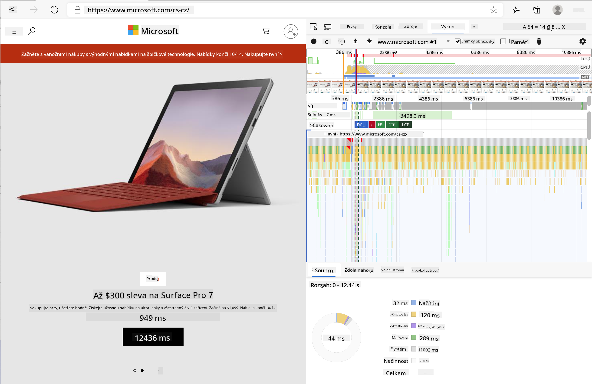

<!--
CO_OP_TRANSLATOR_METADATA:
{
  "original_hash": "b91cbf14240ee59411b96448b994ace1",
  "translation_date": "2025-10-03T12:31:40+00:00",
  "source_file": "5-browser-extension/3-background-tasks-and-performance/README.md",
  "language_code": "cs"
}
-->
# Projekt rozšíření prohlížeče, část 3: Naučte se o úlohách na pozadí a výkonu

## Kvíz před přednáškou

[Kvíz před přednáškou](https://ff-quizzes.netlify.app/web/quiz/27)

### Úvod

V posledních dvou lekcích tohoto modulu jste se naučili, jak vytvořit formulář a zobrazovací oblast pro data získaná z API. Je to velmi standardní způsob, jak vytvořit webovou prezentaci. Dokonce jste se naučili, jak asynchronně získávat data. Vaše rozšíření prohlížeče je téměř hotové.

Zbývá spravovat některé úlohy na pozadí, včetně aktualizace barvy ikony rozšíření, takže je ideální čas promluvit si o tom, jak prohlížeč spravuje tento typ úloh. Pojďme se na tyto úlohy prohlížeče podívat v kontextu výkonu vašich webových prostředků při jejich vytváření.

## Základy výkonu webu

> "Výkon webových stránek je o dvou věcech: jak rychle se stránka načítá a jak rychle na ní běží kód." -- [Zack Grossbart](https://www.smashingmagazine.com/2012/06/javascript-profiling-chrome-developer-tools/)

Téma, jak udělat vaše webové stránky extrémně rychlé na všech typech zařízení, pro všechny typy uživatelů a v různých situacích, je pochopitelně rozsáhlé. Zde je několik bodů, které je třeba mít na paměti při vytváření standardního webového projektu nebo rozšíření prohlížeče.

První věc, kterou musíte udělat, abyste zajistili efektivní běh vašeho webu, je shromáždit data o jeho výkonu. Prvním místem, kde to můžete udělat, jsou vývojářské nástroje vašeho webového prohlížeče. V Edge můžete vybrat tlačítko "Nastavení a další" (ikona tří teček v pravém horním rohu prohlížeče), poté přejít na Další nástroje > Vývojářské nástroje a otevřít kartu Výkon. Klávesové zkratky `Ctrl` + `Shift` + `I` na Windows nebo `Option` + `Command` + `I` na Macu také otevřou vývojářské nástroje.

Karta Výkon obsahuje nástroj Profilování. Otevřete webovou stránku (zkuste například [https://www.microsoft.com](https://www.microsoft.com/?WT.mc_id=academic-77807-sagibbon)) a klikněte na tlačítko 'Záznam', poté stránku obnovte. Záznam můžete kdykoli zastavit a budete moci vidět rutiny, které byly vytvořeny pro 'skriptování', 'renderování' a 'malování' stránky:



✅ Navštivte [Microsoft Dokumentaci](https://docs.microsoft.com/microsoft-edge/devtools-guide/performance/?WT.mc_id=academic-77807-sagibbon) o panelu Výkon v Edge.

> Tip: abyste získali přesné údaje o době spuštění vašeho webu, vymažte mezipaměť prohlížeče.

Vyberte prvky časové osy profilu, abyste přiblížili události, které se odehrávají během načítání vaší stránky.

Získejte snímek výkonu vaší stránky výběrem části časové osy profilu a pohledem na panel souhrnu:


Zkontrolujte panel Log událostí, abyste zjistili, zda některá událost trvala déle než 15 ms:


✅ Seznamte se s profilerem! Otevřete vývojářské nástroje na tomto webu a zjistěte, zda existují nějaké úzké hrdla. Který prostředek se načítá nejpomaleji? Nejrychleji?

## Kontroly profilování

Obecně existují některé "problémové oblasti", na které by měl každý webový vývojář dávat pozor při vytváření webu, aby se vyhnul nepříjemným překvapením při nasazení do produkce.

**Velikosti prostředků**: Web se v posledních letech stal "těžším" a tím pádem pomalejším. Část této váhy souvisí s používáním obrázků.

✅ Prohlédněte si [Internetový archiv](https://httparchive.org/reports/page-weight) pro historický pohled na váhu stránek a další informace.

Dobrou praxí je zajistit, aby vaše obrázky byly optimalizované a doručované ve správné velikosti a rozlišení pro vaše uživatele.

**Procházení DOM**: Prohlížeč musí vytvořit svůj Document Object Model na základě kódu, který napíšete, takže je v zájmu dobrého výkonu stránky udržovat značky minimální, používat a stylovat pouze to, co stránka potřebuje. K tomuto bodu by mohl být optimalizován nadbytečný CSS spojený se stránkou; styly, které je třeba použít pouze na jedné stránce, nemusí být zahrnuty v hlavním stylovém souboru.

**JavaScript**: Každý vývojář JavaScriptu by měl dávat pozor na 'skripty blokující renderování', které musí být načteny před tím, než může být zbytek DOM procházen a vykreslen do prohlížeče. Zvažte použití `defer` u vašich inline skriptů (jak je to provedeno v modulu Terrarium).

✅ Vyzkoušejte některé weby na [webu pro testování rychlosti stránek](https://www.webpagetest.org/), abyste se dozvěděli více o běžných kontrolách, které se provádějí k určení výkonu webu.

Nyní, když máte představu o tom, jak prohlížeč vykresluje prostředky, které mu posíláte, podívejme se na poslední věci, které musíte udělat, abyste dokončili své rozšíření:

### Vytvořte funkci pro výpočet barvy

Pracujte v `/src/index.js` a přidejte funkci nazvanou `calculateColor()` za sérii proměnných `const`, které jste nastavili pro přístup k DOM:

```JavaScript
function calculateColor(value) {
	let co2Scale = [0, 150, 600, 750, 800];
	let colors = ['#2AA364', '#F5EB4D', '#9E4229', '#381D02', '#381D02'];

	let closestNum = co2Scale.sort((a, b) => {
		return Math.abs(a - value) - Math.abs(b - value);
	})[0];
	console.log(value + ' is closest to ' + closestNum);
	let num = (element) => element > closestNum;
	let scaleIndex = co2Scale.findIndex(num);

	let closestColor = colors[scaleIndex];
	console.log(scaleIndex, closestColor);

	chrome.runtime.sendMessage({ action: 'updateIcon', value: { color: closestColor } });
}
```

Co se zde děje? Předáte hodnotu (intenzitu uhlíku) z API volání, které jste dokončili v poslední lekci, a poté vypočítáte, jak blízko je její hodnota indexu uvedenému v poli barev. Poté pošlete tuto nejbližší hodnotu barvy do chrome runtime.

Chrome.runtime má [API](https://developer.chrome.com/extensions/runtime), které zpracovává všechny druhy úloh na pozadí, a vaše rozšíření toho využívá:

> "Použijte chrome.runtime API k získání stránky na pozadí, vrácení podrobností o manifestu a poslouchání a reagování na události v životním cyklu aplikace nebo rozšíření. Toto API můžete také použít k převodu relativní cesty URL na plně kvalifikované URL."

✅ Pokud vyvíjíte toto rozšíření pro Edge, může vás překvapit, že používáte chrome API. Novější verze prohlížeče Edge běží na enginu prohlížeče Chromium, takže můžete využívat tyto nástroje.

> Poznámka: pokud chcete profilovat rozšíření prohlížeče, spusťte vývojářské nástroje přímo z rozšíření, protože je to samostatná instance prohlížeče.

### Nastavte výchozí barvu ikony

Nyní v funkci `init()` nastavte ikonu na obecnou zelenou barvu na začátku tím, že opět zavoláte akci `updateIcon` v chrome:

```JavaScript
chrome.runtime.sendMessage({
	action: 'updateIcon',
		value: {
			color: 'green',
		},
});
```
### Zavolejte funkci, proveďte volání

Dále zavolejte funkci, kterou jste právě vytvořili, přidáním do slibu vráceného API C02Signal:

```JavaScript
//let CO2...
calculateColor(CO2);
```

A nakonec v `/dist/background.js` přidejte posluchač pro tyto volání úloh na pozadí:

```JavaScript
chrome.runtime.onMessage.addListener(function (msg, sender, sendResponse) {
	if (msg.action === 'updateIcon') {
		chrome.action.setIcon({ imageData: drawIcon(msg.value) });
	}
});
//borrowed from energy lollipop extension, nice feature!
function drawIcon(value) {
	let canvas = new OffscreenCanvas(200, 200);
	let context = canvas.getContext('2d');

	context.beginPath();
	context.fillStyle = value.color;
	context.arc(100, 100, 50, 0, 2 * Math.PI);
	context.fill();

	return context.getImageData(50, 50, 100, 100);
}
```

V tomto kódu přidáváte posluchač pro jakékoli zprávy přicházející do správce úloh na pozadí. Pokud je nazván 'updateIcon', pak se spustí následující kód, který nakreslí ikonu správné barvy pomocí Canvas API.

✅ O Canvas API se dozvíte více v [lekcích o vesmírné hře](../../6-space-game/2-drawing-to-canvas/README.md).

Nyní znovu sestavte své rozšíření (`npm run build`), obnovte a spusťte své rozšíření a sledujte změnu barvy. Je vhodný čas na vyřízení pochůzek nebo umytí nádobí? Teď už víte!

Gratulujeme, vytvořili jste užitečné rozšíření prohlížeče a dozvěděli se více o tom, jak prohlížeč funguje a jak profilovat jeho výkon.

---

## 🚀 Výzva

Prozkoumejte některé open source weby, které existují již dlouhou dobu, a na základě jejich historie na GitHubu zjistěte, zda byly v průběhu let optimalizovány pro výkon, pokud vůbec. Jaký je nejčastější problém?

## Kvíz po přednášce

[Kvíz po přednášce](https://ff-quizzes.netlify.app/web/quiz/28)

## Přehled a samostudium

Zvažte přihlášení k odběru [newsletteru o výkonu](https://perf.email/).

Prozkoumejte některé způsoby, jak prohlížeče měří výkon webu, prohlédnutím panelů výkonu ve svých webových nástrojích. Najdete nějaké zásadní rozdíly?

## Úkol

[Analyzujte web z hlediska výkonu](assignment.md)

---

**Upozornění**:  
Tento dokument byl přeložen pomocí služby pro automatický překlad [Co-op Translator](https://github.com/Azure/co-op-translator). I když se snažíme o co největší přesnost, mějte prosím na paměti, že automatické překlady mohou obsahovat chyby nebo nepřesnosti. Za autoritativní zdroj by měl být považován původní dokument v jeho původním jazyce. Pro důležité informace doporučujeme profesionální lidský překlad. Neodpovídáme za žádná nedorozumění nebo nesprávné výklady vyplývající z použití tohoto překladu.