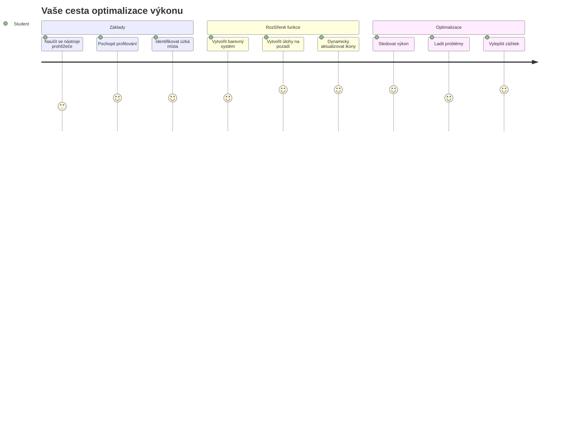
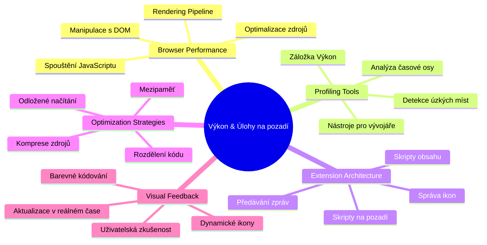
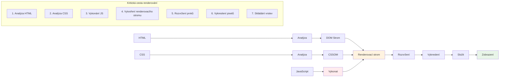
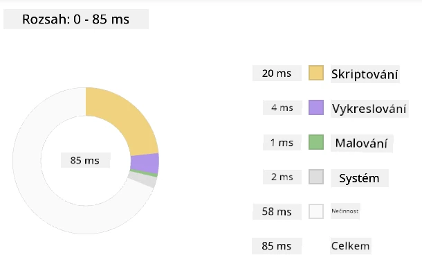
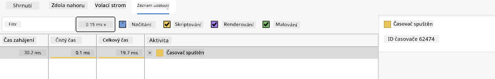
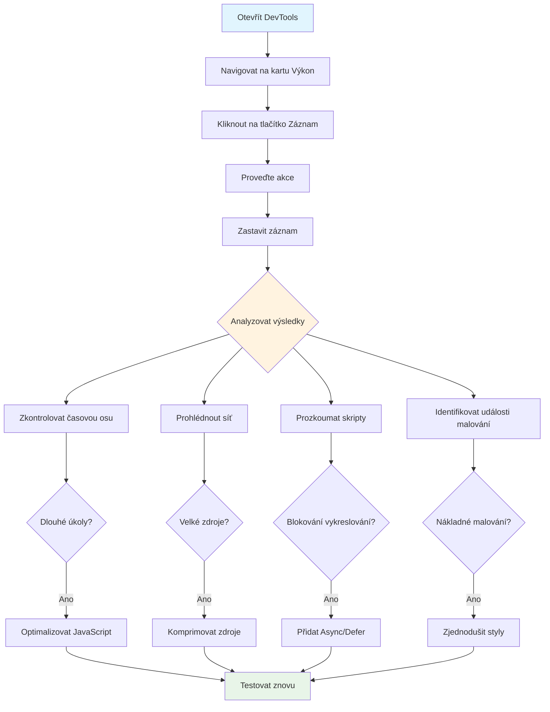
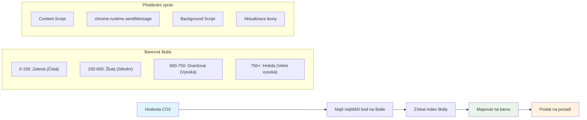
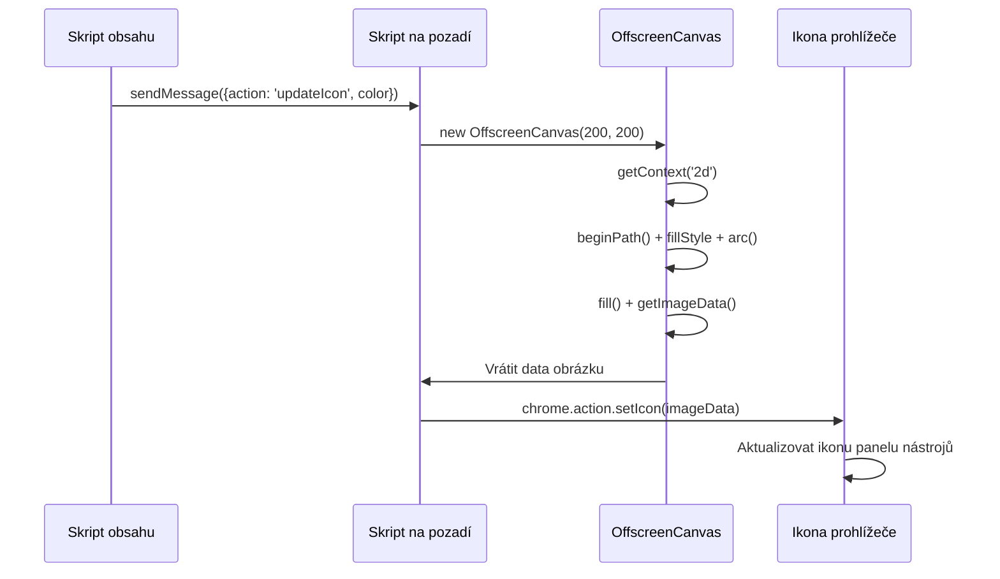
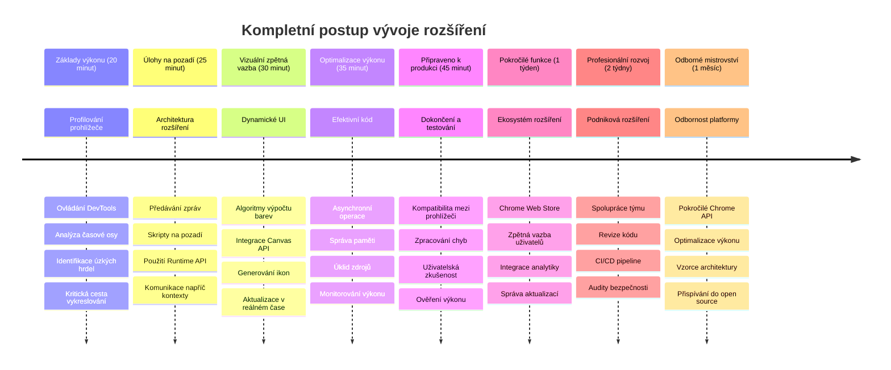

<!--
CO_OP_TRANSLATOR_METADATA:
{
  "original_hash": "b275fed2c6fc90d2b9b6661a3225faa2",
  "translation_date": "2026-01-07T03:48:42+00:00",
  "source_file": "5-browser-extension/3-background-tasks-and-performance/README.md",
  "language_code": "cs"
}
-->
# Browser Extension Project Část 3: Naučte se o Pozadových Úlohách a Výkonu


Zajímalo vás někdy, co způsobuje, že některé rozšíření prohlížeče působí rychle a citlivě, zatímco jiná se zdají pomalá? Tajemství spočívá v tom, co se děje na pozadí. Zatímco uživatelé klikají ve vašem rozhraní rozšíření, existuje celý svět pozadových procesů, které tiše spravují načítání dat, aktualizace ikon a systémové zdroje.

Toto je naše poslední lekce v sérii o rozšířeních prohlížeče a my zajistíme, aby váš sledovač uhlíkové stopy fungoval hladce. Přidáte dynamické aktualizace ikony a naučíte se, jak odhalit výkonové problémy dříve, než se stanou problémy. Je to jako ladění závodního auta - malé optimalizace mohou zásadně změnit, jak vše běží.

Když skončíme, budete mít vyleštěné rozšíření a pochopíte zásady výkonu, které odlišují dobré webové aplikace od skvělých. Pojďme se ponořit do světa optimalizace prohlížeče.

## Pre-Lecture Quiz

[Pre-lecture quiz](https://ff-quizzes.netlify.app/web/quiz/27)

### Úvod

V předchozích lekcích jste vytvořili formulář, připojili ho k API a zvládli asynchronní načítání dat. Vaše rozšíření získává pěkný tvar.

Nyní je třeba přidat poslední úpravy - například aby se ikona rozšíření měnila podle údajů o uhlíku. Připomíná mi to, jak NASA musela optimalizovat každý systém na kosmické lodi Apollo. Nemohli si dovolit žádné zbytečné cykly nebo paměť, protože životy závisely na výkonu. I když naše rozšíření prohlížeče není tak kritické, stejné principy platí - efektivní kód vytváří lepší uživatelské zážitky.


## Základy Webového Výkonu

Když váš kód běží efektivně, lidé ten rozdíl skutečně *cítí*. Znám ten okamžik, když se stránka načte okamžitě nebo animace plyne hladce? To je výsledkem dobrého výkonu.

Výkon není jen o rychlosti - jde o vytváření webových zážitků, které působí přirozeně místo těžkopádně a frustrujícím způsobem. Na začátku počítačové éry měla Grace Hopper slavně na stole kousek drátu o délce asi stopu, aby ukázala, jak daleko se světlo dostane za jednu miliardtinu sekundy. Bylo to její vysvětlení, proč každý mikrosekundový rozdíl v počítání záleží. Podívejme se na detektivní nástroje, které vám pomohou zjistit, co zpomaluje věci.

> "Výkon webové stránky závisí na dvou věcech: jak rychle se stránka načte a jak rychle běží kód na ní." -- [Zack Grossbart](https://www.smashingmagazine.com/2012/06/javascript-profiling-chrome-developer-tools/)

Téma, jak udělat vaše weby bleskově rychlé na všech typech zařízení, pro všechny uživatele a ve všech situacích, je pochopitelně rozsáhlé. Zde je několik bodů, na které byste měli při tvorbě standardního webového projektu nebo rozšíření prohlížeče myslet.

Prvním krokem k optimalizaci vašeho webu je porozumět tomu, co se vlastně děje pod kapotou. Naštěstí máte ve svém prohlížeči zabudované výkonné detektivní nástroje.


Pro otevření Nástrojů pro vývojáře v Edge klikněte na tři tečky vpravo nahoře, pak jděte na Více nástrojů > Nástroje pro vývojáře. Nebo použijte klávesovou zkratku: `Ctrl` + `Shift` + `I` ve Windows nebo `Option` + `Command` + `I` na Macu. Jakmile tam budete, klikněte na záložku Výkon - tady začíná vaše vyšetřování.

**Zde je váš detektivní balíček nástrojů pro výkon:**
- **Otevřete** Nástroje pro vývojáře (budete je jako vývojář stále používat!)
- **Přejděte** na záložku Výkon – představte si ji jako fitness náramek vašeho webu
- **Stiskněte** tlačítko Nahrávat a sledujte stránku v akci
- **Prozkoumejte** výsledky a hledejte, co zpomaluje

Vyzkoušejme to. Otevřete nějakou webovou stránku (Microsoft.com je pro to dobrá) a klikněte na tlačítko 'Nahrávat'. Teď obnovte stránku a sledujte, jak profilovací nástroj zaznamená, co se děje. Když nahrávání zastavíte, uvidíte detailní rozpis, jak prohlížeč 'spouští skripty', 'vykresluje' a 'maluje' stránku. Připomíná mi to, jak řídící středisko sleduje každý systém během startu rakety – máte data v reálném čase o tom, co a kdy se děje.


✅ [Dokumentace Microsoftu](https://docs.microsoft.com/microsoft-edge/devtools-guide/performance/?WT.mc_id=academic-77807-sagibbon) nabízí spoustu dalších detailů, pokud se chcete hlouběji ponořit

> Profesionální tip: Vymažte si cache prohlížeče před testováním, abyste viděli, jak váš web funguje pro návštěvníky při první návštěvě – obvykle je to výrazně jiné než při opakovaných návštěvách!

Vyberte části časové osy profilu pro přiblížení událostí, které se objevují během načítání stránky.

Získejte přehled o výkonu vaší stránky výběrem části časové osy profilu a pohledem do přehledového panelu:



Zkontrolujte panel Protokol událostí, zda nějaká událost netrvala déle než 15 ms:



✅ Seznamte se se svým profilovým nástrojem! Otevřete vývojářské nástroje na této stránce a zjistěte, zda jsou nějaká „hmatatelná“ místa zpomalení. Který prostředek se nejdéle načítá? A který nejrychleji?


## Na Co Se Dívat Při Profilování

Spuštění profilování je teprve začátek - skutečnou dovedností je vědět, co vám vlastně barevné grafy říkají. Nebojte se, naučíte se je číst. Zkušení vývojáři se naučili včas odhalit varovné signály dříve, než se přemění v plnohodnotné problémy.

Pojďme si promluvit o obvyklých podezřelých – výkonnostních vinících, kteří se často vplíží do webových projektů. Stejně jako Marie Curie musela pečlivě monitorovat úrovně radiace ve své laboratoři, my musíme sledovat určité vzory, které naznačují blížící se potíže. Včasné odhalení těchto vzorů vám (a vašim uživatelům) ušetří spoustu frustrace.

**Velikost prostředků:** Webové stránky v průběhu let „ztloustly“ a veliká část té váhy pochází z obrázků. Je to jako kdybychom do našich digitálních kufrů cpali stále více a více věcí.

✅ Podívejte se na [Internet Archive](https://httparchive.org/reports/page-weight), jak se velikosti stránek v čase zvětšily – je to dost odhalující.

**Jak udržet prostředky optimalizované:**
- **Komprimujte** obrázky! Moderní formáty jako WebP mohou výrazně snížit velikost souboru
- **Nabízejte** správnou velikost obrázku pro každé zařízení – není třeba posílat obří desktopové obrázky do telefonů
- **Minimalizujte** CSS a JavaScript – každý bajt se počítá
- **Používejte** lazy loading, takže se obrázky stáhnou až tehdy, když na ně uživatelé skutečně scrollují

**Procházení DOM:** Prohlížeč musí sestavit svůj Document Object Model podle kódu, který napíšete, takže je ve prospěch dobrého výkonu mít minimální počet značek, používat a stylovat jen to, co stránka potřebuje. V této souvislosti by bylo možné optimalizovat přebytečné CSS spojené se stránkou; styly, které jsou potřeba jen na jedné stránce, není třeba zahrnovat do hlavního stylesheetu například.

**Klíčové strategie optimalizace DOM:**
- **Minimalizovat** počet HTML elementů a úrovní vnoření
- **Odebrat** nepoužívaná CSS pravidla a efektivně konsolidovat style sheets
- **Organizovat** CSS tak, aby se načítalo jen to, co je potřeba pro každou stránku
- **Strukturovat** HTML semanticky pro lepší zpracování prohlížečem

**JavaScript:** Každý JavaScriptový vývojář by měl dát pozor na skripty blokující vykreslování, které musí být načteny před tím, než může proběhnout průchod DOM a jeho vykreslení. Zvažte použití atributu `defer` u vašich inline skriptů (jak je to provedeno v modulu Terrarium).

**Moderní techniky optimalizace JavaScriptu:**
- **Používá** atribut `defer` pro načtení skriptů po parsování DOM
- **Implementuje** rozdělení kódu (code splitting), aby se načítaly jen nezbytné části JavaScriptu
- **Aplikuje** lazy loading pro nekritické funkce
- **Minimalizuje** používání těžkých knihoven a frameworků, pokud je to možné

✅ Vyzkoušejte pár webů na [Site Speed Test](https://www.webpagetest.org/), abyste se dozvěděli víc o běžných kontrolách, které se provádějí k určení výkonu webu.

### 🔄 **Pedagogická Kontrola**
**Porozumění Výkonu**: Před tvorbou funkcí rozšíření se ujistěte, že:
- ✅ Dokážete vysvětlit kritickou cestu vykreslování od HTML k pixelům
- ✅ Umíte identifikovat běžné výkonové úzká místa ve webových aplikacích
- ✅ Umíte používat nástroje pro vývojáře k profilování výkonu stránky
- ✅ Rozumíte, jak velikost prostředků a složitost DOM ovlivňují rychlost

**Rychlý Sebetest**: Co se stane, když máte render-blocking JavaScript?
*Odpověď: Prohlížeč musí stáhnout a spustit skript, než může dál parsovat HTML a vykreslovat stránku*

**Dopad Výkonu v Reálném Světě**:
- **100 ms prodleva**: Uživatelé zaznamenají zpomalení
- **1 sekunda prodleva**: Uživatelé začínají ztrácet pozornost
- **3+ sekundy**: 40 % uživatelů stránku opouští
- **Mobilní sítě**: Výkon je ještě důležitější

Nyní, když máte představu, jak prohlížeč vykresluje prostředky, které mu posíláte, pojďme se podívat na poslední kroky, které potřebujete ke dokončení rozšíření:

### Vytvořte funkci pro výpočet barvy

Nyní vytvoříme funkci, která změní číselná data na smysluplné barvy. Představte si to jako semafor – zelená pro čistou energii, červená pro vysokou uhlíkovou intenzitu.

Tato funkce přijme data o CO2 z našeho API a určí, která barva nejlépe reprezentuje dopad na životní prostředí. Je to podobné jako vědci používají barevné kódování v tepelných mapách pro vizualizaci složitých vzorců dat – od teplot oceánů po formování hvězd. Přidáme to do `/src/index.js`, hned za proměnné `const`, které jsme dříve nadefinovali:


```javascript
function calculateColor(value) {
	// Definujte míru intenzity CO2 (gramy na kWh)
	const co2Scale = [0, 150, 600, 750, 800];
	// Odpovídající barvy od zelené (čistá) po tmavě hnědou (vysoký obsah uhlíku)
	const colors = ['#2AA364', '#F5EB4D', '#9E4229', '#381D02', '#381D02'];

	// Najděte nejbližší hodnotu měřítka k našemu vstupu
	const closestNum = co2Scale.sort((a, b) => {
		return Math.abs(a - value) - Math.abs(b - value);
	})[0];
	
	console.log(`${value} is closest to ${closestNum}`);
	
	// Najděte index pro mapování barev
	const num = (element) => element > closestNum;
	const scaleIndex = co2Scale.findIndex(num);

	const closestColor = colors[scaleIndex];
	console.log(scaleIndex, closestColor);

	// Odešlete zprávu o aktualizaci barvy do skriptu na pozadí
	chrome.runtime.sendMessage({ action: 'updateIcon', value: { color: closestColor } });
}
```

**Pojďme si rozebrat tuto chytrou malou funkci:**
- **Nastavuje** dvě pole – jedno pro úrovně CO2, druhé pro barvy (zelená = čistá, hnědá = špinavá!)
- **Najde** nejbližší shodu k naší skutečné hodnotě CO2 pomocí pěkného řazení pole
- **Získá** odpovídající barvu pomocí metody findIndex()
- **Odesílá** zprávu na background skript Chrome s vybranou barvou
- **Používá** template literals (ty zpětné uvozovky) pro čistší formátování řetězců
- **Udržuje** vše organizované pomocí const deklarací

`chrome.runtime` [API](https://developer.chrome.com/extensions/runtime) je jako nervová soustava vašeho rozšíření – zajišťuje veškerou komunikaci a úkoly na pozadí:

> „Použijte chrome.runtime API k získání background stránky, vrácení detailů o manifestu a sledování a reakci na události během životního cyklu aplikace nebo rozšíření. Toto API můžete také použít k převodu relativní cesty URL na plně kvalifikované URL.“

**Proč je Chrome Runtime API tak užitečné:**
- **Umožňuje** různým částem rozšíření mezi sebou komunikovat
- **Zpracovává** práci na pozadí bez zmrazení uživatelského rozhraní
- **Řídí** životní cyklus rozšíření
- **Usnadňuje** předávání zpráv mezi skripty

✅ Pokud vyvíjíte toto rozšíření pro Edge, možná vás překvapí, že používáte chrome API. Novější verze Edge běží na jádře Chromium, takže můžete tyto nástroje využívat.


> **Profesionální tip**: Pokud chcete profilovat rozšíření prohlížeče, spusťte nástroje pro vývojáře přímo z rozšíření, protože jde o samostatnou instanci prohlížeče. To vám umožní přístup k výkonovým metrikám specifickým pro rozšíření.

### Nastavte výchozí barvu ikony

Než začneme načítat skutečná data, dejme našemu rozšíření výchozí bod. Nikdo nerad kouká na prázdnou nebo rozbité vypadající ikonu. Začneme se zelenou barvou, aby uživatelé věděli, že rozšíření funguje hned od instalace.

Ve vaší funkci `init()` nastavme tu výchozí zelenou ikonu:

```javascript
chrome.runtime.sendMessage({
	action: 'updateIcon',
	value: {
		color: 'green',
	},
});
```

**Co tato inicializace dělá:**
- **Nastaví** neutrální zelenou barvu jako výchozí stav
- **Poskytne** okamžitou vizuální odezvu, když se rozšíření načítá
- **Zavede** vzor komunikace s background skriptem
- **Zajistí**, že uživatelé vidí funkční rozšíření před načtením dat

### Zavolejte funkci, proveďte volání

Nyní vše spojíme tak, aby se kdykoliv objeví nová data CO2, vaše ikona automaticky aktualizovala správnou barvu. Je to jako propojit poslední obvod v elektronickém zařízení – najednou všechny součástky fungují jako jeden systém.

Přidejte tento řádek hned po získání dat CO2 z API:

```javascript
// Po získání dat o CO2 z API
// nechte CO2 = data.data[0].intensity.actual;
calculateColor(CO2);
```

**Tato integrace zajišťuje:**
- **Propojuje** tok dat z API s vizuálním indikátorem
- **Spouští** aktualizace ikony automaticky při příchodu nových dat
- **Zajišťuje** vizuální zpětnou vazbu v reálném čase podle aktuální uhlíkové intenzity
- **Udržuje** oddělení mezi načítáním dat a logikou zobrazení

A nakonec do `/dist/background.js` přidejte posluchač na tyto volání na pozadí:

```javascript
// Naslouchejte zprávám ze skriptu obsahu
chrome.runtime.onMessage.addListener(function (msg, sender, sendResponse) {
	if (msg.action === 'updateIcon') {
		chrome.action.setIcon({ imageData: drawIcon(msg.value) });
	}
});

// Nakreslete dynamickou ikonu pomocí Canvas API
// Půjčeno z rozšíření energy lollipop - pěkná funkce!
function drawIcon(value) {
	// Vytvořte offscreen canvas pro lepší výkon
	const canvas = new OffscreenCanvas(200, 200);
	const context = canvas.getContext('2d');

	// Nakreslete barevný kruh reprezentující intenzitu uhlíku
	context.beginPath();
	context.fillStyle = value.color;
	context.arc(100, 100, 50, 0, 2 * Math.PI);
	context.fill();

	// Vraťte obrazová data pro ikonu prohlížeče
	return context.getImageData(50, 50, 100, 100);
}
```

**Co tento background skript dělá:**
- **Poslouchá** zprávy od vašeho hlavního skriptu (jako recepční, který vybírá hovory)
- **Zpracovává** požadavky 'updateIcon' pro změnu ikony na liště
- **Vytváří** nové ikony za běhu pomocí Canvas API
- **Kreslí** jednoduchý barevný kruh znázorňující aktuální uhlíkovou intenzitu
- **Aktualizuje** lištu prohlížeče čerstvou ikonou
- **Používá** OffscreenCanvas pro plynulý výkon (bez blokování UI)

✅ Více o Canvas API se naučíte v lekcích [Space Game](../../6-space-game/2-drawing-to-canvas/README.md).


### 🔄 **Pedagogická Kontrola**
**Kompletní Porozumění Rozšíření:** Ověřte si svou znalost celého systému:
- ✅ Jak funguje předávání zpráv mezi různými skripty rozšíření?
- ✅ Proč používáme OffscreenCanvas místo běžného Canvas kvůli výkonu?
- ✅ Jakou roli hraje Chrome Runtime API v architektuře rozšíření?
- ✅ Jak algoritmus výpočtu barev mapuje data na vizuální zpětnou vazbu?

**Výkonnostní aspekty**: Vaše rozšíření nyní demonstruje:
- **Efektivní zasílání zpráv**: Čistá komunikace mezi skriptovacími kontexty
- **Optimalizované vykreslování**: OffscreenCanvas zabraňuje blokování UI
- **Aktualizace v reálném čase**: Dynamické změny ikon podle živých dat
- **Správa paměti**: Správné čištění a nakládání se zdroji

**Čas otestovat vaše rozšíření:**
- **Sestavte** vše pomocí `npm run build`
- **Znovu načtěte** své rozšíření v prohlížeči (nezapomeňte na tento krok)
- **Otevřete** své rozšíření a sledujte, jak mění barvy ikony
- **Zkontrolujte**, jak reaguje na aktuální data uhlíku z celého světa

Hned budete na první pohled vědět, jestli je dobrý čas na praní nebo jestli počkat na čistší energii. Právě jste vytvořili něco skutečně užitečného a během toho se naučili o výkonu prohlížeče.

## Výzva GitHub Copilot Agent 🚀

Použijte režim Agenta k dokončení následující výzvy:

**Popis:** Vylepšete schopnosti sledování výkonu vašeho rozšíření přidáním funkce, která sleduje a zobrazuje dobu načítání různých komponent rozšíření.

**Úkol:** Vytvořte systém monitorování výkonu pro rozšíření, který změří a zaznamená čas potřebný k načtení dat CO2 z API, výpočtu barev a aktualizaci ikony. Přidejte funkci nazvanou `performanceTracker`, která využívá Performance API ke sledování těchto operací a zobrazuje výsledky v konzoli prohlížeče s časovými značkami a metrikami trvání.

Více o [režimu agenta](https://code.visualstudio.com/blogs/2025/02/24/introducing-copilot-agent-mode) se dozvíte zde.

## 🚀 Výzva

Tady je zajímavá detektivní mise: vyberte několik open source webů, které existují už roky (například Wikipedia, GitHub nebo Stack Overflow) a prozkoumejte jejich historii commitů. Dokážete najít, kde provedli zlepšení výkonu? Jaké problémy se tam opakovaně objevovaly?

**Váš přístup k vyšetřování:**
- **Prohledejte** zprávy commitů podle slov jako „optimize“, „performance“ nebo „faster“
- **Hledejte** vzory – napravují stále stejné typy problémů?
- **Identifikujte** běžné příčiny zpomalování webů
- **Sdílejte** svá zjištění – ostatní vývojáři se učí z reálných příkladů

## Quiz po přednášce

[Post-lecture quiz](https://ff-quizzes.netlify.app/web/quiz/28)

## Recenze & Samostudium

Zvažte přihlášení k [newsletteru o výkonu](https://perf.email/)

Prozkoumejte způsoby, jak prohlížeče měří výkon webu, prohlížením záložek výkonu ve vývojářských nástrojích. Najdete nějaké zásadní rozdíly?

### ⚡ **Co můžete udělat během následujících 5 minut**
- [ ] Otevřít Správce úloh prohlížeče (Shift+Esc v Chrome) a sledovat využití zdrojů rozšíření
- [ ] Použít záložku Performance ve vývojářských nástrojích k zaznamenání a analýze výkonu webu
- [ ] Zkontrolovat stránku Rozšíření v prohlížeči a zjistit, které rozšíření ovlivňují dobu spuštění
- [ ] Zkusit dočasně zakázat rozšíření a porovnat změny výkonu

### 🎯 **Co můžete stihnout během tohoto hodiny**
- [ ] Dokončit kvíz po lekci a pochopit výkonové koncepty
- [ ] Implementovat background script pro vaše rozšíření prohlížeče
- [ ] Naučit se používat browser.alarms pro efektivní úlohy na pozadí
- [ ] Procvičit si předávání zpráv mezi obsahovými a background skripty
- [ ] Měřit a optimalizovat využití zdrojů vašeho rozšíření

### 📅 **Vaše týdenní cesta za výkonem**
- [ ] Dokončit vysoko výkonné rozšíření prohlížeče s funkcemi na pozadí
- [ ] Ovládnout service workery a moderní architekturu rozšíření
- [ ] Implementovat efektivní strategie synchronizace a cacheování dat
- [ ] Naučit se pokročilé techniky ladění výkonu rozšíření
- [ ] Optimalizovat rozšíření pro funkčnost i efektivní využití zdrojů
- [ ] Vytvořit komplexní testy výkonnostních scénářů rozšíření

### 🌟 **Vaše měsíční mistrovství optimalizace**
- [ ] Vytvořit podniková rozšíření prohlížeče s optimálním výkonem
- [ ] Naučit se o Web Workers, Service Workers a moderním výkonu webu
- [ ] Přispět do open source projektů zaměřených na optimalizaci výkonu
- [ ] Ovládnout interní fungování prohlížečů a pokročilé ladící techniky
- [ ] Vytvářet nástroje pro monitorování výkonu a průvodce best practices
- [ ] Stát se expertem na výkon, který pomáhá optimalizovat webové aplikace

## 🎯 Váš časový plán mistrovství v rozšířeních prohlížeče


### 🛠️ Váš kompletní nástroj pro vývoj rozšíření

Po dokončení této trilogie ovládáte:
- **Architekturu prohlížeče**: Hluboké pochopení, jak se rozšíření integrují do systémů prohlížeče
- **Profilování výkonu**: Schopnost identifikovat a opravit úzká místa pomocí vývojářských nástrojů
- **Asynchronní programování**: Moderní JavaScriptové vzory pro responzivní, neblokující operace
- **Integraci API**: Načítání externích dat s autentizací a zpracováním chyb
- **Vizuální design**: Dynamické aktualizace UI a tvorba grafiky založené na Canvasu
- **Předávání zpráv**: Komunikace mezi skripty v architektuře rozšíření
- **Uživatelskou zkušenost**: Stavy načítání, zpracování chyb a intuitivní interakce
- **Produkční dovednosti**: Testování, ladění a optimalizace pro nasazení v reálném světě

**Reálné aplikace**: Dovednosti vývoje rozšíření využijete přímo v:
- **Progressive Web Apps**: Podobná architektura a výkonové vzory
- **Electron desktopových aplikacích**: Multiplatformní aplikace využívající webové technologie
- **Mobilních hybridních aplikacích**: Vývoj Cordova/PhoneGap s webovými API
- **Podnikových webových aplikacích**: Komplexní dashboardy a produktyvné nástroje
- **Chrome DevTools rozšířeních**: Pokročilé nástroje pro vývojáře a ladění
- **Integraci webových API**: Jakákoli aplikace komunikující s externími službami

**Profesionální dopad**: Nyní můžete:
- **Vytvářet** rozšíření prohlížeče připravená k nasazení od konceptu po produkci
- **Optimalizovat** výkon webových aplikací pomocí standardních nástrojů profilování
- **Navrhovat** škálovatelné systémy s správným oddělením odpovědností
- **Ladit** komplexní asynchronní procesy a komunikaci mezi kontexty
- **Přispívat** do open source projektů s rozšířeními a standardů prohlížečů

**Příležitosti pro další růst**:
- **Vývojář pro Chrome Web Store**: Publikujte rozšíření pro miliony uživatelů
- **Inženýr webového výkonu**: Specializujte se na optimalizaci a uživatelský zážitek
- **Vývojář platformy prohlížeče**: Přispívejte k vývoji prohlížečových engine
- **Tvůrce rámců pro rozšíření**: Stavějte nástroje pro pomoc dalším vývojářům
- **Developer Relations**: Sdílejte znalosti výukou a tvorbou obsahu

🌟 **Úspěch dosažen**: Vybudovali jste kompletní, funkční rozšíření prohlížeče demonstrativně používající profesionální vývojové postupy a moderní webové standardy!

## Zadání

[Analyzujte web z hlediska výkonu](assignment.md)

---

<!-- CO-OP TRANSLATOR DISCLAIMER START -->
**Prohlášení o vyloučení odpovědnosti**:  
Tento dokument byl přeložen pomocí AI překladatelské služby [Co-op Translator](https://github.com/Azure/co-op-translator). I když usilujeme o co nejvyšší přesnost, mějte prosím na paměti, že automatizované překlady mohou obsahovat chyby nebo nepřesnosti. Původní dokument v jeho mateřském jazyce by měl být považován za závazný zdroj. Pro kritické informace se doporučuje využít profesionální lidský překlad. Nejsme odpovědni za jakékoli nedorozumění nebo nesprávné výklady vyplývající z použití tohoto překladu.
<!-- CO-OP TRANSLATOR DISCLAIMER END -->