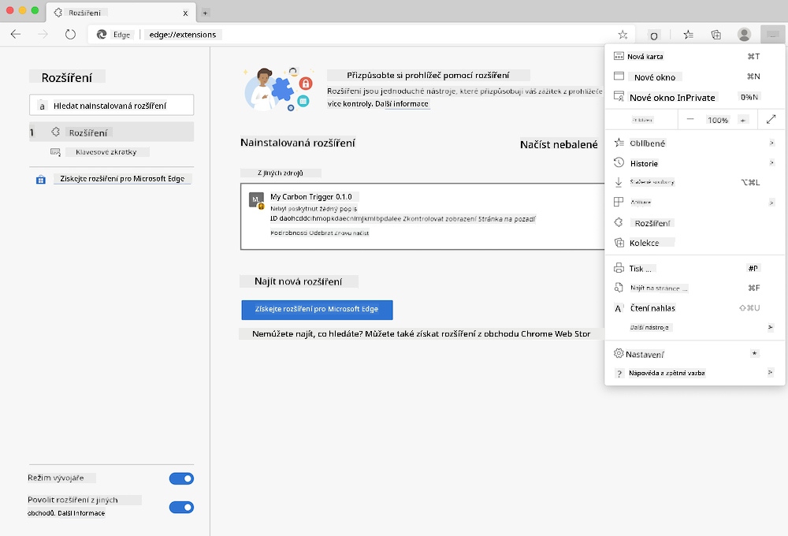

<!--
CO_OP_TRANSLATOR_METADATA:
{
  "original_hash": "9361268ca430b2579375009e1eceb5e5",
  "translation_date": "2025-08-28T03:48:54+00:00",
  "source_file": "5-browser-extension/solution/translation/README.fr.md",
  "language_code": "cs"
}
-->
# Rozšíření prohlížeče Carbon Trigger: Dokončený kód

Pomocí API C02 Signal od tmrow pro sledování spotřeby elektřiny vytvořte rozšíření prohlížeče, které vám umožní mít přímo v prohlížeči připomínku o spotřebě elektřiny ve vaší oblasti. Používání tohoto ad hoc rozšíření vám pomůže činit rozhodnutí o vašich aktivitách na základě těchto informací.


## Začínáme

Budete potřebovat mít nainstalovaný [npm](https://npmjs.com). Stáhněte si kopii tohoto kódu do složky na vašem počítači.

Nainstalujte všechny potřebné balíčky:

```
npm install
```

Sestavte rozšíření pomocí webpacku:

```
npm run build
```

Pro instalaci na Edge použijte nabídku „tři tečky“ v pravém horním rohu prohlížeče a najděte panel Rozšíření. Odtud vyberte „Načíst nekomprimované rozšíření“ pro přidání nového rozšíření. Při výzvě otevřete složku „dist“ a rozšíření se načte. Pro jeho použití budete potřebovat API klíč pro API CO2 Signal ([získejte jej zde e-mailem](https://www.co2signal.com/) – zadejte svůj e-mail do pole na této stránce) a [kód pro vaši oblast](http://api.electricitymap.org/v3/zones) odpovídající [Mapě elektřiny](https://www.electricitymap.org/map) (například v Bostonu používám „US-NEISO“).



Jakmile zadáte API klíč a region do rozhraní rozšíření, barevný bod v liště rozšíření prohlížeče by se měl změnit tak, aby odrážel spotřebu energie ve vaší oblasti, a poskytl vám indikátor, jaké energeticky náročné aktivity by bylo vhodné provádět. Koncept tohoto systému „bodů“ jsem převzal z [rozšíření Energy Lollipop](https://energylollipop.com/) pro kalifornské emise.

---

**Prohlášení**:  
Tento dokument byl přeložen pomocí služby AI pro překlady [Co-op Translator](https://github.com/Azure/co-op-translator). Ačkoli se snažíme o přesnost, mějte prosím na paměti, že automatizované překlady mohou obsahovat chyby nebo nepřesnosti. Původní dokument v jeho původním jazyce by měl být považován za autoritativní zdroj. Pro důležité informace se doporučuje profesionální lidský překlad. Neodpovídáme za žádná nedorozumění nebo nesprávné interpretace vyplývající z použití tohoto překladu.