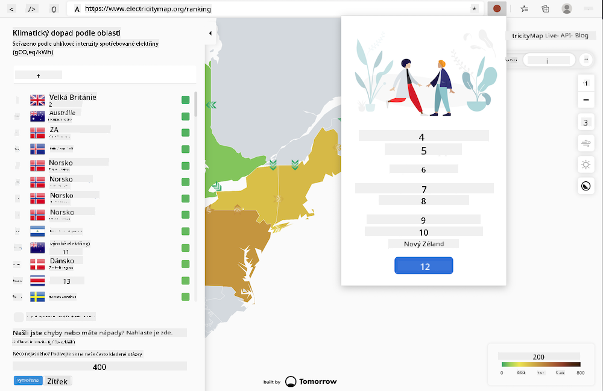

<!--
CO_OP_TRANSLATOR_METADATA:
{
  "original_hash": "dd58ae1b7707034f055718c1b68bc8de",
  "translation_date": "2025-08-28T03:46:18+00:00",
  "source_file": "5-browser-extension/solution/translation/README.hi.md",
  "language_code": "cs"
}
-->
# Rozšíření prohlížeče Carbon Trigger: Hotový kód

Použití API CO2 Signal od tmrow ke sledování spotřeby elektřiny, vytvoření rozšíření prohlížeče, které vám připomene, jak náročné je využívání elektřiny ve vašem regionu. Používání tohoto rozšíření vám pomůže rozhodovat se o vašich aktivitách na základě těchto informací.



## Začínáme

Musíte mít nainstalovaný [npm](https://npmjs.com). Stáhněte si kopii tohoto kódu do složky na vašem počítači.

Nainstalujte všechny potřebné balíčky:

```
npm install
```

Vytvořte rozšíření pomocí webpacku:

```
npm run build
```

Pro instalaci na Edge použijte nabídku „tři tečky“ v pravém horním rohu prohlížeče k nalezení panelu rozšíření. Odtud vyberte „Načíst nebalené“ pro načtení nového rozšíření. V zobrazeném dialogu otevřete složku „dist“ a rozšíření se načte. Pro jeho použití budete potřebovat API klíč CO2 Signal ([získat e-mailem zde](https://www.co2signal.com/) – zadejte svůj e-mail do pole na této stránce) a [kód vašeho regionu](http://api.electricitymap.org/v3/zones) z [Electricity Map](https://www.electricitymap.org/map) (například v Bostonu používám 'US-NEISO').


Jakmile zadáte API klíč a region do rozhraní rozšíření, barevná tečka na liště rozšíření prohlížeče by se měla změnit tak, aby odrážela spotřebu energie ve vašem regionu, a poskytla vám indikátor, které energeticky náročné aktivity jsou pro vás vhodné. Koncept této „tečkové“ metody jsem převzal z rozšíření [Energy Lollipop](https://energylollipop.com/) pro emise v Kalifornii.

---

**Prohlášení**:  
Tento dokument byl přeložen pomocí služby pro automatický překlad [Co-op Translator](https://github.com/Azure/co-op-translator). Ačkoli se snažíme o přesnost, mějte prosím na paměti, že automatické překlady mohou obsahovat chyby nebo nepřesnosti. Původní dokument v jeho původním jazyce by měl být považován za autoritativní zdroj. Pro důležité informace doporučujeme profesionální lidský překlad. Neodpovídáme za žádná nedorozumění nebo nesprávné interpretace vyplývající z použití tohoto překladu.