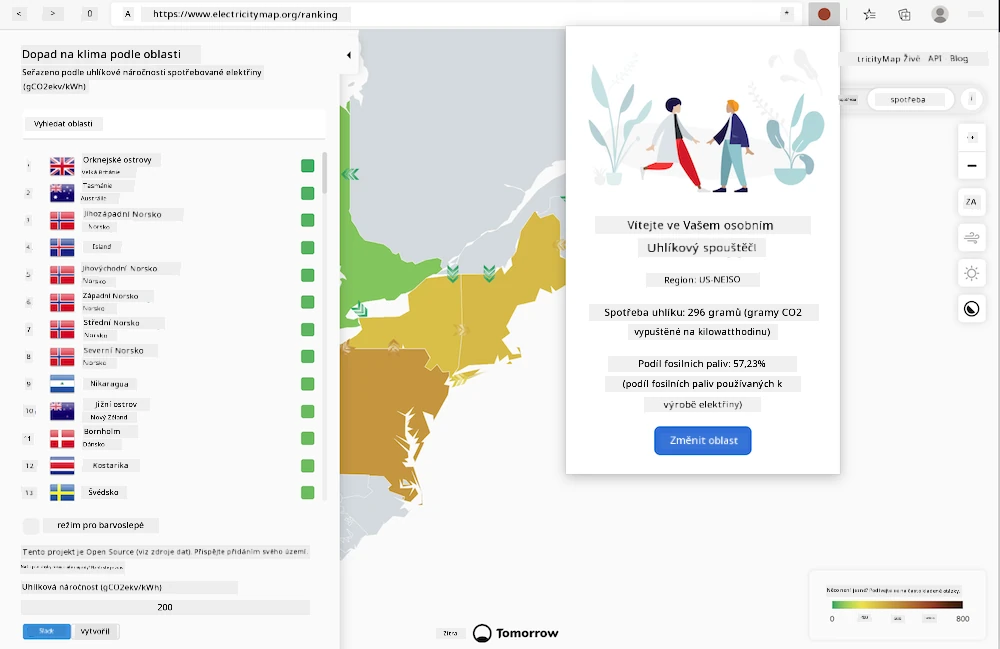
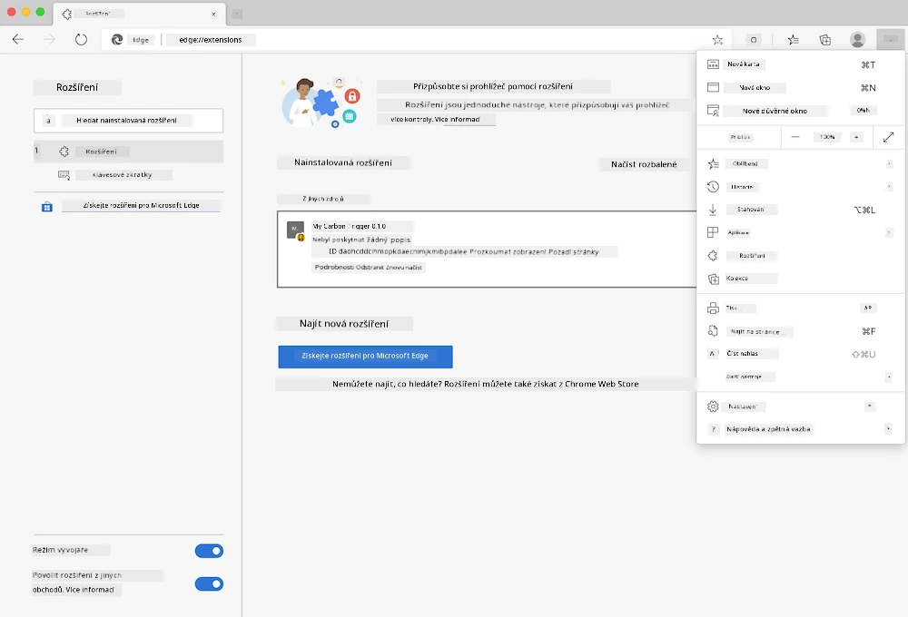

# Rozšíření prohlížeče Carbon Trigger: Kompletní kód

Pomocí API CO2 Signal od tmrow pro sledování spotřeby elektřiny vytvořte rozšíření prohlížeče, které vás bude upozorňovat na aktuální úroveň spotřeby elektřiny ve vašem regionu. Používání tohoto rozšíření vám pomůže lépe zvažovat své aktivity na základě těchto informací.



## Začínáme

Nejprve si nainstalujte [npm](https://npmjs.com). Stáhněte si kopii tohoto kódu do složky na svém počítači.

Nainstalujte všechny potřebné balíčky:

```
npm install
```

Vytvořte rozšíření pomocí webpacku:

```
npm run build
```

Pro instalaci v Edge použijte nabídku „tři tečky“ v pravém horním rohu prohlížeče a najděte panel Rozšíření. Odtud vyberte „Načíst nebalené“ pro přidání nového rozšíření. Otevřete složku „dist“ na výzvu a rozšíření se načte. Pro jeho použití budete potřebovat API klíč pro CO2 Signal ([získejte jej zde prostřednictvím e-mailu](https://www.co2signal.com/) – zadejte svůj e-mail do pole na této stránce) a [kód pro váš region](http://api.electricitymap.org/v3/zones), který odpovídá [Electricity Map](https://www.electricitymap.org/map) (například v Bostonu používám „US-NEISO“).



Jakmile zadáte API klíč a region do rozhraní rozšíření, barevný bod na liště rozšíření prohlížeče se změní tak, aby odrážel spotřebu energie ve vašem regionu, a poskytne vám doporučení ohledně vhodných aktivit. Koncept systému „barevných bodů“ jsem převzal z [rozšíření prohlížeče Energy Lollipop](https://energylollipop.com/) pro Kalifornii.

---

**Prohlášení**:  
Tento dokument byl přeložen pomocí služby pro automatický překlad [Co-op Translator](https://github.com/Azure/co-op-translator). Ačkoli se snažíme o přesnost, mějte prosím na paměti, že automatické překlady mohou obsahovat chyby nebo nepřesnosti. Původní dokument v jeho původním jazyce by měl být považován za autoritativní zdroj. Pro důležité informace se doporučuje profesionální lidský překlad. Neodpovídáme za žádná nedorozumění nebo nesprávné interpretace vyplývající z použití tohoto překladu.