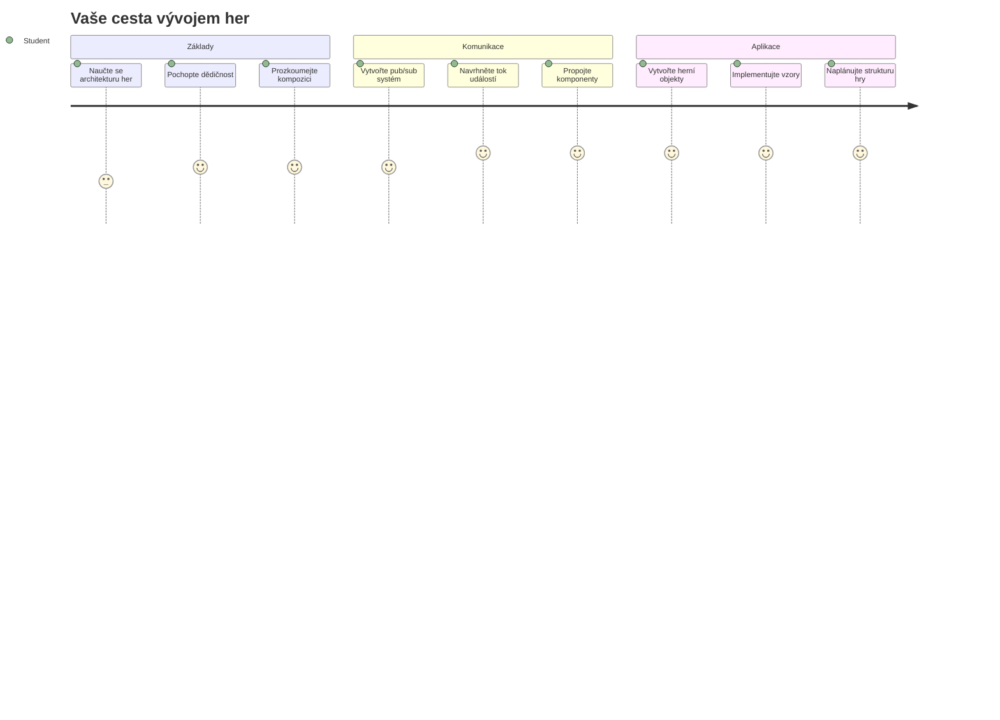
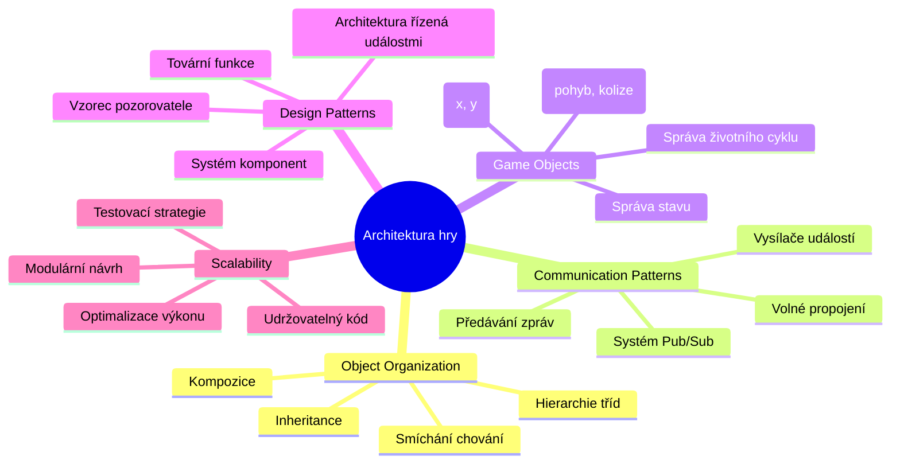
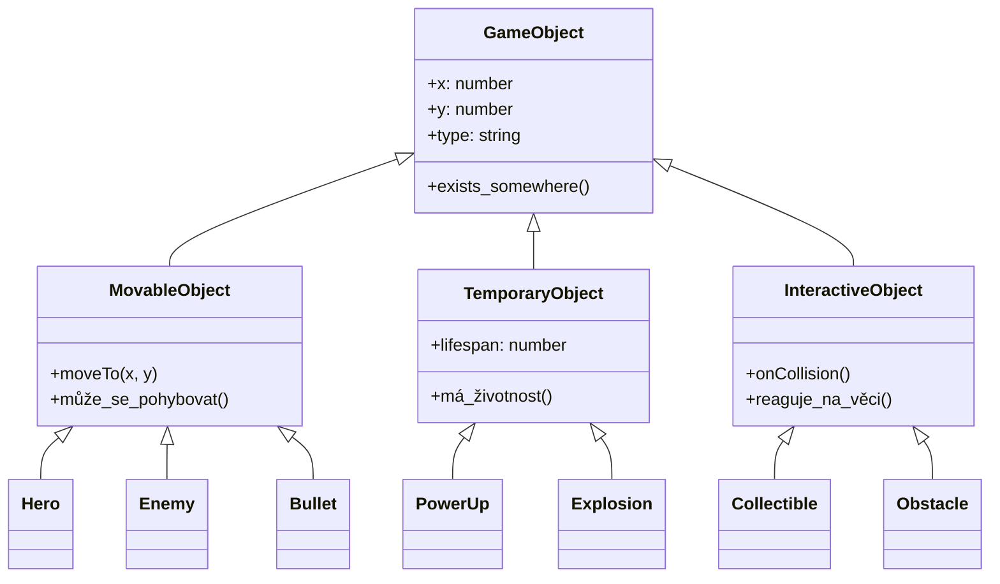
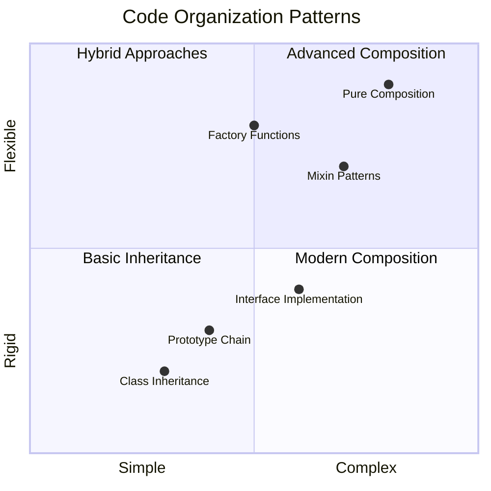
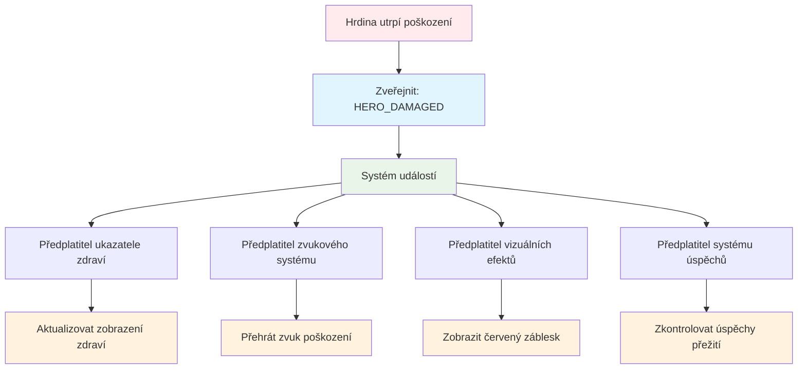
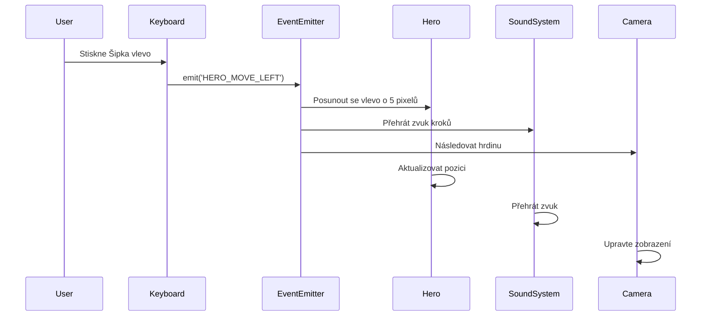
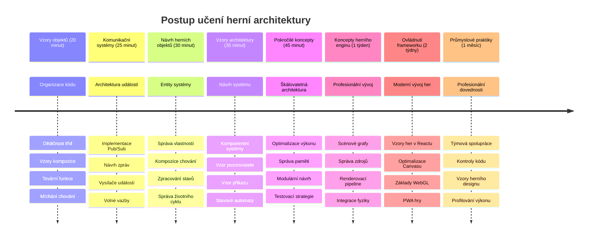

# Vytvořte vesmírnou hru část 1: Úvod




Stejně jako řídící středisko NASA koordinuje během startu vesmírné mise více systémů, vytvoříme vesmírnou hru, která ukáže, jak různé části programu mohou spolu bezproblémově spolupracovat. Při vytváření něčeho, co si skutečně zahrajete, se naučíte základní programovací koncepty, které platí pro jakýkoliv softwarový projekt.

Prozkoumáme dva základní přístupy k organizaci kódu: dědičnost a kompozici. Nejde jen o akademické pojmy – jsou to stejné vzory, které pohánějí vše od videoher až po bankovní systémy. Také implementujeme komunikační systém zvaný pub/sub, který funguje podobně jako komunikační sítě používané ve vesmírných lodích, umožňující různým komponentám sdílet informace, aniž by vytvářely závislosti.

Na konci této série budete rozumět tomu, jak vytvářet aplikace, které mohou škálovat a vyvíjet se – ať už vyvíjíte hry, webové aplikace nebo jiný softwarový systém.


## Přednáškový kvíz

[Přednáškový kvíz](https://ff-quizzes.netlify.app/web/quiz/29)

## Dědičnost a kompozice ve vývoji her

S rostoucí složitostí projektů se organizace kódu stává kritickou. To, co začíná jako jednoduchý skript, může být obtížné udržovat bez správné struktury – podobně jako mise Apollo vyžadovaly pečlivou koordinaci tisíců komponent.

Prozkoumáme dva základní přístupy k organizaci kódu: dědičnost a kompozici. Každý má své výhody a pochopení obou vám pomůže vybrat správný přístup pro různé situace. Tyto koncepty si ukážeme na naší vesmírné hře, kde musí hrdinové, nepřátelé, bonusy a další objekty efektivně spolupracovat.

✅ Jedna z nejslavnějších knih o programování se týká [návrhových vzorů](https://en.wikipedia.org/wiki/Design_Patterns).

V každé hře máte `herní objekty` – interaktivní prvky, které naplňují váš herní svět. Hrdinové, nepřátelé, bonusy a vizuální efekty jsou všechny herní objekty. Každý existuje na konkrétních souřadnicích na obrazovce pomocí hodnot `x` a `y`, podobně jako zaznamenávání bodů na souřadnicové ploše.

Navzdory svým vizuálním rozdílům tyto objekty často sdílejí základní chování:

- **Existují někde** – každý objekt má souřadnice x a y, aby hra věděla, kde ho vykreslit
- **Mnoho z nich se může pohybovat** – hrdinové běží, nepřátelé pronásledují, kulky letí přes obrazovku
- **Mají životnost** – některé trvají navždy, jiné (jako exploze) se objeví krátce a zmizí
- **Reagují na věci** – když dojde ke kolizi, bonusy se sbírají, aktualizují se ukazatele zdraví

✅ Zamyslete se nad hrou jako Pac-Man. Dokážete v této hře identifikovat čtyři typy objektů uvedené výše?


### Vyjádření chování pomocí kódu

Nyní, když rozumíte běžnému chování herních objektů, podívejme se, jak tato chování implementovat v JavaScriptu. Chování objektů můžete vyjádřit metodami připojenými buď ke třídám, nebo individuálním objektům, a existuje několik přístupů, ze kterých si můžete vybrat.

**Přístup založený na třídách**

Třídy a dědičnost poskytují strukturovaný přístup k organizaci herních objektů. Podobně jako taxonomický klasifikační systém vytvořený Carlem Linnaem, začínáte s základní třídou obsahující společné vlastnosti a pak vytváříte specializované třídy, které tyto základy dědí a přidávají specifické schopnosti.

✅ Dědičnost je důležitý koncept k pochopení. Více se dozvíte v [článku MDN o dědičnosti](https://developer.mozilla.org/docs/Web/JavaScript/Inheritance_and_the_prototype_chain).

Zde je, jak můžete implementovat herní objekty pomocí tříd a dědičnosti:

```javascript
// Krok 1: Vytvořte základní třídu GameObject
class GameObject {
  constructor(x, y, type) {
    this.x = x;
    this.y = y;
    this.type = type;
  }
}
```

**Podívejme se na to krok za krokem:**
- Vytváříme základní šablonu, kterou může použít každý herní objekt
- Konstruktor ukládá, kde se objekt nachází (`x`, `y`) a o jaký druh věci jde
- To se stává základem, na kterém všechny vaše herní objekty budou stavět

```javascript
// Krok 2: Přidejte schopnost pohybu prostřednictvím dědění
class Movable extends GameObject {
  constructor(x, y, type) {
    super(x, y, type); // Zavolejte konstruktor nadřazené třídy
  }

  // Přidejte schopnost pohybovat se na nové místo
  moveTo(x, y) {
    this.x = x;
    this.y = y;
  }
}
```

**Výše jsme:**
- **Rozšířili** třídu GameObject pro přidání funkce pohybu
- **Zavolali** rodičovský konstruktor pomocí `super()` pro inicializaci děděných vlastností
- **Přidali** metodu `moveTo()`, která aktualizuje pozici objektu

```javascript
// Krok 3: Vytvořte specifické typy herních objektů
class Hero extends Movable {
  constructor(x, y) {
    super(x, y, 'Hero'); // Nastavte typ automaticky
  }
}

class Tree extends GameObject {
  constructor(x, y) {
    super(x, y, 'Tree'); // Stromy nepotřebují pohyb
  }
}

// Krok 4: Použijte své herní objekty
const hero = new Hero(0, 0);
hero.moveTo(5, 5); // Hrdina se může pohybovat!

const tree = new Tree(10, 15);
// tree.moveTo() by způsobil chybu – stromy se nemohou pohybovat
```

**Pochopení těchto konceptů:**
- **Vytváří** specializované typy objektů, které dědí vhodné chování
- **Ukazuje**, jak dědičnost umožňuje selektivní zahrnutí funkcí
- **Demonstruje**, že hrdinové se mohou pohybovat, zatímco stromy jsou nehybné
- **Ilustruje**, jak hierarchie tříd zabraňuje nevhodným akcím

✅ Věnujte pár minut představení hrdiny z Pac-Mana (například Inky, Pinky nebo Blinky) a jak by byl napsán v JavaScriptu.

**Přístup kompozice**

Kompozice následuje filozofii modulárního designu, podobně jako inženýři navrhují vesmírné lodě s vyměnitelnými komponentami. Místo dědění od rodičovské třídy kombinujete konkrétní chování tak, aby objekty měly přesně tu funkčnost, kterou potřebují. Tento přístup nabízí flexibilitu bez rigidních hierarchických omezení.

```javascript
// Krok 1: Vytvořte základní objekty chování
const gameObject = {
  x: 0,
  y: 0,
  type: ''
};

const movable = {
  moveTo(x, y) {
    this.x = x;
    this.y = y;
  }
};
```

**Tento kód dělá:**
- **Definuje** základní `gameObject` s vlastnostmi pozice a typu
- **Vytváří** samostatný objekt chování `movable` s funkcionalitou pohybu
- **Odděluje** zájmy tím, že data o pozici a logika pohybu jsou nezávislé

```javascript
// Krok 2: Sestavte objekty kombinací chování
const movableObject = { ...gameObject, ...movable };

// Krok 3: Vytvořte tovární funkce pro různé typy objektů
function createHero(x, y) {
  return {
    ...movableObject,
    x,
    y,
    type: 'Hero'
  };
}

function createStatic(x, y, type) {
  return {
    ...gameObject,
    x,
    y,
    type
  };
}
```

**Výše jsme:**
- **Kombinovali** základní vlastnosti objektu s chováním pohybu pomocí spread syntaxe
- **Vytvořili** tovární funkce, které vracejí přizpůsobené objekty
- **Umožnili** flexibilní vytváření objektů bez rigidních hierarchií tříd
- **Dovolili** objektům mít přesně ty chování, která potřebují

```javascript
// Krok 4: Vytvořte a použijte své složené objekty
const hero = createHero(10, 10);
hero.moveTo(5, 5); // Funguje perfektně!

const tree = createStatic(0, 0, 'Tree');
// tree.moveTo() není definováno - žádné chování pohybu nebylo složeno
```

**Klíčové body k zapamatování:**
- **Skládá** objekty mícháním chování místo dědění
- **Poskytuje** více flexibility než rigidní hierarchie dědičnosti
- **Umožňuje** objektům mít přesně ty funkce, které potřebují
- **Používá** moderní JavaScript spread syntax pro čisté skládání objektů
```

**Which Pattern Should You Choose?**

**Which Pattern Should You Choose?**



> 💡 **Profesionální tip**: Oba vzory mají své místo v moderním vývoji JavaScriptu. Třídy dobře fungují pro jasně definované hierarchie, zatímco kompozice vyniká tam, kde potřebujete maximální flexibilitu.
> 
**Kdy použít který přístup:**
- **Zvolte** dědičnost, když existují jasné vztahy "je to" (Hero *je* pohyblivý objekt)
- **Vyberte** kompozici, když potřebujete vztahy "má" (Hero *má* schopnosti pohybu)
- **Zvažte** preference vašeho týmu a požadavky projektu
- **Pamatujte** si, že oba přístupy lze kombinovat v jedné aplikaci

### 🔄 **Pedagogická kontrola**
**Pochopení organizace objektů**: Před přechodem ke komunikačním vzorům se ujistěte, že umíte:
- ✅ Vysvětlit rozdíl mezi dědičností a kompozicí
- ✅ Určit, kdy použít třídy vs tovární funkce
- ✅ Rozumět tomu, jak funguje klíčové slovo `super()` v dědičnosti
- ✅ Uvědomit si výhody každého přístupu pro vývoj her

**Rychlý sebe-test:** Jak byste vytvořili létajícího nepřítele, který se umí pohybovat i létat?
- **Dědičnostní přístup**: `class FlyingEnemy extends Movable`
- **Kompoziční přístup**: `{ ...movable, ...flyable, ...gameObject }`

**Reálné propojení:** Tyto vzory se vyskytují všude:
- **React komponenty**: Props (kompozice) vs dědičnost tříd
- **Herní enginy**: Entity-component systémy používají kompozici
- **Mobilní aplikace**: UI frameworky často využívají hierarchie dědičnosti

## Komunikační vzory: Systém Pub/Sub

S rostoucí komplexitou aplikací se správa komunikace mezi komponentami stává výzvou. Vzor publish-subscribe (pub/sub) tento problém řeší pomocí principů podobných rádiovému vysílání – jeden vysílač může oslovit více přijímačů, aniž by věděl, kdo poslouchá.

Zvažte, co se stane, když hrdina utrží zranění: ukazatel zdraví se aktualizuje, spustí se zvukové efekty, objeví se vizuální zpětná vazba. Místo aby byl objekt hrdiny přímo propojen s těmito systémy, pub/sub umožňuje hrdinovi vyslat zprávu "vzato poškození". Jakýkoliv systém, který chce na tuto zprávu reagovat, se může na ni přihlásit a odpovědět.

✅ **Pub/Sub** znamená 'publish-subscribe' (vydávat-odebírat)


### Pochopení architektury Pub/Sub

Vzor pub/sub udržuje různé části vaší aplikace volně spojeny, což znamená, že mohou spolupracovat, aniž by byly přímo závislé. Toto oddělení činí váš kód lépe udržovatelným, testovatelným a flexibilním vůči změnám.

**Klíčové prvky pub/sub:**
- **Zprávy** – jednoduché textové označení jako `'PLAYER_SCORED'`, které popisuje, co se stalo (plus případné další informace)
- **Vydavatelé** – objekty, které volají "Něco se stalo!" pro všechny, kdo poslouchají
- **Odběratelé** – objekty, které říkají "Tento event mě zajímá" a reagují, když nastane
- **Systém událostí** – prostředník, který zajišťuje, že zprávy dorazí správným posluchačům

### Vytvoření systému událostí

Vytvořme jednoduchý, ale silný systém událostí, který demonstruje tyto koncepty:

```javascript
// Krok 1: Vytvořte třídu EventEmitter
class EventEmitter {
  constructor() {
    this.listeners = {}; // Uložte všechny posluchače událostí
  }
  
  // Zaregistrujte posluchače pro konkrétní typ zprávy
  on(message, listener) {
    if (!this.listeners[message]) {
      this.listeners[message] = [];
    }
    this.listeners[message].push(listener);
  }
  
  // Odeslat zprávu všem zaregistrovaným posluchačům
  emit(message, payload = null) {
    if (this.listeners[message]) {
      this.listeners[message].forEach(listener => {
        listener(message, payload);
      });
    }
  }
}
```

**Rozklad toho, co se zde děje:**
- **Vytváří** centrální systém správy událostí pomocí jednoduché třídy
- **Ukládá** posluchače v objektu podle typu zprávy
- **Registruje** nové posluchače pomocí metody `on()`
- **Vysílá** zprávy všem zainteresovaným posluchačům pomocí `emit()`
- **Podporuje** volitelná data pro předání relevantních informací

### Vše dohromady: Praktický příklad

Podívejme se, jak to funguje v praxi! Vytvoříme jednoduchý pohybový systém, který ukazuje, jak pub/sub může být čistý a flexibilní:

```javascript
// Krok 1: Definujte své typy zpráv
const Messages = {
  HERO_MOVE_LEFT: 'HERO_MOVE_LEFT',
  HERO_MOVE_RIGHT: 'HERO_MOVE_RIGHT',
  ENEMY_SPOTTED: 'ENEMY_SPOTTED'
};

// Krok 2: Vytvořte svůj systém událostí a herní objekty
const eventEmitter = new EventEmitter();
const hero = createHero(0, 0);
```

**Tento kód dělá:**
- **Definuje** objekt konstanta, aby se zabránilo překlepům ve jménech zpráv
- **Vytváří** instanci event emitteru pro veškerou komunikaci
- **Inicializuje** herního hrdinu na výchozí pozici

```javascript
// Krok 3: Nastavení posluchačů událostí (odběratelů)
eventEmitter.on(Messages.HERO_MOVE_LEFT, () => {
  hero.moveTo(hero.x - 5, hero.y);
  console.log(`Hero moved to position: ${hero.x}, ${hero.y}`);
});

eventEmitter.on(Messages.HERO_MOVE_RIGHT, () => {
  hero.moveTo(hero.x + 5, hero.y);
  console.log(`Hero moved to position: ${hero.x}, ${hero.y}`);
});
```

**Výše jsme:**
- **Registrovali** posluchače událostí, kteří reagují na zprávy o pohybu
- **Aktualizovali** pozici hrdiny na základě směru pohybu
- **Přidali** výpisy do konzole pro sledování změn pozice hrdiny
- **Oddělili** logiku pohybu od zpracování vstupu

```javascript
// Krok 4: Připojte vstup z klávesnice k událostem (vydavatelé)
window.addEventListener('keydown', (event) => {
  switch(event.key) {
    case 'ArrowLeft':
      eventEmitter.emit(Messages.HERO_MOVE_LEFT);
      break;
    case 'ArrowRight':
      eventEmitter.emit(Messages.HERO_MOVE_RIGHT);
      break;
  }
});
```

**Pochopení těchto konceptů:**
- **Spojuje** vstup z klávesnice s herními událostmi bez pevného propojení
- **Umožňuje** systému vstupu komunikovat s herními objekty nepřímo
- **Dovoluje** více systémům reagovat na stejné klávesové události
- **Usnadňuje** změnu přiřazení kláves nebo přidání nových vstupních metod


> 💡 **Profesionální tip**: Krása tohoto vzoru je flexibilita! Můžete snadno přidat zvukové efekty, otřesy obrazovky nebo částicové efekty tím, že prostě přidáte další posluchače událostí – nemusíte měnit existující kód klávesnice nebo pohybu.
> 
**Proč budete tento přístup milovat:**
- Přidávání nových funkcí je velmi snadné – stačí poslouchat události, které vás zajímají
- Více věcí může reagovat na stejnou událost, aniž by si navzájem překážely
- Testování je mnohem jednodušší, protože každý kus funguje samostatně
- Když něco nefunguje, víte přesně, kde hledat

### Proč pub/sub efektivně škáluje

Vzor pub/sub zachovává jednoduchost i při růstu složitosti aplikací. Ať už spravujete desítky nepřátel, dynamické aktualizace UI nebo zvukové systémy, vzor zvládá rostoucí měřítko bez změny architektury. Nové funkce se integrují do stávajícího systému událostí, aniž by ovlivnily zavedenou funkčnost.

> ⚠️ **Běžná chyba**: Nevytvářejte příliš mnoho specifických typů zpráv příliš brzy. Začněte s obecnými kategoriemi a upřesňujte je, jak se potřeby vaší hry vyjasní.
> 
**Doporučené postupy:**
- **Skupte** související zprávy do logických kategorií
- **Používejte** popisná jména, která jasně ukazují, co se stalo
- **Držte** zprávy jednoduché a zaměřené
- **Dokumentujte** své typy zpráv pro týmovou spolupráci

### 🔄 **Pedagogická kontrola**
**Pochopení event-driven architektury:** Ověřte si znalost celého systému:
- ✅ Jak vzor pub/sub zabraňuje pevné provázanosti mezi komponentami?
- ✅ Proč je snazší přidávat nové funkce s architekturou řízenou událostmi?
- ✅ Jakou roli hraje EventEmitter v toku komunikace?
- ✅ Jak konstanty zpráv pomáhají předcházet chybám a zlepšují udržovatelnost?

**Návrhová výzva:** Jak byste vyřešili tyto herní scénáře pomocí pub/sub?
1. **Nepřítel zemře**: Aktualizace skóre, přehrání zvuku, vytvoření bonusu, odstranění z obrazovky
2. **Úroveň dokončena**: Zastavení hudby, zobrazení UI, uložení postupu, načtení další úrovně
3. **Bonus sebere**: Zvýšení schopností, aktualizace UI, přehrání efektu, spuštění časovače

**Profesionální propojení:** Tento vzor se vyskytuje v:
- **Front-end frameworky**: React/Vue event systémy
- **Back-end služby**: Komunikace mikroservis
- **Herní enginy**: Unity event systém
- **Mobilní vývoj**: Notifikační systémy iOS/Android

---

## Výzva GitHub Copilot Agenta 🚀

Použijte režim Agenta k dokončení následující výzvy:

**Popis:** Vytvořte jednoduchý systém herních objektů využívající dědičnost i vzor pub/sub. Implementujete základní hru, kde mohou různé objekty komunikovat pomocí událostí, aniž by o sobě přímo věděly.

**Zadání:** Vytvořte herní systém v JavaScriptu s těmito požadavky: 1) Vytvořte základní třídu GameObject se souřadnicemi x, y a vlastností typu. 2) Vytvořte třídu Hero, která dědí z GameObject a může se pohybovat. 3) Vytvořte třídu Enemy, která dědí z GameObject a může pronásledovat hrdinu. 4) Implementujte třídu EventEmitter pro vzor pub/sub. 5) Nastavte posluchače událostí tak, aby když se hrdina pohne, blízcí nepřátelé obdrželi událost 'HERO_MOVED' a aktualizovali svou pozici směrem k hrdinovi. Zahrňte výpisy do konzole, které ukazují komunikaci mezi objekty.

Více o [režimu agent](https://code.visualstudio.com/blogs/2025/02/24/introducing-copilot-agent-mode) se dozvíte zde.

## 🚀 Výzva
Zvažte, jak může vzor pub-sub vylepšit herní architekturu. Identifikujte, které komponenty by měly vysílat události a jak by měl systém reagovat. Navrhněte herní koncept a zmapujte komunikační vzory mezi jeho komponentami.

## Post-Lecture Quiz

[Post-lecture quiz](https://ff-quizzes.netlify.app/web/quiz/30)

## Review & Self Study

Dozvíte se více o Pub/Sub, když si budete [o něm číst](https://docs.microsoft.com/azure/architecture/patterns/publisher-subscriber/?WT.mc_id=academic-77807-sagibbon).

### ⚡ **Co můžete udělat během příštích 5 minut**
- [ ] Otevřít jakoukoli HTML5 hru online a prohlédnout si její kód pomocí DevTools
- [ ] Vytvořit jednoduchý HTML5 Canvas prvek a nakreslit základní tvar
- [ ] Vyzkoušet použití `setInterval` pro vytvoření jednoduché animační smyčky
- [ ] Prozkoumat dokumentaci Canvas API a vyzkoušet nějakou metodu kreslení

### 🎯 **Co vše můžete uskutečnit během této hodiny**
- [ ] Dokončit post-lesson quiz a porozumět konceptům vývoje her
- [ ] Nastavit strukturu projektu hry s HTML, CSS a JavaScriptem
- [ ] Vytvořit základní herní smyčku, která se neustále aktualizuje a vykresluje
- [ ] Nakreslit své první herní sprites na plátno
- [ ] Implementovat základní načítání assetů pro obrázky a zvuky

### 📅 **Váš týdenní tvorba hry**
- [ ] Dokončit kompletní vesmírnou hru se všemi plánovanými funkcemi
- [ ] Přidat propracovanou grafiku, zvukové efekty a plynulé animace
- [ ] Implementovat stavy hry (úvodní obrazovka, hraní, konec hry)
- [ ] Vytvořit systém bodování a sledování pokroku hráče
- [ ] Ujistit se, že hra je responzivní a přístupná na různých zařízeních
- [ ] Sdílet hru online a získat zpětnou vazbu od hráčů

### 🌟 **Váš měsíční vývoj hry**
- [ ] Vytvořit více her s objevováním různých žánrů a mechanik
- [ ] Naučit se herní framework jako Phaser nebo Three.js
- [ ] Přispívat do open source projektů zaměřených na vývoj her
- [ ] Ovládnout pokročilé herní programátorské vzory a optimalizace
- [ ] Vytvořit portfolio prezentující vaše dovednosti ve vývoji her
- [ ] Mentorovat ostatní, kteří mají zájem o vývoj her a interaktivní média

## 🎯 Váš časový plán zvládnutí vývoje her


### 🛠️ Shrnutí vašeho nástroje pro herní architekturu

Po dokončení této lekce máte nyní:
- **Mistrovství vzorů návrhu**: Pochopení kompromisů mezi dědičností a kompozicí
- **Architektura řízená událostmi**: Implementace pub/sub pro škálovatelnou komunikaci
- **Objektově orientovaný design**: Třídní hierarchie a kompozice chování
- **Moderní JavaScript**: Tovární funkce, spread syntax a vzory ES6+
- **Škálovatelná architektura**: Principy volného spojení a modulárního návrhu
- **Základy vývoje her**: Entity systémy a komponentní vzory
- **Profesionální vzory**: Standardní postupy v organizaci kódu

**Reálné aplikace**: Tyto vzory jsou přímo použitelné v:
- **Frontend frameworky**: Architektura komponent React/Vue a správa stavu
- **Backend služby**: Komunikace mikroservis a systémy řízené událostmi
- **Mobilní vývoj**: Architektura iOS/Android aplikací a notifikační systémy
- **Herní enginy**: Unity, Unreal a webový vývoj her
- **Enterprise software**: Event sourcing a návrh distribuovaných systémů
- **API design**: RESTful služby a komunikace v reálném čase

**Získané profesionální dovednosti**: Nyní umíte:
- **Navrhovat** škálovatelnou softwarovou architekturu pomocí osvědčených vzorů
- **Implementovat** systémy řízené událostmi pro zvládnutí složitých interakcí
- **Volit** vhodné strategie organizace kódu pro různé scénáře
- **Ladit** a efektivně udržovat volně propojené systémy
- **Komunikovat** technická rozhodnutí pomocí průmyslově akceptované terminologie

**Další úroveň**: Jste připraveni aplikovat tyto vzory v reálné hře, prozkoumat pokročilé téma vývoje her nebo tyto architektonické koncepty použít pro webové aplikace!

🌟 **Ocenění získáno**: Ovládli jste základní softwarové architektonické vzory, které pohánějí vše od jednoduchých her po složité podnikové systémy!

## Zadání

[Mock up a game](assignment.md)

---

<!-- CO-OP TRANSLATOR DISCLAIMER START -->
**Upozornění**:  
Tento dokument byl přeložen pomocí AI překladatelské služby [Co-op Translator](https://github.com/Azure/co-op-translator). I když usilujeme o přesnost, mějte prosím na paměti, že automatické překlady mohou obsahovat chyby nebo nepřesnosti. Originální dokument v jeho původním jazyce by měl být považován za autoritativní zdroj. Pro důležité informace se doporučuje profesionální lidský překlad. Nejsme odpovědni za jakékoliv nedorozumění či nesprávné výklady vyplývající z použití tohoto překladu.
<!-- CO-OP TRANSLATOR DISCLAIMER END -->