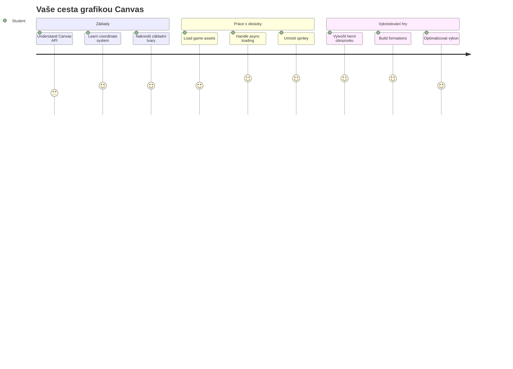
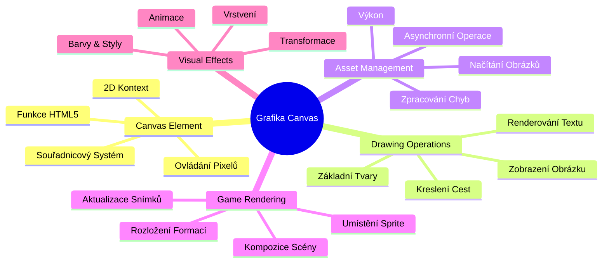
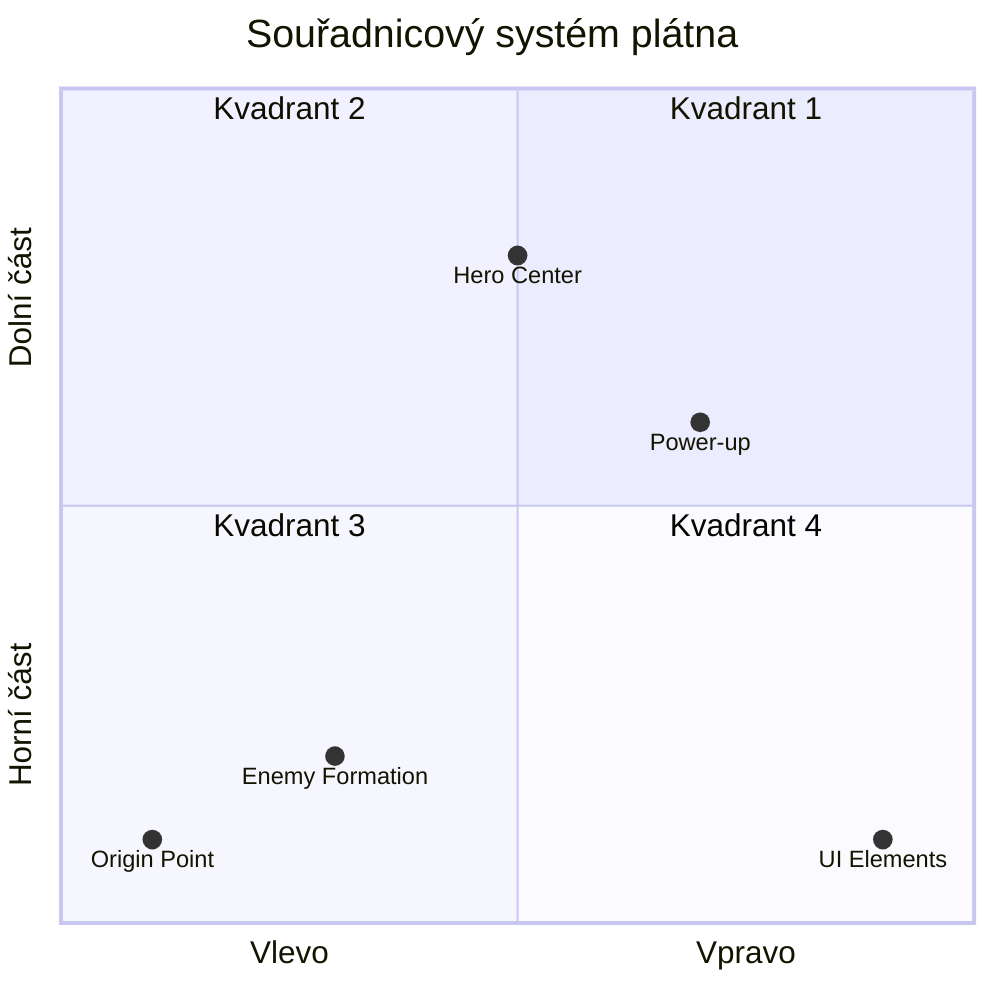
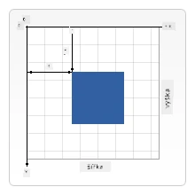
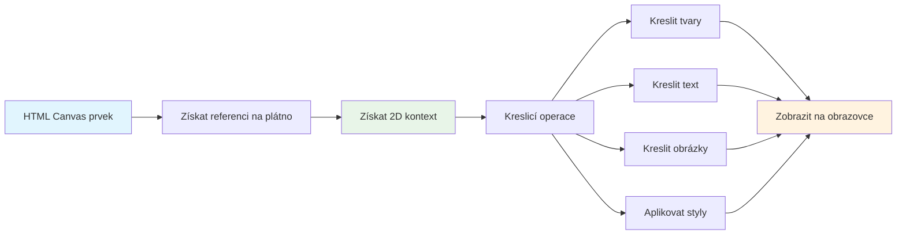
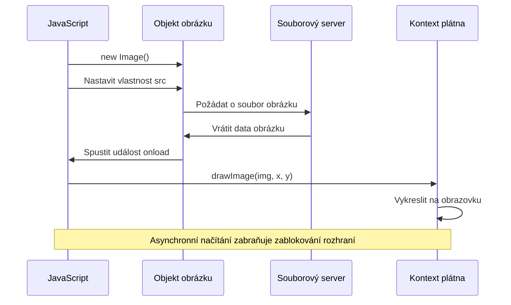
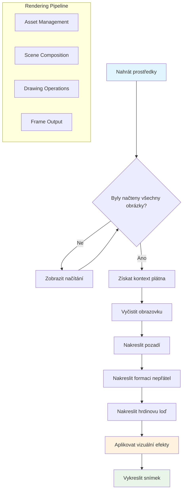
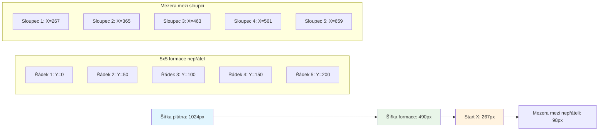
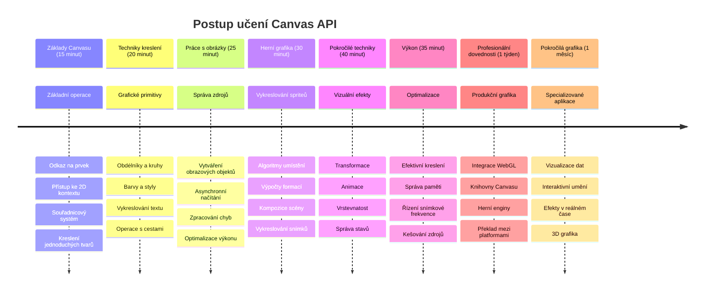

<!--
CO_OP_TRANSLATOR_METADATA:
{
  "original_hash": "7994743c5b21fdcceb36307916ef249a",
  "translation_date": "2026-01-07T03:39:19+00:00",
  "source_file": "6-space-game/2-drawing-to-canvas/README.md",
  "language_code": "cs"
}
-->
# Vytvořte vesmírnou hru část 2: Nakreslete hrdinu a příšery do Canvasu


Canvas API je jednou z nejsilnějších funkcí webového vývoje pro vytváření dynamické, interaktivní grafiky přímo ve vašem prohlížeči. V této lekci proměníme prvek HTML `<canvas>` z prázdné plochy na herní svět plný hrdinů a příšer. Představte si canvas jako svou digitální výtvarnou tabuli, kde se kód mění v obraz.

Navazujeme na to, co jste se naučili v předchozí lekci, a nyní se ponoříme do vizuálních aspektů. Naučíte se, jak načíst a zobrazit herní sprite, přesně umístit prvky a vytvořit vizuální základ pro vaši vesmírnou hru. Tím překleneme propast mezi statickými webovými stránkami a dynamickými, interaktivními zážitky.

Na konci této lekce budete mít kompletní herní scénu s vaším hrdinským lodí správně umístěnou a nepřátelskými formacemi připravenými k boji. Pochopíte, jak moderní hry vykreslují grafiku v prohlížeči, a získáte dovednosti k vytváření vlastních interaktivních vizuálních zážitků. Pojďme prozkoumat grafiku canvasu a oživit vaši vesmírnou hru!


## Přednáškový kvíz

[Přednáškový kvíz](https://ff-quizzes.netlify.app/web/quiz/31)

## Canvas

Co přesně je tento prvek `<canvas>`? Je to řešení HTML5 pro vytváření dynamické grafiky a animací v internetových prohlížečích. Na rozdíl od běžných obrázků nebo videí, která jsou statická, canvas vám dává kontrolu na úrovni pixelů nad vším, co se zobrazuje. To ho činí ideálním pro hry, vizualizace dat a interaktivní umění. Představte si ho jako programovatelný kreslicí povrch, kde je JavaScript vaším štětcem.

Výchozí canvas vypadá jako prázdný, průhledný obdélník na stránce. Ale právě v tom je jeho potenciál! Jeho skutečná síla se ukáže, když použijete JavaScript k vykreslování tvarů, načítání obrázků, vytváření animací a reagování na uživatelské interakce. Je to podobné jako tomu, jak raní průkopníci počítačové grafiky v Bell Labs v 60. letech 20. století museli programovat každý pixel, aby vytvořili první digitální animace.

✅ Přečtěte si [více o Canvas API](https://developer.mozilla.org/docs/Web/API/Canvas_API) na MDN.

Typicky se deklaruje jako součást těla stránky:

```html
<canvas id="myCanvas" width="200" height="100"></canvas>
```

**Co tento kód dělá:**
- **Nastavuje** atribut `id`, abyste mohli tento konkrétní prvek canvas odkazovat v JavaScriptu
- **Definuje** šířku v pixelech pro kontrolu horizontální velikosti canvasu
- **Určuje** výšku v pixelech pro vertikální rozměry canvasu

## Kreslení jednoduché geometrie

Nyní, když víte, co je canvas, pojďme se podívat na to, jak na něm skutečně kreslit! Canvas používá souřadnicový systém, který vám může být známý z matematiky, ale existuje jedno důležité specifikum grafiky pro počítače.

Canvas využívá kartézské souřadnice s osou x (vodorovnou) a osou y (svislou) k umístění všeho, co vykreslíte. Ale klíčový rozdíl je v tom, že počátek `(0,0)` je v levém horním rohu, kde hodnoty x rostou směrem doprava a hodnoty y rostou směrem dolů. Tento přístup pochází z časných počítačových displejů, kde elektronové paprsky skenovaly obrazovku shora dolů, a levý horní roh byl přirozeným výchozím bodem.



> Obrázek z [MDN](https://developer.mozilla.org/docs/Web/API/Canvas_API/Tutorial/Drawing_shapes)

Kreslení na prvek canvas probíhá podle tří kroků, které tvoří základ všech grafických operací. Když si je zopakujete několikrát, stane se to naprosto přirozeným:


1. **Získejte odkaz** na váš prvek Canvas z DOMu (stejně jako na jakýkoliv jiný HTML element)
2. **Získejte 2D rendering kontext** – ten poskytuje všechny kreslící metody
3. **Začněte kreslit!** Použijte vestavěné metody kontextu k vytvoření grafiky

Takto to vypadá v kódu:

```javascript
// Krok 1: Získejte prvek canvas
const canvas = document.getElementById("myCanvas");

// Krok 2: Získejte 2D vykreslovací kontext
const ctx = canvas.getContext("2d");

// Krok 3: Nastavte barvu výplně a nakreslete obdélník
ctx.fillStyle = 'red';
ctx.fillRect(0, 0, 200, 200); // x, y, šířka, výška
```

**Krok za krokem:**
- Získáme canvas element pomocí jeho ID a uložíme jej do proměnné
- Získáme 2D rendering context – to je náš nástroj plný kreslících metod
- Řekneme canvasu, že chceme vyplnit něco červenou barvou pomocí `fillStyle`
- Nakreslíme obdélník začínající v levém horním rohu (0,0) vysoký a široký 200 pixelů

✅ Canvas API se většinou zaměřuje na 2D tvary, ale můžete také kreslit 3D prvky na web pomocí [WebGL API](https://developer.mozilla.org/docs/Web/API/WebGL_API).

S Canvas API můžete kreslit všechny druhy věcí jako:

- **Geometrické tvary** – už jsme ukázali kreslení obdélníku, ale lze kreslit mnohem víc.
- **Text** – můžete kreslit text s libovolným fontem a barvou.
- **Obrázky** – můžete vykreslit obrázek založený na grafickém souboru jako .jpg nebo .png.

✅ Vyzkoušejte to! Umíte nakreslit obdélník, zvládnete také nakreslit kruh na stránku? Podívejte se na zajímavé kresby v Canvas na CodePen. Tady je [obzvlášť působivý příklad](https://codepen.io/dissimulate/pen/KrAwx).

### 🔄 **Pedagogická kontrola**
**Porozumění základům Canvasu**: Než přistoupíte k načítání obrázků, ujistěte se, že:
- ✅ Dokážete vysvětlit, jak se souřadnicový systém canvasu liší od matematických souřadnic
- ✅ Rozumíte třífázovému procesu kreslení na canvas
- ✅ Umíte identifikovat, co poskytuje 2D rendering kontext
- ✅ Umíte popsat, jak spolu pracují `fillStyle` a `fillRect`

**Rychlý test**: Jak byste nakreslili modrý kruh na pozici (100, 50) s poloměrem 25?
```javascript
ctx.fillStyle = 'blue';
ctx.beginPath();
ctx.arc(100, 50, 25, 0, 2 * Math.PI);
ctx.fill();
```

**Metody kreslení canvasu, které už znáte:**
- **fillRect()**: Kreslí vyplněné obdélníky
- **fillStyle**: Nastavuje barvy a vzory
- **beginPath()**: Začíná nové cesty pro kreslení
- **arc()**: Vytváří kruhy a křivky

## Načtení a vykreslení obrázkové assety

Kreslení základních tvarů je užitečné pro začátek, ale většina her potřebuje skutečné obrázky! Sprite, pozadí a textury jsou to, co dává hrám jejich vizuální přitažlivost. Načítání a zobrazování obrázků na canvasu funguje jinak než kreslení geometrických tvarů, ale je to jednoduché, jakmile pochopíte postup.

Musíme vytvořit objekt `Image`, načíst náš soubor obrázku (to probíhá asynchronně, tedy „na pozadí“), a pak jej vykreslit na canvas, jakmile je připravený. Tento přístup zajistí, že se obrázky zobrazí správně, aniž by aplikace zamrzla během načítání.


### Základní načítání obrázků

```javascript
const img = new Image();
img.src = 'path/to/my/image.png';
img.onload = () => {
  // Obrázek načten a připraven k použití
  console.log('Image loaded successfully!');
};
```

**Co se v tomto kódu děje:**
- Vytvoříme nový objekt Image, který bude držet náš sprite nebo texturu
- Řekneme mu, který obrázek má načíst nastavením zdrojové cesty
- Posloucháme událost "load", abychom přesně věděli, kdy je obrázek připraven k použití

### Lepší způsob načítání obrázků

Tady je robustnější způsob, jak pracovat s načítáním obrázků, který profesionální vývojáři běžně používají. Zabalíme načítání obrázků do Promise-funkce – tento přístup, zpopularizovaný kdy JavaScript Promises přišly do ES6, usnadňuje organizaci kódu a elegantní zpracování chyb:

```javascript
function loadAsset(path) {
  return new Promise((resolve, reject) => {
    const img = new Image();
    img.src = path;
    img.onload = () => {
      resolve(img);
    };
    img.onerror = () => {
      reject(new Error(`Failed to load image: ${path}`));
    };
  });
}

// Moderní použití s async/await
async function initializeGame() {
  try {
    const heroImg = await loadAsset('hero.png');
    const monsterImg = await loadAsset('monster.png');
    // Obrázky jsou nyní připraveny k použití
  } catch (error) {
    console.error('Failed to load game assets:', error);
  }
}
```

**Co jsme zde udělali:**
- Zabalili jsme všechnu logiku načítání obrázků do Promise, abychom to mohli lépe ovládat
- Přidali zpracování chyb, které nám skutečně řekne, když něco selže
- Použili moderní async/await syntaxi, protože je mnohem přehlednější na čtení
- Zařadili bloky try/catch pro elegantní zachycení jakýchkoli problémů s načítáním

Jakmile jsou obrázky načtené, vykreslení na canvas je vlastně jednoduché:

```javascript
async function renderGameScreen() {
  try {
    // Načíst herní zdroje
    const heroImg = await loadAsset('hero.png');
    const monsterImg = await loadAsset('monster.png');

    // Získat plátno a kontext
    const canvas = document.getElementById("myCanvas");
    const ctx = canvas.getContext("2d");

    // Nakreslit obrázky na specifické pozice
    ctx.drawImage(heroImg, canvas.width / 2, canvas.height / 2);
    ctx.drawImage(monsterImg, 0, 0);
  } catch (error) {
    console.error('Failed to render game screen:', error);
  }
}
```

**Projdeme to krok za krokem:**
- Asynchronně načteme obrázky hrdiny a příšery pomocí await
- Získáme canvas element a potřebný 2D rendering kontext
- Umístíme obrázek hrdiny přesně do středu pomocí jednoduché souřadnicové matematiky
- Umístíme obrázek příšery do levého horního rohu, kde začíná nepřátelská formace
- Zachytíme případné chyby během načítání či vykreslování


## Teď je čas začít stavět vaši hru

Teď vše spojíme, abychom vytvořili vizuální základ vaší vesmírné hry. Máte pevné základy v canvasu i v technikách načítání obrázků, takže tato praktická část vás provede vytvářením kompletní herní obrazovky se správně umístěnými sprity.

### Co postavit

Vytvoříte webovou stránku s prvkem Canvas. Měla by vykreslit černou obrazovku o velikosti `1024*768`. Máte k dispozici dva obrázky:

- Hrdinský lodní plavidlo

   

- 5×5 formace příšer

   

### Doporučené kroky pro začátek vývoje

Najděte výchozí soubory, které jsou pro vás připraveny ve složce `your-work`. Vaše projektová struktura by měla obsahovat:

```bash
your-work/
├── assets/
│   ├── enemyShip.png
│   └── player.png
├── index.html
├── app.js
└── package.json
```

**S čím pracujete:**
- **Herní sprity** jsou ve složce `assets/`, aby vše bylo organizované
- **Hlavní HTML soubor** nastavuje prvek canvas a vše připravuje
- **JavaScriptový soubor**, kde napíšete všechna kouzla vykreslování hry
- **package.json**, který nastavuje vývojový server pro lokální testování

Otevřete tuto složku ve Visual Studio Code a začněte vyvíjet. Budete potřebovat lokální vývojové prostředí s Visual Studio Code, NPM a Node.js. Pokud nemáte na počítači `npm`, [tady je návod, jak jej nainstalovat](https://www.npmjs.com/get-npm).

Spusťte vývojový server přes `your-work` složku:

```bash
cd your-work
npm start
```

**Co tento příkaz dělá:**
- **Spustí** lokální server na `http://localhost:5000`, abyste mohli testovat vaši hru
- **Servíruje** všechny vaše soubory tak, aby je prohlížeč správně načítal
- **Sleduje** změny souborů, abyste mohli vývojovat hladce
- **Poskytuje** profesionální vývojové prostředí pro testování

> 💡 **Poznámka**: Prohlížeč se ze začátku ukáže prázdná stránka – to je normální! Jak budete přidávat kód, obnovujte stránku, abyste viděli změny. Tento iterativní přístup byl podobný tomu, jak NASA stavěla Apollo navigační počítač – testovala každou komponentu před integrací do většího systému.

### Přidejte kód

Do `your-work/app.js` přidejte potřebný kód pro dokončení těchto úkolů:

1. **Nakreslete canvas s černým pozadím**
   > 💡 **Jak na to**: Najděte TODO ve `/app.js` a přidejte jen dvě řádky. Nastavte `ctx.fillStyle` na černou, pak použijte `ctx.fillRect()` od (0,0) s rozměry canvasu. Jednoduché!

2. **Načtěte herní textury**
   > 💡 **Jak na to**: Pomocí `await loadAsset()` načtěte obrázky hráče a nepřítele. Uložte je do proměnných pro pozdější použití. Pamatujte, že se zobrazí až při vykreslení!

3. **Nakreslete hrdinovu loď ve středu dole**
   > 💡 **Jak na to**: Pomocí `ctx.drawImage()` umístěte hrdinu. Pro x použijte `canvas.width / 2 - 45` pro vycentrování, pro y `canvas.height - canvas.height / 4`, aby se zobrazil dole.

4. **Nakreslete 5×5 formace nepřátelských lodí**
   > 💡 **Jak na to**: Najděte funkci `createEnemies` a nastavte vnořené smyčky. Budete muset počítat odsazení a pozice, ale nebojte – ukážu vám to přesně!

Nejprve nastavte konstanty pro správné rozložení formace nepřátel:

```javascript
const ENEMY_TOTAL = 5;
const ENEMY_SPACING = 98;
const FORMATION_WIDTH = ENEMY_TOTAL * ENEMY_SPACING;
const START_X = (canvas.width - FORMATION_WIDTH) / 2;
const STOP_X = START_X + FORMATION_WIDTH;
```

**Co tyto konstanty znamenají:**
- Nastavujeme 5 nepřátel na řádek i sloupec (hezká 5×5 mřížka)
- Definujeme, kolik místa bude mezi nepřáteli, aby nebyli stlačení
- Vypočítáme celkovou šířku formace
- Určujeme, kde začít a skončit, aby formace byla vycentrovaná


Pak vytvořte vnořené smyčky pro vykreslení formace:

```javascript
for (let x = START_X; x < STOP_X; x += ENEMY_SPACING) {
  for (let y = 0; y < 50 * 5; y += 50) {
    ctx.drawImage(enemyImg, x, y);
  }
}
```

**Co tato smyčka dělá:**
- Vnější smyčka se pohybuje zleva doprava přes formaci
- Vnitřní smyčka jde shora dolů, vytváří řádky
- Vykreslí každý nepřátelský sprite na přesné x,y souřadnice
- Vše je rovnoměrně rozložené, aby to vypadalo profesionálně a upraveně

### 🔄 **Pedagogická kontrola**
**Mistrovství vykreslování her**: Ověřte pochopení celého vykreslovacího systému:
- ✅ Jak asynchronní načítání obrázků zabraňuje blokování UI při startu hry?
- ✅ Proč počítáme pozice nepřátel pomocí konstant místo hardcoded hodnot?
- ✅ Jakou roli hraje 2D rendering kontext při kreslení?
- ✅ Jak vnořené smyčky vytvářejí organizované formace sprite?

**Úvahy o výkonu**: Vaše hra nyní demonstruje:
- **Efektivní načítání assetů**: Správa obrázků přes Promise
- **Organizované vykreslování**: Strukturované kreslící operace
- **Matematické pozicování**: Vypočítané umístění sprite
- **Zpracování chyb**: Elegantní zacházení s neúspěchy

**Koncepty vizuálního programování**: Naučili jste se:
- **Souřadnicové systémy**: Převod matematiky na pozice na obrazovce
- **Správa spriteů**: Načítání a zobrazování herní grafiky
- **Algoritmy tvorby formací**: Matematické vzory pro organizované rozložení
- **Asynchronní operace**: Moderní JavaScript pro plynulý uživatelský zážitek

## Výsledek

Hotový výsledek by měl vypadat takto:


## Řešení

Prosím, nejprve se o řešení pokuste sami, ale pokud uvíznete, podívejte se na [řešení](../../../../6-space-game/2-drawing-to-canvas/solution/app.js).

---

## Výzva GitHub Copilot Agenta 🚀

Použijte režim Agenta pro dokončení následující výzvy:

**Popis:** Vylepšete své vesmírné herní plátno přidáním vizuálních efektů a interaktivních prvků pomocí technik Canvas API, které jste se naučili.

**Zadání:** Vytvořte nový soubor s názvem `enhanced-canvas.html` s plátnem, které zobrazuje animované hvězdy v pozadí, pulzující ukazatel zdraví pro hlavní loď a nepřátelské lodě, které se pomalu pohybují dolů. Přidejte JavaScriptový kód, který kreslí mihotavé hvězdy pomocí náhodných pozic a neprůhlednosti, implementuje ukazatel zdraví, který mění barvu podle úrovně zdraví (zelená > žlutá > červená), a animuje nepřátelské lodě tak, aby se pohybovaly dolů po obrazovce různými rychlostmi.

Více o [režimu agenta](https://code.visualstudio.com/blogs/2025/02/24/introducing-copilot-agent-mode) se dozvíte zde.

## 🚀 Výzva

Naučili jste se kreslit pomocí 2D zaměřeného Canvas API; podívejte se na [WebGL API](https://developer.mozilla.org/docs/Web/API/WebGL_API) a zkuste nakreslit 3D objekt.

## Kvíz po lekci

[Kvíz po lekci](https://ff-quizzes.netlify.app/web/quiz/32)

## Přehled & Samostudium

Více o Canvas API se dozvíte, když si [o něm přečtete](https://developer.mozilla.org/docs/Web/API/Canvas_API).

### ⚡ **Co můžete stihnout během následujících 5 minut**
- [ ] Otevřete konzoli prohlížeče a vytvořte element canvas pomocí `document.createElement('canvas')`
- [ ] Zkuste nakreslit obdélník pomocí `fillRect()` na kontextu plátna
- [ ] Experimentujte s různými barvami pomocí vlastnosti `fillStyle`
- [ ] Nakreslete jednoduchý kruh pomocí metody `arc()`

### 🎯 **Co můžete zvládnout během této hodiny**
- [ ] Dokončit kvíz po lekci a pochopit základy plátna
- [ ] Vytvořit aplikaci na kreslení na plátně s více tvary a barvami
- [ ] Implementovat načítání obrázků a vykreslování spriteů pro vaši hru
- [ ] Vytvořit jednoduchou animaci pohybující objekty přes plátno
- [ ] Procvičit transformace plátna jako škálování, rotaci a translaci

### 📅 **Váš týdenní plán učení Canvasu**
- [ ] Dokončit vesmírnou hru s vylepšenou grafikou a animacemi spriteů
- [ ] Ovládnout pokročilé techniky plátna jako přechody, vzory a kompozice
- [ ] Vytvořit interaktivní vizualizace s použitím plátna pro reprezentaci dat
- [ ] Naučit se optimalizační techniky plátna pro plynulý výkon
- [ ] Vytvořit aplikaci na kreslení nebo malování s různými nástroji
- [ ] Prozkoumat kreativní vzory kódování a generativní umění na plátně

### 🌟 **Váš měsíční přehled mistrovství grafiky**
- [ ] Vytvořit složité vizuální aplikace pomocí Canvas 2D a WebGL
- [ ] Naučit se koncepty grafického programování a základy shaderů
- [ ] Přispívat do open source knihoven a nástrojů pro vizualizace
- [ ] Ovládnout optimalizaci výkonu pro graficky náročné aplikace
- [ ] Vytvářet vzdělávací obsah o programování plátna a počítačové grafice
- [ ] Stát se expertem na grafické programování, který pomáhá ostatním vytvářet vizuální zážitky

## 🎯 Váš časový plán mistrovství Canvas Graphics


### 🛠️ Shrnutí vašeho nástroje Canvas Graphics

Po dokončení této lekce nyní máte:
- **Ovládnutí Canvas API**: Kompletní porozumění programování 2D grafiky
- **Matematiku souřadnic**: Přesné výpočty poloh a algoritmy pro rozvržení
- **Správu assetů**: Profesionální načítání obrázků a zpracování chyb
- **Vykreslovací pipeline**: Strukturovaný přístup ke kompozici scény
- **Herní grafiku**: Pozicování spriteů a výpočty formací
- **Asynchronní programování**: Moderní JavaScriptové vzory pro plynulý výkon
- **Vizualní programování**: Převod matematických konceptů na obrazovku

**Praktické využití v reálném světě**: Vaše dovednosti s Canvasem uplatníte přímo v:
- **Vizualizaci dat**: Grafy, diagramy a interaktivní dashboardy
- **Vývoji her**: 2D hry, simulace a interaktivní zážitky
- **Digitálním umění**: Kreativní kódování a generativní umělecké projekty
- **UI/UX designu**: Vlastní grafika a interaktivní prvky
- **Vzdělávacím softwaru**: Vizualizační nástroje a simulace
- **Webových aplikacích**: Dynamická grafika a vizualizace v reálném čase

**Získané profesionální dovednosti**: Nyní umíte:
- **Vytvářet** vlastní grafická řešení bez externích knihoven
- **Optimalizovat** výkon vykreslování pro plynulý uživatelský zážitek
- **Ladit** složité vizuální problémy pomocí vývojářských nástrojů prohlížeče
- **Navrhovat** škálovatelné grafické systémy za použití matematických principů
- **Integrovat** Canvas grafiku s moderními webovými frameworky

**Metody Canvas API, které ovládáte**:
- **Správa prvků**: getElementById, getContext
- **Kreslicí operace**: fillRect, drawImage, fillStyle
- **Načítání assetů**: Objekty Image, vzory Promise
- **Matematické pozicování**: Výpočty souřadnic, algoritmy pro formace

**Další úroveň**: Jste připraveni přidat animace, uživatelskou interakci, detekci kolizí, nebo prozkoumat WebGL pro 3D grafiku!

🌟 **Ocenění získáno**: Vybudovali jste kompletní herní vykreslovací systém za použití základních technik Canvas API!

## Zadání

[Vyzkoušejte Canvas API](assignment.md)

---

<!-- CO-OP TRANSLATOR DISCLAIMER START -->
**Upozornění**:  
Tento dokument byl přeložen pomocí AI překladatelské služby [Co-op Translator](https://github.com/Azure/co-op-translator). I když usilujeme o přesnost, mějte prosím na paměti, že automatizované překlady mohou obsahovat chyby nebo nepřesnosti. Původní dokument v jeho mateřském jazyce by měl být považován za autoritativní zdroj. Pro důležité informace se doporučuje profesionální lidský překlad. Nenese odpovědnost za jakékoliv nedorozumění nebo chybné výklady vyplývající z použití tohoto překladu.
<!-- CO-OP TRANSLATOR DISCLAIMER END -->