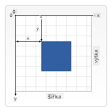

<!--
CO_OP_TRANSLATOR_METADATA:
{
  "original_hash": "41be8d35e7f30aa9dad10773c35e89c4",
  "translation_date": "2025-08-28T03:59:40+00:00",
  "source_file": "6-space-game/2-drawing-to-canvas/README.md",
  "language_code": "cs"
}
-->
# Vytvořte vesmírnou hru, část 2: Kreslení hrdiny a monster na plátno

## Kvíz před přednáškou

[Kvíz před přednáškou](https://ashy-river-0debb7803.1.azurestaticapps.net/quiz/31)

## Plátno

Plátno je HTML prvek, který nemá ve výchozím nastavení žádný obsah; je to prázdná plocha. Musíte na něj kreslit, abyste něco přidali.

✅ Přečtěte si [více o Canvas API](https://developer.mozilla.org/docs/Web/API/Canvas_API) na MDN.

Takto se obvykle deklaruje jako součást těla stránky:

```html
<canvas id="myCanvas" width="200" height="100"></canvas>
```

Výše nastavujeme `id`, `width` a `height`.

- `id`: nastavte toto, abyste mohli získat referenci, když s tím budete potřebovat pracovat.
- `width`: šířka prvku.
- `height`: výška prvku.

## Kreslení jednoduché geometrie

Plátno používá kartézský souřadnicový systém pro kreslení objektů. Používá tedy osu x a osu y k vyjádření, kde se něco nachází. Poloha `0,0` je v levém horním rohu a pravý dolní roh odpovídá šířce a výšce plátna, které jste nastavili.


> Obrázek z [MDN](https://developer.mozilla.org/docs/Web/API/Canvas_API/Tutorial/Drawing_shapes)

Pro kreslení na prvek plátna musíte projít následujícími kroky:

1. **Získat referenci** na prvek plátna.
1. **Získat referenci** na prvek kontextu, který se nachází na plátně.
1. **Provést kreslící operaci** pomocí prvku kontextu.

Kód pro výše uvedené kroky obvykle vypadá takto:

```javascript
// draws a red rectangle
//1. get the canvas reference
canvas = document.getElementById("myCanvas");

//2. set the context to 2D to draw basic shapes
ctx = canvas.getContext("2d");

//3. fill it with the color red
ctx.fillStyle = 'red';

//4. and draw a rectangle with these parameters, setting location and size
ctx.fillRect(0,0, 200, 200) // x,y,width, height
```

✅ Canvas API se většinou zaměřuje na 2D tvary, ale můžete také kreslit 3D objekty na webovou stránku; k tomu můžete použít [WebGL API](https://developer.mozilla.org/docs/Web/API/WebGL_API).

S Canvas API můžete kreslit různé věci, například:

- **Geometrické tvary**, už jsme ukázali, jak nakreslit obdélník, ale je toho mnohem více, co můžete nakreslit.
- **Text**, můžete kreslit text s libovolným fontem a barvou.
- **Obrázky**, můžete kreslit obrázky na základě obrazových souborů, jako je .jpg nebo .png.

✅ Vyzkoušejte to! Už víte, jak nakreslit obdélník, dokážete nakreslit kruh na stránku? Podívejte se na některé zajímavé kresby na plátně na CodePen. Tady je [zvláště působivý příklad](https://codepen.io/dissimulate/pen/KrAwx).

## Načtení a kreslení obrazového souboru

Obrazový soubor načtete vytvořením objektu `Image` a nastavením jeho vlastnosti `src`. Poté posloucháte událost `load`, abyste věděli, kdy je připraven k použití. Kód vypadá takto:

### Načtení souboru

```javascript
const img = new Image();
img.src = 'path/to/my/image.png';
img.onload = () => {
  // image loaded and ready to be used
}
```

### Vzor pro načtení souboru

Doporučuje se zabalit výše uvedené do konstrukce, jako je tato, aby bylo snazší jej použít a manipulovat s ním pouze tehdy, když je plně načten:

```javascript
function loadAsset(path) {
  return new Promise((resolve) => {
    const img = new Image();
    img.src = path;
    img.onload = () => {
      // image loaded and ready to be used
      resolve(img);
    }
  })
}

// use like so

async function run() {
  const heroImg = await loadAsset('hero.png')
  const monsterImg = await loadAsset('monster.png')
}

```

Pro vykreslení herních souborů na obrazovku by váš kód vypadal takto:

```javascript
async function run() {
  const heroImg = await loadAsset('hero.png')
  const monsterImg = await loadAsset('monster.png')

  canvas = document.getElementById("myCanvas");
  ctx = canvas.getContext("2d");
  ctx.drawImage(heroImg, canvas.width/2,canvas.height/2);
  ctx.drawImage(monsterImg, 0,0);
}
```

## Nyní je čas začít vytvářet vaši hru

### Co vytvořit

Vytvoříte webovou stránku s prvkem plátna. Měla by zobrazovat černou obrazovku `1024*768`. Poskytli jsme vám dva obrázky:

- Loď hrdiny

   

- 5*5 monstrum

   

### Doporučené kroky pro zahájení vývoje

Najděte soubory, které byly vytvořeny pro vás ve složce `your-work`. Měla by obsahovat následující:

```bash
-| assets
  -| enemyShip.png
  -| player.png
-| index.html
-| app.js
-| package.json
```

Otevřete kopii této složky ve Visual Studio Code. Měli byste mít nastavené lokální vývojové prostředí, nejlépe s Visual Studio Code, NPM a Node. Pokud nemáte na svém počítači nastavený `npm`, [zde je návod, jak to udělat](https://www.npmjs.com/get-npm).

Začněte svůj projekt navigací do složky `your_work`:

```bash
cd your-work
npm start
```

Výše uvedené spustí HTTP server na adrese `http://localhost:5000`. Otevřete prohlížeč a zadejte tuto adresu. Zatím je to prázdná stránka, ale to se změní.

> Poznámka: abyste viděli změny na obrazovce, obnovte prohlížeč.

### Přidání kódu

Přidejte potřebný kód do `your-work/app.js`, abyste vyřešili následující:

1. **Nakreslete** plátno s černým pozadím
   > tip: přidejte dva řádky pod příslušné TODO v `/app.js`, nastavte prvek `ctx` na černou barvu a souřadnice nahoře/vlevo na 0,0 a výšku a šířku na hodnoty plátna.
2. **Načtěte** textury
   > tip: přidejte obrázky hráče a nepřítele pomocí `await loadTexture` a předáním cesty k obrázku. Zatím je na obrazovce neuvidíte!
3. **Nakreslete** hrdinu do středu obrazovky ve spodní polovině
   > tip: použijte API `drawImage` k nakreslení heroImg na obrazovku, nastavte `canvas.width / 2 - 45` a `canvas.height - canvas.height / 4)`;
4. **Nakreslete** 5*5 monster
   > tip: Nyní můžete odkomentovat kód pro vykreslení nepřátel na obrazovku. Poté přejděte do funkce `createEnemies` a vytvořte ji.

   Nejprve nastavte některé konstanty:

    ```javascript
    const MONSTER_TOTAL = 5;
    const MONSTER_WIDTH = MONSTER_TOTAL * 98;
    const START_X = (canvas.width - MONSTER_WIDTH) / 2;
    const STOP_X = START_X + MONSTER_WIDTH;
    ```

    poté vytvořte smyčku pro vykreslení pole monster na obrazovku:

    ```javascript
    for (let x = START_X; x < STOP_X; x += 98) {
        for (let y = 0; y < 50 * 5; y += 50) {
          ctx.drawImage(enemyImg, x, y);
        }
      }
    ```

## Výsledek

Hotový výsledek by měl vypadat takto:


## Řešení

Nejprve se pokuste vyřešit to sami, ale pokud se zaseknete, podívejte se na [řešení](../../../../6-space-game/2-drawing-to-canvas/solution/app.js).

---

## 🚀 Výzva

Naučili jste se kreslit pomocí Canvas API zaměřeného na 2D; podívejte se na [WebGL API](https://developer.mozilla.org/docs/Web/API/WebGL_API) a zkuste nakreslit 3D objekt.

## Kvíz po přednášce

[Kvíz po přednášce](https://ashy-river-0debb7803.1.azurestaticapps.net/quiz/32)

## Přehled a samostudium

Zjistěte více o Canvas API [čtením o něm](https://developer.mozilla.org/docs/Web/API/Canvas_API).

## Úkol

[Vyzkoušejte si práci s Canvas API](assignment.md)

---

**Prohlášení**:  
Tento dokument byl přeložen pomocí služby pro automatický překlad [Co-op Translator](https://github.com/Azure/co-op-translator). I když se snažíme o přesnost, mějte prosím na paměti, že automatické překlady mohou obsahovat chyby nebo nepřesnosti. Původní dokument v jeho původním jazyce by měl být považován za autoritativní zdroj. Pro důležité informace se doporučuje profesionální lidský překlad. Neodpovídáme za žádná nedorozumění nebo nesprávné interpretace vyplývající z použití tohoto překladu.