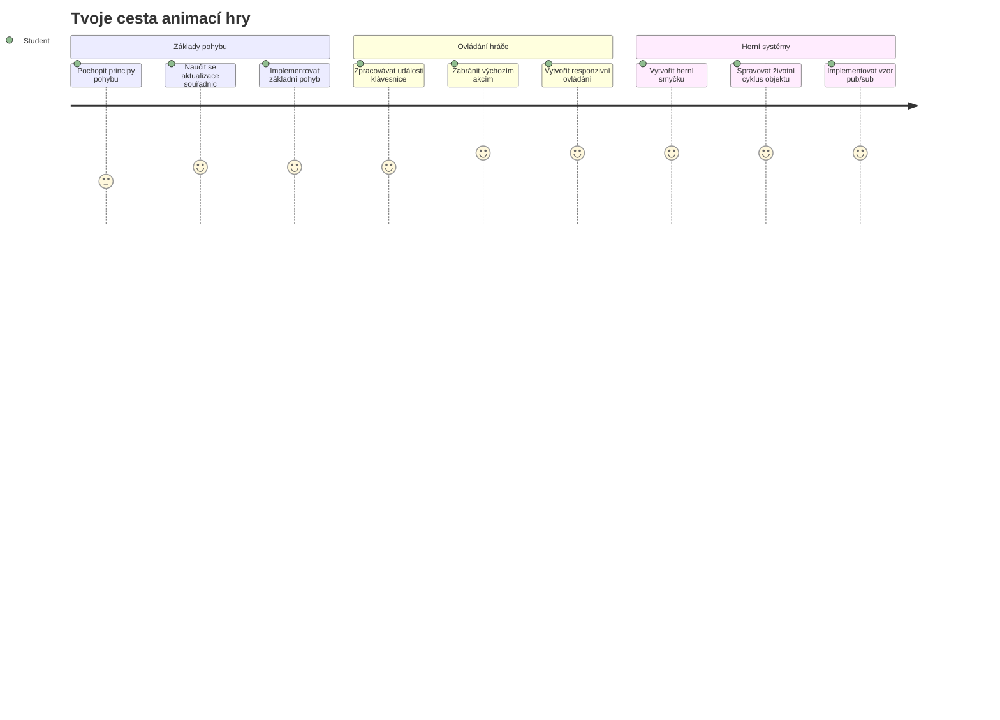
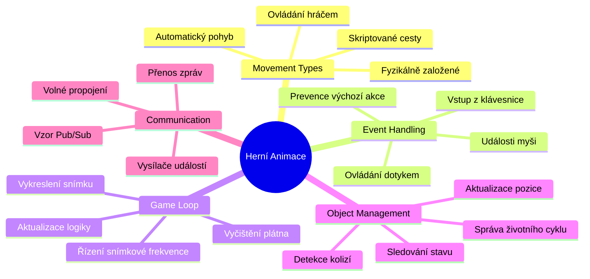
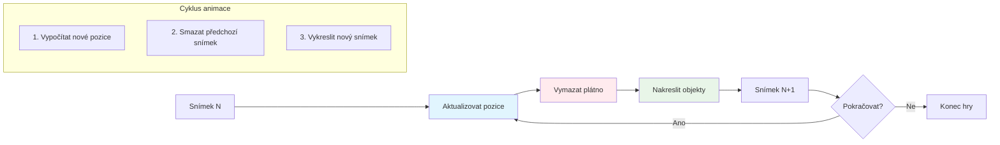
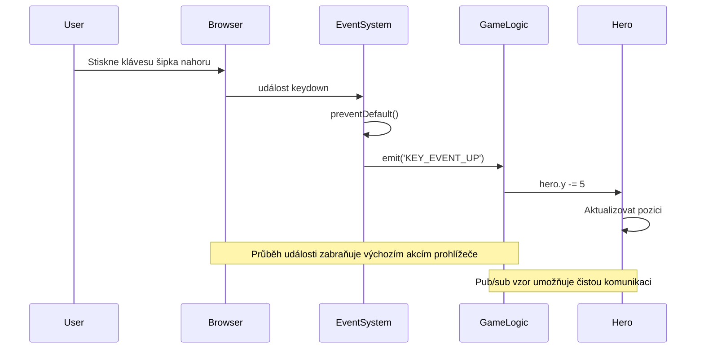
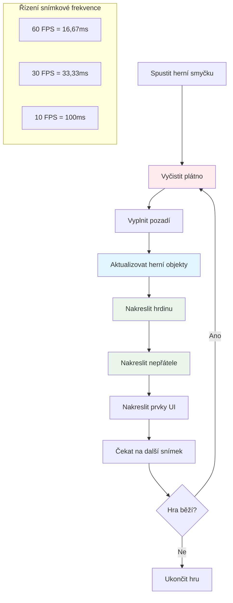
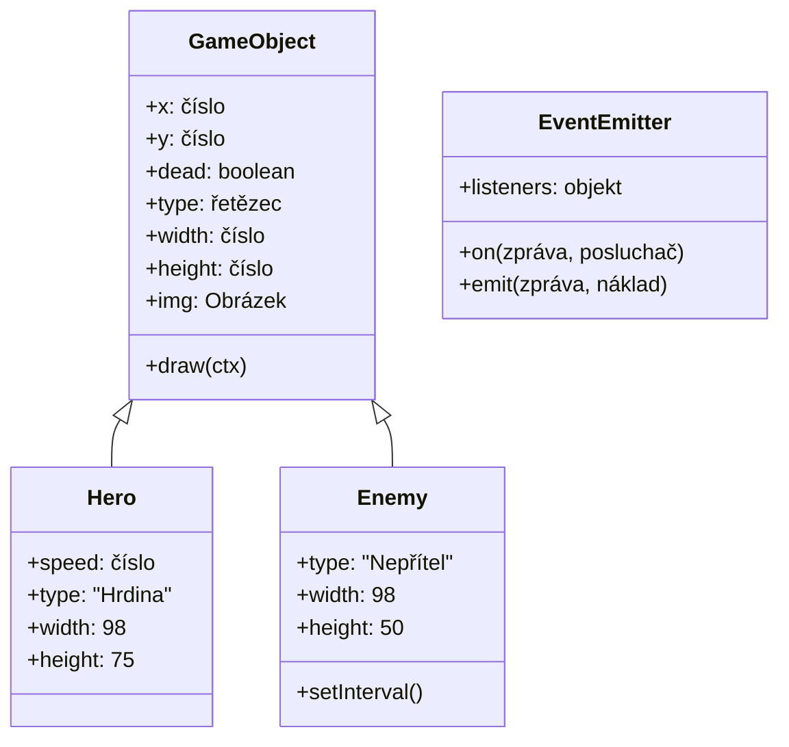
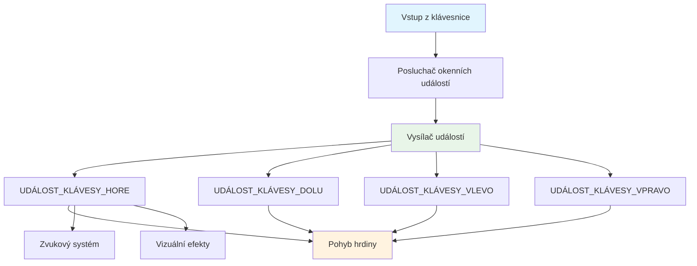
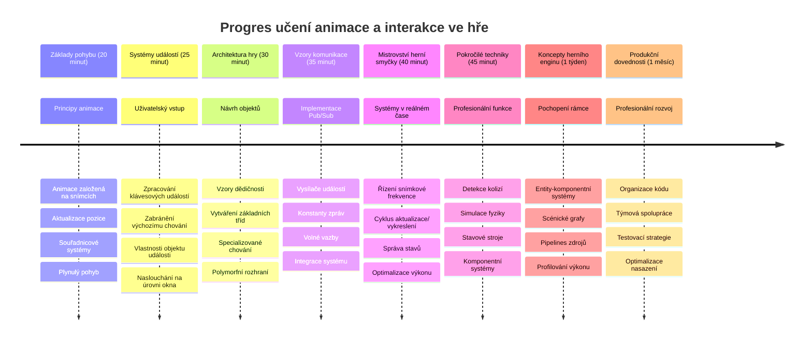

# Vytvoření vesmírné hry Část 3: Přidání pohybu


Zamyslete se nad svými oblíbenými hrami – co je činí poutavými, nejsou to jen hezké grafiky, ale způsob, jak vše kolem se pohybuje a reaguje na vaše akce. Vaše vesmírná hra je teď jako krásný obraz, ale chystáme se přidat pohyb, který jej oživí.

Když inženýři NASA programovali řídicí počítač pro mise Apollo, čelili podobnému úkolu: jak způsobit, aby vesmírná loď reagovala na pilotní vstupy a zároveň automaticky udržovala opravné kurzy? Principy, které se dnes naučíme, zrcadlí právě tyto koncepty – řízení pohybu hráčem společně s automatickým chováním systému.

V této lekci se naučíte, jak nechat vesmírné lodě klouzat po obrazovce, reagovat na příkazy hráče a vytvářet plynulé pohybové vzory. Vše si rozdělíme do zvládnutelných konceptů, které se přirozeně navzájem doplňují.

Na konci budete mít hráče, kteří budou pilotovat svou hrdinskou loď po obrazovce, zatímco nepřátelské lodě budou hlídkovat nahoře. Nejpodstatnější je, že pochopíte základní principy pohybových systémů ve hrách.


## Kvíz před lekcí

[Kvíz před lekcí](https://ff-quizzes.netlify.app/web/quiz/33)

## Porozumění hernímu pohybu

Hry ožívají, když se věci začnou hýbat, a ve své podstatě se to děje dvěma způsoby:

- **Pohyb ovládaný hráčem**: Když stisknete klávesu nebo kliknete myší, něco se pohne. To je přímé propojení mezi vámi a vaším herním světem.
- **Automatický pohyb**: Když hra sama rozhodne, že se něco pohne – například ty nepřátelské lodě, které musí hlídkovat po obrazovce, ať už děláte cokoli.

Pohyblivé objekty na obrazovce nejsou tak složité, jak by se mohlo zdát. Vzpomeňte si na souřadnice x a y z matematiky? Právě s nimi pracujeme. Když Galileo v roce 1610 sledoval měsíce Jupitera, vlastně dělal totéž – zaznamenával polohy v čase, aby pochopil vzory pohybu.

Pohyb na obrazovce je jako tvorba flipbook animace – musíte dodržet tyto tři jednoduché kroky:


1. **Aktualizovat pozici** – změnit, kde by měl být objekt (třeba posunout o 5 pixelů doprava)
2. **Smazat starý snímek** – vyčistit obrazovku, aby se neobjevovaly přízračné stopy
3. **Nakreslit nový snímek** – umístit objekt na nové místo

Pokud to uděláte dost rychle, máte plynulý pohyb, který hráči vnímají jako přirozený.

Takto to může vypadat v kódu:

```javascript
// Nastav umístění hrdiny
hero.x += 5;
// Vyčisti obdélník, ve kterém je hrdina
ctx.clearRect(0, 0, canvas.width, canvas.height);
// Překresli herní pozadí a hrdinu
ctx.fillRect(0, 0, canvas.width, canvas.height);
ctx.fillStyle = "black";
ctx.drawImage(heroImg, hero.x, hero.y);
```

**Co tento kód dělá:**
- **Aktualizuje** x-souřadnici hrdiny o 5 pixelů, aby se pohyboval horizontálně
- **Vymaže** celou plochu plátna, aby odstranil předchozí snímek
- **Vyplní** plátno černým pozadím
- **Znovu nakreslí** obrázek hrdiny na nové pozici

✅ Dokážete uvést důvod, proč by opakované překreslování hrdiny mnoha snímky za sekundu mohlo způsobovat výkonové náklady? Přečtěte si o [alternativách k tomuto vzoru](https://developer.mozilla.org/en-US/docs/Web/API/Canvas_API/Tutorial/Optimizing_canvas).

## Zpracování událostí z klávesnice

Tady propojujeme vstup hráče s herní akcí. Když někdo stiskne mezerník pro vypálení laseru nebo šipku pro úhybný manévr před asteroidem, vaše hra musí tento vstup rozpoznat a reagovat na něj.

Události z klávesnice se zachytávají na úrovni okna, což znamená, že celé vaše okno prohlížeče naslouchá těmto stiskům kláves. Kliky myší jsou naopak spojené s konkrétními elementy (například tlačítky). Pro naši vesmírnou hru se zaměříme na ovládání klávesnicí, protože to dává hráčům ten klasický arkádový pocit.

Připomíná mi to, jak telegrafisté v 19. století museli převádět zadávání morseovky do smysluplných zpráv – děláme něco podobného, když převádíme stisky kláves na herní příkazy.

Pro zpracování události je třeba použít metodu `addEventListener()` okna a předat ji dva vstupní parametry. První parametr je název události, například `keyup`. Druhý parametr je funkce, která se má při události provést.

Tady je příklad:

```javascript
window.addEventListener('keyup', (evt) => {
  // evt.key = řetězcová reprezentace klávesy
  if (evt.key === 'ArrowUp') {
    // udělej něco
  }
});
```

**Co se zde děje:**
- **Naslouchá** událostem z klávesnice na celém okně
- **Zachycuje** objekt události, který obsahuje informace o stisknuté klávese
- **Kontroluje**, zda stisknutá klávesa odpovídá konkrétní klávese (zde šipka nahoru)
- **Provádí** kód, pokud je podmínka splněna

Pro klávesové události můžete použít dvě vlastnosti události pro zjištění, která klávesa byla stisknuta:

- `key` – řetězec reprezentující stisknutou klávesu, například `'ArrowUp'`
- `keyCode` – číselné označení, například `37`, odpovídá `ArrowLeft`

✅ Manipulace s klávesovými událostmi se hodí i mimo vývoj her. Napadá vás, k čemu jinému by se tato technika mohla hodit?


### Speciální klávesy: upozornění!

Některé klávesy mají zabudované chování prohlížeče, které může narušit vaši hru. Šipky posouvají stránku a mezerník ji posune dolů – to nechcete, když někdo pilotuje svou vesmírnou loď.

Můžeme toto výchozí chování zabránit a nechat hru, aby vstup zpracovala sama. Je to podobné, jako když raní počítačoví programátoři museli přepsat systémové přerušení, aby vytvořili vlastní chování – tady to děláme na úrovni prohlížeče. Takhle:

```javascript
const onKeyDown = function (e) {
  console.log(e.keyCode);
  switch (e.keyCode) {
    case 37:
    case 39:
    case 38:
    case 40: // Šipky
    case 32:
      e.preventDefault();
      break; // Mezerník
    default:
      break; // neblokovat jiné klávesy
  }
};

window.addEventListener('keydown', onKeyDown);
```

**Co dělá tento kód k zabránění:**
- **Kontroluje** specifické kódy kláves, které by mohly způsobit nežádoucí chování prohlížeče
- **Zabraňuje** výchozí akci pro šipky a mezerník
- **Dovoluje** ostatním klávesám fungovat normálně
- **Používá** `e.preventDefault()` k zastavení výchozího chování prohlížeče

### 🔄 **Pedagogická kontrola**
**Porozumění událostem**: Než přejdete k automatickému pohybu, ujistěte se, že:
- ✅ Umíte vysvětlit rozdíl mezi událostmi `keydown` a `keyup`
- ✅ Chápete, proč bráníme výchozímu chování prohlížeče
- ✅ Umíte popsat, jak posluchači událostí propojují vstup uživatele s herní logikou
- ✅ Dokážete identifikovat, které klávesy by mohly narušit ovládání hry

**Rychlý test**: Co by se stalo, kdybyste nezabránili výchozímu chování šipek?
*Odpověď: Prohlížeč by posunul stránku, což by narušilo herní pohyb*

**Architektura systému událostí**: Nyní rozumíte:
- **Naslouchání na úrovni okna**: Zachycování událostí na úrovni prohlížeče
- **Vlastnosti objektu události**: Řetězce `key` vs. čísla `keyCode`
- **Zabránění výchozímu chování**: Zastavení nežádoucích akcí prohlížeče
- **Podmíněná logika**: Reagování na konkrétní kombinace kláves

## Pohyb řízený hrou

Nyní si povíme o objektech, které se pohybují bez zásahu hráče. Představte si nepřátelské lodě plující po obrazovce, projektily letící po přímce nebo mraky unášející se v pozadí. Tento autonomní pohyb dává hernímu světu pocit života, i když nikdo nechytá ovladač.

Na aktualizace pozic používáme vestavěné časovače JavaScriptu, které pracují v pravidelných intervalech. Tento koncept je podobný pérovým hodinám – pravidelný mechanismus spouštějící konzistentní, časově řízené akce. Takto jednoduchý to může být:

```javascript
const id = setInterval(() => {
  // Pohybujte nepřítelem na ose y
  enemy.y += 10;
}, 100);
```

**Co tento pohybový kód dělá:**
- **Vytváří** časovač, který běží každých 100 milisekund
- **Aktualizuje** y-souřadnici nepřítele o 10 pixelů každý cyklus
- **Ukládá** ID intervalu, aby bylo možné časovač později zastavit
- **Posouvá** nepřítele automaticky dolů po obrazovce

## Herní smyčka

Toto je koncept, který vše propojí – herní smyčka. Kdyby byla vaše hra filmem, herní smyčka by byla promítačkou, která ukazuje snímek za snímkem tak rychle, že vše působí plynule.

Každá hra má za scénou fungující takovou smyčku. Je to funkce, která aktualizuje všechny herní objekty, překresluje obrazovku a opakuje tento proces stále dokola. Sleduje vašeho hrdinu, nepřátele, létající lasery – celý stav hry.

Tento koncept mi připomíná, jak raní filmoví animátoři jako Walt Disney museli kreslit postavičky snímek po snímku, aby vytvořili iluzi pohybu. My děláme totéž, jen místo tužek používáme kód.

Takto může vypadat typická herní smyčka v kódu:


```javascript
const gameLoopId = setInterval(() => {
  function gameLoop() {
    ctx.clearRect(0, 0, canvas.width, canvas.height);
    ctx.fillStyle = "black";
    ctx.fillRect(0, 0, canvas.width, canvas.height);
    drawHero();
    drawEnemies();
    drawStaticObjects();
  }
  gameLoop();
}, 200);
```

**Porozumění struktuře hry smyčky:**
- **Vymaže** celé plátno a odstraní předchozí snímek
- **Vyplní** pozadí barvou
- **Nakreslí** všechny herní objekty na jejich aktuálních pozicích
- **Opakuje** tento proces každých 200 milisekund pro plynulou animaci
- **Řídí** snímkovou frekvenci pomocí časování intervalu

## Pokračování vesmírné hry

Nyní přidáme pohyb do statické scény, kterou jste vytvořili v předchozí lekci. Proměníme ji ze statického obrázku na interaktivní zážitek. Půjdeme krok za krokem, aby každá část na sebe přirozeně navazovala.

Sežeňte si kód, kde jsme skončili v minulé lekci (nebo začněte od kódu v [části II – starter](../../../../6-space-game/3-moving-elements-around/your-work), pokud potřebujete začít znovu).

**Dnes si vytvoříme:**
- **Ovládání hrdiny**: Šipky na klávesnici budou pilotovat vaši vesmírnou loď po obrazovce
- **Pohyb nepřátel**: Ty mimozemské lodě se začnou posouvat vpřed

Pojďme implementovat tyto funkce.

## Doporučené kroky

Najděte soubory, které byly pro vás vytvořeny ve složce `your-work`. Měly by obsahovat následující:

```bash
-| assets
  -| enemyShip.png
  -| player.png
-| index.html
-| app.js
-| package.json
```

Své projekty spustíte ve složce `your-work` příkazem:

```bash
cd your-work
npm start
```

**Co tento příkaz dělá:**
- **Přechází** do složky projektu
- **Spouští** HTTP server na adrese `http://localhost:5000`
- **Servíruje** vaše herní soubory, abyste je mohli testovat v prohlížeči

Výše uvedený příkaz spustí HTTP server na adrese `http://localhost:5000`. Otevřete si tuto adresu v prohlížeči – právě by se měly vykreslit objekty hrdiny a nepřátel; zatím se nic nepohybuje!

### Přidání kódu

1. **Přidejte dedikované objekty** pro `hero`, `enemy` a `game object` s vlastnostmi `x` a `y`. (Vzpomeňte si na část o [Dědičnosti nebo kompozici](../README.md)).

   *TIP* `game object` by měl mít `x` a `y` a schopnost vykreslit se na plátno.

   > **Tip**: Začněte přidáním nové třídy `GameObject` s jejím konstruktorem definovaným takto, a pak jej vykreslete na plátno:

    ```javascript
    class GameObject {
      constructor(x, y) {
        this.x = x;
        this.y = y;
        this.dead = false;
        this.type = "";
        this.width = 0;
        this.height = 0;
        this.img = undefined;
      }
    
      draw(ctx) {
        ctx.drawImage(this.img, this.x, this.y, this.width, this.height);
      }
    }
    ```

    **Porozumění této základní třídě:**
    - **Definuje** společné vlastnosti, které mají všechny herní objekty (pozice, velikost, obrázek)
    - **Obsahuje** příznak `dead` pro sledování, zda má být objekt odstraněn
    - **Poskytuje** metodu `draw()`, která vykreslí objekt na plátno
    - **Nastavuje** výchozí hodnoty všech vlastností, které mohou potomci přepsat


    Nyní rozšiřte tuto `GameObject` třídu pro vytvoření `Hero` a `Enemy`:
    
    ```javascript
    class Hero extends GameObject {
      constructor(x, y) {
        super(x, y);
        this.width = 98;
        this.height = 75;
        this.type = "Hero";
        this.speed = 5;
      }
    }
    ```

    ```javascript
    class Enemy extends GameObject {
      constructor(x, y) {
        super(x, y);
        this.width = 98;
        this.height = 50;
        this.type = "Enemy";
        const id = setInterval(() => {
          if (this.y < canvas.height - this.height) {
            this.y += 5;
          } else {
            console.log('Stopped at', this.y);
            clearInterval(id);
          }
        }, 300);
      }
    }
    ```

    **Klíčové koncepty v těchto třídách:**
    - **Dědí** z `GameObject` pomocí klíčového slova `extends`
    - **Volá** rodičovský konstruktor přes `super(x, y)`
    - **Nastavuje** specifické rozměry a vlastnosti jednotlivých typů objektů
    - **Implementuje** automatický pohyb nepřátel pomocí `setInterval()`

2. **Přidejte handlery klávesových událostí** pro řízení šipkami (pohyb hrdiny nahoru/dolů, vlevo/vpravo)

   *NEZAPOMEŇTE*, že souřadnicový systém je kartézský, levý horní roh je `0,0`. Také nezapomeňte přidat kód pro zastavení *výchozího chování*.

   > **Tip**: Vytvořte funkci `onKeyDown` a připojte ji k oknu:

   ```javascript
   const onKeyDown = function (e) {
     console.log(e.keyCode);
     // Přidejte kód z výše uvedené lekce pro zastavení výchozího chování
     switch (e.keyCode) {
       case 37:
       case 39:
       case 38:
       case 40: // Šipky
       case 32:
         e.preventDefault();
         break; // Mezerník
       default:
         break; // neblokujte ostatní klávesy
     }
   };

   window.addEventListener("keydown", onKeyDown);
   ```
    
   **Co tento handler událostí dělá:**
   - **Naslouchá** událostem `keydown` na celém okně
   - **Loguje** kód klávesy pro ladění, které klávesy jsou stisknuté
   - **Zabraňuje** výchozímu chování pro šipky a mezerník
   - **Dovoluje** normální fungování ostatních kláves
   
   Podívejte se v tomto okamžiku do konzole prohlížeče a sledujte zaznamenané stisky kláves. 

3. **Implementujte** [Pub-sub vzor](../README.md), který vám udrží kód čistý při pokračování dalších částí.

   Publish-Subscribe vzor pomáhá organizovat kód oddělením detekce událostí od jejich zpracování. To činí kód modulárnějším a snáze udržovatelným.

   Pro tuto poslední část můžete:

   1. **Přidat posluchač událostí** na okně:

       ```javascript
       window.addEventListener("keyup", (evt) => {
         if (evt.key === "ArrowUp") {
           eventEmitter.emit(Messages.KEY_EVENT_UP);
         } else if (evt.key === "ArrowDown") {
           eventEmitter.emit(Messages.KEY_EVENT_DOWN);
         } else if (evt.key === "ArrowLeft") {
           eventEmitter.emit(Messages.KEY_EVENT_LEFT);
         } else if (evt.key === "ArrowRight") {
           eventEmitter.emit(Messages.KEY_EVENT_RIGHT);
         }
       });
       ```

   **Co tento systém událostí dělá:**
   - **Zachytává** vstupy z klávesnice a převádí je na vlastní herní události
   - **Odděluje** detekci vstupu od herní logiky
   - **Umožňuje** snadné změny ovládání bez zásahu do herního kódu
   - **Dovoluje** více systémům reagovat na stejný vstup


   2. **Vytvořit třídu EventEmitter** pro publikování a odebírání zpráv:

       ```javascript
       class EventEmitter {
         constructor() {
           this.listeners = {};
         }
       
         on(message, listener) {
           if (!this.listeners[message]) {
             this.listeners[message] = [];
           }
           this.listeners[message].push(listener);
         }
       
   3. **Přidat konstanty** a nastavit EventEmitter:

       ```javascript
       const Messages = {
         KEY_EVENT_UP: "KEY_EVENT_UP",
         KEY_EVENT_DOWN: "KEY_EVENT_DOWN",
         KEY_EVENT_LEFT: "KEY_EVENT_LEFT",
         KEY_EVENT_RIGHT: "KEY_EVENT_RIGHT",
       };
       
       let heroImg, 
           enemyImg, 
           laserImg,
           canvas, ctx, 
           gameObjects = [], 
           hero, 
           eventEmitter = new EventEmitter();
       ```

   **Co je v nastavení:**
   - **Definuje** konstanty zpráv, aby se zabránilo překlepům a usnadnila refaktorizace
   - **Deklaruje** proměnné pro obrázky, kontext plátna a herní stav
   - **Vytváří** globální event emitter pro pub-sub systém
   - **Inicializuje** pole pro uložení všech herních objektů

   4. **Inicializujte hru**

       ```javascript
       function initGame() {
         gameObjects = [];
         createEnemies();
         createHero();
       
         eventEmitter.on(Messages.KEY_EVENT_UP, () => {
           hero.y -= 5;
         });
       
         eventEmitter.on(Messages.KEY_EVENT_DOWN, () => {
           hero.y += 5;
         });
       
         eventEmitter.on(Messages.KEY_EVENT_LEFT, () => {
           hero.x -= 5;
         });
       
4. **Nastavte herní smyčku**

   Refaktorujte funkci `window.onload`, aby inicializovala hru a nastavila herní smyčku na dobrém intervalu. Přidáte také laserový paprsek:

    ```javascript
    window.onload = async () => {
      canvas = document.getElementById("canvas");
      ctx = canvas.getContext("2d");
      heroImg = await loadTexture("assets/player.png");
      enemyImg = await loadTexture("assets/enemyShip.png");
      laserImg = await loadTexture("assets/laserRed.png");
    
      initGame();
      const gameLoopId = setInterval(() => {
        ctx.clearRect(0, 0, canvas.width, canvas.height);
        ctx.fillStyle = "black";
        ctx.fillRect(0, 0, canvas.width, canvas.height);
        drawGameObjects(ctx);
      }, 100);
    };
    ```

   **Porozumění nastavení hry:**
   - **Čeká**, až se stránka plně načte před spuštěním
   - **Získává** element canvas a jeho 2D renderingový kontext
   - **Načítá** všechny obrázkové zdroje asynchronně pomocí `await`
   - **Spouští** herní smyčku s intervalem 100 ms (10 FPS)
   - **Maže** a znovu kreslí celou obrazovku každým snímkem

5. **Přidejte kód** pro pohyb nepřátel v určitém intervalu

    Refaktorujte funkci `createEnemies()`, aby vytvořila nepřátele a přidala je do nové třídy gameObjects:

    ```javascript
    function createEnemies() {
      const MONSTER_TOTAL = 5;
      const MONSTER_WIDTH = MONSTER_TOTAL * 98;
      const START_X = (canvas.width - MONSTER_WIDTH) / 2;
      const STOP_X = START_X + MONSTER_WIDTH;
    
      for (let x = START_X; x < STOP_X; x += 98) {
        for (let y = 0; y < 50 * 5; y += 50) {
          const enemy = new Enemy(x, y);
          enemy.img = enemyImg;
          gameObjects.push(enemy);
        }
      }
    }
    ```

    **Co dělá tvorba nepřátel:**
    - **Vypočítává** pozice pro centrování nepřátel na obrazovce
    - **Vytváří** mřížku nepřátel pomocí vnořených smyček
    - **Přiřazuje** obrázek nepřítele ke každému nepřátelskému objektu
    - **Přidává** každého nepřítele do globálního pole herních objektů
    
    a přidejte funkci `createHero()`, která provede obdobný proces pro hrdinu.
    
    ```javascript
    function createHero() {
      hero = new Hero(
        canvas.width / 2 - 45,
        canvas.height - canvas.height / 4
      );
      hero.img = heroImg;
      gameObjects.push(hero);
    }
    ```

    **Co dělá tvorba hrdiny:**
    - **Umisťuje** hrdinu na spodní střed obrazovky
    - **Přiřazuje** obrázek hrdiny k objektu hrdiny
    - **Přidává** hrdinu do pole herních objektů pro vykreslování

    a nakonec přidejte funkci `drawGameObjects()`, která zahájí kreslení:

    ```javascript
    function drawGameObjects(ctx) {
      gameObjects.forEach(go => go.draw(ctx));
    }
    ```

    **Porozumění kreslící funkce:**
    - **Prochází** všechny herní objekty v poli
    - **Volá** metodu `draw()` na každém objektu
    - **Předává** kontext canvasu, aby se objekty mohly vykreslit

    ### 🔄 **Pedagogická kontrola**
    **Kompletní porozumění hernímu systému**: Ověřte si zvládnutí celé architektury:
    - ✅ Jak dědičnost umožňuje Hero a Enemy sdílet společné vlastnosti GameObject?
    - ✅ Proč činí pub/sub vzor váš kód lépe udržovatelným?
    - ✅ Jakou roli hraje herní smyčka při vytváření plynulé animace?
    - ✅ Jak propojují event listenery uživatelský vstup s chováním herních objektů?

    **Integrace systému**: Vaše hra nyní demonstruje:
    - **Objektově orientovaný design**: Základní třídy se specializovanou dědičností
    - **Architektura řízená událostmi**: Pub/sub vzor pro volnou vazbu
    - **Animovaný framework**: Herní smyčka s konzistentními aktualizacemi snímků
    - **Zpracování vstupu**: Klávesové události s prevencí výchozího chování
    - **Správa zdrojů**: Načítání obrázků a vykreslování sprite

    **Profesionální vzory**: Implementovali jste:
    - **Oddělení odpovědností**: Vstup, logika a vykreslování oddělené
    - **Polymorfismus**: Všechny herní objekty sdílejí společné rozhraní pro kreslení
    - **Předávání zpráv**: Čistá komunikace mezi komponentami
    - **Správa zdrojů**: Efektivní správa sprite a animací

    Vaši nepřátelé by měli začít postupovat směrem k vaší hrdinské vesmírné lodi!
      }
    }
    ```
    
    and add a `createHero()` function to do a similar process for the hero.
    
    ```javascript
    function createHero() {
      hero = new Hero(
        canvas.width / 2 - 45,
        canvas.height - canvas.height / 4
      );
      hero.img = heroImg;
      gameObjects.push(hero);
    }
    ```

    a nakonec přidejte funkci `drawGameObjects()`, která zahájí kreslení:

    ```javascript
    function drawGameObjects(ctx) {
      gameObjects.forEach(go => go.draw(ctx));
    }
    ```

    Vaši nepřátelé by měli začít postupovat směrem k vaší hrdinské vesmírné lodi!

---

## Výzva GitHub Copilot Agenta 🚀

Tady je výzva, která zlepší váš herní šmrnc: přidání hranic a plynulých ovládacích prvků. Aktuálně váš hrdina může opustit obrazovku a pohyb může působit trhaně.

**Váš úkol:** Udělejte, aby vaše vesmírná loď působila realističtěji implementací hranic obrazovky a plynulého pohybu. Je to podobné, jako systémy řízení letu NASA zabraňují kosmickým lodím překračovat bezpečné operační parametry.

**Co vytvořit:** Vytvořte systém, který udrží vaši hrdinskou loď na obrazovce a zároveň zajistí plynulé ovládání. Když hráči drží šipku, loď by měla klouzat plynule, nikoliv se posouvat po krocích. Zvažte přidání vizuální zpětné vazby, když loď dosáhne hranic obrazovky – třeba jemný efekt, který indikuje okraj herní plochy.

Více o [agent módu](https://code.visualstudio.com/blogs/2025/02/24/introducing-copilot-agent-mode) zde.

## 🚀 Výzva

Organizace kódu nabývá na důležitosti s růstem projektů. Možná jste si všimli, že soubor se vám plní funkcemi, proměnnými a třídami dohromady. Připomíná mi to, jak inženýři organizující kód mise Apollo museli vytvářet jasné, udržovatelné systémy, na kterých mohlo pracovat víc týmů zároveň.

**Váš úkol:**
Myslete jako softwarový architekt. Jak byste uspořádali svůj kód tak, aby po šesti měsících vy (nebo kolega) rozuměli, co se děje? I když zatím zůstane vše v jednom souboru, můžete lépe uspořádat:

- **Seskupování souvisejících funkcí** dohromady s jasnými komentáři
- **Oddělení odpovědností** – držte herní logiku odděleně od vykreslování
- **Používání konzistentních názvů** proměnných a funkcí
- **Vytváření modulů** nebo jmenných prostorů k organizaci různých částí hry
- **Přidávání dokumentace** vysvětlující účel každé hlavní sekce

**Reflexní otázky:**
- Které části kódu jsou nejtěžší pochopit při návratu?
- Jak byste uspořádali kód, aby byl příspěvek ostatních jednodušší?
- Co by se stalo, kdybyste chtěli přidat nové funkce jako vylepšení nebo různé typy nepřátel?

## Test po lekci

[Test po lekci](https://ff-quizzes.netlify.app/web/quiz/34)

## Přehled a samostudium

Budujeme vše od začátku, což je skvělé pro učení, ale tady je malý tip – existují úžasné JavaScriptové frameworky, které zvládnou spoustu práce za vás. Jakmile budete mít základy zvládnuté, stojí za to [prozkoumat, co je k dispozici](https://github.com/collections/javascript-game-engines).

Frameworky jsou jako dobře vybavená sada nářadí, místo abyste každý nástroj vyráběli ručně. Mohou vyřešit mnohé problémy s organizací kódu, o kterých jsme mluvili, a navíc nabídnou funkce, které by vám trvalo týdny vytvořit.

**Co stojí za to prozkoumat:**
- Jak herní enginy organizují kód – budete překvapeni chytrými vzory, které používají
- Triky pro výkon, aby běh her na canvasu byl plynulý jako máslo
- Moderní JavaScriptové funkce, díky kterým je váš kód čistší a lépe udržovatelný
- Různé přístupy ke správě herních objektů a jejich vztahů

## 🎯 Váš časový plán mistrovství herní animace


### 🛠️ Souhrn vašeho nástroje pro vývoj her

Po dokončení této lekce ovládáte:
- **Principy animace**: Pohyb založený na snímcích a plynulé přechody
- **Programování řízené událostmi**: Zpracování klávesových vstupů s správou událostí
- **Objektově orientovaný design**: Dědičnost a polymorfní rozhraní
- **Vzor komunikace**: Publikování/odběr pro udržovatelný kód
- **Architektura herní smyčky**: Aktualizace a vykreslování v reálném čase
- **Vstupní systémy**: Uživatelské ovládání s prevencí výchozího chování
- **Správa zdrojů**: Načítání sprite a efektivní techniky vykreslování

### ⚡ **Co zvládnete během příštích 5 minut**
- [ ] Otevřít konzoli prohlížeče a zkusit `addEventListener('keydown', console.log)` pro sledování klávesových událostí
- [ ] Vytvořit jednoduchý div element a pohybovat s ním pomocí šipek
- [ ] Experimentovat s `setInterval` pro vytvoření plynulého pohybu
- [ ] Vyzkoušet `event.preventDefault()` k zamezení výchozího chování

### 🎯 **Co můžete stihnout během této hodiny**
- [ ] Dokončit test po lekci a porozumět programování řízenému událostmi
- [ ] Vytvořit pohybující se hrdinskou vesmírnou loď s plným ovládáním klávesnicí
- [ ] Implementovat plynulé pohybové vzory nepřátel
- [ ] Přidat hranice, aby herní objekty neopouštěly obrazovku
- [ ] Vytvořit základní detekci kolizí mezi herními objekty

### 📅 **Váš týdenní animační plán**
- [ ] Dokončit plnou vesmírnou hru s vylepšeným pohybem a interakcemi
- [ ] Přidat složité pohybové vzory jako křivky, zrychlení a fyziku
- [ ] Implementovat plynulé přechody a easing funkce
- [ ] Vytvořit částicové efekty a vizuální zpětnou vazbu
- [ ] Optimalizovat výkon hry pro plynulý běh na 60 FPS
- [ ] Přidat dotykové ovládání pro mobilní zařízení a responzivní design

### 🌟 **Měsíční interaktivní vývoj**
- [ ] Vytvořit komplexní interaktivní aplikace s pokročilými animačními systémy
- [ ] Naučit se animační knihovny jako GSAP nebo vytvořit vlastní animační engine
- [ ] Přispět do open source herních a animačních projektů
- [ ] Ovládnout optimalizaci výkonu pro graficky náročné aplikace
- [ ] Vytvářet vzdělávací obsah o herním vývoji a animacích
- [ ] Vybudovat portfolio pokročilých interaktivních programovacích dovedností

**Využití v reálném světě**: Vaše animační dovednosti využijete přímo v:
- **Interaktivních webových aplikacích**: Dynamické panely a rozhraní v reálném čase
- **Vizualizaci dat**: Animované grafy a interaktivní grafika
- **Vzdělávacím softwaru**: Interaktivní simulace a výukové nástroje
- **Mobilním vývoji**: Hry založené na dotykovém ovládání a gestách
- **Desktopových aplikacích**: Electron aplikace s plynulými animacemi
- **Webových animacích**: CSS a JavaScriptové animační knihovny

**Získané profesionální dovednosti**: Nyní dokážete:
- **Navrhovat** event-driven systémy škálovatelné s rostoucí složitostí
- **Implementovat** plynulé animace pomocí matematických principů
- **Ladit** složité interakční systémy pomocí vývojářských nástrojů prohlížeče
- **Optimalizovat** výkon hry pro různá zařízení a prohlížeče
- **Navrhovat** udržovatelnou strukturu kódu pomocí osvědčených vzorů

**Objevy v herním vývoji**:
- **Správa snímkové frekvence**: Porozumění FPS a časování
- **Zpracování vstupu**: Cross-platform klávesnicové a událostní systémy
- **Životní cyklus objektů**: Vzory vytváření, aktualizace a zničení
- **Synchronizace stavu**: Udržování konzistentního herního stavu mezi snímky
- **Architektura událostí**: Oddělená komunikace mezi herními systémy

**Další úroveň**: Jste připraveni přidat detekci kolizí, skórovací systémy, zvukové efekty nebo prozkoumat moderní herní frameworky jako Phaser nebo Three.js!

🌟 **Ocenění odemčeno**: Vytvořili jste kompletní interaktivní herní systém s profesionální architekturou!

## Zadání

[Komentujte svůj kód](assignment.md)

---

<!-- CO-OP TRANSLATOR DISCLAIMER START -->
**Prohlášení o vyloučení odpovědnosti**:
Tento dokument byl přeložen pomocí AI překladatelské služby [Co-op Translator](https://github.com/Azure/co-op-translator). Přestože se snažíme o přesnost, mějte prosím na paměti, že automatizované překlady mohou obsahovat chyby nebo nepřesnosti. Původní dokument v jeho mateřském jazyce by měl být považován za autoritativní zdroj. Pro zásadní informace se doporučuje profesionální lidský překlad. Nejsme odpovědní za žádné nedorozumění nebo chybné interpretace vyplývající z použití tohoto překladu.
<!-- CO-OP TRANSLATOR DISCLAIMER END -->