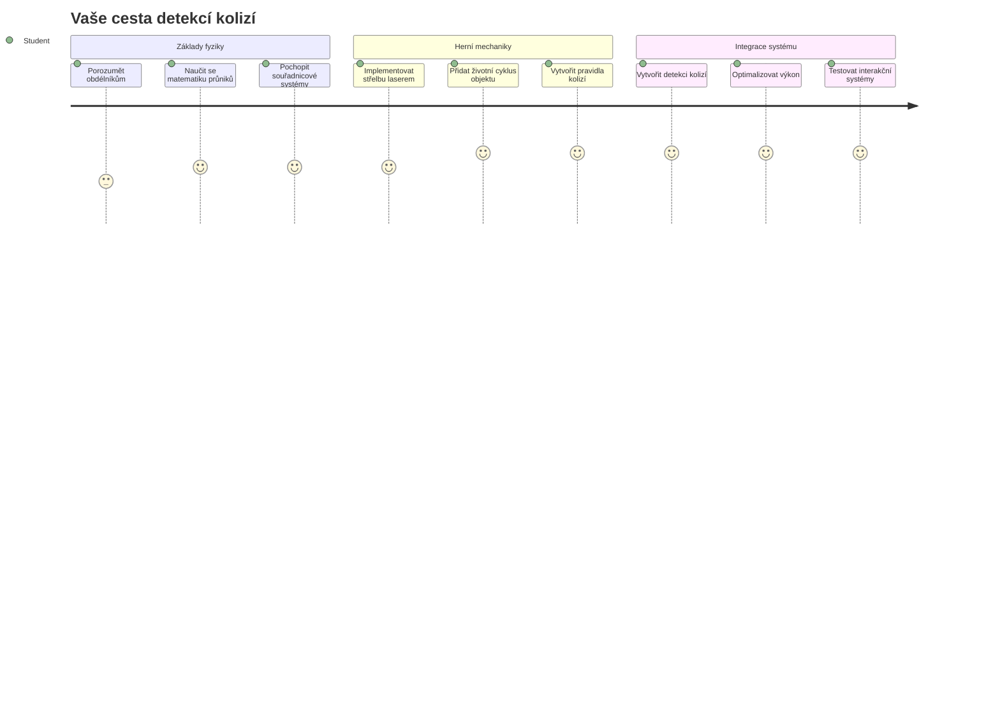
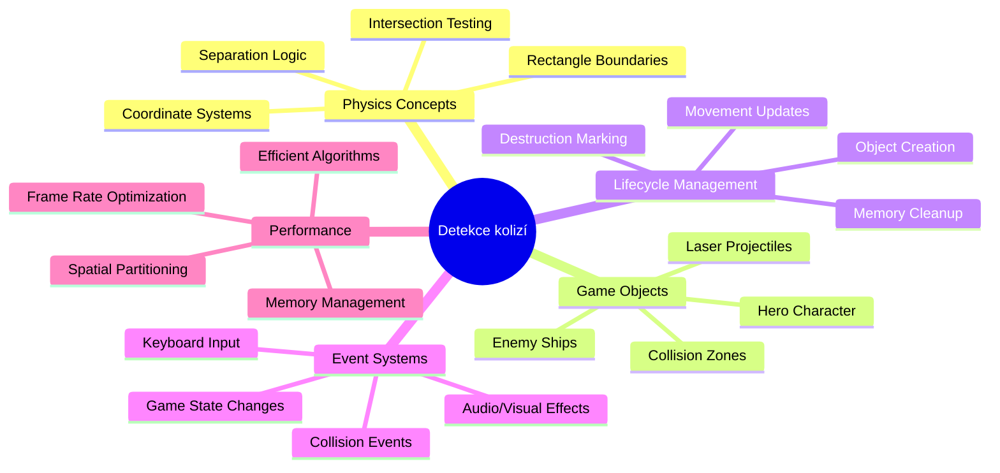
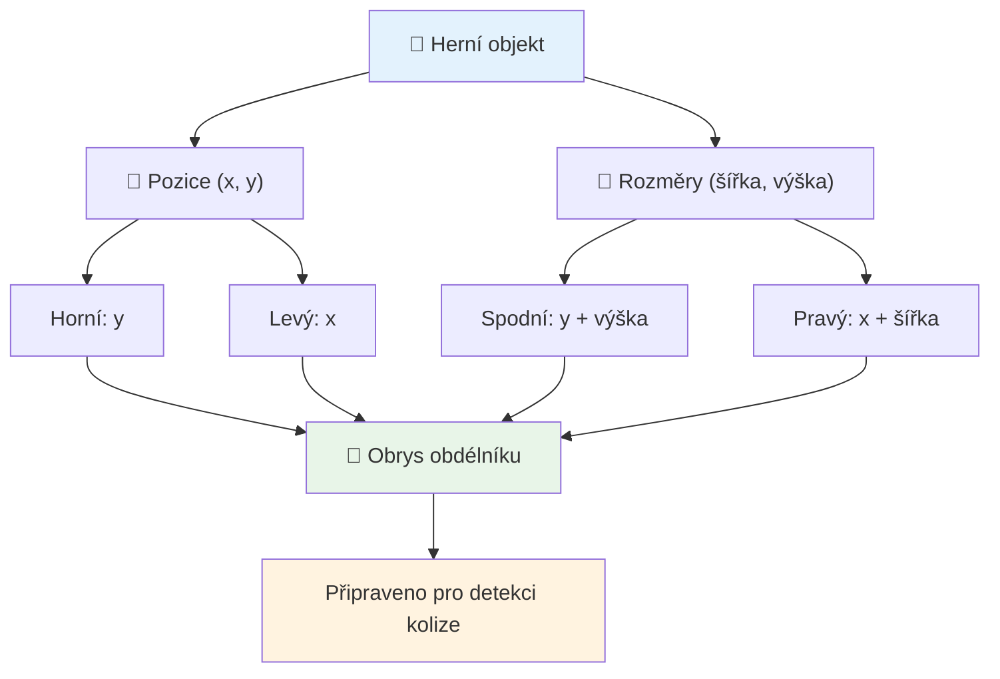
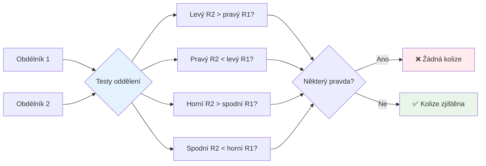
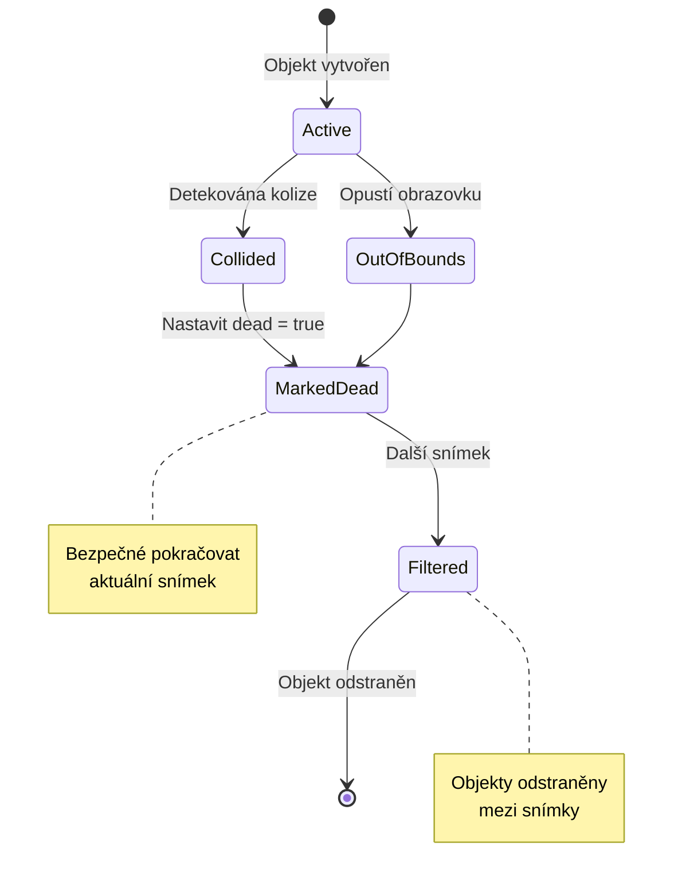
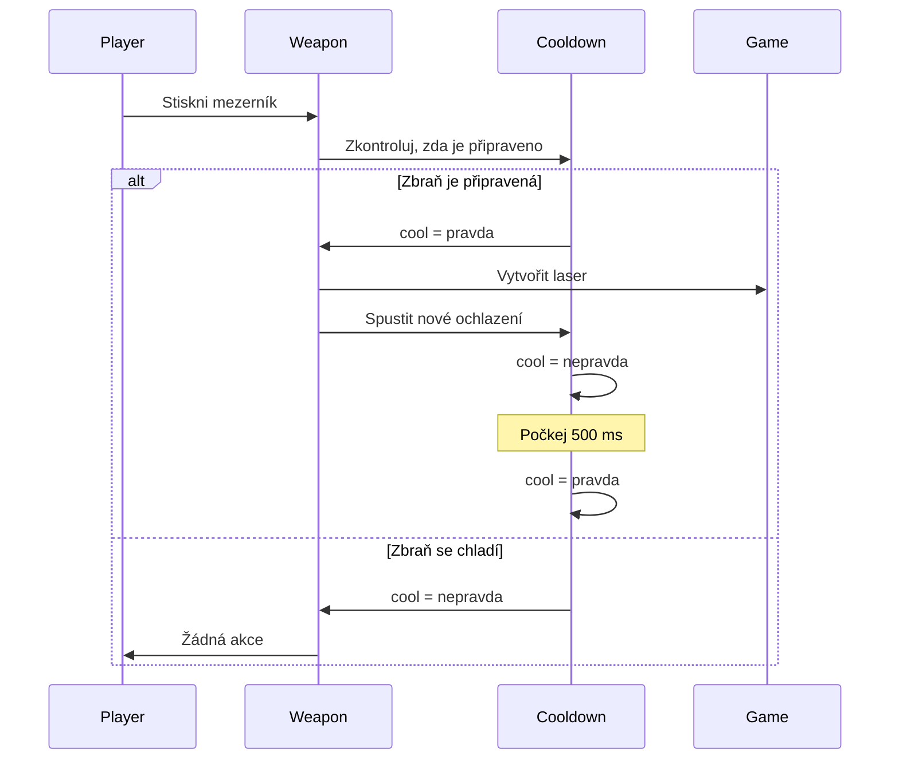
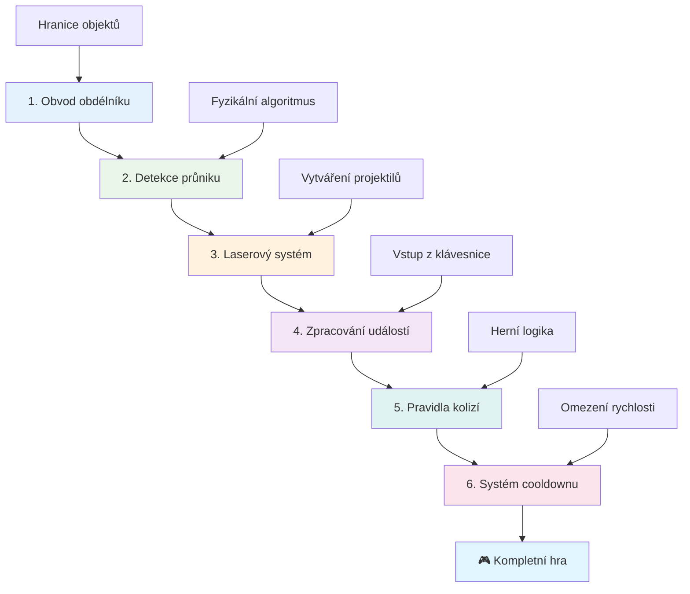
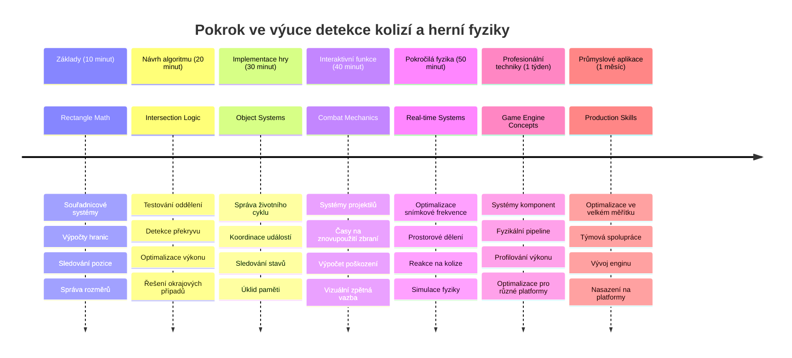

<!--
CO_OP_TRANSLATOR_METADATA:
{
  "original_hash": "039b4d8ce65f5edd82cf48d9c3e6728c",
  "translation_date": "2026-01-07T03:37:49+00:00",
  "source_file": "6-space-game/4-collision-detection/README.md",
  "language_code": "cs"
}
-->
# Vytvoření vesmírné hry část 4: Přidání laseru a detekce kolizí


## Přednáškový kvíz

[Přednáškový kvíz](https://ff-quizzes.netlify.app/web/quiz/35)

Zamyslete se nad momentem ve Star Wars, kdy protonové torpéda Luka zasáhla výfukovou štěrbinu Hvězdy smrti. Právě tato přesná detekce kolize změnila osud galaxie! V hrách funguje detekce kolizí stejně – určuje, kdy objekty interagují a co se stane dál.

V této lekci přidáte do své vesmírné hry laserové zbraně a implementujete detekci kolizí. Stejně jako plánovači misí NASA počítají trajektorie kosmických lodí, abyste se vyhnuli trosek, naučíte se detekovat, kdy se herní objekty protínají. Tento proces rozdělíme na zvládnutelné kroky, které na sebe navazují.

Na konci budete mít funkční bojový systém, kde lasery ničící nepřátele a kolize spouštějí herní události. Stejné principy detekce kolizí se používají od fyzikálních simulací po interaktivní webová rozhraní.


✅ Proveďte malý průzkum o vůbec první napsané počítačové hře. Jaká byla její funkčnost?

## Detekce kolizí

Detekce kolizí funguje jako proximity senzory na lunárním modulu Apollo – neustále kontroluje vzdálenosti a spouští upozornění, když se objekty přiblíží příliš blízko. V hrách tento systém určuje, kdy objekty interagují a co by se mělo stát dál.

Použitý přístup považuje každý herní objekt za obdélník, podobně jako systémy řízení letového provozu používají zjednodušené geometrické tvary k sledování letadel. Tato obdélníková metoda může vypadat základně, je však výpočetně efektivní a dobře funguje ve většině herních situací.

### Reprezentace obdélníku

Každý herní objekt potřebuje souřadnicové hranice, podobně jako rover Mars Pathfinder mapoval svou polohu na povrchu Marsu. Zde jsou definice těchto hranic:


```javascript
rectFromGameObject() {
  return {
    top: this.y,
    left: this.x,
    bottom: this.y + this.height,
    right: this.x + this.width
  }
}
```

**Podrobněji:**
- **Horní okraj**: To je jen místo, kde váš objekt začíná vertikálně (jeho pozice y)
- **Levý okraj**: Kde začíná horizontálně (jeho pozice x)
- **Spodní okraj**: Přičtěte výšku k pozici y – nyní víte, kde končí!
- **Pravý okraj**: Přičtěte šířku k pozici x – a máte kompletní hranici

### Algoritmus průniku

Detekce průniku obdélníků využívá logiku podobnou té, kterou Hubbleův vesmírný teleskop používá k určení, zda se nebeské objekty překrývají ve svém zorném poli. Algoritmus hledá oddělení:


```javascript
function intersectRect(r1, r2) {
  return !(r2.left > r1.right ||
    r2.right < r1.left ||
    r2.top > r1.bottom ||
    r2.bottom < r1.top);
}
```

**Test separace funguje jako radary:**
- Je obdélník 2 zcela napravo od obdélníku 1?
- Je obdélník 2 zcela nalevo od obdélníku 1?
- Je obdélník 2 zcela pod obdélníkem 1?
- Je obdélník 2 zcela nad obdélníkem 1?

Pokud žádná z těchto podmínek není pravdivá, obdélníky se musí překrývat. Tento přístup odpovídá tomu, jak radaráři určují, zda jsou dvě letadla ve bezpečné vzdálenosti.

## Správa životního cyklu objektů

Když laser zasáhne nepřítele, oba objekty musí být ze hry odstraněny. Mazání objektů během smyčky však může způsobit zhroucení – lekce, kterou si rané počítačové systémy jako Apollo Guidance Computer tvrdě odpykaly. Místo toho používáme přístup "označit k odstranění", který bezpečně odstraňuje objekty mezi snímky.


Takto označujeme něco k odstranění:

```javascript
// Označit objekt k odstranění
enemy.dead = true;
```

**Proč tento přístup funguje:**
- Označíme objekt jako „mrtvý“, ale okamžitě jej nesmažeme
- To dovolí bezpečně dokončit aktuální snímek hry
- Žádné pády kvůli použití již odstraněné věci!

Poté před příštím vykreslením odfiltrujeme označené objekty:

```javascript
gameObjects = gameObjects.filter(go => !go.dead);
```

**Co filtr dělá:**
- Vytváří nový seznam pouze s „živými“ objekty
- Odstraňuje všechny označené jako mrtvé
- Zajišťuje plynulý chod hry
- Zabraňuje zahlcení paměti hromaděním zničených objektů

## Implementace laserových mechanik

Laserové střely ve hrách fungují na stejném principu jako fotonová torpéda ve Star Treku – jsou to samostatné objekty, které letí po přímce, dokud něčeho nedosáhnou. Každé stisknutí mezerníku vytváří nový laserový objekt pohybující se po obrazovce.

Aby to fungovalo, musíme koordinovat několik částí:

**Klíčové komponenty implementace:**
- **Vytvořit** laserové objekty vycházející z pozice hrdiny
- **Zpracovat** vstup z klávesnice pro spuštění vytváření laseru
- **Řídit** pohyb a životní cyklus laseru
- **Implementovat** vizuální podobu laserových střel

## Implementace kontroly rychlosti střelby

Neomezená rychlost střelby by zahltila herní engine a hru učinila příliš jednoduchou. Skutečné zbraňové systémy čelí podobným omezením – i phasery USS Enterprise potřebovaly čas na dobití mezi výstřely.

Implementujeme systém ochlazování (cooldown), který zabrání rychlému střílení, a přitom zachová citlivost ovládání:


```javascript
class Cooldown {
  constructor(time) {
    this.cool = false;
    setTimeout(() => {
      this.cool = true;
    }, time);
  }
}

class Weapon {
  constructor() {
    this.cooldown = null;
  }
  
  fire() {
    if (!this.cooldown || this.cooldown.cool) {
      // Vytvořit laserový projektil
      this.cooldown = new Cooldown(500);
    } else {
      // Zbraň se stále ochlazuje
    }
  }
}
```

**Jak cooldown funguje:**
- Při vytvoření je zbraň „horká“ (ještě nemůže střílet)
- Po vypršení času se stává „studenou“ (připravenou střílet)
- Před výstřelem kontrolujeme: „Je zbraň studená?“
- To zabraňuje spamování, ale udržuje ovládání citlivé

✅ Připomeňte si lekci 1 ze série vesmírných her o cooldownu.

## Stavba systému detekce kolizí

Rozšíříte svůj stávající kód vesmírné hry o systém detekce kolizí. Podobně jako automatizovaný systém vyhýbání kolizím na Mezinárodní vesmírné stanici bude vaše hra kontinuálně sledovat pozice objektů a reagovat na průniky.

Na základě kódu z minulé lekce přidáte detekci kolizí s konkrétními pravidly, která řídí interakce objektů.

> 💡 **Tip pro profíky**: Laserový sprite je již součástí vaší složky assets a v kódu je připraven k použití.

### Pravidla kolizí k implementaci

**Herní mechaniky k přidání:**
1. **Laser zasáhne nepřítele**: Nepřítel je zničen při zásahu laserem
2. **Laser zasáhne hranici obrazovky**: Laser je odstraněn při dosažení horního okraje obrazovky
3. **Kolize nepřítele a hrdiny**: Oba objekty jsou zničeny při průniku
4. **Nepřítel dosáhne spodku**: Stav „konec hry“ při dosažení spodní části obrazovky nepřáteli

### 🔄 **Pedagogická kontrola**
**Základy detekce kolizí**: Před implementací zkontrolujte, že rozumíte:
- ✅ Jak hranice obdélníků definují oblasti kolizí
- ✅ Proč je test separace efektivnější než výpočet průniku
- ✅ Význam správy životního cyklu objektů v herní smyčce
- ✅ Jak událostmi řízené systémy koordinují reakce na kolize

**Rychlý autotest**: Co by se stalo, kdybyste objekty mazali okamžitě místo označení?
*Odpověď: Mazání uprostřed smyčky by mohlo způsobit pády nebo přeskočení některých objektů při iteraci*

**Fyzikální pochopení**: Nyní rozumíte:
- **Souřadnicové systémy**: Jak pozice a rozměry určují hranice
- **Logika průniku**: Matematické principy detekce kolizí
- **Optimalizace výkonu**: Proč jsou efektivní algoritmy důležité v reálném čase
- **Správa paměti**: Bezpečné vzory životního cyklu objektů pro stabilitu

## Nastavení vývojového prostředí

Dobrá zpráva – většinu základů jsme už pro vás připravili! Všechny herní zdroje a základní struktura čekají ve složce `your-work`, připravené pro přidání skvělých funkcí kolizí.

### Struktura projektu

```bash
-| assets
  -| enemyShip.png
  -| player.png
  -| laserRed.png
-| index.html
-| app.js
-| package.json
```

**Co obsahuje struktura souborů:**
- **Obsahuje** všechny obrázky sprite používané pro herní objekty
- **Zahrnuje** hlavní HTML dokument a JavaScript aplikaci
- **Poskytuje** konfiguraci balíčku pro lokální vývojový server

### Spuštění vývojového serveru

Přejděte do složky projektu a spusťte lokální server:

```bash
cd your-work
npm start
```

**Tento příkaz:**
- **Změní** adresář na váš pracovní projekt
- **Spustí** lokální HTTP server na adrese `http://localhost:5000`
- **Poskytne** herní soubory k testování a vývoji
- **Umožní** živý vývoj s automatickým přenačtením stránky

Otevřete prohlížeč a přejděte na `http://localhost:5000`, kde uvidíte aktuální stav hry s vykresleným hrdinou a nepřáteli.

### Krok za krokem implementace

Podobně systematicky jako NASA programovala kosmickou loď Voyager, implementujeme detekci kolizí postupně, po jednotlivých částech.


#### 1. Přidejte hranice obdélníkových kolizí

Nejprve naučíme hry objekty, jak popsat své hranice. Přidejte tuto metodu do třídy `GameObject`:

```javascript
rectFromGameObject() {
    return {
      top: this.y,
      left: this.x,
      bottom: this.y + this.height,
      right: this.x + this.width,
    };
  }
```

**Tato metoda:**
- **Vytvoří** obdélníkový objekt s přesnými hranicemi
- **Spočítá** spodní a pravý okraj podle pozice + rozměrů
- **Vrátí** objekt připravený na algoritmy detekce kolizí
- **Poskytne** jednotné rozhraní pro všechny herní objekty

#### 2. Implementujte detekci průniku

Teď vytvoříme detektiva kolizí – funkci, která rozpozná, kdy se dva obdélníky překrývají:

```javascript
function intersectRect(r1, r2) {
  return !(
    r2.left > r1.right ||
    r2.right < r1.left ||
    r2.top > r1.bottom ||
    r2.bottom < r1.top
  );
}
```

**Algoritmus:**
- **Testuje** čtyři separační podmínky mezi obdélníky
- **Vrací** `false` pokud je některá podmínka oddělení splněna
- **Signalizuje** kolizi, pokud není oddělení
- **Používá** negaci pro efektivní test průniku

#### 3. Implementujte systém hromadné střelby laserem

Teď to bude zábava! Nastavíme systém střelby laserem.

##### Konstanty zpráv

Nejprve definujeme typy zpráv, aby části hry mohly mezi sebou komunikovat:

```javascript
KEY_EVENT_SPACE: "KEY_EVENT_SPACE",
COLLISION_ENEMY_LASER: "COLLISION_ENEMY_LASER",
COLLISION_ENEMY_HERO: "COLLISION_ENEMY_HERO",
```

**Tyto konstanty:**
- **Standardizují** názvy událostí v celé aplikaci
- **Umožňují** konzistentní komunikaci mezi systémy hry
- **Zabraňují** překlepům při registraci ovladačů událostí

##### Zpracování klávesnice

Přidejte detekci mezerníku do posluchače kláves:

```javascript
} else if(evt.keyCode === 32) {
  eventEmitter.emit(Messages.KEY_EVENT_SPACE);
}
```

**Tento handler:**
- **Zachycuje** stisk mezerníku pomocí keyCode 32
- **Vysílá** standardizovanou událost
- **Umožňuje** oddělení logiky střelby

##### Nastavení posluchače událostí

Zaregistrujte chování střelby ve funkci `initGame()`:

```javascript
eventEmitter.on(Messages.KEY_EVENT_SPACE, () => {
 if (hero.canFire()) {
   hero.fire();
 }
});
```

**Tento posluchač:**
- **Reaguje** na události mezerníku
- **Kontroluje** stav cooldownu střelby
- **Spouští** vytvoření laseru, když je dovoleno

Přidejte zpracování kolizí laser-nepřítel:

```javascript
eventEmitter.on(Messages.COLLISION_ENEMY_LASER, (_, { first, second }) => {
  first.dead = true;
  second.dead = true;
});
```

**Tento handler kolizí:**
- **Přijímá** data o kolizi s oběma objekty
- **Označuje** oba objekty k odstranění
- **Zajišťuje** správné vyčištění po kolizi

#### 4. Vytvořte třídu Laser

Implementujte laserovou střelu, která se pohybuje nahoru a spravuje svůj životní cyklus:

```javascript
class Laser extends GameObject {
  constructor(x, y) {
    super(x, y);
    this.width = 9;
    this.height = 33;
    this.type = 'Laser';
    this.img = laserImg;
    
    let id = setInterval(() => {
      if (this.y > 0) {
        this.y -= 15;
      } else {
        this.dead = true;
        clearInterval(id);
      }
    }, 100);
  }
}
```

**Implementace této třídy:**
- **Dědí** z GameObject a získává základní funkce
- **Nastavuje** vhodné rozměry laserového sprite
- **Vytváří** automatický pohyb nahoru pomocí `setInterval()`
- **Řeší** samodestrukci po dosažení horního okraje obrazovky
- **Řídí** časování animace a čištění

#### 5. Implementujte systém detekce kolizí

Vytvořte komplexní funkci pro detekci kolizí:

```javascript
function updateGameObjects() {
  const enemies = gameObjects.filter(go => go.type === 'Enemy');
  const lasers = gameObjects.filter(go => go.type === "Laser");
  
  // Test kolizí laser-voják
  lasers.forEach((laser) => {
    enemies.forEach((enemy) => {
      if (intersectRect(laser.rectFromGameObject(), enemy.rectFromGameObject())) {
        eventEmitter.emit(Messages.COLLISION_ENEMY_LASER, {
          first: laser,
          second: enemy,
        });
      }
    });
  });

  // Odstranit zničené objekty
  gameObjects = gameObjects.filter(go => !go.dead);
}
```

**Tento systém:**
- **Filtruje** herní objekty podle typu pro efektivní kontrolu
- **Testuje** každý laser proti každému nepříteli na průnik
- **Vysílá** události kolize při detekci průniku
- **Čistí** zničené objekty po zpracování kolizí

> ⚠️ **Důležité**: Přidejte `updateGameObjects()` do hlavní smyčky hry ve `window.onload`, aby byla detekce kolizí aktivní.

#### 6. Přidejte cooldown systém do třídy Hero

Vylepšete třídu Hero o střelbu a omezení rychlosti:

```javascript
class Hero extends GameObject {
  constructor(x, y) {
    super(x, y);
    this.width = 99;
    this.height = 75;
    this.type = "Hero";
    this.speed = { x: 0, y: 0 };
    this.cooldown = 0;
  }
  
  fire() {
    gameObjects.push(new Laser(this.x + 45, this.y - 10));
    this.cooldown = 500;

    let id = setInterval(() => {
      if (this.cooldown > 0) {
        this.cooldown -= 100;
      } else {
        clearInterval(id);
      }
    }, 200);
  }
  
  canFire() {
    return this.cooldown === 0;
  }
}
```

**Rozšířená třída Hero:**
- **Inicializuje** cooldown timer na nule (připraveno ke střelbě)
- **Vytváří** laserové objekty umístěné nad lodí hrdiny
- **Nastavuje** dobu cooldownu pro omezení rychlosti střelby
- **Snižuje** cooldown pomocí intervalových aktualizací
- **Poskytuje** metodu `canFire()` pro kontrolu připravenosti ke střelbě

### 🔄 **Pedagogická kontrola**
**Úplné pochopení systému**: Zkontrolujte svoji znalost detekce kolizí:
- ✅ Jak hranice obdélníků umožňují efektivní detekci kolizí?
- ✅ Proč je správa životního cyklu objektů klíčová pro stabilitu hry?
- ✅ Jak systém cooldownu zabraňuje problémům s výkonem?
- ✅ Jakou roli hraje architektura založená na událostech při zpracování kolizí?

**Integrace systému**: Vaše detekce kolizí demonstruje:
- **Matematickou přesnost**: Algoritmy průniku obdélníků
- **Optimalizaci výkonu**: Efektivní vzory testování kolizí
- **Správu paměti**: Bezpečné vytváření a mazání objektů
- **Koordinaci událostí**: Oddělenou komunikaci systémů
- **Zpracování v reálném čase**: Aktualizace založené na snímcích

**Profesionální vzory**: Implementovali jste:
- **Oddělení odpovědností**: Fyzika, vykreslování a vstup odděleny
- **Objektově orientovaný design**: Dědičnost a polymorfismus
- **Správu stavů**: Životní cyklus objektů a sledování stavu hry
- **Optimalizaci výkonu**: Efektivní algoritmy pro použití v reálném čase

### Testování implementace

Vaše vesmírná hra nyní obsahuje kompletní detekci kolizí a bojové mechaniky. 🚀 Otestujte nové funkce:
- **Ovládejte** pohyb pomocí šipek
- **Střílejte lasery** mezerníkem – všimněte si, jak cooldown zabraňuje spamu
- **Sledujte kolize** laserů s nepřáteli, které vyvolávají odstranění
- **Ověřte** čištění, kdy zničené objekty mizí ze hry

Úspěšně jste implementovali systém detekce kolizí pomocí stejných matematických principů, které používají navigace kosmických lodí a robotika.

### ⚡ **Co můžete udělat během příštích 5 minut**
- [ ] Otevřete si vývojářské nástroje prohlížeče a nastavte breakpointy ve funkci pro detekci kolizí
- [ ] Vyzkoušejte změnit rychlost laseru nebo pohyb nepřátel a pozorujte efekty kolizí
- [ ] Experimentujte s různými hodnotami cooldownu a testujte rychlost střelby
- [ ] Přidejte příkazy `console.log` pro sledování kolizí v reálném čase

### 🎯 **Co můžete během této hodiny zvládnout**
- [ ] Dokončit kvíz po lekci a pochopit algoritmy detekce kolizí
- [ ] Přidat vizuální efekty jako výbuchy při kolizích
- [ ] Implementovat různé typy projektilů s různými vlastnostmi
- [ ] Vytvořit power-upy, které dočasně posílí schopnosti hráče
- [ ] Přidat zvukové efekty, aby byly kolize uspokojivější

### 📅 **Váš týdenní programování fyziky**
- [ ] Dokončit kompletní vesmírnou hru s vylepšenými kolizními systémy
- [ ] Implementovat pokročilé kolizní tvary nad rámec obdélníků (kruhy, mnohoúhelníky)
- [ ] Přidat částicové systémy pro realistické efekty výbuchů
- [ ] Vytvořit složité chování nepřátel s vyhýbáním kolizím
- [ ] Optimalizovat detekci kolizí pro lepší výkon při mnoha objektech
- [ ] Přidat simulaci fyzikálních veličin jako hybnost a realistický pohyb

### 🌟 **Váš měsíční mistr fyziky her**
- [ ] Stavět hry s pokročilými fyzikálními enginy a realistickými simulacemi
- [ ] Naučit se 3D detekci kolizí a algoritmy prostorového dělení
- [ ] Přispívat do open source fyzikálních knihoven a herních enginů
- [ ] Ovládnout optimalizaci výkonu pro graficky náročné aplikace
- [ ] Vytvářet vzdělávací obsah o herní fyzice a detekci kolizí
- [ ] Budovat portfolio demonstrující pokročilé programování fyziky

## 🎯 Váš časový plán ovládnutí detekce kolizí


### 🛠️ Shrnutí vašeho herního fyzikálního nástroje

Po absolvování této lekce ovládáte:
- **Matematiku kolizí**: Algoritmy průniku obdélníků a souřadnicové systémy
- **Optimalizaci výkonu**: Efektivní detekci kolizí pro realtime aplikace
- **Správu životního cyklu objektů**: Bezpečné vytváření, aktualizace a destrukce
- **Architekturu řízenou událostmi**: Oddělené systémy pro reakce na kolize
- **Integraci do herní smyčky**: Aktualizace fyziky a koordinace vykreslování po snímcích
- **Vstupní systémy**: Reagující ovládání s omezením frekvence a zpětnou vazbou
- **Správu paměti**: Efektivní poolování objektů a strategie čištění

**Reálné použití**: Vaše dovednosti detekce kolizí najdou uplatnění v:
- **Interaktivních simulacích**: Vědecké modelování a vzdělávací nástroje
- **Návrhu uživatelského rozhraní**: Drag-and-drop interakce a detekce dotyku
- **Vizualizaci dat**: Interaktivní grafy a klikatelné prvky
- **Mobilním vývoji**: Rozpoznávání dotykových gest a řešení kolizí
- **Programování robotiky**: Plánování cest a vyhýbání překážkám
- **Počítačové grafice**: Ray tracing a prostorové algoritmy

**Profesní dovednosti získané**: Nyní umíte:
- **Navrhovat** efektivní algoritmy pro realtime detekci kolizí
- **Implementovat** fyzikální systémy škálující s komplexitou objektů
- **Ladit** složité interakční systémy pomocí matematických principů
- **Optimalizovat** výkon pro různé hardware a schopnosti prohlížečů
- **Architektovat** udržovatelné herní systémy využitím osvědčených návrhových vzorů

**Ovládnuté herní koncepty**:
- **Simulace fyziky**: Realtime detekce a reakce na kolize
- **Výkonnostní inženýrství**: Optimalizované algoritmy pro interaktivní aplikace
- **Systémy událostí**: Oddělená komunikace mezi herními komponentami
- **Správa objektů**: Efektivní životní cyklus dynamického obsahu
- **Zpracování vstupu**: Reagující ovládání s odpovídající zpětnou vazbou

**Další krok**: Jste připraveni prozkoumat pokročilé fyzikální enginy jako Matter.js, implementovat 3D detekci kolizí nebo vytvářet složité částicové systémy!

🌟 **Ocenění dosaženo**: Vybudovali jste kompletní systém interakce založený na fyzice s profesionální detekcí kolizí!

## Výzva GitHub Copilot Agent 🚀

Použijte režim Agenta k dokončení následující výzvy:

**Popis:** Vylepšete systém detekce kolizí implementací power-upů, které náhodně vznikají a poskytují dočasné schopnosti po sebrání hrdinou.

**Úkol:** Vytvořte třídu PowerUp, která rozšiřuje GameObject, a implementujte detekci kolizí mezi hrdinou a power-upy. Přidejte alespoň dva typy power-upů: jeden zvyšující rychlost střelby (zkracující cooldown) a druhý vytvářející dočasný štít. Zahrňte logiku spawnování, která vytváří power-upy v náhodných intervalech a pozicích.

---


## 🚀 Výzva

Přidejte explozi! Podívejte se na herní zdroje v [repozitáři Space Art](../../../../6-space-game/solution/spaceArt/readme.txt) a zkuste přidat explozi, když laser zasáhne mimozemšťana

## Kvíz po přednášce

[Kvíz po přednášce](https://ff-quizzes.netlify.app/web/quiz/36)

## Revize a samostudium

Experimentujte s intervaly ve vaší hře dosud. Co se stane, když je změníte? Přečtěte si více o [JavaScript časovacích událostech](https://www.freecodecamp.org/news/javascript-timing-events-settimeout-and-setinterval/).

## Zadání

[Prozkoumejte kolize](assignment.md)

---

<!-- CO-OP TRANSLATOR DISCLAIMER START -->
**Prohlášení o vyloučení odpovědnosti**:
Tento dokument byl přeložen pomocí AI překladatelské služby [Co-op Translator](https://github.com/Azure/co-op-translator). Přestože usilujeme o přesnost, mějte prosím na paměti, že automatické překlady mohou obsahovat chyby nebo nepřesnosti. Originální dokument v jeho původním jazyce by měl být považován za autoritativní zdroj. Pro zásadní informace se doporučuje profesionální lidský překlad. Nejsme odpovědní za jakékoli nedorozumění nebo mylné výklady vyplývající z použití tohoto překladu.
<!-- CO-OP TRANSLATOR DISCLAIMER END -->