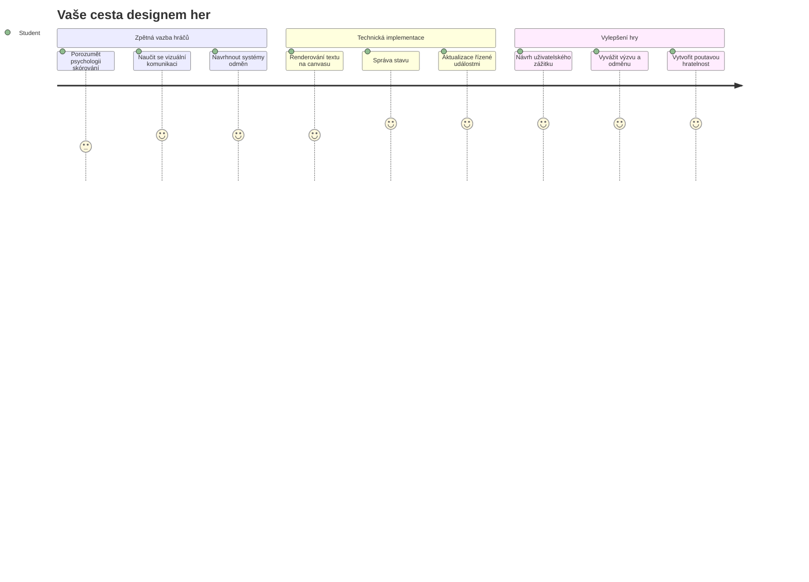
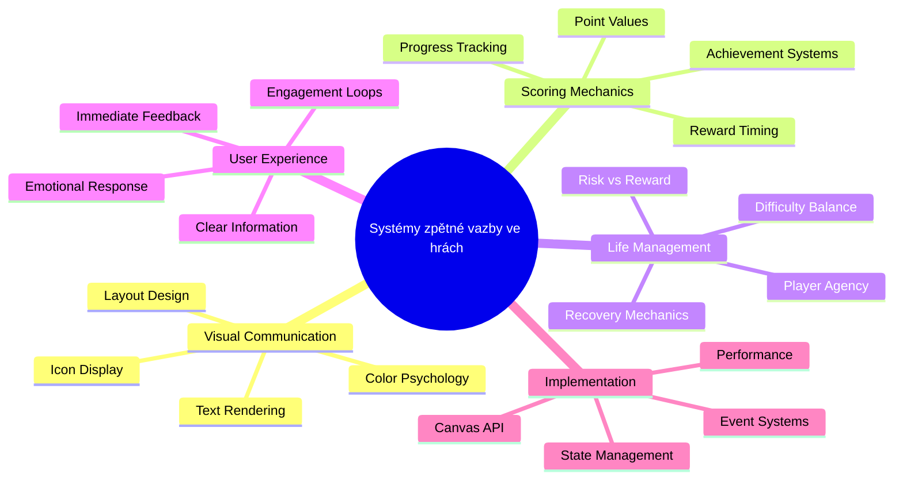
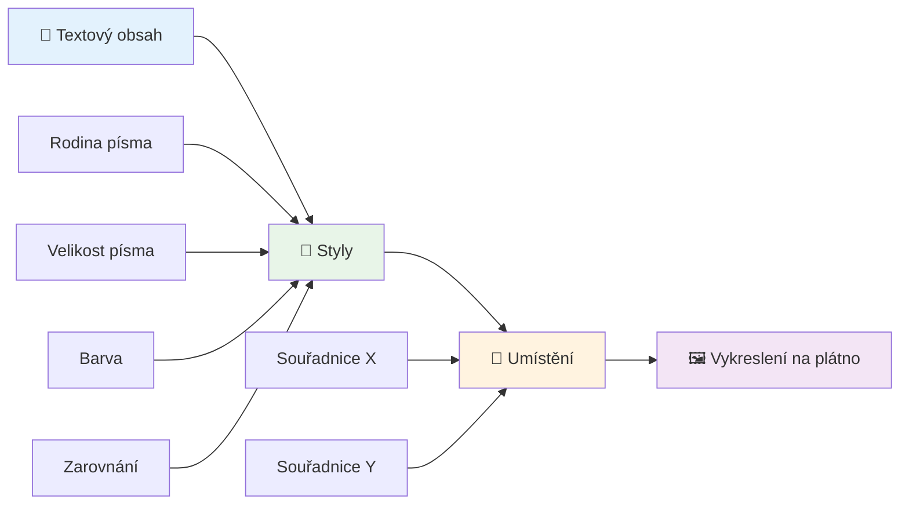
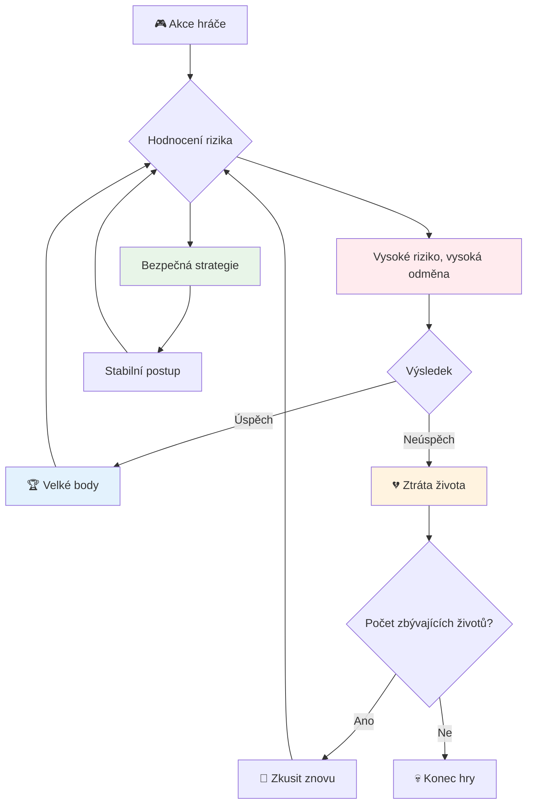
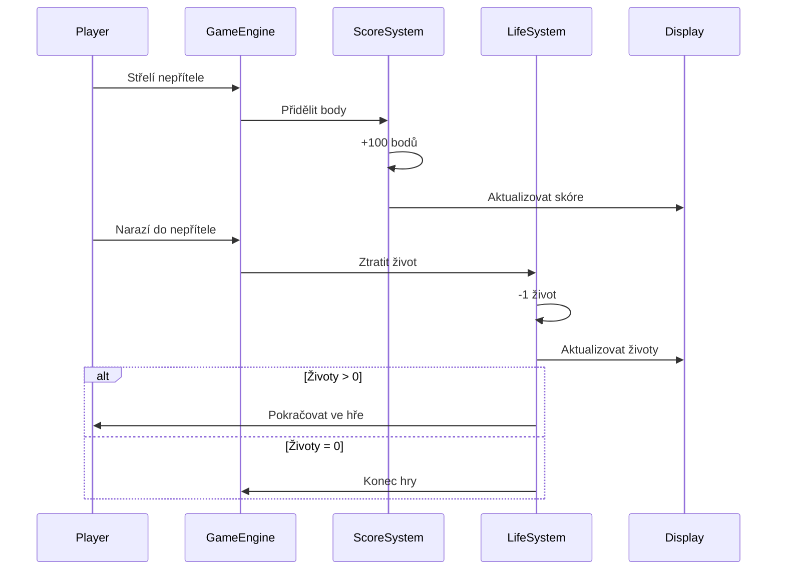
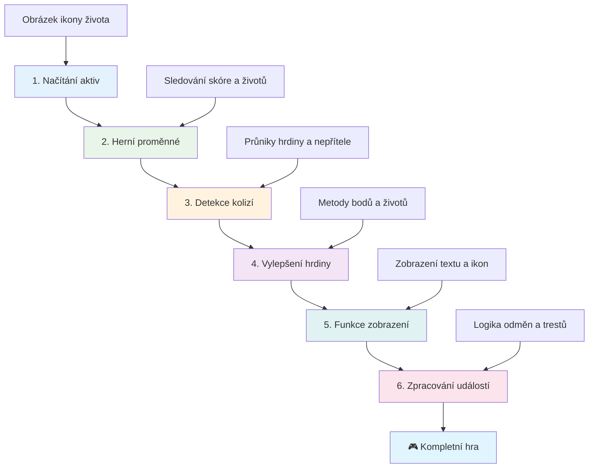
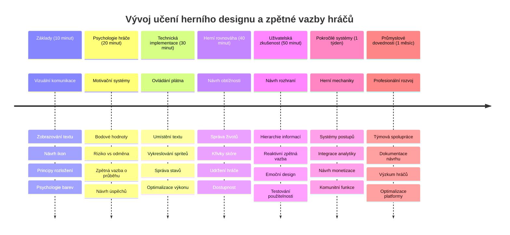

<!--
CO_OP_TRANSLATOR_METADATA:
{
  "original_hash": "2ed9145a16cf576faa2a973dff84d099",
  "translation_date": "2026-01-07T03:42:18+00:00",
  "source_file": "6-space-game/5-keeping-score/README.md",
  "language_code": "cs"
}
-->
# Vytvoření vesmírné hry část 5: Skórování a životy


## Přednáškový kvíz

[Přednáškový kvíz](https://ff-quizzes.netlify.app/web/quiz/37)

Připraveni, aby vaše vesmírná hra působila jako skutečná hra? Přidejme skórování a správu životů - základní mechaniky, které přeměnily rané arkádové hry jako Space Invaders ze jednoduchých ukázek na návykovou zábavu. To je místo, kde se vaše hra stává skutečně hratelnou.


## Kreslení textu na obrazovku - hlas vaší hry

Pro zobrazení skóre se musíme naučit, jak vykreslit text na plátno. Metoda `fillText()` je váš hlavní nástroj pro toto - je to stejná technika, kterou používaly klasické arkádové hry pro zobrazování skóre a stavových informací.


Máte úplnou kontrolu nad vzhledem textu:

```javascript
ctx.font = "30px Arial";
ctx.fillStyle = "red";
ctx.textAlign = "right";
ctx.fillText("show this on the screen", 0, 0);
```

✅ Ponořte se hlouběji do [přidávání textu na plátno](https://developer.mozilla.org/docs/Web/API/Canvas_API/Tutorial/Drawing_text) – možná budete překvapeni, jak kreativní můžete být s fonty a stylem!

## Životy - víc než jen číslo

V herním designu představuje „život“ hráčovu toleranci k chybám. Tento koncept sahá až k pinballovým strojům, kde jste měli k dispozici více koulí pro hraní. V raných videohrách jako Asteroids životy umožňovaly hráčům riskovat a učit se z chyb.


Vizuální reprezentace je velmi důležitá – zobrazování ikon lodí místo pouhého „Životy: 3“ vytváří okamžitou vizuální rozpoznatelnost, podobně jako rané arkádové stroje používaly ikonografii k překonání jazykových bariér.

## Budování systému odměn vaší hry

Nyní implementujeme základní zpětnovazebné systémy, které udržují hráče zapojené:


- **Skórovací systém**: Každá zničená nepřátelská loď uděluje 100 bodů (kulatá čísla jsou pro hráče mentálně jednodušší na počítání). Skóre se zobrazuje v levém dolním rohu.
- **Počet životů**: Váš hrdina začíná se třemi životy – standardní nastavení z raných arkád, které vyvažuje výzvu s hratelností. Každá kolize s nepřítelem stojí jednoho života. Zbývající životy zobrazíme v pravém dolním rohu pomocí ikon lodí .

## Jdeme stavět!

Nejdříve si připravte pracovní prostor. Přejděte do složky `your-work`. Měli byste vidět tyto soubory:

```bash
-| assets
  -| enemyShip.png
  -| player.png
  -| laserRed.png
-| index.html
-| app.js
-| package.json
```

Pro otestování hry spusťte vývojový server ze složky `your_work`:

```bash
cd your-work
npm start
```

Tím spustíte lokální server na adrese `http://localhost:5000`. Otevřete tuto adresu ve svém prohlížeči a uvidíte svou hru. Otestujte ovládání pomocí šipek a zkuste střílet nepřátele, abyste ověřili, že vše funguje.


### Čas začít kódovat!

1. **Získejte potřebné vizuální zdroje**. Zkopírujte obrázek `life.png` ze složky `solution/assets/` do své složky `your-work`. Poté přidejte `lifeImg` do své funkce `window.onload`:

    ```javascript
    lifeImg = await loadTexture("assets/life.png");
    ```

1. Nezapomeňte přidat `lifeImg` do seznamu aktiv:

    ```javascript
    let heroImg,
    ...
    lifeImg,
    ...
    eventEmitter = new EventEmitter();
    ```
  
2. **Nastavte herní proměnné**. Přidejte kód pro sledování celkového skóre (začíná na 0) a zbývajících životů (začíná na 3). Tyto hodnoty zobrazíme na obrazovce, aby hráči vždy věděli, kde stojí.

3. **Implementujte detekci kolizí**. Rozšiřte svou funkci `updateGameObjects()`, aby detekovala kolize nepřátel s vaším hrdinou:

    ```javascript
    enemies.forEach(enemy => {
        const heroRect = hero.rectFromGameObject();
        if (intersectRect(heroRect, enemy.rectFromGameObject())) {
          eventEmitter.emit(Messages.COLLISION_ENEMY_HERO, { enemy });
        }
      })
    ```

4. **Přidejte sledování životů a bodů do vaší třídy Hero**. 
   1. **Inicializujte čítače**. Pod `this.cooldown = 0` ve třídě `Hero` nastavte životy a body:

        ```javascript
        this.life = 3;
        this.points = 0;
        ```

   1. **Zobrazte tyto hodnoty hráči**. Vytvořte funkce pro vykreslení těchto hodnot na obrazovce:

        ```javascript
        function drawLife() {
          // TODO, 35, 27
          const START_POS = canvas.width - 180;
          for(let i=0; i < hero.life; i++ ) {
            ctx.drawImage(
              lifeImg, 
              START_POS + (45 * (i+1) ), 
              canvas.height - 37);
          }
        }
        
        function drawPoints() {
          ctx.font = "30px Arial";
          ctx.fillStyle = "red";
          ctx.textAlign = "left";
          drawText("Points: " + hero.points, 10, canvas.height-20);
        }
        
        function drawText(message, x, y) {
          ctx.fillText(message, x, y);
        }

        ```

   1. **Začněte vše napojovat do herní smyčky**. Přidejte tyto funkce do `window.onload` ihned po `updateGameObjects()`:

        ```javascript
        drawPoints();
        drawLife();
        ```

### 🔄 **Pedagogická kontrola**
**Pochopení herního designu**: Než implementujete důsledky, ujistěte se, že chápete:
- ✅ Jak vizuální zpětná vazba komunikuje hráčům herní stav
- ✅ Proč konzistentní umístění prvků UI zlepšuje použitelnost
- ✅ Psychologii bodových hodnot a správy životů
- ✅ Jak se vykreslování textu na plátně liší od HTML textu

**Rychlý test**: Proč arkádové hry obvykle používají kulatá čísla pro hodnoty bodů?
*Odpověď: Kulatá čísla jsou pro hráče mentálně jednodušší na výpočty a poskytují uspokojivé psychologické odměny*

**Principy uživatelského zážitku**: Nyní aplikujete:
- **Vizuální hierarchii**: Důležité informace umístěné prominentně
- **Okamžitou zpětnou vazbu**: Aktualizace v reálném čase podle akcí hráče
- **Kognitivní zátěž**: Jednoduché a jasné předání informací
- **Emocionální design**: Ikony a barvy, které navazují spojení s hráčem

1. **Implementujte herní důsledky a odměny**. Nyní přidáme zpětnovazebné systémy, které dávají hráčovým akcím smysl:

   1. **Kolize stojí životy**. Pokaždé, když váš hrdina narazí do nepřítele, ztratíte jeden život.
   
      Přidejte tuto metodu do třídy `Hero`:

        ```javascript
        decrementLife() {
          this.life--;
          if (this.life === 0) {
            this.dead = true;
          }
        }
        ```

   2. **Střílení nepřátel vydělává body**. Každé úspěšné zásah uděluje 100 bodů, čímž se hráčovi poskytne okamžitá pozitivní zpětná vazba za přesnou střelbu.

      Rozšiřte třídu Hero touto metodou pro navýšení bodů:
    
        ```javascript
          incrementPoints() {
            this.points += 100;
          }
        ```

        Nyní propojte tyto funkce s událostmi kolizí:

        ```javascript
        eventEmitter.on(Messages.COLLISION_ENEMY_LASER, (_, { first, second }) => {
           first.dead = true;
           second.dead = true;
           hero.incrementPoints();
        })

        eventEmitter.on(Messages.COLLISION_ENEMY_HERO, (_, { enemy }) => {
           enemy.dead = true;
           hero.decrementLife();
        });
        ```

✅ Zajímá vás i jiné hry postavené pomocí JavaScriptu a Canvasu? Prozkoumejte je - možná budete překvapeni, co je možné!

Po implementaci těchto funkcí otestujte hru a sledujte kompletní zpětnovazebný systém v akci. Měli byste vidět ikonky životů v pravém dolním rohu, skóre v levém dolním, a sledovat, jak kolize snižují životy a úspěšné zásahy zvyšují skóre.

Vaše hra nyní obsahuje základní mechaniky, které předělaly rané arkádové hry v tak poutavé zážitky - jasné cíle, okamžitou zpětnou vazbu a smysluplné důsledky hráčových akcí.

### 🔄 **Pedagogická kontrola**
**Kompletní systém herního designu**: Ověřte si zvládnutí systémů zpětné vazby hráče:
- ✅ Jak skórovací mechaniky vytvářejí motivaci a zapojení hráče?
- ✅ Proč je vizuální konzistence důležitá pro design uživatelského rozhraní?
- ✅ Jak systém životů vyvažuje výzvu a udržení hráče?
- ✅ Jakou roli hraje okamžitá zpětná vazba v uspokojivém herním zážitku?

**Integrace systému**: Váš zpětnovazebný systém demonstruje:
- **Design uživatelského zážitku**: Jasná vizuální komunikace a hierarchie informací
- **Architekturu řízenou událostmi**: Responzivní aktualizace podle akcí hráče
- **Správu stavu**: Sledování a zobrazování dynamických herních dat
- **Ovládání Canvasu**: Vykreslování textu a pozicování sprite
- **Herní psychologii**: Pochopení motivace a zapojení hráče

**Profesionální vzory**: Implementovali jste:
- **Architekturu MVC**: Oddělení herní logiky, dat a prezentace
- **Observer Pattern**: Aktualizace řízené událostmi při změnách stavu hry
- **Design komponent**: Znovupoužitelné funkce pro vykreslování a logiku
- **Optimalizaci výkonu**: Efektivní vykreslování v herních smyčkách

### ⚡ **Co můžete zvládnout během dalších 5 minut**
- [ ] Experimentujte s různými velikostmi a barvami fontu pro zobrazení skóre
- [ ] Zkuste změnit hodnoty bodů a pozorujte, jak to ovlivní pocit z hraní
- [ ] Přidejte `console.log` výpisy pro sledování změn bodů a životů
- [ ] Otestujte hraniční situace jako vyčerpání životů nebo dosažení vysokého skóre

### 🎯 **Co můžete zvládnout za hodinu**
- [ ] Dokončete poporodnou lekci a pochopte psychologii herního designu
- [ ] Přidejte zvukové efekty pro získávání bodů a ztrátu životů
- [ ] Implementujte systém vysokých skóre pomocí localStorage
- [ ] Vytvořte různě bodované hodnoty pro různé typy nepřátel
- [ ] Přidejte vizuální efekty jako otřesy obrazovky při ztrátě života

### 📅 **Váš týdenní herní designový program**
- [ ] Dokončete celou vesmírnou hru s propracovanými zpětnovazebnými systémy
- [ ] Implementujte pokročilé skórovací mechaniky jako komba násobiče
- [ ] Přidejte achievementy a odemykatelný obsah
- [ ] Vytvořte postupné zvyšování obtížnosti a vyvažovací systém
- [ ] Navrhněte uživatelská rozhraní pro menu a obrazovky konce hry
- [ ] Studujte jiné hry a zkoumejte mechanismy zapojení

### 🌟 **Váš měsíční mistr herního vývoje**
- [ ] Stavte kompletní hry s komplexními postupnými systémy
- [ ] Naučte se herní analytiku a měření chování hráčů
- [ ] Přispívejte do open source projektů herního vývoje
- [ ] Ovládněte pokročilé vzory herního designu a monetizaci
- [ ] Vytvářejte vzdělávací materiály o herním designu a UX
- [ ] Budujte portfolio prezentující vaše dovednosti v designu a vývoji

## 🎯 Časová osa vašeho mistrovství herního designu


### 🛠️ Shrnutí nástrojové sady herního designera

Po dokončení této lekce ovládáte:
- **Psychologii hráče**: Pochopení motivace, rizik/odměn a zapojovacích smyček
- **Vizuální komunikaci**: Efektivní UI design s použitím textu, ikon a rozložení
- **Zpětnovazebné systémy**: Reakce v reálném čase na akce hráče a herní události
- **Správu stavu**: Efektivní sledování a zobrazování dynamických herních dat
- **Vykreslování textu na canvas**: Profesionální zobrazení textu se stylem a pozicováním
- **Integraci událostí**: Propojení uživatelských akcí s významnými herními důsledky
- **Herní rovnováhu**: Navrhování obtížnostních křivek a systémů postupů hráče

**Aplikace ve skutečném světě**: Vaše dovednosti herního designu se přímo uplatní v:
- **Designu uživatelského rozhraní**: Vytváření poutavých a intuitivních rozhraní
- **Vývoji produktů**: Pochopení motivace uživatelů a zpětných vazeb
- **Vzdělávací technologii**: Gamifikace a systémy zapojení do učení
- **Vizualizaci dat**: Zpřístupnění složitých informací poutavou formou
- **Vývoji mobilních aplikací**: Mechaniky udržení a design uživatelského zážitku
- **Marketingové technologii**: Pochopení chování uživatelů a optimalizace konverzí

**Získané profesionální dovednosti**: Nyní můžete:
- **Navrhovat** uživatelské zážitky, které motivují a zapojují uživatele
- **Implementovat** zpětnovazebné systémy, které efektivně řídí chování uživatelů
- **Vyvažovat** výzvy a dostupnost v interaktivních systémech
- **Vytvářet** vizuální komunikaci fungující napříč různými skupinami uživatelů
- **Analyzovat** chování uživatelů a iterovat designové zlepšení

**Ovládnuté koncepty vývoje her**:
- **Motivaci hráče**: Pochopení, co podněcuje zapojení a udržení
- **Vizuální design**: Vytváření jasných, atraktivních a funkčních rozhraní
- **Integraci systémů**: Propojení více herních systémů pro soudržný zážitek
- **Optimalizaci výkonu**: Efektivní vykreslování a správa stavu
- **Dostupnost**: Navrhování pro různé úrovně dovedností a potřeby hráčů

**Další kroky**: Jste připraveni prozkoumat pokročilé vzory herního designu, implementovat analytické systémy nebo studovat monetizaci a strategie udržení hráčů!

🌟 **Ocenění získáno**: Vybudovali jste kompletní systém zpětné vazby hráče podle profesionálních principů herního designu!

---

## GitHub Copilot Agent Výzva 🚀

Použijte režim Agenta k dokončení následující výzvy:

**Popis:** Vylepšete skórovací systém vesmírné hry implementací funkce vysokého skóre s perzistentním uložením a bonusovým systémem bodování.

**Úkol:** Vytvořte systém vysokých skóre, který uloží nejlepší dosažené skóre hráče do localStorage. Přidejte bonusové body za po sobě jdoucí zabití nepřátel (combo systém) a implementujte různé hodnoty bodů pro různé typy nepřátel. Ukažte vizuální indikátor při dosažení nového rekordu a zobrazte aktuální nejvyšší skóre na herní obrazovce.


## 🚀 Výzva

Nyní máte funkční hru se skórováním a životy. Zvažte, jaké další funkce by mohly vylepšit herní zážitek.

## Kvíz po přednášce

[Post-lecture quiz](https://ff-quizzes.netlify.app/web/quiz/38)

## Přehled & Samostudium

Chcete-li zkoumat více, prozkoumejte různé přístupy ke skórování a systémům životů ve hrách. Existují fascinující herní enginy, jako je [PlayFab](https://playfab.com), které řeší skórování, žebříčky a postup hráčů. Jak by vám integrace něčeho takového mohla posunout vaši hru na další úroveň?

## Zadání

[Vytvořte hru se skórováním](assignment.md)

---

<!-- CO-OP TRANSLATOR DISCLAIMER START -->
**Upozornění**:  
Tento dokument byl přeložen pomocí AI překladatelské služby [Co-op Translator](https://github.com/Azure/co-op-translator). Přestože usilujeme o přesnost, vezměte prosím na vědomí, že automatizované překlady mohou obsahovat chyby či nepřesnosti. Původní dokument v jeho mateřském jazyce by měl být považován za autoritativní zdroj. Pro kritické informace je doporučen profesionální lidský překlad. Nejsme odpovědní za jakékoliv nedorozumění nebo nesprávné výklady vzniklé používáním tohoto překladu.
<!-- CO-OP TRANSLATOR DISCLAIMER END -->