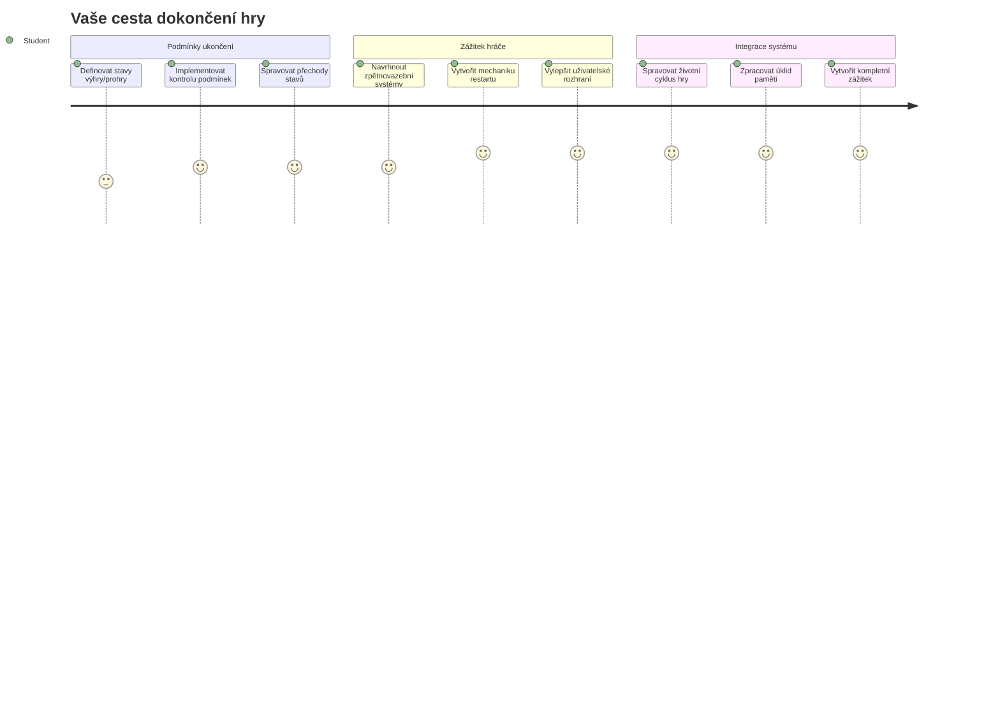
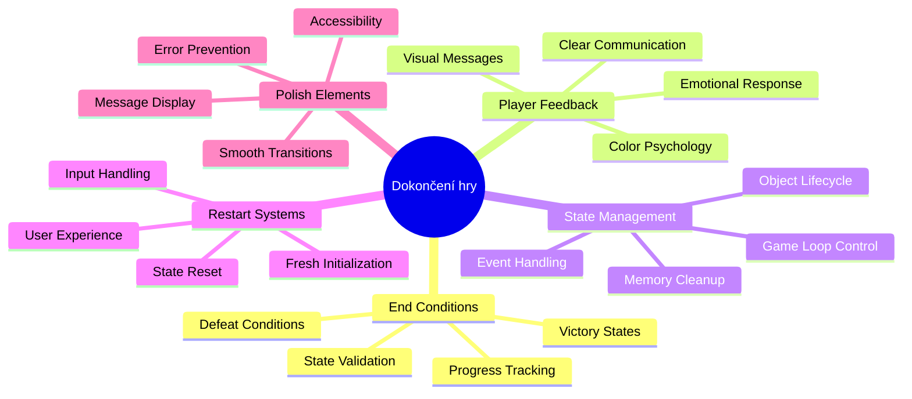
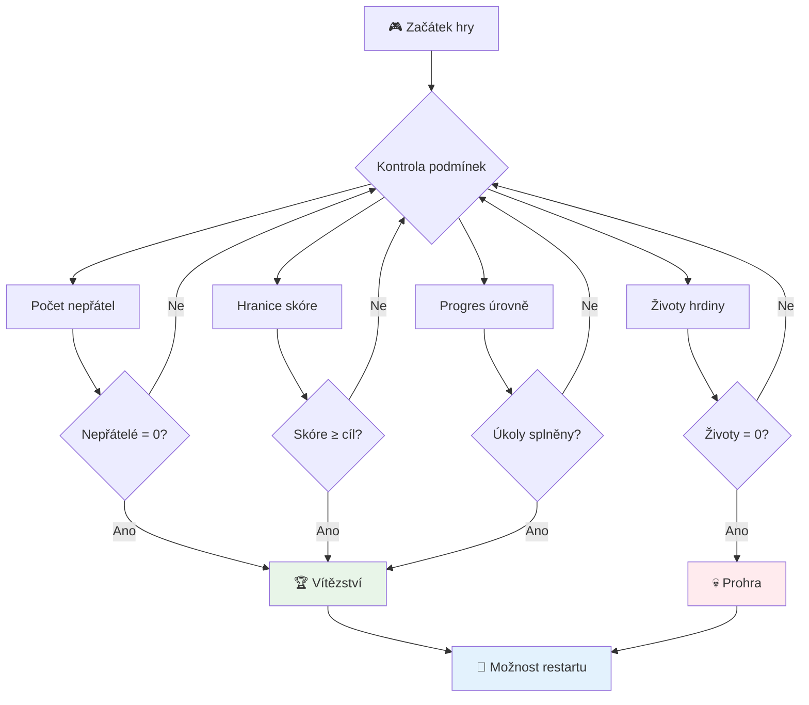
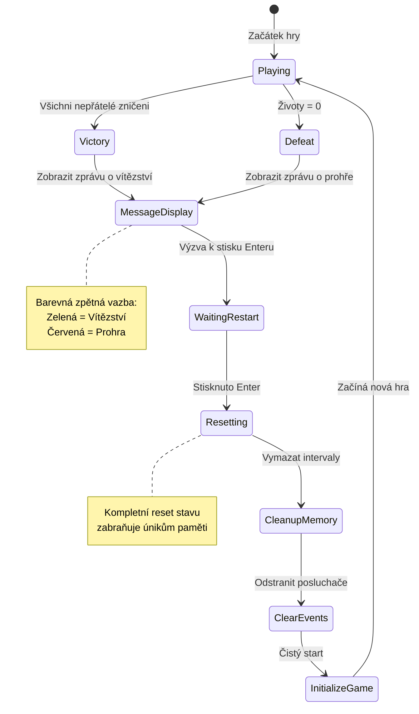
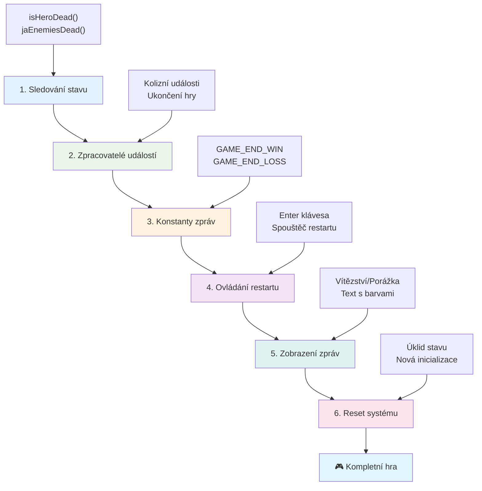
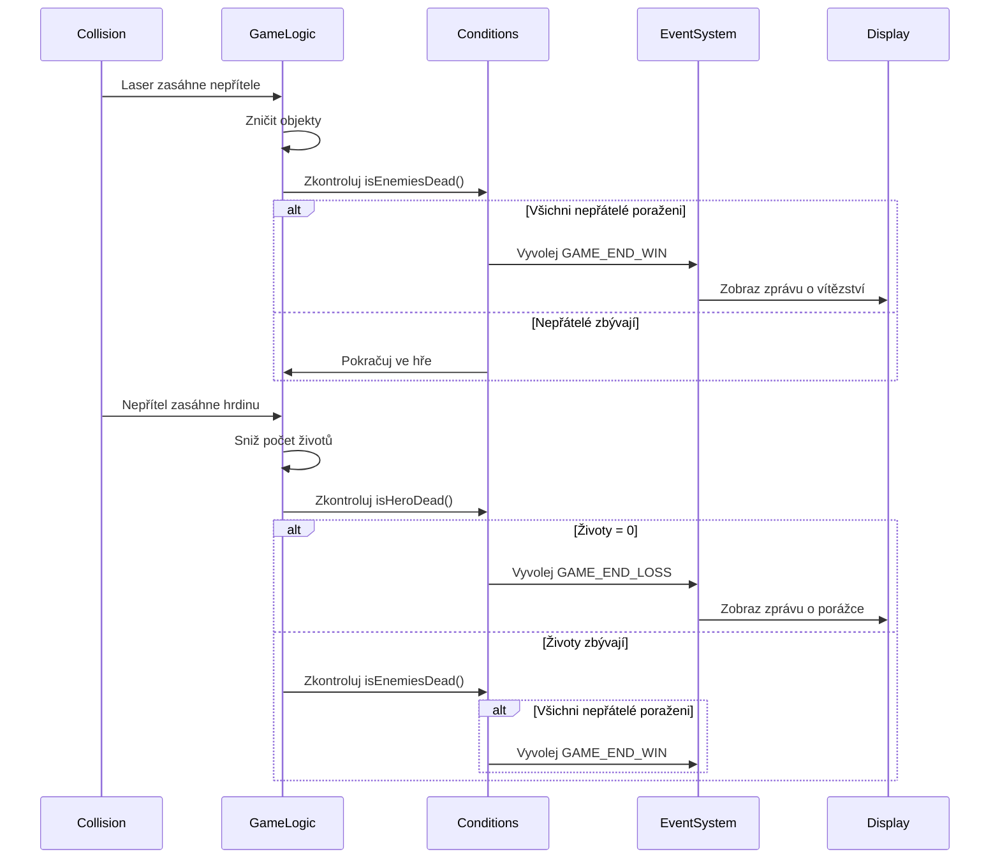
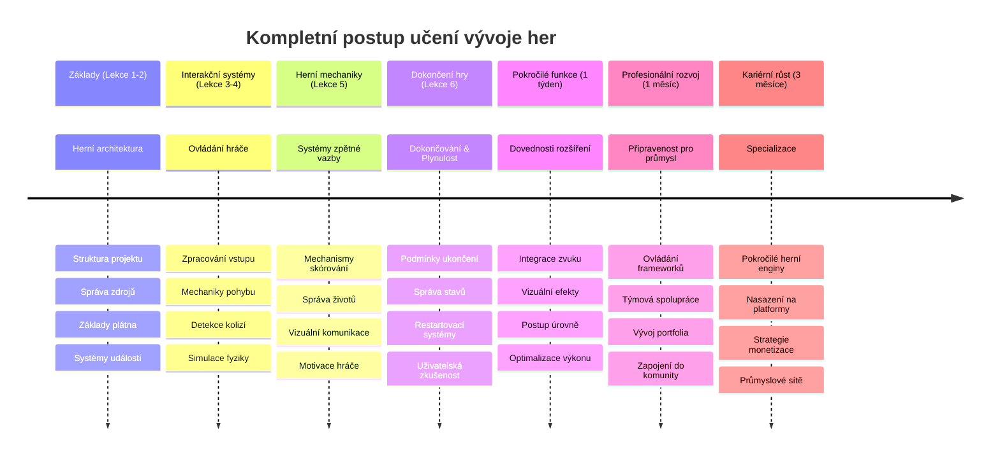

<!--
CO_OP_TRANSLATOR_METADATA:
{
  "original_hash": "a4b78043f4d64bf3ee24e0689b8b391d",
  "translation_date": "2026-01-07T03:40:49+00:00",
  "source_file": "6-space-game/6-end-condition/README.md",
  "language_code": "cs"
}
-->
# Vytvořte vesmírnou hru část 6: Konec a restart


Každá skvělá hra potřebuje jasné koncové podmínky a plynulý mechanismus restartu. Vybudovali jste působivou vesmírnou hru s pohybem, bojem a skórováním – nyní je čas přidat poslední dílky, díky kterým hra bude působit dokončeně.

Vaše hra v současné době běží nekonečně, podobně jako sonda Voyager, kterou NASA vypustila v roce 1977 – stále cestuje vesmírem desetiletí poté. To je sice v pořádku pro vesmírný průzkum, ale hry potřebují definované koncové body, aby vytvářely uspokojivé zážitky.

Dnes implementujeme správné podmínky výhry/prohry a systém restartu. Na konci této lekce budete mít vyladěnou hru, kterou hráči mohou dokončit a znovu hrát, stejně jako klasické arkádové hry, jež definovaly tento žánr.


## Přednáškový kvíz

[Přednáškový kvíz](https://ff-quizzes.netlify.app/web/quiz/39)

## Pochopení koncových podmínek hry

Kdy by měla vaše hra skončit? Tato základní otázka formuje herní design již od rané arkádové éry. Pac-Man končí, když vás chytí duchové nebo vyčistíte všechny tečky, zatímco Space Invaders končí, když mimozemšťané dorazí na spodní část obrazovky nebo je všechny zničíte.

Jako tvůrce hry definujete podmínky pro vítězství a porážku. Pro naši vesmírnou hru zde jsou ověřené přístupy, které vytvářejí poutavou hratelnost:


- **Bylo zničeno `N` nepřátelských lodí**: Je běžné, že pokud hru dělíte do různých úrovní, je potřeba zničit `N` nepřátelských lodí, abyste dokončili úroveň.
- **Vaše loď byla zničena**: Existují hry, kde prohráváte, pokud je vaše loď zničena. Dalším běžným přístupem je koncept životů. Pokaždé, když je vaše loď zničena, odečte jeden život. Po ztrátě všech životů prohráváte hru.
- **Nasbírali jste `N` bodů**: Další běžnou koncovou podmínkou je nasbírání bodů. Jak body získáte je na vás, ale je běžné přiřazovat body za různé aktivity, jako je zničení nepřátelské lodě nebo sbírání předmětů, které se *vhazují*, když jsou zničeny.
- **Dokončení úrovně**: To může zahrnovat několik podmínek, například `X` zničených nepřátel, nasbírání `Y` bodů, nebo třeba že byl nasbíraný konkrétní předmět.

## Implementace funkčnosti restartu hry

Dobré hry podporují opakované hraní díky hladkým restartovacím mechanismům. Když hráči dokončí hru (nebo prohrají), často chtějí hned zkusit znovu – ať už aby překonali své skóre, nebo zlepšili výkon.


Tetris je toho dokonalým příkladem: když vám kostky dosáhnou na vrchol, můžete okamžitě začít novou hru bez složitého procházení menu. My vytvoříme podobný restartovací systém, který čistě resetuje herní stav a rychle vrací hráče zpět do akce.

✅ **Zamyslete se**: Zkuste si vzpomenout na hry, které jste hráli. Za jakých podmínek končí a jak jste vyzváni k restartu? Co dělá restart plynulý nebo naopak frustrující?

## Co postavíte

Implementujete poslední funkce, které vaše projekt promění v kompletní herní zážitek. Tyto prvky odlišují vyladěné hry od základních prototypů.

**Dnes přidáváme:**

1. **Podmínku vítězství**: Zničte všechny nepřátele a oslavujte správně (zasloužíte si to!)
2. **Podmínku porážky**: Ztratíte všechny životy a připravte se na obrazovku porážky
3. **Mechanismus restartu**: Stiskněte Enter a hned skočte zpátky – protože jedna hra nikdy nestačí
4. **Správu stavu**: Čistý start vždy – žádní zbylí nepřátelé nebo podivné chyby z poslední hry

## Začínáme

Připravte si své vývojové prostředí. Měli byste mít všechny soubory vesmírné hry z předchozích lekcí přichystané.

**Váš projekt by měl vypadat asi takto:**

```bash
-| assets
  -| enemyShip.png
  -| player.png
  -| laserRed.png
  -| life.png
-| index.html
-| app.js
-| package.json
```

**Spusťte svůj vývojový server:**

```bash
cd your-work
npm start
```

**Tento příkaz:**
- Spustí lokální server na `http://localhost:5000`
- Správně servíruje vaše soubory
- Automaticky obnovuje stránku při změnách

Otevřete `http://localhost:5000` ve vašem prohlížeči a ověřte, že hra běží. Měli byste být schopni se pohybovat, střílet a interagovat s nepřáteli. Pokud je vše v pořádku, můžeme pokračovat s implementací.

> 💡 **Tip pro vývojáře**: Aby se vyhnuli varováním ve Visual Studio Code, deklarujte `gameLoopId` nahoře ve vašem souboru jako `let gameLoopId;` místo deklarování uvnitř funkce `window.onload`. To odpovídá moderním zásadám deklarace proměnných v JavaScriptu.


## Kroky implementace

### Krok 1: Vytvoření funkcí pro sledování koncových podmínek

Potřebujeme funkce, které budou sledovat, kdy by hra měla skončit. Jako senzory na Mezinárodní vesmírné stanici, které neustále monitorují kritické systémy, tyto funkce budou průběžně kontrolovat stav hry.

```javascript
function isHeroDead() {
  return hero.life <= 0;
}

function isEnemiesDead() {
  const enemies = gameObjects.filter((go) => go.type === "Enemy" && !go.dead);
  return enemies.length === 0;
}
```

**Co se děje na pozadí:**
- **Kontroluje**, jestli našemu hrdinovi došly životy (au!)
- **Počítá**, kolik nepřátel je ještě naživu a aktivních
- **Vrací** `true`, když je bojové pole očištěné od nepřátel
- **Používá** jednoduchou logiku pravda/nepravda pro přehlednost
- **Filtruje** všechny herní objekty, aby našel přeživší

### Krok 2: Aktualizace obsluh událostí pro koncové podmínky

Nyní připojíme tyto kontroly podmínek k systému událostí hry. Pokaždé, když dojde ke kolizi, hra vyhodnotí, zda to spouští koncovou podmínku. To vytváří okamžitou zpětnou vazbu pro kritické herní události.


```javascript
eventEmitter.on(Messages.COLLISION_ENEMY_LASER, (_, { first, second }) => {
    first.dead = true;
    second.dead = true;
    hero.incrementPoints();

    if (isEnemiesDead()) {
      eventEmitter.emit(Messages.GAME_END_WIN);
    }
});

eventEmitter.on(Messages.COLLISION_ENEMY_HERO, (_, { enemy }) => {
    enemy.dead = true;
    hero.decrementLife();
    if (isHeroDead())  {
      eventEmitter.emit(Messages.GAME_END_LOSS);
      return; // ztráta před vítězstvím
    }
    if (isEnemiesDead()) {
      eventEmitter.emit(Messages.GAME_END_WIN);
    }
});

eventEmitter.on(Messages.GAME_END_WIN, () => {
    endGame(true);
});
  
eventEmitter.on(Messages.GAME_END_LOSS, () => {
  endGame(false);
});
```

**Co se zde děje:**
- **Laser zasáhne nepřítele**: Oba zmizí, získáte body a zkontrolujeme, jestli jste vyhráli
- **Nepřítel zasáhne vás**: Ztratíte život a zkontrolujeme, jestli ještě dýcháte
- **Chytré řazení**: Kontrolujeme porážku nejdřív (nikdo nechce vyhrát a prohrát zároveň!)
- **Okamžité reakce**: Jakmile se stane něco důležitého, hra o tom ví

### Krok 3: Přidejte nové konstanty zpráv

Budete potřebovat přidat nové typy zpráv do své konstanty `Messages`. Tyto konstanty pomáhají udržovat konzistenci a předcházet překlepům ve vašem eventovém systému.

```javascript
GAME_END_LOSS: "GAME_END_LOSS",
GAME_END_WIN: "GAME_END_WIN",
```

**V uvedeném jsme:**
- **Přidali** konstanty pro herní koncové události, aby byla zachována konzistence
- **Použili** popisná jména, která jasně vyjadřují účel události
- **Dodrželi** stávající pojmenovací konvence typů zpráv

### Krok 4: Implementujte ovládání restartu

Nyní přidáte klávesové ovládání, které umožní hráčům restartovat hru. Klávesa Enter je přirozená volba, protože obvykle slouží k potvrzování akcí a spouštění nových her.

**Přidejte detekci klávesy Enter do svého existujícího posluchače událostí keydown:**

```javascript
else if(evt.key === "Enter") {
   eventEmitter.emit(Messages.KEY_EVENT_ENTER);
}
```

**Přidejte novou konstantu zprávy:**

```javascript
KEY_EVENT_ENTER: "KEY_EVENT_ENTER",
```

**Co potřebujete vědět:**
- **Rozšiřuje** stávající systém zpracování klávesových událostí
- **Používá** klávesu Enter jako spouštěč restartu pro intuitivní ovládání
- **Vyvolává** vlastní událost, kterou mohou poslouchat další části hry
- **Dodržuje** stejný vzor jako vaše ostatní ovládání klávesnicí

### Krok 5: Vytvořte systém zobrazení zpráv

Vaše hra musí hráčům jasně sdělovat výsledky. Vytvoříme systém zpráv, který zobrazuje stavy vítězství a porážky pomocí barevného kódování textu, podobně jako terminálové rozhraní raných počítačových systémů, kde zelená značí úspěch a červená chybu.

**Vytvořte funkci `displayMessage()`:**

```javascript
function displayMessage(message, color = "red") {
  ctx.font = "30px Arial";
  ctx.fillStyle = color;
  ctx.textAlign = "center";
  ctx.fillText(message, canvas.width / 2, canvas.height / 2);
}
```

**Krok za krokem, co se děje:**
- **Nastavuje** velikost a rodinu písma pro jasný a čitelný text
- **Aplikuje** parametr barvy s výchozí hodnotou „červená“ pro varování
- **Vycentruje** text horizontálně i vertikálně na plátno
- **Používá** moderní JavaScript výchozí parametry pro flexibilní zadávání barvy
- **Využívá** 2D kontext canvasu pro přímé vykreslení textu

**Vytvořte funkci `endGame()`:**

```javascript
function endGame(win) {
  clearInterval(gameLoopId);

  // Nastavte prodlevu, aby se zajistilo dokončení všech čekajících vykreslení
  setTimeout(() => {
    ctx.clearRect(0, 0, canvas.width, canvas.height);
    ctx.fillStyle = "black";
    ctx.fillRect(0, 0, canvas.width, canvas.height);
    if (win) {
      displayMessage(
        "Victory!!! Pew Pew... - Press [Enter] to start a new game Captain Pew Pew",
        "green"
      );
    } else {
      displayMessage(
        "You died !!! Press [Enter] to start a new game Captain Pew Pew"
      );
    }
  }, 200)  
}
```

**Co tato funkce dělá:**
- **Zamrzne** vše na místě – žádné další pohyby lodí nebo laserů
- **Dá** malou pauzu (200 ms), aby se poslední snímek stačil dokončit
- **Vyčistí** obrazovku a natře ji černě pro dramatický efekt
- **Zobrazí** odlišné zprávy pro vítěze a poražené
- **Barevně zvýrazní** zprávy – zelená pro úspěch, červená pro... no, ne příliš úspěch
- **Řekne** hráčům přesně, jak znovu začít

### 🔄 **Pedagogická kontrola**
**Správa herního stavu**: Před implementací resetu se ujistěte, že rozumíte:
- ✅ Jak koncové podmínky vytvářejí jasné herní cíle
- ✅ Proč je vizuální zpětná vazba zásadní pro porozumění hráče
- ✅ Význam správného úklidu pro prevenci úniků paměti
- ✅ Jak událostmi řízená architektura umožňuje čisté přechody stavů

**Rychlý autoselftest**: Co se stane, pokud během resetu neodstraníte posluchače událostí?
*Odpověď: Úniky paměti a duplicitní obslužné rutiny vedoucí k nepředvídatelnému chování*

**Principy herního designu**: Implementujete teď:
- **Jasné cíle**: Hráči přesně vědí, co znamená úspěch a neúspěch
- **Okamžitou zpětnou vazbu**: Změny stavu hry jsou komunikovány ihned
- **Kontrolu uživatele**: Hráči mohou restartovat, kdy chtějí
- **Spolehlivost systému**: Správný úklid předchází chybám a závadám

### Krok 6: Implementace resetu hry

Resetovací systém musí kompletně vyčistit aktuální herní stav a inicializovat novou herní session. To zajistí hráčům čistý start bez pozůstatků dat z předchozí hry.

**Vytvořte funkci `resetGame()`:**

```javascript
function resetGame() {
  if (gameLoopId) {
    clearInterval(gameLoopId);
    eventEmitter.clear();
    initGame();
    gameLoopId = setInterval(() => {
      ctx.clearRect(0, 0, canvas.width, canvas.height);
      ctx.fillStyle = "black";
      ctx.fillRect(0, 0, canvas.width, canvas.height);
      drawPoints();
      drawLife();
      updateGameObjects();
      drawGameObjects(ctx);
    }, 100);
  }
}
```

**Pojďme si vysvětlit jednotlivé části:**
- **Kontroluje**, zda právě běží herní smyčka před resetem
- **Zastavuje** existující herní smyčku, aby ukončil veškeré běžící aktivity
- **Odstraňuje** všechny posluchače událostí, aby zabránil únikům paměti
- **Znovu inicializuje** herní stav s novými objekty a proměnnými
- **Spouští** novou herní smyčku se všemi potřebnými funkcemi
- **Dodržuje** stejný interval 100 ms pro konzistentní výkon

**Přidejte obslužnou funkci pro klávesu Enter do funkce `initGame()`:**

```javascript
eventEmitter.on(Messages.KEY_EVENT_ENTER, () => {
  resetGame();
});
```

**Přidejte metodu `clear()` do třídy EventEmitter:**

```javascript
clear() {
  this.listeners = {};
}
```

**Klíčové body k zapamatování:**
- **Propojuje** stisk klávesy Enter s funkcí resetu hry
- **Registruje** posluchače události během inicializace hry
- **Nabízí** čistý způsob, jak odstranit všechny posluchače při resetu
- **Zabraňuje** únikům paměti tím, že maže event handlery mezi hrami
- **Resetuje** objekt posluchačů na prázdný stav pro novou inicializaci

## Gratulujeme! 🎉

👽 💥 🚀 Úspěšně jste vybudovali kompletní hru od začátku. Stejně jako programátoři, kteří vytvořili první videohry v 70. letech, jste proměnili řádky kódu v interaktivní zážitek se správnou herní mechanikou a zpětnou vazbou uživateli. 🚀 💥 👽

**Dokončili jste:**
- **Implementaci** kompletních podmínek výhry a prohry s uživatelskou zpětnou vazbou
- **Vytvoření** bezproblémového systému restartu pro nepřetržitou hratelnost
- **Návrh** jasné vizuální komunikace herních stavů
- **Správu** složitých přechodů stavů a úklidu
- **Složení** všech komponent do soudržné, hratelné hry

### 🔄 **Pedagogická kontrola**
**Kompletní systém vývoje hry**: Oslavujte své zvládnutí celého cyklu vývoje hry:
- ✅ Jak koncové podmínky vytváří uspokojivé zážitky hráče?
- ✅ Proč je správná správa stavu kritická pro stabilitu hry?
- ✅ Jak vizuální zpětná vazba zlepšuje porozumění hráče?
- ✅ Jakou roli hraje restartovací systém v udržení hráčů?

**Ovládání systému**: Vaše kompletní hra demonstruje:
- **Full-stack herní vývoj**: Od grafiky přes vstup až po správu stavu
- **Profesionální architekturu**: Událostmi řízené systémy se správným úklidem
- **Návrh UX**: Jasná zpětná vazba a intuitivní ovládání
- **Optimalizaci výkonu**: Efektivní vykreslování a správa paměti
- **Dokončení a vzhled**: Všechny detaily, které hře dodávají pocit hotovosti

**Dovednosti připravené na průmysl**: Implementovali jste:
- **Architekturu herní smyčky**: Systémy v reálném čase s konzistentním výkonem
- **Programování řízené událostmi**: Oddělené systémy, které se efektivně škálují
- **Správu stavu**: Složitou manipulaci s daty a životní cyklus
- **Návrh uživatelského rozhraní**: Jasnou komunikaci a rychlou odezvu
- **Testování a ladění**: Iterativní vývoj a řešení problémů

### ⚡ **Co můžete udělat během následujících 5 minut**
- [ ] Zahrajte si svou kompletní hru a otestujte všechny podmínky vítězství a prohry
- [ ] Experimentujte s různými parametry koncových podmínek
- [ ] Zkuste přidat výpisy do konzole pro sledování změn herního stavu
- [ ] Sdílejte svou hru s přáteli a sbírejte zpětnou vazbu

### 🎯 **Co můžete dokončit během této hodiny**
- [ ] Dokončit post-lekční kvíz a zamyslet se nad svým vývojem hry
- [ ] Přidat zvukové efekty pro stavy vítězství a porážky
- [ ] Implementovat další koncové podmínky jako časová omezení nebo bonusové cíle
- [ ] Vytvořit různé úrovně obtížnosti s různým počtem nepřátel
- [ ] Vylepšit vizuální prezentaci lepšími fonty a barvami

### 📅 **Vaše týdenní mistrovství ve vývoji her**
- [ ] Dokončit rozšířenou vesmírnou hru s více úrovněmi a progresí
- [ ] Přidat pokročilé funkce jako power-upy, různé typy nepřátel a speciální zbraně
- [ ] Vytvořit systém vysokých skóre s přetrvávajícím uložením
- [ ] Navrhnout uživatelská rozhraní pro menu, nastavení a herní možnosti
- [ ] Optimalizovat výkon pro různá zařízení a prohlížeče
- [ ] Nasadit hru online a sdílet ji s komunitou
### 🌟 **Vaše měsíční kariéra v herním vývoji**
- [ ] Vytvořte několik kompletních her zkoumajících různé žánry a mechaniky
- [ ] Naučte se pokročilé rámce pro vývoj her jako Phaser nebo Three.js
- [ ] Přispívejte do open source projektů zaměřených na vývoj her
- [ ] Studujte principy herního designu a psychologii hráčů
- [ ] Vytvořte portfolio, které ukáže vaše dovednosti ve vývoji her
- [ ] Spojte se s komunitou herních vývojářů a pokračujte v učení

## 🎯 Váš kompletní časový plán zvládnutí herního vývoje


### 🛠️ Shrnutí vašeho kompletního nástroje pro vývoj her

Po dokončení celé série vesmírných her jste nyní zvládli:
- **Architekturu her**: Systémy řízené událostmi, herní smyčky a správa stavů
- **Grafické programování**: Canvas API, vykreslování spriteů a vizuální efekty
- **Vstupní systémy**: Zpracování klávesnice, detekce kolizí a responzivní ovládání
- **Herní design**: Zpětná vazba hráče, systémy postupů a zapojení hráčů
- **Optimalizaci výkonu**: Efektivní vykreslování, správa paměti a kontrola snímkové frekvence
- **Uživatelskou zkušenost**: Jasná komunikace, intuitivní ovládání a detaily pro vyladění
- **Profesionální vzory**: Čistý kód, techniky ladění a organizace projektů

**Praktické využití**: Vaše dovednosti ve vývoji her se přímo aplikují na:
- **Interaktivní webové aplikace**: Dynamická rozhraní a systémy v reálném čase
- **Vizualizace dat**: Animované grafy a interaktivní grafika
- **Vzdělávací technologie**: Gamifikace a poutavé vzdělávací zážitky
- **Mobilní vývoj**: Dotykové interakce a optimalizace výkonu
- **Simulační software**: Fyzikální enginy a modelování v reálném čase
- **Kreativní průmysly**: Interaktivní umění, zábava a digitální zážitky

**Získané profesní dovednosti**: Nyní můžete:
- **Navrhovat** složité interaktivní systémy od základu
- **Ladit** aplikace v reálném čase systémovým přístupem
- **Optimalizovat** výkon pro plynulý uživatelský zážitek
- **Navrhovat** poutavá uživatelská rozhraní a vzory interakcí
- **Spolupracovat** efektivně na technických projektech s řádnou organizací kódu

**Zvládnuté koncepty vývoje her**:
- **Systémy v reálném čase**: Herní smyčky, správa snímkové frekvence a výkon
- **Architektura řízená událostmi**: Oddělené systémy a předávání zpráv
- **Správa stavů**: Složitá manipulace s daty a správa životního cyklu
- **Programování uživatelského rozhraní**: Canvas grafika a responzivní design
- **Teorie herního designu**: Psychologie hráče a zapojovací mechaniky

**Další úroveň**: Jste připraveni prozkoumat pokročilé herní rámce, 3D grafiku, multiplayer systémy nebo přejít do profesionálních herních pozic!

🌟 **Ocenění odemčeno**: Dokončili jste kompletní cestu vývojem hry a vytvořili profesionálně kvalitní interaktivní zážitek od základu!

**Vítejte v komunitě herních vývojářů!** 🎮✨

## Výzva GitHub Copilot Agenta 🚀

Použijte režim Agenta k dokončení následující výzvy:

**Popis:** Vylepšete vesmírnou hru implementací systému postupování úrovní s rostoucí obtížností a bonusovými prvky.

**Výzva:** Vytvořte multiúrovňový vesmírný herní systém, kde každá úroveň má více nepřátelských lodí s vyšší rychlostí a zdravím. Přidejte multiplikátor skóre, který se zvyšuje s každou úrovní, a implementujte power-upy (například rychlá střelba nebo štít), které se náhodně objeví po zničení nepřátel. Zahrňte bonus za dokončení úrovně a na obrazovce zobrazte aktuální úroveň spolu se stávajícím skóre a počtem životů.

Další informace o [režimu agent](https://code.visualstudio.com/blogs/2025/02/24/introducing-copilot-agent-mode) zde.

## 🚀 Nepovinná výzva k vylepšení

**Přidejte do hry zvuk**: Vylepšete svůj herní zážitek implementací zvukových efektů! Zvažte přidání zvuku pro:

- **Laserové střely** při střelbě hráče
- **Zničení nepřítele** když jsou lodě zasaženy
- **Poškození hrdiny** když hráč utrpí zásahy
- **Vítěznou hudbu** při vítězství ve hře
- **Zvuk prohry** při ztrátě hry

**Příklad implementace zvuku:**

```javascript
// Vytvořit zvukové objekty
const laserSound = new Audio('assets/laser.wav');
const explosionSound = new Audio('assets/explosion.wav');

// Přehrát zvuky během herních událostí
function playLaserSound() {
  laserSound.currentTime = 0; // Resetovat na začátek
  laserSound.play();
}
```

**Co byste měli vědět:**
- **Vytváří** objekty Audio pro různé zvukové efekty
- **Resetuje** `currentTime` pro umožnění rychlé střelby zvuků
- **Řeší** politiky automatického přehrávání prohlížeče spuštěním zvuků na základě uživatelských interakcí
- **Spravuje** hlasitost a načasování zvuku pro lepší herní zážitek

> 💡 **Zdroje k učení**: Prozkoumejte tuto [audio sandbox](https://www.w3schools.com/jsref/tryit.asp?filename=tryjsref_audio_play) a naučte se víc o implementaci zvuku v JavaScriptových hrách.

## Kvíz po lekci

[Kvíz po lekci](https://ff-quizzes.netlify.app/web/quiz/40)

## Recenze a samostudium

Vaším úkolem je vytvořit novou ukázkovou hru, takže prozkoumejte některé zajímavé hry a zjistěte, jaký typ hry byste mohli vybudovat.

## Zadání

[Vytvořte ukázkovou hru](assignment.md)

---

<!-- CO-OP TRANSLATOR DISCLAIMER START -->
**Prohlášení o vyloučení odpovědnosti**:  
Tento dokument byl přeložen pomocí AI překladatelské služby [Co-op Translator](https://github.com/Azure/co-op-translator). Ač usilujeme o přesnost, mějte prosím na paměti, že automatizované překlady mohou obsahovat chyby nebo nepřesnosti. Původní dokument v jeho mateřském jazyce by měl být považován za závazný zdroj. Pro kritické informace se doporučuje profesionální lidský překlad. Nejsme odpovědni za jakékoliv nedorozumění nebo mylné interpretace vyplývající z použití tohoto překladu.
<!-- CO-OP TRANSLATOR DISCLAIMER END -->