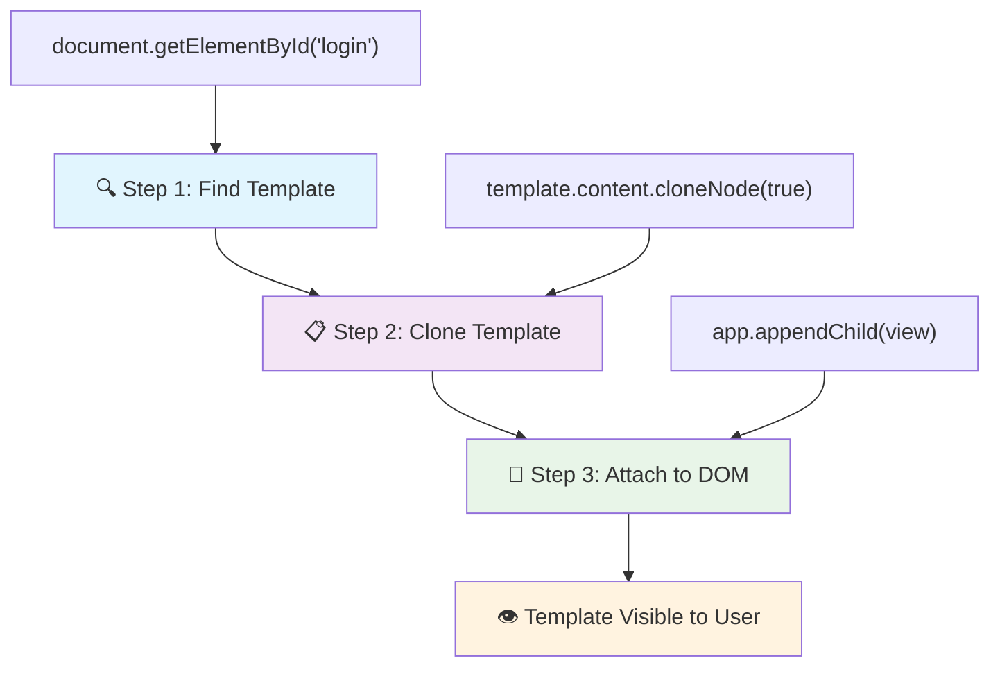
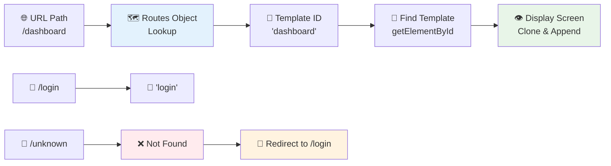
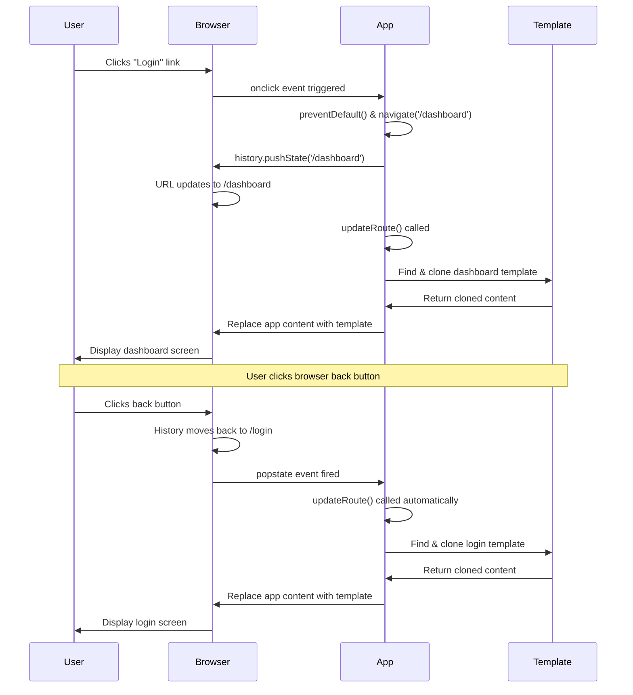
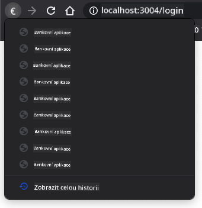

<!--
CO_OP_TRANSLATOR_METADATA:
{
  "original_hash": "5d259f6962464ad91e671083aa0398f4",
  "translation_date": "2025-10-24T21:04:41+00:00",
  "source_file": "7-bank-project/1-template-route/README.md",
  "language_code": "cs"
}
-->
# Vytvoření bankovní aplikace, část 1: HTML šablony a trasy ve webové aplikaci

Když navigační počítač Apolla 11 v roce 1969 letěl na Měsíc, musel přepínat mezi různými programy, aniž by restartoval celý systém. Moderní webové aplikace fungují podobně – mění to, co vidíte, bez nutnosti znovu načítat vše od začátku. To vytváří hladký a pohotový zážitek, který uživatelé dnes očekávají.

Na rozdíl od tradičních webových stránek, které při každé interakci znovu načítají celé stránky, moderní webové aplikace aktualizují pouze části, které je třeba změnit. Tento přístup, podobně jako když řídící středisko přepíná mezi různými displeji při zachování stálé komunikace, vytváří plynulý zážitek, na který jsme si zvykli.

Co dělá tento rozdíl tak dramatickým:

| Tradiční aplikace s více stránkami | Moderní aplikace s jednou stránkou |
|-----------------------------------|------------------------------------|
| **Navigace** | Načítání celé stránky pro každou obrazovku | Okamžité přepínání obsahu |
| **Výkon** | Pomalejší kvůli kompletnímu stahování HTML | Rychlejší díky částečným aktualizacím |
| **Uživatelský zážitek** | Rušivé blikání stránek | Plynulé, aplikaci podobné přechody |
| **Sdílení dat** | Obtížné mezi stránkami | Snadná správa stavu |
| **Vývoj** | Údržba více HTML souborů | Jedno HTML s dynamickými šablonami |

**Porozumění evoluci:**
- **Tradiční aplikace** vyžadují serverové požadavky pro každou navigační akci
- **Moderní SPA** se načítají jednou a dynamicky aktualizují obsah pomocí JavaScriptu
- **Očekávání uživatelů** nyní preferují okamžité, plynulé interakce
- **Výhody výkonu** zahrnují sníženou šířku pásma a rychlejší odezvy

V této lekci vytvoříme bankovní aplikaci s více obrazovkami, které spolu plynule spolupracují. Stejně jako vědci používají modulární nástroje, které lze přizpůsobit různým experimentům, použijeme HTML šablony jako znovupoužitelné komponenty, které lze zobrazit podle potřeby.

Budete pracovat s HTML šablonami (znovupoužitelné návrhy pro různé obrazovky), JavaScriptovými trasami (systém, který přepíná mezi obrazovkami) a historií prohlížeče (která zajišťuje správnou funkci tlačítka zpět). To jsou stejné základní techniky, které používají frameworky jako React, Vue a Angular.

Na konci budete mít funkční bankovní aplikaci, která demonstruje profesionální principy aplikací s jednou stránkou.

## Kvíz před lekcí

[Pre-lecture quiz](https://ff-quizzes.netlify.app/web/quiz/41)

### Co budete potřebovat

Budeme potřebovat lokální webový server pro testování naší bankovní aplikace – nebojte se, je to jednodušší, než to zní! Pokud ho ještě nemáte nastavený, stačí nainstalovat [Node.js](https://nodejs.org) a spustit `npx lite-server` z vaší složky projektu. Tento šikovný příkaz spustí lokální server a automaticky otevře vaši aplikaci v prohlížeči.

### Příprava

Na vašem počítači vytvořte složku s názvem `bank` a uvnitř ní soubor `index.html`. Začneme s tímto HTML [boilerplate](https://en.wikipedia.org/wiki/Boilerplate_code):

```html
<!DOCTYPE html>
<html lang="en">
  <head>
    <meta charset="UTF-8">
    <meta name="viewport" content="width=device-width, initial-scale=1.0">
    <title>Bank App</title>
  </head>
  <body>
    <!-- This is where you'll work -->
  </body>
</html>
```

**Co tento boilerplate poskytuje:**
- **Nastavuje** strukturu HTML5 dokumentu s řádnou deklarací DOCTYPE
- **Konfiguruje** kódování znaků jako UTF-8 pro podporu mezinárodního textu
- **Umožňuje** responzivní design pomocí meta tagu viewport pro mobilní kompatibilitu
- **Nastavuje** popisný název, který se zobrazí na záložce prohlížeče
- **Vytváří** čistou sekci těla, kde budeme budovat naši aplikaci

> 📁 **Náhled struktury projektu**
> 
> **Na konci této lekce bude váš projekt obsahovat:**
> ```
> bank/
> ├── index.html      <!-- Main HTML with templates -->
> ├── app.js          <!-- Routing and navigation logic -->
> └── style.css       <!-- (Optional for future lessons) -->
> ```
> 
> **Odpovědnosti souborů:**
> - **index.html**: Obsahuje všechny šablony a poskytuje strukturu aplikace
> - **app.js**: Řídí trasy, navigaci a správu šablon
> - **Šablony**: Definují uživatelské rozhraní pro přihlášení, dashboard a další obrazovky

---

## HTML šablony

Šablony řeší základní problém ve webovém vývoji. Když Gutenberg vynalezl pohyblivý typ tisku ve 40. letech 15. století, uvědomil si, že místo vyřezávání celých stránek může vytvořit znovupoužitelné bloky písmen a uspořádat je podle potřeby. HTML šablony fungují na stejném principu – místo vytváření samostatných HTML souborů pro každou obrazovku definujete znovupoužitelné struktury, které lze zobrazit podle potřeby.

Představte si šablony jako návrhy pro různé části vaší aplikace. Stejně jako architekt vytvoří jeden návrh a použije ho několikrát místo toho, aby znovu kreslil identické místnosti, vytvoříme šablony jednou a použijeme je podle potřeby. Prohlížeč tyto šablony uchovává skryté, dokud je JavaScript neaktivuje.

Pokud chcete vytvořit více obrazovek pro webovou stránku, jedním řešením by bylo vytvořit jeden HTML soubor pro každou obrazovku, kterou chcete zobrazit. Toto řešení však přináší určité nepohodlí:

- Při přepínání obrazovek musíte znovu načítat celé HTML, což může být pomalé.
- Je obtížné sdílet data mezi různými obrazovkami.

Dalším přístupem je mít pouze jeden HTML soubor a definovat více [HTML šablon](https://developer.mozilla.org/docs/Web/HTML/Element/template) pomocí elementu `<template>`. Šablona je znovupoužitelný HTML blok, který prohlížeč nezobrazuje a musí být vytvořen za běhu pomocí JavaScriptu.

### Pojďme to vytvořit

Vytvoříme bankovní aplikaci se dvěma hlavními obrazovkami: přihlašovací stránkou a dashboardem. Nejprve přidáme zástupný prvek do těla HTML – zde se objeví všechny naše různé obrazovky:

```html
<div id="app">Loading...</div>
```

**Porozumění tomuto zástupnému prvku:**
- **Vytváří** kontejner s ID "app", kde budou zobrazeny všechny obrazovky
- **Zobrazuje** zprávu o načítání, dokud JavaScript neinitializuje první obrazovku
- **Poskytuje** jediné místo pro montáž našeho dynamického obsahu
- **Umožňuje** snadné cílení z JavaScriptu pomocí `document.getElementById()`

> 💡 **Tip**: Jelikož obsah tohoto prvku bude nahrazen, můžeme sem vložit zprávu o načítání nebo indikátor, který se zobrazí během načítání aplikace.

Dále přidáme pod HTML šablonu pro přihlašovací stránku. Prozatím tam vložíme pouze nadpis a sekci obsahující odkaz, který použijeme k navigaci.

```html
<template id="login">
  <h1>Bank App</h1>
  <section>
    <a href="/dashboard">Login</a>
  </section>
</template>
```

**Rozbor této přihlašovací šablony:**
- **Definuje** šablonu s jedinečným identifikátorem "login" pro cílení z JavaScriptu
- **Obsahuje** hlavní nadpis, který určuje značku aplikace
- **Zahrnuje** sémantický element `<section>` pro seskupení souvisejícího obsahu
- **Poskytuje** navigační odkaz, který přesměruje uživatele na dashboard

Poté přidáme další HTML šablonu pro stránku dashboardu. Tato stránka bude obsahovat různé sekce:

- Záhlaví s názvem a odkazem na odhlášení
- Aktuální zůstatek na bankovním účtu
- Seznam transakcí, zobrazený v tabulce

```html
<template id="dashboard">
  <header>
    <h1>Bank App</h1>
    <a href="/login">Logout</a>
  </header>
  <section>
    Balance: 100$
  </section>
  <section>
    <h2>Transactions</h2>
    <table>
      <thead>
        <tr>
          <th>Date</th>
          <th>Object</th>
          <th>Amount</th>
        </tr>
      </thead>
      <tbody></tbody>
    </table>
  </section>
</template>
```

**Pochopení jednotlivých částí tohoto dashboardu:**
- **Strukturuje** stránku pomocí sémantického elementu `<header>` obsahujícího navigaci
- **Zobrazuje** název aplikace konzistentně na všech obrazovkách pro branding
- **Poskytuje** odkaz na odhlášení, který přesměruje zpět na přihlašovací obrazovku
- **Ukazuje** aktuální zůstatek účtu v dedikované sekci
- **Organizuje** data transakcí pomocí správně strukturované HTML tabulky
- **Definuje** záhlaví tabulky pro sloupce Datum, Objekt a Částka
- **Nechává** tělo tabulky prázdné pro dynamické vkládání obsahu později

> 💡 **Tip**: Při vytváření HTML šablon, pokud chcete vidět, jak budou vypadat, můžete zakomentovat řádky `<template>` a `</template>` pomocí `<!-- -->`.

✅ Proč si myslíte, že používáme atributy `id` na šablonách? Mohli bychom použít něco jiného, například třídy?

## Oživení šablon pomocí JavaScriptu

Nyní musíme naše šablony zprovoznit. Stejně jako 3D tiskárna vezme digitální návrh a vytvoří fyzický objekt, JavaScript vezme naše skryté šablony a vytvoří viditelné, interaktivní prvky, které uživatelé mohou vidět a používat.

Proces následuje tři konzistentní kroky, které tvoří základ moderního webového vývoje. Jakmile pochopíte tento vzor, rozpoznáte ho v mnoha frameworcích a knihovnách.

Pokud zkusíte svůj aktuální HTML soubor v prohlížeči, uvidíte, že se zasekne na zobrazení `Loading...`. To je proto, že musíme přidat nějaký JavaScriptový kód, který instancuje a zobrazí HTML šablony.

Instancování šablony se obvykle provádí ve 3 krocích:

1. Získání elementu šablony v DOM, například pomocí [`document.getElementById`](https://developer.mozilla.org/docs/Web/API/Document/getElementById).
2. Klonování elementu šablony pomocí [`cloneNode`](https://developer.mozilla.org/docs/Web/API/Node/cloneNode).
3. Připojení k DOM pod viditelný element, například pomocí [`appendChild`](https://developer.mozilla.org/docs/Web/API/Node/appendChild).



**Vizuální rozbor procesu:**
- **Krok 1** lokalizuje skrytou šablonu ve struktuře DOM
- **Krok 2** vytvoří pracovní kopii, kterou lze bezpečně upravit
- **Krok 3** vloží kopii do viditelné oblasti stránky
- **Výsledek** je funkční obrazovka, se kterou mohou uživatelé interagovat

✅ Proč musíme klonovat šablonu před jejím připojením k DOM? Co si myslíte, že by se stalo, kdybychom tento krok přeskočili?

### Úkol

Vytvořte nový soubor s názvem `app.js` ve vaší složce projektu a importujte tento soubor do sekce `<head>` vašeho HTML:

```html
<script src="app.js" defer></script>
```

**Porozumění tomuto importu skriptu:**
- **Propojuje** JavaScriptový soubor s naším HTML dokumentem
- **Používá** atribut `defer`, aby zajistil, že skript běží po dokončení analýzy HTML
- **Umožňuje** přístup ke všem DOM elementům, protože jsou plně načteny před spuštěním skriptu
- **Dodržuje** moderní osvědčené postupy pro načítání skriptů a výkon

Nyní v `app.js` vytvoříme novou funkci `updateRoute`:

```js
function updateRoute(templateId) {
  const template = document.getElementById(templateId);
  const view = template.content.cloneNode(true);
  const app = document.getElementById('app');
  app.innerHTML = '';
  app.appendChild(view);
}
```

**Krok za krokem, co se děje:**
- **Lokalizuje** element šablony pomocí jeho jedinečného ID
- **Vytváří** hlubokou kopii obsahu šablony pomocí `cloneNode(true)`
- **Najde** kontejner aplikace, kde bude obsah zobrazen
- **Vyčistí** jakýkoli existující obsah z kontejneru aplikace
- **Vloží** klonovaný obsah šablony do viditelného DOM

Nyní zavolejte tuto funkci s jednou ze šablon a podívejte se na výsledek.

```js
updateRoute('login');
```

**Co tento volání funkce provádí:**
- **Aktivuje** přihlašovací šablonu předáním jejího ID jako parametru
- **Demonstruje**, jak programově přepínat mezi různými obrazovkami aplikace
- **Zobrazuje** přihlašovací obrazovku místo zprávy "Loading..."

✅ Jaký je účel tohoto kódu `app.innerHTML = '';`? Co se stane bez něj?

## Vytváření tras

Routing je v podstatě o propojení URL s odpovídajícím obsahem. Představte si, jak raní telefonní operátoři používali přepojovací ústředny k propojení hovorů – vzali příchozí požadavek a přesměrovali ho na správné místo. Webový routing funguje podobně, bere požadavek URL a určuje, který obsah zobrazit.

Tradičně webové servery zajišťovaly toto tím, že poskytovaly různé HTML soubory pro různé URL. Protože vytváříme aplikaci s jednou stránkou, musíme tento routing zajistit sami pomocí JavaScriptu. Tento přístup nám dává větší kontrolu nad uživatelským zážitkem a výkonem.



**Porozumění toku routingu:**
- **Změny URL** spouštějí vyhledávání v naší konfiguraci tras
- **Platné trasy** mapují na konkrétní ID šablon pro vykreslení
- **Neplatné trasy** spouštějí záložní chování, aby se zabránilo rozbitým stavům
- **Vykreslení šablon** následuje tříkrokový proces, který jsme se naučili dříve

Když mluvíme o webové aplikaci, nazýváme *Routing* záměr mapovat **URL** na konkrétní obrazovky, které by měly být zobrazeny. Na webové stránce s více HTML soubory se to děje automaticky, protože cesty k souborům se odrážejí v URL. Například s těmito soubory ve vaší složce projektu:

```
mywebsite/index.html
mywebsite/login.html
mywebsite/admin/index.html
```

Pokud vytvoříte webový server s `mywebsite` jako kořen, mapování URL bude:

```
https://site.com            --> mywebsite/index.html
https://site.com/login.html --> mywebsite/login.html
https://site.com/admin/     --> mywebsite/admin/index.html
```

Nicméně, pro naši webovou aplikaci používáme jeden HTML soubor obsahující všechny obrazovky, takže toto výchozí chování nám nepomůže. Musíme tuto mapu vytvořit ručně a aktualizovat zobrazenou šablonu pomocí JavaScriptu.

### Úkol

Použijeme jednoduchý objekt k implementaci [mapy](https://en.wikipedia.org/wiki/Associative_array) mezi cestami URL a našimi šablonami. Přidejte tento objekt na začátek vašeho souboru `app.js`.

```js
const routes = {
  '/login': { templateId: 'login' },
  '/dashboard': { templateId: 'dashboard' },
};
```

**Porozumění této konfiguraci tras:**
- **Definuje** mapování mezi cestami URL a identifikátory šablon
- **Používá** syntaxi objektu, kde klíče jsou cesty URL a hodnoty obsahují informace o šablonách
- **Umožňuje** snadné vyhledávání, která šablona se má zobrazit pro danou URL
- **Poskytuje** škálovatelnou strukturu pro přidávání nových tras v budoucnu

Nyní trochu upravíme funkci `updateRoute`. Místo přímého předávání `templateId` jako argumentu chceme nejprve zjistit aktuální URL a poté použít naši mapu k získání odpovídající hodnoty ID šablony. Můžeme použít [`window.location.pathname`](https://developer.mozilla.org/docs/Web/API/Location/pathname) k získání pouze části cesty z URL.

```js
function updateRoute() {
  const path = window.location.pathname;
  const route = routes[path];

  const template = document.getElementById(route.templateId);
  const view = template.content.cloneNode(true);
  const app = document.getElementById('app');
  app.innerHTML = '';
  app.appendChild(view);
}
```

**Rozbor toho, co se zde děje:**
- **Extrahuje** aktuální cestu z URL pro
✅ Co se stane, když zadáte neznámou cestu do URL? Jak bychom to mohli vyřešit?

## Přidání navigace

S nastaveným směrováním potřebují uživatelé způsob, jak se pohybovat po aplikaci. Tradiční webové stránky načítají celé stránky při kliknutí na odkazy, ale my chceme aktualizovat URL i obsah bez obnovování stránky. To vytváří plynulejší zážitek podobný tomu, jak desktopové aplikace přepínají mezi různými pohledy.

Musíme sladit dvě věci: aktualizaci URL v prohlížeči, aby si uživatelé mohli stránky uložit do záložek a sdílet odkazy, a zobrazení odpovídajícího obsahu. Při správné implementaci to vytváří plynulou navigaci, kterou uživatelé očekávají od moderních aplikací.

> 🏗️ **Pohled na architekturu**: Komponenty navigačního systému
>
> **Co vytváříte:**
> - **🔄 Správa URL**: Aktualizuje adresní řádek prohlížeče bez obnovování stránky
> - **📋 Systém šablon**: Dynamicky mění obsah na základě aktuální trasy  
> - **📚 Integrace historie**: Udržuje funkčnost tlačítek zpět/vpřed v prohlížeči
> - **🛡️ Zpracování chyb**: Elegantní řešení pro neplatné nebo chybějící trasy
>
> **Jak komponenty spolupracují:**
> - **Naslouchají** událostem navigace (kliknutí, změny historie)
> - **Aktualizují** URL pomocí History API
> - **Zobrazují** odpovídající šablonu pro novou trasu
> - **Udržují** plynulý uživatelský zážitek

Dalším krokem pro naši aplikaci je přidání možnosti navigace mezi stránkami bez nutnosti ruční změny URL. To zahrnuje dvě věci:

  1. Aktualizaci aktuální URL
  2. Aktualizaci zobrazené šablony na základě nové URL

Druhou část jsme již vyřešili pomocí funkce `updateRoute`, takže musíme zjistit, jak aktualizovat aktuální URL.

Budeme muset použít JavaScript, konkrétně [`history.pushState`](https://developer.mozilla.org/docs/Web/API/History/pushState), který umožňuje aktualizovat URL a vytvořit nový záznam v historii prohlížení, aniž by se HTML znovu načítalo.

> ⚠️ **Důležitá poznámka**: Zatímco HTML prvek kotvy [`<a href>`](https://developer.mozilla.org/docs/Web/HTML/Element/a) lze použít samostatně k vytvoření hypertextových odkazů na různé URL, ve výchozím nastavení způsobí, že prohlížeč znovu načte HTML. Je nutné tomuto chování zabránit při zpracování směrování pomocí vlastního JavaScriptu, použitím funkce preventDefault() na události kliknutí.

### Úkol

Vytvořme novou funkci, kterou můžeme použít k navigaci v naší aplikaci:

```js
function navigate(path) {
  window.history.pushState({}, path, path);
  updateRoute();
}
```

**Porozumění této navigační funkci:**
- **Aktualizuje** URL prohlížeče na novou cestu pomocí `history.pushState`
- **Přidává** nový záznam do zásobníku historie prohlížeče pro správnou podporu tlačítek zpět/vpřed
- **Spouští** funkci `updateRoute()` pro zobrazení odpovídající šablony
- **Udržuje** zážitek z aplikace na jedné stránce bez obnovování stránky

Tato metoda nejprve aktualizuje aktuální URL na základě zadané cesty, poté aktualizuje šablonu. Vlastnost `window.location.origin` vrací kořen URL, což nám umožňuje rekonstruovat kompletní URL ze zadané cesty.

Nyní, když máme tuto funkci, můžeme se postarat o problém, který máme, pokud cesta neodpovídá žádné definované trase. Upravením funkce `updateRoute` přidáme záložní řešení na jednu z existujících tras, pokud nenajdeme shodu.

```js
function updateRoute() {
  const path = window.location.pathname;
  const route = routes[path];

  if (!route) {
    return navigate('/login');
  }

  const template = document.getElementById(route.templateId);
  const view = template.content.cloneNode(true);
  const app = document.getElementById('app');
  app.innerHTML = '';
  app.appendChild(view);
}
```

**Klíčové body k zapamatování:**
- **Kontroluje**, zda existuje trasa pro aktuální cestu
- **Přesměrovává** na přihlašovací stránku při přístupu na neplatnou trasu
- **Poskytuje** záložní mechanismus, který zabraňuje nefunkční navigaci
- **Zajišťuje**, že uživatelé vždy vidí platnou obrazovku, i při nesprávných URL

Pokud nelze najít trasu, nyní přesměrujeme na stránku `login`.

Nyní vytvoříme funkci pro získání URL při kliknutí na odkaz a zabránění výchozímu chování prohlížeče:

```js
function onLinkClick(event) {
  event.preventDefault();
  navigate(event.target.href);
}
```

**Rozbor tohoto obslužného programu kliknutí:**
- **Zabraňuje** výchozímu chování prohlížeče při kliknutí na odkaz pomocí `preventDefault()`
- **Extrahuje** cílovou URL z kliknutého prvku odkazu
- **Volá** naši vlastní navigační funkci místo obnovování stránky
- **Udržuje** plynulý zážitek z aplikace na jedné stránce

```html
<a href="/dashboard" onclick="onLinkClick(event)">Login</a>
...
<a href="/login" onclick="onLinkClick(event)">Logout</a>
```

**Co tento onclick binding zajišťuje:**
- **Spojuje** každý odkaz s naším vlastním navigačním systémem
- **Předává** událost kliknutí naší funkci `onLinkClick` pro zpracování
- **Umožňuje** plynulou navigaci bez obnovování stránky
- **Udržuje** správnou strukturu URL, kterou mohou uživatelé uložit do záložek nebo sdílet

Atribut [`onclick`](https://developer.mozilla.org/docs/Web/API/GlobalEventHandlers/onclick) váže událost `click` na JavaScriptový kód, zde volání funkce `navigate()`.

Zkuste kliknout na tyto odkazy, nyní byste měli být schopni navigovat mezi různými obrazovkami vaší aplikace.

✅ Metoda `history.pushState` je součástí standardu HTML5 a je implementována ve [všech moderních prohlížečích](https://caniuse.com/?search=pushState). Pokud vytváříte webovou aplikaci pro starší prohlížeče, existuje trik, který můžete použít místo tohoto API: použití [hashu (`#`)](https://en.wikipedia.org/wiki/URI_fragment) před cestou umožňuje implementovat směrování, které funguje s běžnou navigací pomocí kotvy a neobnovuje stránku, protože jeho účelem bylo vytvořit interní odkazy na stránce.

## Zajištění funkčnosti tlačítek zpět a vpřed

Tlačítka zpět a vpřed jsou základními prvky webového prohlížení, podobně jako když kontrolní středisko NASA může přezkoumat předchozí stavy systému během vesmírných misí. Uživatelé očekávají, že tato tlačítka budou fungovat, a když nefungují, narušuje to očekávaný zážitek z prohlížení.

Naše aplikace na jedné stránce potřebuje další konfiguraci, aby to podporovala. Prohlížeč udržuje zásobník historie (který jsme přidávali pomocí `history.pushState`), ale když uživatelé procházejí touto historií, naše aplikace musí reagovat aktualizací zobrazeného obsahu.



**Klíčové interakční body:**
- **Akce uživatele** spouští navigaci kliknutím nebo tlačítky prohlížeče
- **Aplikace zachytává** kliknutí na odkazy, aby zabránila obnovování stránky
- **History API** spravuje změny URL a zásobník historie prohlížeče
- **Šablony** poskytují strukturu obsahu pro každou obrazovku
- **Posluchači událostí** zajišťují, že aplikace reaguje na všechny typy navigace

Použití `history.pushState` vytváří nové záznamy v historii navigace prohlížeče. Můžete to zkontrolovat podržením *tlačítka zpět* ve vašem prohlížeči, mělo by se zobrazit něco takového:



Pokud několikrát kliknete na tlačítko zpět, uvidíte, že se aktuální URL mění a historie se aktualizuje, ale stále se zobrazuje stejná šablona.

To je proto, že aplikace neví, že je potřeba volat `updateRoute()` pokaždé, když se historie změní. Pokud se podíváte na [dokumentaci k `history.pushState`](https://developer.mozilla.org/docs/Web/API/History/pushState), můžete vidět, že pokud se stav změní - což znamená, že jsme se přesunuli na jinou URL - je spuštěna událost [`popstate`](https://developer.mozilla.org/docs/Web/API/Window/popstate_event). Použijeme ji k vyřešení tohoto problému.

### Úkol

Abychom zajistili, že zobrazená šablona bude aktualizována při změně historie prohlížeče, připojíme novou funkci, která volá `updateRoute()`. Uděláme to na konci našeho souboru `app.js`:

```js
window.onpopstate = () => updateRoute();
updateRoute();
```

**Porozumění této integraci historie:**
- **Naslouchá** událostem `popstate`, které nastávají, když uživatelé navigují pomocí tlačítek prohlížeče
- **Používá** šipkovou funkci pro stručnou syntaxi obslužné rutiny událostí
- **Automaticky volá** `updateRoute()` pokaždé, když se změní stav historie
- **Inicializuje** aplikaci voláním `updateRoute()` při prvním načtení stránky
- **Zajišťuje**, že se správná šablona zobrazí bez ohledu na to, jak uživatelé navigují

> 💡 **Tip**: Použili jsme [šipkovou funkci](https://developer.mozilla.org/docs/Web/JavaScript/Reference/Functions/Arrow_functions) k deklaraci naší obslužné rutiny události `popstate` pro stručnost, ale stejnou funkci by splnila i běžná funkce.

Zde je video o šipkových funkcích:

[](https://youtube.com/watch?v=OP6eEbOj2sc "Šipkové funkce")

> 🎥 Klikněte na obrázek výše pro video o šipkových funkcích.

Nyní zkuste použít tlačítka zpět a vpřed ve vašem prohlížeči a zkontrolujte, že se zobrazená trasa tentokrát správně aktualizuje.

---

## Výzva GitHub Copilot Agent 🚀

Použijte režim Agent k dokončení následující výzvy:

**Popis:** Vylepšete bankovní aplikaci implementací zpracování chyb a šablony stránky 404 pro neplatné trasy, čímž zlepšíte uživatelský zážitek při navigaci na neexistující stránky.

**Zadání:** Vytvořte novou HTML šablonu s ID "not-found", která zobrazuje uživatelsky přívětivou stránku chyby 404 s designem. Poté upravte logiku směrování v JavaScriptu tak, aby se tato šablona zobrazila, když uživatelé navigují na neplatné URL, a přidejte tlačítko "Jít na domovskou stránku", které přesměruje zpět na přihlašovací stránku.

Více o [režimu agent](https://code.visualstudio.com/blogs/2025/02/24/introducing-copilot-agent-mode) se dozvíte zde.

## 🚀 Výzva

Přidejte novou šablonu a trasu pro třetí stránku, která zobrazuje informace o autorech této aplikace.

**Cíle výzvy:**
- **Vytvořte** novou HTML šablonu s odpovídající strukturou obsahu
- **Přidejte** novou trasu do vašeho konfiguračního objektu tras
- **Zahrňte** navigační odkazy na a z stránky s informacemi o autorech
- **Otestujte**, že veškerá navigace funguje správně s historií prohlížeče

## Kvíz po přednášce

[Kvíz po přednášce](https://ff-quizzes.netlify.app/web/quiz/42)

## Přehled & Samostudium

Směrování je jednou z překvapivě složitých částí vývoje webu, zejména jak se web přesouvá od chování obnovování stránky k aplikacím na jedné stránce. Přečtěte si něco o [tom, jak služba Azure Static Web App](https://docs.microsoft.com/azure/static-web-apps/routes/?WT.mc_id=academic-77807-sagibbon) řeší směrování. Dokážete vysvětlit, proč jsou některá rozhodnutí popsaná v tomto dokumentu nezbytná?

**Další zdroje k učení:**
- **Prozkoumejte**, jak populární frameworky jako React Router a Vue Router implementují směrování na straně klienta
- **Prozkoumejte** rozdíly mezi směrováním založeným na hashi a směrováním pomocí History API
- **Zjistěte** více o server-side rendering (SSR) a jak ovlivňuje strategie směrování
- **Prozkoumejte**, jak progresivní webové aplikace (PWAs) řeší směrování a navigaci

## Zadání

[Vylepšete směrování](assignment.md)

---

**Prohlášení**:  
Tento dokument byl přeložen pomocí služby AI pro překlady [Co-op Translator](https://github.com/Azure/co-op-translator). Ačkoli se snažíme o přesnost, mějte prosím na paměti, že automatizované překlady mohou obsahovat chyby nebo nepřesnosti. Původní dokument v jeho rodném jazyce by měl být považován za autoritativní zdroj. Pro důležité informace se doporučuje profesionální lidský překlad. Neodpovídáme za žádná nedorozumění nebo nesprávné interpretace vyplývající z použití tohoto překladu.