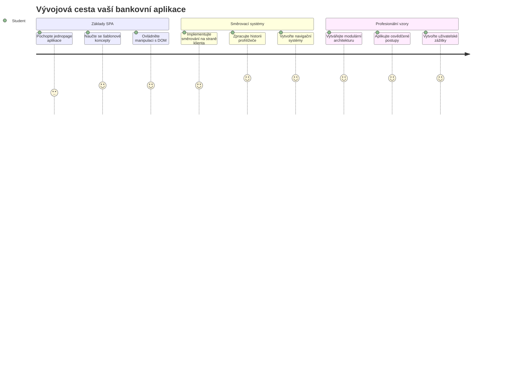
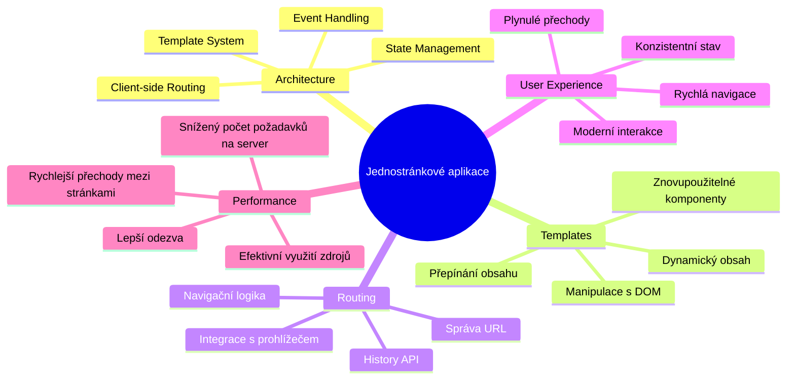
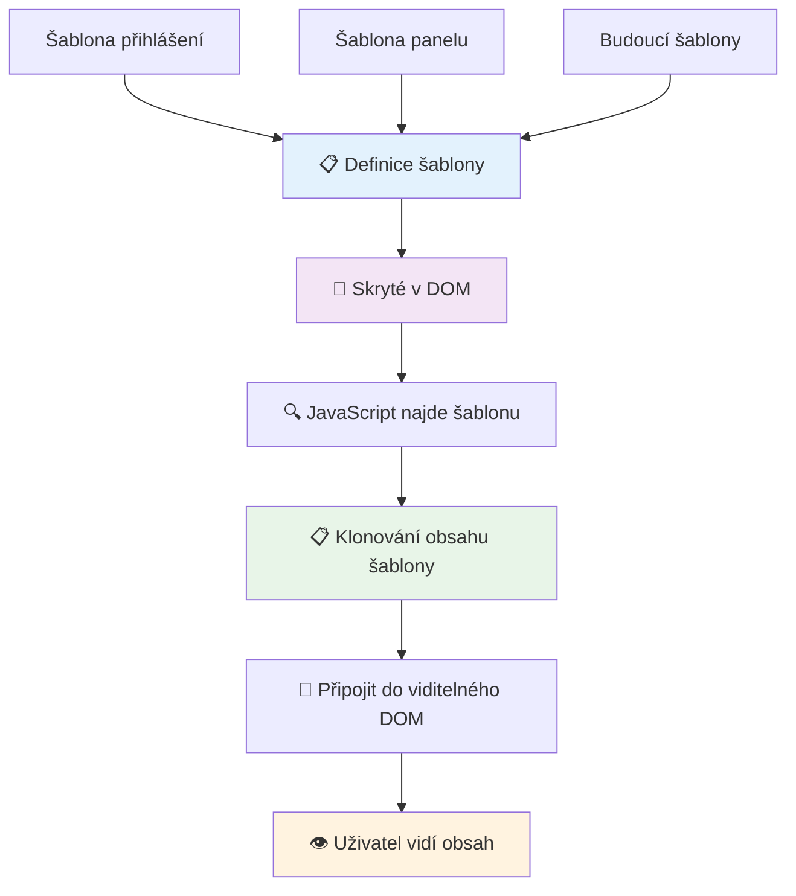
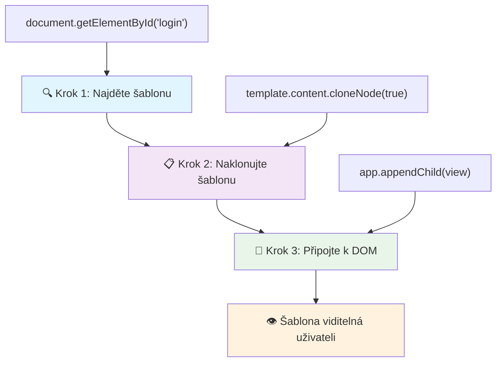
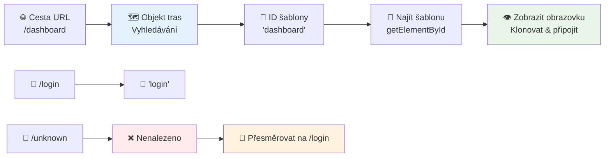
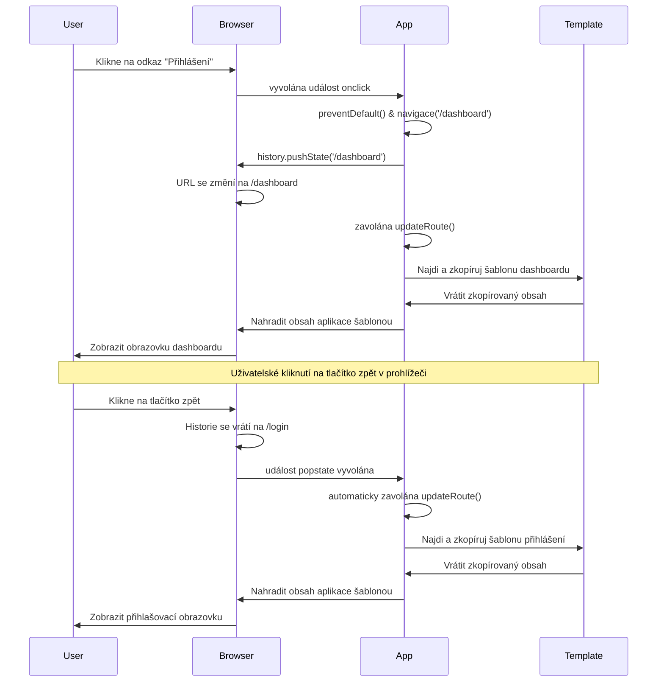
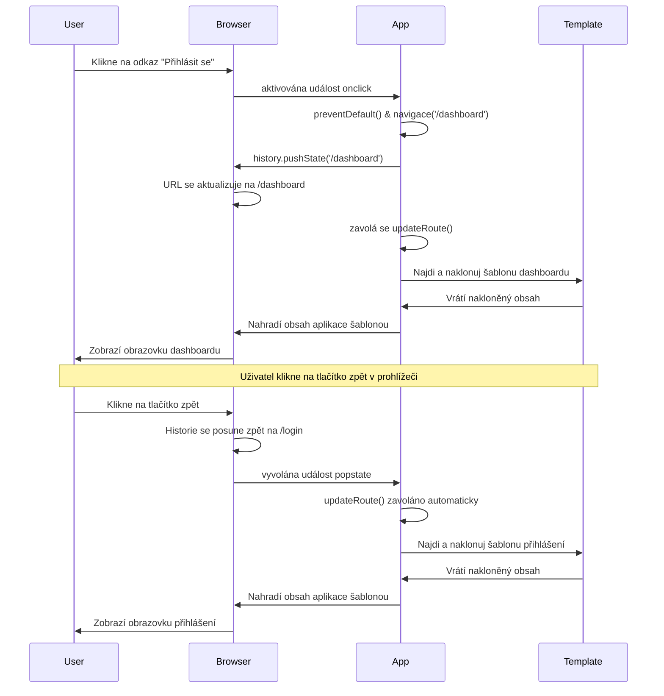
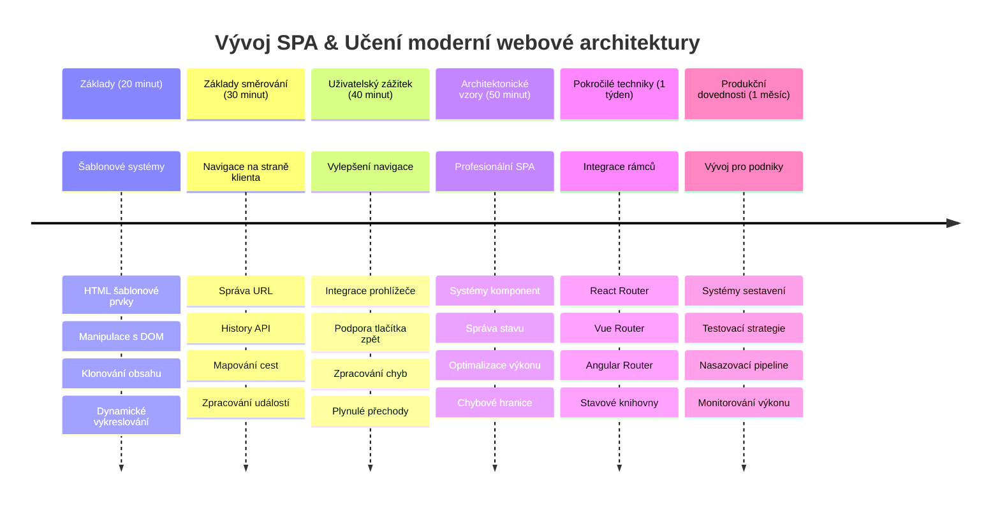

# Vytvoření bankovní aplikace Část 1: HTML šablony a směrování ve webové aplikaci


Když počítač řízení Apollo 11 navigoval k Měsíci v roce 1969, musel přepínat mezi různými programy, aniž by restartoval celý systém. Moderní webové aplikace fungují podobně – mění to, co vidíte, bez načítání všeho znovu od začátku. To vytváří hladký, responzivní zážitek, který uživatelé dnes očekávají.

Na rozdíl od tradičních webových stránek, které načítají celé stránky pro každou interakci, moderní webové aplikace aktualizují pouze části, které je potřeba změnit. Tento přístup, podobně jako řídící centrum mise, které přepíná mezi různými displeji při zachování stálé komunikace, vytváří ten plynulý zážitek, na který jsme zvyklí.

Zde je důvod, proč je rozdíl tak výrazný:

| Tradiční vícestránkové aplikace | Moderní jednostránkové aplikace |
|----------------------------|-------------------------|
| **Navigace** | Kompletní načítání stránky pro každou obrazovku | Okamžité přepínání obsahu |
| **Výkon** | Pomalejší díky kompletnímu stažení HTML | Rychlejší díky částečným aktualizacím |
| **Uživatelský zážitek** | Rušivé blikání stránky | Hladké, aplikací podobné přechody |
| **Sdílení dat** | Obtížné mezi stránkami | Snadná správa stavu |
| **Vývoj** | Více HTML souborů k údržbě | Jediný HTML s dynamickými šablonami |

**Pochopení vývoje:**
- **Tradiční aplikace** vyžadují serverové požadavky pro každou navigaci
- **Moderní SPA** se načtou jednou a obsah se dynamicky aktualizuje pomocí JavaScriptu
- **Očekávání uživatelů** nyní preferují okamžité a bezproblémové interakce
- **Výkonové výhody** zahrnují sníženou šířku pásma a rychlejší odezvu

V této lekci vytvoříme bankovní aplikaci s více obrazovkami, které plynule na sebe navazují. Podobně jako vědci používají modulární přístroje, které lze přepracovat pro různé experimenty, použijeme HTML šablony jako znovupoužitelné komponenty, které se zobrazují dle potřeby.

Budete pracovat s HTML šablonami (znovupoužitelné plány pro různé obrazovky), JavaScriptovým směrováním (systém, který přepíná mezi obrazovkami) a historií prohlížeče API (která zajistí správnou funkci tlačítka zpět). To jsou ty samé základní techniky, které používají frameworky jako React, Vue a Angular.

Na konci budete mít funkční bankovní aplikaci, která demonstruje profesionální principy jednostránkových aplikací.


## Přednáškový kvíz

[Přednáškový kvíz](https://ff-quizzes.netlify.app/web/quiz/41)

### Co budete potřebovat

Budeme potřebovat lokální webový server pro testování naší bankovní aplikace – nebojte, je to jednodušší, než to zní! Pokud ještě nemáte žádný nastavený, stačí nainstalovat [Node.js](https://nodejs.org) a spustit `npx lite-server` z vašeho projektového adresáře. Tento praktický příkaz spustí lokální server a automaticky otevře vaši aplikaci v prohlížeči.

### Příprava

Na počítači si vytvořte složku pojmenovanou `bank` s uvnitř souborem `index.html`. Začneme od tohoto HTML [boilerplate](https://en.wikipedia.org/wiki/Boilerplate_code):

```html
<!DOCTYPE html>
<html lang="en">
  <head>
    <meta charset="UTF-8">
    <meta name="viewport" content="width=device-width, initial-scale=1.0">
    <title>Bank App</title>
  </head>
  <body>
    <!-- This is where you'll work -->
  </body>
</html>
```

**Co tento boilerplate poskytuje:**
- **Založení** struktury HTML5 dokumentu s řádným deklarováním DOCTYPE
- **Nastavení** kódování znaků na UTF-8 pro podporu mezinárodního textu
- **Povoluje** responzivní design díky meta tagu viewport pro kompatibilitu s mobily
- **Určuje** popisný název, který se zobrazuje na kartě v prohlížeči
- **Vytváří** čistou část těla, ve které budeme průběžně budovat aplikaci

> 📁 **Náhled struktury projektu**
> 
> **Na konci této lekce bude váš projekt obsahovat:**
> ```
> bank/
> ├── index.html      <!-- Main HTML with templates -->
> ├── app.js          <!-- Routing and navigation logic -->
> └── style.css       <!-- (Optional for future lessons) -->
> ```
> 
> **Úlohy souborů:**
> - **index.html**: Obsahuje všechny šablony a strukturu aplikace
> - **app.js**: Řídí směrování, navigaci a správu šablon
> - **Šablony**: Definují uživatelské rozhraní pro přihlášení, dashboard a další obrazovky

---

## HTML šablony

Šablony řeší základní problém ve webovém vývoji. Když Gutenberg vynalezl pohyblivé tiskové znaky v 40. letech 15. století, uvědomil si, že místo vyřezávání celých stran může vytvářet znovupoužitelné bloky písmen a sestavovat je podle potřeby. HTML šablony fungují na stejném principu – místo vytváření samostatných HTML souborů pro každou obrazovku definujete znovupoužitelné struktury, které lze zobrazit podle potřeby.


Přemýšlejte o šablonách jako o plánech pro různé části vaší aplikace. Stejně jako architekt vytvoří jeden plán a používá ho víckrát, místo aby stále znovu kreslil stejné místnosti, my vytvoříme šablony jednou a spustíme je podle potřeby. Prohlížeč tyto šablony drží skryté, dokud je JavaScript neaktivuje.

Pokud chcete vytvořit více obrazovek pro webovou stránku, jedním řešením by bylo vytvořit jeden HTML soubor pro každou obrazovku, kterou chcete zobrazit. Toto řešení však přináší některá omezení:

- Musíte stále znovu načítat celé HTML při přepínání obrazovek, což může být pomalé.
- Sdílení dat mezi různými obrazovkami je obtížné.

Dalším přístupem je mít pouze jeden HTML soubor a definovat více [HTML šablon](https://developer.mozilla.org/docs/Web/HTML/Element/template) pomocí elementu `<template>`. Šablona je znovupoužitelný HTML blok, který není prohlížečem zobrazen a musí být za běhu vytvořen instancí pomocí JavaScriptu.

### Pojďme to postavit

Vytvoříme bankovní aplikaci se dvěma hlavními obrazovkami: přihlašovací stránkou a dashboardem. Nejprve přidáme do těla našeho HTML element placeholder – tohle je místo, kde se budou zobrazovat všechny naše různé obrazovky:

```html
<div id="app">Loading...</div>
```

**Co tento placeholder dělá:**
- **Vytváří** kontejner s ID "app", kam se budou zobrazovat všechny obrazovky
- **Zobrazuje** zprávu načítání, dokud JavaScript nespustí první obrazovku
- **Poskytuje** jediné místo, kam se bude dynamicky vkládat obsah
- **Umožňuje** snadné cílení z JavaScriptu pomocí `document.getElementById()`

> 💡 **Profesionální tip**: Protože obsah tohoto elementu bude nahrazen, můžeme použít zobrazení zprávy o načítání nebo indikátor, který se ukáže během načítání aplikace.

Dále přidáme pod to HTML šablonu pro přihlašovací stránku. Prozatím tam vložíme jen nadpis a sekci obsahující odkaz, který využijeme pro navigaci.

```html
<template id="login">
  <h1>Bank App</h1>
  <section>
    <a href="/dashboard">Login</a>
  </section>
</template>
```

**Rozebrání přihlašovací šablony:**
- **Definuje** šablonu s unikátním ID "login" pro cílení z JavaScriptu
- **Obsahuje** hlavní nadpis, který nastavuje značku aplikace
- **Má** sémantický element `<section>`, který seskupuje související obsah
- **Obsahuje** navigační odkaz, který uživatele přesměruje na dashboard

Pak přidáme další HTML šablonu pro stránku dashboardu. Tato stránka bude obsahovat různé sekce:

- Hlavičku s titulkem a odkazem na odhlášení
- Aktuální zůstatek bankovního účtu
- Seznam transakcí zobrazený v tabulce

```html
<template id="dashboard">
  <header>
    <h1>Bank App</h1>
    <a href="/login">Logout</a>
  </header>
  <section>
    Balance: 100$
  </section>
  <section>
    <h2>Transactions</h2>
    <table>
      <thead>
        <tr>
          <th>Date</th>
          <th>Object</th>
          <th>Amount</th>
        </tr>
      </thead>
      <tbody></tbody>
    </table>
  </section>
</template>
```

**Pojďme porozumět jednotlivým částem dashboardu:**
- **Strukturuje** stránku pomocí sémantického elementu `<header>` obsahujícího navigaci
- **Zobrazuje** název aplikace konzistentně napříč obrazovkami pro branding
- **Obsahuje** odkaz na odhlášení vedoucí zpět na přihlašovací obrazovku
- **Ukazuje** aktuální zůstatek účtu v samostatné sekci
- **Organizuje** transakční data pomocí správně strukturované HTML tabulky
- **Definuje** hlavičky tabulky pro sloupce Datum, Položka a Částka
- **Nechává** tělo tabulky prázdné pro pozdější dynamické naplnění

> 💡 **Profesionální tip**: Při vytváření HTML šablon, pokud chcete vidět, jak by vypadaly, můžete zakomentovat řádky `<template>` a `</template>` tak, že je obalíte do `<!-- -->`.

### 🔄 **Pedagogická kontrola**
**Porozumění systému šablon**: Před implementací JavaScriptu si ověřte, že rozumíte:
- ✅ Jak se šablony liší od běžných HTML prvků
- ✅ Proč zůstávají šablony skryté, dokud je JavaScript neaktivuje
- ✅ Význam sémantické HTML struktury v šablonách
- ✅ Jak šablony umožňují znovupoužitelné komponenty uživatelského rozhraní

**Rychlý sebepoznávací test**: Co se stane, když odstraníte tagy `<template>` kolem vašeho HTML?
*Odpověď: Obsah se ihned zobrazí a ztrácí funkci šablony*

**Výhody architektury**: Šablony poskytují:
- **Znovupoužitelnost**: Jedna definice, více instancí
- **Výkon**: Bez zbytečného zpracování HTML
- **Údržbu**: Centralizovanou strukturu UI
- **Flexibilitu**: Dynamické přepínání obsahu

✅ Proč myslíte, že používáme atributy `id` na šablonách? Můžeme použít něco jiného, třeba třídy?

## Oživení šablon pomocí JavaScriptu

Teď musíme naše šablony zpřístupnit. Stejně jako 3D tiskárna vezme digitální plán a vytvoří fyzický objekt, JavaScript z našich skrytých šablon vytváří viditelné, interaktivní prvky, které uživatelé vidí a používají.

Proces následuje tři konzistentní kroky, které tvoří základ moderního webového vývoje. Jakmile tento vzor pochopíte, uvidíte jej v mnoha frameworcích a knihovnách.

Pokud vyzkoušíte svůj současný HTML soubor v prohlížeči, uvidíte, že zůstane na `Loading...`. Je to proto, že musíme přidat nějaký JavaScriptový kód, který vytvoří a zobrazí HTML šablony.

Vytvoření instance šablony se obvykle dělá ve 3 krocích:

1. Najít element šablony v DOM, například pomocí [`document.getElementById`](https://developer.mozilla.org/docs/Web/API/Document/getElementById).
2. Naklonovat element šablony pomocí [`cloneNode`](https://developer.mozilla.org/docs/Web/API/Node/cloneNode).
3. Připojit ji do DOM pod viditelný element, například pomocí [`appendChild`](https://developer.mozilla.org/docs/Web/API/Node/appendChild).


**Vizualizace procesu:**
- **Krok 1** najde skrytou šablonu ve struktuře DOM
- **Krok 2** vytvoří pracovní kopii, která může být bezpečně upravena
- **Krok 3** vloží kopii do viditelné části stránky
- **Výsledek** je funkční obrazovka, s níž může uživatel interagovat

✅ Proč je potřeba šablonu klonovat před připojením k DOM? Co myslíte, co by se stalo, kdybychom tento krok přeskočili?

### Úkol

Vytvořte nový soubor nazvaný `app.js` ve svém projektovém adresáři a importujte tento soubor v sekci `<head>` vašeho HTML:

```html
<script src="app.js" defer></script>
```

**Co tento import skriptu znamená:**
- **Propojuje** JavaScriptový soubor s naším HTML dokumentem
- **Používá** atribut `defer`, aby se skript spustil až po dokončení parsování HTML
- **Zajišťuje** přístup ke všem DOM prvkům, protože jsou plně načtené před spuštěním skriptu
- **Dodržuje** moderní nejlepší praxi pro načítání skriptů a výkon

V souboru `app.js` vytvoříme novou funkci `updateRoute`:

```js
function updateRoute(templateId) {
  const template = document.getElementById(templateId);
  const view = template.content.cloneNode(true);
  const app = document.getElementById('app');
  app.innerHTML = '';
  app.appendChild(view);
}
```

**Krok za krokem, co se děje:**
- **Najde** element šablony podle unikátního ID
- **Vytvoří** hlubokou kopii obsahu šablony pomocí `cloneNode(true)`
- **Najde** kontejner aplikace, kam bude obsah zobrazen
- **Vyčistí** veškerý stávající obsah kontejneru aplikace
- **Vloží** klonovaný šablonový obsah do viditelného DOM

Nyní zavolejte tuto funkci s některou ze šablon a podívejte se na výsledek.

```js
updateRoute('login');
```

**Co tento volání funkce dělá:**
- **Aktivuje** přihlašovací šablonu předáním jejího ID jako parametru
- **Ukazuje**, jak programově přepínat mezi různými obrazovkami aplikace
- **Zobrazuje** přihlašovací obrazovku místo zprávy „Loading...“

✅ Jaký je účel tohoto kódu `app.innerHTML = '';`? Co by se stalo bez něj?

## Vytváření trasování (Routes)

Směrování je v podstatě spojení URL s odpovídajícím obsahem. Představte si, jak dřívější telefonní operátorky používaly ústředny k přesměrování hovorů – přijaly příchozí požadavek a spojily jej s cílovým místem. Webové směrování funguje podobně, vezme požadavek URL a určí, jaký obsah zobrazit.


Tradičně webové servery toto řešily tak, že pro různé URL poskytovaly různé HTML soubory. Protože nyní stavíme jednostránkovou aplikaci, musíme směrování ošetřit sami v JavaScriptu. Tento přístup nám dává větší kontrolu nad uživatelským zážitkem a výkonem.


**Pochopení směrovacího toku:**
- **Změny URL** spouštějí vyhledání v naší konfiguraci tras
- **Platné trasy** jsou mapovány na konkrétní ID šablon pro vykreslení
- **Neplatné trasy** spouští záložní chování, aby nedošlo k chybám
- **Vykreslení šablony** probíhá dle tří kroků, které jsme se naučili

Když mluvíme o webové aplikaci, směrováním nazýváme úmysl mapovat **URL** na konkrétní obrazovky, které se mají zobrazit. Na webové stránce s více HTML soubory se to děje automaticky, protože cesty k souborům se zobrazují v URL. Například se soubory ve vašem projektovém adresáři:

```
mywebsite/index.html
mywebsite/login.html
mywebsite/admin/index.html
```

Pokud vytvoříte webový server se složkou `mywebsite` jako kořenovou, bude mapování URL vypadat:

```
https://site.com            --> mywebsite/index.html
https://site.com/login.html --> mywebsite/login.html
https://site.com/admin/     --> mywebsite/admin/index.html
```

Pro naši webovou aplikaci však používáme jediný HTML soubor obsahující všechny obrazovky, takže toto výchozí chování nám nepomůže. Musíme tuto mapu vytvořit ručně a provádět aktualizaci zobrazené šablony pomocí JavaScriptu.

### Úkol

Použijeme jednoduchý objekt k implementaci [mapy](https://en.wikipedia.org/wiki/Associative_array) mezi cestami URL a našimi šablonami. Přidejte tento objekt na začátek svého souboru `app.js`.

```js
const routes = {
  '/login': { templateId: 'login' },
  '/dashboard': { templateId: 'dashboard' },
};
```

**Co tato konfigurace tras znamená:**
- **Definuje** mapování mezi URL cestami a identifikátory šablon
- **Používá** syntaxi objektu, kdy klíče jsou URL cesty a hodnoty obsahují informace o šabloně
- **Umožňuje** snadné vyhledávání, kterou šablonu zobrazit pro danou URL
- **Poskytuje** škálovatelnou strukturu pro přidání nových tras v budoucnu
Nyní trochu upravme funkci `updateRoute`. Místo předávání přímo `templateId` jako argumentu chceme nejprve získat aktuální URL a pak použít naši mapu pro získání odpovídající hodnoty ID šablony. Můžeme využít [`window.location.pathname`](https://developer.mozilla.org/docs/Web/API/Location/pathname) pro získání pouze části cesty z URL.

```js
function updateRoute() {
  const path = window.location.pathname;
  const route = routes[path];

  const template = document.getElementById(route.templateId);
  const view = template.content.cloneNode(true);
  const app = document.getElementById('app');
  app.innerHTML = '';
  app.appendChild(view);
}
```

**Rozbor toho, co se zde děje:**
- **Získá** aktuální cestu z URL v prohlížeči pomocí `window.location.pathname`
- **Najde** odpovídající konfiguraci trasy v našem objektu routes
- **Získá** ID šablony z konfigurace trasy
- **Následuje** stejný proces renderování šablony jako dříve
- **Vytvoří** dynamický systém, který reaguje na změny URL

Zde jsme namapovali deklarované trasy na odpovídající šablony. Můžete si to vyzkoušet a ověřit, že to správně funguje tím, že ručně změníte URL ve vašem prohlížeči.

✅ Co se stane, když zadáte neznámou cestu v URL? Jak bychom to mohli vyřešit?

## Přidání navigace

Po zavedení směrování uživatelé potřebují způsob, jak se v aplikaci pohybovat. Tradiční webové stránky při kliknutí na odkazy načítají celé stránky znovu, ale my chceme aktualizovat URL i obsah bez obnovování stránky. To vytváří plynulejší zážitek podobný tomu, jak desktopové aplikace přepínají mezi různými pohledy.

Musíme koordinovat dvě věci: aktualizaci URL v prohlížeči, aby uživatelé mohli stránky zálohovat a sdílet odkazy, a zobrazení odpovídajícího obsahu. Pokud je to správně implementováno, vzniká plynulá navigace, kterou uživatelé od moderních aplikací očekávají.


### 🔄 **Pedagogická kontrola**
**Architektura Single-Page Application**: Ověřte si pochopení celého systému:
- ✅ Jak se klientské směrování liší od tradičního serverového směrování?
- ✅ Proč je History API nezbytné pro správnou navigaci SPA?
- ✅ Jak šablony umožňují dynamický obsah bez obnovování stránky?
- ✅ Jakou roli hraje zpracování událostí při přesměrování navigace?

**Integrace systému**: Vaše SPA prokazuje:
- **Správa šablon**: znovupoužitelné UI komponenty s dynamickým obsahem
- **Klientské směrování**: správa URL bez požadavků na server
- **Architektura založená na událostech**: reakce na navigaci a uživatelské interakce
- **Integrace s prohlížečem**: správná podpora historie a tlačítek zpět/vpřed
- **Optimalizace výkonu**: rychlé přechody a snížená zátěž serveru

**Profesionální vzory**: Implementovali jste:
- **Oddělení modelu a zobrazení**: šablony oddělené od aplikační logiky
- **Správa stavu**: synchronizace stavu URL a zobrazeného obsahu
- **Postupné vylepšování**: JavaScript rozšiřuje základní funkčnost HTML
- **Uživatelská zkušenost**: plynulá, aplikaci podobná navigace bez obnovení stránky

> � **Architektonický pohled**: Komponenty navigačního systému
>
> **Co vytváříte:**
> - **🔄 Správa URL**: aktualizuje adresní řádek prohlížeče bez obnovy stránky
> - **📋 Systém šablon**: dynamicky mění obsah podle aktuální trasy  
> - **📚 Integrace historie**: zachovává podporu tlačítek zpět/vpřed v prohlížeči
> - **🛡️ Zpracování chyb**: elegantní záložní postupy pro neplatné nebo chybějící trasy
>
> **Jak komponenty spolupracují:**
> - **Naslouchá** navigačním událostem (kliknutí, změny historie)
> - **Aktualizuje** URL pomocí History API
> - **Zobrazuje** odpovídající šablonu pro novou trasu
> - **Udržuje** plynulý uživatelský zážitek

Dalším krokem naší aplikace je přidat možnost navigovat mezi stránkami bez nutnosti ručně měnit URL. Znamená to dvě věci:

  1. Aktualizovat aktuální URL
  2. Aktualizovat zobrazenou šablonu dle nové URL

O druhé části jsme už se postarali funkcí `updateRoute`, takže teď musíme přijít na to, jak změnit aktuální URL.

Budeme muset použít JavaScript, konkrétně [`history.pushState`](https://developer.mozilla.org/docs/Web/API/History/pushState), která umožňuje aktualizovat URL a vytvořit novou položku v historii prohlížeče, aniž by se stránka znovu načetla.

> ⚠️ **Důležitá poznámka**: Zatímco HTML prvek kotvy [`<a href>`](https://developer.mozilla.org/docs/Web/HTML/Element/a) lze použít samostatně pro vytváření hypertextových odkazů na různé URL, při kliknutí způsobí standardní obnovu stránky. Je nutné toto chování zabránit při zpracování směrování pomocí vlastního JavaScriptu pomocí funkce preventDefault() na klikací události.

### Úkol

Vytvořme novou funkci, kterou můžeme použít k navigaci v naší aplikaci:

```js
function navigate(path) {
  window.history.pushState({}, path, path);
  updateRoute();
}
```

**Porozumění této navigační funkci:**
- **Aktualizuje** URL v prohlížeči na novou cestu pomocí `history.pushState`
- **Přidává** novou položku do zásobníku historie pro správnou podporu tlačítek zpět/vpřed
- **Spustí** funkci `updateRoute()` pro zobrazení odpovídající šablony
- **Udržuje** zážitek single-page aplikace bez obnovení stránky

Tato metoda nejprve aktualizuje aktuální URL podle zadané cesty, pak aktualizuje šablonu. Vlastnost `window.location.origin` vrací kořenovou URL, což nám umožňuje sestavit kompletní URL z předané cesty.

Protože nyní máme tuto funkci, můžeme se postarat o problém, který nastává, pokud cesta neodpovídá žádné definované trase. Upravením funkce `updateRoute` přidáme záložní řešení pro případ, kdy nenajdeme shodu.

```js
function updateRoute() {
  const path = window.location.pathname;
  const route = routes[path];

  if (!route) {
    return navigate('/login');
  }

  const template = document.getElementById(route.templateId);
  const view = template.content.cloneNode(true);
  const app = document.getElementById('app');
  app.innerHTML = '';
  app.appendChild(view);
}
```

**Klíčové body k zapamatování:**
- **Kontroluje**, zda existuje trasa pro aktuální cestu
- **Přesměruje** na přihlašovací stránku při přístupu na neplatnou trasu
- **Poskytuje** záložní mechanismus, který zabraňuje rozbití navigace
- **Zajišťuje**, že uživatel vždy vidí platnou obrazovku, i při nesprávných URL

Pokud trasa nebude nalezena, nyní přesměrujeme na stránku `login`.

Teď vytvořme funkci, která získá URL při kliknutí na odkaz a zabrání výchozímu chování prohlížeče:

```js
function onLinkClick(event) {
  event.preventDefault();
  navigate(event.target.href);
}
```

**Rozbor tohoto zpracování kliknutí:**
- **Zabrání** výchozímu chování prohlížeče u odkazu pomocí `preventDefault()`
- **Získá** cílovou URL z kliknutého prvku odkazu
- **Volá** naši vlastní funkci pro navigaci místo načtení stránky znovu
- **Udržuje** plynulý zážitek single-page aplikace

```html
<a href="/dashboard" onclick="onLinkClick(event)">Login</a>
...
<a href="/login" onclick="onLinkClick(event)">Logout</a>
```

**Co tento přiřazený onclick celý dělá:**
- **Spojuje** každý odkaz s naším vlastním navigačním systémem
- **Předává** klikací událost do naší funkce `onLinkClick` pro zpracování
- **Umožňuje** plynulou navigaci bez znovunačtení stránky
- **Udržuje** správnou strukturu URL, kterou mohou uživatelé zálohovat nebo sdílet

Atribut [`onclick`](https://developer.mozilla.org/docs/Web/API/GlobalEventHandlers/onclick) přiřazuje událost kliknutí k JavaScriptovému kódu, zde volání funkce `navigate()`.

Vyzkoušejte kliknutí na tyto odkazy, nyní byste měli být schopni přecházet mezi různými obrazovkami aplikace.

✅ Metoda `history.pushState` je součástí standardu HTML5 a je implementována ve [všech moderních prohlížečích](https://caniuse.com/?search=pushState). Pokud vytváříte webovou aplikaci pro starší prohlížeče, existuje trik, který můžete použít místo tohoto API: využitím [hash (`#`)](https://en.wikipedia.org/wiki/URI_fragment) před cestou můžete implementovat směrování, které funguje s běžnou navigací pomocí kotvy a stránka se nepřenačítá, protože hash byl původně určen pro vytváření vnitřních odkazů uvnitř stránky.

## Jak fungují tlačítka Zpět a Vpřed

Tlačítka zpět a vpřed jsou základem procházení webu, podobně jako operátoři misí NASA mohou během vesmírných misí zkontrolovat předchozí stavy systému. Uživatelé od těchto tlačítek očekávají funkčnost a pokud nefungují, narušuje to očekávané chování při prohlížení.

Naše single-page aplikace potřebuje další konfiguraci, aby to podporovala. Prohlížeč si uchovává zásobník historie (do kterého jsme přidávali pomocí `history.pushState`), ale když uživatel změní historii, naše aplikace musí reagovat aktualizací zobrazeného obsahu.


**Hlavní body interakce:**
- **Uživatelské akce** spouští navigaci kliknutím nebo tlačítky v prohlížeči
- **Aplikace zachytí** kliknutí na odkazy, aby zabránila obnově stránky
- **History API** spravuje změny URL a zásobník historie prohlížeče
- **Šablony** poskytují strukturu obsahu pro každou obrazovku
- **Naslouchající události** zajišťují, že aplikace reaguje na všechny typy navigace

Použití `history.pushState` vytváří nové položky v historii prohlížeče. Můžete to zkontrolovat podržením *tlačítka zpět* ve vašem prohlížeči, mělo by se zobrazit něco takového:


Pokud několikrát kliknete na tlačítko zpět, uvidíte, že se aktuální URL změní a historie se aktualizuje, ale stále se zobrazuje stejná šablona.

Je to proto, že aplikace neví, že musí volat `updateRoute()` pokaždé, když se změní historie. Pokud si prohlédnete dokumentaci k [`history.pushState`](https://developer.mozilla.org/docs/Web/API/History/pushState), uvidíte, že pokud se změní stav - tedy přejdeme na jinou URL - spustí se událost [`popstate`](https://developer.mozilla.org/docs/Web/API/Window/popstate_event). Tu použijeme k opravě tohoto problému.

### Úkol

Aby se zajistilo, že se zobrazená šablona aktualizuje při změně historie prohlížeče, přidáme novou funkci, která zavolá `updateRoute()`. Uděláme to na konci našeho souboru `app.js`:

```js
window.onpopstate = () => updateRoute();
updateRoute();
```

**Porozumění této integraci historie:**
- **Naslouchá** události `popstate`, která nastává při navigaci tlačítky v prohlížeči
- **Používá** šipkovou funkci pro stručný zápis obsluhy události
- **Automaticky volá** `updateRoute()` při každé změně stavu historie
- **Inicializuje** aplikaci voláním `updateRoute()` při prvním načtení stránky
- **Zajišťuje**, že se správná šablona vždy zobrazí bez ohledu na způsob navigace

> 💡 **Profesionální tip**: Zde jsme použili [šipkovou funkci](https://developer.mozilla.org/docs/Web/JavaScript/Reference/Functions/Arrow_functions) pro deklaraci obsluhy události `popstate` pro stručnost, ale fungovala by stejným způsobem i běžná funkce.

Zde je připomínkové video o šipkových funkcích:

[](https://youtube.com/watch?v=OP6eEbOj2sc "Arrow Functions")

> 🎥 Klikněte na obrázek výše pro video o šipkových funkcích.

Nyní zkuste použít tlačítka zpět a vpřed ve vašem prohlížeči a ověřte, že se tentokrát správně aktualizuje zobrazená trasa.

### ⚡ **Co můžete stihnout za příštích 5 minut**
- [ ] Otestujte navigaci ve své bankovní aplikaci pomocí tlačítek zpět/vpřed v prohlížeči
- [ ] Zkuste ručně zadat různé URL do adresního řádku a testovat směrování
- [ ] Otevřete vývojářské nástroje a prozkoumejte, jak jsou šablony klonovány do DOM
- [ ] Experimentujte s přidáním console.log pro sledování průběhu směrování

### 🎯 **Co můžete dosáhnout během tohoto hodiny**
- [ ] Dokončit kvíz po lekci a pochopit koncepty architektury SPA
- [ ] Přidat CSS stylování, aby vaše bankovní aplikace vypadala profesionálně
- [ ] Implementovat výzvu stránky chyby 404 s patřičnou obsluhou chyb
- [ ] Vytvořit výzvu s stránkou s kredity a další funkcionalitou směrování
- [ ] Přidat stavy načítání a přechody mezi přepínáním šablon

### 📅 **Váš týdenní vývojový plán SPA**
- [ ] Dokončit celou bankovní aplikaci s formuláři, správou dat a perzistencí
- [ ] Přidat pokročilé funkce směrování jako parametry tras a vnořené trasy
- [ ] Implementovat strážce navigace a směrování na základě ověřování uživatele
- [ ] Vytvořit znovupoužitelné komponenty šablon a knihovnu komponent
- [ ] Přidat animace a přechody pro hladší uživatelský zážitek
- [ ] Nasadit SPA na hostingovou platformu a správně nakonfigurovat směrování

### 🌟 **Měsíční cesta k ovládnutí frontendové architektury**
- [ ] Stavět komplexní SPA s moderními frameworky jako React, Vue nebo Angular
- [ ] Naučit se pokročilé vzory správy stavu a používat knihovny
- [ ] Ovládnout nástroje pro sestavení a vývojové workflow pro SPA
- [ ] Implementovat funkce Progressive Web App a offline režim
- [ ] Studium optimalizace výkonu pro rozsáhlé SPA
- [ ] Přispívat do open source projektů SPA a sdílet znalosti

## 🎯 Časová osa pro zvládnutí vaší Single-Page aplikace


### 🛠️ Shrnutí vašeho nástroje pro vývoj SPA

Po dokončení této lekce nyní ovládáte:
- **Architekturu šablon**: Znovupoužitelné HTML komponenty s dynamickým vykreslováním obsahu
- **Klientské směrování**: Správa URL a navigace bez obnovení stránky
- **Integraci s prohlížečem**: Použití History API a podpora tlačítek zpět/vpřed
- **Systémy založené na událostech**: Zpracování navigace a uživatelských interakcí
- **Manipulaci s DOM**: Klonování šablon, přepínání obsahu a správa prvků
- **Zpracování chyb**: Elegantní záložní řešení pro neplatné trasy a chybějící obsah
- **Výkonové vzory**: Efektivní načítání a vykreslování obsahu

**Praktické použití**: Vaše dovednosti ve vývoji SPA lze přímo aplikovat v:
- **Moderních webových aplikacích**: vývoj v Reactu, Vue, Angular a dalších frameworcích
- **Progressive Web Apps**: offline schopné aplikace s aplikaci podobným zážitkem
- **Podnikových dashboardech**: komplexní podnikové aplikace s více pohledy
- **E-commerce platformách**: katalogy produktů, nákupní košíky a procesy objednávky
- **Správě obsahu**: dynamické vytváření a úprava obsahu
- **Mobilním vývoji**: hybridní aplikace využívající webové technologie

**Získané profesionální dovednosti**: Nyní umíte:
- **Navrhnout** jednorázové aplikace s řádným oddělením odpovědností  
- **Implementovat** systémy směrování na straně klienta, které škálují s komplexností aplikace  
- **Ladit** složité navigační toky pomocí nástrojů pro vývojáře prohlížeče  
- **Optimalizovat** výkon aplikace efektivní správou šablon  
- **Návrh** uživatelských zážitků, které působí nativně a responsivně  

**Osvojené koncepty frontendového vývoje**:  
- **Architektura komponent**: Opakovaně použitelné vzory UI a systémy šablon  
- **Synchronizace stavu**: Správa stavu URL a historie prohlížeče  
- **Programování řízené událostmi**: Zpracování uživatelských interakcí a navigace  
- **Optimalizace výkonu**: Efektivní manipulace s DOM a načítání obsahu  
- **Návrh uživatelského zážitku**: Plynulé přechody a intuitivní navigace  

**Další úroveň**: Jste připraveni prozkoumat moderní frontendové frameworky, pokročilou správu stavu nebo vytvořit složité podnikové aplikace!

🌟 **Ocenění získáno**: Vybudovali jste profesionální základ jednorázové aplikace s moderními vzory webové architektury!

---

## Výzva GitHub Copilot Agenta 🚀

Použijte režim Agenta k dokončení následující výzvy:

**Popis:** Vylepšete bankovní aplikaci implementací zpracování chyb a šablony stránky 404 pro neplatné cesty, čímž zlepšíte uživatelský zážitek při navigaci na neexistující stránky.

**Úkol:** Vytvořte novou HTML šablonu s id "not-found", která zobrazuje uživatelsky přívětivou stránku chyby 404 se stylováním. Poté změňte logiku směrování v JavaScriptu tak, aby tato šablona byla zobrazena, když uživatelé navigují na neplatné URL, a přidejte tlačítko „Jít domů“, které přesměruje zpět na stránku přihlášení.

Více o [režimu agenta](https://code.visualstudio.com/blogs/2025/02/24/introducing-copilot-agent-mode) se dozvíte zde.

## 🚀 Výzva

Přidejte novou šablonu a trasu pro třetí stránku, která zobrazuje kredity této aplikace.

**Cíle výzvy:**  
- **Vytvořit** novou HTML šablonu s odpovídající strukturou obsahu  
- **Přidat** novou trasu do objektu konfigurace tras  
- **Zahrnout** navigační odkazy tam i zpět na stránku kreditů  
- **Otestovat** správnou funkčnost navigace s historií prohlížeče  

## Kvíz po přednášce

[Kvíz po přednášce](https://ff-quizzes.netlify.app/web/quiz/42)

## Přehled a samostudium

Směrování je jednou z překvapivě složitých částí webového vývoje, zejména když web přechází od chování obnovy stránky k obnovování stránek jednorázových aplikací. Přečtěte si něco o tom, [jak služba Azure Static Web App](https://docs.microsoft.com/azure/static-web-apps/routes/?WT.mc_id=academic-77807-sagibbon) řeší směrování. Dokážete vysvětlit, proč jsou některá rozhodnutí popsaná v tomto dokumentu nezbytná?

**Další zdroje pro učení:**  
- **Prozkoumat**, jak populární frameworky jako React Router a Vue Router implementují směrování na straně klienta  
- **Prozkoumat** rozdíly mezi směrováním založeným na hashe a směrováním pomocí historie API  
- **Naučit se** o serverovém renderování (SSR) a jeho vlivu na strategie směrování  
- **Prozkoumat**, jak progresivní webové aplikace (PWA) řeší směrování a navigaci  

## Zadání

[Zlepšit směrování](assignment.md)

---

<!-- CO-OP TRANSLATOR DISCLAIMER START -->
**Prohlášení o vyloučení odpovědnosti**:  
Tento dokument byl přeložen pomocí AI překladatelské služby [Co-op Translator](https://github.com/Azure/co-op-translator). Přestože usilujeme o přesnost, mějte prosím na paměti, že automatické překlady mohou obsahovat chyby nebo nepřesnosti. Originální dokument v jeho mateřském jazyce by měl být považován za závazný zdroj. Pro důležité informace se doporučuje profesionální lidský překlad. Nepřebíráme odpovědnost za případná nedorozumění nebo nesprávné výklady vyplývající z použití tohoto překladu.
<!-- CO-OP TRANSLATOR DISCLAIMER END -->