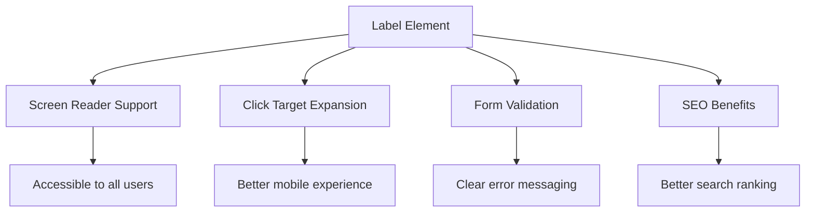
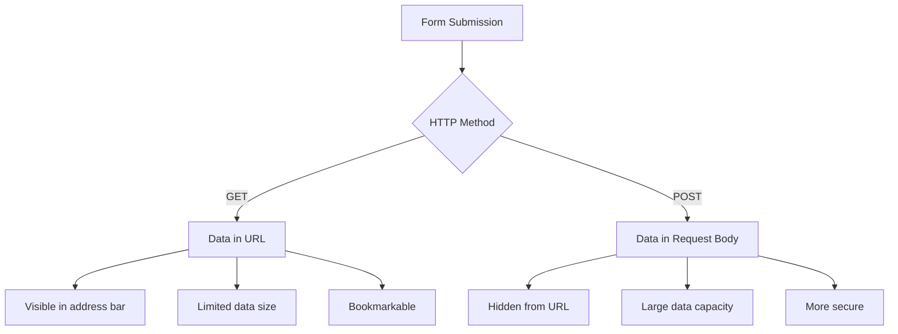
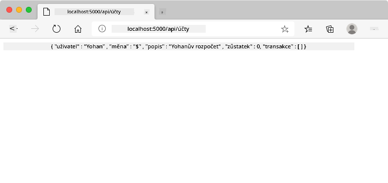
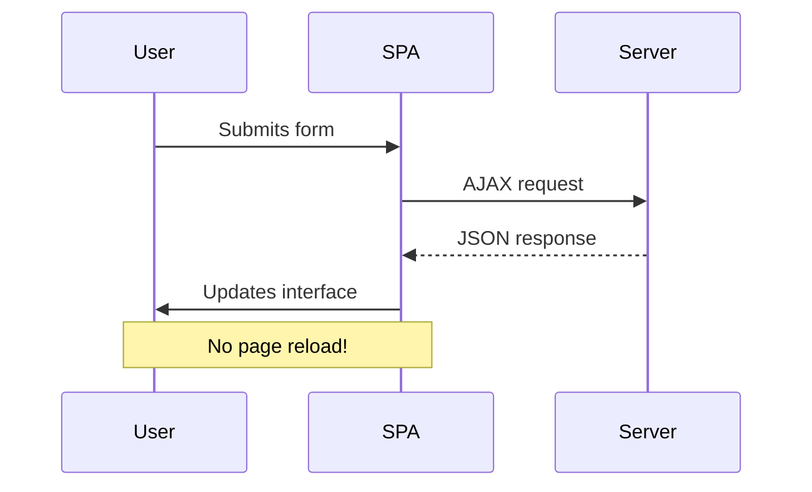
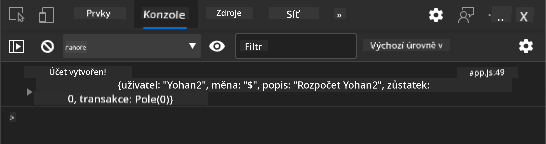
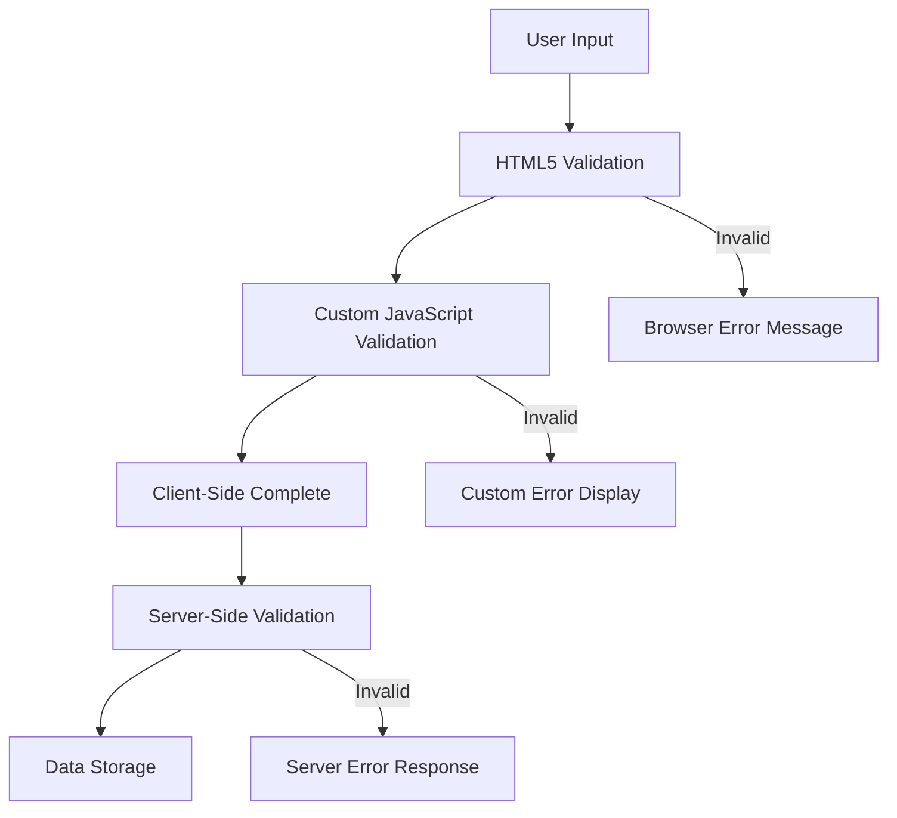
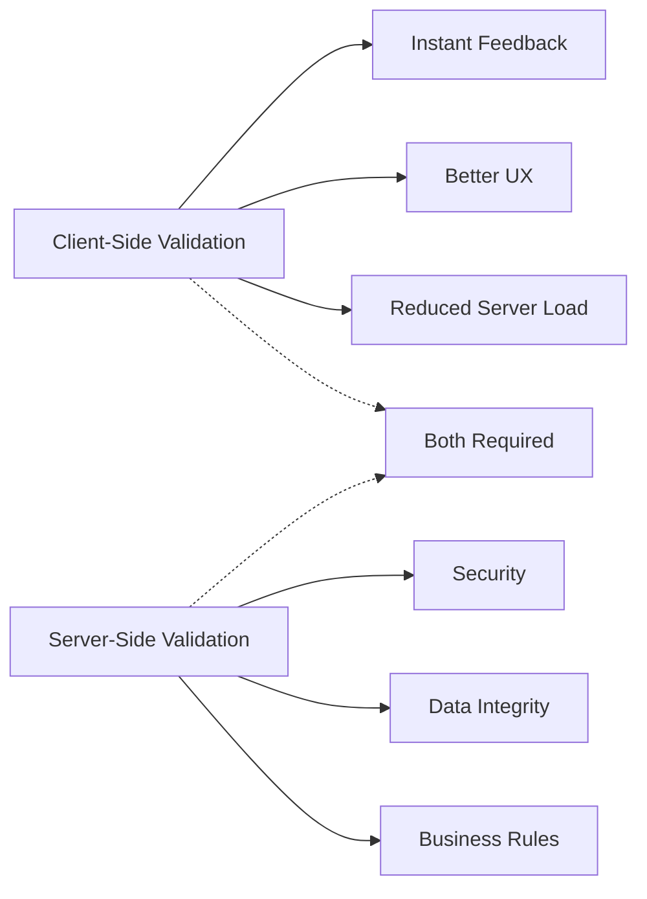
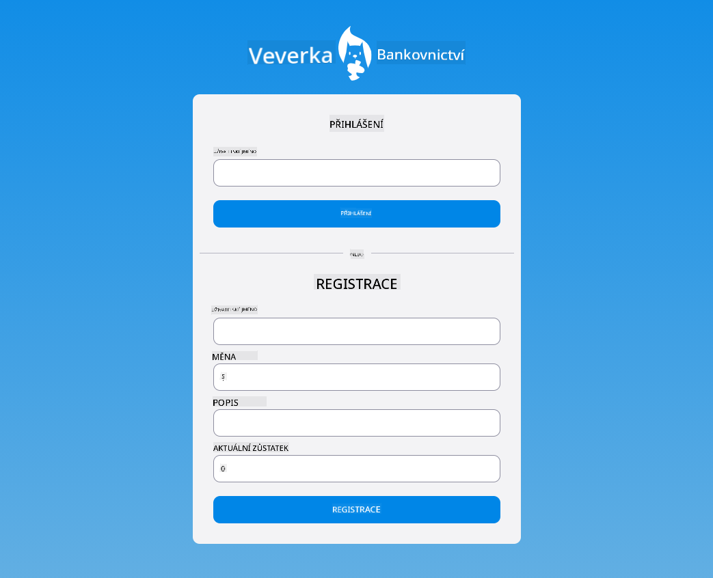

<!--
CO_OP_TRANSLATOR_METADATA:
{
  "original_hash": "b24f28fc46dd473aa9080f174182adde",
  "translation_date": "2025-10-24T21:06:31+00:00",
  "source_file": "7-bank-project/2-forms/README.md",
  "language_code": "cs"
}
-->
# Vytvoření bankovní aplikace, část 2: Vytvoření přihlašovacího a registračního formuláře

## Kvíz před lekcí

[Kvíz před lekcí](https://ff-quizzes.netlify.app/web/quiz/43)

Už jste někdy vyplnili online formulář, který odmítl formát vaší e-mailové adresy? Nebo jste při kliknutí na tlačítko odeslat ztratili všechna data? Tyto frustrující situace zažil snad každý.

Formuláře jsou mostem mezi uživateli a funkcionalitou vaší aplikace. Stejně jako pečlivé protokoly, které používají dispečeři letového provozu k bezpečnému navádění letadel, dobře navržené formuláře poskytují jasnou zpětnou vazbu a předcházejí nákladným chybám. Špatně navržené formuláře naopak mohou uživatele odradit rychleji než špatná komunikace na rušném letišti.

V této lekci proměníme vaši statickou bankovní aplikaci v interaktivní aplikaci. Naučíte se vytvářet formuláře, které ověřují uživatelský vstup, komunikují se servery a poskytují užitečnou zpětnou vazbu. Přemýšlejte o tom jako o vytvoření ovládacího rozhraní, které umožní uživatelům navigovat funkcemi vaší aplikace.

Na konci budete mít kompletní systém přihlášení a registrace s validací, který uživatele povede k úspěchu místo frustrace.

## Předpoklady

Než začneme vytvářet formuláře, ujistěte se, že máte vše správně nastaveno. Tato lekce navazuje přesně tam, kde jsme skončili v předchozí, takže pokud jste přeskočili, možná budete chtít se vrátit a nejprve si nastavit základní funkce.

### Požadované nastavení

| Komponenta | Stav | Popis |
|------------|------|-------|
| [HTML šablony](../1-template-route/README.md) | ✅ Požadováno | Základní struktura bankovní aplikace |
| [Node.js](https://nodejs.org) | ✅ Požadováno | JavaScript runtime pro server |
| [Bank API Server](../api/README.md) | ✅ Požadováno | Backendová služba pro ukládání dat |

> 💡 **Tip pro vývoj**: Budete současně spouštět dva samostatné servery – jeden pro front-end bankovní aplikaci a druhý pro backendové API. Toto nastavení odráží reálný vývoj, kde front-end a back-end služby fungují nezávisle.

### Konfigurace serveru

**Vaše vývojové prostředí bude zahrnovat:**
- **Frontend server**: Poskytuje vaši bankovní aplikaci (obvykle port `3000`)
- **Backend API server**: Zpracovává ukládání a načítání dat (port `5000`)
- **Oba servery** mohou běžet současně bez konfliktů

**Testování připojení k API:**
```bash
curl http://localhost:5000/api
# Expected response: "Bank API v1.0.0"
```

**Pokud vidíte odpověď s verzí API, můžete pokračovat!**

---

## Porozumění HTML formulářům a ovládacím prvkům

HTML formuláře jsou způsobem, jak uživatelé komunikují s vaší webovou aplikací. Přemýšlejte o nich jako o telegrafním systému, který v 19. století spojoval vzdálená místa – jsou to komunikační protokoly mezi záměrem uživatele a reakcí aplikace. Když jsou navrženy promyšleně, zachytí chyby, usměrní formátování vstupu a poskytnou užitečné návrhy.

Moderní formuláře jsou mnohem sofistikovanější než základní textové vstupy. HTML5 přineslo specializované typy vstupů, které automaticky zpracovávají validaci e-mailů, formátování čísel a výběr dat. Tyto vylepšení přinášejí výhody jak v oblasti přístupnosti, tak v mobilním uživatelském prostředí.

### Základní prvky formuláře

**Stavební kameny, které každý formulář potřebuje:**

```html
<!-- Basic form structure -->
<form id="userForm" method="POST">
  <label for="username">Username</label>
  <input id="username" name="username" type="text" required>
  
  <button type="submit">Submit</button>
</form>
```

**Co tento kód dělá:**
- **Vytváří** kontejner formuláře s jedinečným identifikátorem
- **Určuje** HTTP metodu pro odeslání dat
- **Spojuje** popisky s vstupy pro lepší přístupnost
- **Definuje** tlačítko odeslání pro zpracování formuláře

### Moderní typy vstupů a atributy

| Typ vstupu | Účel | Příklad použití |
|------------|------|-----------------|
| `text` | Obecný textový vstup | `<input type="text" name="username">` |
| `email` | Validace e-mailu | `<input type="email" name="email">` |
| `password` | Skrytý textový vstup | `<input type="password" name="password">` |
| `number` | Číselný vstup | `<input type="number" name="balance" min="0">` |
| `tel` | Telefonní čísla | `<input type="tel" name="phone">` |

> 💡 **Výhoda moderního HTML5**: Použití specifických typů vstupů poskytuje automatickou validaci, vhodné mobilní klávesnice a lepší podporu přístupnosti bez nutnosti dalšího JavaScriptu!

### Typy tlačítek a jejich chování

```html
<!-- Different button behaviors -->
<button type="submit">Save Data</button>     <!-- Submits the form -->
<button type="reset">Clear Form</button>    <!-- Resets all fields -->
<button type="button">Custom Action</button> <!-- No default behavior -->
```

**Co dělá každý typ tlačítka:**
- **Tlačítka odeslání**: Spouští odeslání formuláře a posílají data na určený endpoint
- **Tlačítka resetování**: Obnovují všechna pole formuláře do jejich počátečního stavu
- **Obyčejná tlačítka**: Nemají žádné výchozí chování, vyžadují vlastní funkčnost pomocí JavaScriptu

> ⚠️ **Důležitá poznámka**: Element `<input>` je samouzavírací a nevyžaduje koncový tag. Moderní nejlepší praxe je psát `<input>` bez lomítka.

### Vytvoření přihlašovacího formuláře

Nyní vytvoříme praktický přihlašovací formulář, který demonstruje moderní praktiky HTML formulářů. Začneme základní strukturou a postupně ji vylepšíme o funkce pro přístupnost a validaci.

```html
<template id="login">
  <h1>Bank App</h1>
  <section>
    <h2>Login</h2>
    <form id="loginForm" novalidate>
      <div class="form-group">
        <label for="username">Username</label>
        <input id="username" name="user" type="text" required 
               autocomplete="username" placeholder="Enter your username">
      </div>
      <button type="submit">Login</button>
    </form>
  </section>
</template>
```

**Rozbor toho, co se zde děje:**
- **Strukturuje** formulář pomocí sémantických HTML5 prvků
- **Skupinuje** související prvky pomocí `div` kontejnerů s významnými třídami
- **Spojuje** popisky s vstupy pomocí atributů `for` a `id`
- **Zahrnuje** moderní atributy jako `autocomplete` a `placeholder` pro lepší uživatelskou zkušenost
- **Přidává** `novalidate` pro zpracování validace pomocí JavaScriptu místo výchozích nastavení prohlížeče

### Síla správných popisků

**Proč jsou popisky důležité pro moderní webový vývoj:**



**Co správné popisky umožňují:**
- **Umožňují** čtečkám obrazovky jasně oznamovat pole formuláře
- **Rozšiřují** klikací oblast (kliknutí na popisek zaostří vstup)
- **Zlepšují** mobilní použitelnost díky větším dotykovým cílům
- **Podporují** validaci formuláře s významnými chybovými zprávami
- **Zvyšují** SEO díky sémantickému významu prvků formuláře

> 🎯 **Cíl přístupnosti**: Každý vstup formuláře by měl mít přidružený popisek. Tato jednoduchá praxe činí vaše formuláře použitelné pro všechny, včetně uživatelů s postižením, a zlepšuje zkušenost pro všechny uživatele.

### Vytvoření registračního formuláře

Registrační formulář vyžaduje podrobnější informace pro vytvoření kompletního uživatelského účtu. Vytvořme ho s moderními funkcemi HTML5 a vylepšenou přístupností.

```html
<hr/>
<h2>Register</h2>
<form id="registerForm" novalidate>
  <div class="form-group">
    <label for="user">Username</label>
    <input id="user" name="user" type="text" required 
           autocomplete="username" placeholder="Choose a username">
  </div>
  
  <div class="form-group">
    <label for="currency">Currency</label>
    <input id="currency" name="currency" type="text" value="$" 
           required maxlength="3" placeholder="USD, EUR, etc.">
  </div>
  
  <div class="form-group">
    <label for="description">Account Description</label>
    <input id="description" name="description" type="text" 
           maxlength="100" placeholder="Personal savings, checking, etc.">
  </div>
  
  <div class="form-group">
    <label for="balance">Starting Balance</label>
    <input id="balance" name="balance" type="number" value="0" 
           min="0" step="0.01" placeholder="0.00">
  </div>
  
  <button type="submit">Create Account</button>
</form>
```

**V uvedeném jsme:**
- **Organizovali** každé pole do kontejnerových divů pro lepší stylování a rozvržení
- **Přidali** vhodné atributy `autocomplete` pro podporu automatického vyplňování prohlížeče
- **Zahrnuli** užitečný text placeholderu pro vedení uživatelského vstupu
- **Nastavili** rozumné výchozí hodnoty pomocí atributu `value`
- **Použili** validační atributy jako `required`, `maxlength` a `min`
- **Použili** `type="number"` pro pole zůstatku s podporou desetinných míst

### Zkoumání typů vstupů a jejich chování

**Moderní typy vstupů poskytují rozšířenou funkčnost:**

| Funkce | Výhoda | Příklad |
|--------|--------|---------|
| `type="number"` | Číselná klávesnice na mobilu | Snadnější zadávání zůstatku |
| `step="0.01"` | Kontrola přesnosti desetinných míst | Umožňuje centy v měně |
| `autocomplete` | Automatické vyplňování prohlížeče | Rychlejší vyplňování formuláře |
| `placeholder` | Kontextové nápovědy | Usměrňuje očekávání uživatele |

> 🎯 **Výzva přístupnosti**: Zkuste navigovat formuláři pouze pomocí klávesnice! Použijte `Tab` pro přechod mezi poli, `Space` pro zaškrtnutí políček a `Enter` pro odeslání. Tato zkušenost vám pomůže pochopit, jak uživatelé čteček obrazovky interagují s vašimi formuláři.

## Porozumění metodám odesílání formulářů

Když někdo vyplní váš formulář a klikne na odeslání, tato data musí někam jít – obvykle na server, který je může uložit. Existuje několik různých způsobů, jak se to může stát, a vědět, který použít, vám může ušetřit spoustu problémů později.

Podívejme se, co se skutečně stane, když někdo klikne na tlačítko odeslání.

### Výchozí chování formuláře

Nejprve si všimněme, co se stane při základním odeslání formuláře:

**Otestujte své aktuální formuláře:**
1. Klikněte na tlačítko *Registrovat* ve vašem formuláři
2. Sledujte změny v adresním řádku vašeho prohlížeče
3. Všimněte si, jak se stránka znovu načte a data se objeví v URL


### Porovnání HTTP metod



**Porozumění rozdílům:**

| Metoda | Použití | Umístění dat | Úroveň zabezpečení | Limit velikosti |
|--------|---------|--------------|--------------------|-----------------|
| `GET` | Vyhledávací dotazy, filtry | Parametry URL | Nízká (viditelná) | ~2000 znaků |
| `POST` | Uživatelské účty, citlivá data | Tělo požadavku | Vyšší (skrytá) | Žádný praktický limit |

**Porozumění základním rozdílům:**
- **GET**: Připojuje data formuláře k URL jako parametry dotazu (vhodné pro vyhledávací operace)
- **POST**: Zahrnuje data do těla požadavku (nezbytné pro citlivé informace)
- **Omezení GET**: Omezení velikosti, viditelná data, trvalá historie prohlížeče
- **Výhody POST**: Velká kapacita dat, ochrana soukromí, podpora nahrávání souborů

> 💡 **Nejlepší praxe**: Používejte `GET` pro vyhledávací formuláře a filtry (získávání dat), používejte `POST` pro registraci uživatelů, přihlášení a vytváření dat.

### Konfigurace odesílání formuláře

Nakonfigurujme váš registrační formulář tak, aby správně komunikoval s backendovým API pomocí metody POST:

```html
<form id="registerForm" action="//localhost:5000/api/accounts" 
      method="POST" novalidate>
```

**Co tato konfigurace dělá:**
- **Směřuje** odeslání formuláře na endpoint vašeho API
- **Používá** metodu POST pro bezpečný přenos dat
- **Zahrnuje** `novalidate` pro zpracování validace pomocí JavaScriptu

### Testování odesílání formuláře

**Postupujte podle těchto kroků pro testování formuláře:**
1. **Vyplňte** registrační formulář svými údaji
2. **Klikněte** na tlačítko "Vytvořit účet"
3. **Sledujte** odpověď serveru ve vašem prohlížeči



**Co byste měli vidět:**
- **Prohlížeč přesměruje** na URL endpointu API
- **JSON odpověď** obsahující nově vytvořená uživatelská data
- **Potvrzení serveru**, že účet byl úspěšně vytvořen

> 🧪 **Čas na experiment**: Zkuste se znovu zaregistrovat se stejným uživatelským jménem. Jakou odpověď dostanete? To vám pomůže pochopit, jak server zpracovává duplicitní data a chybové stavy.

### Porozumění JSON odpovědím

**Když server úspěšně zpracuje váš formulář:**
```json
{
  "user": "john_doe",
  "currency": "$",
  "description": "Personal savings",
  "balance": 100,
  "id": "unique_account_id"
}
```

**Tato odpověď potvrzuje:**
- **Vytvoření** nového účtu s vámi zadanými daty
- **Přiřazení** jedinečného identifikátoru pro budoucí použití
- **Vrácení** všech informací o účtu pro ověření
- **Indikaci** úspěšného uložení do databáze

## Moderní zpracování formulářů pomocí JavaScriptu

Tradiční odesílání formulářů způsobuje úplné obnovení stránky, podobně jako rané vesmírné mise vyžadovaly kompletní reset systému pro korekci kurzu. Tento přístup narušuje uživatelskou zkušenost a ztrácí stav aplikace.

Zpracování formulářů pomocí JavaScriptu funguje jako moderní navigační systémy vesmírných lodí – provádí úpravy v reálném čase bez ztráty kontextu navigace. Můžeme zachytit odesílání formulářů, poskytnout okamžitou zpětnou vazbu, elegantně zpracovat chyby a aktualizovat rozhraní na základě odpovědí serveru, přičemž zachováme pozici uživatele v aplikaci.

### Proč se vyhnout obnovení stránky?



**Výhody zpracování formulářů pomocí JavaScriptu:**
- **Zachovává** stav aplikace a kontext uživatele
- **Poskytuje** okamžitou zpětnou vazbu a indikátory načítání
- **Umožňuje** dynamické zpracování chyb a validaci
- **Vytváří** plynulé uživatelské zkušenosti podobné aplikacím
- **Podporuje** podmíněnou logiku na základě odpovědí serveru

### Přechod od tradičních k moderním formulářům

**Výzvy tradičního přístupu:**
- **Přesměrovává** uživatele mimo vaši aplikaci
- **Ztrácí** aktuální stav aplikace a kontext
- **Vyžaduje** úplné obnovení stránky pro jednoduché operace
- **Poskytuje** omezenou kontrolu nad zpětnou vazbou uživatele

**Výhody moderního přístupu pomocí JavaScriptu:**
- **Udržuje** uživatele ve vaší aplikaci
- **Zachovává** veškerý stav aplikace a data
- **Umožňuje** validaci a zpětnou vazbu v reálném čase
- **Podporuje** progresivní vylepšení a přístupnost

### Implementace zpracování formulářů pomocí JavaScriptu

Nahraďme tradiční odesílání formulářů moderním zpracováním událostí pomocí JavaScriptu:

```html
<!-- Remove the action attribute and add event handling -->
<form id="registerForm" method="POST" novalidate>
```

**Přidejte logiku registrace do vašeho souboru `app.js`:**

```javascript
// Modern event-driven form handling
function register() {
  const registerForm = document.getElementById('registerForm');
  const formData = new FormData(registerForm);
  const data = Object.fromEntries(formData);
  const jsonData = JSON.stringify(data);
  
  console.log('Form data prepared:', data);
}

// Attach event listener when the page loads
document.addEventListener('DOMContentLoaded', () => {
  const registerForm = document.getElementById('registerForm');
  registerForm.addEventListener('submit', (event) => {
    event.preventDefault(); // Prevent default form submission
    register();
  });
});
```

**Rozbor toho
- **Poskytuje** podrobné chybové zprávy pro ladění
- **Vrací** konzistentní datovou strukturu pro úspěšné i chybové případy

### Síla moderní Fetch API

**Výhody Fetch API oproti starším metodám:**

| Funkce | Výhoda | Implementace |
|--------|--------|--------------|
| Založeno na Promise | Čistý asynchronní kód | `await fetch()` |
| Přizpůsobení požadavků | Plná kontrola nad HTTP | Hlavičky, metody, tělo |
| Zpracování odpovědí | Flexibilní analýza dat | `.json()`, `.text()`, `.blob()` |
| Zpracování chyb | Komplexní zachytávání chyb | Bloky try/catch |

> 🎥 **Zjistěte více**: [Tutoriál Async/Await](https://youtube.com/watch?v=YwmlRkrxvkk) - Porozumění asynchronním JavaScriptovým vzorcům pro moderní webový vývoj.

**Klíčové koncepty pro komunikaci se serverem:**
- **Asynchronní funkce** umožňují pozastavení provádění kódu, dokud nepřijde odpověď ze serveru
- **Klíčové slovo await** umožňuje, aby asynchronní kód vypadal jako synchronní
- **Fetch API** poskytuje moderní, na Promise založené HTTP požadavky
- **Zpracování chyb** zajišťuje, že vaše aplikace reaguje na problémy s připojením elegantně

### Dokončení registrační funkce

Spojme vše dohromady s kompletní, produkčně připravenou registrační funkcí:

```javascript
async function register() {
  const registerForm = document.getElementById('registerForm');
  const submitButton = registerForm.querySelector('button[type="submit"]');
  
  try {
    // Show loading state
    submitButton.disabled = true;
    submitButton.textContent = 'Creating Account...';
    
    // Process form data
    const formData = new FormData(registerForm);
    const jsonData = JSON.stringify(Object.fromEntries(formData));
    
    // Send to server
    const result = await createAccount(jsonData);
    
    if (result.error) {
      console.error('Registration failed:', result.error);
      alert(`Registration failed: ${result.error}`);
      return;
    }
    
    console.log('Account created successfully!', result);
    alert(`Welcome, ${result.user}! Your account has been created.`);
    
    // Reset form after successful registration
    registerForm.reset();
    
  } catch (error) {
    console.error('Unexpected error:', error);
    alert('An unexpected error occurred. Please try again.');
  } finally {
    // Restore button state
    submitButton.disabled = false;
    submitButton.textContent = 'Create Account';
  }
}
```

**Tato vylepšená implementace zahrnuje:**
- **Poskytuje** vizuální zpětnou vazbu během odesílání formuláře
- **Deaktivuje** tlačítko odeslání, aby se zabránilo duplicitním odesláním
- **Zpracovává** očekávané i neočekávané chyby elegantně
- **Zobrazuje** uživatelsky přívětivé zprávy o úspěchu a chybách
- **Resetuje** formulář po úspěšné registraci
- **Obnovuje** stav uživatelského rozhraní bez ohledu na výsledek

### Testování vaší implementace

**Otevřete nástroje pro vývojáře v prohlížeči a otestujte registraci:**

1. **Otevřete** konzoli prohlížeče (F12 → záložka Console)
2. **Vyplňte** registrační formulář
3. **Klikněte** na "Vytvořit účet"
4. **Sledujte** zprávy v konzoli a zpětnou vazbu pro uživatele



**Co byste měli vidět:**
- **Stav načítání** se objeví na tlačítku odeslání
- **Záznamy v konzoli** zobrazují podrobné informace o procesu
- **Zpráva o úspěchu** se objeví při úspěšném vytvoření účtu
- **Formulář se automaticky resetuje** po úspěšném odeslání

> 🔒 **Bezpečnostní úvaha**: V současné době data cestují přes HTTP, což není bezpečné pro produkční prostředí. V reálných aplikacích vždy používejte HTTPS k šifrování přenosu dat. Zjistěte více o [bezpečnosti HTTPS](https://en.wikipedia.org/wiki/HTTPS) a proč je nezbytné pro ochranu uživatelských dat.

## Komplexní validace formulářů

Validace formulářů zabraňuje frustrujícímu zážitku z odhalení chyb až po odeslání. Stejně jako vícenásobné redundantní systémy na Mezinárodní vesmírné stanici, efektivní validace využívá více vrstev bezpečnostních kontrol.

Optimální přístup kombinuje validaci na úrovni prohlížeče pro okamžitou zpětnou vazbu, validaci pomocí JavaScriptu pro lepší uživatelský zážitek a validaci na straně serveru pro bezpečnost a integritu dat. Tato redundance zajišťuje jak spokojenost uživatelů, tak ochranu systému.

### Porozumění vrstvám validace



**Strategie vícevstvé validace:**
- **Validace HTML5**: Okamžité kontroly na úrovni prohlížeče
- **Validace JavaScriptu**: Vlastní logika a uživatelský zážitek
- **Validace na straně serveru**: Konečná kontrola bezpečnosti a integrity dat
- **Progresivní vylepšení**: Funguje i v případě, že je JavaScript deaktivován

### Atributy validace HTML5

**Moderní nástroje validace, které máte k dispozici:**

| Atribut | Účel | Příklad použití | Chování prohlížeče |
|---------|------|-----------------|--------------------|
| `required` | Povinná pole | `<input required>` | Zabraňuje prázdnému odeslání |
| `minlength`/`maxlength` | Limity délky textu | `<input maxlength="20">` | Vynucuje limity znaků |
| `min`/`max` | Číselné rozsahy | `<input min="0" max="1000">` | Validuje číselné hranice |
| `pattern` | Vlastní pravidla regex | `<input pattern="[A-Za-z]+">` | Odpovídá specifickým formátům |
| `type` | Validace typu dat | `<input type="email">` | Validace specifická pro formát |

### Stylování validace pomocí CSS

**Vytvořte vizuální zpětnou vazbu pro stavy validace:**

```css
/* Valid input styling */
input:valid {
  border-color: #28a745;
  background-color: #f8fff9;
}

/* Invalid input styling */
input:invalid {
  border-color: #dc3545;
  background-color: #fff5f5;
}

/* Focus states for better accessibility */
input:focus:valid {
  box-shadow: 0 0 0 0.2rem rgba(40, 167, 69, 0.25);
}

input:focus:invalid {
  box-shadow: 0 0 0 0.2rem rgba(220, 53, 69, 0.25);
}
```

**Co tyto vizuální podněty dosahují:**
- **Zelené okraje**: Označují úspěšnou validaci, jako zelená světla v řídícím centru
- **Červené okraje**: Signalizují chyby validace vyžadující pozornost
- **Zvýraznění při zaměření**: Poskytuje jasný vizuální kontext pro aktuální polohu vstupu
- **Konzistentní stylování**: Vytváří předvídatelné vzory rozhraní, které se uživatelé mohou naučit

> 💡 **Tip**: Použijte CSS pseudo-třídy `:valid` a `:invalid` k poskytování okamžité vizuální zpětné vazby při psaní, čímž vytvoříte responzivní a užitečné rozhraní.

### Implementace komplexní validace

Vylepšete svůj registrační formulář robustní validací, která poskytne vynikající uživatelský zážitek a kvalitu dat:

```html
<form id="registerForm" method="POST" novalidate>
  <div class="form-group">
    <label for="user">Username <span class="required">*</span></label>
    <input id="user" name="user" type="text" required 
           minlength="3" maxlength="20" 
           pattern="[a-zA-Z0-9_]+" 
           autocomplete="username"
           title="Username must be 3-20 characters, letters, numbers, and underscores only">
    <small class="form-text">Choose a unique username (3-20 characters)</small>
  </div>
  
  <div class="form-group">
    <label for="currency">Currency <span class="required">*</span></label>
    <input id="currency" name="currency" type="text" required 
           value="$" maxlength="3" 
           pattern="[A-Z$€£¥₹]+" 
           title="Enter a valid currency symbol or code">
    <small class="form-text">Currency symbol (e.g., $, €, £)</small>
  </div>
  
  <div class="form-group">
    <label for="description">Account Description</label>
    <input id="description" name="description" type="text" 
           maxlength="100" 
           placeholder="Personal savings, checking, etc.">
    <small class="form-text">Optional description (up to 100 characters)</small>
  </div>
  
  <div class="form-group">
    <label for="balance">Starting Balance</label>
    <input id="balance" name="balance" type="number" 
           value="0" min="0" step="0.01" 
           title="Enter a positive number for your starting balance">
    <small class="form-text">Initial account balance (minimum $0.00)</small>
  </div>
  
  <button type="submit">Create Account</button>
</form>
```

**Porozumění vylepšené validaci:**
- **Kombinuje** indikátory povinných polí s užitečnými popisy
- **Zahrnuje** atributy `pattern` pro validaci formátu
- **Poskytuje** atributy `title` pro přístupnost a nápovědu
- **Přidává** pomocný text pro vedení uživatelského vstupu
- **Používá** semantickou strukturu HTML pro lepší přístupnost

### Pokročilá pravidla validace

**Co každé pravidlo validace dosahuje:**

| Pole | Pravidla validace | Výhoda pro uživatele |
|------|-------------------|----------------------|
| Uživatelské jméno | `required`, `minlength="3"`, `maxlength="20"`, `pattern="[a-zA-Z0-9_]+"` | Zajišťuje platné, jedinečné identifikátory |
| Měna | `required`, `maxlength="3"`, `pattern="[A-Z$€£¥₹]+"` | Přijímá běžné symboly měn |
| Zůstatek | `min="0"`, `step="0.01"`, `type="number"` | Zabraňuje záporným zůstatkům |
| Popis | `maxlength="100"` | Rozumné limity délky |

### Testování chování validace

**Vyzkoušejte tyto scénáře validace:**
1. **Odešlete** formulář s prázdnými povinnými poli
2. **Zadejte** uživatelské jméno kratší než 3 znaky
3. **Zkuste** speciální znaky v poli pro uživatelské jméno
4. **Zadejte** zápornou částku zůstatku


**Co budete pozorovat:**
- **Prohlížeč zobrazí** nativní zprávy o validaci
- **Změny stylování** na základě stavů `:valid` a `:invalid`
- **Odeslání formuláře** je zabráněno, dokud všechny validace neprojdou
- **Zaměření se automaticky** přesune na první neplatné pole

### Validace na straně klienta vs na straně serveru



**Proč potřebujete obě vrstvy:**
- **Validace na straně klienta**: Poskytuje okamžitou zpětnou vazbu a zlepšuje uživatelský zážitek
- **Validace na straně serveru**: Zajišťuje bezpečnost a zpracovává složitá obchodní pravidla
- **Kombinovaný přístup**: Vytváří robustní, uživatelsky přívětivé a bezpečné aplikace
- **Progresivní vylepšení**: Funguje i v případě, že je JavaScript deaktivován

> 🛡️ **Bezpečnostní připomínka**: Nikdy se nespoléhejte pouze na validaci na straně klienta! Zlomyslní uživatelé mohou obejít kontroly na straně klienta, takže validace na straně serveru je nezbytná pro bezpečnost a integritu dat.

---

---

## Výzva GitHub Copilot Agent 🚀

Použijte režim Agent k dokončení následující výzvy:

**Popis:** Vylepšete registrační formulář komplexní validací na straně klienta a zpětnou vazbou pro uživatele. Tato výzva vám pomůže procvičit validaci formulářů, zpracování chyb a zlepšení uživatelského zážitku pomocí interaktivní zpětné vazby.

**Zadání:** Vytvořte kompletní systém validace formuláře pro registrační formulář, který zahrnuje: 1) Zpětnou vazbu v reálném čase pro každé pole během psaní, 2) Vlastní zprávy o validaci, které se objeví pod každým vstupním polem, 3) Pole pro potvrzení hesla s validací shody, 4) Vizuální indikátory (jako zelené zaškrtnutí pro platná pole a červená varování pro neplatná), 5) Tlačítko odeslání, které se aktivuje pouze tehdy, když všechny validace projdou. Použijte atributy validace HTML5, CSS pro stylování stavů validace a JavaScript pro interaktivní chování.

Zjistěte více o [režimu agent](https://code.visualstudio.com/blogs/2025/02/24/introducing-copilot-agent-mode) zde.

## 🚀 Výzva

Zobrazte chybovou zprávu v HTML, pokud uživatel již existuje.

Zde je příklad, jak může vypadat konečná přihlašovací stránka po troše stylování:



## Kvíz po přednášce

[Kvíz po přednášce](https://ff-quizzes.netlify.app/web/quiz/44)

## Přehled & Samostudium

Vývojáři byli velmi kreativní při vytváření formulářů, zejména pokud jde o strategie validace. Zjistěte více o různých formátových tocích prohlížením [CodePen](https://codepen.com); najdete nějaké zajímavé a inspirativní formuláře?

## Úkol

[Stylujte svou bankovní aplikaci](assignment.md)

---

**Prohlášení**:  
Tento dokument byl přeložen pomocí služby AI pro překlad [Co-op Translator](https://github.com/Azure/co-op-translator). Ačkoli se snažíme o přesnost, mějte prosím na paměti, že automatizované překlady mohou obsahovat chyby nebo nepřesnosti. Původní dokument v jeho rodném jazyce by měl být považován za autoritativní zdroj. Pro důležité informace se doporučuje profesionální lidský překlad. Neodpovídáme za žádná nedorozumění nebo nesprávné interpretace vyplývající z použití tohoto překladu.