# Vytvoření bankovní aplikace část 2: Vytvoření přihlašovacího a registračního formuláře

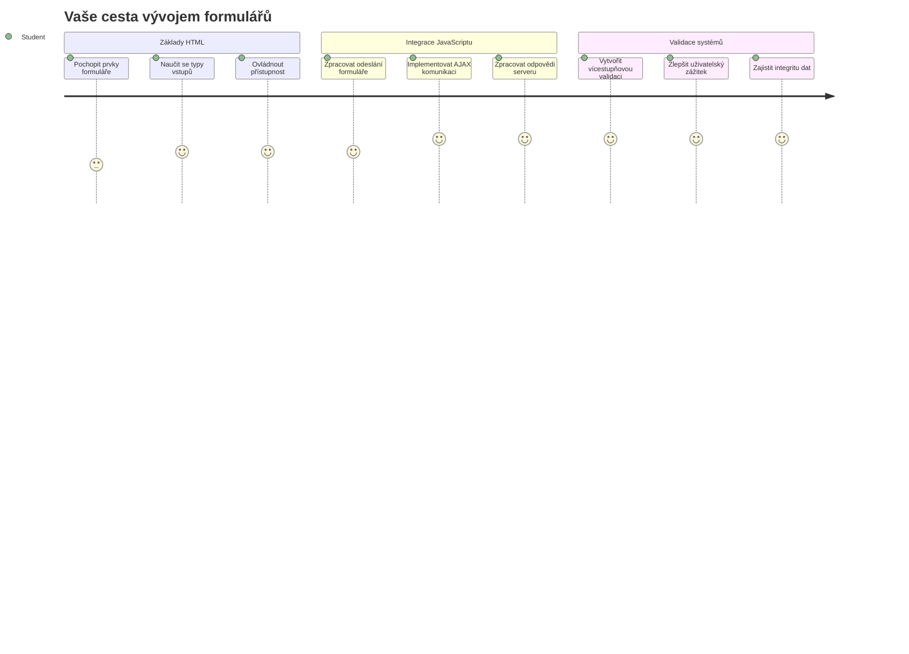
## Přednáškový kvíz

[Přednáškový kvíz](https://ff-quizzes.netlify.app/web/quiz/43)

Už jste někdy vyplňovali formulář online a formulář vám odmítl váš formát e-mailu? Nebo jste ztratili všechny informace po kliknutí na odeslat? S těmito frustrujícími zážitky se setkal asi každý.

Formuláře jsou mostem mezi vašimi uživateli a funkcionalitou vaší aplikace. Stejně jako pečlivé protokoly, které používají letečtí dispečeři, aby bezpečně naváděli letadla na letiště, dobře navržené formuláře poskytují jasnou zpětnou vazbu a zabraňují nákladným chybám. Naopak špatné formuláře mohou uživatele odradit rychleji, než jakékoliv nedorozumění na rušném letišti.

V této lekci proměníme vaši statickou bankovní aplikaci v interaktivní aplikaci. Naučíte se stavět formuláře, které validují uživatelský vstup, komunikují se servery a poskytují užitečnou zpětnou vazbu. Přemýšlejte o tom jako o vytváření ovládacího rozhraní, které umožní uživatelům navigovat funkcemi vaší aplikace.

Na konci budete mít kompletní systém přihlášení a registrace s validací, která uživatele vede ke zdaru místo frustrace.

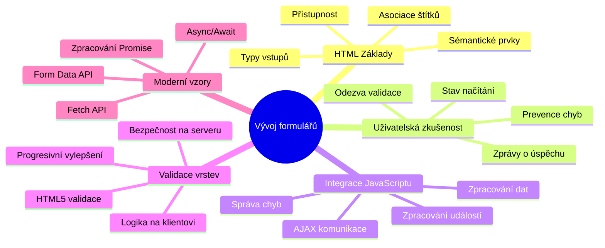
## Předpoklady

Než začneme s tvorbou formulářů, ujistěme se, že máte vše správně nastaveno. Tato lekce navazuje přímo na předchozí, takže pokud jste přeskakovali dopředu, možná budete chtít se vrátit a nejprve zajistit, že základ funguje.

### Požadované nastavení

| Komponenta | Stav | Popis |
|-----------|--------|-------------|
| [HTML šablony](../1-template-route/README.md) | ✅ Požadováno | Základní struktura vaší bankovní aplikace |
| [Node.js](https://nodejs.org) | ✅ Požadováno | JavaScript runtime pro server |
| [Bankovní API server](../api/README.md) | ✅ Požadováno | Backendová služba pro ukládání dat |

> 💡 **Tip pro vývoj**: Budete současně spouštět dva oddělené servery – jeden pro front-end bankovní aplikace a druhý pro backend API. Toto nastavení odpovídá reálnému vývoji, kde frontend a backend služby fungují nezávisle.

### Konfigurace serveru

**Vaše vývojové prostředí bude obsahovat:**
- **Frontendový server**: Serveruje vaši bankovní aplikaci (obvykle port `3000`)
- **Backendový API server**: Zpracovává ukládání a načítání dat (port `5000`)
- **Oba servery** mohou běžet současně bez konfliktů

**Testování připojení k API:**
```bash
curl http://localhost:5000/api
# Očekávaná odpověď: "Bank API v1.0.0"
```

**Pokud vidíte odpověď s verzí API, můžete pokračovat!**

---

## Porozumění HTML formulářům a ovládacím prvkům

HTML formuláře jsou způsob, jak uživatelé komunikují s vaší webovou aplikací. Představte si je jako telegrafní systém, který v 19. století spojoval vzdálená místa – jsou to komunikační protokoly mezi záměrem uživatele a reakcí aplikace. Pokud jsou navrženy promyšleně, zachytí chyby, poradí s formátem vstupu a nabídnou užitečné návrhy.

Moderní formuláře jsou výrazně sofistikovanější než základní textová pole. HTML5 zavedlo specializované typy inputů, které automaticky řeší validaci e-mailu, formátování čísel a výběr datumu. Tyto vylepšení zlepšují přístupnost i uživatelskou zkušenost na mobilech.

### Základní prvky formuláře

**Stavební kameny, které každý formulář potřebuje:**

```html
<!-- Basic form structure -->
<form id="userForm" method="POST">
  <label for="username">Username</label>
  <input id="username" name="username" type="text" required>
  
  <button type="submit">Submit</button>
</form>
```

**Co tento kód dělá:**
- **Vytvoří** kontejner formuláře s unikátním identifikátorem
- **Určí** HTTP metodu pro odeslání dat
- **Propojí** popisky s inputy pro přístupnost
- **Definuje** tlačítko pro odeslání formuláře

### Moderní typy vstupů a atributy

| Typ vstupu | Účel | Příklad použití |
|------------|---------|---------------|
| `text` | Obecný textový vstup | `<input type="text" name="username">` |
| `email` | Validace e-mailu | `<input type="email" name="email">` |
| `password` | Skrytý textový vstup | `<input type="password" name="password">` |
| `number` | Numerický vstup | `<input type="number" name="balance" min="0">` |
| `tel` | Telefonní čísla | `<input type="tel" name="phone">` |

> 💡 **Výhoda moderního HTML5**: Použití konkrétních typů vstupů poskytuje automatickou validaci, vhodné klávesnice na mobilech a lepší podporu přístupnosti bez potřeby JavaScriptu navíc!

### Typy tlačítek a jejich chování

```html
<!-- Different button behaviors -->
<button type="submit">Save Data</button>     <!-- Submits the form -->
<button type="reset">Clear Form</button>    <!-- Resets all fields -->
<button type="button">Custom Action</button> <!-- No default behavior -->
```

**Co každý typ tlačítka dělá:**
- **Tlačítka submit**: Spustí odeslání formuláře a pošlou data na uvedený endpoint
- **Tlačítka reset**: Obnoví všechna pole formuláře do počátečního stavu
- **Běžná tlačítka**: Nemají žádné výchozí chování, vyžadují vlastní JavaScript

> ⚠️ **Důležitá poznámka**: Element `<input>` je samo-uzavírací a nevyžaduje uzavírací tag. Moderní doporučený zápis je `<input>` bez lomítka.

### Vytvoření přihlašovacího formuláře

Nyní vytvoříme praktický přihlašovací formulář, který ukáže moderní postupy tvorby HTML formulářů. Začneme základní strukturou a postupně přidáme prvky pro přístupnost a validaci.

```html
<template id="login">
  <h1>Bank App</h1>
  <section>
    <h2>Login</h2>
    <form id="loginForm" novalidate>
      <div class="form-group">
        <label for="username">Username</label>
        <input id="username" name="user" type="text" required 
               autocomplete="username" placeholder="Enter your username">
      </div>
      <button type="submit">Login</button>
    </form>
  </section>
</template>
```

**Rozbor toho, co se zde děje:**
- **Strukturuje** formulář pomocí semantických HTML5 prvků
- **Seskupuje** související prvky do `div` kontejnerů s významnými třídami
- **Propojuje** popisky s inputy pomocí atributů `for` a `id`
- **Zahrnuje** moderní atributy jako `autocomplete` a `placeholder` pro lepší UX
- **Přidává** `novalidate` pro řízení validace pomocí JavaScriptu místo výchozích prohlížečových

### Síla správných popisků

**Proč jsou popisky důležité pro moderní webový vývoj:**

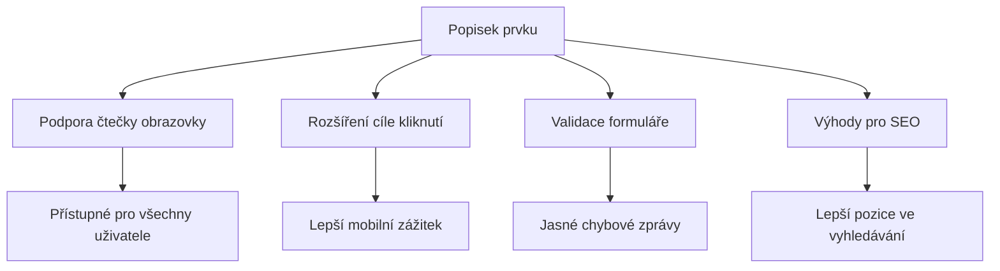
**Co správné popisky přináší:**
- **Umožňuje** čtečkám obrazovky jasně oznámit pole formuláře
- **Zvětšuje** klickující oblast (kliknutí na popisek zaostří input)
- **Zlepšuje** použitelnost na mobilech s většími dotykovými oblastmi
- **Podporuje** validaci s významnými chybovými hláškami
- **Zvyšuje** SEO poskytnutím sémantického významu prvkům formuláře

> 🎯 **Cíl přístupnosti**: Každý vstup ve formuláři by měl mít přiřazený popisek. Tento jednoduchý zvyk dělá formuláře použitelnými pro všechny, včetně uživatelů s handicapem, a zlepšuje zážitek pro všechny.

### Vytvoření registračního formuláře

Registrační formulář vyžaduje podrobnější údaje pro vytvoření kompletního uživatelského účtu. Postavme ho s využitím moderních HTML5 funkcí a lepší přístupností.

```html
<hr/>
<h2>Register</h2>
<form id="registerForm" novalidate>
  <div class="form-group">
    <label for="user">Username</label>
    <input id="user" name="user" type="text" required 
           autocomplete="username" placeholder="Choose a username">
  </div>
  
  <div class="form-group">
    <label for="currency">Currency</label>
    <input id="currency" name="currency" type="text" value="$" 
           required maxlength="3" placeholder="USD, EUR, etc.">
  </div>
  
  <div class="form-group">
    <label for="description">Account Description</label>
    <input id="description" name="description" type="text" 
           maxlength="100" placeholder="Personal savings, checking, etc.">
  </div>
  
  <div class="form-group">
    <label for="balance">Starting Balance</label>
    <input id="balance" name="balance" type="number" value="0" 
           min="0" step="0.01" placeholder="0.00">
  </div>
  
  <button type="submit">Create Account</button>
</form>
```

**Výše jsme:**
- **Uspořádali** každé pole do kontejnerů `div` pro lepší stylování a rozvržení
- **Přidali** vhodné atributy `autocomplete` pro podporu automatického vyplňování
- **Zařadili** užitečné výplňové texty (placeholder), které uživatele vedou
- **Nastavili** smysluplné výchozí hodnoty pomocí atributu `value`
- **Použili** validační atributy jako `required`, `maxlength` a `min`
- **Využili** `type="number"` pro pole saldo s podporou desetinných čísel

### Prozkoumání typů vstupů a jejich chování

**Moderní typy vstupů zlepšují funkcionalitu:**

| Funkce | Výhoda | Příklad |
|---------|---------|----------|
| `type="number"` | Numerická klávesnice na mobilu | Usnadňuje zadání zůstatku |
| `step="0.01"` | Kontrola desetinných míst | Umožňuje haléře u měny |
| `autocomplete` | Automatické doplňování prohlížečem | Rychlejší vyplňování formuláře |
| `placeholder` | Kontextové nápovědy | Vedou uživatele k správnému formátu |

> 🎯 **Výzva přístupnosti**: Zkuste formuláře obsáhnout pouze klávesnicí! Použijte `Tab` pro přechod mezi poli, `Space` pro zaškrtnutí políček a `Enter` pro odeslání. Tento test vám pomůže pochopit, jak s formuláři pracují uživatelé čteček obrazovky.

### 🔄 **Pedagogická kontrola**
**Porozumění základům formulářů**: Před implementací JavaScriptu si ověřte:
- ✅ Jak semantické HTML vytváří přístupné struktury formulářů
- ✅ Proč typy vstupů jsou důležité pro mobilní klávesnice a validaci
- ✅ Vztah mezi popisky a ovládacími prvky formuláře
- ✅ Jak atributy formuláře ovlivňují výchozí chování prohlížeče

**Krátký sebetest**: Co se stane, když odešlete formulář bez JavaScriptové obsluhy?
*Odpověď: Prohlížeč provede výchozí odeslání, obvykle přesměrováním na URL z atributu action*

**Výhody HTML5 formulářů**: Moderní formuláře nabízejí:
- **Vestavěnou validaci**: Automatickou kontrolu formátu e-mailu a čísel
- **Optimalizaci pro mobily**: Vhodné klávesnice pro různé typy vstupů
- **Přístupnost**: Podporu čteček obrazovky a navigace klávesnicí
- **Postupné vylepšování**: Fungují i při vypnutém JavaScriptu

## Porozumění metodám odesílání formulářů

Když uživatel vyplní váš formulář a stiskne odeslat, data musí někam jít – obvykle na server, který je uloží. Existuje několik způsobů, jak to může proběhnout, a znát, který použít, vám může později ušetřit problémy.

Podívejme se, co se vlastně stane po kliknutí na tlačítko odeslat.

### Výchozí chování formuláře

Nejdříve si ukažme, co se stane při základním odeslání formuláře:

**Otestujte své formuláře:**
1. Klikněte na tlačítko *Registrace* ve vašem formuláři
2. Sledujte změny v adresním řádku prohlížeče
3. Všimněte si, jak se stránka znovu načte a data jsou v URL


### Porovnání HTTP metod

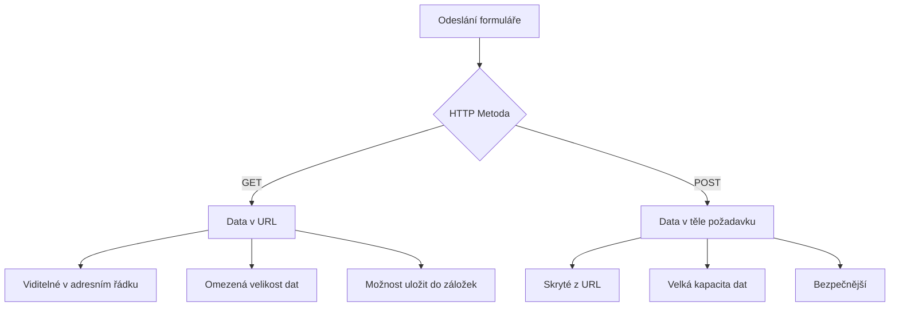
**Pochopení rozdílů:**

| Metoda | Případ použití | Umístění dat | Úroveň zabezpečení | Limit velikosti |
|--------|----------|---------------|----------------|-------------|
| `GET` | Vyhledávací dotazy, filtry | Parametry v URL | Nízká (viditelná) | cca 2000 znaků |
| `POST` | Uživatelské účty, citlivá data | Tělo požadavku | Vyšší (skrytá) | Prakticky neomezený |

**Základní rozdíly:**
- **GET**: Přidává data formuláře do URL jako parametry (vhodné pro vyhledávání)
- **POST**: Posílá data v těle požadavku (nutné pro citlivé informace)
- **Omezení GET**: Omezení velikosti, viditelnost dat, ukládání do historie prohlížeče
- **Výhody POST**: Větší kapacita dat, ochrana soukromí, podpora nahrávání souborů

> 💡 **Doporučený postup:** Pro vyhledávací formuláře a filtry používejte `GET`, pro registraci uživatelů, přihlašování a tvorbu dat používejte `POST`.

### Konfigurace odeslání formuláře

Nakonfigurujme váš registrační formulář tak, aby správně komunikoval s backendovým API pomocí metody POST:

```html
<form id="registerForm" action="//localhost:5000/api/accounts" 
      method="POST" novalidate>
```

**Co tato konfigurace dělá:**
- **Směřuje** odeslání formuláře na váš API endpoint
- **Používá** metodu POST pro bezpečný přenos dat
- **Zahrnuje** `novalidate` pro řízení validace pomocí JavaScriptu

### Testování odeslání formuláře

**Postupujte podle těchto kroků k testu formuláře:**
1. **Vyplňte** registrační formulář svými informacemi
2. **Klikněte** na tlačítko "Vytvořit účet"
3. **Sledujte** odpověď serveru v prohlížeči

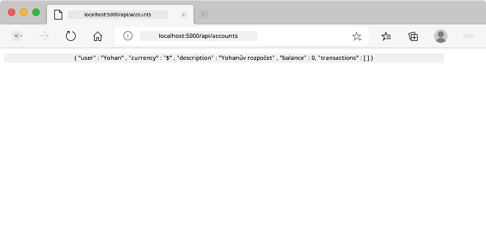

**Co byste měli vidět:**
- **Prohlížeč přesměruje** na URL API endpointu
- **JSON odpověď** obsahující nově vytvořená data účtu
- **Potvrzení serveru**, že účet byl úspěšně vytvořen

> 🧪 **Čas na experiment**: Zkuste se zaregistrovat znovu se stejným uživatelským jménem. Jakou odpověď dostanete? Pomůže vám to pochopit, jak server zpracovává duplicitní data a chyby.

### Porozumění JSON odpovědím

**Když server úspěšně zpracuje váš formulář:**
```json
{
  "user": "john_doe",
  "currency": "$",
  "description": "Personal savings",
  "balance": 100,
  "id": "unique_account_id"
}
```

**Tato odpověď potvrzuje:**
- **Vytvoření** nového účtu s vámi zadanými údaji
- **Přiřazení** unikátního identifikátoru pro budoucí použití
- **Vrácení** všech informací o účtu pro kontrolu
- **Indikaci** úspěšného uložení do databáze

## Moderní zpracování formulářů pomocí JavaScriptu

Tradiční odesílání formulářů způsobuje kompletní načtení stránky, podobně jako první vesmírné mise, které vyžadovaly úplné restartování systému při korekci kurzu. Tento přístup narušuje uživatelský zážitek a ztrácí stav aplikace.

JavaScriptové zpracování formulářů funguje jako průběžné naváděcí systémy moderních vesmírných lodí – provádí úpravy v reálném čase, aniž by se ztratil kontext navigace. Můžeme odchytit odesílání formuláře, poskytnout okamžitou zpětnou vazbu, elegantně řešit chyby a aktualizovat rozhraní podle odpovědí serveru, přičemž uživatel zůstává v aplikaci.

### Proč se vyhnout načítání stránky?

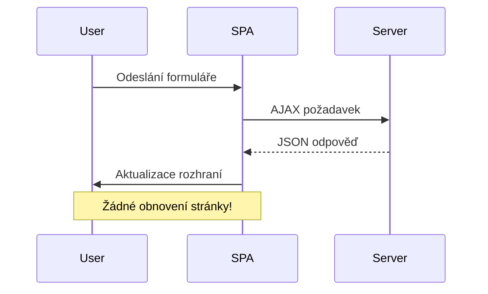
**Výhody JavaScriptového zpracování formulářů:**
- **Udržuje** stav aplikace a kontext uživatele
- **Poskytuje** okamžitou zpětnou vazbu a indikátory načítání
- **Umožňuje** dynamické řešení chyb a validaci
- **Vytváří** plynulé uživatelské zážitky podobné aplikacím
- **Podporuje** podmíněnou logiku podle odpovědí ze serveru

### Přechod od tradičních ke moderním formulářům

**Výzvy tradičního přístupu:**
- **Přesměrovává** uživatele pryč z aplikace
- **Ztrácí** aktuální stav a kontext aplikace
- **Vyžaduje** plné načítání stránky i pro jednoduché operace
- **Poskytuje** omezenou kontrolu nad zpětnou vazbou uživatele

**Výhody moderního JavaScriptového přístupu:**
- **Drží** uživatele v rámci aplikace
- **Zachovává** všechny stavy a data aplikace
- **Umožňuje** validaci a zpětnou vazbu v reálném čase
- **Podporuje** postupné vylepšování a přístupnost

### Implementace JavaScriptového zpracování formulářů

Nahraďme tradiční odesílání formulářů moderní manipulací událostí v JavaScriptu:

```html
<!-- Remove the action attribute and add event handling -->
<form id="registerForm" method="POST" novalidate>
```

**Přidejte registrační logiku do souboru `app.js`:**

```javascript
// Moderní zpracování formulářů řízené událostmi
function register() {
  const registerForm = document.getElementById('registerForm');
  const formData = new FormData(registerForm);
  const data = Object.fromEntries(formData);
  const jsonData = JSON.stringify(data);
  
  console.log('Form data prepared:', data);
}

// Připojit posluchač událostí při načtení stránky
document.addEventListener('DOMContentLoaded', () => {
  const registerForm = document.getElementById('registerForm');
  registerForm.addEventListener('submit', (event) => {
    event.preventDefault(); // Zabránit výchozímu odeslání formuláře
    register();
  });
});
```

**Co se zde děje:**
- **Zabraňuje** výchozímu odeslání formuláře pomocí `event.preventDefault()`
- **Získává** prvek formuláře pomocí moderního výběru DOM
- **Vydělává** data formuláře přes mocné API `FormData`
- **Převádí** FormData na běžný objekt pomocí `Object.fromEntries()`
- **Serializuje** data do formátu JSON pro komunikaci se serverem
- **Loguje** zpracovaná data pro ladění a kontrolu

### Porozumění API FormData

**API FormData poskytuje silné nástroje pro zpracování formulářů:**
```javascript
// Příklad toho, co FormData zachytí
const formData = new FormData(registerForm);

// FormData automaticky zachytí:
// {
//   "user": "john_doe",
//   "currency": "$",
//   "description": "Osobní účet",
//   "balance": "100"
// }
```

**Výhody API FormData:**
- **Komplexní sběr**: Zachycuje všechny prvky formuláře včetně textu, souborů a složitých vstupů
- **Povědomí o typech**: Automaticky zpracovává různé typy vstupů bez nutnosti vlastního kódu
- **Efektivita**: Odstraňuje ruční sběr polí pomocí jediného volání API
- **Přizpůsobivost**: Zachovává funkčnost při vývoji struktury formuláře

### Vytvoření funkce pro komunikaci se serverem

Nyní si vytvoříme robustní funkci pro komunikaci s vaším API serverem pomocí moderních JavaScriptových vzorů:

```javascript
async function createAccount(account) {
  try {
    const response = await fetch('//localhost:5000/api/accounts', {
      method: 'POST',
      headers: { 
        'Content-Type': 'application/json',
        'Accept': 'application/json'
      },
      body: account
    });
    
    // Zkontrolujte, zda byla odpověď úspěšná
    if (!response.ok) {
      throw new Error(`HTTP error! status: ${response.status}`);
    }
    
    return await response.json();
  } catch (error) {
    console.error('Account creation failed:', error);
    return { error: error.message || 'Network error occurred' };
  }
}
```

**Porozumění asynchronnímu JavaScriptu:**

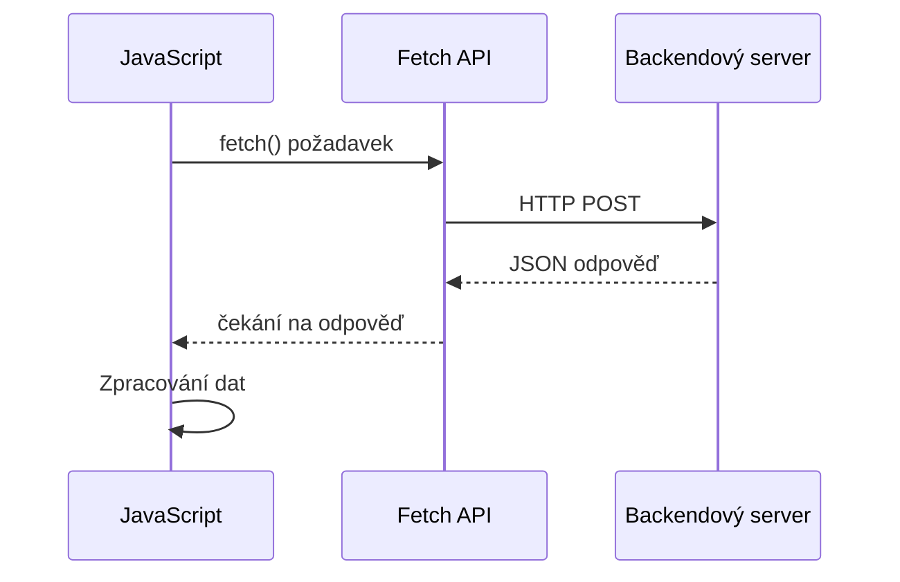
**Co tato moderní implementace dosahuje:**
- **Používá** `async/await` pro čitelný asynchronní kód
- **Zahrnuje** správné zpracování chyb pomocí bloků try/catch
- **Kontroluje** stav odpovědi před zpracováním dat
- **Nastavuje** vhodné hlavičky pro komunikaci JSON
- **Poskytuje** detailní chybové zprávy pro ladění
- **Vrací** konzistentní datovou strukturu pro úspěšné i chybové případy

### Síla moderního Fetch API

**Výhody Fetch API oproti starším metodám:**

| Vlastnost | Výhoda | Implementace |
|-----------|---------|--------------|
| Na Promise založené | Čistý asynchronní kód | `await fetch()` |
| Přizpůsobení požadavku | Plná kontrola nad HTTP | Hlavičky, metody, tělo |
| Zpracování odpovědi | Flexibilní zpracování dat | `.json()`, `.text()`, `.blob()` |
| Zpracování chyb | Komplexní zachytávání chyb | Bloky try/catch |

> 🎥 **Další informace**: [Async/Await Tutorial](https://youtube.com/watch?v=YwmlRkrxvkk) - Porozumění asynchronním JavaScriptovým vzorům pro moderní webový vývoj.

**Klíčové koncepty pro komunikaci se serverem:**
- **Async funkce** umožňují pozastavení provádění do doby odpovědi ze serveru
- **Klíčové slovo await** činí asynchronní kód čitelným jako synchronní
- **Fetch API** poskytuje moderní, na Promise založené HTTP požadavky
- **Zpracování chyb** zajišťuje, že aplikace elegantně reaguje na síťové problémy

### Dokončení registrační funkce

Spojme vše dohromady s kompletní, do produkce připravenou registrační funkcí:

```javascript
async function register() {
  const registerForm = document.getElementById('registerForm');
  const submitButton = registerForm.querySelector('button[type="submit"]');
  
  try {
    // Zobrazit stav načítání
    submitButton.disabled = true;
    submitButton.textContent = 'Creating Account...';
    
    // Zpracovat data formuláře
    const formData = new FormData(registerForm);
    const jsonData = JSON.stringify(Object.fromEntries(formData));
    
    // Odeslat na server
    const result = await createAccount(jsonData);
    
    if (result.error) {
      console.error('Registration failed:', result.error);
      alert(`Registration failed: ${result.error}`);
      return;
    }
    
    console.log('Account created successfully!', result);
    alert(`Welcome, ${result.user}! Your account has been created.`);
    
    // Resetovat formulář po úspěšné registraci
    registerForm.reset();
    
  } catch (error) {
    console.error('Unexpected error:', error);
    alert('An unexpected error occurred. Please try again.');
  } finally {
    // Obnovit stav tlačítka
    submitButton.disabled = false;
    submitButton.textContent = 'Create Account';
  }
}
```

**Tato vylepšená implementace zahrnuje:**
- **Poskytuje** vizuální zpětnou vazbu během odesílání formuláře
- **Zakáže** tlačítko odeslání, aby se zabránilo duplicitním odesláním
- **Zpracovává** očekávané i neočekávané chyby elegantně
- **Zobrazuje** přívětivé zprávy o úspěchu a chybách
- **Resetuje** formulář po úspěšné registraci
- **Obnovuje** stav UI bez ohledu na výsledek

### Testování vaší implementace

**Otevřete nástroje pro vývojáře ve vašem prohlížeči a otestujte registraci:**

1. **Otevřete** konzoli prohlížeče (F12 → karta Console)
2. **Vyplňte** registrační formulář
3. **Klikněte** na "Vytvořit účet"
4. **Sledujte** zprávy v konzoli a zpětnou vazbu uživatele

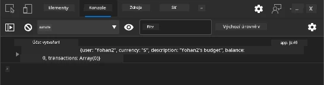

**Co byste měli vidět:**
- **Stav načítání** se objeví na tlačítku odeslání
- **Logy v konzoli** ukazují detailní informace o procesu
- **Zpráva o úspěchu** se zobrazí po úspěšném vytvoření účtu
- **Formulář se automaticky resetuje** po úspěšném odeslání

> 🔒 **Bezpečnostní poznámka**: V současnosti data cestují přes HTTP, což není pro produkci bezpečné. Ve skutečných aplikacích vždy používejte HTTPS pro šifrování přenosu dat. Více o [HTTPS bezpečnosti](https://en.wikipedia.org/wiki/HTTPS) a proč je zásadní pro ochranu uživatelských dat.

### 🔄 **Pedagogická kontrola**
**Integrace moderního JavaScriptu**: Ověřte své porozumění asynchronnímu zpracování formulářů:
- ✅ Jak `event.preventDefault()` změní výchozí chování formuláře?
- ✅ Proč je API FormData efektivnější než manuální sběr polí?
- ✅ Jak asynchronní vzory async/await zlepšují čitelnost kódu?
- ✅ Jakou roli hraje zpracování chyb v uživatelské zkušenosti?

**Architektura systému**: Vaše zpracování formulářů demonstruje:
- **Programování řízené událostmi**: Formuláře reagují na uživatelské akce bez načítání stránky
- **Asynchronní komunikaci**: Požadavky na server neblokují uživatelské rozhraní
- **Zpracování chyb**: Graceful degradace při selhání sítě
- **Správu stavu**: Aktualizace UI odpovídají odpovědím serveru
- **Postupné vylepšování**: Základní funkčnost funguje, JavaScript ji doplňuje

**Profesionální vzory**: Implementovali jste:
- **Jednotnou odpovědnost**: Funkce mají jasně definované a zaměřené účely
- **HRanicové zpracování chyb**: Bloky try/catch zabraňují pádům aplikace
- **Uživatelskou zpětnou vazbu**: Stavy načítání a hlášení úspěchů/chyb
- **Transformaci dat**: FormData na JSON pro komunikaci se serverem

## Komplexní validace formuláře

Validace formuláře zabraňuje frustrující situaci, kdy uživatel objevuje chyby až po odeslání. Podobně jako mnoho záložních systémů na Mezinárodní vesmírné stanici efektivní validace využívá více vrstev bezpečnostních kontrol.

Optimální přístup kombinuje validaci na úrovni prohlížeče pro okamžitou zpětnou vazbu, JavaScriptovou validaci pro lepší uživatelský zážitek a serverovou validaci pro zabezpečení a integritu dat. Tato redundance zajišťuje spokojenost uživatele i ochranu systému.

### Porozumění vrstvám validace

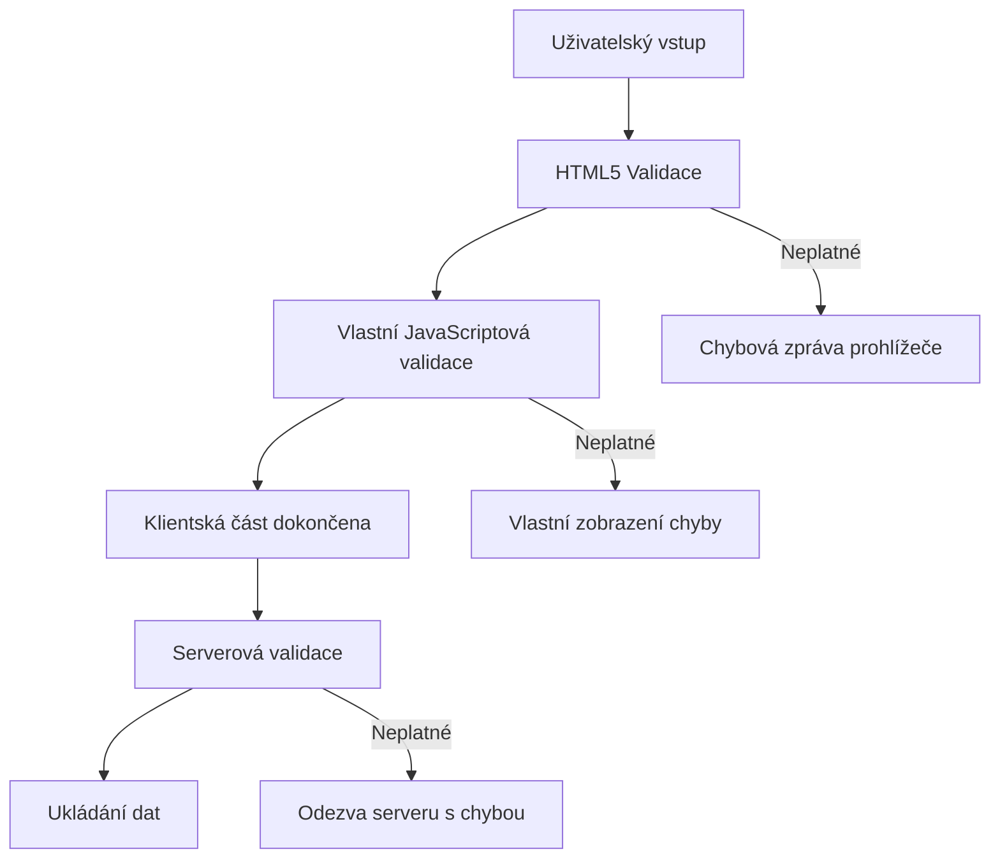
**Strategie více vrstev validace:**
- **HTML5 validace**: Okamžité kontroly v prohlížeči
- **JavaScriptová validace**: Vlastní logika a uživatelský zážitek
- **Serverová validace**: Konečné zabezpečení a kontrola integrity dat
- **Postupné vylepšování**: Funguje i bez JavaScriptu

### HTML5 validační atributy

**Moderní validační nástroje k dispozici:**

| Atribut | Účel | Příklad použití | Chování prohlížeče |
|---------|-------|-----------------|--------------------|
| `required` | Povinná pole | `<input required>` | Zabráňuje odeslání prázdného |
| `minlength`/`maxlength` | Omezení délky textu | `<input maxlength="20">` | Vynucuje limity znaků |
| `min`/`max` | Číselné rozsahy | `<input min="0" max="1000">` | Validuje čísla podle mezí |
| `pattern` | Vlastní regex pravidla | `<input pattern="[A-Za-z]+">` | Odpovídá specifickým formátům |
| `type` | Validace datového typu | `<input type="email">` | Validace specifických formátů |

### CSS stylování validace

**Vytvořte vizuální zpětnou vazbu pro stavy validace:**

```css
/* Valid input styling */
input:valid {
  border-color: #28a745;
  background-color: #f8fff9;
}

/* Invalid input styling */
input:invalid {
  border-color: #dc3545;
  background-color: #fff5f5;
}

/* Focus states for better accessibility */
input:focus:valid {
  box-shadow: 0 0 0 0.2rem rgba(40, 167, 69, 0.25);
}

input:focus:invalid {
  box-shadow: 0 0 0 0.2rem rgba(220, 53, 69, 0.25);
}
```

**Co tyto vizuální prvky dělají:**
- **Zelené okraje**: Signalizují úspěšnou validaci, jako zelená světla v řídicím centru
- **Červené okraje**: Označují chyby vyžadující pozornost
- **Zvýraznění fokusu**: Poskytuje jasný vizuální kontext aktuálního pole
- **Konzistentní stylování**: Umožňuje uživatelům naučit se předvídatelné vzory UI

> 💡 **Tip**: Použijte CSS pseudo-třídy `:valid` a `:invalid` pro okamžitou vizuální zpětnou vazbu při zadávání, čímž vytvoříte responzivní a užitečné rozhraní.

### Implementace komplexní validace

Vylepšete svůj registrační formulář robustní validací, která nabízí vynikající uživatelský zážitek a kvalitu dat:

```html
<form id="registerForm" method="POST" novalidate>
  <div class="form-group">
    <label for="user">Username <span class="required">*</span></label>
    <input id="user" name="user" type="text" required 
           minlength="3" maxlength="20" 
           pattern="[a-zA-Z0-9_]+" 
           autocomplete="username"
           title="Username must be 3-20 characters, letters, numbers, and underscores only">
    <small class="form-text">Choose a unique username (3-20 characters)</small>
  </div>
  
  <div class="form-group">
    <label for="currency">Currency <span class="required">*</span></label>
    <input id="currency" name="currency" type="text" required 
           value="$" maxlength="3" 
           pattern="[A-Z$€£¥₹]+" 
           title="Enter a valid currency symbol or code">
    <small class="form-text">Currency symbol (e.g., $, €, £)</small>
  </div>
  
  <div class="form-group">
    <label for="description">Account Description</label>
    <input id="description" name="description" type="text" 
           maxlength="100" 
           placeholder="Personal savings, checking, etc.">
    <small class="form-text">Optional description (up to 100 characters)</small>
  </div>
  
  <div class="form-group">
    <label for="balance">Starting Balance</label>
    <input id="balance" name="balance" type="number" 
           value="0" min="0" step="0.01" 
           title="Enter a positive number for your starting balance">
    <small class="form-text">Initial account balance (minimum $0.00)</small>
  </div>
  
  <button type="submit">Create Account</button>
</form>
```

**Co vylepšená validace obsahuje:**
- **Kombinuje** indikátory povinných polí s užitečnými popisy
- **Zahrnuje** atributy `pattern` pro kontrolu formátu
- **Poskytuje** atributy `title` pro přístupnost a tooltipy
- **Přidává** pomocný text pro usměrnění uživatele
- **Používá** sémantickou HTML strukturu pro lepší přístupnost

### Pokročilá validační pravidla

**Co jednotlivá pravidla validace dělají:**

| Pole | Pravidla validace | Uživatelský přínos |
|-------|-------------------|--------------------|
| Uživatelské jméno | `required`, `minlength="3"`, `maxlength="20"`, `pattern="[a-zA-Z0-9_]+"` | Zajišťuje platné a unikátní identifikátory |
| Měna | `required`, `maxlength="3"`, `pattern="[A-Z$€£¥₹]+"` | Přijímá běžné měnové symboly |
| Stav účtu | `min="0"`, `step="0.01"`, `type="number"` | Zabraňuje záporným stavům |
| Popis | `maxlength="100"` | Rozumné omezení délky |

### Testování chování validace

**Vyzkoušejte tyto validační scénáře:**
1. **Odešlete** formulář s prázdnými povinnými poli
2. **Zadejte** uživatelské jméno kratší než 3 znaky
3. **Zkuste** speciální znaky v poli uživatelského jména
4. **Zadejte** zápornou částku stavu účtu

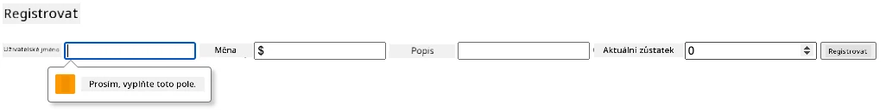

**Co uvidíte:**
- **Prohlížeč zobrazí** nativní validační zprávy
- **Styling se změní** podle stavů `:valid` a `:invalid`
- **Odeslání formuláře** je zablokováno, dokud všechny validace neprojdou
- **Fokus se automaticky** přesune na první neplatné pole

### Validace na klientské a serverové straně

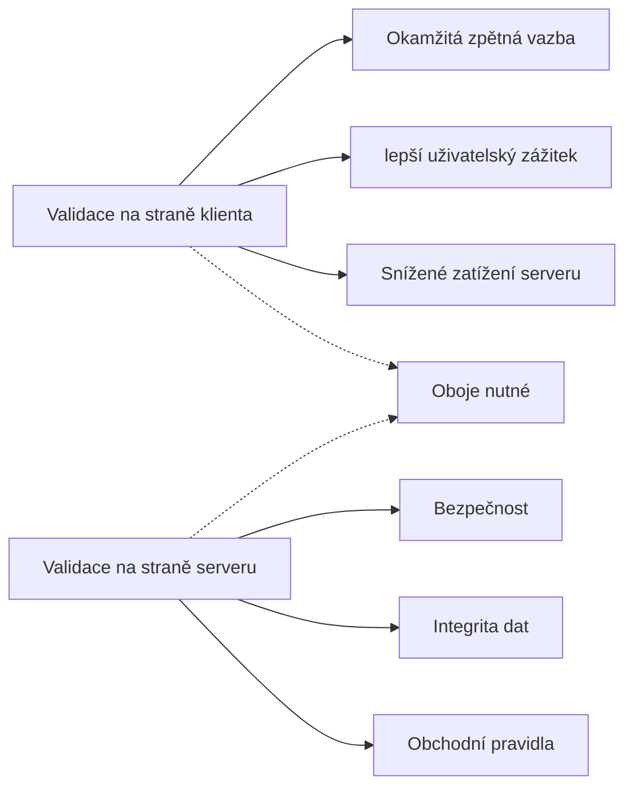
**Proč potřebujete obě vrstvy:**
- **Klientská validace**: Poskytuje okamžitou zpětnou vazbu a zlepšuje uživatelský zážitek
- **Serverová validace**: Zajišťuje bezpečnost a zvládá složité obchodní pravidla
- **Kombinovaný přístup**: Vyvíjí robustní, uživatelsky přívětivé a bezpečné aplikace
- **Postupné vylepšování**: Funguje i bez JavaScriptu

> 🛡️ **Bezpečnostní připomínka**: Nikdy nespoléhejte pouze na klientskou validaci! Zlovolní uživatelé mohou obejít kontroly na klientovi, proto je serverová validace nezbytná pro bezpečnost a integritu dat.

### ⚡ **Co můžete stihnout za 5 minut**
- [ ] Otestovat formulář se špatnými daty a sledovat validační zprávy
- [ ] Zkusit odeslat formulář s vypnutým JavaScriptem a zkontrolovat HTML5 validaci
- [ ] Otevřít nástroje pro vývojáře a zkontrolovat odesílaná data
- [ ] Experimentovat s různými typy vstupů a sledovat změny mobilní klávesnice

### 🎯 **Co zvládnete během této hodiny**
- [ ] Dokončit kvíz po lekci a pochopit koncepty zpracování formulářů
- [ ] Implementovat komplexní validaci s okamžitou zpětnou vazbou
- [ ] Přidat CSS stylování pro profesionálně vypadající formuláře
- [ ] Vytvořit zpracování chyb pro duplicitní uživatelská jména a chyby serveru
- [ ] Přidat pole pro potvrzení hesla s odpovídající validací

### 📅 **Váš týdenní plán zvládnutí formulářů**
- [ ] Dokončit kompletní bankovní aplikaci s pokročilými funkcemi formulářů
- [ ] Implementovat možnost nahrávání souborů pro profilové fotografie či dokumenty
- [ ] Přidat vícestupňové formuláře s indikátory postupu a správou stavu
- [ ] Vytvořit dynamické formuláře, které se přizpůsobují na základě výběrů uživatele
- [ ] Zajistit automatické ukládání a obnovu formulářů pro lepší UX
- [ ] Přidat pokročilou validaci jako ověřování emailu a formátování telefonních čísel

### 🌟 **Měsíční plán zvládnutí frontend vývoje**
- [ ] Vyvíjet komplexní formulářové aplikace s podmíněnou logikou a workflow
- [ ] Naučit se knihovny a frameworky pro rychlý vývoj formulářů
- [ ] Ovládnout zásady přístupnosti a inkluzivního designu
- [ ] Implementovat internacionalizaci a lokalizaci formulářů
- [ ] Vytvářet znovupoužitelné knihovny komponent a designové systémy
- [ ] Přispívat do open source projektů zaměřených na formuláře a sdílet osvědčené postupy

## 🎯 Časová osa vašeho zvládnutí vývoje formulářů

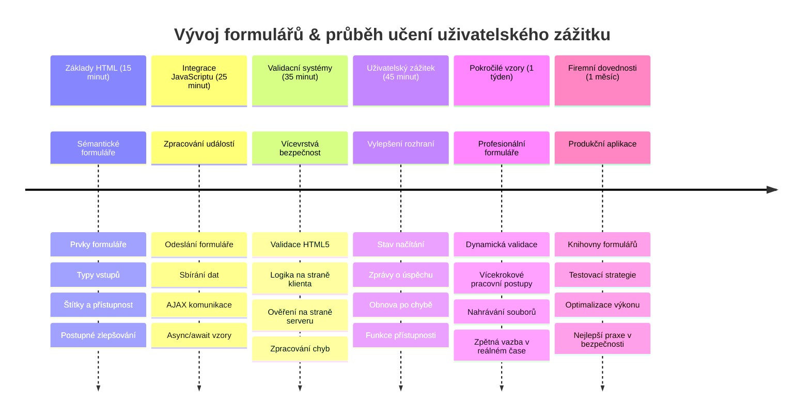
### 🛠️ Shrnutí nástrojů pro vývoj formulářů

Po dokončení této lekce ovládáte:
- **HTML5 formuláře**: Sémantická struktura, typy vstupů a přístupnost
- **JavaScriptové zpracování formulářů**: Správa událostí, sběr dat a AJAX komunikace
- **Architekturu validace**: Vícevrstevná validace pro bezpečnost a UX
- **Asynchronní programování**: Moderní fetch API a vzory async/await
- **Řízení chyb**: Komplexní zpracování chyb a systémy zpětné vazby
- **Návrh uživatelského zážitku**: Stavy načítání, zprávy o úspěchu a obnovení po chybách
- **Postupné vylepšování**: Formuláře fungující ve všech prohlížečích a podmínkách

**Praktické použití**: Vaše dovednosti použijete v:
- **E-commerce aplikacích**: Procesy nákupu, registrace a formuláře plateb
- **Podnikových softwarech**: Systémy pro zadávání dat, reportování a workflow
- **Systémech pro správu obsahu**: Publikační platformy, uživatelsky generovaný obsah administrace
- **Finančních aplikacích**: Bankovní rozhraní, investiční platformy, transakční systémy
- **Zdravotních systémech**: Portály pacientů, plánování schůzek, lékařské formuláře
- **Vzdělávacích platformách**: Registrace kurzů, nástroje pro hodnocení a LMS

**Získané profesionální dovednosti**: Umíte nyní:
- **Navrhovat** přístupné formuláře fungující pro všechny uživatele, včetně handicapovaných
- **Implementovat** bezpečnou validaci zamezující poškození dat a bezpečnostním rizikům
- **Vytvářet** responzivní UI s jasnou zpětnou vazbou a vedením uživatele
- **Ladit** komplexní interakce formulářů pomocí nástrojů pro vývojáře a analýzy sítě
- **Optimalizovat** výkon formulářů pomocí efektivní správy dat a validace

**Ovládnuté koncepty frontendového vývoje**:
- **Architektura řízená událostmi**: Zpracování uživatelských akcí a systém reflexí
- **Asynchronní programování**: Nezablokující komunikace se serverem a zpracování chyb
- **Validace dat**: Bezpečnostní a integritní kontroly na klientovi i serveru
- **Návrh UX**: Intuitivní rozhraní vedoucí uživatele k úspěchu
- **Inženýrství přístupnosti**: Inkluzivní design vhodný pro různorodé potřeby uživatelů

**Další krok**: Jste připraveni prozkoumat pokročilé knihovny formulářů, implementovat složitá validační pravidla nebo budovat podnikové systémy sběru dat!

🌟 **Ocenění získáno**: Vytvořili jste kompletní systém zpracování formulářů s profesionální validací, zpracováním chyb a vzory zpětné vazby!

---


---

## Výzva GitHub Copilot Agenta 🚀

Použijte režim Agenta k dokončení následující výzvy:

**Popis:** Vylepšete registrační formulář o komplexní klientskou validaci a zpětnou vazbu uživatele. Tato výzva vám pomůže procvičit validaci formulářů, zpracování chyb a zlepšení uživatelské zkušenosti s interaktivní zpětnou vazbou.
**Vyžádání:** Vytvořte kompletní systém ověřování formuláře pro registrační formulář, který zahrnuje: 1) Aktivní zpětnou vazbu ověřování pro každé pole během psaní uživatele, 2) Vlastní validační zprávy, které se zobrazují pod každým vstupním polem, 3) Pole pro potvrzení hesla s ověřováním shody, 4) Vizuální indikátory (například zelené fajfky pro platná pole a červená varování pro neplatná pole), 5) Tlačítko odeslání, které se aktivuje pouze, když všechny validace projdou. Použijte atributy HTML5 pro validaci, CSS pro stylování stavů validace a JavaScript pro interaktivní chování.

Více informací o [režimu agenta](https://code.visualstudio.com/blogs/2025/02/24/introducing-copilot-agent-mode) najdete zde.

## 🚀 Výzva

Zobrazte chybovou zprávu v HTML, pokud uživatel již existuje.

Zde je příklad, jak může finální přihlašovací stránka vypadat po malé úpravě stylů:

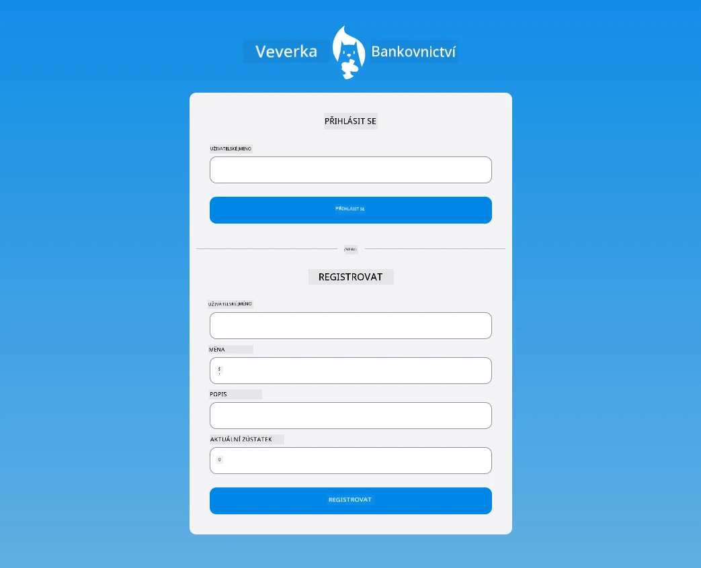

## Kvíz po přednášce

[Kvíz po přednášce](https://ff-quizzes.netlify.app/web/quiz/44)

## Přehled a samostudium

Vývojáři jsou velmi kreativní ve svých snahách o tvorbu formulářů, zejména pokud jde o strategie validace. Prozkoumejte různé způsoby vytváření formulářů prohlížením [CodePen](https://codepen.com); dokážete najít nějaké zajímavé a inspirativní formuláře?

## Zadání

[Stylujte svou bankovní aplikaci](assignment.md)

---

<!-- CO-OP TRANSLATOR DISCLAIMER START -->
**Disclaimer**:  
Tento dokument byl přeložen pomocí AI překladatelské služby [Co-op Translator](https://github.com/Azure/co-op-translator). Přestože usilujeme o přesnost, mějte prosím na paměti, že automatizované překlady mohou obsahovat chyby nebo nepřesnosti. Originální dokument v jeho rodném jazyce by měl být považován za autoritativní zdroj. Pro zásadní informace se doporučuje profesionální lidský překlad. Nejsme odpovědní za jakékoli nedorozumění nebo nesprávné interpretace vyplývající z použití tohoto překladu.
<!-- CO-OP TRANSLATOR DISCLAIMER END -->