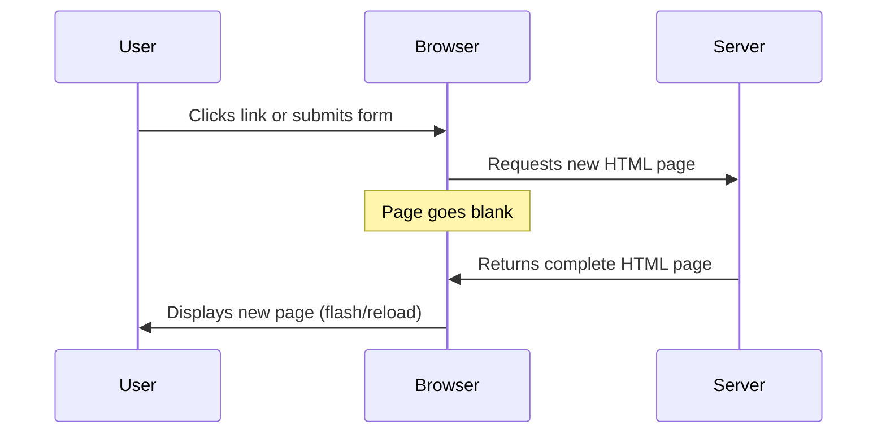
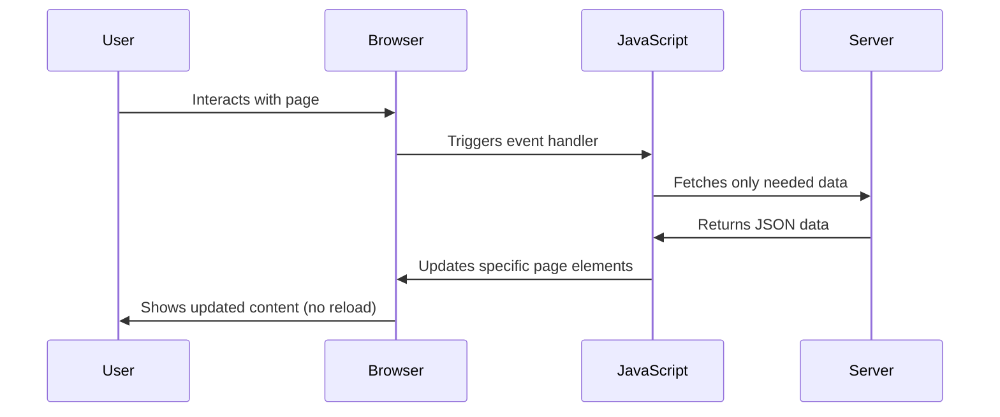
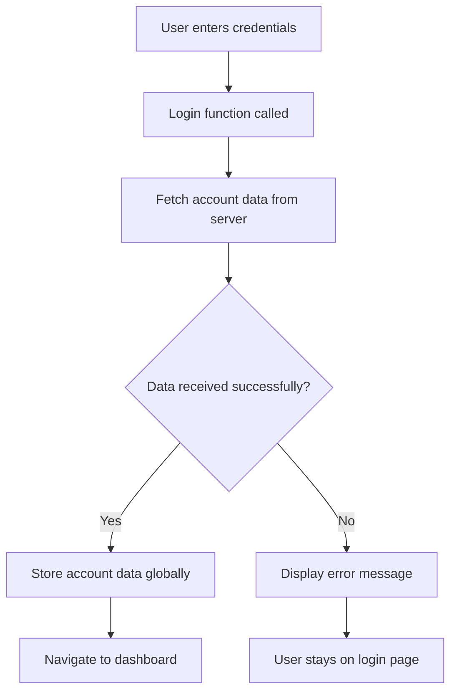
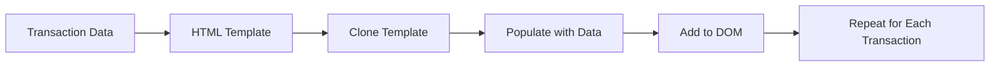

<!--
CO_OP_TRANSLATOR_METADATA:
{
  "original_hash": "2c1164912414820c8efd699b43f64954",
  "translation_date": "2025-10-24T21:03:25+00:00",
  "source_file": "7-bank-project/3-data/README.md",
  "language_code": "cs"
}
-->
# Vytvoření bankovní aplikace, část 3: Metody získávání a používání dat

Představte si počítač Enterprise ze Star Treku – když kapitán Picard požádá o stav lodi, informace se okamžitě zobrazí, aniž by se celé rozhraní muselo vypnout a znovu načíst. Přesně takový plynulý tok informací se snažíme vytvořit pomocí dynamického získávání dat.

Vaše bankovní aplikace je momentálně jako tištěné noviny – informativní, ale statická. Proměníme ji v něco podobného řídícímu centru NASA, kde data proudí nepřetržitě a aktualizují se v reálném čase, aniž by narušovala uživatelský zážitek.

Naučíte se komunikovat se servery asynchronně, pracovat s daty, která přicházejí v různých časech, a transformovat surové informace na něco smysluplného pro vaše uživatele. To je rozdíl mezi ukázkovým a produkčně připraveným softwarem.

## Kvíz před přednáškou

[Pre-lecture quiz](https://ff-quizzes.netlify.app/web/quiz/45)

### Předpoklady

Než se pustíte do získávání dat, ujistěte se, že máte připraveny tyto komponenty:

- **Předchozí lekce**: Dokončete [Přihlašovací a registrační formulář](../2-forms/README.md) – budeme na tomto základě stavět
- **Lokální server**: Nainstalujte [Node.js](https://nodejs.org) a [spusťte server API](../api/README.md), který poskytne data o účtu
- **Připojení k API**: Otestujte připojení k serveru tímto příkazem:

```bash
curl http://localhost:5000/api
# Expected response: "Bank API v1.0.0"
```

Tento rychlý test zajistí, že všechny komponenty správně komunikují:
- Ověří, že Node.js na vašem systému běží správně
- Potvrdí, že váš API server je aktivní a reaguje
- Ověří, že vaše aplikace může dosáhnout na server (jako kontrola rádiového spojení před misí)

---

## Porozumění získávání dat v moderních webových aplikacích

Způsob, jakým webové aplikace pracují s daty, se za poslední dvě desetiletí dramaticky vyvinul. Pochopení tohoto vývoje vám pomůže ocenit, proč jsou moderní techniky jako AJAX a Fetch API tak silné a proč se staly nezbytnými nástroji pro webové vývojáře.

Pojďme prozkoumat, jak fungovaly tradiční webové stránky ve srovnání s dynamickými, responzivními aplikacemi, které dnes vytváříme.

### Tradiční více stránkové aplikace (MPA)

V počátcích webu byl každý klik jako přepínání kanálů na staré televizi – obrazovka zčernala a poté se pomalu naladil nový obsah. Taková byla realita raných webových aplikací, kde každá interakce znamenala kompletní přestavbu celé stránky od začátku.




**Proč tento přístup působil neohrabaně:**
- Každý klik znamenal kompletní přestavbu celé stránky od začátku
- Uživatelé byli přerušováni nepříjemnými záblesky stránky
- Vaše internetové připojení pracovalo přesčas při stahování stejných záhlaví a zápatí opakovaně
- Aplikace působily spíše jako procházení kartotéky než jako používání softwaru

### Moderní jednostránkové aplikace (SPA)

AJAX (Asynchronous JavaScript and XML) zcela změnil tento přístup. Stejně jako modulární design Mezinárodní vesmírné stanice, kde astronauti mohou vyměnit jednotlivé komponenty bez přestavby celé struktury, AJAX nám umožňuje aktualizovat konkrétní části webové stránky bez jejího kompletního znovunačtení. I když název zmiňuje XML, dnes většinou používáme JSON, ale základní princip zůstává: aktualizovat pouze to, co se musí změnit.




**Proč jsou SPA tak příjemné:**
- Aktualizují se pouze části, které se skutečně změnily (chytré, že?)
- Žádné rušivé přerušení – uživatelé zůstávají ve svém pracovním toku
- Méně dat putuje po síti, což znamená rychlejší načítání
- Všechno působí svižně a responzivně, jako aplikace na vašem telefonu

### Vývoj k modernímu Fetch API

Moderní prohlížeče poskytují [`Fetch` API](https://developer.mozilla.org/docs/Web/API/Fetch_API), které nahrazuje starší [`XMLHttpRequest`](https://developer.mozilla.org/docs/Web/API/XMLHttpRequest/Using_XMLHttpRequest). Stejně jako rozdíl mezi ovládáním telegrafu a používáním e-mailu, Fetch API používá promises pro čistší asynchronní kód a přirozeně pracuje s JSON.

| Funkce | XMLHttpRequest | Fetch API |
|--------|----------------|-----------|
| **Syntaxe** | Složitá, založená na zpětných voláních | Čistá, založená na promises |
| **Práce s JSON** | Nutné ruční parsování | Vestavěná metoda `.json()` |
| **Zpracování chyb** | Omezené informace o chybách | Komplexní detaily o chybách |
| **Podpora moderních prohlížečů** | Kompatibilita se staršími verzemi | ES6+ promises a async/await |

> 💡 **Kompatibilita prohlížečů**: Dobrá zpráva – Fetch API funguje ve všech moderních prohlížečích! Pokud vás zajímají konkrétní verze, [caniuse.com](https://caniuse.com/fetch) má kompletní příběh o kompatibilitě.
> 
**Shrnutí:**
- Funguje skvěle v Chrome, Firefoxu, Safari a Edge (prakticky všude, kde jsou vaši uživatelé)
- Pouze Internet Explorer potřebuje dodatečnou pomoc (a upřímně, je čas se s IE rozloučit)
- Perfektně se hodí pro elegantní vzory async/await, které budeme používat později

### Implementace přihlášení uživatele a získávání dat

Nyní implementujeme přihlašovací systém, který promění vaši bankovní aplikaci ze statického zobrazení na funkční aplikaci. Stejně jako autentizační protokoly používané v zabezpečených vojenských zařízeních ověříme přihlašovací údaje uživatele a poté mu poskytneme přístup k jeho konkrétním datům.

Budeme postupovat krok za krokem, začneme základní autentizací a poté přidáme schopnosti získávání dat.

#### Krok 1: Vytvoření základní funkce pro přihlášení

Otevřete soubor `app.js` a přidejte novou funkci `login`. Ta bude zajišťovat proces autentizace uživatele:

```javascript
async function login() {
  const loginForm = document.getElementById('loginForm');
  const user = loginForm.user.value;
}
```

**Rozbor kódu:**
- Klíčové slovo `async` říká JavaScriptu „hej, tato funkce možná bude muset na něco počkat“
- Najdeme formulář na stránce (nic složitého, prostě ho najdeme podle jeho ID)
- Poté získáme, co uživatel zadal jako své uživatelské jméno
- Malý trik: k jakémukoli vstupu formuláře můžete přistupovat pomocí atributu `name` – není potřeba dalších volání getElementById!

> 💡 **Vzor přístupu k formuláři**: Ke každému ovládacímu prvku formuláře lze přistupovat podle jeho názvu (nastaveného v HTML pomocí atributu `name`) jako k vlastnosti elementu formuláře. To poskytuje čistý a čitelný způsob získávání dat z formuláře.

#### Krok 2: Vytvoření funkce pro získávání dat o účtu

Dále vytvoříme dedikovanou funkci pro získávání dat o účtu ze serveru. Ta bude následovat stejný vzor jako vaše registrační funkce, ale zaměří se na získávání dat:

```javascript
async function getAccount(user) {
  try {
    const response = await fetch('//localhost:5000/api/accounts/' + encodeURIComponent(user));
    return await response.json();
  } catch (error) {
    return { error: error.message || 'Unknown error' };
  }
}
```

**Co tento kód zajišťuje:**
- **Používá** moderní `fetch` API pro asynchronní požadavky na data
- **Sestavuje** URL GET požadavku s parametrem uživatelského jména
- **Aplikuje** `encodeURIComponent()` pro bezpečné zpracování speciálních znaků v URL
- **Převádí** odpověď na formát JSON pro snadnou manipulaci s daty
- **Zpracovává** chyby elegantně tím, že vrací objekt chyby místo pádu aplikace

> ⚠️ **Bezpečnostní poznámka**: Funkce `encodeURIComponent()` zpracovává speciální znaky v URL. Stejně jako kódovací systémy používané v námořní komunikaci zajišťuje, že vaše zpráva dorazí přesně tak, jak byla zamýšlena, a zabrání tomu, aby byly znaky jako "#" nebo "&" špatně interpretovány.
> 
**Proč na tom záleží:**
- Zabraňuje speciálním znakům v narušení URL
- Chrání před útoky manipulací s URL
- Zajišťuje, že server obdrží zamýšlená data
- Dodržuje bezpečné postupy při programování

#### Porozumění HTTP GET požadavkům

Možná vás překvapí: když použijete `fetch` bez dalších možností, automaticky vytvoří [`GET`](https://developer.mozilla.org/docs/Web/HTTP/Methods/GET) požadavek. To je ideální pro to, co děláme – ptáme se serveru „hej, můžu vidět data tohoto uživatele?“

Představte si GET požadavky jako zdvořilé žádosti o půjčení knihy z knihovny – žádáte o něco, co už existuje. POST požadavky (které jsme použili pro registraci) jsou spíše jako odevzdání nové knihy, která má být přidána do sbírky.

| GET požadavek | POST požadavek |
|---------------|----------------|
| **Účel** | Získání existujících dat | Odeslání nových dat na server |
| **Parametry** | V cestě URL/řetězci dotazu | V těle požadavku |
| **Caching** | Může být cachováno prohlížeči | Obvykle není cachováno |
| **Bezpečnost** | Viditelné v URL/logech | Skryté v těle požadavku |

#### Krok 3: Spojení všeho dohromady

Nyní přichází uspokojivá část – spojíme vaši funkci pro získávání dat o účtu s procesem přihlášení. Tady vše zapadne na své místo:

```javascript
async function login() {
  const loginForm = document.getElementById('loginForm');
  const user = loginForm.user.value;
  const data = await getAccount(user);

  if (data.error) {
    return console.log('loginError', data.error);
  }

  account = data;
  navigate('/dashboard');
}
```

Tato funkce následuje jasnou sekvenci:
- Získá uživatelské jméno z vstupu formuláře
- Požádá server o data uživatelského účtu
- Zpracuje jakékoli chyby, které se během procesu vyskytnou
- Uloží data o účtu a po úspěšném přihlášení přejde na dashboard

> 🎯 **Vzor async/await**: Protože `getAccount` je asynchronní funkce, používáme klíčové slovo `await`, abychom pozastavili provádění, dokud server neodpoví. To zabrání pokračování kódu s nedefinovanými daty.

#### Krok 4: Vytvoření místa pro vaše data

Vaše aplikace potřebuje místo, kde si zapamatuje informace o účtu, jakmile budou načteny. Představte si to jako krátkodobou paměť vaší aplikace – místo, kde si uchová aktuální data uživatele. Přidejte tento řádek na začátek vašeho souboru `app.js`:

```javascript
// This holds the current user's account data
let account = null;
```

**Proč to potřebujeme:**
- Udržuje data o účtu dostupná odkudkoli v aplikaci
- Začíná s hodnotou `null`, což znamená „zatím nikdo není přihlášen“
- Aktualizuje se, když se někdo úspěšně přihlásí nebo zaregistruje
- Funguje jako jediný zdroj pravdy – žádné zmatky o tom, kdo je přihlášen

#### Krok 5: Propojení vašeho formuláře

Nyní připojíme vaši novou funkci přihlášení k HTML formuláři. Aktualizujte tag formuláře takto:

```html
<form id="loginForm" action="javascript:login()">
  <!-- Your existing form inputs -->
</form>
```

**Co tato malá změna dělá:**
- Zastaví formulář, aby nedělal své výchozí „znovunačtení celé stránky“
- Místo toho zavolá vaši vlastní JavaScriptovou funkci
- Udržuje vše hladké a ve stylu jednostránkové aplikace
- Dává vám úplnou kontrolu nad tím, co se stane, když uživatelé kliknou na „Přihlásit se“

#### Krok 6: Vylepšení registrační funkce

Pro konzistenci aktualizujte svou funkci `register`, aby také ukládala data o účtu a přecházela na dashboard:

```javascript
// Add these lines at the end of your register function
account = result;
navigate('/dashboard');
```

**Toto vylepšení poskytuje:**
- **Plynulý** přechod z registrace na dashboard
- **Konzistentní** uživatelský zážitek mezi přihlašovacími a registračními procesy
- **Okamžitý** přístup k datům o účtu po úspěšné registraci

#### Testování vaší implementace



**Čas to vyzkoušet:**
1. Vytvořte nový účet, abyste se ujistili, že vše funguje
2. Zkuste se přihlásit pomocí stejných přihlašovacích údajů
3. Podívejte se do konzole prohlížeče (F12), pokud se něco zdá být špatně
4. Ujistěte se, že po úspěšném přihlášení přistáváte na dashboardu

Pokud něco nefunguje, nepanikařte! Většina problémů jsou jednoduché opravy, jako překlepy nebo zapomenutí spustit API server.

#### Rychlé slovo o magii mezi doménami

Možná vás zajímá: „Jak moje webová aplikace komunikuje s tímto API serverem, když běží na různých portech?“ Skvělá otázka! To se dotýká něčeho, na co každý webový vývojář dříve či později narazí.

> 🔒 **Bezpečnost mezi doménami**: Prohlížeče prosazují „politiku stejného původu“, aby zabránily neoprávněné komunikaci mezi různými doménami. Stejně jako kontrolní systém v Pentagonu ověřují, že komunikace je autorizovaná, než umožní přenos dat.
> 
**V našem nastavení:**
- Vaše webová aplikace běží na `localhost:3000` (vývojový server)
- Váš API server běží na `localhost:5000` (backend server)
- API server zahrnuje [CORS hlavičky](https://developer.mozilla.org/docs/Web/HTTP/CORS), které explicitně autorizují komunikaci z vaší webové aplikace

Toto nastavení odráží reálný vývoj, kde frontendové a backendové aplikace obvykle běží na samostatných serverech.

> 📚 **Další informace**: Prozkoumejte hlouběji API a získávání dat s tímto komplexním [Microsoft Learn modulem o API](https://docs.microsoft.com/learn/modules/use-apis-discover-museum-art/?WT.mc_id=academic-77807-sagibbon).

## Oživení vašich dat v HTML

Nyní uděláme získaná data viditelná pro uživatele prostřednictvím manipulace s DOM. Stejně jako proces vyvolávání fotografií v temné komoře, vezmeme neviditelná data a zobrazíme je tak, aby je uživatelé mohli vidět a interagovat s nimi.

Manipulace s DOM je technika, která transformuje statické webové stránky na dynamické aplikace, které aktualizují svůj obsah na základě interakcí uživatelů a odpovědí serveru.

### Výběr správného nástroje pro práci

Pokud jde o aktualizaci vašeho HTML pomocí JavaScriptu, máte několik možností. Představte si je jako různé nástroje v sadě nářadí – každý z nich je ideální pro konkrétní úkoly:

| Metoda | Na co je skvělá | Kdy ji použít | Úroveň bezpečnosti |
|--------|-----------------|---------------|--------------------|
| `textContent` | Bezpečné zobrazování uživatelských dat | Kdykoli zobrazujete text | ✅ Spolehlivé |

Pro složitější obsah zkombinujte [`document.createElement()`](https://developer.mozilla.org/docs/Web/API/Document/createElement) s metodou [`append()`](https://developer.mozilla.org/docs/Web/API/ParentNode/append):

```javascript
// Safe way to create new elements
const transactionItem = document.createElement('div');
transactionItem.className = 'transaction-item';
transactionItem.textContent = `${transaction.date}: ${transaction.description}`;
container.append(transactionItem);
```

**Porozumění tomuto přístupu:**
- **Vytváří** nové DOM prvky programově
- **Umožňuje** plnou kontrolu nad atributy a obsahem prvků
- **Podporuje** složité, vnořené struktury prvků
- **Zajišťuje** bezpečnost oddělením struktury od obsahu

> ⚠️ **Bezpečnostní úvaha**: I když [`innerHTML`](https://developer.mozilla.org/docs/Web/API/Element/innerHTML) často figuruje v tutoriálech, může spouštět vložené skripty. Stejně jako bezpečnostní protokoly v CERNu zabraňují neoprávněnému spuštění kódu, použití `textContent` a `createElement` poskytuje bezpečnější alternativy.
> 
**Rizika innerHTML:**
- Spouští jakékoli `<script>` tagy v uživatelských datech
- Zranitelné vůči útokům injekcí kódu
- Vytváří potenciální bezpečnostní slabiny
- Bezpečnější alternativy, které používáme, poskytují ekvivalentní funkčnost

### Zpřístupnění chyb uživatelům

V současnosti se chyby při přihlášení zobrazují pouze v konzoli prohlížeče, což je pro uživatele neviditelné. Stejně jako rozdíl mezi interní diagnostikou pilota a informačním systémem pro cestující, je třeba komunikovat důležité informace prostřednictvím vhodného kanálu.

Implementace viditelných chybových zpráv poskytuje uživatelům okamžitou zpětnou vazbu o tom, co se pokazilo a jak postupovat dál.

#### Krok 1: Přidejte místo pro chybové zprávy

Nejprve vytvořte prostor pro chybové zprávy ve vašem HTML. Přidejte ho těsně před tlačítko pro přihlášení, aby ho uživatelé přirozeně viděli:

```html
<!-- This is where error messages will appear -->
<div id="loginError" role="alert"></div>
<button>Login</button>
```

**Co se zde děje:**
- Vytváříme prázdný kontejner, který zůstane neviditelný, dokud nebude potřeba
- Je umístěn tam, kde uživatelé přirozeně hledají po kliknutí na "Přihlásit se"
- `role="alert"` je skvělý doplněk pro čtečky obrazovky - říká asistivní technologii "hej, tohle je důležité!"
- Unikátní `id` poskytuje našemu JavaScriptu snadný cíl

#### Krok 2: Vytvořte praktickou pomocnou funkci

Vytvořme malou pomocnou funkci, která dokáže aktualizovat text libovolného prvku. Je to jedna z těch funkcí "napiš jednou, použij všude", která vám ušetří čas:

```javascript
function updateElement(id, text) {
  const element = document.getElementById(id);
  element.textContent = text;
}
```

**Výhody funkce:**
- Jednoduché rozhraní vyžadující pouze ID prvku a textový obsah
- Bezpečně vyhledává a aktualizuje DOM prvky
- Opakovaně použitelný vzor, který snižuje duplicitu kódu
- Zajišťuje konzistentní chování aktualizace v celé aplikaci

#### Krok 3: Zobrazte chyby tam, kde je uživatelé uvidí

Nyní nahraďte skrytou zprávu v konzoli něčím, co uživatelé skutečně uvidí. Aktualizujte svou funkci přihlášení:

```javascript
// Instead of just logging to console, show the user what's wrong
if (data.error) {
  return updateElement('loginError', data.error);
}
```

**Tato malá změna má velký dopad:**
- Chybové zprávy se zobrazují přímo tam, kde uživatelé hledají
- Žádné tajemné tiché selhání
- Uživatelé dostávají okamžitou, praktickou zpětnou vazbu
- Vaše aplikace začne působit profesionálně a promyšleně

Nyní, když otestujete neplatný účet, uvidíte užitečnou chybovou zprávu přímo na stránce!


#### Krok 4: Buďte inkluzivní s přístupností

To je něco skvělého na tom `role="alert"`, které jsme přidali dříve - není to jen dekorace! Tento malý atribut vytváří tzv. [Live Region](https://developer.mozilla.org/docs/Web/Accessibility/ARIA/ARIA_Live_Regions), který okamžitě oznamuje změny čtečkám obrazovky:

```html
<div id="loginError" role="alert"></div>
```

**Proč na tom záleží:**
- Uživatelé čteček obrazovky slyší chybovou zprávu, jakmile se objeví
- Všichni dostávají stejné důležité informace, bez ohledu na to, jak navigují
- Je to jednoduchý způsob, jak udělat vaši aplikaci přístupnou pro více lidí
- Ukazuje, že vám záleží na vytváření inkluzivních zážitků

Takové drobné detaily odlišují dobré vývojáře od skvělých!

#### Krok 5: Použijte stejný vzor pro registraci

Pro konzistenci implementujte identické zpracování chyb ve vašem registračním formuláři:

1. **Přidejte** prvek pro zobrazení chyb do vašeho registračního HTML:
```html
<div id="registerError" role="alert"></div>
```

2. **Aktualizujte** svou registrační funkci, aby používala stejný vzor zobrazení chyb:
```javascript
if (data.error) {
  return updateElement('registerError', data.error);
}
```

**Výhody konzistentního zpracování chyb:**
- **Poskytuje** jednotný uživatelský zážitek napříč všemi formuláři
- **Snižuje** kognitivní zátěž díky známým vzorům
- **Zjednodušuje** údržbu díky opakovaně použitelnému kódu
- **Zajišťuje** dodržování standardů přístupnosti v celé aplikaci

## Vytvoření dynamického dashboardu

Nyní proměníme váš statický dashboard na dynamické rozhraní, které zobrazuje skutečná data účtu. Stejně jako rozdíl mezi tištěným letovým řádem a živými odletovými tabulemi na letištích, přecházíme od statických informací k aktuálním, responzivním zobrazením.

Pomocí technik manipulace s DOM, které jste se naučili, vytvoříme dashboard, který se automaticky aktualizuje s aktuálními informacemi o účtu.

### Seznámení s vašimi daty

Než začneme stavět, podívejme se, jaká data váš server posílá zpět. Když se někdo úspěšně přihlásí, zde je poklad informací, se kterými můžete pracovat:

```json
{
  "user": "test",
  "currency": "$",
  "description": "Test account",
  "balance": 75,
  "transactions": [
    { "id": "1", "date": "2020-10-01", "object": "Pocket money", "amount": 50 },
    { "id": "2", "date": "2020-10-03", "object": "Book", "amount": -10 },
    { "id": "3", "date": "2020-10-04", "object": "Sandwich", "amount": -5 }
  ]
}
```

**Tato datová struktura poskytuje:**
- **`user`**: Ideální pro personalizaci zážitku ("Vítejte zpět, Sarah!")
- **`currency`**: Zajišťuje správné zobrazení peněžních částek
- **`description`**: Přátelský název účtu
- **`balance`**: Důležitý aktuální zůstatek
- **`transactions`**: Kompletní historie transakcí se všemi detaily

Vše, co potřebujete k vytvoření profesionálně vypadajícího bankovního dashboardu!

> 💡 **Tip**: Chcete vidět svůj dashboard v akci hned? Použijte uživatelské jméno `test` při přihlášení - je předem naplněno ukázkovými daty, takže můžete vidět vše fungovat, aniž byste museli nejprve vytvářet transakce.
> 
**Proč je testovací účet užitečný:**
- Obsahuje realistická ukázková data již nahraná
- Perfektní pro zobrazení, jak se transakce zobrazují
- Skvělé pro testování funkcí vašeho dashboardu
- Ušetří vás od nutnosti ručně vytvářet testovací data

### Vytvoření prvků zobrazení dashboardu

Postupně vytvoříme rozhraní dashboardu, počínaje informacemi o souhrnu účtu a poté přejdeme k složitějším funkcím, jako jsou seznamy transakcí.

#### Krok 1: Aktualizujte strukturu HTML

Nejprve nahraďte statickou sekci "Zůstatek" dynamickými zástupnými prvky, které může váš JavaScript naplnit:

```html
<section>
  Balance: <span id="balance"></span><span id="currency"></span>
</section>
```

Dále přidejte sekci pro popis účtu. Protože funguje jako nadpis obsahu dashboardu, použijte sémantické HTML:

```html
<h2 id="description"></h2>
```

**Porozumění struktuře HTML:**
- **Používá** samostatné prvky `<span>` pro zůstatek a měnu pro individuální kontrolu
- **Aplikuje** unikátní ID na každý prvek pro cílení JavaScriptu
- **Dodržuje** sémantické HTML použitím `<h2>` pro popis účtu
- **Vytváří** logickou hierarchii pro čtečky obrazovky a SEO

> ✅ **Pohled na přístupnost**: Popis účtu funguje jako nadpis obsahu dashboardu, takže je označen sémanticky jako nadpis. Zjistěte více o tom, jak [struktura nadpisů](https://www.nomensa.com/blog/2017/how-structure-headings-web-accessibility) ovlivňuje přístupnost. Dokážete identifikovat další prvky na vaší stránce, které by mohly těžit z nadpisových tagů?

#### Krok 2: Vytvořte funkci pro aktualizaci dashboardu

Nyní vytvořte funkci, která naplní váš dashboard skutečnými daty účtu:

```javascript
function updateDashboard() {
  if (!account) {
    return navigate('/login');
  }

  updateElement('description', account.description);
  updateElement('balance', account.balance.toFixed(2));
  updateElement('currency', account.currency);
}
```

**Krok za krokem, co tato funkce dělá:**
- **Ověřuje**, že data účtu existují, než pokračuje
- **Přesměrovává** neautentizované uživatele zpět na přihlašovací stránku
- **Aktualizuje** popis účtu pomocí opakovaně použitelné funkce `updateElement`
- **Formátuje** zůstatek tak, aby vždy zobrazoval dvě desetinná místa
- **Zobrazuje** odpovídající symbol měny

> 💰 **Formátování peněz**: Metoda [`toFixed(2)`](https://developer.mozilla.org/docs/Web/JavaScript/Reference/Global_Objects/Number/toFixed) je záchrana! Zajišťuje, že váš zůstatek vždy vypadá jako skutečné peníze - "75.00" místo jen "75". Vaši uživatelé ocení vidět známé formátování měny.

#### Krok 3: Zajistěte, že se váš dashboard aktualizuje

Aby se zajistilo, že se váš dashboard aktualizuje s aktuálními daty pokaždé, když ho někdo navštíví, musíme se napojit na váš navigační systém. Pokud jste dokončili [úkol z lekce 1](../1-template-route/assignment.md), mělo by vám to být povědomé. Pokud ne, nebojte se - zde je, co potřebujete:

Přidejte toto na konec vaší funkce `updateRoute()`:

```javascript
if (typeof route.init === 'function') {
  route.init();
}
```

Poté aktualizujte své trasy, aby zahrnovaly inicializaci dashboardu:

```javascript
const routes = {
  '/login': { templateId: 'login' },
  '/dashboard': { templateId: 'dashboard', init: updateDashboard }
};
```

**Co tento chytrý přístup dělá:**
- Kontroluje, zda má trasa speciální inicializační kód
- Automaticky spouští tento kód, když se trasa načte
- Zajišťuje, že váš dashboard vždy zobrazuje čerstvá, aktuální data
- Udržuje logiku směrování čistou a organizovanou

#### Testování vašeho dashboardu

Po implementaci těchto změn otestujte svůj dashboard:

1. **Přihlaste se** pomocí testovacího účtu
2. **Ověřte**, že jste přesměrováni na dashboard
3. **Zkontrolujte**, že se popis účtu, zůstatek a měna zobrazují správně
4. **Zkuste se odhlásit a znovu přihlásit**, abyste se ujistili, že se data správně aktualizují

Váš dashboard by nyní měl zobrazovat dynamické informace o účtu, které se aktualizují na základě dat přihlášeného uživatele!

## Vytvoření chytrých seznamů transakcí pomocí šablon

Místo ručního vytváření HTML pro každou transakci použijeme šablony k automatickému generování konzistentního formátování. Stejně jako standardizované komponenty používané při výrobě kosmických lodí, šablony zajišťují, že každý řádek transakce dodržuje stejnou strukturu a vzhled.

Tato technika efektivně škáluje od několika transakcí až po tisíce, přičemž zachovává konzistentní výkon a prezentaci.



### Krok 1: Vytvořte šablonu transakce

Nejprve přidejte opakovaně použitelnou šablonu pro řádky transakcí do vašeho HTML `<body>`:

```html
<template id="transaction">
  <tr>
    <td></td>
    <td></td>
    <td></td>
  </tr>
</template>
```

**Porozumění HTML šablonám:**
- **Definuje** strukturu pro jeden řádek tabulky
- **Zůstává** neviditelná, dokud není klonována a naplněna pomocí JavaScriptu
- **Obsahuje** tři buňky pro datum, popis a částku
- **Poskytuje** opakovaně použitelný vzor pro konzistentní formátování

### Krok 2: Připravte svou tabulku pro dynamický obsah

Dále přidejte `id` do těla tabulky, aby na něj mohl JavaScript snadno cílit:

```html
<tbody id="transactions"></tbody>
```

**Co to umožňuje:**
- **Vytváří** jasný cíl pro vkládání řádků transakcí
- **Odděluje** strukturu tabulky od dynamického obsahu
- **Umožňuje** snadné mazání a opětovné naplnění dat transakcí

### Krok 3: Vytvořte tovární funkci pro řádky transakcí

Nyní vytvořte funkci, která transformuje data transakcí na HTML prvky:

```javascript
function createTransactionRow(transaction) {
  const template = document.getElementById('transaction');
  const transactionRow = template.content.cloneNode(true);
  const tr = transactionRow.querySelector('tr');
  tr.children[0].textContent = transaction.date;
  tr.children[1].textContent = transaction.object;
  tr.children[2].textContent = transaction.amount.toFixed(2);
  return transactionRow;
}
```

**Rozbor této tovární funkce:**
- **Získává** šablonu prvku podle jejího ID
- **Klonuje** obsah šablony pro bezpečnou manipulaci
- **Vybere** řádek tabulky v klonovaném obsahu
- **Naplní** každou buňku daty transakce
- **Formátuje** částku tak, aby zobrazovala správná desetinná místa
- **Vrací** dokončený řádek připravený k vložení

### Krok 4: Efektivně generujte více řádků transakcí

Přidejte tento kód do vaší funkce `updateDashboard()`, aby zobrazoval všechny transakce:

```javascript
const transactionsRows = document.createDocumentFragment();
for (const transaction of account.transactions) {
  const transactionRow = createTransactionRow(transaction);
  transactionsRows.appendChild(transactionRow);
}
updateElement('transactions', transactionsRows);
```

**Porozumění tomuto efektivnímu přístupu:**
- **Vytváří** dokumentový fragment pro dávkové operace s DOM
- **Iteruje** přes všechny transakce v datech účtu
- **Generuje** řádek pro každou transakci pomocí tovární funkce
- **Sbírá** všechny řádky do fragmentu před přidáním do DOM
- **Provádí** jednu aktualizaci DOM místo více jednotlivých vložení

> ⚡ **Optimalizace výkonu**: [`document.createDocumentFragment()`](https://developer.mozilla.org/docs/Web/API/Document/createDocumentFragment) funguje jako montážní proces v Boeingu - komponenty jsou připraveny mimo hlavní linku, poté instalovány jako kompletní jednotka. Tento dávkový přístup minimalizuje přetížení DOM provedením jedné vložení místo více jednotlivých operací.

### Krok 5: Vylepšete funkci aktualizace pro smíšený obsah

Vaše funkce `updateElement()` aktuálně zpracovává pouze textový obsah. Aktualizujte ji, aby fungovala jak s textem, tak s DOM uzly:

```javascript
function updateElement(id, textOrNode) {
  const element = document.getElementById(id);
  element.textContent = ''; // Removes all children
  element.append(textOrNode);
}
```

**Klíčová vylepšení této aktualizace:**
- **Vymaže** existující obsah před přidáním nového obsahu
- **Přijímá** buď textové řetězce, nebo DOM uzly jako parametry
- **Používá** metodu [`append()`](https://developer.mozilla.org/docs/Web/API/ParentNode/append) pro flexibilitu
- **Zachovává** zpětnou kompatibilitu s existujícím textovým použitím

### Vyzkoušejte svůj dashboard

Nastal čas na zkoušku! Podívejme se, jak váš dynamický dashboard funguje:

1. Přihlaste se pomocí úč
**Výzva:** Vytvořte vyhledávací funkci pro bankovní aplikaci, která zahrnuje: 1) Vyhledávací formulář s poli pro zadání časového rozmezí (od/do), minimálního/maximálního množství a klíčových slov popisu transakce, 2) Funkci `filterTransactions()`, která filtruje pole account.transactions na základě kritérií vyhledávání, 3) Aktualizujte funkci `updateDashboard()`, aby zobrazovala filtrované výsledky, a 4) Přidejte tlačítko „Vymazat filtry“ pro resetování zobrazení. Použijte moderní metody JavaScriptu jako `filter()` a zpracujte okrajové případy prázdných kritérií vyhledávání.

Více informací o [agent mode](https://code.visualstudio.com/blogs/2025/02/24/introducing-copilot-agent-mode) najdete zde.

## 🚀 Výzva

Připraveni posunout svou bankovní aplikaci na další úroveň? Udělejme ji takovou, že ji budete chtít skutečně používat. Zde je několik nápadů, které vás mohou inspirovat:

**Udělejte ji krásnou**: Přidejte CSS stylování, aby se váš funkční dashboard proměnil v něco vizuálně přitažlivého. Myslete na čisté linie, dobré rozestupy a možná i jemné animace.

**Udělejte ji responzivní**: Zkuste použít [media queries](https://developer.mozilla.org/docs/Web/CSS/Media_Queries) k vytvoření [responzivního designu](https://developer.mozilla.org/docs/Web/Progressive_web_apps/Responsive/responsive_design_building_blocks), který bude skvěle fungovat na telefonech, tabletech i počítačích. Vaši uživatelé vám poděkují!

**Přidejte trochu šmrncu**: Zvažte barevné označení transakcí (zelená pro příjmy, červená pro výdaje), přidání ikon nebo vytvoření efektů při najetí myší, které rozhraní učiní interaktivním.

Takto by mohl vypadat vyleštěný dashboard:


Nemusíte se snažit přesně napodobit tento vzhled – použijte ho jako inspiraci a vytvořte něco vlastního!

## Kvíz po přednášce

[Kvíz po přednášce](https://ff-quizzes.netlify.app/web/quiz/46)

## Zadání

[Refaktorujte a okomentujte svůj kód](assignment.md)

---

**Prohlášení**:  
Tento dokument byl přeložen pomocí služby AI pro překlady [Co-op Translator](https://github.com/Azure/co-op-translator). Ačkoli se snažíme o přesnost, mějte prosím na paměti, že automatizované překlady mohou obsahovat chyby nebo nepřesnosti. Původní dokument v jeho původním jazyce by měl být považován za autoritativní zdroj. Pro důležité informace se doporučuje profesionální lidský překlad. Neodpovídáme za žádná nedorozumění nebo nesprávné interpretace vyplývající z použití tohoto překladu.