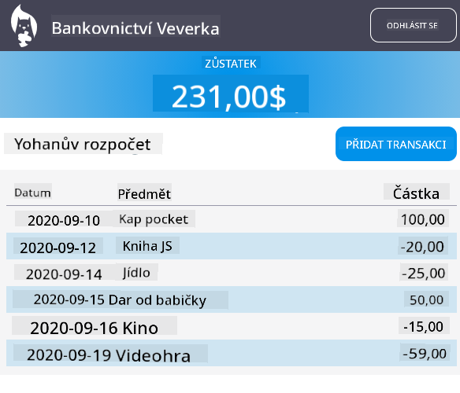

<!--
CO_OP_TRANSLATOR_METADATA:
{
  "original_hash": "f587e913e3f7c0b1c549a05dd74ee8e5",
  "translation_date": "2025-08-28T03:26:28+00:00",
  "source_file": "7-bank-project/3-data/README.md",
  "language_code": "cs"
}
-->
# Vytvoření bankovní aplikace, část 3: Metody získávání a používání dat

## Kvíz před lekcí

[Kvíz před lekcí](https://ff-quizzes.netlify.app/web/quiz/45)

### Úvod

Základem každé webové aplikace jsou *data*. Data mohou mít různé podoby, ale jejich hlavním účelem je vždy zobrazit informace uživateli. S tím, jak se webové aplikace stávají stále interaktivnějšími a složitějšími, je způsob, jakým uživatel přistupuje k informacím a jak s nimi pracuje, klíčovou součástí vývoje webu.

V této lekci se naučíme, jak asynchronně získávat data ze serveru a používat je k zobrazení informací na webové stránce bez nutnosti znovu načítat HTML.

### Předpoklady

Pro tuto lekci musíte mít vytvořenou část webové aplikace [Přihlašovací a registrační formulář](../2-forms/README.md). Také je potřeba nainstalovat [Node.js](https://nodejs.org) a [spustit serverovou API](../api/README.md) lokálně, abyste získali data o účtu.

Můžete ověřit, zda server běží správně, spuštěním tohoto příkazu v terminálu:

```sh
curl http://localhost:5000/api
# -> should return "Bank API v1.0.0" as a result
```

---

## AJAX a získávání dat

Tradiční webové stránky aktualizují zobrazovaný obsah, když uživatel vybere odkaz nebo odešle data pomocí formuláře, a to znovunačtením celé HTML stránky. Pokaždé, když je potřeba načíst nová data, webový server vrátí zcela novou HTML stránku, kterou musí prohlížeč zpracovat, což přeruší aktuální akci uživatele a omezí interakce během načítání. Tento postup se také nazývá *vícestránková aplikace* (Multi-Page Application, MPA).


S rostoucí složitostí a interaktivitou webových aplikací se objevila nová technika nazvaná [AJAX (Asynchronous JavaScript and XML)](https://en.wikipedia.org/wiki/Ajax_(programming)). Tato technika umožňuje webovým aplikacím asynchronně odesílat a získávat data ze serveru pomocí JavaScriptu, aniž by bylo nutné znovu načítat HTML stránku. Výsledkem jsou rychlejší aktualizace a plynulejší interakce uživatele. Když jsou ze serveru přijata nová data, aktuální HTML stránka může být také aktualizována pomocí JavaScriptu a API [DOM](https://developer.mozilla.org/docs/Web/API/Document_Object_Model). Postupem času se tento přístup vyvinul do toho, co dnes nazýváme [*jednostránková aplikace* (Single-Page Application, SPA)](https://en.wikipedia.org/wiki/Single-page_application).


Když byl AJAX poprvé představen, jediným dostupným API pro asynchronní získávání dat bylo [`XMLHttpRequest`](https://developer.mozilla.org/docs/Web/API/XMLHttpRequest/Using_XMLHttpRequest). Moderní prohlížeče však nyní implementují pohodlnější a výkonnější [`Fetch` API](https://developer.mozilla.org/docs/Web/API/Fetch_API), které využívá promises a je lépe přizpůsobené pro manipulaci s JSON daty.

> I když všechny moderní prohlížeče podporují `Fetch API`, pokud chcete, aby vaše webová aplikace fungovala na starších prohlížečích, je vždy dobré zkontrolovat [tabulku kompatibility na caniuse.com](https://caniuse.com/fetch).

### Úkol

V [předchozí lekci](../2-forms/README.md) jsme implementovali registrační formulář pro vytvoření účtu. Nyní přidáme kód pro přihlášení pomocí existujícího účtu a získání jeho dat. Otevřete soubor `app.js` a přidejte novou funkci `login`:

```js
async function login() {
  const loginForm = document.getElementById('loginForm')
  const user = loginForm.user.value;
}
```

Začneme tím, že získáme prvek formuláře pomocí `getElementById()` a poté získáme uživatelské jméno z inputu pomocí `loginForm.user.value`. Každý ovládací prvek formuláře lze přistupovat podle jeho názvu (nastaveného v HTML pomocí atributu `name`) jako vlastnosti formuláře.

Podobně jako jsme to udělali pro registraci, vytvoříme další funkci pro provedení požadavku na server, tentokrát pro získání dat o účtu:

```js
async function getAccount(user) {
  try {
    const response = await fetch('//localhost:5000/api/accounts/' + encodeURIComponent(user));
    return await response.json();
  } catch (error) {
    return { error: error.message || 'Unknown error' };
  }
}
```

Používáme `fetch` API k asynchronnímu požadavku na data ze serveru, ale tentokrát nepotřebujeme žádné další parametry kromě URL, protože pouze dotazujeme data. Ve výchozím nastavení `fetch` vytváří HTTP požadavek typu [`GET`](https://developer.mozilla.org/docs/Web/HTTP/Methods/GET), což je přesně to, co zde potřebujeme.

✅ `encodeURIComponent()` je funkce, která escapuje speciální znaky pro URL. Jaké problémy bychom mohli mít, pokud bychom tuto funkci nevolali a použili přímo hodnotu `user` v URL?

Nyní aktualizujeme naši funkci `login`, aby používala `getAccount`:

```js
async function login() {
  const loginForm = document.getElementById('loginForm')
  const user = loginForm.user.value;
  const data = await getAccount(user);

  if (data.error) {
    return console.log('loginError', data.error);
  }

  account = data;
  navigate('/dashboard');
}
```

Protože je `getAccount` asynchronní funkce, musíme ji spárovat s klíčovým slovem `await`, abychom počkali na výsledek serveru. Stejně jako u každého požadavku na server musíme také řešit chybové případy. Prozatím přidáme pouze zprávu do logu, která zobrazí chybu, a vrátíme se k tomu později.

Poté musíme data uložit někam, abychom je mohli později použít k zobrazení informací na dashboardu. Protože proměnná `account` zatím neexistuje, vytvoříme globální proměnnou na začátku našeho souboru:

```js
let account = null;
```

Po uložení uživatelských dat do proměnné můžeme přejít ze stránky *login* na *dashboard* pomocí funkce `navigate()`, kterou již máme.

Nakonec musíme zavolat naši funkci `login`, když je odeslán přihlašovací formulář, a to úpravou HTML:

```html
<form id="loginForm" action="javascript:login()">
```

Otestujte, zda vše funguje správně, registrací nového účtu a pokusem o přihlášení pomocí stejného účtu.

Než přejdeme k další části, můžeme také dokončit funkci `register` přidáním tohoto na konec funkce:

```js
account = result;
navigate('/dashboard');
```

✅ Věděli jste, že ve výchozím nastavení můžete volat serverové API pouze z *téže domény a portu*, na kterém si prohlížíte webovou stránku? Toto je bezpečnostní mechanismus vynucovaný prohlížeči. Ale počkat, naše webová aplikace běží na `localhost:3000`, zatímco serverová API běží na `localhost:5000`, proč to funguje? Pomocí techniky nazvané [Cross-Origin Resource Sharing (CORS)](https://developer.mozilla.org/docs/Web/HTTP/CORS) je možné provádět cross-origin HTTP požadavky, pokud server přidá do odpovědi speciální hlavičky, které umožňují výjimky pro specifické domény.

> Více o API se dozvíte v této [lekci](https://docs.microsoft.com/learn/modules/use-apis-discover-museum-art/?WT.mc_id=academic-77807-sagibbon)

## Aktualizace HTML pro zobrazení dat

Nyní, když máme uživatelská data, musíme aktualizovat existující HTML, aby je zobrazovalo. Již víme, jak získat prvek z DOM pomocí například `document.getElementById()`. Po získání základního prvku zde jsou některá API, která můžete použít k jeho úpravě nebo přidání podřízených prvků:

- Pomocí vlastnosti [`textContent`](https://developer.mozilla.org/docs/Web/API/Node/textContent) můžete změnit text prvku. Všimněte si, že změna této hodnoty odstraní všechny podřízené prvky (pokud nějaké existují) a nahradí je poskytnutým textem. Proto je to také efektivní metoda pro odstranění všech podřízených prvků daného prvku přiřazením prázdného řetězce `''`.

- Pomocí [`document.createElement()`](https://developer.mozilla.org/docs/Web/API/Document/createElement) spolu s metodou [`append()`](https://developer.mozilla.org/docs/Web/API/ParentNode/append) můžete vytvořit a připojit jeden nebo více nových podřízených prvků.

✅ Pomocí vlastnosti [`innerHTML`](https://developer.mozilla.org/docs/Web/API/Element/innerHTML) prvku je také možné změnit jeho HTML obsah, ale tato metoda by měla být vyhnuta, protože je zranitelná vůči [útokům typu cross-site scripting (XSS)](https://developer.mozilla.org/docs/Glossary/Cross-site_scripting).

### Úkol

Než přejdeme na obrazovku dashboardu, je tu ještě jedna věc, kterou bychom měli udělat na stránce *login*. Aktuálně, pokud se pokusíte přihlásit s uživatelským jménem, které neexistuje, zobrazí se zpráva v konzoli, ale pro běžného uživatele se nic nezmění a neví, co se děje.

Přidáme zástupný prvek do přihlašovacího formuláře, kde můžeme v případě potřeby zobrazit chybovou zprávu. Dobré místo by bylo těsně před přihlašovacím `<button>`:

```html
...
<div id="loginError"></div>
<button>Login</button>
...
```

Tento `<div>` prvek je prázdný, což znamená, že na obrazovce se nic nezobrazí, dokud do něj nepřidáme nějaký obsah. Také mu dáme `id`, abychom ho mohli snadno získat pomocí JavaScriptu.

Vraťte se do souboru `app.js` a vytvořte novou pomocnou funkci `updateElement`:

```js
function updateElement(id, text) {
  const element = document.getElementById(id);
  element.textContent = text;
}
```

Tato funkce je poměrně jednoduchá: na základě *id* prvku a *textu* aktualizuje textový obsah DOM prvku s odpovídajícím `id`. Použijme tuto metodu místo předchozí chybové zprávy ve funkci `login`:

```js
if (data.error) {
  return updateElement('loginError', data.error);
}
```

Nyní, pokud se pokusíte přihlásit s neplatným účtem, měli byste vidět něco takového:


Nyní máme chybový text, který se zobrazuje vizuálně, ale pokud to zkusíte s čtečkou obrazovky, všimnete si, že se nic neoznamuje. Aby byl text, který je dynamicky přidán na stránku, oznámen čtečkami obrazovky, bude potřeba použít něco, co se nazývá [Live Region](https://developer.mozilla.org/docs/Web/Accessibility/ARIA/ARIA_Live_Regions). Zde použijeme specifický typ live regionu nazývaný alert:

```html
<div id="loginError" role="alert"></div>
```

Implementujte stejnou funkci pro chyby ve funkci `register` (nezapomeňte aktualizovat HTML).

## Zobrazení informací na dashboardu

Pomocí stejných technik, které jsme právě viděli, se postaráme také o zobrazení informací o účtu na stránce dashboardu.

Takto vypadá objekt účtu přijatý ze serveru:

```json
{
  "user": "test",
  "currency": "$",
  "description": "Test account",
  "balance": 75,
  "transactions": [
    { "id": "1", "date": "2020-10-01", "object": "Pocket money", "amount": 50 },
    { "id": "2", "date": "2020-10-03", "object": "Book", "amount": -10 },
    { "id": "3", "date": "2020-10-04", "object": "Sandwich", "amount": -5 }
  ],
}
```

> Poznámka: Pro usnadnění můžete použít předem existující účet `test`, který je již naplněn daty.

### Úkol

Začněme tím, že nahradíme sekci "Balance" v HTML přidáním zástupných prvků:

```html
<section>
  Balance: <span id="balance"></span><span id="currency"></span>
</section>
```

Také přidáme novou sekci těsně pod ní pro zobrazení popisu účtu:

```html
<h2 id="description"></h2>
```

✅ Protože popis účtu funguje jako nadpis pro obsah pod ním, je označen sémanticky jako nadpis. Zjistěte více o tom, jak je [struktura nadpisů](https://www.nomensa.com/blog/2017/how-structure-headings-web-accessibility) důležitá pro přístupnost, a kriticky se podívejte na stránku, abyste zjistili, co dalšího by mohlo být nadpisem.

Dále vytvoříme novou funkci v `app.js`, která vyplní zástupné prvky:

```js
function updateDashboard() {
  if (!account) {
    return navigate('/login');
  }

  updateElement('description', account.description);
  updateElement('balance', account.balance.toFixed(2));
  updateElement('currency', account.currency);
}
```

Nejprve ověříme, že máme potřebná data o účtu, než budeme pokračovat. Poté použijeme funkci `updateElement()`, kterou jsme vytvořili dříve, k aktualizaci HTML.

> Aby byl zůstatek zobrazen hezčí, používáme metodu [`toFixed(2)`](https://developer.mozilla.org/docs/Web/JavaScript/Reference/Global_Objects/Number/toFixed), která vynutí zobrazení hodnoty se dvěma desetinnými místy.

Nyní musíme zavolat naši funkci `updateDashboard()` pokaždé, když je načtena stránka dashboardu. Pokud jste již dokončili [úkol z lekce 1](../1-template-route/assignment.md), mělo by to být jednoduché, jinak můžete použít následující implementaci.

Přidejte tento kód na konec funkce `updateRoute()`:

```js
if (typeof route.init === 'function') {
  route.init();
}
```

A aktualizujte definici tras s:

```js
const routes = {
  '/login': { templateId: 'login' },
  '/dashboard': { templateId: 'dashboard', init: updateDashboard }
};
```

S touto změnou se při každém zobrazení stránky dashboardu zavolá funkce `updateDashboard()`. Po přihlášení byste pak měli být schopni vidět zůstatek účtu, měnu a popis.

## Dynamické vytváření řádků tabulky pomocí HTML šablon

V [první lekci](../1-template-route/README.md) jsme použili HTML šablony spolu s metodou [`appendChild()`](https://developer.mozilla.org/docs/Web/API/Node/appendChild) k implementaci navigace v naší aplikaci. Šablony mohou být také menší a použity k dynamickému vyplnění opakujících se částí stránky.

Použijeme podobný přístup k zobrazení seznamu transakcí v HTML tabulce.

### Úkol

Přidejte novou šablonu do `<body>` HTML:

```html
<template id="transaction">
  <tr>
    <td></td>
    <td></td>
    <td></td>
  </tr>
</template>
```

Tato šablona představuje jeden řádek tabulky se třemi sloupci, které chceme vyplnit: *datum*, *objekt* a *částka* transakce.

Poté přidejte tuto vlastnost `id` k `<tbody>` elementu tabulky v šabloně dashboardu, aby bylo snazší ji najít pomocí JavaScriptu:

```html
<tbody id="transactions"></tbody>
```

Naše HTML je připraveno, přepněme na JavaScriptový kód a vytvořme novou funkci `createTransactionRow`:

```js
function createTransactionRow(transaction) {
  const template = document.getElementById('transaction');
  const transactionRow = template.content.cloneNode(true);
  const tr = transactionRow.querySelector('tr');
  tr.children[0].textContent = transaction.date;
  tr.children[1].textContent = transaction.object;
  tr.children[2].textContent = transaction.amount.toFixed(2);
  return transactionRow;
}
```

Tato funkce dělá přesně to, co její název napovídá: pomocí šablony, kterou jsme vytvořili dříve, vytvoří nový řádek tabulky a vyplní jeho obsah pomocí dat transakce. Použijeme ji ve funkci `updateDashboard()` k naplnění tabulky:

```js
const transactionsRows = document.createDocumentFragment();
for (const transaction of account.transactions) {
  const transactionRow = createTransactionRow(transaction);
  transactionsRows.appendChild(transactionRow);
}
updateElement('transactions', transactionsRows);
```

Zde používáme metodu [`document.createDocumentFragment()`](https://developer.mozilla.org/docs/Web/API/Document/createDocumentFragment), která vytvoří nový DOM fragment, na kterém můžeme pracovat, než jej nakonec připojíme k naší HTML tabulce.

Ještě musíme udělat jednu věc, než tento kód bude fungovat, protože naše funkce `updateElement()` aktuálně podporuje pouze textový obsah. Trochu upravíme její kód:

```js
function updateElement(id, textOrNode) {
  const element = document.getElementById(id);
  element.textContent = ''; // Removes all children
  element.append(textOrNode);
}
```

Používáme metodu [`append()`](https://developer.mozilla.org/docs/Web/API/ParentNode/append), protože umožňuje připojit buď text, nebo [DOM uzly](https://developer.mozilla.org/docs/Web/API/Node) k nadřazenému prvku, což je ideální pro všechny naše případy použití.
Pokud se pokusíte přihlásit pomocí účtu `test`, měli byste nyní na hlavním panelu vidět seznam transakcí 🎉.

---

## 🚀 Výzva

Spolupracujte na tom, aby stránka hlavního panelu vypadala jako skutečná bankovní aplikace. Pokud jste již svou aplikaci upravili, zkuste použít [media queries](https://developer.mozilla.org/docs/Web/CSS/Media_Queries) k vytvoření [responzivního designu](https://developer.mozilla.org/docs/Web/Progressive_web_apps/Responsive/responsive_design_building_blocks), který bude dobře fungovat jak na stolních počítačích, tak na mobilních zařízeních.

Zde je příklad upravené stránky hlavního panelu:



## Kvíz po přednášce

[Kvíz po přednášce](https://ff-quizzes.netlify.app/web/quiz/46)

## Úkol

[Refaktorujte a okomentujte svůj kód](assignment.md)

---

**Prohlášení**:  
Tento dokument byl přeložen pomocí služby pro automatický překlad [Co-op Translator](https://github.com/Azure/co-op-translator). I když se snažíme o přesnost, mějte prosím na paměti, že automatické překlady mohou obsahovat chyby nebo nepřesnosti. Původní dokument v jeho původním jazyce by měl být považován za autoritativní zdroj. Pro důležité informace doporučujeme profesionální lidský překlad. Neodpovídáme za žádná nedorozumění nebo nesprávné interpretace vyplývající z použití tohoto překladu.