# Vytvoření bankovní aplikace část 3: Způsoby načítání a použití dat

Přemýšlejte o počítači Enterprise ve Star Treku – když kapitán Picard žádá o stav lodi, informace se objeví okamžitě, aniž by se celé rozhraní vypnulo a znovu sestavovalo. Tento plynulý tok informací je přesně to, co zde s dynamickým načítáním dat budujeme.

Vaše bankovní aplikace je nyní jako tištěné noviny – informativní, ale statická. Proměníme ji ve něco spíše jako velitelský sál NASA, kde data proudí neustále a aktualizují se v reálném čase, aniž by přerušovala práci uživatele.

Naučíte se, jak komunikovat se servery asynchronně, jak pracovat s daty, která přicházejí v různých časech, a jak převést surové informace na něco smysluplného pro vaše uživatele. To je rozdíl mezi ukázkovým projektem a softwarem připraveným do ostrého provozu.

## ⚡ Co zvládnete za příštích 5 minut

**Rychlá cesta pro zaneprázdněné vývojáře**

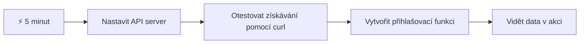
- **Minuty 1-2**: Spusťte svůj API server (`cd api && npm start`) a otestujte připojení
- **Minuta 3**: Vytvořte základní funkci `getAccount()` pomocí fetch
- **Minuta 4**: Propojte přihlašovací formulář s `action="javascript:login()"`
- **Minuta 5**: Otestujte přihlášení a sledujte, jak se data účtu objeví v konzoli

**Rychlé testovací příkazy**:
```bash
# Ověřit, že API běží
curl http://localhost:5000/api

# Test načítání dat účtu
curl http://localhost:5000/api/accounts/test
```

**Proč je to důležité**: Za 5 minut uvidíte kouzlo asynchronního načítání dat, které pohání každou moderní webovou aplikaci. Je to základ, díky kterému aplikace působí rychle a živě.

## 🗺️ Vaše cesta učením se webovým aplikacím řízeným daty

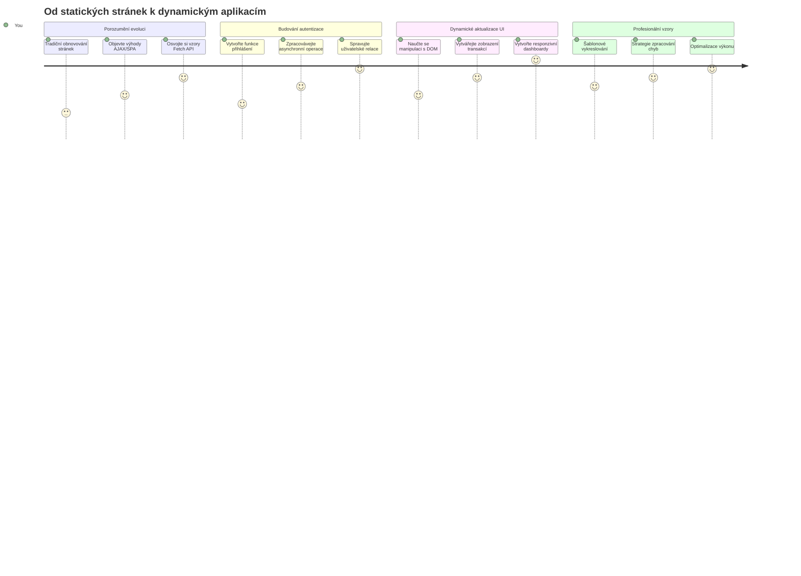
**Cíl vaší cesty**: Na konci této lekce pochopíte, jak moderní webové aplikace dynamicky načítají, zpracovávají a zobrazují data, čímž vytvářejí bezproblémové uživatelské zážitky, které očekáváme od profesionálních aplikací.

## Přednáškový kvíz

[Pre-lecture quiz](https://ff-quizzes.netlify.app/web/quiz/45)

### Požadavky

Než se pustíte do načítání dat, ujistěte se, že máte připravené tyto komponenty:

- **Předchozí lekce**: Dokončete [Formulář přihlášení a registrace](../2-forms/README.md) – na tomto základu budeme stavět
- **Lokální server**: Nainstalujte [Node.js](https://nodejs.org) a [spusťte API server](../api/README.md) pro poskytování dat o účtech
- **Připojení k API**: Otestujte spojení se serverem tímto příkazem:

```bash
curl http://localhost:5000/api
# Očekávaná odpověď: "Bank API v1.0.0"
```

Tento rychlý test zajistí správnou komunikaci všech komponent:
- Ověřuje, že Node.js běží správně na vašem systému
- Potvrzuje, že API server je aktivní a reaguje
- Validuje, že vaše aplikace může dosáhnout server (jako kontrola rádiového kontaktu před misí)

## 🧠 Přehled ekosystému správy dat

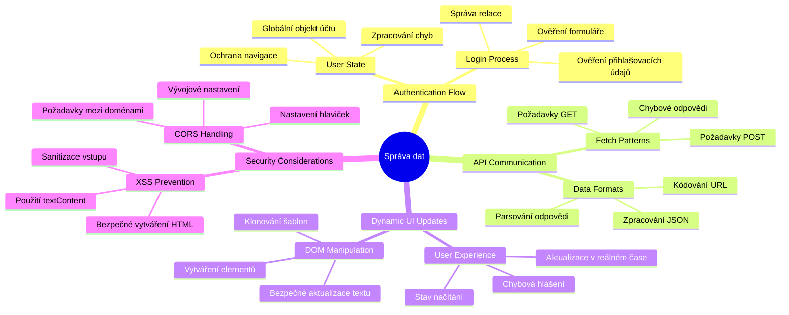
**Základní princip**: Moderní webové aplikace jsou orchestrace dat – koordinují mezi uživatelským rozhraním, serverovými API a bezpečnostními modely prohlížeče, aby vytvořily plynulé a responzivní zážitky.

---

## Pochopení načítání dat v moderních webových aplikacích

Způsob, jakým webové aplikace zacházejí s daty, se za poslední dvě desetiletí dramaticky vyvinul. Pochopení této evoluce vám pomůže ocenit, proč jsou moderní techniky jako AJAX a Fetch API tak silné a proč se staly nezbytnými nástroji webových vývojářů.

Pojďme se podívat, jak fungovaly tradiční webové stránky ve srovnání s dynamickými, responzivními aplikacemi, které dnes vytváříme.

### Tradiční vícestránkové aplikace (MPA)

V počátcích webu byl každý klik jako přepínání kanálů na staré televizi – obrazovka zhasla a pak se pomalu zobrazil nový obsah. Takto fungovaly dřívější webové aplikace, kde každá interakce znamenala znovu vytvoření celé stránky od začátku.

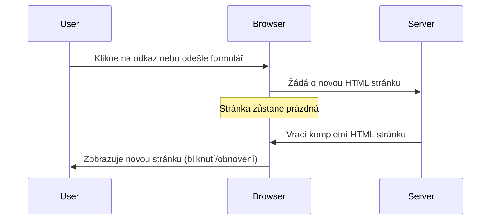
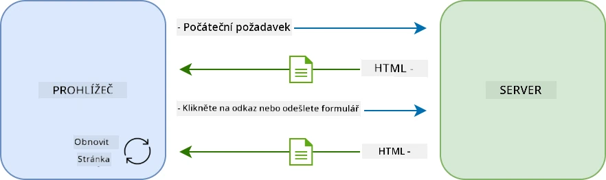

**Proč tento přístup působil neohrabaně:**
- Každé kliknutí znamenalo znovu vytvořit celou stránku od základů
- Uživatelé byli přerušováni uprostřed myšlenky nepříjemným blikáním stránky
- Internetové připojení přetěžovalo stahování stejné hlavičky a patičky znovu a znovu
- Aplikace působily spíše jako proklikávání složkami spíše než používání softwaru

### Moderní jednosrtnové aplikace (SPA)

AJAX (Asynchronous JavaScript and XML) tento paradigmat změnil zcela. Jako modulární design Mezinárodní vesmírné stanice, kde astronauti mohou měnit jednotlivé části bez budování celé struktury znovu, AJAX nám umožňuje aktualizovat konkrétní části webové stránky bez nutnosti načítat vše znovu. Přestože název zmiňuje XML, dnes převážně používáme JSON, ale základní princip zůstává: aktualizovat jen to, co se změnilo.

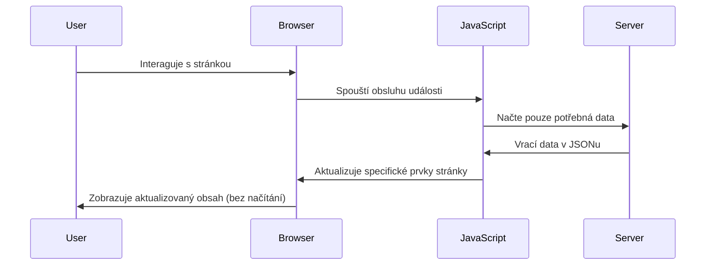
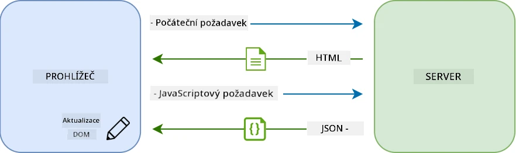

**Proč se SPA cítí mnohem lépe:**
- Aktualizují se jen skutečně změněné části (chytře, že?)
- Žádné náhlé přerušení – uživatelé zůstávají ve svém toku práce
- Méně dat přes síť znamená rychlejší načítání
- Všechno je svižné a responzivní, jako aplikace na vašem telefonu

### Vývoj k modernímu Fetch API

Moderní prohlížeče nabízejí [`Fetch` API](https://developer.mozilla.org/docs/Web/API/Fetch_API), které nahrazuje starší [`XMLHttpRequest`](https://developer.mozilla.org/docs/Web/API/XMLHttpRequest/Using_XMLHttpRequest). Jako rozdíl mezi obsluhou telegrafu a používáním e-mailu, Fetch API využívá sliby pro čistší asynchronní kód a přirozeně pracuje s JSON.

| Vlastnost | XMLHttpRequest | Fetch API |
|-----------|----------------|----------|
| **Syntaxe** | Složitá na základě callbacků | Čistá založená na Promise |
| **Zpracování JSON** | Vyžaduje manuální parsování | Vestavěná metoda `.json()` |
| **Zpracování chyb** | Omezené informace o chybách | Detailní informace o chybách |
| **Podpora moderních funkcí** | Zpětná kompatibilita | ES6+ Promise a async/await |

> 💡 **Kompatibilita prohlížečů**: Dobrá zpráva – Fetch API funguje ve všech moderních prohlížečích! Pokud vás zajímají konkrétní verze, [caniuse.com](https://caniuse.com/fetch) nabízí kompletní přehled kompatibility.
> 
**Shrnutí:**
- Funguje skvěle v Chrome, Firefox, Safari a Edge (prakticky všude, kde jsou vaši uživatelé)
- Pouze Internet Explorer potřebuje dodatečnou podporu (a upřímně, je čas IE opustit)
- Připravuje vás perfektně na elegantní vzory async/await, které budeme později používat

### Implementace přihlášení uživatele a načítání dat

Pojďme nyní implementovat přihlašovací systém, který přemění vaši bankovní aplikaci ze statického zobrazení na funkční aplikaci. Jako autentizační protokoly používané v zabezpečených vojenských zařízeních, ověříme uživatelské údaje a poskytneme přístup k jejich specifickým datům.

Budeme to tvořit postupně, začneme základní autentizací a poté přidáme schopnosti načítání dat.

#### Krok 1: Vytvoření základu funkce přihlášení

Otevřete soubor `app.js` a přidejte novou funkci `login`. Ta bude řešit proces autentizace uživatele:

```javascript
async function login() {
  const loginForm = document.getElementById('loginForm');
  const user = loginForm.user.value;
}
```

**Podrobnosti:**
- Klíčové slovo `async` říká JavaScriptu „hele, tahle funkce možná bude muset počkat“
- Načítáme formulář ze stránky (nic složitého, prostě ho najdeme podle ID)
- Pak vytáhneme, co uživatel zadal jako své uživatelské jméno
- Tip: k hodnotám formuláře se dá přistupovat podle atributu `name` – není třeba dalších getElementById!

> 💡 **Přístup k formuláři**: Každý ovládací prvek formuláře lze získat podle jeho jména (nastaveno v HTML pomocí atributu `name`) jako vlastnost formulářového elementu. Je to čistý a přehledný způsob, jak získat data z formuláře.

#### Krok 2: Vytvoření funkce pro načítání dat účtu

Dále vytvoříme samostatnou funkci pro získání dat o účtu ze serveru. Následuje stejný vzor jako u registrační funkce, ale s důrazem na načítání dat:

```javascript
async function getAccount(user) {
  try {
    const response = await fetch('//localhost:5000/api/accounts/' + encodeURIComponent(user));
    return await response.json();
  } catch (error) {
    return { error: error.message || 'Unknown error' };
  }
}
```

**Co tento kód dělá:**
- **Používá** moderní API `fetch` pro asynchronní požadavky
- **Sestavuje** GET požadavek s parametrem uživatelského jména v URL
- **Používá** `encodeURIComponent()` k bezpečnému zpracování speciálních znaků v URL
- **Převede** odpověď do JSON formátu pro snadnou práci s daty
- **Řeší** chyby elegantně vrácením chybového objektu místo pádu aplikace

> ⚠️ **Bezpečnostní poznámka**: Funkce `encodeURIComponent()` zajišťuje, že speciální znaky v URL (např. "#", "&") nebudou nesprávně zpracovány. Podobně jako kódovací systémy v námořní komunikaci, které zaručují, že zpráva dorazí přesně tak, jak má.
> 
**Proč je to důležité:**
- Zabraňuje poškození URL speciálními znaky
- Chrání před útoky na manipulaci s URL
- Zajišťuje, že server přebírá přesně požadovaná data
- Dodržuje bezpečné programovací postupy

#### Pochopení HTTP GET požadavků

Možná vás překvapí, že když použijete `fetch` bez dalších nastavení, automaticky se provede [`GET`](https://developer.mozilla.org/docs/Web/HTTP/Methods/GET) požadavek. To je ideální pro situace, kdy žádáme server třeba o zobrazení uživatelských dat.

GET požadavky jsou jako zdvořilé půjčení si knihy z knihovny – chcete vidět něco, co už existuje. POST požadavky (které jsme používali při registraci) jsou spíše jako přidání nové knihy do sbírky.

| GET požadavek | POST požadavek |
|--------------|---------------|
| **Účel** | Získat existující data | Odeslat nová data na server |
| **Parametry** | V URL cestě/parametrech | V těle požadavku |
| **Cacheování** | Lze cachovat prohlížečem | Obvykle se necachuje |
| **Bezpečnost** | Viditelné v URL/logu | Skryté v těle požadavku |

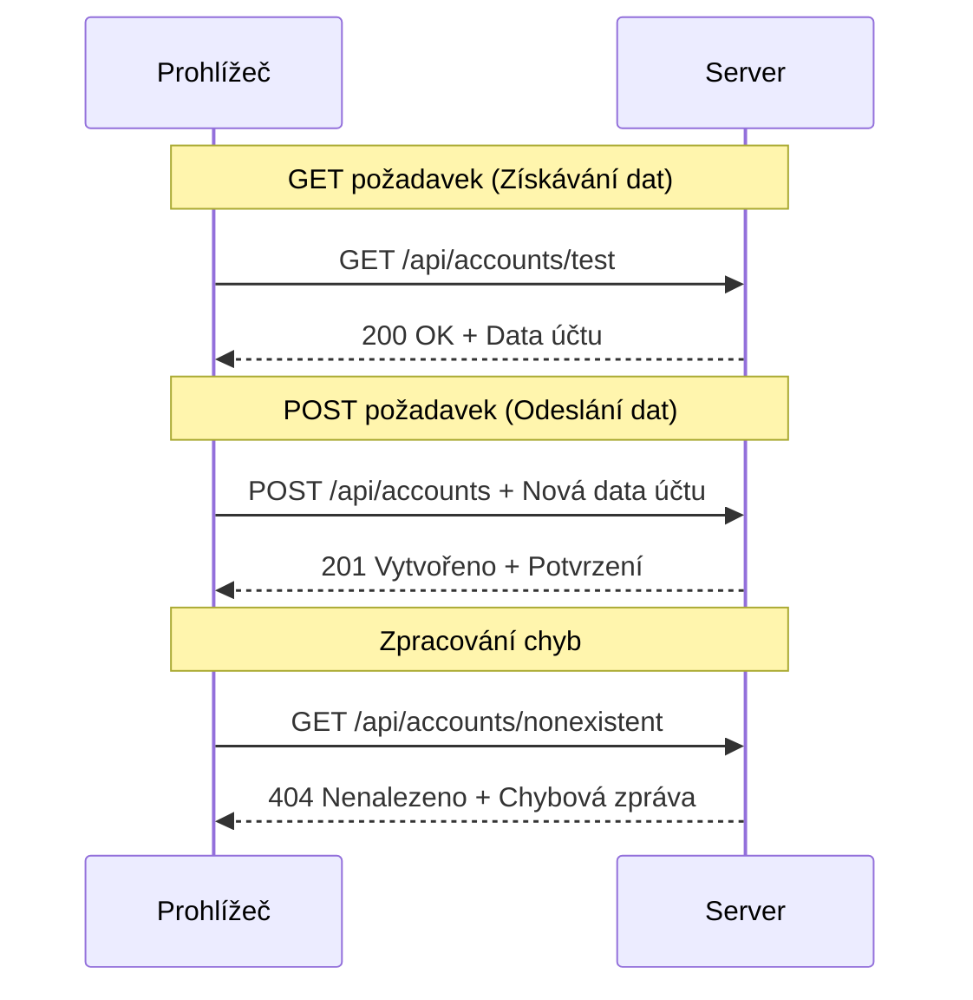
#### Krok 3: Sjednocení všeho dohromady

Nyní přichází ten uspokojivý okamžik – propojíme funkci pro načtení bankovního účtu s procesem přihlášení. Tady všechno zapadá na své místo:

```javascript
async function login() {
  const loginForm = document.getElementById('loginForm');
  const user = loginForm.user.value;
  const data = await getAccount(user);

  if (data.error) {
    return console.log('loginError', data.error);
  }

  account = data;
  navigate('/dashboard');
}
```

Tato funkce postupuje jasně:
- Vytáhne uživatelské jméno z formuláře
- Požádá server o data účtu tohoto uživatele
- Zpracuje případné chyby v průběhu
- Uloží data účtu a přejde na dashboard při úspěchu

> 🎯 **Vzorec Async/Await**: Protože `getAccount` je asynchronní funkce, používáme klíčové slovo `await`, které zastaví provádění, dokud server neodpoví. Tím zabráníme pokračování s nedefinovanými daty.

#### Krok 4: Vytvoření místa pro data

Aplikace potřebuje místo, kde bude uchovávat informace o účtu po načtení. Jako krátkodobou paměť – místo, kde bude mít aktuální uživatel svá data okamžitě po ruce. Přidejte tuto řádku na začátek souboru `app.js`:

```javascript
// Toto obsahuje data účtu aktuálního uživatele
let account = null;
```

**Proč to potřebujeme:**
- Data o účtu jsou přístupná odkudkoliv v aplikaci
- Začínáme s `null`, což znamená „zatím nikdo není přihlášen“
- Aktualizuje se po úspěšném přihlášení nebo registraci
- Funguje jako jediný zdroj pravdy – žádné nejasnosti, kdo je přihlášen

#### Krok 5: Propojte formulář

Pojďme nyní připojit vaši novou funkci přihlášení k HTML formuláři. Aktualizujte tag formuláře takto:

```html
<form id="loginForm" action="javascript:login()">
  <!-- Your existing form inputs -->
</form>
```

**Co tahle změna dělá:**
- Zabraňuje formuláři, aby provedl výchozí „přenačtení celé stránky“
- Volá vaši vlastní JavaScript funkci místo toho
- Udržuje vše plynulé a ve stylu single-page aplikace
- Dává vám plnou kontrolu nad tím, co se stane po kliknutí na „Login“

#### Krok 6: Vylepšení registrační funkce

Pro konzistenci upravte i funkci `register`, aby také ukládala data účtu a přecházela na dashboard:

```javascript
// Přidejte tyto řádky na konec vaší funkce register
account = result;
navigate('/dashboard');
```

**Toto vylepšení přináší:**
- **Plynulý** přechod z registrace na dashboard
- **Konzistentní** uživatelský zážitek mezi přihlášením a registrací
- **Okamžitý** přístup k datům účtu po úspěšné registraci

#### Testování implementace

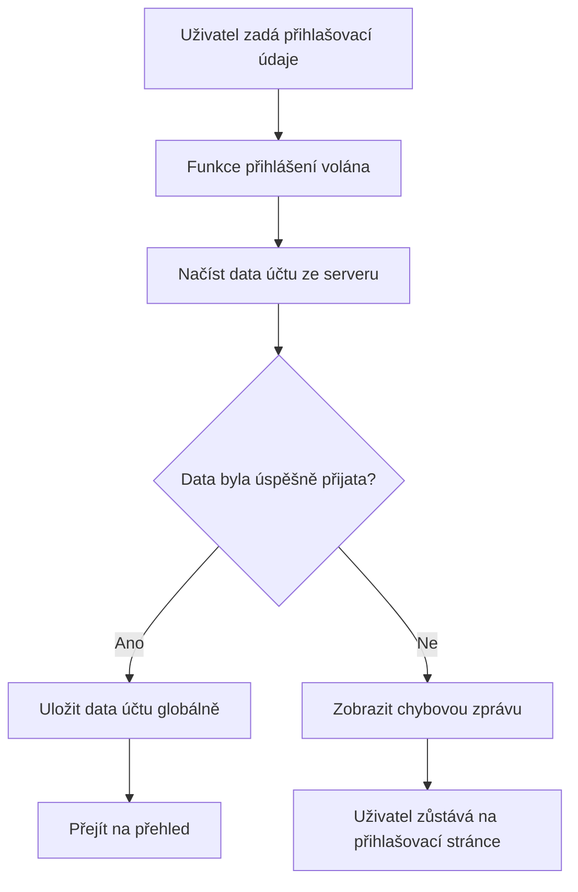
**Čas to otestovat:**
1. Vytvořte nový účet a ověřte, že vše funguje
2. Přihlašte se pomocí těchto údajů
3. Pohlédněte do konzole prohlížeče (F12), pokud něco nefunguje podle očekávání
4. Ověřte, že po úspěšném přihlášení jste přesměrováni na dashboard

Pokud něco nefunguje, nezoufejte! Většina problémů je jednoduchý překlep nebo zapomenuté spuštění API serveru.

#### Krátce o magii Cross-Origin

Možná si říkáte: „Jak to moje webová aplikace komunikuje s API serverem, když běží na různých portech?“ Skvělá otázka! To je téma, na které každý webový vývojář dříve či později narazí.

> 🔒 **Cross-Origin bezpečnost**: Prohlížeče uplatňují politiku „stejného původu“ (same-origin policy), aby zabránily neautorizované komunikaci mezi různými doménami. Podobně jako kontrolní systém v Pentagónu, ověřují, že komunikace je povolená, než umožní přenos dat.
> 
**V našem prostředí:**
- Webová aplikace běží na `localhost:3000` (vývojový server)
- API server běží na `localhost:5000` (backend server)
- API server obsahuje [CORS hlavičky](https://developer.mozilla.org/docs/Web/HTTP/CORS), které explicitně povolují komunikaci z vaší webové aplikace

Toto nastavení odráží reálný vývoj, kdy frontend a backend aplikace obvykle běží na samostatných serverech.

> 📚 **Více informací**: Ponořte se hlouběji do API a načítání dat s tímto komplexním [Microsoft Learn modulem o API](https://docs.microsoft.com/learn/modules/use-apis-discover-museum-art/?WT.mc_id=academic-77807-sagibbon).

## Oživení dat v HTML

Nyní zpřístupníme načtená data uživatelům pomocí manipulace s DOM. Jako proces vyvolávání fotografií v temné komoře, bereme neviditelná data a zobrazujeme je tak, aby je uživatelé mohli vidět a s nimi interagovat.
Manipulace s DOM je technika, která proměňuje statické webové stránky na dynamické aplikace aktualizující svůj obsah na základě interakcí uživatelů a odpovědí serveru.

### Výběr správného nástroje pro práci

Při aktualizaci HTML pomocí JavaScriptu máte několik možností. Představte si je jako různé nástroje v krabici s nářadím – každý je ideální pro určitý úkol:

| Metoda | Na co je skvělá | Kdy ji použít | Úroveň bezpečnosti |
|--------|-----------------|---------------|-------------------|
| `textContent` | Bezpečné zobrazování uživatelských dat | Kdykoliv zobrazujete text | ✅ Pevná jistota |
| `createElement()` + `append()` | Vytváření komplexních rozvržení | Vytváření nových sekcí/seznamů | ✅ Neprolomitelná |
| `innerHTML` | Nastavení HTML obsahu | ⚠️ Raději se této vyhněte | ❌ Riskantní záležitost |

#### Bezpečný způsob zobrazení textu: textContent

Vlastnost [`textContent`](https://developer.mozilla.org/docs/Web/API/Node/textContent) je váš nejlepší přítel při zobrazování uživatelských dat. Je jako chlapík u vchodu na stránku – nic škodlivého nepustí dovnitř:

```javascript
// Bezpečný a spolehlivý způsob aktualizace textu
const balanceElement = document.getElementById('balance');
balanceElement.textContent = account.balance;
```

**Výhody textContent:**
- Považuje vše za prostý text (zabraňuje spuštění skriptů)
- Automaticky vyčistí existující obsah
- Efektivní pro jednoduché aktualizace textu
- Poskytuje vestavěnou ochranu proti škodlivému obsahu

#### Vytváření dynamických HTML prvků

Pro složitější obsah kombinujte [`document.createElement()`](https://developer.mozilla.org/docs/Web/API/Document/createElement) s metodou [`append()`](https://developer.mozilla.org/docs/Web/API/ParentNode/append):

```javascript
// Bezpečný způsob, jak vytvářet nové prvky
const transactionItem = document.createElement('div');
transactionItem.className = 'transaction-item';
transactionItem.textContent = `${transaction.date}: ${transaction.description}`;
container.append(transactionItem);
```

**Pochopení tohoto přístupu:**
- **Programově** vytváří nové DOM prvky
- **Udržuje** plnou kontrolu nad atributy a obsahem prvků
- **Umožňuje** složité, vnořené struktury prvků
- **Zachovává** bezpečnost oddělením struktury od obsahu

> ⚠️ **Bezpečnostní upozornění**: I když se [`innerHTML`](https://developer.mozilla.org/docs/Web/API/Element/innerHTML) objevuje v mnoha návodech, může spouštět vložené skripty. Podobně jako bezpečnostní protokoly na CERNu zabraňují neautorizovanému spuštění kódu, použití `textContent` a `createElement` nabízí bezpečnější alternativy.
> 
**Rizika innerHTML:**
- Spouští jakékoliv `<script>` tagy v uživatelských datech
- Je náchylné na útoky zaváděním škodlivého kódu
- Vytváří potenciální bezpečnostní zranitelnosti
- Používané bezpečnější alternativy poskytují stejnou funkčnost

### Jak chybové stavy zpřístupnit uživatelům

Aktuálně se chyby přihlášení zobrazují pouze v konzoli prohlížeče, která je pro uživatele neviditelná. Stejně jako je rozdíl mezi vnitřní diagnostikou pilota a informačním systémem pro cestující, musíme důležité informace komunikovat správným kanálem.

Zobrazení viditelných chybových zpráv poskytuje uživatelům okamžitou zpětnou vazbu o tom, co se pokazilo a jak dále postupovat.

#### Krok 1: Přidejte místo pro chybové zprávy

Nejprve dejte chybovým zprávám místo ve vašem HTML. Přidejte tento prvek těsně před tlačítko pro přihlášení, aby jej uživatelé přirozeně viděli:

```html
<!-- This is where error messages will appear -->
<div id="loginError" role="alert"></div>
<button>Login</button>
```

**Co se zde děje:**
- Vytváříme prázdný kontejner, který zůstává neviditelný, dokud není potřeba
- Je umístěn tam, kde se uživatelé přirozeně podívají po kliknutí na "Přihlásit se"
- Atribut `role="alert"` je skvělý pro čtečky obrazovky – říká asistivní technologii „hele, tohle je důležité!“
- Jedinečné `id` usnadňuje JavaScriptu cíl

#### Krok 2: Vytvořte pomocnou funkci

Vytvořme malou užitečnou funkci, která může aktualizovat text libovolného prvku. To je jedna z těch „napiš jednou, použi všude“ funkcí, která vám ušetří čas:

```javascript
function updateElement(id, text) {
  const element = document.getElementById(id);
  element.textContent = text;
}
```

**Výhody funkce:**
- Jednoduché rozhraní vyžadující pouze ID prvku a textový obsah
- Bezpečně vyhledává a aktualizuje DOM prvky
- Znovupoužitelný vzor snižující duplicitu kódu
- Udržuje konzistentní chování aktualizací v celé aplikaci

#### Krok 3: Zobrazujte chyby tam, kde je uživatelé uvidí

Teď nahraďte tu skrytou zprávu v konzoli něčím, co uživatelé opravdu vidí. Aktualizujte svou přihlašovací funkci:

```javascript
// Místo pouhého zapisování do konzole ukažte uživateli, co je špatně
if (data.error) {
  return updateElement('loginError', data.error);
}
```

**Tato malá změna dělá velký rozdíl:**
- Chybové zprávy se zobrazují přesně tam, kde se uživatelé dívají
- Už žádné záhadné tiché selhání
- Uživatelé dostávají okamžitou a konkrétní zpětnou vazbu
- Vaše aplikace působí profesionálně a promyšleně

Po vyzkoušení s neplatným účtem se na stránce zobrazí užitečná chybová zpráva!


#### Krok 4: Zahrnutí přístupnosti

To `role="alert"`, které jsme přidali, není jen dekorace! Tento malý atribut vytváří tzv. [Live Region](https://developer.mozilla.org/docs/Web/Accessibility/ARIA/ARIA_Live_Regions), která okamžitě oznamuje změny čtečkám obrazovky:

```html
<div id="loginError" role="alert"></div>
```

**Proč je to důležité:**
- Uživatelé s čtečkami slyší chybovou zprávu hned, jak se objeví
- Všichni získávají stejnou důležitou informaci, bez ohledu na způsob navigace
- Jednoduchý způsob, jak zajistit přístupnost vaší aplikace více lidem
- Ukazuje, že vám záleží na vytváření inkluzivních zážitků

Takové malé detaily dělí dobré vývojáře od skvělých!

### 🎯 Pedagogická kontrola: Vzory autentizace

**Zastavte se a zamyslete se**: Právě jste implementovali kompletní autentizační tok. To je základní vzor ve webovém vývoji.

**Krátké sebehodnocení**:
- Dokážete vysvětlit, proč používáme async/await pro API volání?
- Co by se stalo, kdybychom zapomněli funkci `encodeURIComponent()`?
- Jak naše zpracování chyb zlepšuje uživatelský zážitek?

**Spojení s reálným světem**: Vzory, které jste se zde naučili (asynchronní načítání dat, zpracování chyb, uživatelská zpětná vazba), se používají v každé velké webové aplikaci od sociálních sítí po e-shopy. Budujete produkční dovednosti!

**Výzva**: Jak byste mohli upravit tento autentizační systém, aby zvládal více uživatelských rolí (zákazník, admin, pokladní)? Přemýšlejte o datové struktuře a změnách uživatelského rozhraní.

#### Krok 5: Použijte stejný vzor pro registraci

Pro konzistenci implementujte totožné zpracování chyb i ve formuláři registrace:

1. **Přidejte** prvek pro zobrazování chyb do HTML registrace:
```html
<div id="registerError" role="alert"></div>
```

2. **Aktualizujte** funkci pro registraci, aby používala stejný vzor zobrazení chyb:
```javascript
if (data.error) {
  return updateElement('registerError', data.error);
}
```

**Výhody jednotného zpracování chyb:**
- **Zajišťuje** jednotný uživatelský zážitek na všech formulářích
- **Snižuje** kognitivní zátěž díky známým vzorům
- **Zjednodušuje** údržbu díky znovupoužitelnosti kódu
- **Zaručuje** splnění přístupnostních standardů napříč aplikací

## Vytváření dynamické přehledové obrazovky (dashboard)

Nyní proměníme váš statický dashboard na dynamické rozhraní zobrazující skutečná data účtu. Stejně jako rozdíl mezi vytištěným letovým řádem a aktuálními odletovými tabulemi na letišti přecházíme od statických informací k zobrazení v reálném čase.

Pomocí technik manipulace s DOM, které jste se naučili, vytvoříme dashboard, který se automaticky aktualizuje s aktuálními informacemi o účtu.

### Poznejte svá data

Než začneme stavět, mrkněme, jaký druh dat vám server vrací. Když se někdo úspěšně přihlásí, dostanete k dispozici tento poklad informací:

```json
{
  "user": "test",
  "currency": "$",
  "description": "Test account",
  "balance": 75,
  "transactions": [
    { "id": "1", "date": "2020-10-01", "object": "Pocket money", "amount": 50 },
    { "id": "2", "date": "2020-10-03", "object": "Book", "amount": -10 },
    { "id": "3", "date": "2020-10-04", "object": "Sandwich", "amount": -5 }
  ]
}
```

**Tato datová struktura poskytuje:**
- **`user`**: Perfektní pro personalizaci zážitku („Vítejte zpět, Sarah!“)
- **`currency`**: Zajišťuje správné zobrazování měnových částek
- **`description`**: Přátelský název účtu
- **`balance`**: Důležitý aktuální zůstatek
- **`transactions`**: Kompletní historie transakcí se všemi podrobnostmi

Všechno, co potřebujete pro vytvoření profesionálně vypadajícího bankovního dashboardu!

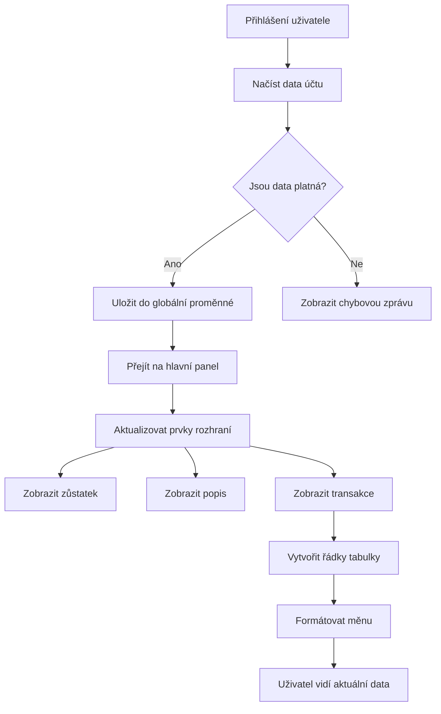
> 💡 **Profesionální tip**: Chcete vidět svůj dashboard hned v akci? Použijte při přihlášení uživatelské jméno `test` – je předem naplněné ukázkovými daty, takže můžete vidět vše fungovat, aniž byste museli nejprve vytvářet transakce.
> 
**Proč je testovací účet užitečný:**
- Už obsahuje realistická ukázková data
- Ideální pro zobrazení transakcí
- Skvělé pro testování funkcí dashboardu
- Šetří čas, nemusíte manuálně vytvářet testovací data

### Vytváření prvků pro zobrazení dashboardu

Postupně si postavíme rozhraní vašeho dashboardu, začneme informacemi o účtu a pak přejdeme k složitějším prvkům, jako jsou seznamy transakcí.

#### Krok 1: Aktualizujte strukturu HTML

Nejprve nahraďte statickou sekci „Zůstatek“ dynamickými zástupnými elementy, které může JavaScript doplnit:

```html
<section>
  Balance: <span id="balance"></span><span id="currency"></span>
</section>
```

Následně přidejte sekci s popisem účtu. Jelikož funguje jako nadpis obsahu dashboardu, použijte sémantické HTML:

```html
<h2 id="description"></h2>
```

**Pochopení HTML struktury:**
- **Používá** samostatné `<span>` prvky pro zůstatek a měnu pro individuální ovládání
- **Aplikuje** unikátní ID na každý prvek pro cílení JavaScriptem
- **Dodržuje** sémantiku HTML použitím `<h2>` pro popis účtu
- **Vytváří** logickou hierarchii pro čtečky obrazovky a SEO

> ✅ **Přístupnostní poznatek**: Popis účtu funguje jako nadpis obsahu dashboardu, proto je označen jako záhlaví. Více o tom, jak [struktura nadpisů](https://www.nomensa.com/blog/2017/how-structure-headings-web-accessibility) ovlivňuje přístupnost. Dokážete identifikovat další prvky na své stránce, které by mohly mít prospěch z použití nadpisů?

#### Krok 2: Vytvořte funkci aktualizace dashboardu

Nyní vytvořte funkci, která naplní váš dashboard skutečnými daty o účtu:

```javascript
function updateDashboard() {
  if (!account) {
    return navigate('/login');
  }

  updateElement('description', account.description);
  updateElement('balance', account.balance.toFixed(2));
  updateElement('currency', account.currency);
}
```

**Krok za krokem, co tato funkce dělá:**
- **Ověří**, že data o účtu existují, než pokračuje
- **Přesměruje** nepřihlášené uživatele zpět na přihlašovací stránku
- **Aktualizuje** popis účtu pomocí znovupoužitelné funkce `updateElement`
- **Naformátuje** zůstatek tak, aby zobrazoval vždy dvě desetinná místa
- **Zobrazí** odpovídající symbol měny

> 💰 **Formátování peněz**: Metoda [`toFixed(2)`](https://developer.mozilla.org/docs/Web/JavaScript/Reference/Global_Objects/Number/toFixed) je záchranou! Zajišťuje, že zůstatek vždy vypadá jako skutečné peníze – „75.00“ místo prostého „75“. Vaši uživatelé ocení známé formátování měny.

#### Krok 3: Zajistěte, že se dashboard aktualizuje

Aby se váš dashboard obnovoval s aktuálními daty při každé návštěvě, musíme se napojit na váš navigační systém. Pokud jste dokončili [úkol z lekce 1](../1-template-route/assignment.md), bude vám to povědomé. Pokud ne, tady je, co potřebujete:

Přidejte toto na konec své funkce `updateRoute()`:

```javascript
if (typeof route.init === 'function') {
  route.init();
}
```

Poté aktualizujte své routy, aby zahrnovaly inicializaci dashboardu:

```javascript
const routes = {
  '/login': { templateId: 'login' },
  '/dashboard': { templateId: 'dashboard', init: updateDashboard }
};
```

**Co tato chytrá konfigurace dělá:**
- Kontroluje, jestli má routa speciální inicializační kód
- Automaticky tento kód spustí při načtení routy
- Zajistí, že váš dashboard vždy zobrazuje čerstvá a aktuální data
- Udržuje logiku směrování čistou a organizovanou

#### Testování vašeho dashboardu

Po implementaci těchto změn otestujte svůj dashboard:

1. **Přihlaste se** testovacím účtem
2. **Ověřte**, že jste přesměrováni na dashboard
3. **Zkontrolujte**, zda se správně zobrazují popis účtu, zůstatek a měna
4. **Vyzkoušejte odhlášení a opětovné přihlášení**, aby se ujistili, že se data správně aktualizují

Váš dashboard nyní bude zobrazovat dynamické informace o účtu, které se aktualizují podle dat přihlášeného uživatele!

## Vytváření chytrých seznamů transakcí pomocí šablon

Místo ručního vytváření HTML pro každou transakci použijeme šablony pro automatické generování konzistentního formátování. Jako standardizované komponenty ve výrobě kosmických lodí, šablony zajišťují, že každý řádek transakce má stejnou strukturu a vzhled.

Tato technika efektivně škáluje od několika transakcí až po tisíce, zachovávajíc konzistentní výkon a prezentaci.

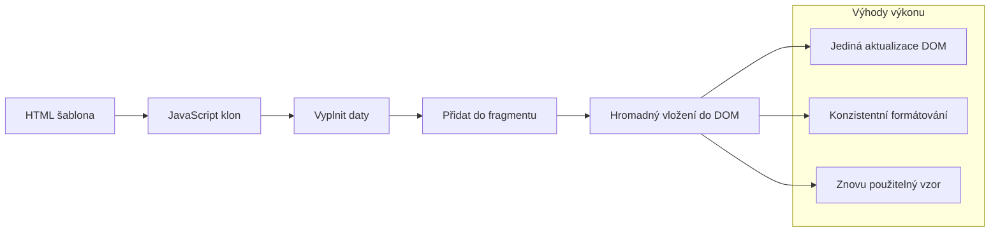
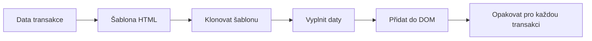
### Krok 1: Vytvořte šablonu transakce

Nejprve přidejte opakovatelnou šablonu pro řádky tabulky transakcí do `<body>` vašeho HTML:

```html
<template id="transaction">
  <tr>
    <td></td>
    <td></td>
    <td></td>
  </tr>
</template>
```

**Pochopení HTML šablon:**
- **Definuje** strukturu pro jeden řádek tabulky
- **Zůstává** neviditelná, dokud není zkopírována a doplněna JavaScriptem
- **Obsahuje** tři buňky pro datum, popis a částku
- **Poskytuje** znovupoužitelný vzor pro konzistentní formátování

### Krok 2: Připravte tabulku na dynamický obsah

Nyní přidejte `id` do těla tabulky, aby ji JavaScript mohl snadno cílit:

```html
<tbody id="transactions"></tbody>
```

**Co to umožňuje:**
- **Vytváří** jasný cíl pro vkládání řádků transakcí
- **Odděluje** strukturu tabulky od dynamického obsahu
- **Umožňuje** snadné vymazání a znovu naplnění dat transakcí

### Krok 3: Vytvořte tovární funkci pro řádek transakce

Vytvořte nyní funkci, která přemění data o transakci na HTML prvky:

```javascript
function createTransactionRow(transaction) {
  const template = document.getElementById('transaction');
  const transactionRow = template.content.cloneNode(true);
  const tr = transactionRow.querySelector('tr');
  tr.children[0].textContent = transaction.date;
  tr.children[1].textContent = transaction.object;
  tr.children[2].textContent = transaction.amount.toFixed(2);
  return transactionRow;
}
```

**Rozbor této tovární funkce:**
- **Získává** šablonu podle jejího ID
- **Kopíruje** obsah šablony pro bezpečné zpracování
- **Vybere** řádek tabulky uvnitř zkopírovaného obsahu
- **Naplní** každou buňku daty o transakci
- **Naformátuje** částku tak, aby zobrazovala správné desetinné místo
- **Vrací** hotový řádek připravený k vložení

### Krok 4: Efektivně generujte více řádků transakcí

Přidejte tento kód do své funkce `updateDashboard()`, aby se zobrazily všechny transakce:

```javascript
const transactionsRows = document.createDocumentFragment();
for (const transaction of account.transactions) {
  const transactionRow = createTransactionRow(transaction);
  transactionsRows.appendChild(transactionRow);
}
updateElement('transactions', transactionsRows);
```

**Jak tento efektivní přístup funguje:**
- **Vytváří** dokumentový fragment pro hromadné operace s DOM
- **Prochází** všechny transakce v datech účtu
- **Generuje** řádek pro každou transakci pomocí tovární funkce
- **Sbírá** všechny řádky do fragmentu před vložením do DOM
- **Provede** jedinou aktualizaci DOM místo více jednotlivých vkládání
> ⚡ **Optimalizace výkonu**: [`document.createDocumentFragment()`](https://developer.mozilla.org/docs/Web/API/Document/createDocumentFragment) funguje jako montážní proces ve společnosti Boeing – komponenty jsou připraveny mimo hlavní linku a poté instalovány jako kompletní celek. Tento přístup k dávkování minimalizuje přepočty rozložení DOM tím, že provádí jediný vklad místo několika jednotlivých operací.

### Krok 5: Vylepšení funkce aktualizace pro smíšený obsah

Vaše funkce `updateElement()` zatím zpracovává pouze textový obsah. Aktualizujte ji, aby fungovala jak s textem, tak s DOM uzly:

```javascript
function updateElement(id, textOrNode) {
  const element = document.getElementById(id);
  element.textContent = ''; // Odstraní všechny potomky
  element.append(textOrNode);
}
```

**Hlavní vylepšení v této aktualizaci:**
- **Vymaže** existující obsah před přidáním nového
- **Přijímá** jako parametry buď textové řetězce, nebo DOM uzly
- **Používá** metodu [`append()`](https://developer.mozilla.org/docs/Web/API/ParentNode/append) pro vyšší flexibilitu
- **Zachovává** zpětnou kompatibilitu se stávajícím použitím založeným na textu

### Vyzkoušejte si svůj dashboard v praxi

Přišel čas na okamžik pravdy! Podívejme se, jak funguje váš dynamický dashboard:

1. Přihlaste se pomocí účtu `test` (má připravená ukázková data)
2. Přejděte na svůj dashboard
3. Zkontrolujte, že se řádky transakcí zobrazují s odpovídajícím formátováním
4. Ujistěte se, že data, popisy a částky vypadají správně

Pokud vše funguje, měli byste na svém dashboardu vidět plně funkční seznam transakcí! 🎉

**Co jste dokázali:**
- Vytvořili jste dashboard škálující s libovolným množstvím dat
- Navrhli jste znovupoužitelné šablony pro konzistentní formátování
- Implementovali jste efektivní techniky manipulace s DOM
- Vyvinuli jste funkcionalitu srovnatelnou s produkčními bankovními aplikacemi

Úspěšně jste přeměnili statickou webovou stránku na dynamickou webovou aplikaci.

### 🎯 Pedagogická kontrola: Generování dynamického obsahu

**Porozumění architektuře**: Implementovali jste sofistikovaný pipeline pro převod dat do uživatelského rozhraní, který odráží vzory používané ve frameworcích jako React, Vue a Angular.

**Ovládnuté klíčové koncepty**:
- **Renderování na základě šablon**: Vytváření znovupoužitelných UI komponent
- **Dokumentové fragmenty**: Optimalizace výkonu DOM
- **Bezpečná manipulace s DOM**: Prevence bezpečnostních rizik
- **Transformace dat**: Převod dat ze serveru na uživatelské rozhraní

**Průmyslové propojení**: Tyto techniky tvoří základ moderních frontend frameworků. Reactův virtuální DOM, Vueův systém šablon a Angularova komponentová architektura staví na těchto jádrových konceptech.

**Reflexní otázka**: Jak byste rozšířili tento systém tak, aby zvládal aktualizace v reálném čase (například automatický příchod nových transakcí)? Zvažte použití WebSockets nebo Server-Sent Events.

---

## 📈 Váš časový plán zvládnutí správy dat

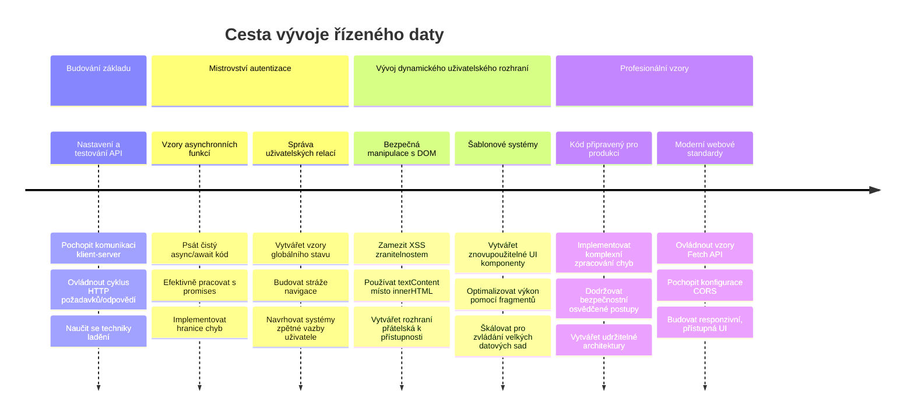
**🎓 Milník ukončení studia**: Úspěšně jste vytvořili plnohodnotnou webovou aplikaci založenou na datech pomocí moderních vzorů JavaScriptu. Tyto dovednosti lze přímo využít při práci s frameworky jako React, Vue nebo Angular.

**🔄 Další úroveň schopností**:
- Připravenost objevovat frontendové frameworky postavené na těchto konceptech
- Schopnost implementovat funkce v reálném čase pomocí WebSockets
- Vybavenost pro tvorbu progresivních webových aplikací s offline funkcionalitou
- Základ pro učení pokročilých vzorů správy stavu

## Výzva GitHub Copilot Agenta 🚀

Použijte režim Agenta k dokončení následující výzvy:

**Popis:** Vylepšete bankovní aplikaci implementací funkce vyhledávání a filtrování transakcí, která umožní uživatelům najít konkrétní transakce podle rozsahu data, částky nebo klíčových slov v popisu.

**Podnět:** Vytvořte funkci vyhledávání pro bankovní aplikaci, která obsahuje: 1) Vyhledávací formulář s poli pro zadání rozsahu dat (od/do), minimální/maximální částku a klíčová slova v popisu transakce, 2) funkci `filterTransactions()`, která filtruje pole account.transactions podle kritérií vyhledávání, 3) aktualizaci funkce `updateDashboard()`, která zobrazuje filtrované výsledky, a 4) přidání tlačítka „Vymazat filtry“ pro nastavení výchozího zobrazení. Použijte moderní metody polí JavaScriptu jako `filter()` a ošetřete okrajové případy prázdných vyhledávacích kritérií.

Více o [režimu agenta](https://code.visualstudio.com/blogs/2025/02/24/introducing-copilot-agent-mode) se dozvíte zde.

## 🚀 Výzva

Jste připraveni posunout svou bankovní aplikaci na vyšší úroveň? Udělejme ji takovou, že ji skutečně budete chtít používat. Zde je několik nápadů, které rozproudí vaši kreativitu:

**Udělejte ji krásnou**: Přidejte CSS stylování, které promění váš funkční dashboard ve vizuálně atraktivní. Myslete na čisté linie, dobré rozestupy a třeba i jemné animace.

**Udělejte ji responzivní**: Vyzkoušejte [mediální dotazy](https://developer.mozilla.org/docs/Web/CSS/Media_Queries) pro vytvoření [responzivního designu](https://developer.mozilla.org/docs/Web/Progressive_web_apps/Responsive/responsive_design_building_blocks), který skvěle funguje na telefonech, tabletech i desktopu. Vaši uživatelé vám poděkují!

**Přidejte šmrnc**: Zvažte barevné označení transakcí (zelená pro příjmy, červená pro výdaje), přidání ikon nebo vytvoření efektních hover efektů, které zvýrazní interaktivitu rozhraní.

Takto by mohl vypadat vyleštěný dashboard:

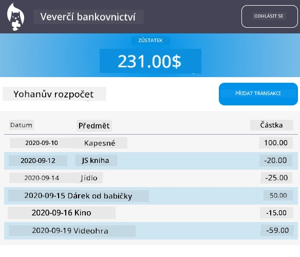

Nemusíte to přesně kopírovat – použijte to jako inspiraci a udělejte si to po svém!

## Kvíz po přednášce

[Kvíz po přednášce](https://ff-quizzes.netlify.app/web/quiz/46)

## Zadání

[Refaktorujte a okomentujte svůj kód](assignment.md)

---

<!-- CO-OP TRANSLATOR DISCLAIMER START -->
**Upozornění**:
Tento dokument byl přeložen pomocí AI překladatelské služby [Co-op Translator](https://github.com/Azure/co-op-translator). Přestože usilujeme o přesnost, mějte prosím na paměti, že automatické překlady mohou obsahovat chyby nebo nepřesnosti. Originální dokument v jeho mateřském jazyce by měl být považován za závazný zdroj. Pro důležité informace se doporučuje profesionální lidský překlad. Nejsme odpovědní za jakákoliv nedorozumění nebo chybné výklady vyplývající z použití tohoto překladu.
<!-- CO-OP TRANSLATOR DISCLAIMER END -->