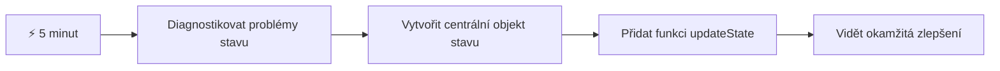
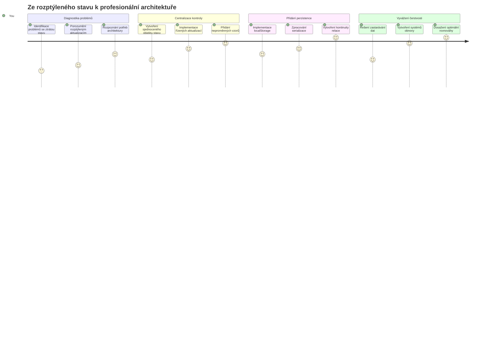
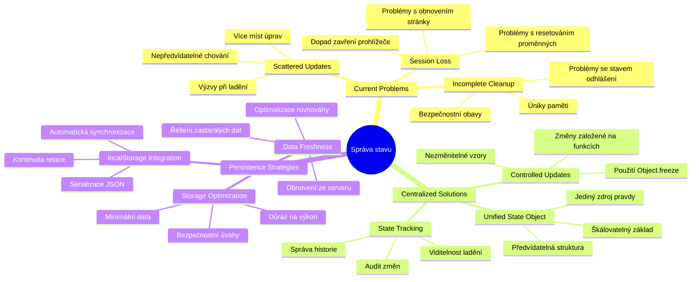
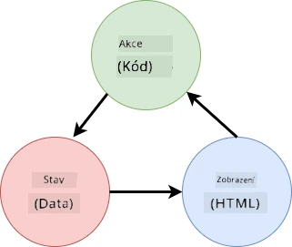
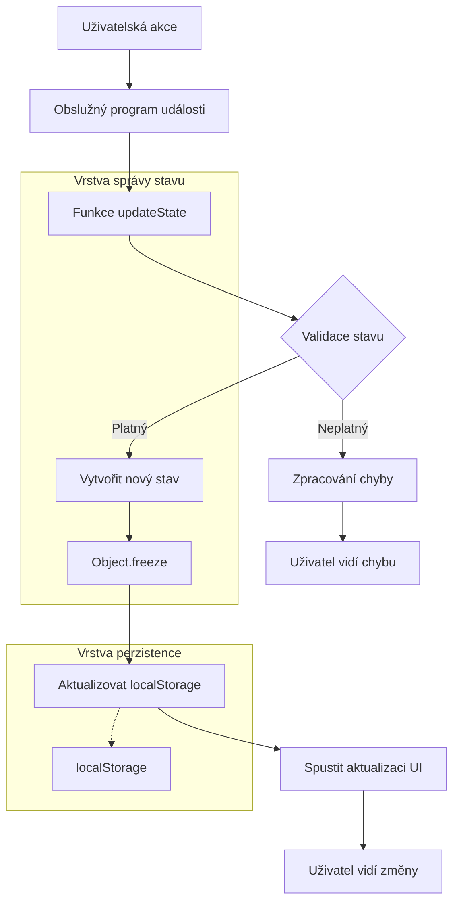
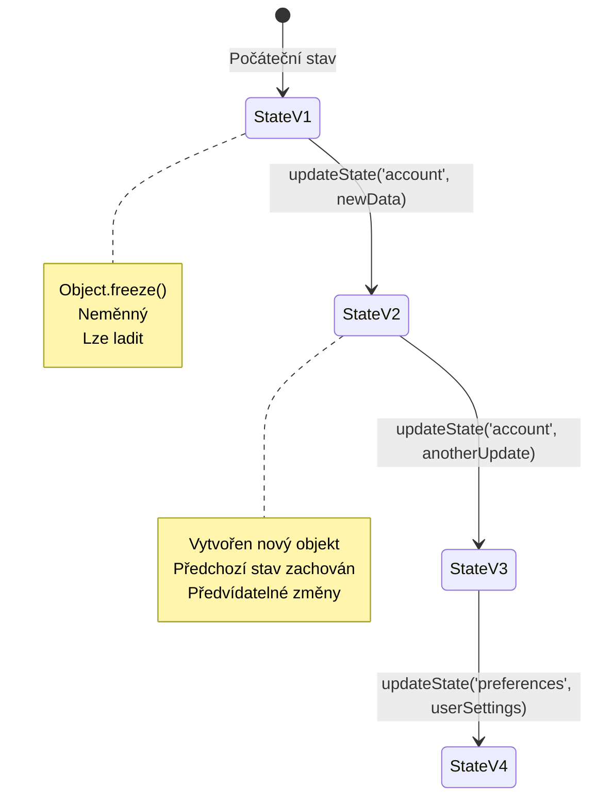
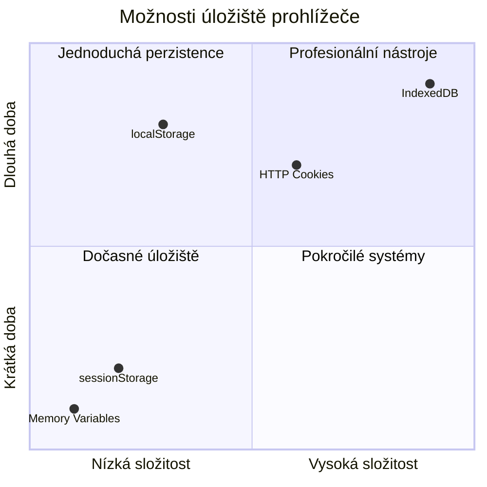
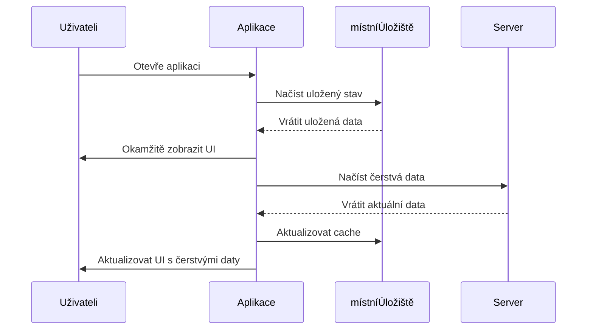
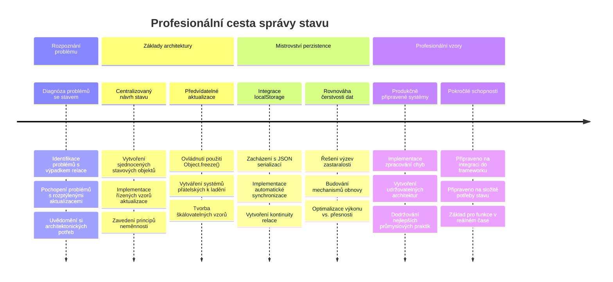
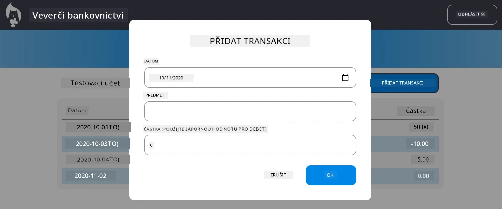

# Tvorba bankovní aplikace část 4: Koncepty správy stavu

## ⚡ Co můžete udělat v následujících 5 minutách

**Rychlá cesta pro zaneprázdněné vývojáře**


- **Minuta 1**: Otestujte aktuální problém se stavem – přihlaste se, obnovte stránku, sledujte odhlášení
- **Minuta 2**: Nahraďte `let account = null` za `let state = { account: null }`
- **Minuta 3**: Vytvořte jednoduchou funkci `updateState()` pro řízené aktualizace
- **Minuta 4**: Aktualizujte jednu funkci, aby používala nový vzor
- **Minuta 5**: Otestujte lepší předvídatelnost a možnosti ladění

**Rychlý diagnostický test**:
```javascript
// Před: Rozptýlený stav
let account = null; // Ztraceno při obnově!

// Po: Centralizovaný stav
let state = Object.freeze({ account: null }); // Řízené a sledovatelné!
```

**Proč je to důležité**: Za 5 minut zažijete proměnu chaotické správy stavu na předvídatelné a snadno laditelné vzory. Toto je základ, díky kterému jsou složité aplikace udržovatelné.

## 🗺️ Vaše cesta za mistrovstvím ve správě stavu


**Cíl vaší cesty**: Na konci této lekce budete mít vytvořený profesionální systém správy stavu, který řeší perzistenci, čerstvost dat a předvídatelné aktualizace – stejné vzory, které se používají v produkčních aplikacích.

## Přednáškový kvíz

[Přednáškový kvíz](https://ff-quizzes.netlify.app/web/quiz/47)

## Úvod

Správa stavu je jako navigační systém na kosmické sondě Voyager – když vše funguje hladce, téměř si toho nevšimnete. Ale když něco nefunguje, může to být rozdíl mezi dosažením mezihvězdného prostoru a zmizením v kosmické prázdnotě. Ve webovém vývoji stav představuje vše, co vaše aplikace potřebuje pamatovat: stav přihlášení uživatele, data z formulářů, historii navigace a dočasné stavy rozhraní.

Jak se vaše bankovní aplikace vyvinula z jednoduchého přihlašovacího formuláře do sofistikovanější aplikace, pravděpodobně jste narazili na některé běžné problémy. Obnovíte stránku a uživatelé jsou neočekávaně odhlášeni. Zavřete prohlížeč a veškerý postup zmizí. Ladíte problém a procházíte mnoha funkcemi, které všechny mění stejná data různými způsoby.

To nejsou známky špatného kódování – jsou to přirozené porodní bolesti, ke kterým dochází, když aplikace dosáhnou určité úrovně složitosti. Každý vývojář čelí těmto výzvám, když jeho aplikace přecházejí z fáze „proof of concept“ do „produkčně připravené“.

V této lekci implementujeme centralizovaný systém správy stavu, který promění vaši bankovní aplikaci v spolehlivou profesionální aplikaci. Naučíte se řídit toky dat předvídatelně, správně uchovávat uživatelskou sezení a vytvářet plynulý uživatelský zážitek, který moderní webové aplikace vyžadují.

## Požadavky

Než se pustíte do konceptů správy stavu, musíte mít správně nastavené vývojové prostředí a mít základ bankovní aplikace. Tato lekce přímo navazuje na koncepty a kód z předchozích částí této série.

Ujistěte se, že máte připravené následující komponenty, než budete pokračovat:

**Požadované nastavení:**
- Dokončete [lekci o načítání dat](../3-data/README.md) – vaše aplikace by měla úspěšně načítat a zobrazovat data účtu
- Nainstalujte [Node.js](https://nodejs.org) do systému pro spuštění backendového API
- Spusťte [serverové API](../api/README.md) lokálně pro zpracování operací s daty účtu

**Testování vašeho prostředí:**

Ověřte, že váš server API běží správně spuštěním tohoto příkazu v terminálu:

```sh
curl http://localhost:5000/api
# -> by mělo vrátit "Bank API v1.0.0" jako výsledek
```

**Co tento příkaz dělá:**
- **Odesílá** GET požadavek na váš lokální API server
- **Testuje** připojení a ověřuje, zda server odpovídá
- **Vrací** informace o verzi API, pokud vše funguje správně

## 🧠 Přehled architektury správy stavu


**Základní princip**: Profesionální správa stavu vyvažuje předvídatelnost, perzistenci a výkon, aby vytvořila spolehlivé uživatelské zážitky, které škálují od jednoduchých interakcí po složité pracovní postupy aplikací.

---

## Diagnostika aktuálních problémů se stavem

Jako Sherlock Holmes zkoumající místo činu potřebujeme přesně pochopit, co se v našem současném řešení děje, než vyřešíme záhadu mizících uživatelských sezení.

Proveďme jednoduchý experiment, který odhalí základní výzvy správy stavu:

**🧪 Vyzkoušejte tento diagnostický test:**
1. Přihlaste se do své bankovní aplikace a přejděte na ovládací panel
2. Obnovte stránku v prohlížeči
3. Sledujte, co se stane se stavem přihlášení

Pokud jste přesměrováni zpět na přihlašovací obrazovku, narazili jste na klasický problém s perzistencí stavu. Toto chování nastává, protože naše současná implementace ukládá uživatelská data do JavaScriptových proměnných, které se při načtení stránky resetují.

**Problémy současné implementace:**

Jednoduchá proměnná `account` z naší [předchozí lekce](../3-data/README.md) vytváří tři významné problémy, které ovlivňují jak uživatelský zážitek, tak udržovatelnost kódu:

| Problém | Technická příčina | Dopad na uživatele |
|---------|-----------------|--------------------|
| **Ztráta sezení** | Obnovení stránky vymaže JavaScriptové proměnné | Uživatelé se musí často znovu přihlašovat |
| **Roztříštěné aktualizace** | Více funkcí přímo mění stav | Ladění se stává složitějším |
| **Neúplné čištění** | Odhlášení nevymaže všechny reference na stav | Potenciální bezpečnostní a soukromí rizika |

**Architektonická výzva:**

Stejně jako třída Titanicu s oddíly, jež se zdála robustní, dokud se nenaplnilo několik oddílů najednou, řešení těchto problémů jednotlivě nepomůže odstranit základní architektonickou chybu. Potřebujeme komplexní řešení správy stavu.

> 💡 **Co vlastně chceme dosáhnout?**

[Správa stavu](https://cs.wikipedia.org/wiki/Spr%C3%A1va_stavu) skutečně řeší dvě základní hádanky:

1. **Kde jsou moje data?**: Sledovat, jaké informace máme a odkud pocházejí
2. **Jsou všichni na stejné stránce?**: Zajistit, že to, co uživatelé vidí, odpovídá skutečnému stavu

**Náš plán:**

Místo běhání dokola vytvoříme **centralizovaný systém správy stavu**. Představte si to jako opravdu organizovanou osobu, která má na starosti všechny důležité věci:




**Co znamená tento datový tok:**
- **Centralizuje** veškerý stav aplikace na jedno místo
- **Směřuje** všechny změny stavu přes řízené funkce
- **Zajišťuje**, že uživatelské rozhraní zůstává synchronizované s aktuálním stavem
- **Poskytuje** jasný a předvídatelný vzor pro správu dat

> 💡 **Profesionální poznatek**: Tato lekce se zaměřuje na základní koncepty. Pro složité aplikace vyvíjejí knihovny jako [Redux](https://redux.js.org) pokročilejší funkce pro správu stavu. Pochopení těchto principů vám pomůže ovládnout jakoukoli knihovnu správy stavu.

> ⚠️ **Pokročilé téma**: Automatické aktualizace rozhraní vyvolané změnami stavu nebudeme v této lekci pokrývat, protože zahrnují koncepty [reaktivního programování](https://en.wikipedia.org/wiki/Reactive_programming). Považujte to za vynikající další krok ve vaší cestě za učiněním!

### Úkol: Centralizovat strukturu stavu

Pojďme začít transformovat roztříštěný způsob správy stavu do centralizovaného systému. Tento první krok stanoví základ pro všechny následující vylepšení.

**Krok 1: Vytvořte centrální objekt stavu**

Nahraďte jednoduché `account`:

```js
let account = null;
```

Strukturovaným objektem stavu:

```js
let state = {
  account: null
};
```

**Proč je tato změna důležitá:**
- **Centralizuje** veškerá data aplikace na jedno místo
- **Připravuje** strukturu pro přidání dalších stavových vlastností později
- **Vytváří** jasnou hranici mezi stavem a ostatními proměnnými
- **Zakládá** vzor, který škáluje s růstem vaší aplikace

**Krok 2: Aktualizujte vzory přístupu ke stavu**

Upravte své funkce, aby používaly novou strukturu stavu:

**Ve funkcích `register()` a `login()` nahraďte:**
```js
account = ...
```

tímto:
```js
state.account = ...
```

**Ve funkci `updateDashboard()` přidejte tento řádek nahoře:**
```js
const account = state.account;
```

**Co tyto změny přinášejí:**
- **Udržují** existující funkčnost při zlepšení struktury
- **Připravují** kód pro pokročilejší správu stavu
- **Vytvářejí** konzistentní vzory pro přístup ke stavovým datům
- **Zakládají** základ pro centralizované aktualizace stavu

> 💡 **Poznámka**: Tento refaktor hned nevyřeší naše problémy, ale vytváří nezbytný základ pro sílu vylepšení, která přijdou!

### 🎯 Pedagogická kontrola: Principy centralizace

**Zastavte se a zamyslete**: Právě jste implementovali základ centralizované správy stavu. Toto je klíčové architektonické rozhodnutí.

**Rychlé sebehodnocení**:
- Dokážete vysvětlit, proč je lepší centralizovat stav do jednoho objektu než mít roztroušené proměnné?
- Co by se stalo, kdybyste zapomněli upravit funkci, aby používala `state.account`?
- Jak tento vzor připravuje váš kód na pokročilejší funkce?

**Spojení s praxí**: Vzor centralizace, který jste právě poznali, je základem moderních frameworků jako Redux, Vuex a React Context. Stavíte architektonické myšlení používané v hlavních aplikacích.

**Výzva**: Kdybyste chtěli do aplikace přidat uživatelská nastavení (témata, jazyk), kam byste je přidali ve struktuře stavu? Jak by to škálovalo?

## Implementace řízených aktualizací stavu

S centralizovaným stavem dalším krokem je zavedení řízených mechanismů pro úpravy dat. Tento přístup zajišťuje předvídatelné změny stavu a snazší ladění.

Základní princip připomíná řízení letového provozu: místo toho, aby více funkcí měnilo stav nezávisle, budeme všechny změny řídit jednou kontrolovanou funkcí. Tento vzor poskytuje jasný dohled nad tím, kdy a jak data měníme.

**Nezbytnost immutable správy stavu:**

Budeme s objektem `state` zacházet jako s [*neměnným*](https://cs.wikipedia.org/wiki/Neměnný_objekt), což znamená, že ho nikdy neměníme přímo. Místo toho každá změna vytvoří nový objekt stavu s aktualizovanými daty.

I když se může zdát, že je tento přístup zpočátku méně efektivní než přímé úpravy, poskytuje zásadní výhody při ladění, testování a zachování předvídatelnosti aplikace.

**Výhody immutable správy stavu:**

| Výhoda | Popis | Dopad |
|---------|-------|--------|
| **Předvídatelnost** | Změny se dějí pouze prostřednictvím řízených funkcí | Snazší ladění a testování |
| **Sledování historie** | Každá změna stavu vytváří nový objekt | Umožňuje funkce zpět/vpřed (undo/redo) |
| **Prevence vedlejších efektů** | Žádné náhodné úpravy | Předejde záhadným chybám |
| **Optimalizace výkonu** | Snadná detekce, kdy se stav skutečně změnil | Umožňuje efektivní aktualizace UI |

**JavaScriptová neměnnost s `Object.freeze()`:**

JavaScript poskytuje [`Object.freeze()`](https://developer.mozilla.org/docs/Web/JavaScript/Reference/Global_Objects/Object/freeze) k zabránění úpravám objektu:

```js
const immutableState = Object.freeze({ account: userData });
// Jakýkoli pokus o úpravu immutableState vyvolá chybu
```

**Co se zde děje:**
- **Zabraňuje** přímému přiřazení či mazání vlastností
- **Vyhazuje** výjimky při pokusu o změnu
- **Zajišťuje**, že změny stavu musí probíhat řízeně
- **Vytváří** jasnou smlouvu, jak lze stav měnit

> 💡 **Podrobný pohled**: Naučte se rozdíl mezi *mělkou* a *hlubokou* neměnností objektů v [dokumentaci MDN](https://developer.mozilla.org/docs/Web/JavaScript/Reference/Global_Objects/Object/freeze#Co_je_melke_zmrazeni). Porozumění tomuto rozdílu je klíčové pro složité struktury stavu.


### Úkol

Vytvořme novou funkci `updateState()`:

```js
function updateState(property, newData) {
  state = Object.freeze({
    ...state,
    [property]: newData
  });
}
```

V této funkci vytváříme nový objekt stavu a kopírujeme data ze stávajícího stavu pomocí [*operátoru rozprostření (`...`)*](https://developer.mozilla.org/docs/Web/JavaScript/Reference/Operators/Spread_syntax#Spread_in_object_literals). Poté přepíšeme konkrétní vlastnost objektu stavu novými daty pomocí [zápisu v hranatých závorkách](https://developer.mozilla.org/docs/Web/JavaScript/Guide/Working_with_Objects#Objects_and_properties) `[property]` pro přiřazení. Nakonec objekt zamkneme, aby se zabránilo úpravám pomocí `Object.freeze()`. V současnosti ukládáme do stavu pouze vlastnost `account`, ale touto metodou můžete přidat libovolný počet vlastností.

Také aktualizujeme inicializaci `state`, aby byl počáteční stav rovněž zamrzlý:

```js
let state = Object.freeze({
  account: null
});
```

Poté upravte funkci `register`, nahraďte přiřazení `state.account = result;` tímto:

```js
updateState('account', result);
```

Totéž proveďte ve funkci `login`, nahraďte `state.account = data;` tímto:

```js
updateState('account', data);
```

Využijeme příležitost a opravíme problém, kdy se data účtu nevymazala při kliknutí na *Odhlásit*.

Vytvořte novou funkci `logout()`:

```js
function logout() {
  updateState('account', null);
  navigate('/login');
}
```

V `updateDashboard()` nahraďte přesměrování `return navigate('/login');` voláním `return logout();`

Vyzkoušejte registraci nového účtu, odhlášení a opětovné přihlášení, aby vše fungovalo správně.

> Tip: můžete sledovat všechny změny stavu přidáním `console.log(state)` na konec funkce `updateState()` a otevřením konzole ve vývojářských nástrojích prohlížeče.

## Implementace perzistence dat

Problém se ztrátou sezení, který jsme identifikovali dříve, vyžaduje řešení perzistence, které udrží uživatelský stav přes relace v prohlížeči. Tím proměníme naši aplikaci z dočasného zážitku na spolehlivý profesionální nástroj.

Přemýšlejte o atomových hodinách, které udržují přesný čas i přes výpadky napájení tím, že ukládají kritický stav do nevolatilní paměti. Podobně i webové aplikace potřebují perzistentní úložiště, aby zachovaly důležitá uživatelská data přes relace prohlížeče a obnovy stránek.

**Strategické otázky pro perzistenci dat:**

Než implementujete perzistenci, zvažte tyto klíčové faktory:

| Otázka | Kontext bankovní aplikace | Dopad na rozhodnutí |
|----------|-------------------------|---------------------|
| **Jsou data citlivá?** | Zůstatek účtu, historie transakcí | Vybrat bezpečné metody uložení |
| **Jak dlouho by to mělo přetrvávat?** | Stav přihlášení vs. dočasné nastavení UI | Vyberte vhodnou dobu ukládání |
| **Potřebuje to server?** | Autentizační tokeny vs. nastavení UI | Určete požadavky na sdílení |

**Možnosti uložení v prohlížeči:**

Moderní prohlížeče nabízejí několik mechanismů pro ukládání dat, každý určený pro různé případy použití:

**Hlavní Storage API:**

1. **[`localStorage`](https://developer.mozilla.org/docs/Web/API/Window/localStorage)**: Trvalé [uložení klíč/hodnota](https://en.wikipedia.org/wiki/Key%E2%80%93value_database)
   - **Přetrvává** data mezi sezeními prohlížeče neomezeně  
   - **Přežije** zavření prohlížeče i restart počítače
   - **Platí** jen pro konkrétní doménu webu
   - **Perfektní** pro uživatelská nastavení a stavy přihlášení

2. **[`sessionStorage`](https://developer.mozilla.org/docs/Web/API/Window/sessionStorage)**: Dočasné úložiště sezení
   - **Funguje** stejně jako localStorage během aktivního sezení
   - **Vymaže se** automaticky po zavření záložky prohlížeče
   - **Ideální** pro dočasná data, která nemají přetrvávat

3. **[HTTP Cookies](https://developer.mozilla.org/docs/Web/HTTP/Cookies)**: Úložiště sdílené se serverem
   - **Automaticky** se odesílají s každým požadavkem na server
   - **Perfektní** pro [autentizační](https://en.wikipedia.org/wiki/Authentication) tokeny
   - **Mají** omezenou velikost a mohou ovlivnit výkon

**Požadavek na serializaci dat:**

`localStorage` i `sessionStorage` ukládají pouze [řetězce](https://developer.mozilla.org/docs/Web/JavaScript/Reference/Global_Objects/String):

```js
// Převést objekty na JSON řetězce pro uložení
const accountData = { user: 'john', balance: 150 };
localStorage.setItem('account', JSON.stringify(accountData));

// Parsovat JSON řetězce zpět na objekty při načítání
const savedAccount = JSON.parse(localStorage.getItem('account'));
```

**Pochopení serializace:**
- **Převádí** JavaScript objekty na JSON řetězce pomocí [`JSON.stringify()`](https://developer.mozilla.org/docs/Web/JavaScript/Reference/Global_Objects/JSON/stringify)
- **Obnovuje** objekty z JSON pomocí [`JSON.parse()`](https://developer.mozilla.org/docs/Web/JavaScript/Reference/Global_Objects/JSON/parse)
- **Zvládá** automaticky složité zanořené objekty a pole
- **Selhává** u funkcí, undefined hodnot a cyklických referencí

> 💡 **Pokročilá možnost**: Pro složité offline aplikace s velkými daty zvažte API [`IndexedDB`](https://developer.mozilla.org/docs/Web/API/IndexedDB_API). Poskytuje plnohodnotnou databázi na straně klienta, ale vyžaduje složitější implementaci.


### Úkol: Implementace perzistence v localStorage

Implementujeme perzistentní úložiště, aby uživatelé zůstali přihlášeni, dokud se výslovně neodhlásí. Použijeme `localStorage` k uložení dat účtu přes prohlížečová sezení.

**Krok 1: Definice konfigurace úložiště**

```js
const storageKey = 'savedAccount';
```

**Co tato konstanta poskytuje:**
- **Vytváří** konzistentní identifikátor pro uložená data
- **Zabraňuje** překlepům při odkazování na klíče v úložišti
- **Umožňuje** snadnou změnu klíče úložiště, pokud bude potřeba
- **Následuje** osvědčené postupy pro udržovatelný kód

**Krok 2: Přidejte automatickou perzistenci**

Přidejte tento řádek na konec funkce `updateState()`:

```js
localStorage.setItem(storageKey, JSON.stringify(state.account));
```

**Rozbor, co se zde děje:**
- **Převádí** objekt účtu na JSON řetězec pro uložení
- **Ukládá** data pomocí našeho konzistentního klíče úložiště
- **Provádí** se automaticky při každé změně stavu
- **Zajišťuje**, že uložená data vždy odpovídají aktuálnímu stavu

> 💡 **Výhoda architektury**: Protože jsme centralizovali všechny aktualizace stavu přes `updateState()`, přidání perzistence vyžadovalo jen jeden řádek kódu. To ukazuje sílu dobrých architektonických rozhodnutí!

**Krok 3: Obnovte stav při načtení aplikace**

Vytvořte inicializační funkci pro obnovení uložených dat:

```js
function init() {
  const savedAccount = localStorage.getItem(storageKey);
  if (savedAccount) {
    updateState('account', JSON.parse(savedAccount));
  }

  // Náš předchozí inicializační kód
  window.onpopstate = () => updateRoute();
  updateRoute();
}

init();
```

**Pochopení inicializačního procesu:**
- **Načte** dříve uložená data účtu z localStorage
- **Převede** JSON řetězec zpět na JavaScript objekt
- **Aktualizuje** stav pomocí řízené funkce aktualizace
- **Automaticky obnoví** uživatelskou relaci při načtení stránky
- **Provede se** před aktualizací routy, aby byl stav k dispozici

**Krok 4: Optimalizace výchozí routy**

Aktualizujte výchozí routu, aby využívala perzistenci:

Ve funkci `updateRoute()` nahraďte:
```js
// Nahraďte: return navigate('/login');
return navigate('/dashboard');
```

**Proč je tato změna rozumná:**
- **Využívá efektivně** náš nový perzistentní systém
- **Umožňuje** dashboardu ověřovat autentizaci
- **Automaticky přesměruje** na přihlášení, pokud není uložená relace
- **Vytváří** plynulejší uživatelský zážitek

**Testování vaší implementace:**

1. Přihlaste se do vaší bankovní aplikace
2. Obnovte stránku v prohlížeči
3. Ověřte, že zůstáváte přihlášeni a na dashboardu
4. Zavřete a znovu otevřete prohlížeč
5. Vraťte se do aplikace a potvrďte, že jste stále přihlášeni

🎉 **Dosáhli jste cíle**: Úspěšně jste implementovali perzistentní správu stavu! Vaše aplikace se nyní chová jako profesionální webová aplikace.

### 🎯 Pedagogická kontrola: Architektura perzistence

**Pochopení architektury**: Zavedli jste sofistikovanou vrstvu perzistence, která vyvažuje uživatelský zážitek s komplexností správy dat.

**Klíčové ovládnuté koncepty**:
- **Serializace JSON**: Převod složitých objektů na ukládatelné řetězce
- **Automatická synchronizace**: Změny stavu spouští perzistentní uložení
- **Obnova sezení**: Aplikace obnoví uživatelský kontext po přerušení
- **Centralizovaná perzistence**: Jedna funkce řeší veškeré ukládání

**Spojení s praxí**: Tento vzor perzistence je základem pro Progressive Web Apps (PWA), offline-first aplikace a moderní mobilní webové zážitky. Budujete produkčně použitelné funkcionality.

**Reflexní otázka**: Jak byste upravili tento systém pro více uživatelských účtů na jednom zařízení? Zvažte dopady na soukromí a bezpečnost.

## Vyvážení perzistence a aktuálnosti dat

Náš perzistentní systém úspěšně udržuje uživatelské relace, ale přináší novou výzvu: zastaralost dat. Když více uživatelů nebo aplikací modifikuje stejná data na serveru, lokálně uložená data mohou být neaktuální.

Tato situace je podobná vikingským navigátorům, kteří se spoléhali jak na uložené hvězdné mapy, tak na aktuální pozorování. Mapy poskytovaly konzistenci, ale navigátoři potřebovali čerstvá pozorování kvůli měnícím se podmínkám. Podobně naše aplikace potřebuje jak perzistentní uživatelský stav, tak aktuální data ze serveru.

**🧪 Objevení problému zastaralosti dat:**

1. Přihlaste se do dashboardu pomocí účtu `test`
2. Spusťte tento příkaz v terminálu, aby simuloval transakci z jiného zdroje:

```sh
curl --request POST \
     --header "Content-Type: application/json" \
     --data "{ \"date\": \"2020-07-24\", \"object\": \"Bought book\", \"amount\": -20 }" \
     http://localhost:5000/api/accounts/test/transactions
```

3. Obnovte stránku dashboardu v prohlížeči
4. Sledujte, zda se zobrazí nová transakce

**Co tento test ukazuje:**
- **Ukazuje**, jak lokální úložiště může být „zastaralé“
- **Simuluje** situace, kdy se data mění mimo vaši aplikaci
- **Odhaluje** rozpor mezi perzistencí a aktuálností dat

**Výzva zastaralosti dat:**

| Problém | Příčina | Dopad na uživatele |
|---------|---------|--------------------|
| **Zastaralá data** | localStorage nikdy automaticky neexpiruje | Uživatelé vidí neaktuální informace |
| **Změny na serveru** | Jiné aplikace/uživatelé mění stejná data | Nekonzistentní pohled na data na různých platformách |
| **Cache vs skutečnost** | Lokální cache neodpovídá stavu serveru | Špatný uživatelský zážitek a zmatek |

**Strategie řešení:**

Zavedeme vzor „obnovy při načtení“, který vyvažuje výhody perzistence s potřebou čerstvých dat. Tento přístup zachová plynulý uživatelský zážitek a současně zajistí přesnost dat.


### Úkol: Implementujte systém obnovy dat

Vytvoříme systém, který automaticky načte čerstvá data ze serveru a zároveň zachová výhody naší perzistentní správy stavu.

**Krok 1: Vytvořte aktualizátor dat účtu**

```js
async function updateAccountData() {
  const account = state.account;
  if (!account) {
    return logout();
  }

  const data = await getAccount(account.user);
  if (data.error) {
    return logout();
  }

  updateState('account', data);
}
```

**Logika této funkce:**
- **Kontroluje**, zda je uživatel aktuálně přihlášen (existuje state.account)
- **Přesměruje** na odhlášení, pokud není platné sezení
- **Načítá** čerstvá data účtu ze serveru pomocí stávající funkce `getAccount()`
- **Řeší** chyby serveru zdvořile odhlášením neplatných sezení
- **Aktualizuje** stav čerstvými daty pomocí našeho kontrolovaného systému aktualizace
- **Spouští** automatickou perzistenci do localStorage skrze `updateState()`

**Krok 2: Vytvořte handler obnovy dashboardu**

```js
async function refresh() {
  await updateAccountData();
  updateDashboard();
}
```

**Co tato funkce obnovení dělá:**
- **Koordinuje** proces obnovy dat a aktualizace UI
- **Čeká**, až se načtou čerstvá data před aktualizací zobrazení
- **Zajišťuje**, že dashboard zobrazuje nejaktuálnější informace
- **Udržuje** čisté oddělení správy dat od aktualizací UI

**Krok 3: Integrujte do systému rout**

Aktualizujte konfiguraci routingů tak, aby spouštěla obnovu automaticky:

```js
const routes = {
  '/login': { templateId: 'login' },
  '/dashboard': { templateId: 'dashboard', init: refresh }
};
```

**Jak tato integrace funguje:**
- **Provádí** funkci obnovy pokaždé, když se načte route dashboardu
- **Zajišťuje**, že vždy při navigaci na dashboard jsou zobrazeny čerstvé údaje
- **Zachovává** stávající strukturu rout při přidání čerstvosti dat
- **Poskytuje** konzistentní vzor pro inicializaci specifickou pro routu

**Testování vašeho systému obnovy dat:**

1. Přihlaste se do bankovní aplikace
2. Spusťte předchozí curl příkaz pro vytvoření nové transakce
3. Obnovte dashboard nebo přejděte jinam a zpět
4. Ověřte, že se nová transakce okamžitě zobrazí

🎉 **Dokonalá rovnováha**: Vaše aplikace nyní kombinuje plynulý zážitek perzistence s přesností čerstvých dat ze serveru!

## 📈 Časová osa vašeho mistrovství ve správě stavu


**🎓 Milník absolvování**: Úspěšně jste vybudovali kompletní systém správy stavu podle stejných principů jako Redux, Vuex a další profesionální knihovny. Tyto vzory škálují od jednoduchých aplikací po podnikové řešení.

**🔄 Další úroveň schopností**:
- Připraveno zvládnout frameworky správy stavu (Redux, Zustand, Pinia)
- Připraveno implementovat reálné časové funkce s WebSockets
- Vybaveno pro budování offline-first Progressive Web Apps
- Položeny základy pro pokročilé vzory jako stavové stroje a pozorovatele

## Výzva GitHub Copilot Agenta 🚀

Použijte režim Agenta k dokončení následující výzvy:

**Popis:** Implementujte komplexní systém správy stavu s funkcí zpět/vpřed (undo/redo) pro bankovní aplikaci. Výzva vám pomůže procvičit pokročilé koncepty správy stavu včetně sledování historie stavu, neměnných aktualizací a synchronizace uživatelského rozhraní.

**Prompt:** Vytvořte rozšířený systém správy stavu, který zahrnuje: 1) pole historie stavu sledující všechny předchozí stavy, 2) funkce undo a redo umožňující návrat do předchozích stavů, 3) tlačítka UI pro operace undo/redo na dashboardu, 4) maximální limit historie 10 stavů pro prevenci problémů s pamětí, a 5) správné čištění historie po odhlášení uživatele. Zajistěte, že funkčnost undo/redo bude pracovat se změnami stavu účtu a přetrvá i po obnovení prohlížeče.

Více o [režimu agenta](https://code.visualstudio.com/blogs/2025/02/24/introducing-copilot-agent-mode) zde.

## 🚀 Výzva: Optimalizace úložiště

Vaše implementace nyní efektivně zvládá uživatelské relace, obnovu dat a správu stavu. Přemýšlejte však, zda náš současný přístup optimálně vyvažuje efektivitu uložení s funkcionalitou.

Jako šachoví mistři, kteří rozlišují mezi důležitými figurami a obětovatelnými pěšci, efektivní správa stavu vyžaduje rozpoznat, která data musí přetrvávat a která by měla být vždy čerstvá ze serveru.

**Analýza optimalizace:**

Zhodnoťte vaši současnou implementaci localStorage a zvažte tyto strategické otázky:
- Jaké jsou minimální informace potřebné k udržení uživatelské autentizace?
- Která data se mění natolik často, že lokální cache nemá velký přínos?
- Jak může optimalizace úložiště zlepšit výkon, aniž by došlo ke zhoršení uživatelského zážitku?

Tento typ architektonické analýzy odlišuje zkušené vývojáře, kteří berou v potaz jak funkcionalitu, tak efektivitu.

**Strategie implementace:**
- **Identifikujte** základní data, která musí přetrvávat (pravděpodobně jen identifikace uživatele)
- **Upravte** vaši implementaci localStorage tak, aby ukládala pouze kritická data sezení
- **Zajistěte**, že čerstvá data se vždy načtou ze serveru při návštěvě dashboardu
- **Otestujte**, že optimalizovaný přístup zachovává stejný uživatelský zážitek

**Pokročilé zvažování:**
- **Porovnejte** kompromisy mezi ukládáním kompletních dat účtu vs. jen autentizačních tokenů
- **Zdokumentujte** svá rozhodnutí a zdůvodnění pro budoucí vývojáře v týmu

Tato výzva vám pomůže myslet jako profesionální vývojář, který zohledňuje jak uživatelský zážitek, tak efektivitu aplikace. Věnujte čas experimentování s různými přístupy!

## Kvíz po přednášce

[Post-lecture quiz](https://ff-quizzes.netlify.app/web/quiz/48)

## Zadání

[Implementujte dialog „Přidat transakci“](assignment.md)

Zde je ukázkový výsledek po dokončení zadání:



---

<!-- CO-OP TRANSLATOR DISCLAIMER START -->
**Prohlášení o vyloučení odpovědnosti**:
Tento dokument byl přeložen pomocí AI překladatelské služby [Co-op Translator](https://github.com/Azure/co-op-translator). Přestože usilujeme o přesnost, mějte prosím na paměti, že automatizované překlady mohou obsahovat chyby či nepřesnosti. Původní dokument v jeho mateřském jazyce by měl být považován za autoritativní zdroj. Pro důležité informace se doporučuje profesionální lidský překlad. Neručíme za jakékoli nedorozumění nebo mylné výklady vyplývající z použití tohoto překladu.
<!-- CO-OP TRANSLATOR DISCLAIMER END -->