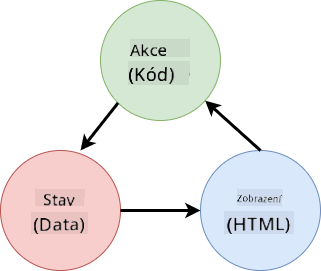

<!--
CO_OP_TRANSLATOR_METADATA:
{
  "original_hash": "b46acf79da8550d76445eed00b06c878",
  "translation_date": "2025-10-03T13:13:48+00:00",
  "source_file": "7-bank-project/4-state-management/README.md",
  "language_code": "cs"
}
-->
# Vytvoření bankovní aplikace, část 4: Koncepty správy stavu

## Kvíz před lekcí

[Kvíz před lekcí](https://ff-quizzes.netlify.app/web/quiz/47)

### Úvod

Jak webová aplikace roste, stává se stále obtížnější sledovat všechny datové toky. Který kód získává data, která stránka je spotřebovává, kde a kdy je třeba je aktualizovat... snadno se dostanete k chaotickému kódu, který je těžké udržovat. To platí zejména tehdy, když potřebujete sdílet data mezi různými stránkami vaší aplikace, například uživatelská data. Koncept *správy stavu* existuje ve všech typech programů, ale jak webové aplikace stále rostou na složitosti, stává se klíčovým bodem, o kterém je třeba během vývoje přemýšlet.

V této poslední části se podíváme na aplikaci, kterou jsme vytvořili, abychom přehodnotili, jak je spravován stav, což umožní podporu obnovení prohlížeče kdykoli a zachování dat mezi uživatelskými relacemi.

### Předpoklady

Musíte mít dokončenou část [získávání dat](../3-data/README.md) webové aplikace pro tuto lekci. Také musíte nainstalovat [Node.js](https://nodejs.org) a [spustit server API](../api/README.md) lokálně, abyste mohli spravovat data účtu.

Můžete otestovat, zda server běží správně, spuštěním tohoto příkazu v terminálu:

```sh
curl http://localhost:5000/api
# -> should return "Bank API v1.0.0" as a result
```

---

## Přehodnocení správy stavu

V [předchozí lekci](../3-data/README.md) jsme představili základní koncept stavu v naší aplikaci pomocí globální proměnné `account`, která obsahuje bankovní data aktuálně přihlášeného uživatele. Nicméně naše současná implementace má určité nedostatky. Zkuste obnovit stránku, když jste na dashboardu. Co se stane?

Existují 3 problémy se současným kódem:

- Stav není zachován, protože obnovení prohlížeče vás vrátí na přihlašovací stránku.
- Existuje několik funkcí, které stav mění. Jak aplikace roste, může být obtížné sledovat změny a snadno se zapomene na aktualizaci jedné z nich.
- Stav není vyčištěn, takže když kliknete na *Odhlásit se*, data účtu tam stále jsou, i když jste na přihlašovací stránce.

Mohli bychom aktualizovat náš kód, abychom tyto problémy řešili jeden po druhém, ale vytvořilo by to více duplicitního kódu a učinilo aplikaci složitější a obtížněji udržovatelnou. Nebo bychom se mohli na pár minut zastavit a přehodnotit naši strategii.

> Jaké problémy se zde vlastně snažíme vyřešit?

[Správa stavu](https://en.wikipedia.org/wiki/State_management) je především o nalezení dobrého přístupu k řešení těchto dvou konkrétních problémů:

- Jak udržet datové toky v aplikaci srozumitelné?
- Jak udržet data stavu vždy synchronizovaná s uživatelským rozhraním (a naopak)?

Jakmile se o tyto problémy postaráte, jakékoli další problémy, které byste mohli mít, mohou být buď již vyřešeny, nebo se staly snadněji řešitelnými. Existuje mnoho možných přístupů k řešení těchto problémů, ale zvolíme běžné řešení, které spočívá v **centralizaci dat a způsobů jejich změny**. Datové toky by vypadaly takto:



> Zde nebudeme pokrývat část, kde data automaticky spouštějí aktualizaci zobrazení, protože je spojena s pokročilejšími koncepty [reaktivního programování](https://en.wikipedia.org/wiki/Reactive_programming). Je to dobré téma pro hlubší studium, pokud máte zájem.

✅ Existuje mnoho knihoven s různými přístupy ke správě stavu, [Redux](https://redux.js.org) je populární volbou. Podívejte se na koncepty a vzory, které používá, protože často poskytují dobrý způsob, jak se naučit, jaké potenciální problémy můžete čelit ve velkých webových aplikacích a jak je lze vyřešit.

### Úkol

Začneme malým refaktoringem. Nahraďte deklaraci `account`:

```js
let account = null;
```

Tímto:

```js
let state = {
  account: null
};
```

Myšlenkou je *centralizovat* všechna data naší aplikace do jednoho objektu stavu. Zatím máme ve stavu pouze `account`, takže se toho moc nezmění, ale vytváří to cestu pro budoucí rozšíření.

Musíme také aktualizovat funkce, které jej používají. Ve funkcích `register()` a `login()` nahraďte `account = ...` za `state.account = ...`;

Na začátek funkce `updateDashboard()` přidejte tento řádek:

```js
const account = state.account;
```

Tento refaktoring sám o sobě nepřinesl mnoho zlepšení, ale myšlenkou bylo položit základy pro další změny.

## Sledování změn dat

Nyní, když jsme zavedli objekt `state` pro ukládání našich dat, dalším krokem je centralizace aktualizací. Cílem je usnadnit sledování jakýchkoli změn a kdy k nim dochází.

Aby se zabránilo změnám objektu `state`, je také dobré považovat jej za [*neměnný*](https://en.wikipedia.org/wiki/Immutable_object), což znamená, že jej nelze vůbec upravovat. To také znamená, že musíte vytvořit nový objekt stavu, pokud chcete něco změnit. Tímto způsobem si vytvoříte ochranu proti potenciálně nežádoucím [vedlejším účinkům](https://en.wikipedia.org/wiki/Side_effect_(computer_science)) a otevřete možnosti pro nové funkce ve vaší aplikaci, jako je implementace undo/redo, a zároveň usnadníte ladění. Například byste mohli zaznamenávat každou změnu provedenou ve stavu a uchovávat historii změn, abyste pochopili zdroj chyby.

V JavaScriptu můžete použít [`Object.freeze()`](https://developer.mozilla.org/docs/Web/JavaScript/Reference/Global_Objects/Object/freeze) k vytvoření neměnné verze objektu. Pokud se pokusíte provést změny neměnného objektu, bude vyvolána výjimka.

✅ Znáte rozdíl mezi *mělkým* a *hlubokým* neměnným objektem? Můžete si o tom přečíst [zde](https://developer.mozilla.org/docs/Web/JavaScript/Reference/Global_Objects/Object/freeze#What_is_shallow_freeze).

### Úkol

Vytvořme novou funkci `updateState()`:

```js
function updateState(property, newData) {
  state = Object.freeze({
    ...state,
    [property]: newData
  });
}
```

V této funkci vytváříme nový objekt stavu a kopírujeme data z předchozího stavu pomocí [*operátoru spread (`...`)*](https://developer.mozilla.org/docs/Web/JavaScript/Reference/Operators/Spread_syntax#Spread_in_object_literals). Poté přepisujeme konkrétní vlastnost objektu stavu novými daty pomocí [notace hranatých závorek](https://developer.mozilla.org/docs/Web/JavaScript/Guide/Working_with_Objects#Objects_and_properties) `[property]` pro přiřazení. Nakonec objekt uzamkneme, aby se zabránilo úpravám pomocí `Object.freeze()`. Zatím máme ve stavu pouze vlastnost `account`, ale s tímto přístupem můžete do stavu přidat tolik vlastností, kolik potřebujete.

Také aktualizujeme inicializaci `state`, abychom zajistili, že počáteční stav bude také zmrazen:

```js
let state = Object.freeze({
  account: null
});
```

Poté aktualizujte funkci `register` nahrazením přiřazení `state.account = result;` za:

```js
updateState('account', result);
```

Udělejte totéž s funkcí `login`, nahrazením `state.account = data;` za:

```js
updateState('account', data);
```

Nyní využijeme příležitosti k vyřešení problému, kdy data účtu nejsou vymazána, když uživatel klikne na *Odhlásit se*.

Vytvořte novou funkci `logout()`:

```js
function logout() {
  updateState('account', null);
  navigate('/login');
}
```

V `updateDashboard()` nahraďte přesměrování `return navigate('/login');` za `return logout()`;

Zkuste zaregistrovat nový účet, odhlásit se a znovu se přihlásit, abyste ověřili, že vše stále funguje správně.

> Tip: můžete se podívat na všechny změny stavu přidáním `console.log(state)` na konec `updateState()` a otevřením konzole v nástrojích pro vývojáře vašeho prohlížeče.

## Zachování stavu

Většina webových aplikací potřebuje uchovávat data, aby mohla správně fungovat. Všechna kritická data jsou obvykle uložena v databázi a přistupuje se k nim prostřednictvím serverového API, jako jsou například data uživatelského účtu v našem případě. Ale někdy je také zajímavé uchovávat některá data na klientské aplikaci, která běží ve vašem prohlížeči, pro lepší uživatelský zážitek nebo pro zlepšení výkonu načítání.

Když chcete uchovávat data ve vašem prohlížeči, existuje několik důležitých otázek, které byste si měli položit:

- *Jsou data citlivá?* Měli byste se vyhnout ukládání jakýchkoli citlivých dat na klienta, jako jsou hesla uživatelů.
- *Jak dlouho potřebujete tato data uchovávat?* Plánujete přistupovat k těmto datům pouze během aktuální relace, nebo je chcete uchovávat navždy?

Existuje několik způsobů, jak ukládat informace uvnitř webové aplikace, v závislosti na tom, čeho chcete dosáhnout. Například můžete použít URL k uložení vyhledávacího dotazu a učinit jej sdílitelným mezi uživateli. Můžete také použít [HTTP cookies](https://developer.mozilla.org/docs/Web/HTTP/Cookies), pokud je potřeba data sdílet se serverem, například informace o [autentizaci](https://en.wikipedia.org/wiki/Authentication).

Další možností je použití jedné z mnoha API prohlížeče pro ukládání dat. Dvě z nich jsou obzvláště zajímavé:

- [`localStorage`](https://developer.mozilla.org/docs/Web/API/Window/localStorage): [Key/Value store](https://en.wikipedia.org/wiki/Key%E2%80%93value_database), který umožňuje uchovávat data specifická pro aktuální webovou stránku mezi různými relacemi. Data uložená v něm nikdy nevyprší.
- [`sessionStorage`](https://developer.mozilla.org/docs/Web/API/Window/sessionStorage): funguje stejně jako `localStorage`, kromě toho, že data uložená v něm jsou vymazána, když relace skončí (když je prohlížeč zavřen).

Všimněte si, že obě tyto API umožňují ukládat pouze [řetězce](https://developer.mozilla.org/docs/Web/JavaScript/Reference/Global_Objects/String). Pokud chcete ukládat složité objekty, budete je muset serializovat do formátu [JSON](https://developer.mozilla.org/docs/Web/JavaScript/Reference/Global_Objects/JSON) pomocí [`JSON.stringify()`](https://developer.mozilla.org/docs/Web/JavaScript/Reference/Global_Objects/JSON/stringify).

✅ Pokud chcete vytvořit webovou aplikaci, která nepracuje se serverem, je také možné vytvořit databázi na klientovi pomocí [`IndexedDB` API](https://developer.mozilla.org/docs/Web/API/IndexedDB_API). Tato možnost je vyhrazena pro pokročilé případy použití nebo pokud potřebujete ukládat významné množství dat, protože je složitější na použití.

### Úkol

Chceme, aby naši uživatelé zůstali přihlášeni, dokud explicitně nekliknou na tlačítko *Odhlásit se*, takže použijeme `localStorage` k ukládání dat účtu. Nejprve definujme klíč, který použijeme k ukládání našich dat.

```js
const storageKey = 'savedAccount';
```

Poté přidejte tento řádek na konec funkce `updateState()`:

```js
localStorage.setItem(storageKey, JSON.stringify(state.account));
```

Tímto způsobem budou data uživatelského účtu uchována a vždy aktuální, protože jsme dříve centralizovali všechny naše aktualizace stavu. Zde začínáme těžit ze všech našich předchozích refaktorů 🙂.

Protože jsou data uložena, musíme se také postarat o jejich obnovení, když je aplikace načtena. Vzhledem k tomu, že začneme mít více inicializačního kódu, může být dobrý nápad vytvořit novou funkci `init`, která také zahrnuje náš předchozí kód na konci `app.js`:

```js
function init() {
  const savedAccount = localStorage.getItem(storageKey);
  if (savedAccount) {
    updateState('account', JSON.parse(savedAccount));
  }

  // Our previous initialization code
  window.onpopstate = () => updateRoute();
  updateRoute();
}

init();
```

Zde získáváme uložená data a pokud nějaká existují, aktualizujeme stav odpovídajícím způsobem. Je důležité to udělat *před* aktualizací trasy, protože může existovat kód, který se spoléhá na stav během aktualizace stránky.

Můžeme také udělat stránku *Dashboard* výchozí stránkou naší aplikace, protože nyní uchováváme data účtu. Pokud žádná data nejsou nalezena, dashboard se postará o přesměrování na stránku *Login*. V `updateRoute()` nahraďte výchozí `return navigate('/login');` za `return navigate('/dashboard');`.

Nyní se přihlaste do aplikace a zkuste obnovit stránku. Měli byste zůstat na dashboardu. Tímto jsme vyřešili všechny naše počáteční problémy...

## Aktualizace dat

...Ale možná jsme také vytvořili nový problém. Oops!

Přejděte na dashboard pomocí účtu `test`, poté spusťte tento příkaz v terminálu, abyste vytvořili novou transakci:

```sh
curl --request POST \
     --header "Content-Type: application/json" \
     --data "{ \"date\": \"2020-07-24\", \"object\": \"Bought book\", \"amount\": -20 }" \
     http://localhost:5000/api/accounts/test/transactions
```

Zkuste nyní obnovit stránku dashboardu ve vašem prohlížeči. Co se stane? Vidíte novou transakci?

Stav je uchováván neomezeně díky `localStorage`, ale to také znamená, že se nikdy neaktualizuje, dokud se neodhlásíte z aplikace a znovu se nepřihlásíte!

Jednou z možných strategií, jak to opravit, je znovu načíst data účtu pokaždé, když je dashboard načten, aby se zabránilo zastaralým datům.

### Úkol

Vytvořte novou funkci `updateAccountData`:

```js
async function updateAccountData() {
  const account = state.account;
  if (!account) {
    return logout();
  }

  const data = await getAccount(account.user);
  if (data.error) {
    return logout();
  }

  updateState('account', data);
}
```

Tato metoda kontroluje, zda jsme aktuálně přihlášeni, a poté znovu načte data účtu ze serveru.

Vytvořte další funkci nazvanou `refresh`:

```js
async function refresh() {
  await updateAccountData();
  updateDashboard();
}
```

Tato funkce aktualizuje data účtu a poté se postará o aktualizaci HTML stránky dashboardu. To je to, co potřebujeme zavolat, když je načtena trasa dashboardu. Aktualizujte definici trasy pomocí:

```js
const routes = {
  '/login': { templateId: 'login' },
  '/dashboard': { templateId: 'dashboard', init: refresh }
};
```

Zkuste nyní obnovit dashboard, měl by zobrazit aktualizovaná data účtu.

---

## 🚀 Výzva

Nyní, když znovu načítáme data účtu pokaždé, když je dashboard načten, myslíte si, že stále potřebujeme uchovávat *všechna data účtu*?

Zkuste společně změnit, co je ukládáno a načítáno z `localStorage`, aby obsahovalo pouze to, co je absolutně nezbytné pro fungování aplikace.

## Kvíz po lekci
[Post-přednáškový kvíz](https://ff-quizzes.netlify.app/web/quiz/48)

## Úkol

[Implementujte dialog "Přidat transakci"](assignment.md)

Zde je příklad výsledku po dokončení úkolu:


---

**Prohlášení**:  
Tento dokument byl přeložen pomocí služby AI pro překlad [Co-op Translator](https://github.com/Azure/co-op-translator). I když se snažíme o přesnost, mějte prosím na paměti, že automatizované překlady mohou obsahovat chyby nebo nepřesnosti. Původní dokument v jeho původním jazyce by měl být považován za autoritativní zdroj. Pro důležité informace se doporučuje profesionální lidský překlad. Neodpovídáme za žádná nedorozumění nebo nesprávné interpretace vyplývající z použití tohoto překladu.