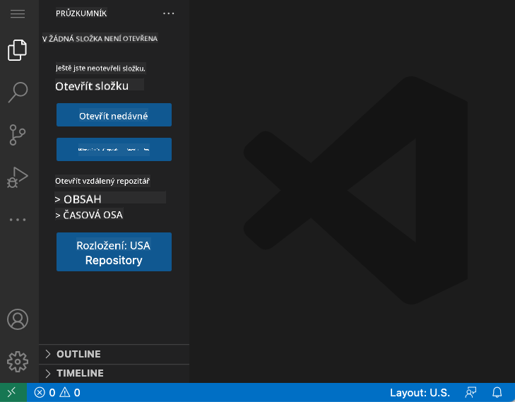
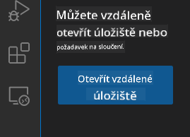
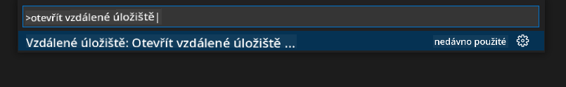
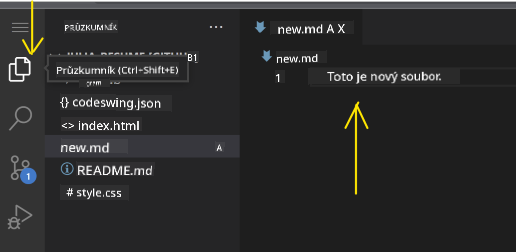
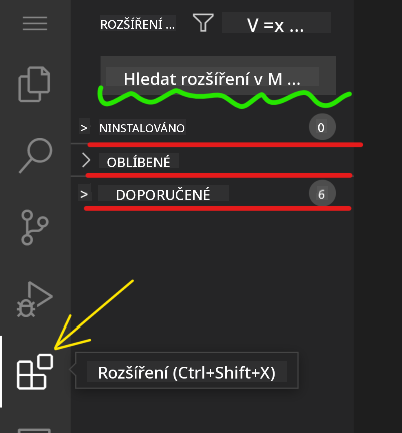
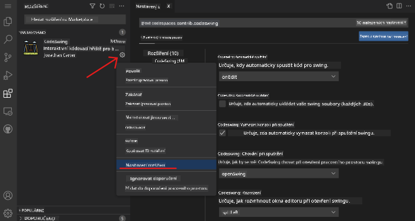

<!--
CO_OP_TRANSLATOR_METADATA:
{
  "original_hash": "7aa6e4f270d38d9cb17f2b5bd86b863d",
  "translation_date": "2025-08-28T04:23:29+00:00",
  "source_file": "8-code-editor/1-using-a-code-editor/README.md",
  "language_code": "cs"
}
-->
# Používání editoru kódu

Tato lekce pokrývá základy používání [VSCode.dev](https://vscode.dev), webového editoru kódu, abyste mohli upravovat svůj kód a přispívat do projektu, aniž byste museli cokoli instalovat na svůj počítač.

<!----
TODO: přidat volitelný obrázek

> Sketchnote od [Jméno autora](https://example.com)
---->

<!---
## Kvíz před lekcí
[Kvíz před lekcí](https://ff-quizzes.netlify.app/web/quiz/3)
---->

## Cíle učení

V této lekci se naučíte:

- Používat editor kódu v projektu
- Sledovat změny pomocí verzovacího systému
- Přizpůsobit editor pro vývoj

### Předpoklady

Než začnete, budete si muset vytvořit účet na [GitHub](https://github.com). Přejděte na [GitHub](https://github.com/) a vytvořte si účet, pokud ho ještě nemáte.

### Úvod

Editor kódu je nezbytný nástroj pro psaní programů a spolupráci na existujících projektech. Jakmile pochopíte základy editoru a naučíte se využívat jeho funkce, budete je moci aplikovat při psaní kódu.

## Začínáme s VSCode.dev

[VSCode.dev](https://vscode.dev) je editor kódu na webu. Nemusíte nic instalovat, stačí ho otevřít jako jakoukoli jinou webovou stránku. Chcete-li začít s editorem, otevřete následující odkaz: [https://vscode.dev](https://vscode.dev). Pokud nejste přihlášeni na [GitHub](https://github.com/), postupujte podle pokynů k přihlášení nebo vytvoření nového účtu a poté se přihlaste.

Po načtení by měl editor vypadat podobně jako na tomto obrázku:



Existují tři hlavní sekce, od levé strany směrem doprava:

1. _Panel aktivit_, který obsahuje několik ikon, jako lupa 🔎, ozubené kolečko ⚙️ a další.
1. Rozšířený panel aktivit, který ve výchozím nastavení zobrazuje _Průzkumník_, nazývaný _postranní panel_.
1. A nakonec oblast kódu napravo.

Klikněte na každou z ikon, abyste zobrazili různé nabídky. Po dokončení klikněte na _Průzkumník_, abyste se vrátili na výchozí obrazovku.

Když začnete vytvářet kód nebo upravovat existující kód, bude se to odehrávat v největší oblasti napravo. Tuto oblast budete také používat k vizualizaci existujícího kódu, což si vyzkoušíte v další části.

## Otevření GitHub repozitáře

První věc, kterou budete potřebovat, je otevřít GitHub repozitář. Existuje několik způsobů, jak repozitář otevřít. V této sekci si ukážeme dva různé způsoby, jak můžete repozitář otevřít a začít pracovat na změnách.

### 1. Pomocí editoru

Použijte samotný editor k otevření vzdáleného repozitáře. Pokud přejdete na [VSCode.dev](https://vscode.dev), uvidíte tlačítko _"Open Remote Repository"_:



Můžete také použít příkazovou paletu. Příkazová paleta je vstupní pole, do kterého můžete zadat libovolné slovo, které je součástí příkazu nebo akce, abyste našli správný příkaz k provedení. Použijte nabídku vlevo nahoře, poté vyberte _View_ a následně _Command Palette_, nebo použijte následující klávesovou zkratku: Ctrl-Shift-P (na MacOS Command-Shift-P).



Jakmile se nabídka otevře, napište _open remote repository_ a poté vyberte první možnost. Zobrazí se vám seznam repozitářů, kterých jste součástí nebo které jste nedávno otevřeli. Můžete také použít úplnou URL adresu GitHubu k výběru jednoho z nich. Použijte následující URL a vložte ji do pole:

```
https://github.com/microsoft/Web-Dev-For-Beginners
```

✅ Pokud bylo úspěšné, uvidíte všechny soubory tohoto repozitáře načtené v textovém editoru.

### 2. Použití URL

Repozitář můžete také načíst přímo pomocí URL. Například úplná URL aktuálního repozitáře je [https://github.com/microsoft/Web-Dev-For-Beginners](https://github.com/microsoft/Web-Dev-For-Beginners), ale můžete nahradit doménu GitHubu `VSCode.dev/github` a načíst repozitář přímo. Výsledná URL by byla [https://vscode.dev/github/microsoft/Web-Dev-For-Beginners](https://vscode.dev/github/microsoft/Web-Dev-For-Beginners).

## Úprava souborů

Jakmile máte repozitář otevřený v prohlížeči/vscode.dev, dalším krokem bude provádění aktualizací nebo změn projektu.

### 1. Vytvoření nového souboru

Můžete vytvořit soubor buď uvnitř existující složky, nebo v kořenovém adresáři/složce. Chcete-li vytvořit nový soubor, otevřete umístění/složku, do které chcete soubor uložit, a vyberte ikonu _'New file ...'_ na panelu aktivit _(vlevo)_, pojmenujte ho a stiskněte Enter.


### 2. Úprava a uložení souboru v repozitáři

Používání vscode.dev je užitečné, kdykoli chcete rychle aktualizovat svůj projekt, aniž byste museli načítat jakýkoli software lokálně.  
Chcete-li aktualizovat svůj kód, klikněte na ikonu 'Explorer', která se také nachází na panelu aktivit, abyste zobrazili soubory a složky v repozitáři.  
Vyberte soubor, který chcete otevřít v oblasti kódu, proveďte změny a uložte.



Jakmile dokončíte aktualizaci projektu, vyberte ikonu _`source control`_, která obsahuje všechny nové změny, které jste provedli v repozitáři.

Chcete-li zobrazit změny, které jste provedli ve svém projektu, vyberte soubor(y) ve složce `Changes` na rozšířeném panelu aktivit. Tím se otevře 'Working Tree', kde vizuálně uvidíte změny, které jste provedli v souboru. Červená barva označuje vynechání projektu, zatímco zelená značí přidání.


Pokud jste spokojeni se změnami, které jste provedli, najeďte na složku `Changes` a klikněte na tlačítko `+`, abyste změny připravili ke commitu. Připravení znamená přípravu změn k jejich odeslání na GitHub.

Pokud však nejste spokojeni s některými změnami a chcete je zrušit, najeďte na složku `Changes` a vyberte ikonu `undo`.

Poté zadejte `commit message` _(popis změny, kterou jste provedli v projektu)_, klikněte na ikonu `check`, abyste změny commitovali a odeslali.

Jakmile dokončíte práci na projektu, vyberte ikonu `hamburger menu` vlevo nahoře, abyste se vrátili do repozitáře na github.com.


## Používání rozšíření

Instalace rozšíření na VSCode vám umožňuje přidávat nové funkce a možnosti přizpůsobení vývojového prostředí ve vašem editoru, což zlepšuje váš vývojový proces. Tato rozšíření také pomáhají přidávat podporu pro různé programovací jazyky a často jsou buď obecná, nebo zaměřená na konkrétní jazyk.

Chcete-li procházet seznam všech dostupných rozšíření, klikněte na ikonu _`Extensions`_ na panelu aktivit a začněte psát název rozšíření do textového pole označeného _'Search Extensions in Marketplace'_.  
Uvidíte seznam rozšíření, z nichž každé obsahuje **název rozšíření, jméno vydavatele, jednovětný popis, počet stažení** a **hodnocení hvězdičkami**.


Můžete také zobrazit všechna dříve nainstalovaná rozšíření rozbalením složky _`Installed`_, populární rozšíření používaná většinou vývojářů ve složce _`Popular`_ a doporučená rozšíření pro vás buď od uživatelů ve stejném workspace, nebo na základě vašich nedávno otevřených souborů ve složce _`Recommended`_.



### 1. Instalace rozšíření

Chcete-li nainstalovat rozšíření, napište jeho název do vyhledávacího pole a klikněte na něj, abyste zobrazili další informace o rozšíření v oblasti kódu, jakmile se objeví na rozšířeném panelu aktivit.

Můžete buď kliknout na _modré tlačítko instalace_ na rozšířeném panelu aktivit, nebo použít tlačítko instalace, které se objeví v oblasti kódu, jakmile vyberete rozšíření k načtení dalších informací.


### 2. Přizpůsobení rozšíření

Po instalaci rozšíření možná budete chtít upravit jeho chování a přizpůsobit ho podle svých preferencí. Chcete-li to provést, vyberte ikonu Extensions, a tentokrát se vaše rozšíření objeví ve složce _Installed_, klikněte na _**ikonu ozubeného kolečka**_ a přejděte na _Extensions Setting_.



### 3. Správa rozšíření

Po instalaci a používání rozšíření nabízí vscode.dev možnosti správy rozšíření podle různých potřeb. Například můžete:

- **Deaktivovat:** _(Dočasně deaktivujete rozšíření, když ho již nepotřebujete, ale nechcete ho úplně odinstalovat)_

    Vyberte nainstalované rozšíření na rozšířeném panelu aktivit > klikněte na ikonu ozubeného kolečka > vyberte 'Disable' nebo 'Disable (Workspace)' **NEBO** otevřete rozšíření v oblasti kódu a klikněte na modré tlačítko Disable.

- **Odinstalovat:** Vyberte nainstalované rozšíření na rozšířeném panelu aktivit > klikněte na ikonu ozubeného kolečka > vyberte 'Uninstall' **NEBO** otevřete rozšíření v oblasti kódu a klikněte na modré tlačítko Uninstall.

---

## Zadání

[Vytvořte webovou stránku životopisu pomocí vscode.dev](https://github.com/microsoft/Web-Dev-For-Beginners/blob/main/8-code-editor/1-using-a-code-editor/assignment.md)

<!----
## Kvíz po lekci
[Kvíz po lekci](https://ff-quizzes.netlify.app/web/quiz/4)
---->

## Přehled a samostudium

Přečtěte si více o [VSCode.dev](https://code.visualstudio.com/docs/editor/vscode-web?WT.mc_id=academic-0000-alfredodeza) a některých jeho dalších funkcích.

---

**Prohlášení**:  
Tento dokument byl přeložen pomocí služby pro automatický překlad [Co-op Translator](https://github.com/Azure/co-op-translator). Ačkoli se snažíme o přesnost, mějte prosím na paměti, že automatické překlady mohou obsahovat chyby nebo nepřesnosti. Původní dokument v jeho původním jazyce by měl být považován za autoritativní zdroj. Pro důležité informace doporučujeme profesionální lidský překlad. Neodpovídáme za žádná nedorozumění nebo nesprávné interpretace vyplývající z použití tohoto překladu.