<!--
CO_OP_TRANSLATOR_METADATA:
{
  "original_hash": "a9a3bcc037a447e2d8994d99e871cd9f",
  "translation_date": "2026-01-07T03:36:11+00:00",
  "source_file": "8-code-editor/1-using-a-code-editor/README.md",
  "language_code": "cs"
}
-->
# Použití editoru kódu: Ovládnutí VSCode.dev

Pamatujete si ve *The Matrix*, když se Neo musel připojit do obrovského počítačového terminálu, aby získal přístup do digitálního světa? Dnešní nástroje pro vývoj webu jsou úplně opačný příběh – mimořádně výkonné možnosti dostupné odkudkoli. VSCode.dev je prohlížečový editor kódu, který přináší profesionální vývojové nástroje na jakékoli zařízení s připojením k internetu.

Stejně jako knihtisk zpřístupnil knihy všem, nejen mnichům v klášterech, VSCode.dev demokratizuje kódování. Můžete pracovat na projektech z knihovního počítače, školní laboratoře nebo odkudkoli, kde máte přístup k prohlížeči. Žádné instalace, žádná omezení typu „potřebuji své specifické nastavení“.

Na konci této lekce budete rozumět, jak se v VSCode.dev pohybovat, otevírat úložiště GitHub přímo v prohlížeči a používat Git pro správu verzí – to vše jsou dovednosti, na kterých denně závisí profesionální vývojáři.

## ⚡ Co můžete udělat během příštích 5 minut

**Rychlá cesta pro zaneprázdněné vývojáře**


- **Minuta 1**: Přejděte na [vscode.dev](https://vscode.dev) – bez nutnosti instalace
- **Minuta 2**: Přihlaste se přes GitHub a propojte svá úložiště
- **Minuta 3**: Vyzkoušejte triky s URL: změňte `github.com` na `vscode.dev/github` v libovolné URL repozitáře
- **Minuta 4**: Vytvořte nový soubor a sledujte, jak se automaticky aktivuje zvýrazňování syntaxe
- **Minuta 5**: Proveďte změnu a potvrďte ji přes panel Source Control

**Rychlý testovací odkaz**:
```
# Transform this:
github.com/microsoft/Web-Dev-For-Beginners

# Into this:
vscode.dev/github/microsoft/Web-Dev-For-Beginners
```

**Proč je to důležité:** Za 5 minut zažijete svobodu kódování odkudkoli s profesionálními nástroji. To představuje budoucnost vývoje – dostupnou, výkonnou a okamžitou.

## 🗺️ Vaše cesta učením přes cloudový vývoj

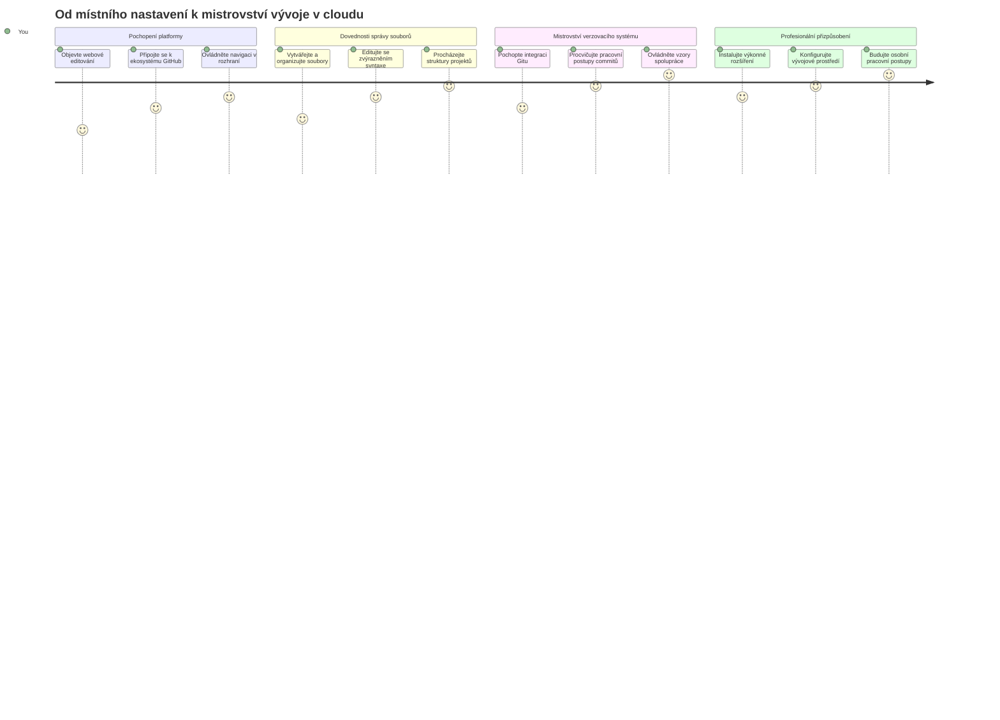
**Cíl vaší cesty:** Na konci této lekce ovládnete profesionální cloudové vývojové prostředí, které funguje na jakémkoli zařízení a umožňuje vám kódovat stejnými nástroji jako vývojáři ve velkých technologických firmách.

## Co se naučíte

Po společném průchodu touto lekcí budete schopni:

- Pohybovat se ve VSCode.dev jako doma – najít vše potřebné bez ztráty orientace
- Otevřít libovolné GitHub repozitáře v prohlížeči a okamžitě začít upravovat (to je opravdu magické!)
- Používat Git pro sledování změn a profesionální ukládání práce
- Vylepšit svůj editor rozšířeními, která zrychlují a zpříjemňují kódování
- S jistotou vytvářet a organizovat soubory projektů

## Co budete potřebovat

Požadavky jsou jednoduché:

- Zdarma [GitHub účet](https://github.com) (v případě potřeby vás provedeme jeho založením)
- Základní znalost webových prohlížečů
- Lekce GitHub Basics poskytuje užitečné základy, ale není nutná

> 💡 **Nováček na GitHubu?** Vytvoření účtu je zdarma a zabere pár minut. Stejně jako karta do knihovny vám umožní půjčovat knihy po celém světě, GitHub účet otevírá dveře do repozitářů kódu na internetu.

## 🧠 Přehled ekosystému cloudového vývoje

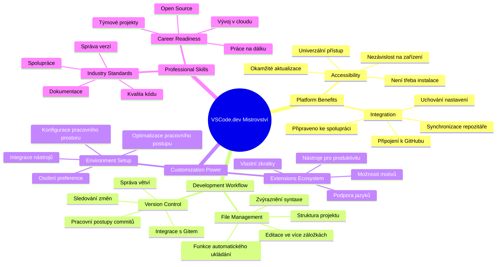
**Základní princip:** Cloudová vývojová prostředí představují budoucnost kódování – poskytují profesionální nástroje, které jsou přístupné, spolupracující a nezávislé na platformě.

## Proč mají webové editory kódu význam

Před internetem vědci na různých univerzitách nemohli snadno sdílet výzkum. Pak přišel ARPANET v 60. letech 20. století, který spojil počítače na vzdálenost. Webové editory kódu následují stejný princip – umožňují přístup k výkonným nástrojům nezávisle na tom, kde se fyzicky nacházíte nebo jaké zařízení používáte.

Editor kódu slouží jako vaše pracovní místo pro vývoj, kde píšete, upravujete a organizujete soubory kódu. Na rozdíl od jednoduchých textových editorů profesionální editoři kódu nabízejí zvýraznění syntaxe, detekci chyb a správu projektů.

VSCode.dev přináší tyto možnosti přímo do prohlížeče:

**Výhody webového editování:**

| Funkce | Popis | Praktický přínos |
|---------|-------------|----------|
| **Nezávislost na platformě** | Funguje na jakémkoli zařízení s prohlížečem | Práce hladce na různých počítačích |
| **Bez nutnosti instalace** | Přístup přes webovou URL | Vyhnete se omezením instalace softwaru |
| **Automatické aktualizace** | Vždy používá nejnovější verzi | Přístup k novým funkcím bez ručního updatu |
| **Integrace repozitáře** | Přímé propojení s GitHubem | Úpravy bez správy lokálních souborů |

**Praktické dopady:**
- Plynulost práce napříč různými prostředími
- Konzistentní rozhraní bez ohledu na operační systém
- Okamžité možnosti spolupráce
- Snížené požadavky na lokální úložiště

## Prozkoumání VSCode.dev

Stejně jako Marie Curie měla v laboratoři komplexní vybavení na relativně malém prostoru, VSCode.dev nese profesionální vývojové nástroje do prostředí prohlížeče. Tato webová aplikace nabízí stejnou základní funkčnost jako desktopové editory kódu.

Začněte tím, že v prohlížeči otevřete [vscode.dev](https://vscode.dev). Rozhraní se načte bez nutnosti stahování nebo instalace – přímá aplikace principů cloud computingu.

### Připojení vašeho GitHub účtu

Stejně jako telefon Alexandra Grahama Bella propojil vzdálená místa, propojení vašeho GitHub účtu spojuje VSCode.dev s vašimi kódovými repozitáři. Po vyzvání k přihlášení přes GitHub se doporučuje tento krok potvrdit.

**Integrace GitHubu poskytuje:**
- Přímý přístup k repozitářům v editoru
- Synchronizované nastavení a rozšíření napříč zařízeními
- Zjednodušený pracovní postup ukládání do GitHubu
- Personalizované vývojové prostředí

### Seznamte se se svým novým pracovním prostorem

Jakmile se vše načte, uvidíte krásně čisté pracovní prostředí, které je navržené tak, aby vás soustředilo na to nejdůležitější – váš kód!

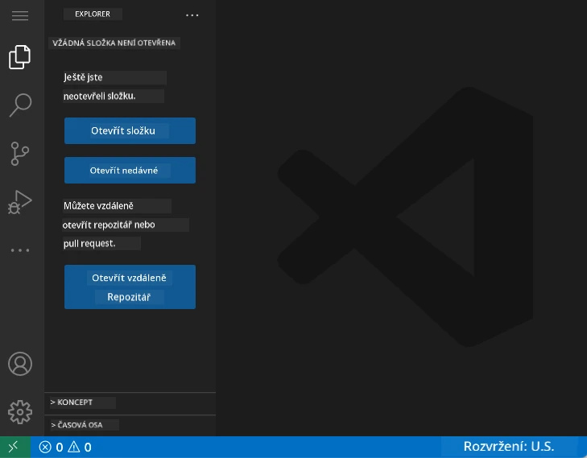

**Prohlídka okolí:**
- **Activity Bar** (ten pruh vlevo): Hlavní navigace s Průzkumníkem 📁, Vyhledáváním 🔍, Source Control 🌿, Rozšířeními 🧩 a Nastaveními ⚙️
- **Boční panel** (vedle Activity Baru): Zobrazuje relevantní informace podle toho, co máte vybrané
- **Editor** (velký prostor uprostřed): Tady se děje kouzlo – vaše hlavní pracovní plocha pro kódování

**Chvíli prozkoumejte:**
- Klikněte na ikony v Activity Baru a zjistěte, co každá dělá
- Všimněte si, jak se boční panel mění podle obsahu – celkem šikovné, co?
- Průzkumník (📁) je pravděpodobně místo, kde strávíte většinu času, tak si ho osahajte

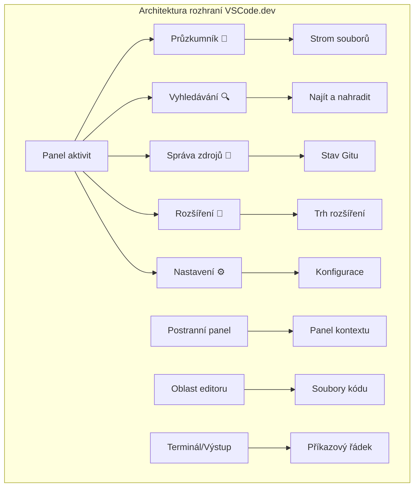
## Otevírání GitHub repozitářů

Před internetem museli výzkumníci fyzicky cestovat do knihoven, aby získali přístup k dokumentům. GitHub repozitáře fungují podobně – jsou to sbírky kódu uložené vzdáleně. VSCode.dev eliminuje tradiční krok stahování repozitářů do lokálního počítače před úpravou.

Tato vlastnost umožňuje okamžitý přístup k libovolnému veřejnému repozitáři pro prohlížení, úpravy nebo přispívání. Zde jsou dvě metody, jak otevírat repozitáře:

### Metoda 1: Kliknutí a ukázání

Perfektní, když začínáte ve VSCode.dev a chcete otevřít konkrétní repozitář. Je přímá a přátelská k začátečníkům:

**Postup:**

1. Přejděte na [vscode.dev](https://vscode.dev), pokud tam ještě nejste
2. Na uvítací obrazovce klikněte na tlačítko „Open Remote Repository“

   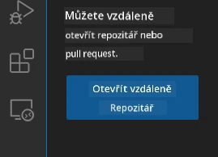

3. Vložte URL libovolného GitHub repozitáře (zkuste třeba: `https://github.com/microsoft/Web-Dev-For-Beginners`)
4. Stiskněte Enter a sledujte, jak se to načítá!

**Profík tip – zkratka Command Palette:**

Chcete se cítit jako kouzelník s kódem? Zkuste klávesovou zkratku Ctrl+Shift+P (nebo Cmd+Shift+P na Macu) pro otevření Command Palette:

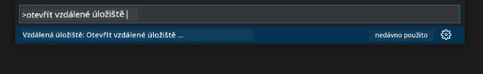

**Command Palette je jako vyhledávač na vše, co můžete dělat:**
- Zadejte „open remote“ a najde vám nástroj pro otevírání repozitářů
- Pamatuje si, které repozitáře jste nedávno otevřeli (velmi praktické!)
- Jakmile si zvyknete, budete mít pocit, že kódujete bleskovou rychlostí
- Je to v podstatě VSCode.dev verze „Hej Siri“ pro kódování

### Metoda 2: Úprava URL

Stejně jako HTTP a HTTPS používají různé protokoly, ale zachovávají strukturu domény, VSCode.dev používá vzor URL, který zrcadlí adresování GitHubu. Jakoukoli URL GitHub repozitáře lze upravit tak, aby se otevřela přímo v VSCode.dev.

**Vzor transformace URL:**

| Typ repozitáře | GitHub URL | VSCode.dev URL |
|----------------|---------------------|----------------|
| **Veřejný repozitář** | `github.com/microsoft/Web-Dev-For-Beginners` | `vscode.dev/github/microsoft/Web-Dev-For-Beginners` |
| **Osobní projekt** | `github.com/your-username/my-project` | `vscode.dev/github/your-username/my-project` |
| **Jakýkoli přístupný repozitář** | `github.com/their-username/awesome-repo` | `vscode.dev/github/their-username/awesome-repo` |

**Implementace:**
- Nahraďte `github.com` za `vscode.dev/github`
- Ostatní části URL ponechte beze změny
- Funguje u všech veřejně přístupných repozitářů
- Umožňuje okamžité úpravy

> 💡 **Život měnící tip:** Přidejte si do záložek VSCode.dev verze svých oblíbených repozitářů. Mám záložky jako „Upravit mé portfolio“ a „Opravit dokumentaci“, které mě okamžitě zavedou do režimu úprav!

**Kterou metodu používat?**
- **Přes rozhraní:** Skvělé, když prozkoumáváte nebo si nemůžete přesně vzpomenout na názvy repozitářů
- **URL trik:** Perfektní pro bleskové otevření, když přesně víte, kam jdete

### 🎯 Pedagogická kontrola: Přístup k cloudovému vývoji

**Zastavte se a zamyslete:** Právě jste si osvojili dvě metody přístupu k repozitářům přes webový prohlížeč. To představuje zásadní změnu způsobu, jak funguje vývoj.

**Rychlé sebehodnocení:**
- Dokážete vysvětlit, proč webové editování eliminuje tradiční „nastavení vývojového prostředí“?
- Jaké výhody má technika úpravy URL oproti místnímu klonování git repozitáře?
- Jak tento přístup změní váš způsob příspěvku do projektů open source?

**Spojení s reálným světem:** Velké firmy jako GitHub, GitLab a Replit postavily své vývojové platformy na těchto cloudových principech. Učíte se stejné postupy jako profesionální týmy vývojářů po celém světě.

**Výzva:** Jak by mohl cloudový vývoj změnit způsob výuky programování ve školách? Zvažte požadavky na zařízení, správu softwaru a možnosti spolupráce.

## Práce se soubory a projekty

Teď, když máte repozitář otevřený, pojďme začít tvořit! VSCode.dev vám nabízí vše k vytváření, úpravě a organizaci souborů kódu. Představte si to jako svou digitální dílnu – každý nástroj máte tam, kde ho potřebujete.

Ponořme se do běžných úkolů, které budou tvořit většinu vašeho kódovacího pracovního toku.

### Vytváření nových souborů

Stejně jako organizace plánů v kanceláři architekta, vytvoření souborů ve VSCode.dev následuje strukturovaný postup. Systém podporuje všechny standardní typy souborů pro webový vývoj.

**Postup vytváření souboru:**

1. Přejděte do cílové složky v postranním panelu Průzkumníka
2. Najetím myši na název složky zobrazíte ikonu „Nový soubor“ (📄+)
3. Zadejte název souboru včetně příslušné přípony (`style.css`, `script.js`, `index.html`)
4. Stiskněte Enter pro vytvoření souboru

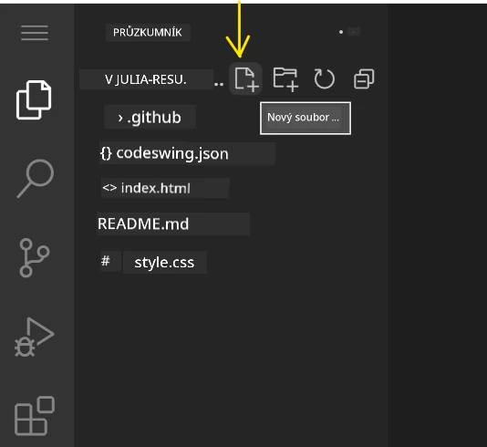

**Pravidla pojmenování:**
- Používejte popisné názvy, které naznačují účel souboru
- Přidávejte přípony souborů pro správné zvýraznění syntaxe
- Dodržujte konzistentní vzory pojmenování v celých projektech
- Používejte malá písmena a spojovníky místo mezer

### Úprava a ukládání souborů

Zde začíná opravdová zábava! Editor VSCode.dev je nabitý užitečnými funkcemi, které dělají kódování plynulým a intuitivním. Je to jako mít opravdu chytrého asistenta na psaní, ale pro kód.

**Váš pracovní postup při úpravách:**

1. Klikněte na libovolný soubor v Průzkumníkovi pro jeho otevření v hlavní oblasti
2. Začněte psát a sledujte, jak vám VSCode.dev pomáhá barvami, návrhy a odhalením chyb
3. Ukládejte práci pomocí Ctrl+S (Windows/Linux) nebo Cmd+S (Mac) – i když editor ukládá automaticky!

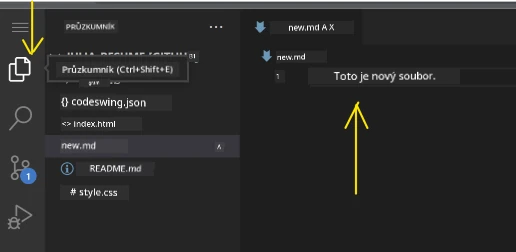

**Co se děje, když kódujete:**
- Váš kód je krásně barevně zvýrazněný, takže je snadno čitelný
- VSCode.dev navrhuje dokončení během psaní (něco jako automatická oprava, ale mnohem chytřejší)
- Odhaluje překlepy a chyby ještě před uložením
- Můžete mít otevřeno několik souborů na záložkách, stejně jako v prohlížeči
- Vše se ukládá automaticky na pozadí

> ⚠️ **Rychlý tip:** Přestože má editor automatické ukládání, je stále dobrým zvykem stisknout Ctrl+S nebo Cmd+S. Okamžitě uloží vše a spustí další užitečné funkce, jako je kontrola chyb.

### Správa verzí s Gitem

Stejně jako archeologové vytvářejí detailní záznamy o vrstvách vykopávek, Git zaznamenává změny ve vašem kódu v čase. Tento systém uchovává historii projektů a umožňuje vám vracet se k předešlým verzím, když je potřeba. VSCode.dev obsahuje integrovanou funkcionalitu Gitu.

**Rozhraní Source Control:**

1. Otevřete panel Source Control kliknutím na ikonu 🌿 v Activity Baru
2. Změněné soubory se zobrazí v sekci „Changes“
3. Barevné kódování indikuje typ změn: zelená pro přidání, červená pro odstranění

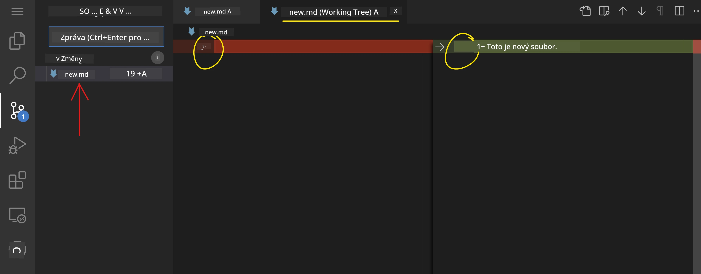

**Ukládání práce (commit workflow):**

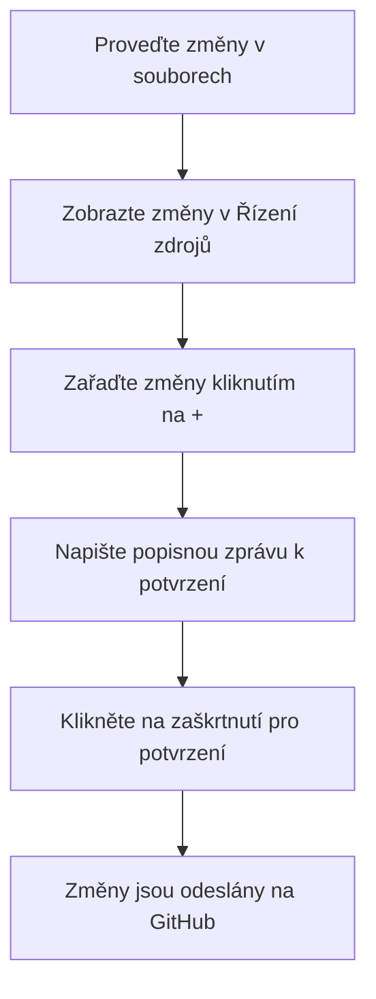
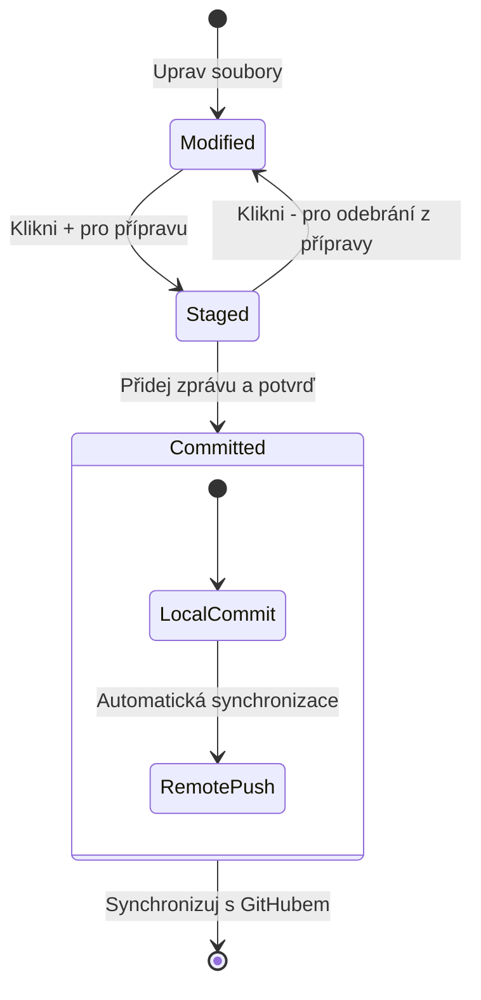
**Postup krok za krokem:**
- Klikněte na ikonu "+" u souborů, které chcete uložit (tím je „staged“)
- Dvakrát zkontrolujte, zda jste spokojeni se všemi připravenými změnami
- Napište krátkou poznámku vysvětlující, co jste udělali (to je vaše "zpráva commit")
- Klikněte na tlačítko s fajfkou, abyste vše uložili na GitHub
- Pokud si to rozmyslíte, ikona zpět vám umožní změny zahodit

**Jak psát dobré zprávy commit (je to snadnější, než si myslíte!):**
- Jednoduše popište, co jste udělali, například "Přidej kontaktní formulář" nebo "Oprav rozbitou navigaci"
- Buďte struční a výstižní – spíše jako tweet, než esej
- Začínejte slovesy jako "Přidej", "Oprav", "Aktualizuj" nebo "Odstraň"
- **Dobré příklady**: "Přidej responzivní navigační menu", "Oprav problémy s mobilním zobrazením", "Aktualizuj barvy pro lepší přístupnost"

> 💡 **Rychlý tip k navigaci**: Použijte hamburger menu (☰) v levém horním rohu, abyste se rychle dostali zpět do vašeho repozitáře na GitHubu a viděli vaše commity online. Je to jako portál mezi vaše pracovní prostředí a domovem projektu na GitHubu!

## Vylepšení funkcionality pomocí rozšíření

Stejně jako dílna řemeslníka obsahuje specializované nástroje pro různé úkoly, VSCode.dev lze přizpůsobit rozšířeními, která přidávají specifické funkce. Tyto pluginy vyvinuté komunitou řeší běžné potřeby vývoje jako formátování kódu, živý náhled a vylepšenou integraci s Gitem.

Marketplace rozšíření hostí tisíce bezplatných nástrojů vytvořených vývojáři z celého světa. Každé rozšíření řeší konkrétní výzvy v pracovních postupech, což vám umožní vytvořit si personalizované vývojové prostředí přizpůsobené vašim specifickým potřebám a preferencím.

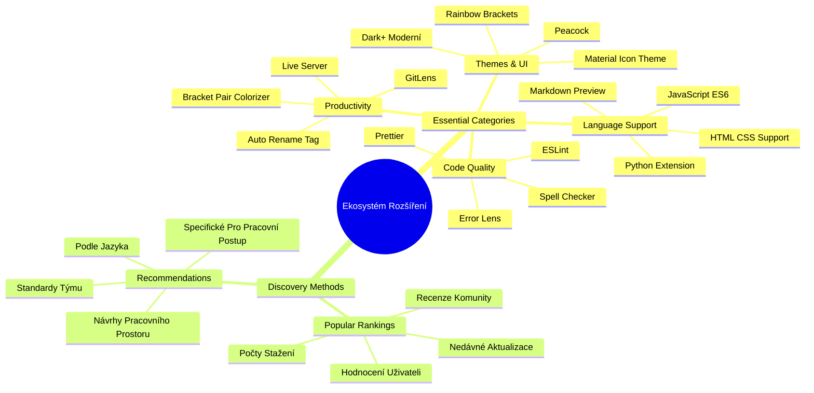
### Jak najít ta pravá rozšíření

Marketplace je opravdu dobře uspořádaný, takže se neztratíte při hledání, co potřebujete. Je navržen tak, aby vám pomohl objevit jak konkrétní nástroje, tak i zajímavé věci, o kterých jste ani nevěděli!

**Jak se dostat na marketplace:**

1. Klikněte na ikonu Rozšíření (🧩) v panelu aktivit
2. Prohlížejte si nebo vyhledejte něco konkrétního
3. Klikněte na cokoliv, co vypadá zajímavě, abyste se dozvěděli více

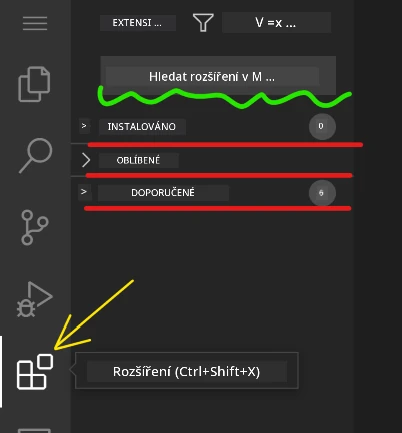

**Co tam uvidíte:**

| Sekce | Co obsahuje | Proč je užitečná |
|----------|---------|----------|
| **Nainstalovaná** | Rozšíření, která už máte přidaná | vaše osobní vývojová sada nástrojů |
| **Populární** | Oblíbené mezi uživateli | na které většina vývojářů spoléhá |
| **Doporučená** | Chytré návrhy pro váš projekt | užitečná doporučení VSCode.dev |

**Co usnadňuje prohlížení:**
- Každé rozšíření zobrazuje hodnocení, počet stažení a skutečné uživatelské recenze
- Dostanete screenshoty a jasné popisy funkcí
- Vše je jasně označeno informacemi o kompatibilitě
- Podobná rozšíření jsou navržena, abyste mohli porovnat možnosti

### Instalace rozšíření (je to opravdu snadné!)

Přidání nových schopností editoru je tak jednoduché jako kliknutí na tlačítko. Rozšíření se nainstaluje během pár sekund a ihned začne fungovat – není třeba restartovat nebo čekat.

**Stačí udělat toto:**

1. Vyhledejte, co chcete (zkuste vyhledat „live server“ nebo „prettier“)
2. Klikněte na vybrané rozšíření, abyste viděli podrobnosti
3. Přečtěte si, co rozšíření dělá, a zkontrolujte hodnocení
4. Stiskněte modré tlačítko „Install“ a máte hotovo!


**Co se děje na pozadí:**
- Rozšíření se automaticky stáhne a nastaví
- Nové funkce se ihned objeví v rozhraní
- Všechno začne fungovat okamžitě (vážně, je to tak rychlé!)
- Pokud jste přihlášení, rozšíření se synchronizuje na všechna vaše zařízení

**Některá rozšíření, která doporučuji začít používat:**
- **Live Server**: Vidíte své webové stránky aktualizovat v reálném čase při kódování (tohle je magické!)
- **Prettier**: Automaticky zkrášlí váš kód a udělá ho profesionální
- **Auto Rename Tag**: Změníte jednu HTML značku a její pár se automaticky aktualizuje
- **Bracket Pair Colorizer**: Barevně zvýrazní závorky, takže se nikdy neztratíte
- **GitLens**: Vylepšuje funkce Gitu spoustou užitečných informací

### Přizpůsobení rozšíření

Většina rozšíření nabízí nastavení, která si můžete upravit, aby fungovala přesně podle vašich představ. Je to jako nastavit si sedadlo a zrcátka v autě – každý má své preference!

**Jak upravovat nastavení rozšíření:**

1. Najděte své nainstalované rozšíření v panelu Rozšíření
2. Klikněte na ikonu ozubeného kola (⚙️) vedle jeho názvu
3. Vyberte „Extension Settings“ z nabídky
4. Upravujte nastavení, dokud to nebude vyhovovat vašemu pracovnímu postupu

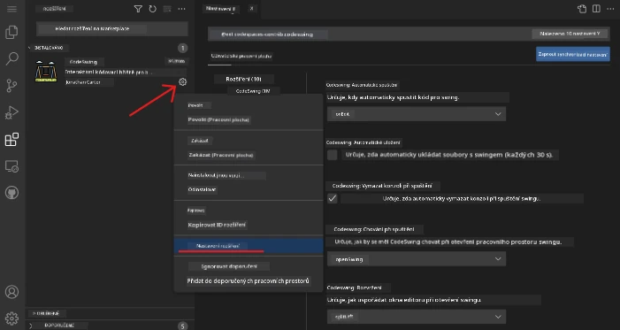

**Běžné věci, které byste mohli chtít upravit:**
- Jak se váš kód formátuje (záložky vs mezery, délka řádku apod.)
- Které klávesové zkratky vyvolají různé akce
- Pro jaké typy souborů má rozšíření fungovat
- Zapínání či vypínání specifických funkcí, aby prostředí zůstalo přehledné

### Udržování pořádku v rozšířeních

Jak objevujete další a další zajímavá rozšíření, budete chtít mít svou sbírku organizovanou a hladce fungující. VSCode.dev to velmi usnadňuje.

**Možnosti správy rozšíření:**

| Co můžete dělat | Kdy je to užitečné | Tip pro vás |
|--------|---------|----------|
| **Zakázat** | Když testujete, jestli rozšíření nezpůsobuje problémy | Lepší než odinstalace, pokud si ho možná chcete ponechat |
| **Odinstalovat** | Kompletní odstranění nepotřebných rozšíření | Udrží vaše prostředí čisté a rychlé |
| **Aktualizovat** | Získání nejnovějších funkcí a oprav chyb | Obvykle probíhá automaticky, ale stojí za kontrolu |

**Jak já spravuji rozšíření:**
- Každé pár měsíců si projdu, co mám nainstalované, a odstraním, co nepoužívám
- Udržuji rozšíření aktuální, abych získal nejnovější vylepšení a bezpečnostní záplaty
- Pokud se něco zdá pomalé, dočasně rozšíření zakážu, abych zjistil, jestli není příčinou výkonu
- Čtu si poznámky k verzím při zásadních aktualizacích – někdy přibyly skvělé nové funkce!

> ⚠️ **Tip pro výkon**: Rozšíření jsou skvělá, ale příliš mnoho jich může všechno zpomalit. Zaměřte se na ta, která vám skutečně usnadňují práci, a nebojte se odinstalovat ta, která nikdy nepoužíváte.

### 🎯 Pedagogická kontrola: Přizpůsobení vývojového prostředí

**Porozumění architektuře**: Naučili jste se přizpůsobovat profesionální vývojové prostředí pomocí rozšíření vytvořených komunitou. To odpovídá tomu, jak podnikové týmy budují standardizované nástroje.

**Klíčové ovládnuté koncepty**:
- **Objevování rozšíření**: Najít nástroje k řešení specifických výzev při vývoji
- **Konfigurace prostředí**: Upravovat nástroje tak, aby seděly osobním nebo týmovým preferencím
- **Optimalizace výkonu**: Vyvažování funkčnosti a systémového výkonu
- **Spolupráce komunity**: Využívání nástrojů vytvořených globální vývojářskou komunitou

**Propojení s průmyslem**: Ekosystémy rozšíření pohánějí hlavní vývojové platformy jako VS Code, Chrome DevTools a moderní IDE. Umět vyhodnotit, nainstalovat a nakonfigurovat rozšíření je klíčové pro profesionální pracovní postupy.

**Reflexní otázka**: Jak byste přistoupili k vytvoření standardizovaného vývojového prostředí pro tým 10 vývojářů? Zvažte konzistenci, výkon a individuální preference.

## 📈 Váš časový plán zvládnutí cloudového vývoje

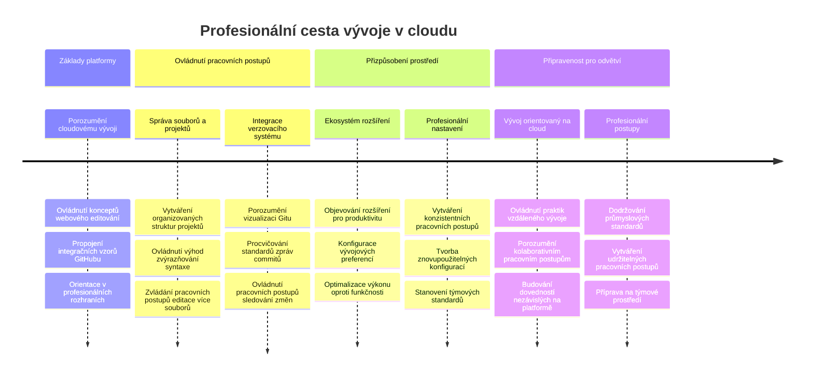
**🎓 Milník dokončení**: Úspěšně jste zvládli cloudový vývoj pomocí stejných nástrojů a postupů, jaké používají profesionální vývojáři v největších tech firmách. Tyto dovednosti představují budoucnost softwarového vývoje.

**🔄 Schopnosti příští úrovně**:
- Připravení prozkoumat pokročilé cloudové platformy (Codespaces, GitPod)
- Připraveni pracovat v distribuovaných vývojových týmech
- Oblečeni pro přispívání do open source projektů globálně
- Základ pro moderní DevOps a kontinuální integraci

## Výzva GitHub Copilot Agenta 🚀

Stejně jako NASA používá strukturovaný přístup pro vesmírné mise, tato výzva zahrnuje systematické použití VSCode.dev dovedností v kompletním scénáři pracovního postupu.

**Cíl:** Prokázat znalost VSCode.dev vytvořením komplexního workflow pro webový vývoj.

**Požadavky projektu:** S pomocí režimu Agenta proveďte tyto kroky:
1. Forkujte existující repozitář nebo vytvořte nový
2. Nastavte funkční strukturu projektu s HTML, CSS a JavaScriptem
3. Nainstalujte a nakonfigurujte tři rozšíření zlepšující vývoj
4. Procvičujte správu verzí s popisnými zprávami commit
5. Experimentujte s vytvářením a úpravou feature branchí
6. Zdokumentujte proces a poznatky v souboru README.md

Tento úkol integruje všechny koncepty VSCode.dev do praktického workflow, které můžete použít pro budoucí vývojové projekty.

Více o [režimu agenta](https://code.visualstudio.com/blogs/2025/02/24/introducing-copilot-agent-mode) si přečtěte zde.

## Úkol

Je čas si tyto dovednosti vyzkoušet v praxi! Mám pro vás praktický projekt, který vám umožní procvičit vše, co jsme probírali: [Vytvořte webové stránky s životopisem pomocí VSCode.dev](./assignment.md)

Tento úkol vás provede vytvářením profesionálního webu s životopisem zcela ve vašem prohlížeči. Použijete všechny probrané funkce VSCode.dev a na konci budete mít nejen skvěle vypadající stránky, ale i pevné sebevědomí ve svém novém pracovním postupu.

## Pokračujte v objevování a zlepšování svých dovedností

Máte pevné základy, ale je tu spousta dalších skvělých věcí, které můžete objevovat! Tady jsou některé zdroje a nápady, jak své VSCode.dev dovednosti posunout dál:

**Oficiální dokumentace, kterou stojí za to mít v záložkách:**
- [VSCode Web Documentace](https://code.visualstudio.com/docs/editor/vscode-web?WT.mc_id=academic-0000-alfredodeza) – kompletní průvodce úprav v prohlížeči
- [GitHub Codespaces](https://docs.github.com/en/codespaces) – pokud chcete ještě větší výkon v cloudu

**Zajímavé funkce k další zkoušce:**
- **Klávesové zkratky**: Naučte se kombinace, díky kterým budete jako ninja v kódování
- **Nastavení workspace**: Nastavte různá prostředí pro různé typy projektů
- **Workspace s více kořeny**: Pracujte na více repozitářích najednou (velmi užitečné!)
- **Integrace terminálu**: Přístup k příkazové řádce přímo v prohlížeči

**Nápady na procvičování:**
- Připojte se k open-source projektům a přispívejte pomocí VSCode.dev – je to skvělý způsob, jak něco vrátit komunitě!
- Vyzkoušejte různá rozšíření a najděte své ideální nastavení
- Vytvářejte šablony projektů pro typy webů, které děláte nejčastěji
- Procvičujte Git workflow jako větvení a slučování – tyto dovednosti jsou zlato v týmových projektech

---

**Ovládli jste vývoj v prohlížeči!** 🎉 Stejně jako vynález přenosných přístrojů umožnil vědcům dělat výzkum v odlehlých místech, VSCode.dev umožňuje profesionální kódování odkudkoliv s připojením k internetu.

Tyto dovednosti odrážejí současné postupy v průmyslu – mnoho profesionálních vývojářů používá cloudová vývojová prostředí pro jejich flexibilitu a dostupnost. Naučili jste se workflow, které škáluje od individuálních projektů až po velké týmové spolupráce.

Použijte tyto techniky ve svém dalším vývojovém projektu! 🚀

---

<!-- CO-OP TRANSLATOR DISCLAIMER START -->
**Prohlášení o vyloučení odpovědnosti**:
Tento dokument byl přeložen pomocí AI překladatelské služby [Co-op Translator](https://github.com/Azure/co-op-translator). Přestože usilujeme o přesnost, mějte prosím na paměti, že automatizované překlady mohou obsahovat chyby nebo nepřesnosti. Originální dokument v jeho mateřském jazyce by měl být považován za závazný zdroj. Pro důležité informace se doporučuje profesionální lidský překlad. Za jakékoliv nedorozumění nebo mylné výklady vzniklé použitím tohoto překladu neneseme odpovědnost.
<!-- CO-OP TRANSLATOR DISCLAIMER END -->