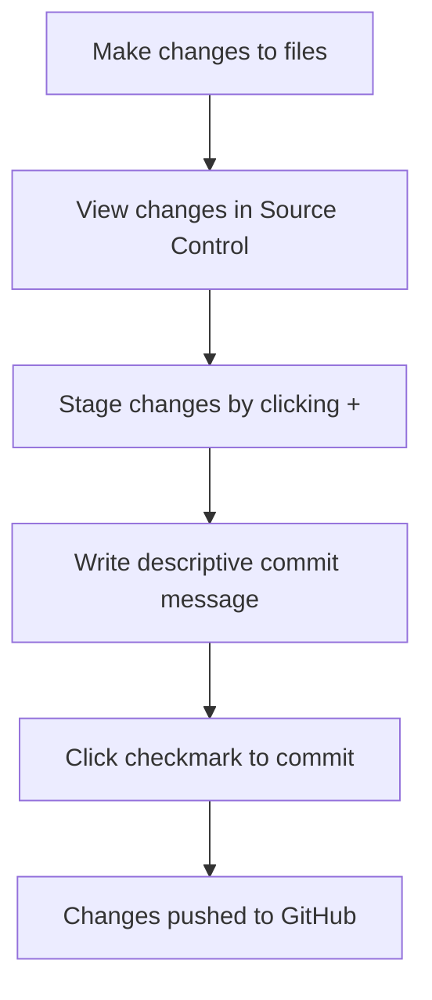

<!--
CO_OP_TRANSLATOR_METADATA:
{
  "original_hash": "cfd4a15974168ca426d50c67682ab9d4",
  "translation_date": "2025-10-24T20:43:29+00:00",
  "source_file": "8-code-editor/1-using-a-code-editor/README.md",
  "language_code": "cs"
}
-->
# Používání editoru kódu: Ovládnutí VSCode.dev

Pamatujete si na *Matrix*, když Neo musel být připojen k obrovskému počítačovému terminálu, aby se dostal do digitálního světa? Dnešní nástroje pro webový vývoj jsou úplně jiný příběh – neuvěřitelně výkonné možnosti dostupné odkudkoliv. VSCode.dev je editor kódu založený na prohlížeči, který přináší profesionální vývojářské nástroje na jakékoli zařízení s připojením k internetu.

Stejně jako knihtisk zpřístupnil knihy všem, nejen písařům v klášterech, VSCode.dev demokratizuje programování. Můžete pracovat na projektech z knihovního počítače, školní laboratoře nebo odkudkoliv, kde máte přístup k prohlížeči. Žádné instalace, žádné omezení „potřebuji svůj specifický setup“.

Na konci této lekce budete rozumět tomu, jak se orientovat ve VSCode.dev, otevírat GitHub repozitáře přímo v prohlížeči a používat Git pro správu verzí – dovednosti, na které se profesionální vývojáři spoléhají každý den.

## Co se naučíte

Po společném průchodu budete schopni:

- Orientovat se ve VSCode.dev jako ve svém druhém domově – najít vše, co potřebujete, aniž byste se ztratili
- Otevřít jakýkoliv GitHub repozitář ve svém prohlížeči a okamžitě začít upravovat (tohle je opravdu kouzelné!)
- Používat Git ke sledování změn a ukládání pokroku jako profesionál
- Zrychlit svůj editor pomocí rozšíření, která činí programování rychlejším a zábavnějším
- Vytvářet a organizovat soubory projektů s jistotou

## Co budete potřebovat

Požadavky jsou jednoduché:

- Zdarma [GitHub účet](https://github.com) (provedeme vás jeho vytvořením, pokud bude potřeba)
- Základní znalost webových prohlížečů
- Lekce Základy GitHubu poskytuje užitečné pozadí, i když není nezbytná

> 💡 **Noví na GitHubu?** Vytvoření účtu je zdarma a zabere jen pár minut. Stejně jako knihovní průkaz vám umožní přístup ke knihám po celém světě, GitHub účet vám otevře dveře k repozitářům kódu na internetu.

## Proč jsou editory kódu založené na webu důležité

Před internetem nemohli vědci na různých univerzitách snadno sdílet výzkum. Pak přišel ARPANET v 60. letech, který spojil počítače na dálku. Editory kódu založené na webu následují stejný princip – zpřístupňují výkonné nástroje bez ohledu na vaši fyzickou polohu nebo zařízení.

Editor kódu slouží jako vaše pracovní prostředí pro vývoj, kde píšete, upravujete a organizujete soubory kódu. Na rozdíl od jednoduchých textových editorů poskytují profesionální editory kódu zvýraznění syntaxe, detekci chyb a funkce pro správu projektů.

VSCode.dev přináší tyto schopnosti do vašeho prohlížeče:

**Výhody webového editování:**

| Funkce | Popis | Praktický přínos |
|---------|-------------|----------|
| **Nezávislost na platformě** | Funguje na jakémkoliv zařízení s prohlížečem | Práce z různých počítačů bez problémů |
| **Bez nutnosti instalace** | Přístup přes webovou adresu | Obcházení omezení instalace softwaru |
| **Automatické aktualizace** | Vždy běží na nejnovější verzi | Přístup k novým funkcím bez manuálních aktualizací |
| **Integrace repozitářů** | Přímé propojení s GitHubem | Úprava kódu bez správy lokálních souborů |

**Praktické důsledky:**
- Kontinuita práce v různých prostředích
- Konzistentní rozhraní bez ohledu na operační systém
- Okamžité možnosti spolupráce
- Snížené požadavky na místní úložiště

## Prozkoumání VSCode.dev

Stejně jako laboratoř Marie Curie obsahovala sofistikované vybavení v relativně jednoduchém prostoru, VSCode.dev balí profesionální vývojářské nástroje do rozhraní prohlížeče. Tato webová aplikace poskytuje stejnou základní funkčnost jako desktopové editory kódu.

Začněte navigací na [vscode.dev](https://vscode.dev) ve svém prohlížeči. Rozhraní se načte bez stahování nebo instalace systému – přímá aplikace principů cloud computingu.

### Připojení vašeho GitHub účtu

Stejně jako telefon Alexandra Grahama Bella spojoval vzdálené lokace, propojení vašeho GitHub účtu propojuje VSCode.dev s vašimi repozitáři kódu. Když budete vyzváni k přihlášení pomocí GitHubu, doporučuje se toto propojení přijmout.

**Integrace GitHubu poskytuje:**
- Přímý přístup k vašim repozitářům v editoru
- Synchronizované nastavení a rozšíření napříč zařízeními
- Zjednodušený pracovní postup ukládání na GitHub
- Personalizované vývojářské prostředí

### Seznámení s novým pracovním prostředím

Jakmile se vše načte, uvidíte krásně čisté pracovní prostředí, které je navrženo tak, aby vás udrželo soustředěné na to, co je důležité – váš kód!

**Tady je vaše prohlídka okolí:**
- **Panel aktivit** (ten proužek vlevo): Vaše hlavní navigace s Průzkumníkem 📁, Vyhledáváním 🔍, Správou verzí 🌿, Rozšířeními 🧩 a Nastavením ⚙️
- **Postranní panel** (panel vedle něj): Mění se, aby vám ukázal relevantní informace na základě toho, co jste vybrali
- **Oblast editoru** (velký prostor uprostřed): Tady se děje magie – vaše hlavní oblast pro psaní kódu

**Věnujte chvíli prozkoumání:**
- Klikněte na ikony v Panelu aktivit a podívejte se, co každá z nich dělá
- Všimněte si, jak se postranní panel aktualizuje, aby zobrazoval různé informace – docela šikovné, že?
- Pohled Průzkumníka (📁) je pravděpodobně místo, kde strávíte většinu času, takže se s ním seznamte

## Otevírání GitHub repozitářů

Před internetem museli výzkumníci fyzicky cestovat do knihoven, aby získali přístup k dokumentům. GitHub repozitáře fungují podobně – jsou to sbírky kódu uložené na dálku. VSCode.dev eliminuje tradiční krok stahování repozitářů na váš lokální počítač před jejich úpravou.

Tato funkce umožňuje okamžitý přístup k jakémukoliv veřejnému repozitáři pro prohlížení, úpravy nebo přispívání. Zde jsou dva způsoby, jak otevřít repozitáře:

### Metoda 1: Klikací cesta

Tohle je ideální, když začínáte ve VSCode.dev a chcete otevřít konkrétní repozitář. Je to jednoduché a přátelské pro začátečníky:

**Jak na to:**

1. Přejděte na [vscode.dev](https://vscode.dev), pokud tam ještě nejste
2. Na úvodní obrazovce vyhledejte tlačítko „Open Remote Repository“ a klikněte na něj

   

3. Vložte URL jakéhokoliv GitHub repozitáře (zkuste tento: `https://github.com/microsoft/Web-Dev-For-Beginners`)
4. Stiskněte Enter a sledujte kouzlo!

**Tip pro profíky - Zkratka Command Palette:**

Chcete se cítit jako kouzelník programování? Vyzkoušejte tuto klávesovou zkratku: Ctrl+Shift+P (nebo Cmd+Shift+P na Macu) pro otevření Command Palette:

**Command Palette je jako vyhledávač pro vše, co můžete dělat:**
- Zadejte „open remote“ a najde vám otvírač repozitářů
- Pamatuje si repozitáře, které jste nedávno otevřeli (super praktické!)
- Jakmile si na to zvyknete, budete se cítit, jako byste programovali rychlostí blesku
- Je to v podstatě verze VSCode.dev „Hej Siri, ale pro programování“

### Metoda 2: Technika úpravy URL

Stejně jako HTTP a HTTPS používají různé protokoly při zachování stejné struktury domény, VSCode.dev používá vzor URL, který zrcadlí adresní systém GitHubu. Jakékoliv URL GitHub repozitáře lze upravit tak, aby se otevřelo přímo ve VSCode.dev.

**Vzor transformace URL:**

| Typ repozitáře | GitHub URL | VSCode.dev URL |
|----------------|---------------------|----------------|
| **Veřejný repozitář** | `github.com/microsoft/Web-Dev-For-Beginners` | `vscode.dev/github/microsoft/Web-Dev-For-Beginners` |
| **Osobní projekt** | `github.com/your-username/my-project` | `vscode.dev/github/your-username/my-project` |
| **Jakýkoliv dostupný repozitář** | `github.com/their-username/awesome-repo` | `vscode.dev/github/their-username/awesome-repo` |

**Implementace:**
- Nahraďte `github.com` za `vscode.dev/github`
- Zachovejte všechny ostatní komponenty URL beze změny
- Funguje s jakýmkoliv veřejně dostupným repozitářem
- Poskytuje okamžitý přístup k úpravám

> 💡 **Tip, který změní život**: Uložte si VSCode.dev verze vašich oblíbených repozitářů do záložek. Mám záložky jako „Edit My Portfolio“ a „Fix Documentation“, které mě vezmou přímo do režimu úprav!

**Kterou metodu byste měli použít?**
- **Cesta přes rozhraní**: Skvělá, když prozkoumáváte nebo si nepamatujete přesné názvy repozitářů
- **Trik s URL**: Ideální pro bleskový přístup, když přesně víte, kam jdete

## Práce se soubory a projekty

Teď, když máte repozitář otevřený, pojďme začít stavět! VSCode.dev vám poskytuje vše, co potřebujete k vytvoření, úpravě a organizaci vašich souborů kódu. Myslete na to jako na svůj digitální workshop – každý nástroj je přesně tam, kde ho potřebujete.

Pojďme se ponořit do každodenních úkolů, které budou tvořit většinu vašeho pracovního postupu při programování.

### Vytváření nových souborů

Stejně jako organizování plánů v kanceláři architekta, vytváření souborů ve VSCode.dev následuje strukturovaný přístup. Systém podporuje všechny standardní typy souborů pro webový vývoj.

**Proces vytváření souborů:**

1. Přejděte do cílové složky v postranním panelu Průzkumníka
2. Přejeďte myší nad názvem složky, aby se zobrazila ikona „Nový soubor“ (📄+)
3. Zadejte název souboru včetně příslušné přípony (`style.css`, `script.js`, `index.html`)
4. Stiskněte Enter pro vytvoření souboru

**Konvence pojmenování:**
- Používejte popisné názvy, které naznačují účel souboru
- Zahrňte přípony souborů pro správné zvýraznění syntaxe
- Dodržujte konzistentní vzory pojmenování napříč projekty
- Používejte malá písmena a pomlčky místo mezer

### Úprava a ukládání souborů

Tady začíná ta pravá zábava! Editor VSCode.dev je plný užitečných funkcí, které činí programování hladkým a intuitivním. Je to jako mít opravdu chytrého asistenta pro psaní, ale pro kód.

**Váš pracovní postup úprav:**

1. Klikněte na jakýkoliv soubor v Průzkumníku, aby se otevřel v hlavní oblasti
2. Začněte psát a sledujte, jak vám VSCode.dev pomáhá s barvami, návrhy a odhalováním chyb
3. Uložte svou práci pomocí Ctrl+S (Windows/Linux) nebo Cmd+S (Mac) – i když se ukládá automaticky!

**Skvělé věci, které se dějí během psaní kódu:**
- Váš kód je krásně barevně zvýrazněn, takže se snadno čte
- VSCode.dev navrhuje doplnění během psaní (jako automatické opravy, ale mnohem chytřejší)
- Chytá překlepy a chyby ještě před uložením
- Můžete mít otevřené více souborů na záložkách, stejně jako v prohlížeči
- Vše se automaticky ukládá na pozadí

> ⚠️ **Rychlý tip**: I když automatické ukládání vás chrání, stisknutí Ctrl+S nebo Cmd+S je stále dobrý zvyk. Okamžitě uloží vše a spustí některé extra užitečné funkce, jako je kontrola chyb.

### Správa verzí pomocí Git

Stejně jako archeologové vytvářejí podrobné záznamy vrstev vykopávek, Git sleduje změny ve vašem kódu v průběhu času. Tento systém uchovává historii projektu a umožňuje vám vrátit se k předchozím verzím, když je to potřeba. VSCode.dev obsahuje integrovanou funkčnost Gitu.

**Rozhraní správy verzí:**

1. Přístup k panelu Správa verzí přes ikonu 🌿 v Panelu aktivit
2. Upravené soubory se zobrazí v sekci „Changes“
3. Barevné kódování označuje typy změn: zelená pro přidání, červená pro odstranění

**Ukládání vaší práce (pracovní postup commit):**

**Tady je váš krok za krokem:**
- Klikněte na ikonu „+“ vedle souborů, které chcete uložit (tím je „stáhnete“)
- Dvakrát zkontrolujte, že jste spokojeni se všemi stáhnutými změnami
- Napište krátkou poznámku, co jste udělali (to je vaše „commit message“)
- Klikněte na tlačítko zaškrtnutí, abyste vše uložili na GitHub
- Pokud si něco rozmyslíte, ikona zpět vám umožní zrušit změny

**Psání dobrých commit zpráv (je to jednodušší, než si myslíte!):**
- Prostě popište, co jste udělali, například „Přidání kontaktního formuláře“ nebo „Oprava nefunkční navigace“
- Udržujte to krátké a výstižné – myslete na délku tweetu, ne na esej
- Začněte akčními slovy jako „Přidat“, „Opravit“, „Aktualizovat“ nebo „Odstranit“
- **Dobré příklady**: „Přidání responzivního navigačního menu“, „Oprava problémů s mobilním rozvržením“, „Aktualizace barev pro lepší přístupnost“

> 💡 **Rychlý navigační tip**: Použijte hamburgerové menu (☰) v levém horním rohu, abyste se vrátili zpět do svého GitHub repozitáře a viděli své uložené změny online. Je to jako portál mezi vaším editačním prostředím a domovem vašeho projektu na GitHubu!

## Rozšíření funkcionality pomocí rozšíření

Stejně jako dílna řemeslníka obsahuje
- Každé rozšíření ukazuje hodnocení, počet stažení a skutečné recenze uživatelů
- Získáte snímky obrazovky a jasné popisy, co každé rozšíření dělá
- Vše je jasně označeno informacemi o kompatibilitě
- Jsou navržena podobná rozšíření, abyste mohli porovnat možnosti

### Instalace rozšíření (Je to opravdu snadné!)

Přidání nových funkcí do vašeho editoru je tak jednoduché, jako kliknout na tlačítko. Rozšíření se instalují během několika sekund a začnou okamžitě fungovat – žádné restartování, žádné čekání.

**Co musíte udělat:**

1. Vyhledejte, co potřebujete (zkuste hledat "live server" nebo "prettier")
2. Klikněte na rozšíření, které vypadá dobře, abyste viděli více podrobností
3. Přečtěte si, co rozšíření dělá, a zkontrolujte hodnocení
4. Klikněte na modré tlačítko "Install" a máte hotovo!

**Co se děje na pozadí:**
- Rozšíření se automaticky stáhne a nastaví
- Nové funkce se okamžitě objeví ve vašem rozhraní
- Vše začne fungovat okamžitě (opravdu, je to tak rychlé!)
- Pokud jste přihlášeni, rozšíření se synchronizuje na všech vašich zařízeních

**Některá rozšíření, která doporučuji začít používat:**
- **Live Server**: Sledujte, jak se vaše webová stránka aktualizuje v reálném čase během kódování (tohle je kouzelné!)
- **Prettier**: Automaticky upravuje váš kód, aby vypadal čistě a profesionálně
- **Auto Rename Tag**: Změňte jeden HTML tag a jeho protějšek se automaticky aktualizuje
- **Bracket Pair Colorizer**: Barevně označuje závorky, abyste se v kódu neztratili
- **GitLens**: Vylepšuje vaše funkce Git o spoustu užitečných informací

### Přizpůsobení vašich rozšíření

Většina rozšíření má nastavení, která můžete upravit tak, aby fungovala přesně podle vašich představ. Je to jako nastavení sedadla a zrcátek v autě – každý má své preference!

**Úprava nastavení rozšíření:**

1. Najděte své nainstalované rozšíření v panelu Rozšíření
2. Vyhledejte malou ikonu ozubeného kola (⚙️) vedle jeho názvu a klikněte na ni
3. Vyberte "Nastavení rozšíření" z rozbalovací nabídky
4. Upravte nastavení tak, aby vyhovovala vašemu pracovnímu stylu

**Běžné věci, které můžete chtít upravit:**
- Jak se váš kód formátuje (tabulátory vs mezery, délka řádku atd.)
- Jaké klávesové zkratky spouštějí různé akce
- S jakými typy souborů by mělo rozšíření pracovat
- Zapnutí nebo vypnutí konkrétních funkcí, aby vše zůstalo přehledné

### Udržování rozšíření v pořádku

Jak budete objevovat další skvělá rozšíření, budete chtít udržet svou sbírku přehlednou a funkční. VSCode.dev vám to velmi usnadní.

**Možnosti správy rozšíření:**

| Co můžete udělat | Kdy je to užitečné | Tip |
|--------|---------|----------|
| **Deaktivovat** | Testování, zda rozšíření způsobuje problémy | Lepší než odinstalace, pokud ho možná budete chtít znovu |
| **Odinstalovat** | Kompletní odstranění rozšíření, která nepotřebujete | Udržuje vaše prostředí čisté a rychlé |
| **Aktualizovat** | Získání nejnovějších funkcí a oprav chyb | Obvykle se děje automaticky, ale stojí za to zkontrolovat |

**Jak spravuji rozšíření:**
- Každých pár měsíců zkontroluji, co jsem nainstaloval, a odstraním vše, co nepoužívám
- Udržuji rozšíření aktualizovaná, abych získal nejnovější vylepšení a bezpečnostní opravy
- Pokud se něco zdá pomalé, dočasně deaktivuji rozšíření, abych zjistil, zda je to příčina
- Čtu poznámky k aktualizacím, když rozšíření dostanou větší aktualizace – někdy jsou tam skvělé nové funkce!

> ⚠️ **Tip na výkon**: Rozšíření jsou skvělá, ale příliš mnoho jich může zpomalit práci. Zaměřte se na ta, která vám skutečně usnadňují život, a nebojte se odinstalovat ta, která nepoužíváte.

## Výzva GitHub Copilot Agent 🚀

Stejně jako strukturovaný přístup NASA k vesmírným misím, tato výzva zahrnuje systematické použití dovedností VSCode.dev v kompletním pracovním scénáři.

**Cíl:** Prokázat znalosti VSCode.dev vytvořením komplexního pracovního postupu pro webový vývoj.

**Požadavky na projekt:** S pomocí režimu Agent splňte tyto úkoly:
1. Forkněte existující repozitář nebo vytvořte nový
2. Vytvořte funkční strukturu projektu s HTML, CSS a JavaScript soubory
3. Nainstalujte a nakonfigurujte tři rozšíření, která zlepšují vývoj
4. Procvičte si verzování s popisnými zprávami o commitech
5. Experimentujte s vytvářením a úpravou feature větví
6. Dokumentujte proces a poznatky v souboru README.md

Toto cvičení konsoliduje všechny koncepty VSCode.dev do praktického pracovního postupu, který lze použít v budoucích vývojových projektech.

Více o [režimu agent](https://code.visualstudio.com/blogs/2025/02/24/introducing-copilot-agent-mode) se dozvíte zde.

## Zadání

Je čas vyzkoušet tyto dovednosti v praxi! Mám pro vás praktický projekt, který vám umožní procvičit vše, co jsme probrali: [Vytvořte webovou stránku životopisu pomocí VSCode.dev](./assignment.md)

Toto zadání vás provede vytvořením profesionální webové stránky životopisu zcela ve vašem prohlížeči. Použijete všechny funkce VSCode.dev, které jsme prozkoumali, a na konci budete mít nejen skvěle vypadající webovou stránku, ale také pevnou důvěru ve svůj nový pracovní postup.

## Pokračujte v objevování a rozvíjení svých dovedností

Máte nyní pevné základy, ale je tu ještě spousta skvělých věcí k objevování! Zde jsou některé zdroje a nápady, jak posunout své dovednosti s VSCode.dev na další úroveň:

**Oficiální dokumentace, kterou stojí za to si uložit:**
- [Dokumentace VSCode Web](https://code.visualstudio.com/docs/editor/vscode-web?WT.mc_id=academic-0000-alfredodeza) – Kompletní průvodce úpravami v prohlížeči
- [GitHub Codespaces](https://docs.github.com/en/codespaces) – Když chcete ještě více síly v cloudu

**Skvělé funkce, které můžete vyzkoušet:**
- **Klávesové zkratky**: Naučte se kombinace kláves, které z vás udělají mistra kódování
- **Nastavení pracovního prostoru**: Nastavte si různá prostředí pro různé typy projektů
- **Pracovní prostory s více kořeny**: Pracujte na více repozitářích současně (velmi užitečné!)
- **Integrace terminálu**: Přístup k nástrojům příkazového řádku přímo ve vašem prohlížeči

**Nápady na procvičování:**
- Zapojte se do některých open-source projektů a přispívejte pomocí VSCode.dev – je to skvělý způsob, jak vrátit komunitě!
- Vyzkoušejte různá rozšíření a najděte si ideální nastavení
- Vytvořte šablony projektů pro typy webů, které nejčastěji vytváříte
- Procvičte si Git pracovní postupy, jako je větvení a slučování – tyto dovednosti jsou zlaté v týmových projektech

---

**Ovládli jste vývoj v prohlížeči!** 🎉 Stejně jako vynález přenosných přístrojů umožnil vědcům provádět výzkum na odlehlých místech, VSCode.dev umožňuje profesionální kódování z jakéhokoli zařízení připojeného k internetu.

Tyto dovednosti odrážejí současné průmyslové praktiky – mnoho profesionálních vývojářů používá cloudová vývojová prostředí pro jejich flexibilitu a dostupnost. Naučili jste se pracovní postup, který se hodí jak pro individuální projekty, tak pro velké týmové spolupráce.

Použijte tyto techniky ve svém dalším vývojovém projektu! 🚀

---

**Prohlášení**:  
Tento dokument byl přeložen pomocí služby AI pro překlad [Co-op Translator](https://github.com/Azure/co-op-translator). I když se snažíme o přesnost, mějte prosím na paměti, že automatizované překlady mohou obsahovat chyby nebo nepřesnosti. Původní dokument v jeho rodném jazyce by měl být považován za autoritativní zdroj. Pro důležité informace se doporučuje profesionální lidský překlad. Neodpovídáme za žádná nedorozumění nebo nesprávné interpretace vyplývající z použití tohoto překladu.