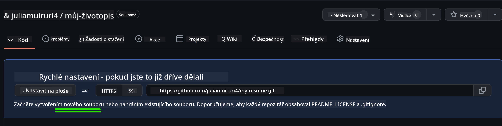

<!--
CO_OP_TRANSLATOR_METADATA:
{
  "original_hash": "effe56ba51c38d7bdfad1ea38288666b",
  "translation_date": "2025-10-24T20:44:12+00:00",
  "source_file": "8-code-editor/1-using-a-code-editor/assignment.md",
  "language_code": "cs"
}
-->
# Vytvořte webovou stránku životopisu pomocí VSCode.dev

Zlepšete své kariérní vyhlídky vytvořením profesionální webové stránky životopisu, která interaktivním a moderním způsobem představí vaše dovednosti a zkušenosti. Místo zasílání tradičních PDF si představte, že poskytujete personalistům elegantní, responzivní webovou stránku, která ukazuje nejen vaše kvalifikace, ale i vaše schopnosti v oblasti webového vývoje.

Tento praktický úkol vám umožní využít všechny vaše dovednosti z VSCode.dev při tvorbě něčeho skutečně užitečného pro vaši kariéru. Zažijete kompletní pracovní postup webového vývoje – od vytvoření repozitáře až po nasazení – vše přímo ve vašem prohlížeči.

Po dokončení tohoto projektu budete mít profesionální online prezentaci, kterou můžete snadno sdílet s potenciálními zaměstnavateli, aktualizovat podle toho, jak se vaše dovednosti rozvíjejí, a přizpůsobit ji svému osobnímu stylu. Přesně takový praktický projekt ukazuje skutečné dovednosti v oblasti webového vývoje.

## Cíle učení

Po dokončení tohoto úkolu budete schopni:

- **Vytvořit** a spravovat kompletní projekt webového vývoje pomocí VSCode.dev
- **Strukturovat** profesionální webovou stránku pomocí sémantických HTML prvků
- **Stylovat** responzivní rozvržení pomocí moderních technik CSS
- **Implementovat** interaktivní funkce pomocí základních webových technologií
- **Nasadit** živou webovou stránku dostupnou prostřednictvím sdíleného URL
- **Demonstrovat** osvědčené postupy verzování během celého procesu vývoje

## Předpoklady

Před zahájením tohoto úkolu se ujistěte, že máte:

- Účet na GitHubu (pokud ho nemáte, vytvořte si ho na [github.com](https://github.com/))
- Dokončenou lekci VSCode.dev, která pokrývá navigaci v rozhraní a základní operace
- Základní znalosti struktury HTML a konceptů stylování CSS

## Nastavení projektu a vytvoření repozitáře

Začněme nastavením základů vašeho projektu. Tento proces odráží pracovní postupy reálného vývoje, kde projekty začínají správnou inicializací repozitáře a plánováním struktury.

### Krok 1: Vytvořte svůj GitHub repozitář

Nastavení dedikovaného repozitáře zajistí, že váš projekt bude od začátku správně organizován a verzován.

1. **Přejděte** na [GitHub.com](https://github.com) a přihlaste se ke svému účtu
2. **Klikněte** na zelené tlačítko „New“ nebo na ikonu „+“ v pravém horním rohu
3. **Pojmenujte** svůj repozitář `my-resume` (nebo zvolte personalizované jméno jako `john-smith-resume`)
4. **Přidejte** krátký popis: „Profesionální webová stránka životopisu vytvořená pomocí HTML a CSS“
5. **Vyberte** „Public“, aby byl váš životopis přístupný potenciálním zaměstnavatelům
6. **Zaškrtněte** „Add a README file“ pro vytvoření úvodního popisu projektu
7. **Klikněte** na „Create repository“ pro dokončení nastavení

> 💡 **Tip pro pojmenování repozitáře**: Používejte popisná, profesionální jména, která jasně indikují účel projektu. To pomáhá při sdílení s zaměstnavateli nebo během hodnocení portfolia.

### Krok 2: Inicializace struktury projektu

Protože VSCode.dev vyžaduje alespoň jeden soubor pro otevření repozitáře, vytvoříme hlavní HTML soubor přímo na GitHubu, než přejdeme do webového editoru.

1. **Klikněte** na odkaz „creating a new file“ ve vašem novém repozitáři
2. **Zadejte** `index.html` jako název souboru
3. **Přidejte** tuto počáteční HTML strukturu:

```html
<!DOCTYPE html>
<html lang="en">
<head>
    <meta charset="UTF-8">
    <meta name="viewport" content="width=device-width, initial-scale=1.0">
    <title>Your Name - Professional Resume</title>
</head>
<body>
    <h1>Your Name</h1>
    <p>Professional Resume Website</p>
</body>
</html>
```

4. **Napište** zprávu ke commitu: „Přidání počáteční HTML struktury“
5. **Klikněte** na „Commit new file“ pro uložení změn



**Co tento počáteční setup zajišťuje:**
- **Zavádí** správnou HTML5 strukturu dokumentu se sémantickými prvky
- **Obsahuje** meta tag viewportu pro kompatibilitu responzivního designu
- **Nastavuje** popisný název stránky, který se zobrazuje na záložkách prohlížeče
- **Vytváří** základ pro profesionální organizaci obsahu

## Práce ve VSCode.dev

Nyní, když je základ vašeho repozitáře nastaven, přejděme do VSCode.dev pro hlavní práci na vývoji. Tento webový editor poskytuje všechny nástroje potřebné pro profesionální webový vývoj.

### Krok 3: Otevřete svůj projekt ve VSCode.dev

1. **Přejděte** na [vscode.dev](https://vscode.dev) v novém okně prohlížeče
2. **Klikněte** na „Open Remote Repository“ na úvodní obrazovce
3. **Zkopírujte** URL svého repozitáře z GitHubu a vložte jej do vstupního pole

   Formát: `https://github.com/your-username/my-resume`
   
   *Nahraďte `your-username` svým skutečným uživatelským jménem na GitHubu*

4. **Stiskněte** Enter pro načtení projektu

✅ **Indikátor úspěchu**: Měli byste vidět soubory svého projektu v postranním panelu Explorer a `index.html` dostupný pro úpravy v hlavní oblasti editoru.


**Co uvidíte v rozhraní:**
- **Postranní panel Explorer**: **Zobrazuje** soubory a strukturu složek vašeho repozitáře
- **Oblast editoru**: **Ukazuje** obsah vybraných souborů pro úpravy
- **Panel aktivit**: **Poskytuje** přístup k funkcím jako Source Control a Extensions
- **Stavový panel**: **Indikuje** stav připojení a informace o aktuální větvi

### Krok 4: Vytvořte obsah svého životopisu

Nahraďte obsah zástupce v `index.html` komplexní strukturou životopisu. Tento HTML poskytuje základ pro profesionální prezentaci vašich kvalifikací.

<details>
<summary><b>Kompletní HTML struktura životopisu</b></summary>

```html
<!DOCTYPE html>
<html lang="en">
<head>
    <meta charset="UTF-8">
    <meta name="viewport" content="width=device-width, initial-scale=1.0">
    <link href="style.css" rel="stylesheet">
    <link rel="stylesheet" href="https://cdnjs.cloudflare.com/ajax/libs/font-awesome/5.15.4/css/all.min.css">
    <title>Your Name - Professional Resume</title>
</head>
<body>
    <header id="header">
        <h1>Your Full Name</h1>
        <hr>
        <p class="role">Your Professional Title</p>
        <hr>
    </header>
    
    <main>
        <article id="mainLeft">
            <section>
                <h2>CONTACT</h2>
                <p>
                    <i class="fa fa-envelope" aria-hidden="true"></i>
                    <a href="mailto:your.email@domain.com">your.email@domain.com</a>
                </p>
                <p>
                    <i class="fab fa-github" aria-hidden="true"></i>
                    <a href="https://github.com/your-username">github.com/your-username</a>
                </p>
                <p>
                    <i class="fab fa-linkedin" aria-hidden="true"></i>
                    <a href="https://linkedin.com/in/your-profile">linkedin.com/in/your-profile</a>
                </p>
            </section>
            
            <section>
                <h2>SKILLS</h2>
                <ul>
                    <li>HTML5 & CSS3</li>
                    <li>JavaScript (ES6+)</li>
                    <li>Responsive Web Design</li>
                    <li>Version Control (Git)</li>
                    <li>Problem Solving</li>
                </ul>
            </section>
            
            <section>
                <h2>EDUCATION</h2>
                <h3>Your Degree or Certification</h3>
                <p>Institution Name</p>
                <p>Start Date - End Date</p>
            </section>
        </article>
        
        <article id="mainRight">
            <section>
                <h2>ABOUT</h2>
                <p>Write a compelling summary that highlights your passion for web development, key achievements, and career goals. This section should give employers insight into your personality and professional approach.</p>
            </section>
            
            <section>
                <h2>WORK EXPERIENCE</h2>
                <div class="job">
                    <h3>Job Title</h3>
                    <p class="company">Company Name | Start Date – End Date</p>
                    <ul>
                        <li>Describe a key accomplishment or responsibility</li>
                        <li>Highlight specific skills or technologies used</li>
                        <li>Quantify impact where possible (e.g., "Improved efficiency by 25%")</li>
                    </ul>
                </div>
                
                <div class="job">
                    <h3>Previous Job Title</h3>
                    <p class="company">Previous Company | Start Date – End Date</p>
                    <ul>
                        <li>Focus on transferable skills and achievements</li>
                        <li>Demonstrate growth and learning progression</li>
                        <li>Include any leadership or collaboration experiences</li>
                    </ul>
                </div>
            </section>
            
            <section>
                <h2>PROJECTS</h2>
                <div class="project">
                    <h3>Project Name</h3>
                    <p>Brief description of what the project accomplishes and technologies used.</p>
                    <a href="#" target="_blank">View Project</a>
                </div>
            </section>
        </article>
    </main>
</body>
</html>
```
</details>

**Pokyny pro přizpůsobení:**
- **Nahraďte** veškerý text zástupce svými skutečnými informacemi
- **Upravte** sekce podle své úrovně zkušeností a zaměření kariéry
- **Přidejte** nebo odstraňte sekce podle potřeby (např. Certifikace, Dobrovolnická činnost, Jazyky)
- **Zahrňte** odkazy na své skutečné profily a projekty

### Krok 5: Vytvořte podpůrné soubory

Profesionální webové stránky vyžadují organizovanou strukturu souborů. Vytvořte CSS stylopis a konfigurační soubory potřebné pro kompletní projekt.

1. **Najděte** název složky svého projektu v postranním panelu Explorer
2. **Klikněte** na ikonu „New File“ (📄+) která se objeví
3. **Vytvořte** tyto soubory jeden po druhém:
   - `style.css` (pro stylování a rozvržení)
   - `codeswing.json` (pro konfiguraci rozšíření náhledu)

**Vytvoření CSS souboru (`style.css`):**

<details>
<summary><b>Profesionální CSS stylování</b></summary>

```css
/* Modern Resume Styling */
body {
    font-family: 'Segoe UI', Tahoma, Geneva, Verdana, sans-serif;
    font-size: 16px;
    line-height: 1.6;
    max-width: 960px;
    margin: 0 auto;
    padding: 20px;
    color: #333;
    background-color: #f9f9f9;
}

/* Header Styling */
header {
    text-align: center;
    margin-bottom: 3em;
    padding: 2em;
    background: linear-gradient(135deg, #667eea 0%, #764ba2 100%);
    color: white;
    border-radius: 10px;
    box-shadow: 0 4px 6px rgba(0, 0, 0, 0.1);
}

h1 {
    font-size: 3em;
    letter-spacing: 0.1em;
    margin-bottom: 0.2em;
    font-weight: 300;
}

.role {
    font-size: 1.3em;
    font-weight: 300;
    margin: 1em 0;
}

/* Main Content Layout */
main {
    display: grid;
    grid-template-columns: 35% 65%;
    gap: 3em;
    margin-top: 3em;
    background: white;
    padding: 2em;
    border-radius: 10px;
    box-shadow: 0 2px 10px rgba(0, 0, 0, 0.1);
}

/* Typography */
h2 {
    font-size: 1.4em;
    font-weight: 600;
    margin-bottom: 1em;
    color: #667eea;
    border-bottom: 2px solid #667eea;
    padding-bottom: 0.3em;
}

h3 {
    font-size: 1.1em;
    font-weight: 600;
    margin-bottom: 0.5em;
    color: #444;
}

/* Section Styling */
section {
    margin-bottom: 2.5em;
}

#mainLeft {
    border-right: 1px solid #e0e0e0;
    padding-right: 2em;
}

/* Contact Links */
section a {
    color: #667eea;
    text-decoration: none;
    transition: color 0.3s ease;
}

section a:hover {
    color: #764ba2;
    text-decoration: underline;
}

/* Icons */
i {
    margin-right: 0.8em;
    width: 20px;
    text-align: center;
    color: #667eea;
}

/* Lists */
ul {
    list-style: none;
    padding-left: 0;
}

li {
    margin: 0.5em 0;
    padding: 0.3em 0;
    position: relative;
}

li:before {
    content: "▸";
    color: #667eea;
    margin-right: 0.5em;
}

/* Work Experience */
.job, .project {
    margin-bottom: 2em;
    padding-bottom: 1.5em;
    border-bottom: 1px solid #f0f0f0;
}

.company {
    font-style: italic;
    color: #666;
    margin-bottom: 0.5em;
}

/* Responsive Design */
@media (max-width: 768px) {
    main {
        grid-template-columns: 1fr;
        gap: 2em;
    }
    
    #mainLeft {
        border-right: none;
        border-bottom: 1px solid #e0e0e0;
        padding-right: 0;
        padding-bottom: 2em;
    }
    
    h1 {
        font-size: 2.2em;
    }
    
    body {
        padding: 10px;
    }
}

/* Print Styles */
@media print {
    body {
        background: white;
        color: black;
        font-size: 12pt;
    }
    
    header {
        background: none;
        color: black;
        box-shadow: none;
    }
    
    main {
        box-shadow: none;
    }
}
```
</details>

**Vytvoření konfiguračního souboru (`codeswing.json`):**

```json
{
    "scripts": [],
    "styles": []
}
```

**Porozumění funkcím CSS:**
- **Používá** CSS Grid pro responzivní, profesionální strukturu rozvržení
- **Implementuje** moderní barevné schémata s gradientovými záhlavími
- **Obsahuje** efekty při najetí myší a plynulé přechody pro interaktivitu
- **Zajišťuje** responzivní design, který funguje na všech velikostech zařízení
- **Přidává** styly přátelské pro tisk pro generování PDF

### Krok 6: Instalace a konfigurace rozšíření

Rozšíření zlepšují váš vývojový zážitek tím, že poskytují možnosti živého náhledu a nástroje pro zlepšení pracovního postupu. Rozšíření CodeSwing je obzvláště užitečné pro projekty webového vývoje.

**Instalace rozšíření CodeSwing:**

1. **Klikněte** na ikonu Rozšíření (🧩) v panelu aktivit
2. **Vyhledejte** „CodeSwing“ v vyhledávacím poli tržiště
3. **Vyberte** rozšíření CodeSwing z výsledků vyhledávání
4. **Klikněte** na modré tlačítko „Install“


**Co poskytuje CodeSwing:**
- **Umožňuje** živý náhled vaší webové stránky během úprav
- **Zobrazuje** změny v reálném čase bez nutnosti ručního obnovení
- **Podporuje** více typů souborů včetně HTML, CSS a JavaScriptu
- **Poskytuje** integrované prostředí pro vývoj

**Okamžité výsledky po instalaci:**
Jakmile je CodeSwing nainstalován, uvidíte živý náhled své webové stránky životopisu přímo v editoru. To vám umožní přesně vidět, jak vaše stránka vypadá, zatímco provádíte změny.


**Porozumění vylepšenému rozhraní:**
- **Rozdělený pohled**: **Zobrazuje** váš kód na jedné straně a živý náhled na druhé
- **Aktualizace v reálném čase**: **Odrazí** změny okamžitě, jakmile je napíšete
- **Interaktivní náhled**: **Umožňuje** testovat odkazy a interakce
- **Simulace mobilu**: **Poskytuje** testovací možnosti pro responzivní design

### Krok 7: Verzování a publikování

Nyní, když je vaše webová stránka životopisu hotová, použijte Git k uložení své práce a zpřístupnění online.

**Commitování vašich změn:**

1. **Klikněte** na ikonu Source Control (🌿) v panelu aktivit
2. **Prohlédněte** všechny soubory, které jste vytvořili a upravili v sekci „Changes“
3. **Přidejte** své změny kliknutím na ikonu „+“ vedle každého souboru
4. **Napište** popisnou zprávu ke commitu, například:
   - „Přidání kompletní webové stránky životopisu s responzivním designem“
   - „Implementace profesionálního stylování a struktury obsahu“
5. **Klikněte** na zaškrtávací políčko (✓) pro commitování a odeslání změn

**Příklady efektivních zpráv ke commitu:**
- „Přidání profesionálního obsahu životopisu a stylování“
- „Implementace responzivního designu pro mobilní kompatibilitu“
- „Aktualizace kontaktních informací a odkazů na projekty“

> 💡 **Profesionální tip**: Dobré zprávy ke commitům pomáhají sledovat vývoj vašeho projektu a ukazují smysl pro detail – vlastnosti, které zaměstnavatelé oceňují.

**Přístup k vaší publikované stránce:**
Jakmile je commit hotový, můžete se vrátit do svého GitHub repozitáře pomocí hamburgerového menu (☰) v levém horním rohu. Vaše webová stránka životopisu je nyní verzovaná a připravena k nasazení nebo sdílení.

## Výsledky a další kroky

**Gratulujeme! 🎉** Úspěšně jste vytvořili profesionální webovou stránku životopisu pomocí VSCode.dev. Váš projekt demonstruje:
**Technické dovednosti:**
- **Správa repozitáře**: Vytvoření a organizace kompletní struktury projektu
- **Webový vývoj**: Vytvoření responzivní webové stránky pomocí moderního HTML5 a CSS3
- **Verzování**: Implementace správného Git pracovního postupu s významnými commity
- **Proficiency s nástroji**: Efektivní využití rozhraní VSCode.dev a systému rozšíření

**Profesionální výsledky:**
- **Online přítomnost**: Sdílené URL, které prezentuje vaše kvalifikace
- **Moderní formát**: Interaktivní alternativa k tradičním PDF životopisům
- **Demonstrované dovednosti**: Konkrétní důkaz vašich schopností v oblasti webového vývoje
- **Snadné aktualizace**: Základ, který můžete neustále vylepšovat a přizpůsobovat

### Možnosti nasazení

Aby byl váš životopis přístupný zaměstnavatelům, zvažte tyto možnosti hostování:

**GitHub Pages (doporučeno):**
1. Přejděte do nastavení svého repozitáře na GitHubu
2. Přejděte do sekce „Pages“
3. Vyberte „Deploy from a branch“ a zvolte „main“
4. Vaše stránka bude dostupná na `https://your-username.github.io/my-resume`

**Alternativní platformy:**
- **Netlify**: Automatické nasazení s vlastními doménami
- **Vercel**: Rychlé nasazení s moderními funkcemi hostování
- **GitHub Codespaces**: Vývojové prostředí s vestavěným náhledem

### Návrhy na vylepšení

Pokračujte ve vývoji svých dovedností přidáním těchto funkcí:

**Technická vylepšení:**
- **Interaktivita pomocí JavaScriptu**: Přidejte plynulé posouvání nebo interaktivní prvky
- **Přepínač tmavého režimu**: Implementujte přepínání témat podle preferencí uživatele
- **Kontaktní formulář**: Umožněte přímou komunikaci s potenciálními zaměstnavateli
- **Optimalizace SEO**: Přidejte meta tagy a strukturovaná data pro lepší viditelnost ve vyhledávačích

**Vylepšení obsahu:**
- **Portfolio projektů**: Odkazy na GitHub repozitáře a živé ukázky
- **Vizualizace dovedností**: Vytvořte ukazatele pokroku nebo systémy hodnocení dovedností
- **Sekce doporučení**: Zahrňte doporučení od kolegů nebo instruktorů
- **Integrace blogu**: Přidejte sekci blogu pro prezentaci své vzdělávací cesty

## Výzva GitHub Copilot Agent 🚀

Použijte režim Agent k dokončení následující výzvy:

**Popis:** Vylepšete svou webovou stránku životopisu o pokročilé funkce, které demonstrují profesionální schopnosti webového vývoje a moderní designové principy.

**Zadání:** Na základě vaší stávající webové stránky životopisu implementujte tyto pokročilé funkce:
1. Přidejte přepínač tmavého/světlého režimu s plynulými přechody
2. Vytvořte interaktivní sekci dovedností s animovanými ukazateli pokroku
3. Implementujte kontaktní formulář s validací formuláře
4. Přidejte sekci portfolia projektů s efekty při najetí myší a modálními okny
5. Zahrňte sekci blogu s alespoň 3 ukázkovými příspěvky o vaší vzdělávací cestě
6. Optimalizujte pro SEO pomocí správných meta tagů, strukturovaných dat a výkonu
7. Nasazení vylepšené stránky pomocí GitHub Pages nebo Netlify
8. Dokumentujte všechny nové funkce ve svém README.md s screenshoty

Vaše vylep
- **Přístupnost**: Naučte se pokyny WCAG pro inkluzivní webový design  
- **Výkon**: Prozkoumejte nástroje jako Lighthouse pro optimalizaci  
- **SEO**: Pochopte základy optimalizace pro vyhledávače  

**Profesní rozvoj:**  
- **Budování portfolia**: Vytvořte další projekty, které ukážou rozmanité dovednosti  
- **Open Source**: Přispívejte do existujících projektů a získejte zkušenosti s týmovou spoluprací  
- **Networking**: Sdílejte svůj webový životopis v komunitách vývojářů a získejte zpětnou vazbu  
- **Nepřetržité vzdělávání**: Sledujte aktuální trendy a technologie v oblasti webového vývoje  

---

**Vaše další kroky:** Sdílejte svůj webový životopis s přáteli, rodinou nebo mentory a získejte zpětnou vazbu. Použijte jejich návrhy k iteraci a vylepšení svého designu. Pamatujte, tento projekt není jen životopis – je to ukázka vašeho růstu jako webového vývojáře!

---

**Prohlášení**:  
Tento dokument byl přeložen pomocí služby AI pro překlady [Co-op Translator](https://github.com/Azure/co-op-translator). I když se snažíme o přesnost, mějte prosím na paměti, že automatizované překlady mohou obsahovat chyby nebo nepřesnosti. Původní dokument v jeho původním jazyce by měl být považován za autoritativní zdroj. Pro důležité informace se doporučuje profesionální lidský překlad. Neodpovídáme za žádná nedorozumění nebo nesprávné interpretace vyplývající z použití tohoto překladu.