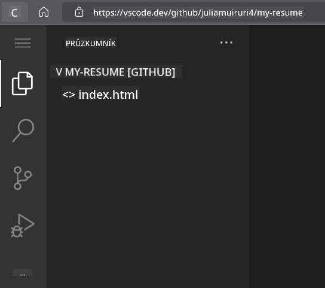
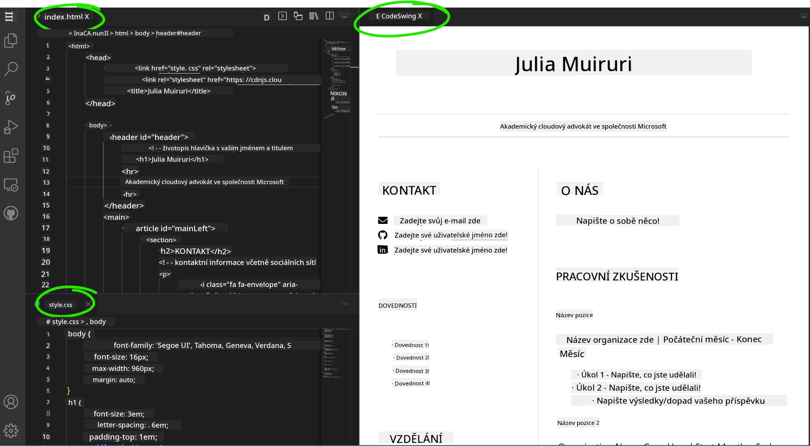

<!--
CO_OP_TRANSLATOR_METADATA:
{
  "original_hash": "2fcb983b8dbadadb1bc2e97f8c12dac5",
  "translation_date": "2025-08-28T04:24:55+00:00",
  "source_file": "8-code-editor/1-using-a-code-editor/assignment.md",
  "language_code": "cs"
}
-->
# Vytvořte webovou stránku s životopisem pomocí vscode.dev

_Jak skvělé by bylo, kdyby vás personalista požádal o životopis a vy byste mu poslali URL?_ 😎

## Cíle

Po tomto úkolu se naučíte:

- Vytvořit webovou stránku pro prezentaci svého životopisu

### Předpoklady

1. Účet na GitHubu. Přejděte na [GitHub](https://github.com/) a vytvořte si účet, pokud ho ještě nemáte.

## Kroky

**Krok 1:** Vytvořte nový GitHub repozitář a pojmenujte ho `my-resume`

**Krok 2:** Vytvořte soubor `index.html` ve svém repozitáři. Přidáme alespoň jeden soubor přímo na github.com, protože prázdný repozitář nelze otevřít ve vscode.dev.

Klikněte na odkaz `creating a new file`, zadejte název `index.html` a vyberte tlačítko `Commit new file`.


**Krok 3:** Otevřete [VSCode.dev](https://vscode.dev) a vyberte tlačítko `Open Remote Repository`.

Zkopírujte URL repozitáře, který jste právě vytvořili pro svůj web s životopisem, a vložte jej do vstupního pole:

_Nahraďte `your-username` svým uživatelským jménem na GitHubu._

```
https://github.com/your-username/my-resume
```

✅ Pokud vše proběhlo úspěšně, uvidíte svůj projekt a soubor index.html otevřený v textovém editoru v prohlížeči.



**Krok 4:** Otevřete soubor `index.html`, vložte do něj níže uvedený kód a uložte.

<details>
    <summary><b>HTML kód odpovědný za obsah vašeho webu s životopisem.</b></summary>
    
        <html>

            <head>
                <link href="style.css" rel="stylesheet">
                <link rel="stylesheet" href="https://cdnjs.cloudflare.com/ajax/libs/font-awesome/5.15.4/css/all.min.css">
                <title>Vaše jméno sem!</title>
            </head>
            <body>
                <header id="header">
                    <!-- záhlaví životopisu s vaším jménem a titulem -->
                    <h1>Vaše jméno sem!</h1>
                    <hr>
                    Vaše role!
                    <hr>
                </header>
                <main>
                    <article id="mainLeft">
                        <section>
                            <h2>KONTAKT</h2>
                            <!-- kontaktní informace včetně sociálních sítí -->
                            <p>
                                <i class="fa fa-envelope" aria-hidden="true"></i>
                                <a href="mailto:username@domain.top-level domain">Zadejte svůj e-mail zde</a>
                            </p>
                            <p>
                                <i class="fab fa-github" aria-hidden="true"></i>
                                <a href="github.com/yourGitHubUsername">Zadejte své uživatelské jméno zde!</a>
                            </p>
                            <p>
                                <i class="fab fa-linkedin" aria-hidden="true"></i>
                                <a href="linkedin.com/yourLinkedInUsername">Zadejte své uživatelské jméno zde!</a>
                            </p>
                        </section>
                        <section>
                            <h2>DOVEDNOSTI</h2>
                            <!-- vaše dovednosti -->
                            <ul>
                                <li>Dovednost 1!</li>
                                <li>Dovednost 2!</li>
                                <li>Dovednost 3!</li>
                                <li>Dovednost 4!</li>
                            </ul>
                        </section>
                        <section>
                            <h2>VZDĚLÁNÍ</h2>
                            <!-- vaše vzdělání -->
                            <h3>Zadejte svůj obor zde!</h3>
                            <p>
                                Zadejte svou instituci zde!
                            </p>
                            <p>
                                Začátek - Konec
                            </p>
                        </section>            
                    </article>
                    <article id="mainRight">
                        <section>
                            <h2>O MNĚ</h2>
                            <!-- něco o vás -->
                            <p>Napište něco o sobě!</p>
                        </section>
                        <section>
                            <h2>PRACOVNÍ ZKUŠENOSTI</h2>
                            <!-- vaše pracovní zkušenosti -->
                            <h3>Název pozice</h3>
                            <p>
                                Název organizace sem | Měsíc začátku – Měsíc konce
                            </p>
                            <ul>
                                    <li>Úkol 1 - Popište, co jste dělali!</li>
                                    <li>Úkol 2 - Popište, co jste dělali!</li>
                                    <li>Popište výsledky/dopad vašeho přínosu</li>
                                    
                            </ul>
                            <h3>Název pozice 2</h3>
                            <p>
                                Název organizace sem | Měsíc začátku – Měsíc konce
                            </p>
                            <ul>
                                    <li>Úkol 1 - Popište, co jste dělali!</li>
                                    <li>Úkol 2 - Popište, co jste dělali!</li>
                                    <li>Popište výsledky/dopad vašeho přínosu</li>
                                    
                            </ul>
                        </section>
                    </article>
                </main>
            </body>
        </html>
</details>

Nahraďte _zástupný text_ ve výše uvedeném HTML kódu detaily svého životopisu.

**Krok 5:** Najděte složku My-Resume, klikněte na ikonu `New File ...` a vytvořte ve svém projektu 2 nové soubory: `style.css` a `codeswing.json`.

**Krok 6:** Otevřete soubor `style.css`, vložte do něj níže uvedený kód a uložte.

<details>
        <summary><b>CSS kód pro formátování rozvržení stránky.</b></summary>
            
            body {
                font-family: 'Segoe UI', Tahoma, Geneva, Verdana, sans-serif;
                font-size: 16px;
                max-width: 960px;
                margin: auto;
            }
            h1 {
                font-size: 3em;
                letter-spacing: .6em;
                padding-top: 1em;
                padding-bottom: 1em;
            }

            h2 {
                font-size: 1.5em;
                padding-bottom: 1em;
            }

            h3 {
                font-size: 1em;
                padding-bottom: 1em;
            }
            main { 
                display: grid;
                grid-template-columns: 40% 60%;
                margin-top: 3em;
            }
            header {
                text-align: center;
                margin: auto 2em;
            }

            section {
                margin: auto 1em 4em 2em;
            }

            i {
                margin-right: .5em;
            }

            p {
                margin: .2em auto
            }

            hr {
                border: none;
                background-color: lightgray;
                height: 1px;
            }

            h1, h2, h3 {
                font-weight: 100;
                margin-bottom: 0;
            }
            #mainLeft {
                border-right: 1px solid lightgray;
            }
            
</details>

**Krok 6:** Otevřete soubor `codeswing.json`, vložte do něj níže uvedený kód a uložte.

    {
    "scripts": [],
    "styles": []
    }

**Krok 7:** Nainstalujte rozšíření `Codeswing`, abyste mohli vizualizovat webovou stránku s životopisem v kódovací oblasti.

Klikněte na ikonu _`Extensions`_ na panelu aktivit a zadejte Codeswing. Klikněte na _modré tlačítko instalace_ na rozšířeném panelu aktivit nebo použijte tlačítko instalace, které se objeví v kódovací oblasti po výběru rozšíření. Ihned po instalaci rozšíření sledujte změny ve svém projektu 😃.


Toto uvidíte na obrazovce po instalaci rozšíření.



Pokud jste spokojeni se změnami, které jste provedli, najděte složku `Changes` a klikněte na tlačítko `+`, abyste změny připravili ke commitu.

Zadejte zprávu ke commitu _(popis změn, které jste provedli v projektu)_ a potvrďte změny kliknutím na `check`. Po dokončení práce na projektu vyberte ikonu hamburgerového menu v levém horním rohu a vraťte se do repozitáře na GitHubu.

Gratulujeme 🎉 Právě jste vytvořili webovou stránku s životopisem pomocí vscode.dev v několika krocích.

## 🚀 Výzva

Otevřete vzdálený repozitář, ke kterému máte oprávnění provádět změny, a aktualizujte některé soubory. Poté zkuste vytvořit novou větev se svými změnami a vytvořit Pull Request.

## Recenze a samostudium

Přečtěte si více o [VSCode.dev](https://code.visualstudio.com/docs/editor/vscode-web?WT.mc_id=academic-0000-alfredodeza) a některých jeho dalších funkcích.

---

**Prohlášení**:  
Tento dokument byl přeložen pomocí služby pro automatický překlad [Co-op Translator](https://github.com/Azure/co-op-translator). Ačkoli se snažíme o přesnost, mějte prosím na paměti, že automatické překlady mohou obsahovat chyby nebo nepřesnosti. Původní dokument v jeho původním jazyce by měl být považován za autoritativní zdroj. Pro důležité informace doporučujeme profesionální lidský překlad. Neodpovídáme za žádné nedorozumění nebo nesprávné interpretace vyplývající z použití tohoto překladu.