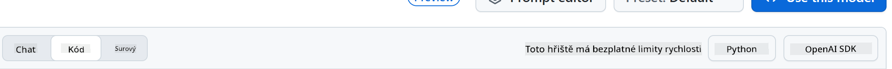
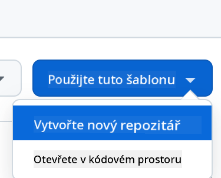

<!--
CO_OP_TRANSLATOR_METADATA:
{
  "original_hash": "11cf36165c243947b6cd85b88cf6faa6",
  "translation_date": "2025-09-01T17:00:47+00:00",
  "source_file": "9-chat-project/README.md",
  "language_code": "cs"
}
-->
# Chat projekt

Tento chat projekt ukazuje, jak vytvořit Chat Asistenta pomocí GitHub Models.

Takto vypadá hotový projekt:


Trocha kontextu: vytváření chatovacích asistentů pomocí generativní AI je skvělý způsob, jak začít s učením o AI. V této lekci se naučíte, jak integrovat generativní AI do webové aplikace. Pojďme začít.

## Připojení ke generativní AI

Pro backend používáme GitHub Models. Je to skvělá služba, která vám umožňuje používat AI zdarma. Přejděte na její playground a získejte kód odpovídající vašemu zvolenému backendovému jazyku. Takto vypadá [GitHub Models Playground](https://github.com/marketplace/models/azure-openai/gpt-4o-mini/playground).


Jak jsme zmínili, vyberte záložku "Code" a váš zvolený runtime.



### Použití Pythonu

V tomto případě vybereme Python, což znamená, že použijeme tento kód:

```python
"""Run this model in Python

> pip install openai
"""
import os
from openai import OpenAI

# To authenticate with the model you will need to generate a personal access token (PAT) in your GitHub settings. 
# Create your PAT token by following instructions here: https://docs.github.com/en/authentication/keeping-your-account-and-data-secure/managing-your-personal-access-tokens
client = OpenAI(
    base_url="https://models.github.ai/inference",
    api_key=os.environ["GITHUB_TOKEN"],
)

response = client.chat.completions.create(
    messages=[
        {
            "role": "system",
            "content": "",
        },
        {
            "role": "user",
            "content": "What is the capital of France?",
        }
    ],
    model="openai/gpt-4o-mini",
    temperature=1,
    max_tokens=4096,
    top_p=1
)

print(response.choices[0].message.content)
```

Trochu tento kód upravíme, aby byl znovu použitelný:

```python
def call_llm(prompt: str, system_message: str):
    response = client.chat.completions.create(
        messages=[
            {
                "role": "system",
                "content": system_message,
            },
            {
                "role": "user",
                "content": prompt,
            }
        ],
        model="openai/gpt-4o-mini",
        temperature=1,
        max_tokens=4096,
        top_p=1
    )

    return response.choices[0].message.content
```

S touto funkcí `call_llm` nyní můžeme zadat prompt a systémový prompt a funkce vrátí výsledek.

### Přizpůsobení AI asistenta

Pokud chcete přizpůsobit AI asistenta, můžete specifikovat, jak se má chovat, tím, že naplníte systémový prompt takto:

```python
call_llm("Tell me about you", "You're Albert Einstein, you only know of things in the time you were alive")
```

## Zpřístupnění přes Web API

Skvělé, AI část máme hotovou, podívejme se, jak ji můžeme integrovat do Web API. Pro Web API jsme zvolili Flask, ale jakýkoli webový framework by měl být v pořádku. Podívejme se na kód:

### Použití Pythonu

```python
# api.py
from flask import Flask, request, jsonify
from llm import call_llm
from flask_cors import CORS

app = Flask(__name__)
CORS(app)   # *   example.com

@app.route("/", methods=["GET"])
def index():
    return "Welcome to this API. Call POST /hello with 'message': 'my message' as JSON payload"


@app.route("/hello", methods=["POST"])
def hello():
    # get message from request body  { "message": "do this taks for me" }
    data = request.get_json()
    message = data.get("message", "")

    response = call_llm(message, "You are a helpful assistant.")
    return jsonify({
        "response": response
    })

if __name__ == "__main__":
    app.run(host="0.0.0.0", port=5000)
```

Zde vytvoříme Flask API a definujeme výchozí trasu "/" a "/chat". Druhá trasa je určena pro použití naším frontendem k předávání otázek.

Pro integraci *llm.py* je třeba udělat následující:

- Importovat funkci `call_llm`:

   ```python
   from llm import call_llm
   from flask import Flask, request
   ```

- Zavolat ji z trasy "/chat":

   ```python
   @app.route("/hello", methods=["POST"])
   def hello():
      # get message from request body  { "message": "do this taks for me" }
      data = request.get_json()
      message = data.get("message", "")

      response = call_llm(message, "You are a helpful assistant.")
      return jsonify({
         "response": response
      })
   ```

   Zde zpracujeme příchozí požadavek, abychom získali vlastnost `message` z JSON těla. Poté zavoláme LLM tímto způsobem:

   ```python
   response = call_llm(message, "You are a helpful assistant")

   # return the response as JSON
   return jsonify({
      "response": response 
   })
   ```

Skvělé, nyní máme vše, co potřebujeme.

## Nastavení Cors

Je třeba zmínit, že jsme nastavili něco jako CORS, sdílení zdrojů mezi různými doménami. To znamená, že protože náš backend a frontend poběží na různých portech, musíme povolit frontendu volat backend.

### Použití Pythonu

V souboru *api.py* je kód, který toto nastavuje:

```python
from flask_cors import CORS

app = Flask(__name__)
CORS(app)   # *   example.com
```

Momentálně je nastaveno povolení pro všechny domény "*", což je trochu nebezpečné. Měli bychom to omezit, jakmile přejdeme do produkce.

## Spuštění projektu

Pro spuštění projektu je třeba nejprve spustit backend a poté frontend.

### Použití Pythonu

Dobře, máme *llm.py* a *api.py*. Jak to můžeme zprovoznit s backendem? Potřebujeme udělat dvě věci:

- Nainstalovat závislosti:

   ```sh
   cd backend
   python -m venv venv
   source ./venv/bin/activate

   pip install openai flask flask-cors openai
   ```

- Spustit API:

   ```sh
   python api.py
   ```

   Pokud jste v Codespaces, musíte přejít do sekce Ports v dolní části editoru, kliknout pravým tlačítkem a vybrat "Port Visibility" a zvolit "Public".

### Práce na frontendu

Nyní, když máme API spuštěné, vytvoříme frontend. Začneme s minimálním frontendem, který budeme postupně vylepšovat. Ve složce *frontend* vytvořte následující:

```text
backend/
frontend/
index.html
app.js
styles.css
```

Začněme s **index.html**:

```html
<html>
    <head>
        <link rel="stylesheet" href="styles.css">
    </head>
    <body>
      <form>
        <textarea id="messages"></textarea>
        <input id="input" type="text" />
        <button type="submit" id="sendBtn">Send</button>  
      </form>  
      <script src="app.js" />
    </body>
</html>    
```

Toto je absolutní minimum potřebné pro podporu chatovacího okna. Obsahuje textové pole, kde se zobrazují zprávy, vstupní pole pro psaní zpráv a tlačítko pro odeslání zprávy na backend. Podívejme se nyní na JavaScript v *app.js*.

**app.js**

```js
// app.js

(function(){
  // 1. set up elements  
  const messages = document.getElementById("messages");
  const form = document.getElementById("form");
  const input = document.getElementById("input");

  const BASE_URL = "change this";
  const API_ENDPOINT = `${BASE_URL}/hello`;

  // 2. create a function that talks to our backend
  async function callApi(text) {
    const response = await fetch(API_ENDPOINT, {
      method: "POST",
      headers: { "Content-Type": "application/json" },
      body: JSON.stringify({ message: text })
    });
    let json = await response.json();
    return json.response;
  }

  // 3. add response to our textarea
  function appendMessage(text, role) {
    const el = document.createElement("div");
    el.className = `message ${role}`;
    el.innerHTML = text;
    messages.appendChild(el);
  }

  // 4. listen to submit events
  form.addEventListener("submit", async(e) => {
    e.preventDefault();
   // someone clicked the button in the form
   
   // get input
   const text = input.value.trim();

   appendMessage(text, "user")

   // reset it
   input.value = '';

   const reply = await callApi(text);

   // add to messages
   appendMessage(reply, "assistant");

  })
})();
```

Projděme si kód po částech:

- 1) Získáme referenci na všechny prvky, které budeme později v kódu používat.
- 2) Vytvoříme funkci, která pomocí vestavěné metody `fetch` volá náš backend.
- 3) `appendMessage` pomáhá přidávat odpovědi i zprávy, které uživatel napíše.
- 4) Posloucháme událost odeslání, přečteme vstupní pole, umístíme uživatelovu zprávu do textového pole, zavoláme API a zobrazíme odpověď v textovém poli.

Podívejme se na stylování, kde se můžete opravdu vyřádit. Zde je několik návrhů:

**styles.css**

```
.message {
    background: #222;
    box-shadow: 0 0 0 10px orange;
    padding: 10px:
    margin: 5px;
}

.message.user {
    background: blue;
}

.message.assistant {
    background: grey;
} 
```

S těmito třemi třídami budete stylovat zprávy odlišně podle toho, zda pocházejí od asistenta nebo od uživatele. Pokud hledáte inspiraci, podívejte se do složky `solution/frontend/styles.css`.

### Změna Base URL

Jedna věc, kterou jsme zde nenastavili, je `BASE_URL`. Ta není známa, dokud není backend spuštěn. Pro nastavení:

- Pokud spouštíte API lokálně, mělo by být nastaveno na něco jako `http://localhost:5000`.
- Pokud běží v Codespaces, mělo by vypadat jako "[name]app.github.dev".

## Zadání

Vytvořte si vlastní složku *project* s obsahem takto:

```text
project/
  frontend/
    index.html
    app.js
    styles.css
  backend/
    ...
```

Zkopírujte obsah podle výše uvedených pokynů, ale klidně si jej přizpůsobte podle svého.

## Řešení

[Řešení](./solution/README.md)

## Bonus

Zkuste změnit osobnost AI asistenta.

### Pro Python

Když voláte `call_llm` v *api.py*, můžete změnit druhý argument na cokoli chcete, například:

```python
call_llm(message, "You are Captain Picard")
```

### Frontend

Změňte také CSS a text podle svého vkusu, tedy proveďte změny v *index.html* a *styles.css*.

## Shrnutí

Skvělé, naučili jste se od základů, jak vytvořit osobního asistenta pomocí AI. Použili jsme GitHub Models, backend v Pythonu a frontend v HTML, CSS a JavaScriptu.

## Nastavení s Codespaces

- Přejděte na: [Web Dev For Beginners repo](https://github.com/microsoft/Web-Dev-For-Beginners)
- Vytvořte z šablony (ujistěte se, že jste přihlášeni do GitHubu) v pravém horním rohu:

    

- Jakmile jste ve svém repozitáři, vytvořte Codespace:

    

    Tím se spustí prostředí, se kterým nyní můžete pracovat.

---

**Prohlášení**:  
Tento dokument byl přeložen pomocí služby pro automatický překlad [Co-op Translator](https://github.com/Azure/co-op-translator). Ačkoli se snažíme o přesnost, mějte prosím na paměti, že automatické překlady mohou obsahovat chyby nebo nepřesnosti. Původní dokument v jeho původním jazyce by měl být považován za autoritativní zdroj. Pro důležité informace doporučujeme profesionální lidský překlad. Neodpovídáme za žádná nedorozumění nebo nesprávné interpretace vyplývající z použití tohoto překladu.