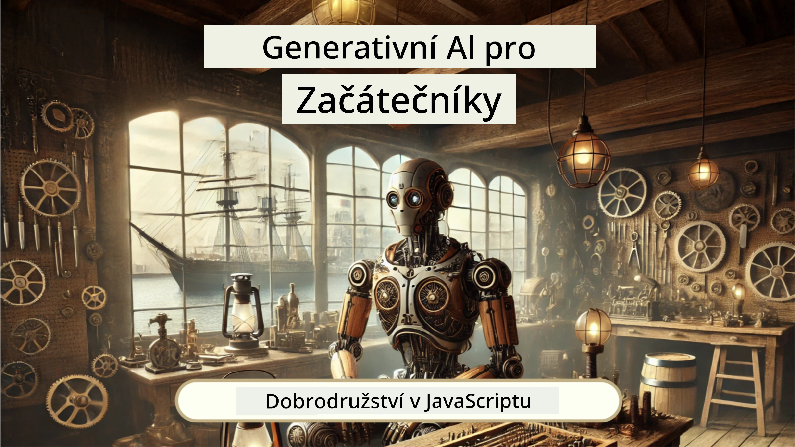
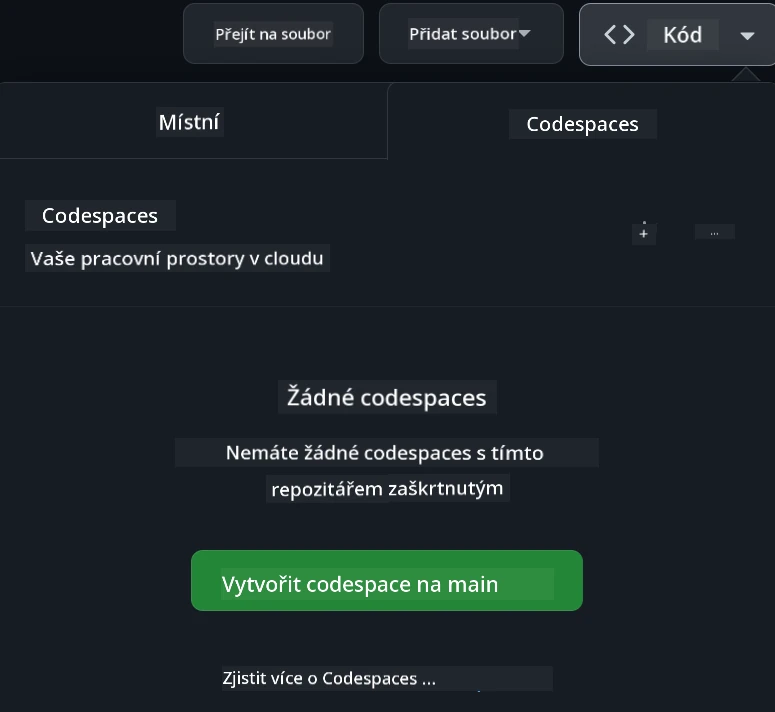

[](https://github.com/microsoft/Web-Dev-For-Beginners/blob/master/LICENSE)
[](https://GitHub.com/microsoft/Web-Dev-For-Beginners/graphs/contributors/)
[](https://GitHub.com/microsoft/Web-Dev-For-Beginners/issues/)
[](https://GitHub.com/microsoft/Web-Dev-For-Beginners/pulls/)
[](http://makeapullrequest.com) 

[](https://GitHub.com/microsoft/Web-Dev-For-Beginners/watchers/)
[](https://GitHub.com/microsoft/Web-Dev-For-Beginners/network/)
[](https://GitHub.com/microsoft/Web-Dev-For-Beginners/stargazers/)

[](https://discord.gg/nTYy5BXMWG)

# Webový vývoj pro začátečníky - Kurikulum

Naučte se základy webového vývoje v našem 12týdenním komplexním kurzu od Microsoft Cloud Advocates. Každá z 24 lekcí se věnuje JavaScriptu, CSS a HTML prostřednictvím praktických projektů jako jsou terária, rozšíření prohlížeče a vesmírné hry. Zapojte se do kvízů, diskuzí a praktických úkolů. Zlepšete své dovednosti a optimalizujte si uchování znalostí s naší efektivní projektově orientovanou výukou. Začněte svou cestu s kódováním ještě dnes!

Přidejte se do komunity Azure AI Foundry na Discordu

[](https://discord.gg/nTYy5BXMWG)

Postupujte podle těchto kroků, abyste mohli začít používat tyto zdroje:
1. **Vytvořte forknutí repozitáře**: Klikněte na [](https://GitHub.com/microsoft/Web-Dev-For-Beginners/fork)
2. **Naklonujte repozitář**:   `git clone https://github.com/microsoft/Web-Dev-For-Beginners.git`
3. [**Připojte se k Azure AI Foundry Discordu a potkejte odborníky a ostatní vývojáře**](https://discord.com/invite/ByRwuEEgH4)

### 🌐 Podpora více jazyků

#### Podporováno skrze GitHub Action (automatizované a vždy aktuální)

<!-- CO-OP TRANSLATOR LANGUAGES TABLE START -->
[Arabic](../ar/README.md) | [Bengali](../bn/README.md) | [Bulgarian](../bg/README.md) | [Burmese (Myanmar)](../my/README.md) | [Chinese (Simplified)](../zh-CN/README.md) | [Chinese (Traditional, Hong Kong)](../zh-HK/README.md) | [Chinese (Traditional, Macau)](../zh-MO/README.md) | [Chinese (Traditional, Taiwan)](../zh-TW/README.md) | [Croatian](../hr/README.md) | [Czech](./README.md) | [Danish](../da/README.md) | [Dutch](../nl/README.md) | [Estonian](../et/README.md) | [Finnish](../fi/README.md) | [French](../fr/README.md) | [German](../de/README.md) | [Greek](../el/README.md) | [Hebrew](../he/README.md) | [Hindi](../hi/README.md) | [Hungarian](../hu/README.md) | [Indonesian](../id/README.md) | [Italian](../it/README.md) | [Japanese](../ja/README.md) | [Kannada](../kn/README.md) | [Korean](../ko/README.md) | [Lithuanian](../lt/README.md) | [Malay](../ms/README.md) | [Malayalam](../ml/README.md) | [Marathi](../mr/README.md) | [Nepali](../ne/README.md) | [Nigerian Pidgin](../pcm/README.md) | [Norwegian](../no/README.md) | [Persian (Farsi)](../fa/README.md) | [Polish](../pl/README.md) | [Portuguese (Brazil)](../pt-BR/README.md) | [Portuguese (Portugal)](../pt-PT/README.md) | [Punjabi (Gurmukhi)](../pa/README.md) | [Romanian](../ro/README.md) | [Russian](../ru/README.md) | [Serbian (Cyrillic)](../sr/README.md) | [Slovak](../sk/README.md) | [Slovenian](../sl/README.md) | [Spanish](../es/README.md) | [Swahili](../sw/README.md) | [Swedish](../sv/README.md) | [Tagalog (Filipino)](../tl/README.md) | [Tamil](../ta/README.md) | [Telugu](../te/README.md) | [Thai](../th/README.md) | [Turkish](../tr/README.md) | [Ukrainian](../uk/README.md) | [Urdu](../ur/README.md) | [Vietnamese](../vi/README.md)

> **Dáváte přednost lokálnímu klonování?**

> Tento repozitář zahrnuje více než 50 překladů jazyků, což výrazně zvětšuje velikost stažených dat. Pro klonování bez překladů použijte sparse checkout:
> ```bash
> git clone --filter=blob:none --sparse https://github.com/microsoft/Web-Dev-For-Beginners.git
> cd Web-Dev-For-Beginners
> git sparse-checkout set --no-cone '/*' '!translations' '!translated_images'
> ```
> To vám poskytne vše potřebné ke zdárnému dokončení kurzu a výrazně rychlejší stažení.
<!-- CO-OP TRANSLATOR LANGUAGES TABLE END -->

**Pokud si přejete, aby byly podporovány další překladové jazyky, jsou uvedeny [zde](https://github.com/Azure/co-op-translator/blob/main/getting_started/supported-languages.md)**

[](https://open.vscode.dev/microsoft/Web-Dev-For-Beginners)

#### 🧑‍🎓 _Jste student?_

Navštivte [**Student Hub stránku**](https://docs.microsoft.com/learn/student-hub/?WT.mc_id=academic-77807-sagibbon), kde najdete začátečnické zdroje, studentské balíčky a dokonce způsoby, jak získat voucher na bezplatný certifikát. Tuto stránku si doporučujeme přidat do záložek a čas od času ji navštívit, protože obsah měníme měsíčně.

### 📣 Oznámení - Nové výzvy GitHub Copilot Agent mode k dokončení!

Nová výzva přidána, hledejte „GitHub Copilot Agent Challenge 🚀“ ve většině kapitol. Je to nová výzva, kterou můžete dokončit pomocí GitHub Copilota a režimu Agent. Pokud jste režim Agent předtím nepoužívali, dokáže nejen generovat text, ale také vytvářet a upravovat soubory, spouštět příkazy a další.

### 📣 Oznámení - _Nový projekt k postavení pomocí Generativní AI_ 

Nový projekt AI asistenta právě přidán, podívejte se na [projekt](./9-chat-project/README.md)

### 📣 Oznámení - _Nové kurikulum_ o Generativní AI pro JavaScript právě vydáno

Nezapomeňte na naše nové kurikulum Generativní AI!

Navštivte [https://aka.ms/genai-js-course](https://aka.ms/genai-js-course) a začněte!



- Lekce pokrývají vše od základů po RAG.
- Komunikujte s historickými postavami pomocí GenAI a naší doprovodné aplikace.
- Zábavný a poutavý příběh, při němž budete cestovat časem!


Každá lekce zahrnuje úkol k dokončení, kontrolu znalostí a výzvu, která vás provede tématy jako:
- Promptování a prompt engineering
- Generování textových a obrazových aplikací
- Vyhledávací aplikace

Navštivte [https://aka.ms/genai-js-course](https://aka.ms/genai-js-course) a začněte!


## 🌱 Začínáme

> **Učitelé**, zahrnuli jsme [několik návrhů](for-teachers.md) jak toto kurikulum používat. Budeme rádi za vaši zpětnou vazbu [v našem diskuzním fóru](https://github.com/microsoft/Web-Dev-For-Beginners/discussions/categories/teacher-corner)!

**[Studující](https://aka.ms/student-page/?WT.mc_id=academic-77807-sagibbon)**, u každé lekce začněte přednáškovým kvízem a pokračujte čtením materiálu přednášky, plněním různých aktivit a ověřte si pochopení pomocí kvízu po přednášce.

Pro lepší studijní zážitek se spojte se svými spolužáky a pracujte na projektech společně! Diskuze jsou vítané v našem [diskuzním fóru](https://github.com/microsoft/Web-Dev-For-Beginners/discussions), kde je náš tým moderátorů připraven odpovědět na vaše dotazy.

Pro další vzdělávání důrazně doporučujeme prozkoumat [Microsoft Learn](https://learn.microsoft.com/users/wirelesslife/collections/p1ddcy5jwy0jkm?WT.mc_id=academic-77807-sagibbon) pro doplňující studijní materiály.

### 📋 Nastavení vašeho prostředí

Toto kurikulum má připravené vývojové prostředí! Jakmile začnete, můžete si vybrat spouštět kurikulum v [Codespace](https://github.com/features/codespaces/) (_prostředí v prohlížeči bez potřeby instalace_), nebo lokálně na vašem počítači pomocí textového editoru jako je [Visual Studio Code](https://code.visualstudio.com/?WT.mc_id=academic-77807-sagibbon).

#### Vytvořte si repozitář
Pro snadné ukládání své práce je doporučeno vytvořit si vlastní kopii tohoto repozitáře. To můžete udělat kliknutím na tlačítko **Use this template** v horní části stránky. Tím vznikne nový repozitář ve vašem GitHub účtu s kopií kurikula.

Postupujte takto:
1. **Vytvořte fork repozitáře**: Klikněte na tlačítko „Fork“ v pravém horním rohu této stránky.
2. **Naklonujte repozitář**:   `git clone https://github.com/microsoft/Web-Dev-For-Beginners.git`

#### Spuštění kurikula v Codespace

Ve vaší kopii repozitáře, kterou jste vytvořili, klikněte na tlačítko **Code** a vyberte **Open with Codespaces**. Tím se pro vás vytvoří nový Codespace, ve kterém můžete pracovat.



#### Spuštění kurikula lokálně na vašem počítači

Pro spuštění kurikula lokálně budete potřebovat textový editor, prohlížeč a nástroj příkazového řádku. Naše první lekce, [Úvod do programovacích jazyků a nástrojů oboru](../../1-getting-started-lessons/1-intro-to-programming-languages), vás provede různými možnostmi těchto nástrojů, abyste si mohli vybrat, co vám nejlépe vyhovuje.

Doporučujeme použít [Visual Studio Code](https://code.visualstudio.com/?WT.mc_id=academic-77807-sagibbon) jako editor, který má také vestavěný [Terminál](https://code.visualstudio.com/docs/terminal/basics/?WT.mc_id=academic-77807-sagibbon). Visual Studio Code si můžete stáhnout [zde](https://code.visualstudio.com/?WT.mc_id=academic-77807-sagibbon).


1. Naklonujte svůj repozitář do počítače. Můžete to udělat kliknutím na tlačítko **Code** a zkopírováním adresy URL:

    [CodeSpace](./images/createcodespace.png)
Poté otevřete [Terminál](https://code.visualstudio.com/docs/terminal/basics/?WT.mc_id=academic-77807-sagibbon) ve [Visual Studio Code](https://code.visualstudio.com/?WT.mc_id=academic-77807-sagibbon) a spusťte následující příkaz, přičemž `<your-repository-url>` nahraďte URL, kterou jste právě zkopírovali:

    ```bash 
    git clone <your-repository-url>
    ```

2. Otevřete složku ve Visual Studio Code. To můžete udělat kliknutím na **Soubor** > **Otevřít složku** a vybráním složky, kterou jste právě naklonovali.


>  Doporučené rozšíření Visual Studio Code:
>
> * [Live Server](https://marketplace.visualstudio.com/items?itemName=ritwickdey.LiveServer&WT.mc_id=academic-77807-sagibbon) - pro náhled HTML stránek přímo ve Visual Studio Code
> * [Copilot](https://marketplace.visualstudio.com/items?itemName=GitHub.copilot&WT.mc_id=academic-77807-sagibbon) - který vám pomůže psát kód rychleji

## 📂 Každá lekce zahrnuje:

- volitelnou náčrtovou poznámku
- volitelné doplňkové video
- rozcvičkový kvíz před lekcí
- písemnou lekci
- u lekcí založených na projektu podrobné návody, jak projekt vytvořit
- kontrolní znalostní otázky
- výzvu
- doplňkové čtení
- zadání
- [kvíz po lekci](https://ff-quizzes.netlify.app/web/)

> **Poznámka ke kvízům**: Všechny kvízy jsou uloženy ve složce Quiz-app, celkem je 48 kvízů po třech otázkách. Jsou dostupné [zde](https://ff-quizzes.netlify.app/web/), kvízovou aplikaci lze spustit lokálně nebo nasadit na Azure; řiďte se pokyny ve složce `quiz-app`.

## 🗃️ Lekce

|     |                       Název projektu                       |                            Naučené koncepty                             | Výukové cíle                                                                                                                 |                                                         Odkaz na lekci                                                          |         Autor          |
| :-: | :--------------------------------------------------------: | :--------------------------------------------------------------------: | ---------------------------------------------------------------------------------------------------------------------------- | :----------------------------------------------------------------------------------------------------------------------------: | :---------------------: |
| 01  |                     Začínáme                              |           Úvod do programování a nástroje řemeslníka                   | Naučte se základy většiny programovacích jazyků a o softwaru, který pomáhá profesionálním vývojářům vykonávat jejich práci    | [Úvod do programovacích jazyků a nástrojů](./1-getting-started-lessons/1-intro-to-programming-languages/README.md)             |         Jasmine         |
| 02  |                     Začínáme                              |             Základy GitHubu, včetně práce v týmu                       | Jak používat GitHub ve vašem projektu, jak spolupracovat s ostatními na kódu                                                 |                            [Úvod do GitHubu](./1-getting-started-lessons/2-github-basics/README.md)                             |          Floor          |
| 03  |                     Začínáme                              |                             Přístupnost                                | Naučte se základy webové přístupnosti                                                                                       |                       [Základy přístupnosti](./1-getting-started-lessons/3-accessibility/README.md)                             |       Christopher       |
| 04  |                        Základy JS                         |                         Datové typy JavaScriptu                       | Základy datových typů v JavaScriptu                                                                                        |                                       [Datové typy](./2-js-basics/1-data-types/README.md)                                      |         Jasmine         |
| 05  |                        Základy JS                         |                         Funkce a metody                               | Naučte se o funkcích a metodách pro správu logiky aplikace                                                                 |                              [Funkce a metody](./2-js-basics/2-functions-methods/README.md)                                     | Jasmine a Christopher   |
| 06  |                        Základy JS                         |                        Tvorba podmínek v JS                          | Naučte se vytvářet podmínky ve vašem kódu pomocí rozhodovacích metod                                                        |                                 [Tvorba rozhodnutí](./2-js-basics/3-making-decisions/README.md)                               |         Jasmine         |
| 07  |                        Základy JS                         |                            Pole a smyčky                             | Pracujte s daty pomocí polí a smyček v JavaScriptu                                                                          |                                   [Pole a smyčky](./2-js-basics/4-arrays-loops/README.md)                                     |         Jasmine         |
| 08  |       [Terrarium](./3-terrarium/solution/README.md)       |                            HTML v praxi                              | Vytvořte HTML pro online terárium se zaměřením na vytvoření rozvržení                                                      |                                 [Úvod do HTML](./3-terrarium/1-intro-to-html/README.md)                                     |           Jen           |
| 09  |       [Terrarium](./3-terrarium/solution/README.md)       |                            CSS v praxi                               | Vytvořte CSS pro stylování online terária, se zaměřením na základy CSS včetně responzivního designu stránky                  |                                  [Úvod do CSS](./3-terrarium/2-intro-to-css/README.md)                                        |           Jen           |
| 10  |            [Terrarium](./3-terrarium/solution/README.md)            |                 JavaScriptové uzávěry, manipulace s DOM              | Vytvořte JavaScript pro funkčnost terária jako drag/drop rozhraní, zaměřeno na uzávěry a manipulaci s DOM                     |                  [JavaScript uzávěry a manipulace s DOM](./3-terrarium/3-intro-to-DOM-and-closures/README.md)                |           Jen           |
| 11  |          [Hra psaní na klávesnici](./4-typing-game/solution/README.md)          |                          Vytvoření hry psaní na klávesnici            | Naučte se používat klávesové události k řízení logiky vaší JavaScriptové aplikace                                            |                                [Programování událostmi](./4-typing-game/typing-game/README.md)                                   |       Christopher       |
| 12  | [Zelené rozšíření prohlížeče](./5-browser-extension/solution/README.md) |                         Práce s prohlížeči                           | Naučte se, jak prohlížeče fungují, jejich historický vývoj a jak vytvořit první prvky rozšíření prohlížeče                   |                               [O prohlížečích](./5-browser-extension/1-about-browsers/README.md)                                |           Jen           |
| 13  | [Zelené rozšíření prohlížeče](./5-browser-extension/solution/README.md) | Vytváření formuláře, volání API a ukládání proměnných do místního úložiště | Vytvořte JavaScriptové prvky rozšíření prohlížeče, které volají API a používají proměnné uložené v místním úložišti          |                [API, formuláře a místní úložiště](./5-browser-extension/2-forms-browsers-local-storage/README.md)              |           Jen           |
| 14  | [Zelené rozšíření prohlížeče](./5-browser-extension/solution/README.md) |          Pozadí procesy v prohlížeči, webový výkon                    | Použijte pozadí procesy pro zvládání ikony rozšíření, naučte se o webovém výkonu a optimalizacích                            |             [Pozadí a výkon](./5-browser-extension/3-background-tasks-and-performance/README.md)                             |           Jen           |
| 15  |           [Hra ve vesmíru](./6-space-game/solution/README.md)           |             Pokročilejší vývoj hry v JavaScriptu                      | Naučte se o dědičnosti pomocí tříd a kompozice, stejně jako o vzoru Pub/Sub, jako přípravu na tvorbu hry                      |                      [Úvod do pokročilého vývoje her](./6-space-game/1-introduction/README.md)                               |          Chris          |
| 16  |           [Hra ve vesmíru](./6-space-game/solution/README.md)           |                           Kreslení na plátno                         | Naučte se o Canvas API používaném pro kreslení prvků na obrazovku                                                          |                                [Kreslení na plátno](./6-space-game/2-drawing-to-canvas/README.md)                             |          Chris          |
| 17  |           [Hra ve vesmíru](./6-space-game/solution/README.md)           |                   Pohyb prvků po obrazovce                            | Objevte, jak mohou prvky získat pohyb pomocí kartézských souřadnic a Canvas API                                             |                           [Pohyb prvků](./6-space-game/3-moving-elements-around/README.md)                                   |          Chris          |
| 18  |           [Hra ve vesmíru](./6-space-game/solution/README.md)           |                          Detekce kolizí                              | Umožněte prvkům kolidovat a reagovat na sebe pomocí stisknutí kláves a přidejte cooldown funkci pro zajištění výkonu hry    |                              [Detekce kolizí](./6-space-game/4-collision-detection/README.md)                               |          Chris          |
| 19  |           [Hra ve vesmíru](./6-space-game/solution/README.md)           |                             Udržování skóre                           | Provádějte matematické výpočty založené na stavu a výkonu hry                                                             |                                    [Udržování skóre](./6-space-game/5-keeping-score/README.md)                               |          Chris          |
| 20  |           [Hra ve vesmíru](./6-space-game/solution/README.md)           |                     Ukončování a restartování hry                    | Naučte se o ukončení a restartování hry, včetně čištění zdrojů a resetování proměnných hodnot                                |                                [Podmínka ukončení](./6-space-game/6-end-condition/README.md)                               |          Chris          |
| 21  |         [Bankovní aplikace](./7-bank-project/solution/README.md)          |                 HTML šablony a směrování v webové aplikaci           | Naučte se vytvořit strukturu více stránkové webové aplikace použitím směrování a HTML šablon                                |                            [HTML šablony a směrování](./7-bank-project/1-template-route/README.md)                             |          Yohan          |
| 22  |         [Bankovní aplikace](./7-bank-project/solution/README.md)          |                  Vytvoření přihlašovacího a registračního formuláře  | Naučte se vytvářet formuláře a zpracovávat validační rutiny                                                               |                                           [Formuláře](./7-bank-project/2-forms/README.md)                                |          Yohan          |
| 23  |         [Bankovní aplikace](./7-bank-project/solution/README.md)          |                   Metody získávání a použití dat                     | Jak data proudí do vaší aplikace a ven, jak je načítat, ukládat a likvidovat                                               |                                            [Data](./7-bank-project/3-data/README.md)                                            |          Yohan          |
| 24  |         [Bankovní aplikace](./7-bank-project/solution/README.md)          |                      Koncepty správy stavu                           | Naučte se, jak vaše aplikace uchovává stav a jak s ním programově pracovat                                               |                                [Správa stavu](./7-bank-project/4-state-management/README.md)                             |          Yohan          |
| 25 | [Editor kódu pro prohlížeč/VScode](../../8-code-editor) | Práce s VScodem | Naučte se používat editor kódu | [Použití editoru VScode](./8-code-editor/1-using-a-code-editor/README.md) | Chris |
| 26 | [AI asistenti](./9-chat-project/README.md) | Práce s AI | Naučte se vytvořit vlastního AI asistenta | [Projekt AI asistenta](./9-chat-project/README.md) | Chris |

## 🏫 Pedagogika

Náš učební plán je navržen se dvěma klíčovými pedagogickými principy:
* učení založené na projektech
* časté kvízy

Program učí základy JavaScriptu, HTML a CSS, stejně jako nejnovější nástroje a techniky používané dnešními webovými vývojáři. Studenti získají příležitost získat praktické zkušenosti tvorbou hry na psaní na klávesnici, virtuálního terária, ekologicky šetrného rozšíření prohlížeče, hry ve stylu vesmírných vetřelců a bankovní aplikace pro firmy. Po dokončení série budou studenti mít pevné základy webového vývoje.

> 🎓 První lekce tohoto učebního plánu můžete absolvovat také jako [Výukovou cestu](https://docs.microsoft.com/learn/paths/web-development-101/?WT.mc_id=academic-77807-sagibbon) na Microsoft Learn!

Zajištěním, že obsah odpovídá projektům, se proces pro studenty stává zajímavějším a dochází k lepšímu zapamatování konceptů. Napsali jsme také několik úvodních lekcí základů JavaScriptu, které představují koncepty, doplněné videem ze série "[Beginners Series to: JavaScript](https://channel9.msdn.com/Series/Beginners-Series-to-JavaScript/?WT.mc_id=academic-77807-sagibbon)", jejíchž autoři se na plánu podíleli.

Navíc nízkorizikový kvíz před hodinou nastaví studentovi záměr naučit se téma, zatímco druhý kvíz po hodině zajistí další upevnění znalostí. Tento učební plán je navržen tak, aby byl flexibilní a zábavný, lze jej absolvovat celý nebo částečně. Projekty začínají jednoduché a ke konci 12týdenního cyklu se postupně stávají složitějšími.

Ačkoliv jsme záměrně vynechali zavádění JavaScriptových frameworků, abychom se zaměřili na základní dovednosti webového vývojáře před adopcí frameworku, vhodným dalším krokem po absolvování tohoto kurzu je naučit se Node.js prostřednictvím další kolekce videí: "[Beginner Series to: Node.js](https://channel9.msdn.com/Series/Beginners-Series-to-Nodejs/?WT.mc_id=academic-77807-sagibbon)".

> Navštivte naše [chování](CODE_OF_CONDUCT.md) a [příspěvky](CONTRIBUTING.md) pravidla. Vítáme vaše konstruktivní návrhy!


## 🧭 Offline přístup

Tuto dokumentaci můžete spustit offline pomocí [Docsify](https://docsify.js.org/#/). Vytvořte fork tohoto repozitáře, [nainstalujte Docsify](https://docsify.js.org/#/quickstart) na svém počítači a poté ve výchozím adresáři repozitáře spusťte příkaz `docsify serve`. Webová stránka poběží na portu 3000 na vašem localhostu: `localhost:3000`.

## 📘 PDF

PDF se všemi lekcemi naleznete [zde](https://microsoft.github.io/Web-Dev-For-Beginners/pdf/readme.pdf).


## 🎒 Další kurzy
Náš tým vytváří i další kurzy! Podívejte se:

<!-- CO-OP TRANSLATOR OTHER COURSES START -->
### LangChain
[](https://aka.ms/langchain4j-for-beginners)
[](https://aka.ms/langchainjs-for-beginners?WT.mc_id=m365-94501-dwahlin)
[](https://github.com/microsoft/langchain-for-beginners?WT.mc_id=m365-94501-dwahlin)
---

### Azure / Edge / MCP / Agenti
[](https://github.com/microsoft/AZD-for-beginners?WT.mc_id=academic-105485-koreyst)
[](https://github.com/microsoft/edgeai-for-beginners?WT.mc_id=academic-105485-koreyst)
[](https://github.com/microsoft/mcp-for-beginners?WT.mc_id=academic-105485-koreyst)
[](https://github.com/microsoft/ai-agents-for-beginners?WT.mc_id=academic-105485-koreyst)

---
 
### Série Generativní AI
[](https://github.com/microsoft/generative-ai-for-beginners?WT.mc_id=academic-105485-koreyst)
[-9333EA?style=for-the-badge&labelColor=E5E7EB&color=9333EA)](https://github.com/microsoft/Generative-AI-for-beginners-dotnet?WT.mc_id=academic-105485-koreyst)
[-C084FC?style=for-the-badge&labelColor=E5E7EB&color=C084FC)](https://github.com/microsoft/generative-ai-for-beginners-java?WT.mc_id=academic-105485-koreyst)
[-E879F9?style=for-the-badge&labelColor=E5E7EB&color=E879F9)](https://github.com/microsoft/generative-ai-with-javascript?WT.mc_id=academic-105485-koreyst)

---
 
### Základní učení
[](https://aka.ms/ml-beginners?WT.mc_id=academic-105485-koreyst)
[](https://aka.ms/datascience-beginners?WT.mc_id=academic-105485-koreyst)
[](https://aka.ms/ai-beginners?WT.mc_id=academic-105485-koreyst)
[](https://github.com/microsoft/Security-101?WT.mc_id=academic-96948-sayoung)
[](https://aka.ms/webdev-beginners?WT.mc_id=academic-105485-koreyst)
[](https://aka.ms/iot-beginners?WT.mc_id=academic-105485-koreyst)
[](https://github.com/microsoft/xr-development-for-beginners?WT.mc_id=academic-105485-koreyst)

---
 
### Série Copilot
[](https://aka.ms/GitHubCopilotAI?WT.mc_id=academic-105485-koreyst)
[](https://github.com/microsoft/mastering-github-copilot-for-dotnet-csharp-developers?WT.mc_id=academic-105485-koreyst)
[](https://github.com/microsoft/CopilotAdventures?WT.mc_id=academic-105485-koreyst)
<!-- CO-OP TRANSLATOR OTHER COURSES END -->

## Získání pomoci

Pokud se zaseknete nebo máte jakékoli otázky ohledně vývoje AI aplikací, připojte se k ostatním učenlivým a zkušeným vývojářům v diskuzích o MCP. Je to podpůrná komunita, kde jsou otázky vítány a znalosti se sdílejí svobodně.

[](https://discord.gg/nTYy5BXMWG)

Pokud máte zpětnou vazbu k produktu nebo chcete hlásit chyby při tvorbě, navštivte:

[](https://aka.ms/foundry/forum)

## Licence

Tento repozitář je licencován pod licencí MIT. Více informací naleznete v souboru [LICENSE](../../LICENSE).

---

<!-- CO-OP TRANSLATOR DISCLAIMER START -->
**Prohlášení o vyloučení odpovědnosti**:  
Tento dokument byl přeložen pomocí AI překladatelské služby [Co-op Translator](https://github.com/Azure/co-op-translator). Přestože se snažíme o přesnost, mějte prosím na paměti, že automatizované překlady mohou obsahovat chyby nebo nepřesnosti. Původní dokument v jeho mateřském jazyce by měl být považován za autoritativní zdroj. Pro zásadní informace je doporučován profesionální lidský překlad. Nejsme odpovědní za jakékoli nedorozumění nebo nesprávné výklady vzniklé použitím tohoto překladu.
<!-- CO-OP TRANSLATOR DISCLAIMER END -->