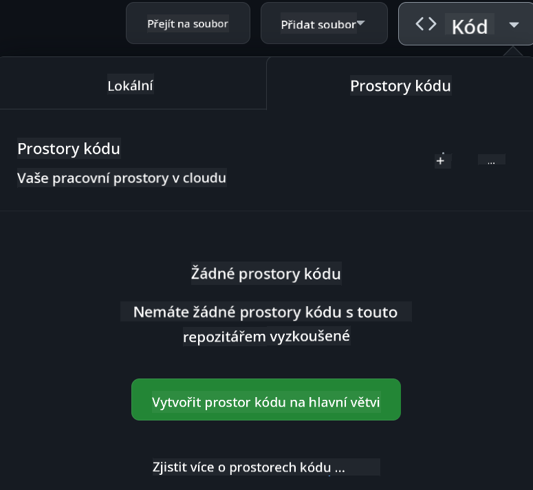

<!--
CO_OP_TRANSLATOR_METADATA:
{
  "original_hash": "fea3a0fceb8ad86fd640c09cf63a2aac",
  "translation_date": "2026-01-07T03:19:16+00:00",
  "source_file": "README.md",
  "language_code": "cs"
}
-->
[](https://github.com/microsoft/Web-Dev-For-Beginners/blob/master/LICENSE)
[](https://GitHub.com/microsoft/Web-Dev-For-Beginners/graphs/contributors/)
[](https://GitHub.com/microsoft/Web-Dev-For-Beginners/issues/)
[](https://GitHub.com/microsoft/Web-Dev-For-Beginners/pulls/)
[](http://makeapullrequest.com)

[](https://GitHub.com/microsoft/Web-Dev-For-Beginners/watchers/)
[](https://GitHub.com/microsoft/Web-Dev-For-Beginners/network/)
[](https://GitHub.com/microsoft/Web-Dev-For-Beginners/stargazers/)

[](https://discord.gg/nTYy5BXMWG)

# Vývoj webu pro začátečníky - učební plán

Naučte se základy webového vývoje s naším 12týdenním komplexním kurzem od Microsoft Cloud Advocates. Každá ze 24 lekcí se věnuje JavaScriptu, CSS a HTML prostřednictvím praktických projektů jako terária, rozšíření prohlížeče a vesmírné hry. Zapojte se do kvízů, diskuzí a praktických úkolů. Zlepšete své dovednosti a optimalizujte si zapamatování znalostí díky naší efektivní projektové pedagogice. Začněte svou cestu programování ještě dnes!

Připojte se ke komunitě Azure AI Foundry na Discordu

[](https://discord.gg/nTYy5BXMWG)

Postupujte podle těchto kroků, jak začít používat tyto zdroje:
1. **Vytvořte fork repozitáře**: Klikněte na [](https://GitHub.com/microsoft/Web-Dev-For-Beginners/fork)
2. **Naklonujte repozitář**:   `git clone https://github.com/microsoft/Web-Dev-For-Beginners.git`
3. [**Připojte se k Azure AI Foundry Discord a setkejte se s experty a dalšími vývojáři**](https://discord.com/invite/ByRwuEEgH4)

### 🌐 Podpora více jazyků

#### Podporováno pomocí GitHub Action (automatické a vždy aktuální)

<!-- CO-OP TRANSLATOR LANGUAGES TABLE START -->
[Arabic](../ar/README.md) | [Bengali](../bn/README.md) | [Bulgarian](../bg/README.md) | [Burmese (Myanmar)](../my/README.md) | [Chinese (Simplified)](../zh/README.md) | [Chinese (Traditional, Hong Kong)](../hk/README.md) | [Chinese (Traditional, Macau)](../mo/README.md) | [Chinese (Traditional, Taiwan)](../tw/README.md) | [Croatian](../hr/README.md) | [Czech](./README.md) | [Danish](../da/README.md) | [Dutch](../nl/README.md) | [Estonian](../et/README.md) | [Finnish](../fi/README.md) | [French](../fr/README.md) | [German](../de/README.md) | [Greek](../el/README.md) | [Hebrew](../he/README.md) | [Hindi](../hi/README.md) | [Hungarian](../hu/README.md) | [Indonesian](../id/README.md) | [Italian](../it/README.md) | [Japanese](../ja/README.md) | [Kannada](../kn/README.md) | [Korean](../ko/README.md) | [Lithuanian](../lt/README.md) | [Malay](../ms/README.md) | [Malayalam](../ml/README.md) | [Marathi](../mr/README.md) | [Nepali](../ne/README.md) | [Nigerian Pidgin](../pcm/README.md) | [Norwegian](../no/README.md) | [Persian (Farsi)](../fa/README.md) | [Polish](../pl/README.md) | [Portuguese (Brazil)](../br/README.md) | [Portuguese (Portugal)](../pt/README.md) | [Punjabi (Gurmukhi)](../pa/README.md) | [Romanian](../ro/README.md) | [Russian](../ru/README.md) | [Serbian (Cyrillic)](../sr/README.md) | [Slovak](../sk/README.md) | [Slovenian](../sl/README.md) | [Spanish](../es/README.md) | [Swahili](../sw/README.md) | [Swedish](../sv/README.md) | [Tagalog (Filipino)](../tl/README.md) | [Tamil](../ta/README.md) | [Telugu](../te/README.md) | [Thai](../th/README.md) | [Turkish](../tr/README.md) | [Ukrainian](../uk/README.md) | [Urdu](../ur/README.md) | [Vietnamese](../vi/README.md)

> **Preferujete klonovat lokálně?**

> Tento repozitář obsahuje více než 50 jazykových překladů, což výrazně zvyšuje velikost stahování. Chcete-li klonovat bez překladů, použijte sparse checkout:
> ```bash
> git clone --filter=blob:none --sparse https://github.com/microsoft/Web-Dev-For-Beginners.git
> cd Web-Dev-For-Beginners
> git sparse-checkout set --no-cone '/*' '!translations' '!translated_images'
> ```
> Tak získáte vše potřebné ke splnění kurzu s mnohem rychlejším stažením.
<!-- CO-OP TRANSLATOR LANGUAGES TABLE END -->

**Pokud chcete podporu dalších jazyků překladů, jsou uvedeny [zde](https://github.com/Azure/co-op-translator/blob/main/getting_started/supported-languages.md)**

[](https://open.vscode.dev/microsoft/Web-Dev-For-Beginners)

#### 🧑‍🎓 _Jste student?_

Navštivte [**Student Hub stránku**](https://docs.microsoft.com/learn/student-hub/?WT.mc_id=academic-77807-sagibbon), kde najdete zdroje pro začátečníky, studentské balíčky a dokonce způsoby, jak získat voucher na bezplatný certifikát. Tuto stránku si chcete uložit do záložek a občas ji navštívit, protože pravidelně měníme obsah.

### 📣 Oznámení - Nové výzvy režimu GitHub Copilot Agenta k dokončení!

Přidána nová výzva, hledejte "GitHub Copilot Agent Challenge 🚀" v několika kapitolách. Je to nová výzva pro dokončení s využitím GitHub Copilota a režimu Agenta. Pokud jste režim Agenta ještě nepoužili, umožňuje nejen generovat text, ale také vytvářet a upravovat soubory, spouštět příkazy a další.

### 📣 Oznámení - _Nový projekt k vytvoření pomocí generativní AI_

Právě byl přidán nový AI Assistant projekt, podívejte se na něj [projekt](./9-chat-project/README.md)

### 📣 Oznámení - _Nový učební plán_ o generativní AI pro JavaScript byl právě vydán

Nezmeškejte náš nový kurz o generativní AI!

Navštivte [https://aka.ms/genai-js-course](https://aka.ms/genai-js-course) a začněte!


- Lekce pokrývají vše od základů po RAG.
- Komunikujte s historickými postavami pomocí GenAI a naší doprovodné aplikace.
- Zábavné a poutavé vyprávění, budete cestovat časem!


Každá lekce obsahuje úkol k dokončení, ověření znalostí a výzvu, která vás provede tématy jako:
- Promptování a inženýrství promptů
- Generování textových a obrazových aplikací
- Vyhledávací aplikace

Navštivte [https://aka.ms/genai-js-course](../../[https:/aka.ms/genai-js-course) a začněte!

## 🌱 Začínáme

> **Učitelé**, zahrnuli jsme [několik návrhů](for-teachers.md), jak tento učební plán používat. Budeme rádi za vaši zpětnou vazbu [v naší diskuzní sekci](https://github.com/microsoft/Web-Dev-For-Beginners/discussions/categories/teacher-corner)!

**[Žáci](https://aka.ms/student-page/?WT.mc_id=academic-77807-sagibbon)**, pro každou lekci začněte kvízem před přednáškou a pokračujte čtením přednáškového materiálu, plněním různých aktivit a ověřte si porozumění kvízem po přednášce.

Pro zkvalitnění vašeho učení se spojte s ostatními a pracujte na projektech společně! Diskuze jsou vítány v našem [diskuzním fóru](https://github.com/microsoft/Web-Dev-For-Beginners/discussions), kde je náš tým moderátorů připraven odpovídat na vaše otázky.

Pro další vzdělávání důrazně doporučujeme prozkoumat [Microsoft Learn](https://learn.microsoft.com/users/wirelesslife/collections/p1ddcy5jwy0jkm?WT.mc_id=academic-77807-sagibbon) pro doplňující studijní materiály.

### 📋 Nastavení prostředí

Tento učební plán má připravené vývojové prostředí! Na začátku můžete zvolit spuštění kurzu v [Codespace](https://github.com/features/codespaces/) (_prostředí v prohlížeči bez nutnosti instalace_), nebo lokálně na svém počítači s použitím editoru jako je [Visual Studio Code](https://code.visualstudio.com/?WT.mc_id=academic-77807-sagibbon).

#### Vytvoření repozitáře
Pro snadné ukládání své práce doporučujeme vytvořit vlastní kopii tohoto repozitáře. Uděláte to kliknutím na tlačítko **Use this template** v horní části stránky. Tím se vytvoří nový repozitář ve vašem účtu GitHub s kopií kurzu.

Postupujte podle těchto kroků:
1. **Vytvořte Fork Repozitáře**: Klikněte na tlačítko "Fork" vpravo nahoře na této stránce.
2. **Naklonujte Repozitář**:   `git clone https://github.com/microsoft/Web-Dev-For-Beginners.git`

#### Spuštění kurzu v Codespace

Ve své kopii repozitáře klikněte na tlačítko **Code** a vyberte **Open with Codespaces**. Tím se vám vytvoří nový Codespace k práci.



#### Spuštění kurzu lokálně na vašem počítači

K lokálnímu spuštění kurzu potřebujete textový editor, prohlížeč a nástroj příkazové řádky. Naše první lekce, [Úvod do programovacích jazyků a nástrojů](../../1-getting-started-lessons/1-intro-to-programming-languages), vás provede různými možnostmi těchto nástrojů, abyste si vybrali, co vám nejvíce vyhovuje.

Doporučujeme použít editor [Visual Studio Code](https://code.visualstudio.com/?WT.mc_id=academic-77807-sagibbon), který má integrovaný [Terminál](https://code.visualstudio.com/docs/terminal/basics/?WT.mc_id=academic-77807-sagibbon). Visual Studio Code si můžete stáhnout [zde](https://code.visualstudio.com/?WT.mc_id=academic-77807-sagibbon).

1. Naklonujte repozitář do počítače. Uděláte to kliknutím na tlačítko **Code** a zkopírováním URL:

    [CodeSpace](./images/createcodespace.png)
Pak otevřete [Terminál](https://code.visualstudio.com/docs/terminal/basics/?WT.mc_id=academic-77807-sagibbon) v [Visual Studio Code](https://code.visualstudio.com/?WT.mc_id=academic-77807-sagibbon) a spusťte následující příkaz, přičemž `<your-repository-url>` nahraďte URL adresou, kterou jste právě zkopírovali:

    ```bash 
    git clone <your-repository-url>
    ```

2. Otevřete složku ve Visual Studio Code. Uděláte to kliknutím na **Soubor** > **Otevřít složku** a výběrem právě klonované složky.


>  Doporučené rozšíření Visual Studio Code:
>
> * [Live Server](https://marketplace.visualstudio.com/items?itemName=ritwickdey.LiveServer&WT.mc_id=academic-77807-sagibbon) – k náhledu HTML stránek přímo ve Visual Studio Code
> * [Copilot](https://marketplace.visualstudio.com/items?itemName=GitHub.copilot&WT.mc_id=academic-77807-sagibbon) – pomáhá vám psát kód rychleji

## 📂 Každá lekce obsahuje:

- volitelnou sketchnotu
- volitelné doplňkové video
- rozehřívací kvíz před lekcí
- psanou lekci
- u lekcí založených na projektu návod krok za krokem, jak projekt vytvořit
- ověřování znalostí
- výzvu
- doplňkové čtení
- úkol
- [kvíz po lekci](https://ff-quizzes.netlify.app/web/)

> **Poznámka ohledně kvízů**: Všechny kvízy jsou obsaženy ve složce Quiz-app, celkem 48 kvízů po třech otázkách. Jsou dostupné [zde](https://ff-quizzes.netlify.app/web/), aplikaci s kvízy lze spustit lokálně nebo nasadit na Azure; následujte pokyny ve složce `quiz-app`.

## 🗃️ Lekce

|     |                       Název projektu                       |                            Výukové koncepty                             | Výukové cíle                                                                                                                   |                                                         Propojená lekce                                                          |         Autor          |
| :-: | :--------------------------------------------------------: | :--------------------------------------------------------------------: | ------------------------------------------------------------------------------------------------------------------------------- | :----------------------------------------------------------------------------------------------------------------------------: | :---------------------: |
| 01  |                      Začínáme                              |           Úvod do programování a nástroje řemesla                     | Naučte se základní principy většiny programovacích jazyků a o software, který pomáhá profesionálním vývojářům při práci       | [Úvod do programovacích jazyků a nástrojů](./1-getting-started-lessons/1-intro-to-programming-languages/README.md)             |         Jasmine         |
| 02  |                      Začínáme                              |              Základy GitHubu včetně práce v týmu                      | Jak používat GitHub ve vašem projektu, jak spolupracovat s ostatními na kódu                                                    |                            [Úvod do GitHubu](./1-getting-started-lessons/2-github-basics/README.md)                               |          Floor          |
| 03  |                      Začínáme                              |                            Přístupnost                                | Naučte se základy webové přístupnosti                                                                                         |                       [Základy přístupnosti](./1-getting-started-lessons/3-accessibility/README.md)                               |       Christopher       |
| 04  |                        Základy JS                          |                         Datové typy v JavaScriptu                     | Základy datových typů v JavaScriptu                                                                                            |                                       [Datové typy](./2-js-basics/1-data-types/README.md)                                        |         Jasmine         |
| 05  |                        Základy JS                          |                         Funkce a metody                              | Naučte se o funkcích a metodách pro řízení toku logiky aplikace                                                                |                              [Funkce a metody](./2-js-basics/2-functions-methods/README.md)                                      | Jasmine a Christopher   |
| 06  |                        Základy JS                          |                       Rozhodování v JS                              | Naučte se vytvářet podmínky ve vašem kódu pomocí rozhodovacích metod                                                           |                                 [Rozhodování](./2-js-basics/3-making-decisions/README.md)                                       |         Jasmine         |
| 07  |                        Základy JS                          |                          Pole a cykly                                | Pracujte s daty pomocí polí a cyklů v JavaScriptu                                                                              |                                   [Pole a cykly](./2-js-basics/4-arrays-loops/README.md)                                      |         Jasmine         |
| 08  |       [Terrárium](./3-terrarium/solution/README.md)        |                          HTML v praxi                               | Vytvořte HTML pro online terrárium, se zaměřením na sestavení rozvržení                                                      |                                 [Úvod do HTML](./3-terrarium/1-intro-to-html/README.md)                                       |           Jen           |
| 09  |       [Terrárium](./3-terrarium/solution/README.md)        |                          CSS v praxi                                | Vytvořte CSS pro stylování online terrária, se zaměřením na základy CSS včetně responzivního designu                          |                                  [Úvod do CSS](./3-terrarium/2-intro-to-css/README.md)                                        |           Jen           |
| 10  |            [Terrárium](./3-terrarium/solution/README.md)           |                 JavaScript Closures, manipulace s DOM                | Vytvořte JavaScript, který umožní terráriu fungovat jako drag & drop rozhraní, zaměřeno na uzávorky a manipulaci s DOM        |                  [JavaScript Closures, manipulace s DOM](./3-terrarium/3-intro-to-DOM-and-closures/README.md)                   |           Jen           |
| 11  |          [Hra na psaní](./4-typing-game/solution/README.md)          |                         Vytvoření hry na psaní                      | Naučte se využívat události klávesnice k řízení logiky vaší JavaScriptové aplikace                                             |                                [Programování založené na událostech](./4-typing-game/typing-game/README.md)                   |       Christopher       |
| 12  | [Zelené rozšíření pro prohlížeč](./5-browser-extension/solution/README.md) |                       Práce s prohlížeči                              | Naučte se, jak fungují prohlížeče, jejich historii a jak vytvořit první prvky rozšíření prohlížeče                              |                               [O prohlížečích](./5-browser-extension/1-about-browsers/README.md)                               |           Jen           |
| 13  | [Zelené rozšíření pro prohlížeč](./5-browser-extension/solution/README.md) | Vytváření formulářů, volání API a ukládání proměnných do lokálního úložiště | Vytvořte JavaScriptové prvky vašeho rozšíření prohlížeče pro volání API s proměnnými uloženými v lokálním úložišti             |                [API, Formuláře a Lokální úložiště](./5-browser-extension/2-forms-browsers-local-storage/README.md)            |           Jen           |
| 14  | [Zelené rozšíření pro prohlížeč](./5-browser-extension/solution/README.md) |                    Pozadové procesy v prohlížeči, výkonnost webu      | Použijte pozadové procesy pro správu ikony rozšíření; naučte se o výkonnosti webu a některých optimalizacích                   |             [Pozadové úlohy a výkonnost](./5-browser-extension/3-background-tasks-and-performance/README.md)                   |           Jen           |
| 15  |           [Hra ve vesmíru](./6-space-game/solution/README.md)           |         Pokročilejší vývoj her v JavaScriptu                         | Naučte se o dědičnosti pomocí tříd i kompozice a vzoru Pub/Sub jako přípravu na budování hry                                    |                      [Úvod do pokročilého vývoje her](./6-space-game/1-introduction/README.md)                                  |          Chris          |
| 16  |           [Hra ve vesmíru](./6-space-game/solution/README.md)           |                          Kreslení na plátno                          | Seznamte se s API Canvas, které slouží k vykreslování prvků na obrazovku                                                     |                                [Kreslení na plátno](./6-space-game/2-drawing-to-canvas/README.md)                               |          Chris          |
| 17  |           [Hra ve vesmíru](./6-space-game/solution/README.md)           |                  Pohyb objektů po obrazovce                          | Objevte, jak získávají prvky pohyb pomocí kartézských souřadnic a Canvas API                                                  |                           [Pohyb objektů](./6-space-game/3-moving-elements-around/README.md)                                  |          Chris          |
| 18  |           [Hra ve vesmíru](./6-space-game/solution/README.md)           |                        Detekce kolizí                                | Umožněte prvkům kolidovat a reagovat na sebe pomocí stisků kláves a zajistěte cooldown funkci pro výkon hry                  |                              [Detekce kolizí](./6-space-game/4-collision-detection/README.md)                                  |          Chris          |
| 19  |           [Hra ve vesmíru](./6-space-game/solution/README.md)           |                           Udržování skóre                            | Provádějte matematické výpočty na základě stavu a výkonu hry                                                                |                                    [Udržování skóre](./6-space-game/5-keeping-score/README.md)                                 |          Chris          |
| 20  |           [Hra ve vesmíru](./6-space-game/solution/README.md)           |                    Ukončení a restart hry                            | Naučte se o ukončení a restartování hry, včetně čištění zdrojů a resetování proměnných                                       |                                [Podmínka ukončení](./6-space-game/6-end-condition/README.md)                                   |          Chris          |
| 21  |         [Bankovní aplikace](./7-bank-project/solution/README.md)         |                HTML šablony a směrování ve webové aplikaci          | Naučte se vytvářet strukturu vícestránkového webu pomocí routingu a HTML šablon                                             |                            [HTML šablony a směrování](./7-bank-project/1-template-route/README.md)                             |          Yohan          |
| 22  |         [Bankovní aplikace](./7-bank-project/solution/README.md)         |                 Vytvoření přihlašovacího a registr. formuláře       | Naučte se vytvářet formuláře a zpracovávat validační rutiny                                                                  |                                           [Formuláře](./7-bank-project/2-forms/README.md)                                 |          Yohan          |
| 23  |         [Bankovní aplikace](./7-bank-project/solution/README.md)         |                      Metody získávání a užívání dat                  | Jak data proudí do a z vaší aplikace, jak je získávat, ukládat a likvidovat                                                  |                                            [Data](./7-bank-project/3-data/README.md)                                          |          Yohan          |
| 24  |         [Bankovní aplikace](./7-bank-project/solution/README.md)         |                           Koncepty správy stavu                      | Naučte se, jak si vaše aplikace uchovává stav a jak jím programově řídit                                                    |                                [Správa stavu](./7-bank-project/4-state-management/README.md)                                  |          Yohan          |
| 25  | [Editor kódu Browser/VScode](../../8-code-editor) | Práce s VScode | Naučte se používat editor kódu| [Použití editoru VScode](./8-code-editor/1-using-a-code-editor/README.md) | Chris |
| 26  | [AI asistenti](./9-chat-project/README.md) | Práce s AI | Naučte se vytvořit vlastního AI asistenta | [Projekt AI asistenta](./9-chat-project/README.md) | Chris |

## 🏫 Pedagogika

Náš učební plán je navržen s ohledem na dvě klíčové pedagogické zásady:
* učení založené na projektech
* časté kvízy

Program učí základy JavaScriptu, HTML a CSS, stejně jako nejnovější nástroje a techniky používané dnešními webovými vývojáři. Studenti budou mít příležitost získat praktické zkušenosti vytvořením hry na psaní, virtuálního terrária, ekologického rozšíření prohlížeče, hry ve stylu Space Invaders a bankovní aplikace pro firmy. Na konci série získají pevné porozumění webovému vývoji.

> 🎓 První lekce tohoto kurikula můžete absolvovat jako [Výukovou cestu](https://docs.microsoft.com/learn/paths/web-development-101/?WT.mc_id=academic-77807-sagibbon) na Microsoft Learn!

Zajištěním souladu obsahu s projekty je proces pro studenty zajímavější a dochází k lepšímu zapamatování konceptů. Také jsme napsali několik úvodních lekcí v základech JavaScriptu pro uvedení konceptů, doplněných videem ze série "[Beginners Series to: JavaScript](https://channel9.msdn.com/Series/Beginners-Series-to-JavaScript/?WT.mc_id=academic-77807-sagibbon)", jehož autoři na kurikulum přispěli.

Navíc nízkorizikový kvíz před hodinou nasměruje záměr studenta k učení tématu a druhý kvíz po hodině zajistí další upevnění znalostí. Kurikulum je navrženo flexibilně a zábavně, lze ho absolvovat celé nebo po částech. Projekty začínají jednoduše a postupně se během 12týdenního cyklu zvyšuje jejich složitost.

Zatímco jsme záměrně vynechali zavedení JavaScriptových frameworků, abychom se soustředili na základní dovednosti potřebné webovému vývojáři před přechodem na framework, dobrým dalším krokem po absolvování tohoto kurikula je naučit se Node.js pomocí další série videí: "[Beginner Series to: Node.js](https://channel9.msdn.com/Series/Beginners-Series-to-Nodejs/?WT.mc_id=academic-77807-sagibbon)".

> Navštivte naše zásady [Kodex chování](CODE_OF_CONDUCT.md) a [Přispívání](CONTRIBUTING.md). Vítáme vaše konstruktivní připomínky!


## 🧭 Offline přístup

Tuto dokumentaci si můžete spustit offline za použití [Docsify](https://docsify.js.org/#/). Forkněte si tento repozitář, [nainstalujte Docsify](https://docsify.js.org/#/quickstart) na lokální stroj a v kořenové složce repozitáře spusťte příkaz `docsify serve`. Webová stránka bude dostupná na portu 3000 na vašem localhostu: `localhost:3000`.

## 📘 PDF

PDF všech lekcí naleznete [zde](https://microsoft.github.io/Web-Dev-For-Beginners/pdf/readme.pdf).


## 🎒 Ostatní kurzy
Náš tým vytváří další kurzy! Podívejte se:

<!-- CO-OP TRANSLATOR OTHER COURSES START -->
### LangChain
[](https://aka.ms/langchain4j-for-beginners)
[](https://aka.ms/langchainjs-for-beginners?WT.mc_id=m365-94501-dwahlin)

---

### Azure / Edge / MCP / Agents
[](https://github.com/microsoft/AZD-for-beginners?WT.mc_id=academic-105485-koreyst)
[](https://github.com/microsoft/edgeai-for-beginners?WT.mc_id=academic-105485-koreyst)
[](https://github.com/microsoft/mcp-for-beginners?WT.mc_id=academic-105485-koreyst)
[](https://github.com/microsoft/ai-agents-for-beginners?WT.mc_id=academic-105485-koreyst)

---
 
### Generative AI Series
[](https://github.com/microsoft/generative-ai-for-beginners?WT.mc_id=academic-105485-koreyst)
[-9333EA?style=for-the-badge&labelColor=E5E7EB&color=9333EA)](https://github.com/microsoft/Generative-AI-for-beginners-dotnet?WT.mc_id=academic-105485-koreyst)
[-C084FC?style=for-the-badge&labelColor=E5E7EB&color=C084FC)](https://github.com/microsoft/generative-ai-for-beginners-java?WT.mc_id=academic-105485-koreyst)
[-E879F9?style=for-the-badge&labelColor=E5E7EB&color=E879F9)](https://github.com/microsoft/generative-ai-with-javascript?WT.mc_id=academic-105485-koreyst)

---
 
### Core Learning
[](https://aka.ms/ml-beginners?WT.mc_id=academic-105485-koreyst)
[](https://aka.ms/datascience-beginners?WT.mc_id=academic-105485-koreyst)
[](https://aka.ms/ai-beginners?WT.mc_id=academic-105485-koreyst)
[](https://github.com/microsoft/Security-101?WT.mc_id=academic-96948-sayoung)
[](https://aka.ms/webdev-beginners?WT.mc_id=academic-105485-koreyst)
[](https://aka.ms/iot-beginners?WT.mc_id=academic-105485-koreyst)
[](https://github.com/microsoft/xr-development-for-beginners?WT.mc_id=academic-105485-koreyst)

---
 
### Copilot Series
[](https://aka.ms/GitHubCopilotAI?WT.mc_id=academic-105485-koreyst)
[](https://github.com/microsoft/mastering-github-copilot-for-dotnet-csharp-developers?WT.mc_id=academic-105485-koreyst)
[](https://github.com/microsoft/CopilotAdventures?WT.mc_id=academic-105485-koreyst)
<!-- CO-OP TRANSLATOR OTHER COURSES END -->

## Získání pomoci

Pokud uvíznete nebo máte nějaké dotazy ohledně vytváření AI aplikací, připojte se k ostatním studentům a zkušeným vývojářům v diskusích o MCP. Je to podpůrná komunita, kde jsou otázky vítány a znalosti se volně sdílejí.

[](https://discord.gg/nTYy5BXMWG)

Pokud máte zpětnou vazbu k produktu nebo narazíte na chyby při vývoji, navštivte:

[](https://aka.ms/foundry/forum)

## Licence

Tento repozitář je licencovaný pod licencí MIT. Více informací naleznete v souboru [LICENSE](../../LICENSE).

---

<!-- CO-OP TRANSLATOR DISCLAIMER START -->
**Prohlášení**:  
Tento dokument byl přeložen pomocí AI překladatelské služby [Co-op Translator](https://github.com/Azure/co-op-translator). Přestože usilujeme o přesnost, vezměte prosím na vědomí, že automatizované překlady mohou obsahovat chyby nebo nepřesnosti. Originální dokument v jeho původním jazyce by měl být považován za autoritativní zdroj. Pro zásadní informace se doporučuje profesionální lidský překlad. Nejsme odpovědní za jakékoli nedorozumění nebo nesprávné výklady vzniklé použitím tohoto překladu.
<!-- CO-OP TRANSLATOR DISCLAIMER END -->