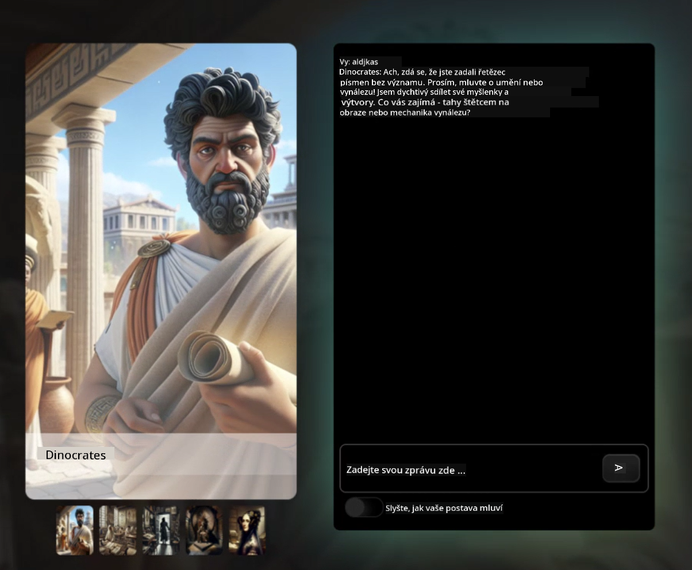

<!--
CO_OP_TRANSLATOR_METADATA:
{
  "original_hash": "efa251c5fc089367f0a81c572874afca",
  "translation_date": "2025-08-28T03:19:32+00:00",
  "source_file": "README.md",
  "language_code": "cs"
}
-->
[](https://github.com/microsoft/Web-Dev-For-Beginners/blob/master/LICENSE)  
[](https://GitHub.com/microsoft/Web-Dev-For-Beginners/graphs/contributors/)  
[](https://GitHub.com/microsoft/Web-Dev-For-Beginners/issues/)  
[](https://GitHub.com/microsoft/Web-Dev-For-Beginners/pulls/)  
[](http://makeapullrequest.com)  

[](https://GitHub.com/microsoft/Web-Dev-For-Beginners/watchers/)  
[](https://GitHub.com/microsoft/Web-Dev-For-Beginners/network/)  
[](https://GitHub.com/microsoft/Web-Dev-For-Beginners/stargazers/)  

[](https://discord.gg/zxKYvhSnVp?WT.mc_id=academic-000002-leestott)  

[](https://open.vscode.dev/microsoft/Web-Dev-For-Beginners)  

[](https://discord.com/invite/ByRwuEEgH4)  

Postupujte podle těchto kroků, abyste mohli začít používat tyto zdroje:  
1. **Forkněte repozitář**: Klikněte [](https://GitHub.com/microsoft/Web-Dev-For-Beginners/fork)  
2. **Naklonujte repozitář**:   `git clone https://github.com/microsoft/Web-Dev-For-Beginners.git`  
3. [**Připojte se na Discord Azure AI Foundry a setkejte se s experty a dalšími vývojáři**](https://discord.com/invite/ByRwuEEgH4)  

# Webový vývoj pro začátečníky - Kurikulum  

Naučte se základy webového vývoje s naším 12týdenním komplexním kurzem od Microsoft Cloud Advocates. Každá z 24 lekcí se zaměřuje na JavaScript, CSS a HTML prostřednictvím praktických projektů, jako jsou terária, rozšíření pro prohlížeče a vesmírné hry. Zapojte se do kvízů, diskusí a praktických úkolů. Zlepšete své dovednosti a optimalizujte si zapamatování znalostí díky našemu efektivnímu přístupu založenému na projektech. Začněte svou cestu kódování ještě dnes!  

#### 🧑‍🎓 _Jste student?_  

Navštivte [**stránku Student Hub**](https://docs.microsoft.com/learn/student-hub/?WT.mc_id=academic-77807-sagibbon), kde najdete zdroje pro začátečníky, studentské balíčky a dokonce způsoby, jak získat voucher na certifikát zdarma. Tuto stránku si uložte do záložek a pravidelně ji kontrolujte, protože obsah měníme každý měsíc.  

### 📣 Oznámení - _Nové kurikulum_ o generativní AI pro JavaScript bylo právě vydáno  

Nezmeškejte naše nové kurikulum o generativní AI!  

Navštivte [https://aka.ms/genai-js-course](https://aka.ms/genai-js-course) a začněte!  

  

- Lekce pokrývající vše od základů po RAG.  
- Interakce s historickými postavami pomocí GenAI a naší doprovodné aplikace.  
- Zábavný a poutavý příběh, budete cestovat časem!  

  

Každá lekce obsahuje úkol k dokončení, kontrolu znalostí a výzvu, která vás provede učením témat, jako jsou:  
- Tvorba promptů a jejich inženýrství  
- Generování textových a obrazových aplikací  
- Vyhledávací aplikace  

Navštivte [https://aka.ms/genai-js-course](../../[https:/aka.ms/genai-js-course) a začněte!  

## 🌱 Začínáme  

> **Učitelé**, [zahrnuli jsme několik návrhů](for-teachers.md), jak toto kurikulum využít. Budeme rádi za vaši zpětnou vazbu [v našem diskusním fóru](https://github.com/microsoft/Web-Dev-For-Beginners/discussions/categories/teacher-corner)!  

**[Studenti](https://aka.ms/student-page/?WT.mc_id=academic-77807-sagibbon)**, u každé lekce začněte kvízem před přednáškou, pokračujte čtením materiálů, dokončete různé aktivity a ověřte si své znalosti kvízem po přednášce.  

Pro zlepšení vašeho vzdělávacího zážitku se spojte se svými vrstevníky a pracujte na projektech společně! Diskuse jsou podporovány v našem [diskusním fóru](https://github.com/microsoft/Web-Dev-For-Beginners/discussions), kde bude náš tým moderátorů k dispozici, aby odpověděl na vaše otázky.  

Pro další vzdělávání důrazně doporučujeme prozkoumat [Microsoft Learn](https://learn.microsoft.com/users/wirelesslife/collections/p1ddcy5jwy0jkm?WT.mc_id=academic-77807-sagibbon) pro další studijní materiály.  

### 📋 Nastavení vašeho prostředí  

Toto kurikulum má připravené vývojové prostředí! Jakmile začnete, můžete si vybrat, zda budete kurikulum spouštět v [Codespace](https://github.com/features/codespaces/) (_prostředí založené na prohlížeči, bez nutnosti instalace_), nebo lokálně na vašem počítači pomocí textového editoru, jako je [Visual Studio Code](https://code.visualstudio.com/?WT.mc_id=academic-77807-sagibbon).  

#### Vytvořte si svůj repozitář  
Abyste mohli snadno ukládat svou práci, doporučujeme vytvořit si vlastní kopii tohoto repozitáře. Můžete to udělat kliknutím na tlačítko **Use this template** v horní části stránky. Tím se vytvoří nový repozitář ve vašem GitHub účtu s kopií kurikula.  

Postupujte podle těchto kroků:  
1. **Forkněte repozitář**: Klikněte na tlačítko "Fork" v pravém horním rohu této stránky.  
2. **Naklonujte repozitář**:   `git clone https://github.com/microsoft/Web-Dev-For-Beginners.git`  

#### Spuštění kurikula v Codespace  

Ve vaší kopii tohoto repozitáře, kterou jste vytvořili, klikněte na tlačítko **Code** a vyberte **Open with Codespaces**. Tím se vytvoří nový Codespace, ve kterém můžete pracovat.  

[!Codespace](../..)./images/createcodespace.png)  

#### Spuštění kurikula lokálně na vašem počítači  

Pro spuštění tohoto kurikula lokálně na vašem počítači budete potřebovat textový editor, prohlížeč a nástroj příkazového řádku. Naše první lekce, [Úvod do programovacích jazyků a nástrojů](../../1-getting-started-lessons/1-intro-to-programming-languages), vás provede různými možnostmi pro každý z těchto nástrojů, abyste si mohli vybrat, co vám nejlépe vyhovuje.  

Naše doporučení je použít [Visual Studio Code](https://code.visualstudio.com/?WT.mc_id=academic-77807-sagibbon) jako váš editor, který má také vestavěný [Terminál](https://code.visualstudio.com/docs/terminal/basics/?WT.mc_id=academic-77807-sagibbon). Visual Studio Code si můžete stáhnout [zde](https://code.visualstudio.com/?WT.mc_id=academic-77807-sagibbon).  

1. Naklonujte svůj repozitář na váš počítač. Můžete to udělat kliknutím na tlačítko **Code** a zkopírováním URL:  

    [!CodeSpace](./images/createcodespace.png)  

    Poté otevřete [Terminál](https://code.visualstudio.com/docs/terminal/basics/?WT.mc_id=academic-77807-sagibbon) ve [Visual Studio Code](https://code.visualstudio.com/?WT.mc_id=academic-77807-sagibbon) a spusťte následující příkaz, nahraďte `<your-repository-url>` URL, kterou jste právě zkopírovali:  

    ```bash 
    git clone <your-repository-url>
    ```  

2. Otevřete složku ve Visual Studio Code. Můžete to udělat kliknutím na **File** > **Open Folder** a výběrem složky, kterou jste právě naklonovali.  

>  Doporučené rozšíření pro Visual Studio Code:  
>  
> * [Live Server](https://marketplace.visualstudio.com/items?itemName=ritwickdey.LiveServer&WT.mc_id=academic-77807-sagibbon) - pro náhled HTML stránek přímo ve Visual Studio Code  
> * [Copilot](https://marketplace.visualstudio.com/items?itemName=GitHub.copilot&WT.mc_id=academic-77807-sagibbon) - pro rychlejší psaní kódu  

## 📂 Každá lekce obsahuje:  

- volitelný sketchnote  
- volitelný doplňkový video materiál  
- zahřívací kvíz před lekcí  
- psanou lekci  
- u lekcí založených na projektech, podrobné návody, jak projekt vytvořit  
- kontrolu znalostí  
- výzvu  
- doplňkové čtení  
- úkol  
- [kvíz po lekci](https://ff-quizzes.netlify.app/)  

> **Poznámka ke kvízům**: Všechny kvízy jsou obsaženy ve složce Quiz-app, celkem 48 kvízů po třech otázkách. Jsou dostupné [zde](https://ff-quizzes.netlify.app/) a aplikaci kvízů lze spustit lokálně nebo nasadit na Azure; postupujte podle pokynů ve složce `quiz-app`.  

## 🗃️ Lekce  

|     |                       Název projektu                       |                            Učené koncepty                             | Cíle učení                                                                                                                         |                                                         Odkaz na lekci                                                          |         Autor          |  
| :-: | :------------------------------------------------------: | :--------------------------------------------------------------------: | ----------------------------------------------------------------------------------------------------------------------------------- | :----------------------------------------------------------------------------------------------------------------------------: | :---------------------: |  
| 01  |                     Začínáme                      |           Úvod do programování a nástrojů           | Naučte se základní principy většiny programovacích jazyků a o softwaru, který pomáhá profesionálním vývojářům při práci | [Úvod do programovacích jazyků a nástrojů](./1-getting-started-lessons/1-intro-to-programming-languages/README.md) |         Jasmine         |  
| 02  |                     Začínáme                      |             Základy GitHubu, včetně práce v týmu             | Jak používat GitHub ve vašem projektu, jak spolupracovat s ostatními na kódové základně                                                    |                            [Úvod do GitHubu](./1-getting-started-lessons/2-github-basics/README.md)                             |          Floor          |  
| 03  |                     Začínáme                      |                             Přístupnost                              | Naučte se základy webové přístupnosti                                                                                               |                       [Základy přístupnosti](./1-getting-started-lessons/3-accessibility/README.md)                       |       Christopher       |  
| 04  |                        Základy JS                         |                         Datové typy v JavaScriptu                          | Základy datových typů v JavaScriptu                                                                                                 |                                       [Datové typy](./2-js-basics/1-data-types/README.md)                                        |         Jasmine         |  
| 05  |                        Základy JS                         |                         Funkce a metody                          | Naučte se o funkcích a metodách pro řízení logického toku aplikace                                                             |                              [Funkce a metody](./2-js-basics/2-functions-methods/README.md)                               | Jasmine a Christopher |  
| 06  |                        Základy JS                         |                        Rozhodování v JS                        | Naučte se vytvářet podmínky ve vašem kódu pomocí metod rozhodování                                                           |                                 [Rozhodování](./2-js-basics/3-making-decisions/README.md)                                  |         Jasmine         |  
| 07  |                        Základy JS                         |                            Pole a smyčky                            | Práce s daty pomocí polí a smyček v JavaScriptu                                                                                 |                                   [Pole a smyčky](./2-js-basics/4-arrays-loops/README.md)                                    |         Jasmine         |  
| 08  |       [Terárium](./3-terrarium/solution/README.md)       |                            HTML v praxi                            | Vytvořte HTML pro online terárium, zaměřte se na tvorbu rozvržení                                                         |                                 [Úvod do HTML](./3-terrarium/1-intro-to-html/README.md)                                 |           Jen           |  
| 09  |       [Terárium](./3-terrarium/solution/README.md)       |                            CSS v praxi                             | Vytvořte CSS pro stylizaci online terária, zaměřte se na základy CSS včetně vytvoření responzivní stránky                     |                                  [Úvod do CSS](./3-terrarium/2-intro-to-css/README.md)                                  |           Jen           |  
| 10  |            [Terrarium](./3-terrarium/solution/README.md)            |                 JavaScript Closures, manipulace s DOM                  | Vytvořte JavaScript, který umožní teráriu fungovat jako rozhraní pro přetahování, se zaměřením na uzávěry a manipulaci s DOM         |                  [JavaScript Closures, manipulace s DOM](./3-terrarium/3-intro-to-DOM-and-closures/README.md)                   |           Jen           |
| 11  |          [Typing Game](./4-typing-game/solution/README.md)          |                          Vytvořte hru na psaní                         | Naučte se používat události klávesnice k řízení logiky vaší JavaScriptové aplikace                                                  |                                [Programování řízené událostmi](./4-typing-game/typing-game/README.md)                            |       Christopher       |
| 12  | [Green Browser Extension](./5-browser-extension/solution/README.md) |                         Práce s prohlížeči                             | Naučte se, jak fungují prohlížeče, jejich historii a jak vytvořit první prvky rozšíření prohlížeče                                   |                               [O prohlížečích](./5-browser-extension/1-about-browsers/README.md)                                |           Jen           |
| 13  | [Green Browser Extension](./5-browser-extension/solution/README.md) | Vytvoření formuláře, volání API a ukládání proměnných do lokálního úložiště | Vytvořte JavaScriptové prvky rozšíření prohlížeče, které volají API pomocí proměnných uložených v lokálním úložišti                 |                [API, formuláře a lokální úložiště](./5-browser-extension/2-forms-browsers-local-storage/README.md)              |           Jen           |
| 14  | [Green Browser Extension](./5-browser-extension/solution/README.md) |          Procesy na pozadí v prohlížeči, výkon webu                    | Použijte procesy na pozadí prohlížeče k řízení ikony rozšíření; naučte se o výkonu webu a některých optimalizacích                  |             [Úkoly na pozadí a výkon](./5-browser-extension/3-background-tasks-and-performance/README.md)                      |           Jen           |
| 15  |           [Space Game](./6-space-game/solution/README.md)           |             Pokročilejší vývoj her s JavaScriptem                      | Naučte se o dědičnosti pomocí tříd a kompozice a o vzoru Pub/Sub, jako přípravu na tvorbu hry                                       |                      [Úvod do pokročilého vývoje her](./6-space-game/1-introduction/README.md)                                  |          Chris          |
| 16  |           [Space Game](./6-space-game/solution/README.md)           |                           Kreslení na plátno                           | Naučte se o Canvas API, které se používá k vykreslování prvků na obrazovku                                                         |                                [Kreslení na plátno](./6-space-game/2-drawing-to-canvas/README.md)                               |          Chris          |
| 17  |           [Space Game](./6-space-game/solution/README.md)           |                   Pohyb prvků po obrazovce                             | Objevte, jak mohou prvky získat pohyb pomocí kartézských souřadnic a Canvas API                                                    |                           [Pohyb prvků](./6-space-game/3-moving-elements-around/README.md)                                      |          Chris          |
| 18  |           [Space Game](./6-space-game/solution/README.md)           |                          Detekce kolizí                                | Umožněte prvkům kolidovat a reagovat na sebe pomocí stisků kláves a přidejte funkci cooldown pro zajištění výkonu hry               |                              [Detekce kolizí](./6-space-game/4-collision-detection/README.md)                                   |          Chris          |
| 19  |           [Space Game](./6-space-game/solution/README.md)           |                             Počítání skóre                             | Provádějte matematické výpočty na základě stavu hry a jejího výkonu                                                                 |                                    [Počítání skóre](./6-space-game/5-keeping-score/README.md)                                   |          Chris          |
| 20  |           [Space Game](./6-space-game/solution/README.md)           |                     Ukončení a restartování hry                        | Naučte se o ukončení a restartování hry, včetně vyčištění prostředků a resetování hodnot proměnných                                 |                                [Podmínka ukončení](./6-space-game/6-end-condition/README.md)                                    |          Chris          |
| 21  |         [Banking App](./7-bank-project/solution/README.md)          |                 HTML šablony a směrování ve webové aplikaci            | Naučte se, jak vytvořit strukturu architektury vícestránkového webu pomocí směrování a HTML šablon                                 |                            [HTML šablony a směrování](./7-bank-project/1-template-route/README.md)                              |          Yohan          |
| 22  |         [Banking App](./7-bank-project/solution/README.md)          |                  Vytvoření přihlašovacího a registračního formuláře    | Naučte se o tvorbě formulářů a zpracování validačních rutin                                                                         |                                           [Formuláře](./7-bank-project/2-forms/README.md)                                       |          Yohan          |
| 23  |         [Banking App](./7-bank-project/solution/README.md)          |                   Metody získávání a používání dat                     | Jak data proudí do vaší aplikace a z ní, jak je získávat, ukládat a likvidovat                                                     |                                            [Data](./7-bank-project/3-data/README.md)                                            |          Yohan          |
| 24  |         [Banking App](./7-bank-project/solution/README.md)          |                      Koncepty správy stavu                             | Naučte se, jak vaše aplikace uchovává stav a jak jej programově spravovat                                                          |                                [Správa stavu](./7-bank-project/4-state-management/README.md)                                    |          Yohan          |


## 🏫 Pedagogika

Náš vzdělávací program je navržen s ohledem na dvě klíčové pedagogické principy:
* učení založené na projektech
* časté kvízy

Program učí základy JavaScriptu, HTML a CSS, stejně jako nejnovější nástroje a techniky používané dnešními webovými vývojáři. Studenti získají praktické zkušenosti při tvorbě hry na psaní, virtuálního terária, ekologického rozšíření prohlížeče, hry ve stylu Space Invaders a bankovní aplikace pro firmy. Na konci série studenti získají pevné základy webového vývoje.


> 🎓 První lekce tohoto vzdělávacího programu si můžete vyzkoušet jako [Learn Path](https://docs.microsoft.com/learn/paths/web-development-101/?WT.mc_id=academic-77807-sagibbon) na Microsoft Learn!

Díky tomu, že obsah odpovídá projektům, je proces pro studenty poutavější a zlepšuje se zapamatování konceptů. Také jsme napsali několik úvodních lekcí o základech JavaScriptu, které představují koncepty, doplněné videem ze série "[Beginners Series to: JavaScript](https://channel9.msdn.com/Series/Beginners-Series-to-JavaScript/?WT.mc_id=academic-77807-sagibbon)" s video tutoriály, na jejichž tvorbě se podíleli někteří autoři tohoto vzdělávacího programu.

Navíc nízkostresový kvíz před hodinou nastaví záměr studenta na učení daného tématu, zatímco druhý kvíz po hodině zajistí lepší zapamatování. Tento vzdělávací program byl navržen tak, aby byl flexibilní a zábavný, a lze jej absolvovat celý nebo jen jeho část. Projekty začínají jednoduše a postupně se stávají složitějšími během 12týdenního cyklu.

Záměrně jsme se vyhnuli zavádění JavaScriptových frameworků, abychom se soustředili na základní dovednosti potřebné jako webový vývojář před přijetím frameworku. Dobrou další etapou po dokončení tohoto vzdělávacího programu by bylo naučit se o Node.js prostřednictvím jiné série videí: "[Beginner Series to: Node.js](https://channel9.msdn.com/Series/Beginners-Series-to-Nodejs/?WT.mc_id=academic-77807-sagibbon)".

> Navštivte naše [Pravidla chování](CODE_OF_CONDUCT.md) a [Pokyny pro přispívání](CONTRIBUTING.md). Uvítáme vaši konstruktivní zpětnou vazbu!


## 🧭 Offline přístup

Tuto dokumentaci můžete spustit offline pomocí [Docsify](https://docsify.js.org/#/). Forkněte tento repozitář, [nainstalujte Docsify](https://docsify.js.org/#/quickstart) na svůj lokální počítač a poté v kořenové složce tohoto repozitáře zadejte `docsify serve`. Webová stránka bude spuštěna na portu 3000 na vašem localhostu: `localhost:3000`.

## 📘 PDF

PDF všech lekcí najdete [zde](https://microsoft.github.io/Web-Dev-For-Beginners/pdf/readme.pdf).


## 🎒 Další kurzy

Náš tým vytváří další kurzy! Podívejte se na:

- [Generativní AI pro začátečníky](https://aka.ms/genai-beginners)
- [Generativní AI pro začátečníky .NET](https://github.com/microsoft/Generative-AI-for-beginners-dotnet)
- [Generativní AI s JavaScriptem](https://github.com/microsoft/generative-ai-with-javascript)
- [Generativní AI s Javou](https://github.com/microsoft/Generative-AI-for-beginners-java)
- [AI pro začátečníky](https://aka.ms/ai-beginners)
- [Data Science pro začátečníky](https://aka.ms/datascience-beginners)
- [ML pro začátečníky](https://aka.ms/ml-beginners)
- [Kybernetická bezpečnost pro začátečníky](https://github.com/microsoft/Security-101)
- [Webový vývoj pro začátečníky](https://aka.ms/webdev-beginners)
- [IoT pro začátečníky](https://aka.ms/iot-beginners)
- [Vývoj XR pro začátečníky](https://github.com/microsoft/xr-development-for-beginners)
- [Ovládnutí GitHub Copilot pro agentické použití](https://github.com/microsoft/Mastering-GitHub-Copilot-for-Paired-Programming)
- [Ovládnutí GitHub Copilot pro vývojáře C#/.NET](https://github.com/microsoft/mastering-github-copilot-for-dotnet-csharp-developers)
- [Vyberte si vlastní dobrodružství s Copilotem](https://github.com/microsoft/CopilotAdventures)

## Licence

Tento repozitář je licencován pod licencí MIT. Další informace najdete v souboru [LICENSE](../../LICENSE).

---

**Prohlášení**:  
Tento dokument byl přeložen pomocí služby pro automatický překlad [Co-op Translator](https://github.com/Azure/co-op-translator). Ačkoli se snažíme o přesnost, mějte prosím na paměti, že automatické překlady mohou obsahovat chyby nebo nepřesnosti. Původní dokument v jeho původním jazyce by měl být považován za autoritativní zdroj. Pro důležité informace doporučujeme profesionální lidský překlad. Neodpovídáme za žádné nedorozumění nebo nesprávné interpretace vyplývající z použití tohoto překladu.