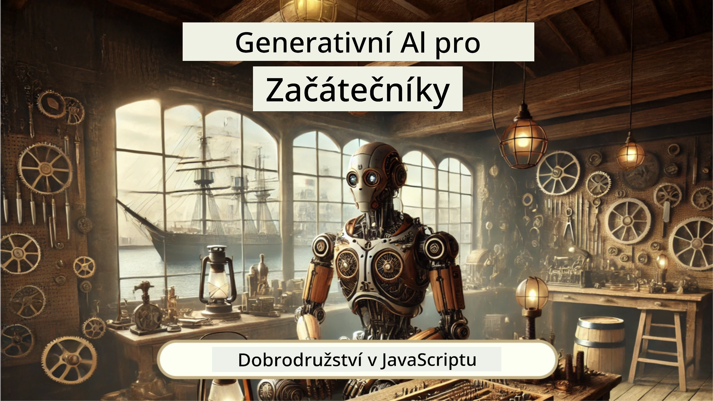
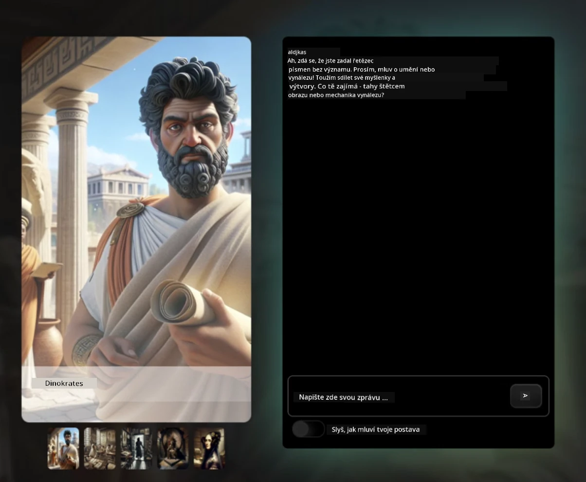
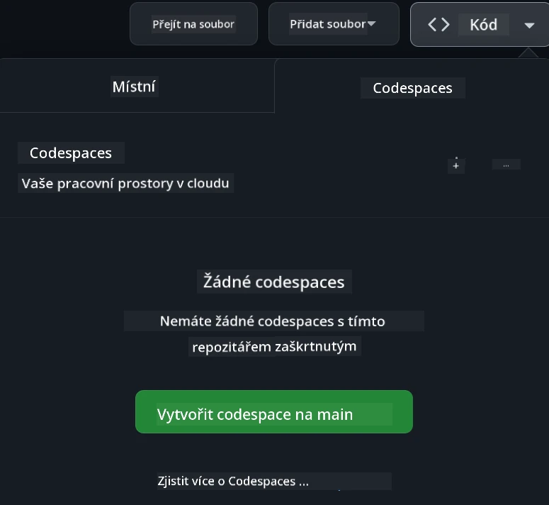

[](https://github.com/microsoft/Web-Dev-For-Beginners/blob/master/LICENSE)
[](https://GitHub.com/microsoft/Web-Dev-For-Beginners/graphs/contributors/)
[](https://GitHub.com/microsoft/Web-Dev-For-Beginners/issues/)
[](https://GitHub.com/microsoft/Web-Dev-For-Beginners/pulls/)
[](http://makeapullrequest.com) 

[](https://GitHub.com/microsoft/Web-Dev-For-Beginners/watchers/)
[](https://GitHub.com/microsoft/Web-Dev-For-Beginners/network/)
[](https://GitHub.com/microsoft/Web-Dev-For-Beginners/stargazers/)

[](https://discord.gg/nTYy5BXMWG)

# Webový vývoj pro začátečníky - kurikulum

Naučte se základy webového vývoje s naším 12týdenním komplexním kurzem od Microsoft Cloud Advocates. Každá ze 24 lekcí se zabývá JavaScriptem, CSS a HTML prostřednictvím praktických projektů, jako jsou terária, rozšíření pro prohlížeče a vesmírné hry. Zapojte se do kvízů, diskuzí a praktických úkolů. Zlepšete své dovednosti a optimalizujte uchování znalostí díky naší efektivní projektově orientované pedagogice. Začněte svou cestu programování ještě dnes!

Připojte se k Azure AI Foundry Discord komunitě

[](https://discord.gg/nTYy5BXMWG)

Postupujte podle těchto kroků, abyste začali používat tyto zdroje:
1. **Vytvořte Fork repozitáře**: Klikněte na [](https://GitHub.com/microsoft/Web-Dev-For-Beginners/fork)
2. **Naklonujte repozitář**:   `git clone https://github.com/microsoft/Web-Dev-For-Beginners.git`
3. [**Přidejte se k Azure AI Foundry Discord a poznejte experty a ostatní vývojáře**](https://discord.com/invite/ByRwuEEgH4)

### 🌐 Podpora více jazyků

#### Podporováno pomocí GitHub Action (automatizováno a vždy aktuální)

<!-- CO-OP TRANSLATOR LANGUAGES TABLE START -->
[Arabic](../ar/README.md) | [Bengali](../bn/README.md) | [Bulgarian](../bg/README.md) | [Burmese (Myanmar)](../my/README.md) | [Čínština (zjednodušená)](../zh-CN/README.md) | [Čínština (tradiční, Hongkong)](../zh-HK/README.md) | [Čínština (tradiční, Macao)](../zh-MO/README.md) | [Čínština (tradiční, Tchaj-wan)](../zh-TW/README.md) | [Chorvatština](../hr/README.md) | [Čeština](./README.md) | [Dánština](../da/README.md) | [Nizozemština](../nl/README.md) | [Estonština](../et/README.md) | [Finština](../fi/README.md) | [Francouzština](../fr/README.md) | [Němčina](../de/README.md) | [Řečtina](../el/README.md) | [Hebrejština](../he/README.md) | [Hindština](../hi/README.md) | [Maďarština](../hu/README.md) | [Indonéština](../id/README.md) | [Italština](../it/README.md) | [Japonština](../ja/README.md) | [Kannadština](../kn/README.md) | [Korejština](../ko/README.md) | [Litevština](../lt/README.md) | [Malajština](../ms/README.md) | [Malayalam](../ml/README.md) | [Maráthština](../mr/README.md) | [Nepálština](../ne/README.md) | [Nigérijská pidžin](../pcm/README.md) | [Norština](../no/README.md) | [Perština (Farsi)](../fa/README.md) | [Polština](../pl/README.md) | [Portugalština (Brazílie)](../pt-BR/README.md) | [Portugalština (Portugalsko)](../pt-PT/README.md) | [Paňdžábština (Gurmukhí)](../pa/README.md) | [Rumunština](../ro/README.md) | [Ruština](../ru/README.md) | [Srbština (cyrilice)](../sr/README.md) | [Slovenština](../sk/README.md) | [Slovinština](../sl/README.md) | [Španělština](../es/README.md) | [Svahilština](../sw/README.md) | [Švédština](../sv/README.md) | [Tagalog (Filipínština)](../tl/README.md) | [Tamil](../ta/README.md) | [Telugština](../te/README.md) | [Thajština](../th/README.md) | [Turečtina](../tr/README.md) | [Ukrajinština](../uk/README.md) | [Urdu](../ur/README.md) | [Vietnamština](../vi/README.md)

> **Raději klonovat lokálně?**
>
> Tento repozitář obsahuje více než 50 překladů jazyků, což výrazně zvětšuje velikost stahování. Pro klonování bez překladů použijte sparse checkout:
>
> **Bash / macOS / Linux:**
> ```bash
> git clone --filter=blob:none --sparse https://github.com/microsoft/Web-Dev-For-Beginners.git
> cd Web-Dev-For-Beginners
> git sparse-checkout set --no-cone '/*' '!translations' '!translated_images'
> ```
>
> **CMD (Windows):**
> ```cmd
> git clone --filter=blob:none --sparse https://github.com/microsoft/Web-Dev-For-Beginners.git
> cd Web-Dev-For-Beginners
> git sparse-checkout set --no-cone "/*" "!translations" "!translated_images"
> ```
>
> Tím získáte vše potřebné k dokončení kurzu s mnohem rychlejším stažením.
<!-- CO-OP TRANSLATOR LANGUAGES TABLE END -->

**Pokud chcete podporu dalších jazyků, jsou zde uvedeny podporované jazykové možnosti [zde](https://github.com/Azure/co-op-translator/blob/main/getting_started/supported-languages.md)**

[](https://open.vscode.dev/microsoft/Web-Dev-For-Beginners)

#### 🧑‍🎓 _Jste student?_

Navštivte [**Student Hub stránku**](https://docs.microsoft.com/learn/student-hub/?WT.mc_id=academic-77807-sagibbon), kde naleznete zdroje pro začátečníky, studentské balíčky a dokonce i způsoby, jak získat bezplatný certifikát. Tuto stránku si chcete zařadit mezi oblíbené a čas od času ji zkontrolovat, protože obsah měníme měsíčně.

### 📣 Oznámení - Nové výzvy režimu GitHub Copilot Agent k dokončení!

Přidána nová výzva, hledejte "GitHub Copilot Agent Challenge 🚀" ve většině kapitol. To je nová výzva, kterou máte dokončit pomocí GitHub Copilot a režimu Agent. Pokud jste režim Agent nikdy nepoužili, umožňuje nejen generovat text, ale také vytvářet a upravovat soubory, spouštět příkazy a další.

### 📣 Oznámení - _Nový projekt k vytvoření pomocí generativní AI_

Právě přidán nový projekt AI asistenta, podívejte se na [projekt](./9-chat-project/README.md)

### 📣 Oznámení - _Nové kurikulum_ o generativní AI pro JavaScript bylo právě vydáno

Nezmeškejte naše nové kurikulum Generativní AI!

Navštivte [https://aka.ms/genai-js-course](https://aka.ms/genai-js-course) a začněte!



- Lekce pokrývají vše od základů až po RAG.
- Komunikujte s historickými postavami pomocí GenAI a naší průvodní aplikace.
- Zábavný a poutavý příběh, budete cestovat časem!




Každá lekce obsahuje úkol k dokončení, ověření znalostí a výzvu, která vás provede tématy jako:
- Vytváření promptů a jejich inženýrství
- Generování textových a obrazových aplikací
- Vyhledávací aplikace

Navštivte [https://aka.ms/genai-js-course](https://aka.ms/genai-js-course) a začněte!


## 🌱 Začínáme

> **Učitelé**, zahrnuli jsme [několik návrhů](for-teachers.md), jak použít toto kurikulum. Budeme rádi za vaši zpětnou vazbu [v našem diskuzním fóru](https://github.com/microsoft/Web-Dev-For-Beginners/discussions/categories/teacher-corner)!

**[Studující](https://aka.ms/student-page/?WT.mc_id=academic-77807-sagibbon)**, u každé lekce začněte přednáškovým kvízem a pokračujte čtením přednáškového materiálu, dokončením různých aktivit a ověřením porozumění pomocí povětrná přednáškového kvízu.

Pro lepší zkušenosti s učením se spojte s kolegy a pracujte na projektech společně! Diskuze jsou vítané v našem [diskuzním fóru](https://github.com/microsoft/Web-Dev-For-Beginners/discussions), kde je k dispozici náš tým moderátorů, kteří vám pomohou.

Pro další vzdělávání doporučujeme prozkoumat [Microsoft Learn](https://learn.microsoft.com/users/wirelesslife/collections/p1ddcy5jwy0jkm?WT.mc_id=academic-77807-sagibbon) pro doplňující studijní materiály.

### 📋 Nastavení vašeho prostředí

Toto kurikulum má připravené vývojové prostředí! Na začátku si můžete vybrat, zda budete kurz spouštět v [Codespace](https://github.com/features/codespaces/) (_prohlížečem ovládané prostředí bez nutnosti instalace_), nebo lokálně na svém počítači pomocí textového editoru, například [Visual Studio Code](https://code.visualstudio.com/?WT.mc_id=academic-77807-sagibbon).

#### Vytvořte si vlastní repozitář
Pro snadné ukládání vaší práce je doporučeno vytvořit si vlastní kopii tohoto repozitáře. Můžete tak učinit kliknutím na tlačítko **Použít tuto šablonu** na vrchu stránky. Tím se vytvoří nový repozitář na vašem GitHub účtu s kopií kurikula.

Postupujte následovně:
1. **Vytvořte Fork repozitáře**: Klikněte na tlačítko „Fork“ v pravém horním rohu této stránky.
2. **Naklonujte repozitář**:   `git clone https://github.com/microsoft/Web-Dev-For-Beginners.git`

#### Spuštění kurikula v Codespace

Ve své kopii repozitáře klikněte na tlačítko **Code** a vyberte **Open with Codespaces**. Tím vytvoříte nový Codespace, ve kterém můžete pracovat.



#### Spuštění kurikula lokálně na vašem počítači

Pro spuštění tohoto kurikula lokálně budete potřebovat textový editor, prohlížeč a nástroj příkazového řádku. Naše první lekce, [Úvod do programovacích jazyků a nástrojů](../../1-getting-started-lessons/1-intro-to-programming-languages), vás provede různými možnostmi pro každý z těchto nástrojů, abyste si vybrali, co vám vyhovuje nejvíce.

Doporučujeme použít [Visual Studio Code](https://code.visualstudio.com/?WT.mc_id=academic-77807-sagibbon) jako editor, který má také zabudovaný [Terminál](https://code.visualstudio.com/docs/terminal/basics/?WT.mc_id=academic-77807-sagibbon). Visual Studio Code si můžete stáhnout [zde](https://code.visualstudio.com/?WT.mc_id=academic-77807-sagibbon).
1. Naklonujte si své úložiště do počítače. Můžete to udělat kliknutím na tlačítko **Code** a zkopírováním URL:

    [CodeSpace](./images/createcodespace.png)

    Poté otevřete [Terminál](https://code.visualstudio.com/docs/terminal/basics/?WT.mc_id=academic-77807-sagibbon) ve [Visual Studio Code](https://code.visualstudio.com/?WT.mc_id=academic-77807-sagibbon) a spusťte následující příkaz, přičemž `<your-repository-url>` nahraďte právě zkopírovanou URL:

    ```bash 
    git clone <your-repository-url>
    ```

2. Otevřete složku ve Visual Studio Code. Můžete to udělat kliknutím na **File** > **Open Folder** a výběrem složky, kterou jste právě naklonovali.


>  Doporučené rozšíření Visual Studio Code:
>
> * [Live Server](https://marketplace.visualstudio.com/items?itemName=ritwickdey.LiveServer&WT.mc_id=academic-77807-sagibbon) - pro náhled HTML stránek přímo ve Visual Studio Code
> * [Copilot](https://marketplace.visualstudio.com/items?itemName=GitHub.copilot&WT.mc_id=academic-77807-sagibbon) - pomáhá rychleji psát kód

## 📂 Každá lekce obsahuje:

- volitelnou náčrtnou poznámku (sketchnote)
- volitelné doplňkové video
- rozcvičovací kvíz před lekcí
- psanou lekci
- u lekcí založených na projektu krok za krokem průvodce, jak projekt postavit
- kontrolní otázky
- výzvu
- doplňkové čtení
- úkol
- [kvíz po lekci](https://ff-quizzes.netlify.app/web/)

> **Poznámka ke kvízům**: Všechny kvízy jsou uloženy ve složce Quiz-app, celkem 48 kvízů po třech otázkách. Jsou dostupné [zde](https://ff-quizzes.netlify.app/web/), kvízovou aplikaci lze spustit lokálně nebo nasadit na Azure; postupujte podle instrukcí ve složce `quiz-app`.

## 🗃️ Lekce

|     |                       Název projektu                       |                            Naučené koncepty                             | Cíle učení                                                                                                                 |                                                         Propojená lekce                                                          |         Autor          |
| :-: | :--------------------------------------------------------: | :--------------------------------------------------------------------: | -------------------------------------------------------------------------------------------------------------------------- | :----------------------------------------------------------------------------------------------------------------------------: | :---------------------: |
| 01  |                     Začínáme                              |           Úvod do programování a nástroje řemesla                      | Naučte se základní principy většiny programovacích jazyků a o softwaru, která pomáhá profesionálním vývojářům              | [Úvod do programovacích jazyků a nástrojů](./1-getting-started-lessons/1-intro-to-programming-languages/README.md)              |         Jasmine         |
| 02  |                     Začínáme                              |             Základy GitHubu, včetně práce v týmu                       | Jak používat GitHub ve vašem projektu, jak spolupracovat s ostatními na kódu                                              |                            [Úvod do GitHubu](./1-getting-started-lessons/2-github-basics/README.md)                               |          Floor          |
| 03  |                     Začínáme                              |                             Přístupnost                                 | Naučte se základy webové přístupnosti                                                                                        |                       [Základy přístupnosti](./1-getting-started-lessons/3-accessibility/README.md)                              |       Christopher       |
| 04  |                        Základy JS                         |                         Datové typy JavaScriptu                        | Základy datových typů v JavaScriptu                                                                                        |                                       [Datové typy](./2-js-basics/1-data-types/README.md)                                        |         Jasmine         |
| 05  |                        Základy JS                         |                         Funkce a metody                                | Naučte se o funkcích a metodách k řízení logiky aplikace                                                                   |                              [Funkce a metody](./2-js-basics/2-functions-methods/README.md)                                     | Jasmine a Christopher   |
| 06  |                        Základy JS                         |                        Rozhodování v JS                               | Naučte se vytvářet podmínky ve vašem kódu pomocí rozhodovacích metod                                                        |                                 [Rozhodování](./2-js-basics/3-making-decisions/README.md)                                      |         Jasmine         |
| 07  |                        Základy JS                         |                            Pole a cykly                                | Práce s daty pomocí polí a cyklů v JavaScriptu                                                                             |                                   [Pole a cykly](./2-js-basics/4-arrays-loops/README.md)                                        |         Jasmine         |
| 08  |       [Terrarium](./3-terrarium/solution/README.md)       |                            HTML v praxi                               | Vytvořte HTML pro online terárium, zaměřte se na tvorbu rozvržení                                                           |                                 [Úvod do HTML](./3-terrarium/1-intro-to-html/README.md)                                       |           Jen           |
| 09  |       [Terrarium](./3-terrarium/solution/README.md)       |                            CSS v praxi                                | Vytvořte CSS pro stylování online terária, zaměřte se na základy CSS včetně responzivního designu                           |                                  [Úvod do CSS](./3-terrarium/2-intro-to-css/README.md)                                        |           Jen           |
| 10  |            [Terrarium](./3-terrarium/solution/README.md)            |                 JavaScriptové uzávěry, manipulace s DOM               | Napište JavaScript, aby terárium fungovalo jako rozhraní drag/drop, zaměřte se na uzávěry a manipulaci s DOM                 |                  [JavaScriptové uzávěry, manipulace s DOM](./3-terrarium/3-intro-to-DOM-and-closures/README.md)                |           Jen           |
| 11  |          [Typing Game](./4-typing-game/solution/README.md)          |                          Vytvoření hry psaní na klávesnici           | Naučte se používat události klávesnice k řízení logiky JavaScriptové aplikace                                              |                                [Programování řízené událostmi](./4-typing-game/typing-game/README.md)                           |       Christopher       |
| 12  | [Green Browser Extension](./5-browser-extension/solution/README.md) |                         Práce s prohlížeči                           | Naučte se, jak fungují prohlížeče, jejich historii a jak vytvářet základy rozšíření prohlížeče                               |                               [O prohlížečích](./5-browser-extension/1-about-browsers/README.md)                               |           Jen           |
| 13  | [Green Browser Extension](./5-browser-extension/solution/README.md) | Vytváření formuláře, volání API a ukládání proměnných v lokálním úložišti | Vytvořte JavaScriptové prvky rozšíření pro volání API pomocí proměnných uložených v lokálním úložišti                        |                [API, formuláře a lokální úložiště](./5-browser-extension/2-forms-browsers-local-storage/README.md)              |           Jen           |
| 14  | [Green Browser Extension](./5-browser-extension/solution/README.md) |          Pozadí procesů v prohlížeči, webový výkon                    | Použijte pozadí prohlížeče ke správě ikony rozšíření; naučte se o výkonu webu a optimalizacích                              |             [Pozadí úkolů a výkon](./5-browser-extension/3-background-tasks-and-performance/README.md)                         |           Jen           |
| 15  |           [Space Game](./6-space-game/solution/README.md)           |             Pokročilejší vývoj her v JavaScriptu                      | Naučte se o dědičnosti pomocí tříd a kompozice a o vzoru Pub/Sub jako příprava na tvorbu hry                                 |                      [Úvod do pokročilého vývoje her](./6-space-game/1-introduction/README.md)                                  |          Chris          |
| 16  |           [Space Game](./6-space-game/solution/README.md)           |                           Kreslení na plátno                          | Naučte se o Canvas API, které slouží k vykreslování prvků na obrazovku                                                      |                                [Kreslení na plátno](./6-space-game/2-drawing-to-canvas/README.md)                                |          Chris          |
| 17  |           [Space Game](./6-space-game/solution/README.md)           |                   Pohyb prvků po obrazovce                            | Objevte, jak mohou prvky získat pohyb pomocí kartézských souřadnic a Canvas API                                              |                           [Pohyb prvků](./6-space-game/3-moving-elements-around/README.md)                                    |          Chris          |
| 18  |           [Space Game](./6-space-game/solution/README.md)           |                          Detekce kolizí                               | Udělejte, aby se prvky srážely a reagovaly na sebe pomocí stisků kláves a přidejte funkci chladnutí pro výkon hry           |                              [Detekce kolizí](./6-space-game/4-collision-detection/README.md)                                |          Chris          |
| 19  |           [Space Game](./6-space-game/solution/README.md)           |                             Udržování skóre                           | Proveďte matematické výpočty na základě stavu a výkonu hry                                                                 |                                    [Udržování skóre](./6-space-game/5-keeping-score/README.md)                                |          Chris          |
| 20  |           [Space Game](./6-space-game/solution/README.md)           |                     Ukončení a restartování hry                       | Naučte se o ukončení a restartování hry, včetně čištění zdrojů a resetování proměnných                                      |                                [Podmínka ukončení](./6-space-game/6-end-condition/README.md)                                  |          Chris          |
| 21  |         [Banking App](./7-bank-project/solution/README.md)          |                 HTML šablony a směrování ve webové aplikaci          | Naučte se vytvářet architekturu vícestránkového webu pomocí směrování a HTML šablon                                         |                            [HTML šablony a směrování](./7-bank-project/1-template-route/README.md)                            |          Yohan          |
| 22  |         [Banking App](./7-bank-project/solution/README.md)          |                  Vytvoření přihlašovacího a registračního formuláře  | Naučte se o tvorbě formulářů a zpracování validací                                                                          |                                           [Formuláře](./7-bank-project/2-forms/README.md)                                   |          Yohan          |
| 23  |         [Banking App](./7-bank-project/solution/README.md)          |                   Metody získávání a použití dat                     | Jak data proudí do a z vaší aplikace, jak je získávat, ukládat a odstraňovat                                                |                                            [Data](./7-bank-project/3-data/README.md)                                     |          Yohan          |
| 24  |         [Banking App](./7-bank-project/solution/README.md)          |                      Koncepty správy stavu                           | Naučte se, jak vaše aplikace udržuje stav a jak ho programově spravovat                                                     |                                [Správa stavu](./7-bank-project/4-state-management/README.md)                               |          Yohan          |
| 25 | [Browser/VScode Code](../../8-code-editor) | Práce s VScode | Naučte se používat editor kódu | [Použití editoru kódu VScode](./8-code-editor/1-using-a-code-editor/README.md) | Chris |
| 26 | [AI Assistants](./9-chat-project/README.md) | Práce s AI | Naučte se vytvořit vlastního AI asistenta | [Projekt AI asistenta](./9-chat-project/README.md) | Chris |

## 🏫 Pedagogika

Náš výukový plán je navržen s ohledem na dva klíčové pedagogické principy:
* učení založené na projektech
* časté kvízy

Program učí základy JavaScriptu, HTML a CSS, stejně jako nejnovější nástroje a techniky používané dnešními webovými vývojáři. Studenti budou mít možnost získat praktické zkušenosti stavbou hry psaní na klávesnici, virtuálního terária, ekologického rozšíření prohlížeče, hry ve stylu Space Invaders a bankovní aplikace pro firmy. Na konci série budou mít studenti pevné základy webového vývoje.

> 🎓 První lekce tohoto kurzu můžete absolvovat jako [Learn Path](https://docs.microsoft.com/learn/paths/web-development-101/?WT.mc_id=academic-77807-sagibbon) na Microsoft Learn!

Díky sladění obsahu s projekty je proces pro studenty zajímavější a zvyšuje se zapamatování konceptů. Také jsme napsali několik úvodních lekcí o základech JavaScriptu doplněných videi z kolekce "[Beginners Series to: JavaScript](https://channel9.msdn.com/Series/Beginners-Series-to-JavaScript/?WT.mc_id=academic-77807-sagibbon)", jejichž autoři se podíleli na tomto kurzu.

Navíc nízkorizikový kvíz před hodinou nastavuje záměr studenta se učit dané téma, zatímco druhý kvíz po hodině podporuje další zapamatování. Tento kurz je navržen tak, aby byl flexibilní a zábavný a lze ho absolvovat celý nebo částečně. Projekty začínají malé a na konci 12týdenního cyklu jsou stále složitější.

Záměrně jsme se vyhnuli zavádění JavaScriptových frameworků, abychom se soustředili na základní dovednosti potřebné jako webový vývojář před přijetím frameworku, dobrým dalším krokem po absolvování tohoto kurzu by bylo naučit se Node.js prostřednictvím jiné kolekce videí: "[Beginner Series to: Node.js](https://channel9.msdn.com/Series/Beginners-Series-to-Nodejs/?WT.mc_id=academic-77807-sagibbon)".

> Navštivte naše [Kodex chování](CODE_OF_CONDUCT.md) a [Přispívání](CONTRIBUTING.md). Těšíme se na vaše konstruktivní návrhy!


## 🧭 Offline přístup

Tuto dokumentaci můžete spustit offline pomocí [Docsify](https://docsify.js.org/#/). Forkněte si toto repo, [nainstalujte Docsify](https://docsify.js.org/#/quickstart) na svém počítači a poté v kořenové složce tohoto repozitáře spusťte příkaz `docsify serve`. Webová stránka bude servírována na portu 3000 na vašem localhostu: `localhost:3000`.

## 📘 PDF
PDF všech lekcí naleznete [zde](https://microsoft.github.io/Web-Dev-For-Beginners/pdf/readme.pdf).


## 🎒 Ostatní kurzy

Náš tým připravuje i další kurzy! Podívejte se na:

<!-- CO-OP TRANSLATOR OTHER COURSES START -->
### LangChain
[](https://aka.ms/langchain4j-for-beginners)
[](https://aka.ms/langchainjs-for-beginners?WT.mc_id=m365-94501-dwahlin)
[](https://github.com/microsoft/langchain-for-beginners?WT.mc_id=m365-94501-dwahlin)
---

### Azure / Edge / MCP / Agents
[](https://github.com/microsoft/AZD-for-beginners?WT.mc_id=academic-105485-koreyst)
[](https://github.com/microsoft/edgeai-for-beginners?WT.mc_id=academic-105485-koreyst)
[](https://github.com/microsoft/mcp-for-beginners?WT.mc_id=academic-105485-koreyst)
[](https://github.com/microsoft/ai-agents-for-beginners?WT.mc_id=academic-105485-koreyst)

---
 
### Generativní AI série
[](https://github.com/microsoft/generative-ai-for-beginners?WT.mc_id=academic-105485-koreyst)
[-9333EA?style=for-the-badge&labelColor=E5E7EB&color=9333EA)](https://github.com/microsoft/Generative-AI-for-beginners-dotnet?WT.mc_id=academic-105485-koreyst)
[-C084FC?style=for-the-badge&labelColor=E5E7EB&color=C084FC)](https://github.com/microsoft/generative-ai-for-beginners-java?WT.mc_id=academic-105485-koreyst)
[-E879F9?style=for-the-badge&labelColor=E5E7EB&color=E879F9)](https://github.com/microsoft/generative-ai-with-javascript?WT.mc_id=academic-105485-koreyst)

---
 
### Základní vzdělávání
[](https://aka.ms/ml-beginners?WT.mc_id=academic-105485-koreyst)
[](https://aka.ms/datascience-beginners?WT.mc_id=academic-105485-koreyst)
[](https://aka.ms/ai-beginners?WT.mc_id=academic-105485-koreyst)
[](https://github.com/microsoft/Security-101?WT.mc_id=academic-96948-sayoung)
[](https://aka.ms/webdev-beginners?WT.mc_id=academic-105485-koreyst)
[](https://aka.ms/iot-beginners?WT.mc_id=academic-105485-koreyst)
[](https://github.com/microsoft/xr-development-for-beginners?WT.mc_id=academic-105485-koreyst)

---
 
### Série Copilot
[](https://aka.ms/GitHubCopilotAI?WT.mc_id=academic-105485-koreyst)
[](https://github.com/microsoft/mastering-github-copilot-for-dotnet-csharp-developers?WT.mc_id=academic-105485-koreyst)
[](https://github.com/microsoft/CopilotAdventures?WT.mc_id=academic-105485-koreyst)
<!-- CO-OP TRANSLATOR OTHER COURSES END -->

## Získání pomoci

Pokud se zaseknete nebo máte otázky ohledně tvorby AI aplikací, připojte se k ostatním studentům a zkušeným vývojářům v diskusích o MCP. Je to podpůrná komunita, kde jsou otázky vítány a znalosti se sdílejí otevřeně.

[](https://discord.gg/nTYy5BXMWG)

Pokud máte zpětnou vazbu k produktu nebo narazíte na chyby během vývoje, navštivte:

[](https://aka.ms/foundry/forum)

## Licence

Tento repozitář je licencován pod licencí MIT. Více informací naleznete v souboru [LICENSE](../../LICENSE).

---

<!-- CO-OP TRANSLATOR DISCLAIMER START -->
**Prohlášení o vyloučení odpovědnosti**:
Tento dokument byl přeložen pomocí AI překladatelské služby [Co-op Translator](https://github.com/Azure/co-op-translator). I když usilujeme o přesnost, mějte prosím na paměti, že automatizované překlady mohou obsahovat chyby nebo nepřesnosti. Originální dokument v jeho rodném jazyce by měl být považován za autoritativní zdroj. Pro důležité informace se doporučuje profesionální lidský překlad. Za jakékoli nedorozumění nebo nesprávné výklady vzniklé z použití tohoto překladu neneseme odpovědnost.
<!-- CO-OP TRANSLATOR DISCLAIMER END -->