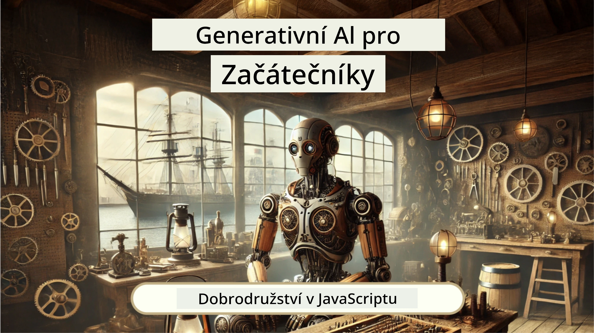
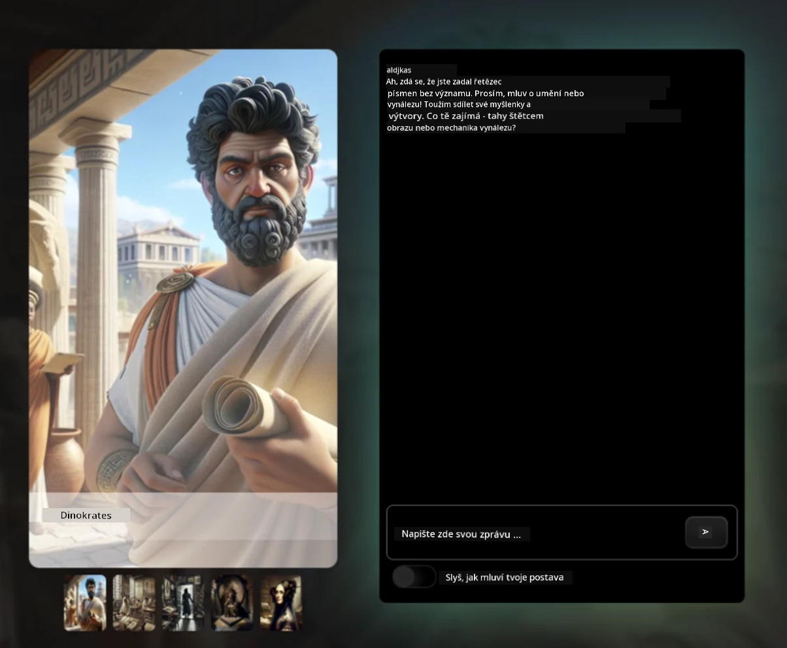
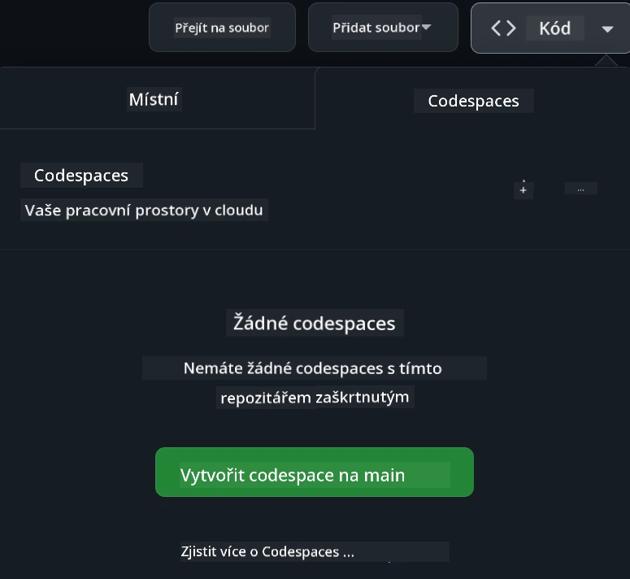

[](https://github.com/microsoft/Web-Dev-For-Beginners/blob/master/LICENSE)
[](https://GitHub.com/microsoft/Web-Dev-For-Beginners/graphs/contributors/)
[](https://GitHub.com/microsoft/Web-Dev-For-Beginners/issues/)
[](https://GitHub.com/microsoft/Web-Dev-For-Beginners/pulls/)
[](http://makeapullrequest.com) 

[](https://GitHub.com/microsoft/Web-Dev-For-Beginners/watchers/)
[](https://GitHub.com/microsoft/Web-Dev-For-Beginners/network/)
[](https://GitHub.com/microsoft/Web-Dev-For-Beginners/stargazers/)

[](https://discord.gg/nTYy5BXMWG)

# Webový vývoj pro začátečníky - Kurikulum

Naučte se základy webového vývoje s naším 12týdenním komplexním kurzem od Microsoft Cloud Advocates. Každá ze 24 lekcí se věnuje JavaScriptu, CSS a HTML prostřednictvím praktických projektů, jako jsou terária, rozšíření pro prohlížeče a vesmírné hry. Zapojte se do kvízů, diskuzí a praktických úkolů. Zlepšete své dovednosti a optimalizujte si uchování znalostí díky naší efektivní metodice založené na projektech. Začněte svou cestu kódováním dnes!

Připojte se k Discordu Azure AI Foundry a potkejte odborníky a další vývojáře.

[](https://discord.gg/nTYy5BXMWG)

Postupujte podle těchto kroků, jak začít používat tyto zdroje:
1. **Vytvořte Fork repozitáře**: Klikněte na [](https://GitHub.com/microsoft/Web-Dev-For-Beginners/fork)
2. **Naklonujte repozitář**: `git clone https://github.com/microsoft/Web-Dev-For-Beginners.git`
3. [**Připojte se k Azure AI Foundry Discordu a potkejte odborníky a další vývojáře**](https://discord.com/invite/ByRwuEEgH4)

### 🌐 Podpora vícejazyčných verzí

#### Podporováno pomocí GitHub Action (automatizováno a vždy aktuální)

<!-- CO-OP TRANSLATOR LANGUAGES TABLE START -->
[Arabic](../ar/README.md) | [Bengali](../bn/README.md) | [Bulgarian](../bg/README.md) | [Burmese (Myanmar)](../my/README.md) | [Chinese (Simplified)](../zh-CN/README.md) | [Chinese (Traditional, Hong Kong)](../zh-HK/README.md) | [Chinese (Traditional, Macau)](../zh-MO/README.md) | [Chinese (Traditional, Taiwan)](../zh-TW/README.md) | [Croatian](../hr/README.md) | [Czech](./README.md) | [Danish](../da/README.md) | [Dutch](../nl/README.md) | [Estonian](../et/README.md) | [Finnish](../fi/README.md) | [French](../fr/README.md) | [German](../de/README.md) | [Greek](../el/README.md) | [Hebrew](../he/README.md) | [Hindi](../hi/README.md) | [Hungarian](../hu/README.md) | [Indonesian](../id/README.md) | [Italian](../it/README.md) | [Japanese](../ja/README.md) | [Kannada](../kn/README.md) | [Khmer](../km/README.md) | [Korean](../ko/README.md) | [Lithuanian](../lt/README.md) | [Malay](../ms/README.md) | [Malayalam](../ml/README.md) | [Marathi](../mr/README.md) | [Nepali](../ne/README.md) | [Nigerian Pidgin](../pcm/README.md) | [Norwegian](../no/README.md) | [Persian (Farsi)](../fa/README.md) | [Polish](../pl/README.md) | [Portuguese (Brazil)](../pt-BR/README.md) | [Portuguese (Portugal)](../pt-PT/README.md) | [Punjabi (Gurmukhi)](../pa/README.md) | [Romanian](../ro/README.md) | [Russian](../ru/README.md) | [Serbian (Cyrillic)](../sr/README.md) | [Slovak](../sk/README.md) | [Slovenian](../sl/README.md) | [Spanish](../es/README.md) | [Swahili](../sw/README.md) | [Swedish](../sv/README.md) | [Tagalog (Filipino)](../tl/README.md) | [Tamil](../ta/README.md) | [Telugu](../te/README.md) | [Thai](../th/README.md) | [Turkish](../tr/README.md) | [Ukrainian](../uk/README.md) | [Urdu](../ur/README.md) | [Vietnamese](../vi/README.md)

> **Preferujete klonovat lokálně?**
>
> Tento repozitář obsahuje přes 50 jazykových překladů, což výrazně zvyšuje velikost stahování. Pro klonování bez překladů použijte sparse checkout:
>
> **Bash / macOS / Linux:**
> ```bash
> git clone --filter=blob:none --sparse https://github.com/microsoft/Web-Dev-For-Beginners.git
> cd Web-Dev-For-Beginners
> git sparse-checkout set --no-cone '/*' '!translations' '!translated_images'
> ```
>
> **CMD (Windows):**
> ```cmd
> git clone --filter=blob:none --sparse https://github.com/microsoft/Web-Dev-For-Beginners.git
> cd Web-Dev-For-Beginners
> git sparse-checkout set --no-cone "/*" "!translations" "!translated_images"
> ```
>
> Tím získáte vše potřebné k dokončení kurzu s mnohem rychlejším stažením.
<!-- CO-OP TRANSLATOR LANGUAGES TABLE END -->

**Pokud si přejete mít další překlady, podporované jazyky jsou uvedeny zde. [zde](https://github.com/Azure/co-op-translator/blob/main/getting_started/supported-languages.md)**

[](https://open.vscode.dev/microsoft/Web-Dev-For-Beginners)

#### 🧑‍🎓 _Jste student?_

Navštivte [**Student Hub stránku**](https://docs.microsoft.com/learn/student-hub/?WT.mc_id=academic-77807-sagibbon), kde najdete zdroje pro začátečníky, studentské balíčky a také možnosti, jak získat bezplatný certifikát. Tuto stránku si nezapomeňte uložit do záložek a pravidelně kontrolovat, protože obsah měníme každý měsíc.

### 📣 Oznámení - Nové výzvy režimu GitHub Copilot Agent k dokončení!

Byla přidána nová výzva, hledejte „GitHub Copilot Agent Challenge 🚀“ v většině kapitol. Jedná se o novou výzvu, kterou máte dokončit pomocí GitHub Copilot a režimu Agent. Pokud jste režim Agent dosud nepoužívali, umožňuje nejen generovat text, ale také vytvářet a upravovat soubory, spouštět příkazy a další.

### 📣 Oznámení - _Nový projekt k vytvoření pomocí Generativní AI_

Byl přidán nový projekt AI asistenta, podívejte se na něj [projekt](./9-chat-project/README.md)

### 📣 Oznámení - _Nové kurikulum_ o Generativní AI pro JavaScript právě vyšlo

Nepromeškejte naše nové kurikulum Generativní AI!

Navštivte [https://aka.ms/genai-js-course](https://aka.ms/genai-js-course) a začněte!



- Lekce pokrývají vše od základů po RAG.
- Komunikujte s historickými postavami pomocí GenAI a naší doprovodné aplikace.
- Zábavný a poutavý příběh, zažijete cestování časem!




Každá lekce obsahuje úkol k dokončení, kontrolu znalostí a výzvu, které vás provedou tématy jako:
- Výzvy a návrh promptů
- Generování textových a obrazových aplikací
- Vyhledávací aplikace

Navštivte [https://aka.ms/genai-js-course](https://aka.ms/genai-js-course) a začněte!

## 🌱 Začínáme

> **Učitelé**, máme [několik návrhů](for-teachers.md), jak používat toto kurikulum. Rádi uvítáme vaše názory [v našem diskuzním fóru](https://github.com/microsoft/Web-Dev-For-Beginners/discussions/categories/teacher-corner)!

**[Studenti](https://aka.ms/student-page/?WT.mc_id=academic-77807-sagibbon)**, ke každé lekci začněte přednáškovým kvízem, pak si přečtěte učební materiál, dokončete různé aktivity a ověřte své porozumění pomocí závěrečného kvízu.

Pro lepší zážitek z učení se propojte s vrstevníky a pracujte na projektech společně! Diskuze jsou vítány v našem [diskuzním fóru](https://github.com/microsoft/Web-Dev-For-Beginners/discussions), kde vám tým moderatorů rád pomůže s dotazy.

Pro další vzdělávání vřele doporučujeme prozkoumat [Microsoft Learn](https://learn.microsoft.com/users/wirelesslife/collections/p1ddcy5jwy0jkm?WT.mc_id=academic-77807-sagibbon) pro doplňující studijní materiály.

### 📋 Nastavení vývojového prostředí

Toto kurikulum má připravené vývojové prostředí! Na začátku si můžete zvolit spuštění kurikula v [Codespace](https://github.com/features/codespaces/) (_prostředí založené na prohlížeči bez nutnosti instalace_), nebo lokálně na vašem počítači pomocí textového editoru, například [Visual Studio Code](https://code.visualstudio.com/?WT.mc_id=academic-77807-sagibbon).

#### Vytvořte si repozitář
Abyste si mohli snadno ukládat svou práci, doporučujeme vytvořit si vlastní kopii tohoto repozitáře. Učiníte tak kliknutím na tlačítko **Use this template** v horní části stránky. Tím se vytvoří nový repozitář ve vašem GitHub účtu s kopií kurikula.

Postupujte takto:
1. **Vytvořte Fork repozitáře**: Klikněte na tlačítko "Fork" v pravém horním rohu této stránky.
2. **Naklonujte repozitář**: `git clone https://github.com/microsoft/Web-Dev-For-Beginners.git`

#### Spuštění kurikula v Codespace

Ve vaší kopii repozitáře, kterou jste vytvořili, klikněte na tlačítko **Code** a zvolte **Open with Codespaces**. Vytvoří se tak nová Codespace, kde můžete pracovat.



#### Spuštění kurikula lokálně na vašem počítači

Pro spuštění kurikula lokálně budete potřebovat textový editor, prohlížeč a nástroj příkazové řádky. Naše první lekce, [Úvod do programovacích jazyků a nástrojů řemesla](../../1-getting-started-lessons/1-intro-to-programming-languages), vás provede různými možnostmi pro každý z těchto nástrojů, abyste si mohli vybrat, co vám nejlépe vyhovuje.

Doporučujeme použít [Visual Studio Code](https://code.visualstudio.com/?WT.mc_id=academic-77807-sagibbon) jako editor, který má také integrovaný [Terminál](https://code.visualstudio.com/docs/terminal/basics/?WT.mc_id=academic-77807-sagibbon). Visual Studio Code si můžete stáhnout [zde](https://code.visualstudio.com/?WT.mc_id=academic-77807-sagibbon).
1. Naklonujte si vaše úložiště do počítače. Uděláte to kliknutím na tlačítko **Code** a zkopírováním URL:

    [CodeSpace](./images/createcodespace.png)

    Poté otevřete [Terminál](https://code.visualstudio.com/docs/terminal/basics/?WT.mc_id=academic-77807-sagibbon) ve [Visual Studio Code](https://code.visualstudio.com/?WT.mc_id=academic-77807-sagibbon) a spusťte následující příkaz, přičemž `<your-repository-url>` nahraďte URL, kterou jste právě zkopírovali:

    ```bash 
    git clone <your-repository-url>
    ```

2. Otevřete ve Visual Studio Code složku. Uděláte to kliknutím na **Soubor** > **Otevřít složku** a vyberte složku, kterou jste právě naklonovali.


>  Doporučené rozšíření pro Visual Studio Code:
>
> * [Live Server](https://marketplace.visualstudio.com/items?itemName=ritwickdey.LiveServer&WT.mc_id=academic-77807-sagibbon) - pro náhled HTML stránek přímo ve Visual Studio Code
> * [Copilot](https://marketplace.visualstudio.com/items?itemName=GitHub.copilot&WT.mc_id=academic-77807-sagibbon) - pro rychlejší psaní kódu

## 📂 Každá lekce obsahuje:

- nepovinné sketchnote
- nepovinné doplňkové video
- předpočáteční kvíz
- písemnou lekci
- u lekcí založených na projektu krok za krokem průvodce výstavbou projektu
- kontrolu znalostí
- výzvu
- doplňující četbu
- zadání
- [povědomostní kvíz po lekci](https://ff-quizzes.netlify.app/web/)

> **Poznámka ke kvízům**: Všechny kvízy jsou uložené ve složce Quiz-app, celkem 48 kvízů po třech otázkách. Jsou dostupné [zde](https://ff-quizzes.netlify.app/web/) a aplikaci kvízů lze spustit lokálně nebo nasadit do Azure; postupujte podle instrukcí ve složce `quiz-app`.

## 🗃️ Lekce

|     |                       Název projektu                      |                            Učené koncepty                            | Učební cíle                                                                                                                  |                                                         Odkaz na lekci                                                          |         Autor          |
| :-: | :-------------------------------------------------------: | :------------------------------------------------------------------: | ---------------------------------------------------------------------------------------------------------------------------- | :----------------------------------------------------------------------------------------------------------------------------: | :--------------------: |
| 01  |                     Začínáme                             |           Úvod do programování a nástroje profese                    | Naučit se základní principy většiny programovacích jazyků a software, který pomáhá profesionálním vývojářům jejich práci       | [Úvod do programovacích jazyků a nástrojů profese](./1-getting-started-lessons/1-intro-to-programming-languages/README.md)     |         Jasmine        |
| 02  |                     Začínáme                             |             Základy GitHubu, týmová práce                            | Jak používat GitHub ve vašem projektu, jak spolupracovat s ostatními na kódu                                                 |                            [Úvod do GitHubu](./1-getting-started-lessons/2-github-basics/README.md)                             |          Floor         |
| 03  |                     Začínáme                             |                             Přístupnost                              | Naučit se základy webové přístupnosti                                                                                        |                       [Základy přístupnosti](./1-getting-started-lessons/3-accessibility/README.md)                             |       Christopher      |
| 04  |                        Základy JS                        |                         Datové typy v JavaScriptu                    | Základy datových typů v JavaScriptu                                                                                          |                                       [Datové typy](./2-js-basics/1-data-types/README.md)                                      |         Jasmine        |
| 05  |                        Základy JS                        |                         Funkce a metody                              | Naučit se o funkcích a metodách pro řízení logiky aplikace                                                                   |                              [Funkce a metody](./2-js-basics/2-functions-methods/README.md)                                     | Jasmine a Christopher  |
| 06  |                        Základy JS                        |                        Rozhodování v JS                             | Naučit se vytvářet podmínky v kódu pomocí rozhodovacích metod                                                               |                                 [Rozhodování](./2-js-basics/3-making-decisions/README.md)                                      |         Jasmine        |
| 07  |                        Základy JS                        |                           Pole a cykly                              | Práce s daty za použití polí a cyklů v JavaScriptu                                                                           |                                   [Pole a cykly](./2-js-basics/4-arrays-loops/README.md)                                      |         Jasmine        |
| 08  |       [Terrárium](./3-terrarium/solution/README.md)       |                           HTML v praxi                              | Vytvořit HTML pro online terárium, se zaměřením na rozvržení                                                                 |                                 [Úvod do HTML](./3-terrarium/1-intro-to-html/README.md)                                      |           Jen          |
| 09  |       [Terrárium](./3-terrarium/solution/README.md)       |                            CSS v praxi                              | Vytvořit CSS pro stylování online terária, zaměřit se na základy CSS a responzivní design                                    |                                  [Úvod do CSS](./3-terrarium/2-intro-to-css/README.md)                                       |           Jen          |
| 10  |            [Terrárium](./3-terrarium/solution/README.md)            |                 JavaScript Closures, manipulace s DOM               | Vytvořit JavaScript pro terárium jako rozhraní drag/drop, zaměřit se na closury a práci s DOM                                  |                  [JavaScript Closures, manipulace s DOM](./3-terrarium/3-intro-to-DOM-and-closures/README.md)                 |           Jen          |
| 11  |          [Hra na psaní](./4-typing-game/solution/README.md)          |                          Vytvoření hry na psaní                     | Naučit se používat klávesové události k řízení logiky JavaScriptové aplikace                                                 |                                [Programování orientované na události](./4-typing-game/typing-game/README.md)                  |       Christopher      |
| 12  | [Rozšíření prohlížeče Green](./5-browser-extension/solution/README.md) |                         Práce s prohlížeči                          | Naučit se, jak fungují prohlížeče, jejich historii a jak vytvořit základy rozšíření prohlížeče                                |                               [O prohlížečích](./5-browser-extension/1-about-browsers/README.md)                             |           Jen          |
| 13  | [Rozšíření prohlížeče Green](./5-browser-extension/solution/README.md) | Vytváření formulářů, volání API a ukládání proměnných do lokálního úložiště | Vytvořit JavaScriptové prvky rozšíření pro volání API s využitím lokálního úložiště                                          |                [API, formuláře a lokální úložiště](./5-browser-extension/2-forms-browsers-local-storage/README.md)            |           Jen          |
| 14  | [Rozšíření prohlížeče Green](./5-browser-extension/solution/README.md) |          Pozadí procesů v prohlížeči, výkonnost webu                | Použít pozadí procesů pro správu ikony rozšíření; naučit se o webové výkonnosti a optimalizacích                            |             [Pozadí a výkonnost](./5-browser-extension/3-background-tasks-and-performance/README.md)                         |           Jen          |
| 15  |           [Hra ve vesmíru](./6-space-game/solution/README.md)           |             Pokročilejší vývoj her v JavaScriptu                    | Naučit se dědičnost pomocí tříd a kompozice a vzor Pub/Sub v přípravě na tvorbu hry                                          |                      [Úvod do pokročilého vývoje her](./6-space-game/1-introduction/README.md)                                  |          Chris         |
| 16  |           [Hra ve vesmíru](./6-space-game/solution/README.md)           |                           Kreslení na canvas                         | Naučit se používat Canvas API, používané pro kreslení prvků na obrazovku                                                   |                                [Kreslení na canvas](./6-space-game/2-drawing-to-canvas/README.md)                               |          Chris         |
| 17  |           [Hra ve vesmíru](./6-space-game/solution/README.md)           |                   Pohyb prvků po obrazovce                           | Objevte, jak prvky získávají pohyb za použití kartézských souřadnic a Canvas API                                             |                           [Pohyb prvků](./6-space-game/3-moving-elements-around/README.md)                                     |          Chris         |
| 18  |           [Hra ve vesmíru](./6-space-game/solution/README.md)           |                          Detekce kolizí                             | Nechte prvky kolidovat a reagovat na sebe pomocí stisků kláves, přidejte funkci cooldown pro zajištění výkonu hry           |                              [Detekce kolizí](./6-space-game/4-collision-detection/README.md)                                  |          Chris         |
| 19  |           [Hra ve vesmíru](./6-space-game/solution/README.md)           |                             Udržování skóre                          | Provádění matematických výpočtů podle stavu a výkonu hry                                                                     |                                    [Udržování skóre](./6-space-game/5-keeping-score/README.md)                                  |          Chris         |
| 20  |           [Hra ve vesmíru](./6-space-game/solution/README.md)           |                     Ukončení a restart hry                           | Naučit se ukončit a restartovat hru včetně úklidu zdrojů a resetování proměnných                                            |                                [Podmínka ukončení](./6-space-game/6-end-condition/README.md)                                   |          Chris         |
| 21  |         [Bankovní aplikace](./7-bank-project/solution/README.md)          |                 HTML šablony a směrování ve webové aplikaci          | Naučit se vytvořit strukturu vícestránkového webu pomocí routingu a HTML šablon                                              |                            [HTML šablony a směrování](./7-bank-project/1-template-route/README.md)                             |          Yohan         |
| 22  |         [Bankovní aplikace](./7-bank-project/solution/README.md)          |                  Vytvoření přihlašovacího a registračního formuláře | Naučit se jak vytvářet formuláře a také jak validovat jejich zadání                                                         |                                           [Formuláře](./7-bank-project/2-forms/README.md)                                    |          Yohan         |
| 23  |         [Bankovní aplikace](./7-bank-project/solution/README.md)          |                   Metody získávání a používání dat                   | Jak data plynou do aplikace a ven, jak je získat, uložit a poté odstranit                                                    |                                            [Data](./7-bank-project/3-data/README.md)                                         |          Yohan         |
| 24  |         [Bankovní aplikace](./7-bank-project/solution/README.md)          |                      Koncepty správy stavů                          | Naučit se, jak aplikace uchovává stav a jak s ním programátorsky pracovat                                                  |                                [Správa stavů](./7-bank-project/4-state-management/README.md)                                   |          Yohan         |
| 25 | [Browser/VScode Code](../../8-code-editor) | Práce s VScode | Naučit se používat editor kódu | [Použití VScode Code Editor](./8-code-editor/1-using-a-code-editor/README.md) | Chris |
| 26 | [AI asistenti](./9-chat-project/README.md) | Práce s AI | Naučit se vytvořit vlastního AI asistenta | [Projekt AI asistenta](./9-chat-project/README.md) | Chris |

## 🏫 Pedagogika

Naše učební osnovy jsou navrženy se dvěma hlavními pedagogickými principy:
* učení založené na projektech
* časté kvízy

Program vyučuje základy JavaScriptu, HTML a CSS, stejně jako nejnovější nástroje a techniky používané dnešními webovými vývojáři. Studenti budou mít příležitost získat praktické zkušenosti tvorbou hry na psaní, virtuálního terária, ekologického rozšíření prohlížeče, hry ve stylu space invader a bankovní aplikace pro podnikání. Na konci série studenti získají pevné základy webového vývoje.

> 🎓 První lekce tohoto kurzu můžete absolvovat jako [Learn Path](https://docs.microsoft.com/learn/paths/web-development-101/?WT.mc_id=academic-77807-sagibbon) na Microsoft Learn!

Zajištěním souladu obsahu s projekty je proces pro studenty více poutavý a lepší je také zapamatování konceptů. Také jsme napsali několik úvodních lekcí o základech JavaScriptu doplněných videi ze sbírky "[Beginners Series to: JavaScript](https://channel9.msdn.com/Series/Beginners-Series-to-JavaScript/?WT.mc_id=academic-77807-sagibbon)", jejichž autoři na tuto osnovu přispěli.

Navíc před hodinou nízkorizikový kvíz nastavit zaměření studenta na téma, zatímco druhý kvíz po hodině zajistí lepší zapamatování. Tento obsah je navržen tak, aby byl flexibilní a zábavný a lze ho absolvovat celý nebo částečně. Projekty začínají jednoduše a během 12 týdnů se stávají stále složitějšími.

Záměrně jsme se vyhnuli zavedení JavaScriptových frameworků, abychom se soustředili na základní dovednosti potřebné pro webového vývojáře před přijetím frameworku; dobrým dalším krokem po dokončení tohoto kurzu je naučit se Node.js skrze další kolekci videí: "[Beginner Series to: Node.js](https://channel9.msdn.com/Series/Beginners-Series-to-Nodejs/?WT.mc_id=academic-77807-sagibbon)".

> Navštivte náš [Kodex chování](CODE_OF_CONDUCT.md) a pokyny k [přispívání](CONTRIBUTING.md). Vítáme vaše konstruktivní připomínky!


## 🧭 Přístup offline

Tuto dokumentaci můžete spustit offline pomocí [Docsify](https://docsify.js.org/#/). Forkněte si toto úložiště, [nainstalujte Docsify](https://docsify.js.org/#/quickstart) na váš místní počítač, a potom v kořenové složce tohoto úložiště napište `docsify serve`. Webová stránka bude dostupná na portu 3000 na localhostu: `localhost:3000`.

## 📘 PDF
PDF všech lekcí najdete [zde](https://microsoft.github.io/Web-Dev-For-Beginners/pdf/readme.pdf).


## 🎒 Další kurzy

Náš tým vyrábí i další kurzy! Podívejte se:

<!-- CO-OP TRANSLATOR OTHER COURSES START -->
### LangChain
[](https://aka.ms/langchain4j-for-beginners)
[](https://aka.ms/langchainjs-for-beginners?WT.mc_id=m365-94501-dwahlin)
[](https://github.com/microsoft/langchain-for-beginners?WT.mc_id=m365-94501-dwahlin)
---

### Azure / Edge / MCP / Agenti
[](https://github.com/microsoft/AZD-for-beginners?WT.mc_id=academic-105485-koreyst)
[](https://github.com/microsoft/edgeai-for-beginners?WT.mc_id=academic-105485-koreyst)
[](https://github.com/microsoft/mcp-for-beginners?WT.mc_id=academic-105485-koreyst)
[](https://github.com/microsoft/ai-agents-for-beginners?WT.mc_id=academic-105485-koreyst)

---
 
### Generativní AI série
[](https://github.com/microsoft/generative-ai-for-beginners?WT.mc_id=academic-105485-koreyst)
[-9333EA?style=for-the-badge&labelColor=E5E7EB&color=9333EA)](https://github.com/microsoft/Generative-AI-for-beginners-dotnet?WT.mc_id=academic-105485-koreyst)
[-C084FC?style=for-the-badge&labelColor=E5E7EB&color=C084FC)](https://github.com/microsoft/generative-ai-for-beginners-java?WT.mc_id=academic-105485-koreyst)
[-E879F9?style=for-the-badge&labelColor=E5E7EB&color=E879F9)](https://github.com/microsoft/generative-ai-with-javascript?WT.mc_id=academic-105485-koreyst)

---
 
### Základní vzdělávání
[](https://aka.ms/ml-beginners?WT.mc_id=academic-105485-koreyst)
[](https://aka.ms/datascience-beginners?WT.mc_id=academic-105485-koreyst)
[](https://aka.ms/ai-beginners?WT.mc_id=academic-105485-koreyst)
[](https://github.com/microsoft/Security-101?WT.mc_id=academic-96948-sayoung)
[](https://aka.ms/webdev-beginners?WT.mc_id=academic-105485-koreyst)
[](https://aka.ms/iot-beginners?WT.mc_id=academic-105485-koreyst)
[](https://github.com/microsoft/xr-development-for-beginners?WT.mc_id=academic-105485-koreyst)

---
 
### Série Copilot
[](https://aka.ms/GitHubCopilotAI?WT.mc_id=academic-105485-koreyst)
[](https://github.com/microsoft/mastering-github-copilot-for-dotnet-csharp-developers?WT.mc_id=academic-105485-koreyst)
[](https://github.com/microsoft/CopilotAdventures?WT.mc_id=academic-105485-koreyst)
<!-- CO-OP TRANSLATOR OTHER COURSES END -->

## Získání pomoci

Pokud se zaseknete nebo máte jakékoli dotazy ohledně vytváření AI aplikací. Přidejte se k ostatním studentům a zkušeným vývojářům v diskusích o MCP. Je to podpůrná komunita, kde jsou otázky vítány a znalosti sdíleny svobodně.

[](https://discord.gg/nTYy5BXMWG)

Pokud máte zpětnou vazbu k produktu nebo narazíte na chyby při vývoji, navštivte:

[](https://aka.ms/foundry/forum)

## Licence

Tento repozitář je licencován pod licencí MIT. Více informací naleznete v souboru [LICENSE](../../LICENSE).

---

<!-- CO-OP TRANSLATOR DISCLAIMER START -->
**Disclaimer**:  
Tento dokument byl přeložen pomocí AI překladatelské služby [Co-op Translator](https://github.com/Azure/co-op-translator). I když usilujeme o přesnost, mějte prosím na paměti, že automatické překlady mohou obsahovat chyby nebo nepřesnosti. Původní dokument v jeho mateřském jazyce by měl být považován za autoritativní zdroj. Pro kritické informace se doporučuje profesionální lidský překlad. Nejsme odpovědni za jakékoliv nedorozumění nebo mylné výklady vyplývající z použití tohoto překladu.
<!-- CO-OP TRANSLATOR DISCLAIMER END -->